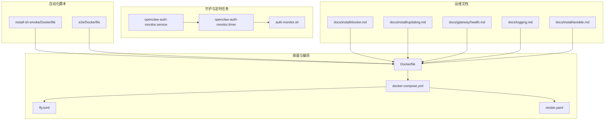
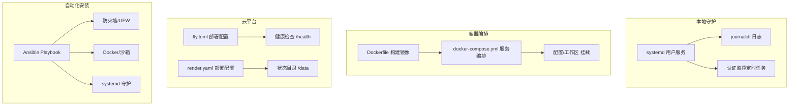
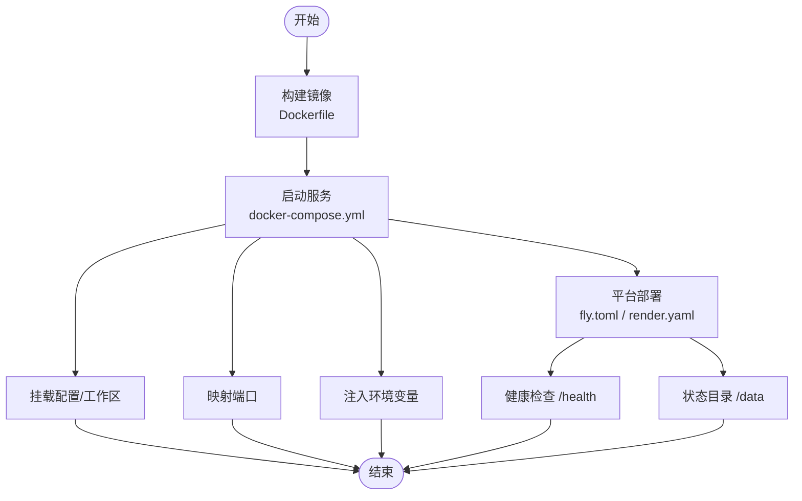
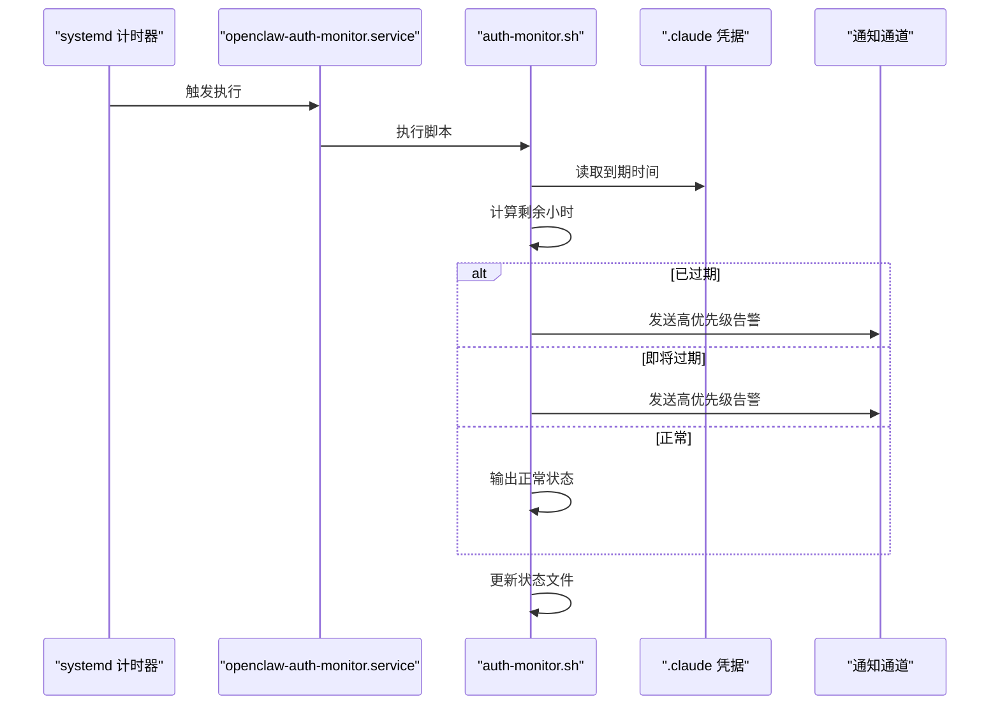
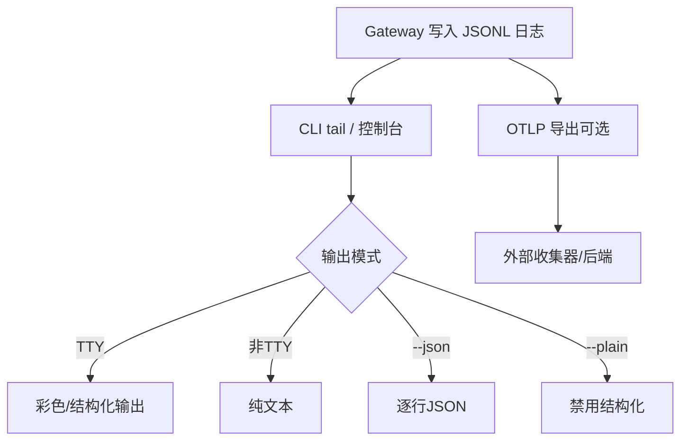
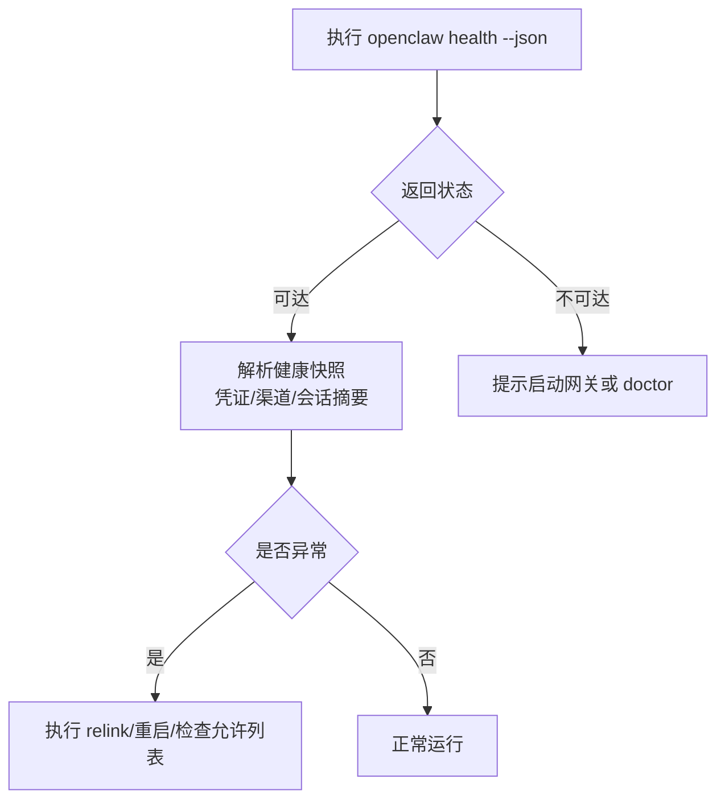
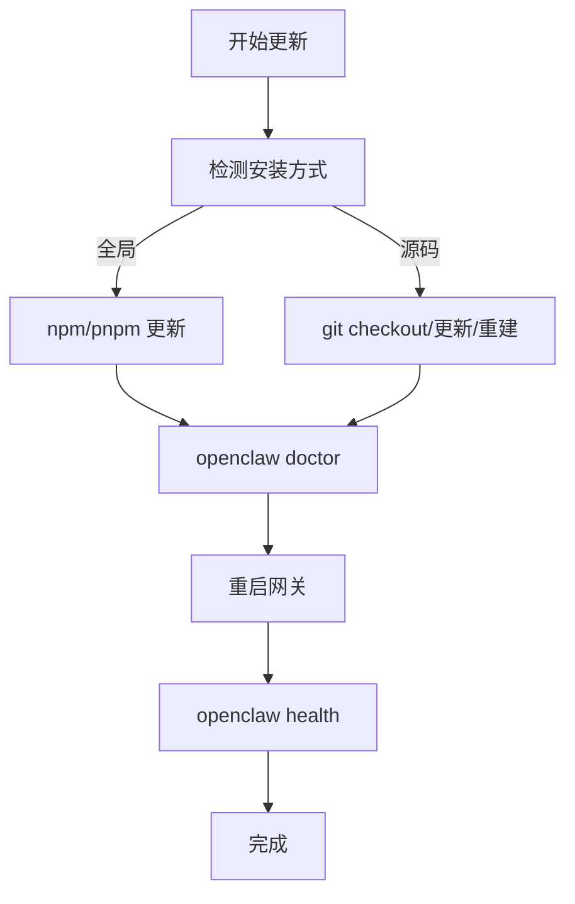
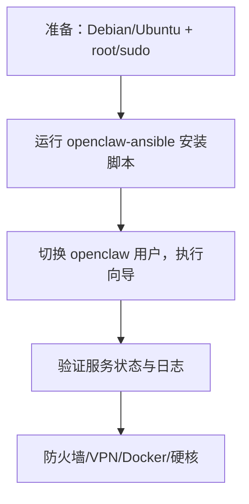
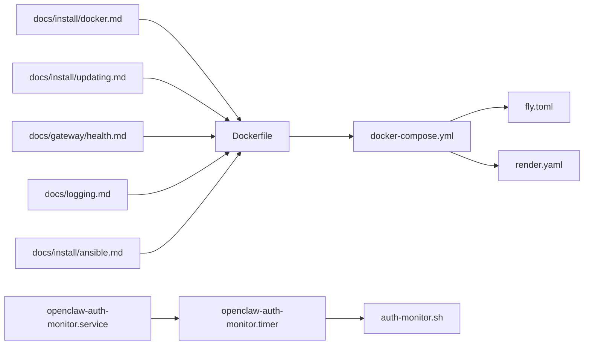

# 运维维护实践

<cite>
**本文引用的文件**
- [README.md](file://README.md)
- [Dockerfile](file://Dockerfile)
- [docker-compose.yml](file://docker-compose.yml)
- [fly.toml](file://fly.toml)
- [render.yaml](file://render.yaml)
- [scripts/systemd/openclaw-auth-monitor.service](file://scripts/systemd/openclaw-auth-monitor.service)
- [scripts/systemd/openclaw-auth-monitor.timer](file://scripts/systemd/openclaw-auth-monitor.timer)
- [scripts/auth-monitor.sh](file://scripts/auth-monitor.sh)
- [docs/install/docker.md](file://docs/install/docker.md)
- [docs/install/updating.md](file://docs/install/updating.md)
- [docs/gateway/health.md](file://docs/gateway/health.md)
- [docs/logging.md](file://docs/logging.md)
- [docs/install/ansible.md](file://docs/install/ansible.md)
- [scripts/docker/install-sh-smoke/Dockerfile](file://scripts/docker/install-sh-smoke/Dockerfile)
- [scripts/e2e/Dockerfile](file://scripts/e2e/Dockerfile)
</cite>

## 目录

1. [简介](#简介)
2. [项目结构](#项目结构)
3. [核心组件](#核心组件)
4. [架构总览](#架构总览)
5. [详细组件分析](#详细组件分析)
6. [依赖关系分析](#依赖关系分析)
7. [性能考虑](#性能考虑)
8. [故障排查指南](#故障排查指南)
9. [结论](#结论)
10. [附录](#附录)

## 简介

本指南面向OpenClaw项目的运维与维护团队，提供从部署策略、环境配置、基础设施管理到监控告警、日志管理、故障诊断、备份恢复、数据迁移、灾难恢复、自动化运维脚本、CI/CD与发布管理、系统升级与回滚、工具使用、性能监控与容量规划等全栈运维实践。内容基于仓库中的安装文档、容器化配置、健康检查与日志说明、认证监控脚本以及平台部署示例进行提炼与整合，确保在不同运行环境中（本地开发、容器编排、云平台、自动化安装）均能落地执行。

## 项目结构

OpenClaw的运维相关资产主要分布在以下区域：

- 容器与编排：Dockerfile、docker-compose.yml、fly.toml、render.yaml
- 运行时守护与定时任务：systemd服务与计时器单元
- 自动化脚本：认证过期监控、Smoke测试镜像、端到端测试镜像
- 文档：安装、更新、健康检查、日志、Ansible自动化安装等运维文档

图示来源

- [Dockerfile](file://Dockerfile#L1-L49)
- [docker-compose.yml](file://docker-compose.yml#L1-L47)
- [fly.toml](file://fly.toml#L1-L35)
- [render.yaml](file://render.yaml#L1-L22)
- [scripts/systemd/openclaw-auth-monitor.service](file://scripts/systemd/openclaw-auth-monitor.service#L1-L15)
- [scripts/systemd/openclaw-auth-monitor.timer](file://scripts/systemd/openclaw-auth-monitor.timer#L1-L11)
- [scripts/auth-monitor.sh](file://scripts/auth-monitor.sh#L1-L90)
- [scripts/docker/install-sh-smoke/Dockerfile](file://scripts/docker/install-sh-smoke/Dockerfile#L1-L22)
- [scripts/e2e/Dockerfile](file://scripts/e2e/Dockerfile#L1-L24)
- [docs/install/docker.md](file://docs/install/docker.md#L1-L586)
- [docs/install/updating.md](file://docs/install/updating.md#L1-L232)
- [docs/gateway/health.md](file://docs/gateway/health.md#L1-L36)
- [docs/logging.md](file://docs/logging.md#L1-L351)
- [docs/install/ansible.md](file://docs/install/ansible.md#L1-L209)

章节来源

- [Dockerfile](file://Dockerfile#L1-L49)
- [docker-compose.yml](file://docker-compose.yml#L1-L47)
- [fly.toml](file://fly.toml#L1-L35)
- [render.yaml](file://render.yaml#L1-L22)
- [scripts/systemd/openclaw-auth-monitor.service](file://scripts/systemd/openclaw-auth-monitor.service#L1-L15)
- [scripts/systemd/openclaw-auth-monitor.timer](file://scripts/systemd/openclaw-auth-monitor.timer#L1-L11)
- [scripts/auth-monitor.sh](file://scripts/auth-monitor.sh#L1-L90)
- [docs/install/docker.md](file://docs/install/docker.md#L1-L586)
- [docs/install/updating.md](file://docs/install/updating.md#L1-L232)
- [docs/gateway/health.md](file://docs/gateway/health.md#L1-L36)
- [docs/logging.md](file://docs/logging.md#L1-L351)
- [docs/install/ansible.md](file://docs/install/ansible.md#L1-L209)

## 核心组件

- 容器镜像与构建：基于Node.js 22的官方镜像，启用Corepack与Bun，构建并以非root用户运行，支持通过环境变量注入额外系统包与参数。
- 编排与持久化：Compose服务定义网关与CLI容器，挂载配置与工作区目录；Fly.io与Render提供云平台部署模板，含状态目录与健康检查路径。
- 认证监控：systemd服务与计时器周期性执行认证过期检查脚本，支持通过OpenClaw通道或ntfy推送告警，并记录状态避免重复通知。
- 日志与可观测性：文件日志（JSON Lines）与控制台输出双通道；支持通过插件导出OpenTelemetry指标与追踪至OTLP收集器。
- 健康检查：CLI命令可查询运行中网关健康快照，辅助定位渠道连接问题。
- 自动化安装与更新：提供一键安装脚本、更新与回滚策略，以及Ansible自动化安装方案。

章节来源

- [Dockerfile](file://Dockerfile#L1-L49)
- [docker-compose.yml](file://docker-compose.yml#L1-L47)
- [fly.toml](file://fly.toml#L1-L35)
- [render.yaml](file://render.yaml#L1-L22)
- [scripts/systemd/openclaw-auth-monitor.service](file://scripts/systemd/openclaw-auth-monitor.service#L1-L15)
- [scripts/systemd/openclaw-auth-monitor.timer](file://scripts/systemd/openclaw-auth-monitor.timer#L1-L11)
- [scripts/auth-monitor.sh](file://scripts/auth-monitor.sh#L1-L90)
- [docs/logging.md](file://docs/logging.md#L1-L351)
- [docs/gateway/health.md](file://docs/gateway/health.md#L1-L36)
- [docs/install/updating.md](file://docs/install/updating.md#L1-L232)
- [docs/install/ansible.md](file://docs/install/ansible.md#L1-L209)

## 架构总览

下图展示OpenClaw在不同运行环境下的运维架构：本地守护进程、容器编排、云平台托管与自动化安装四类场景的交互关系与关键配置点。

图示来源

- [Dockerfile](file://Dockerfile#L1-L49)
- [docker-compose.yml](file://docker-compose.yml#L1-L47)
- [fly.toml](file://fly.toml#L1-L35)
- [render.yaml](file://render.yaml#L1-L22)
- [scripts/systemd/openclaw-auth-monitor.service](file://scripts/systemd/openclaw-auth-monitor.service#L1-L15)
- [scripts/systemd/openclaw-auth-monitor.timer](file://scripts/systemd/openclaw-auth-monitor.timer#L1-L11)
- [docs/install/ansible.md](file://docs/install/ansible.md#L1-L209)

## 详细组件分析

### 容器化与编排

- 构建策略：固定Node版本基础镜像，启用Corepack与Bun，按依赖层顺序优化缓存，生产环境设置NODE_ENV并以非root用户运行，降低容器逃逸风险。
- Compose服务：定义网关与CLI服务，挂载配置与工作区目录，暴露端口，设置重启策略；支持通过环境变量注入令牌与第三方凭据。
- 平台部署：Fly.io与Render提供健康检查路径、状态目录与磁盘挂载，便于持久化与弹性扩缩容。

图示来源

- [Dockerfile](file://Dockerfile#L1-L49)
- [docker-compose.yml](file://docker-compose.yml#L1-L47)
- [fly.toml](file://fly.toml#L1-L35)
- [render.yaml](file://render.yaml#L1-L22)

章节来源

- [Dockerfile](file://Dockerfile#L1-L49)
- [docker-compose.yml](file://docker-compose.yml#L1-L47)
- [fly.toml](file://fly.toml#L1-L35)
- [render.yaml](file://render.yaml#L1-L22)
- [docs/install/docker.md](file://docs/install/docker.md#L1-L586)

### 认证监控与告警

- 定时任务：systemd计时器每30分钟触发一次认证过期检查。
- 脚本逻辑：读取Claude凭据到期时间，计算剩余小时数；在即将过期或已过期时发送告警（OpenClaw消息或ntfy），并记录状态避免频繁打扰。
- 可配置项：告警阈值（小时）、通知手机号、ntfy主题、状态文件位置。

图示来源

- [scripts/systemd/openclaw-auth-monitor.service](file://scripts/systemd/openclaw-auth-monitor.service#L1-L15)
- [scripts/systemd/openclaw-auth-monitor.timer](file://scripts/systemd/openclaw-auth-monitor.timer#L1-L11)
- [scripts/auth-monitor.sh](file://scripts/auth-monitor.sh#L1-L90)

章节来源

- [scripts/systemd/openclaw-auth-monitor.service](file://scripts/systemd/openclaw-auth-monitor.service#L1-L15)
- [scripts/systemd/openclaw-auth-monitor.timer](file://scripts/systemd/openclaw-auth-monitor.timer#L1-L11)
- [scripts/auth-monitor.sh](file://scripts/auth-monitor.sh#L1-L90)

### 日志管理与可观测性

- 文件日志：默认写入/tmp/openclaw目录，按日期滚动；可通过配置覆盖路径。
- 控制台输出：TTY感知格式化输出，支持多种模式（pretty/compact/json/plain/no-color）。
- 诊断事件：结构化事件用于模型调用与消息流遥测，可导出至OTLP收集器。
- CLI与控制台：提供实时日志尾随、过滤与JSON输出能力，便于快速定位问题。

图示来源

- [docs/logging.md](file://docs/logging.md#L1-L351)

章节来源

- [docs/logging.md](file://docs/logging.md#L1-L351)

### 健康检查与故障诊断

- CLI健康快照：查询运行中网关健康状态，返回凭证年龄、渠道探测摘要、会话存储摘要等信息。
- 常见问题处理：登录状态异常时执行重新登录流程；确认设备在线与允许列表；检查会话存储与凭据文件时间戳。

图示来源

- [docs/gateway/health.md](file://docs/gateway/health.md#L1-L36)

章节来源

- [docs/gateway/health.md](file://docs/gateway/health.md#L1-L36)

### 自动化安装与更新

- 一键安装：提供curl安装脚本，支持全局安装与源码安装两种方式；可选择跳过向导。
- 更新流程：推荐重新运行安装脚本进行原地升级；或使用openclaw update进行源码安装更新；Control UI提供“更新与重启”RPC。
- 回滚策略：全局安装可固定版本；源码安装可按日期回退到指定提交；更新前后务必运行doctor与health。

图示来源

- [docs/install/updating.md](file://docs/install/updating.md#L1-L232)

章节来源

- [docs/install/updating.md](file://docs/install/updating.md#L1-L232)

### Ansible自动化安装

- 安全架构：UFW防火墙仅开放SSH与Tailscale端口；Docker隔离；systemd硬核；Tailscale Mesh VPN提供安全远程访问。
- 组件清单：安装Tailscale、UFW、Docker、Node.js与pnpm、OpenClaw与systemd服务。
- 故障排查：检查systemd状态、journalctl日志、Docker可用性与沙箱镜像。

图示来源

- [docs/install/ansible.md](file://docs/install/ansible.md#L1-L209)

章节来源

- [docs/install/ansible.md](file://docs/install/ansible.md#L1-L209)

### 测试与Smoke镜像

- 安装Smoke镜像：最小化系统包集合，用于验证安装流程与网络连通性。
- 端到端测试镜像：完整复制源码树，安装依赖并构建，作为测试环境基线。

章节来源

- [scripts/docker/install-sh-smoke/Dockerfile](file://scripts/docker/install-sh-smoke/Dockerfile#L1-L22)
- [scripts/e2e/Dockerfile](file://scripts/e2e/Dockerfile#L1-L24)

## 依赖关系分析

- 容器镜像依赖：Node.js 22、Corepack、Bun、系统包（可选）。
- Compose服务依赖：配置与工作区目录挂载、端口映射、环境变量注入。
- 云平台依赖：健康检查路径、状态目录与磁盘挂载。
- 守护与定时任务：systemd服务与计时器对脚本执行的耦合。
- 文档与脚本：运维文档指导容器化、更新、健康检查与日志配置，脚本实现具体自动化动作。

图示来源

- [Dockerfile](file://Dockerfile#L1-L49)
- [docker-compose.yml](file://docker-compose.yml#L1-L47)
- [fly.toml](file://fly.toml#L1-L35)
- [render.yaml](file://render.yaml#L1-L22)
- [scripts/systemd/openclaw-auth-monitor.service](file://scripts/systemd/openclaw-auth-monitor.service#L1-L15)
- [scripts/systemd/openclaw-auth-monitor.timer](file://scripts/systemd/openclaw-auth-monitor.timer#L1-L11)
- [scripts/auth-monitor.sh](file://scripts/auth-monitor.sh#L1-L90)
- [docs/install/docker.md](file://docs/install/docker.md#L1-L586)
- [docs/install/updating.md](file://docs/install/updating.md#L1-L232)
- [docs/gateway/health.md](file://docs/gateway/health.md#L1-L36)
- [docs/logging.md](file://docs/logging.md#L1-L351)
- [docs/install/ansible.md](file://docs/install/ansible.md#L1-L209)

## 性能考虑

- 容器构建缓存：保持依赖层稳定，减少不必要的重装步骤，缩短构建时间。
- 运行内存：Fly.io示例设置了Node堆大小参数，可根据实际负载调整。
- 日志级别：生产环境建议适度提高日志级别，结合OTLP采样与过滤控制日志体积。
- 会话与队列：关注队列深度与等待时间指标，必要时调整并发与资源限制。
- 网络与DNS：沙箱容器默认无网络，如需外联应明确配置网络、DNS与主机映射。

## 故障排查指南

- 网关不可达：先运行doctor，再检查服务状态与日志；确认端口占用与绑定地址。
- 渠道连接失败：检查凭据文件时间戳、会话存储、允许列表与提及规则；必要时执行重新登录。
- 日志为空：确认Gateway正在运行且写入路径正确；尝试提升日志级别。
- 认证过期：启用systemd计时器，确保通知通道可用；定期检查状态文件。
- 云平台健康检查失败：确认健康检查路径与状态目录挂载；检查平台日志与实例状态。

章节来源

- [docs/gateway/health.md](file://docs/gateway/health.md#L1-L36)
- [docs/logging.md](file://docs/logging.md#L1-L351)
- [scripts/auth-monitor.sh](file://scripts/auth-monitor.sh#L1-L90)
- [fly.toml](file://fly.toml#L1-L35)
- [render.yaml](file://render.yaml#L1-L22)

## 结论

通过容器化与编排、云平台部署模板、systemd守护与定时任务、完善的日志与可观测性、标准化的健康检查与更新回滚流程，以及Ansible自动化安装的安全架构，OpenClaw在多环境下实现了可审计、可扩展、可恢复的运维体系。建议在生产环境中统一采用容器或Ansible方案，配合认证监控与OTLP导出，持续优化日志与指标策略，确保系统的稳定性与可维护性。

## 附录

- 备份与恢复：建议将配置目录与工作区目录纳入定期备份策略，结合云平台磁盘挂载与状态目录实现快速恢复。
- 数据迁移：遵循更新前快照与doctor迁移原则，逐步推进；涉及渠道登录时注意重新授权流程。
- 灾难恢复：结合云平台健康检查与自动启停策略，制定故障切换与恢复演练；保留历史日志与诊断事件以便复盘。
