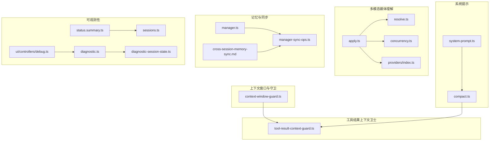
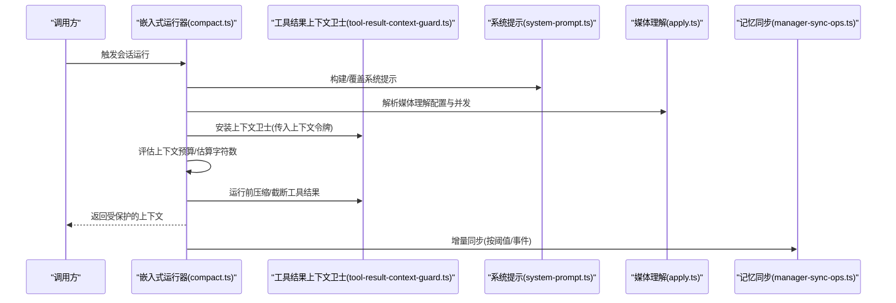
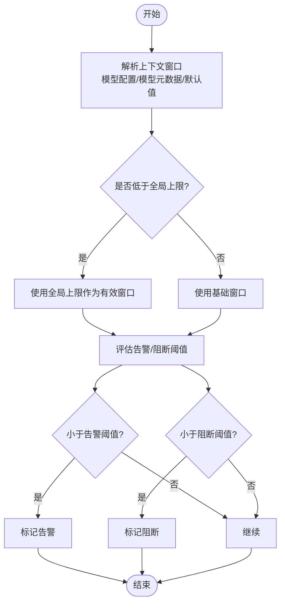
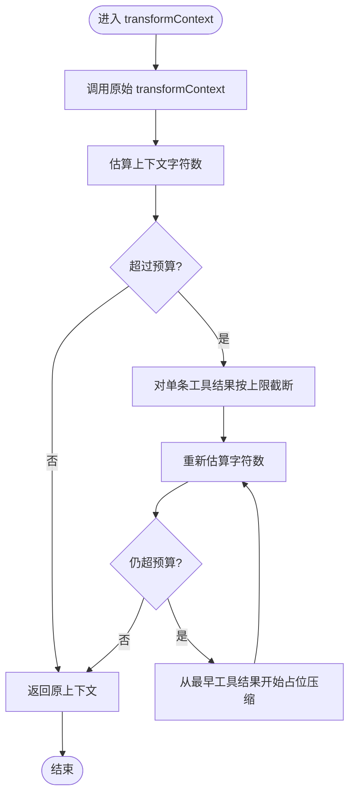
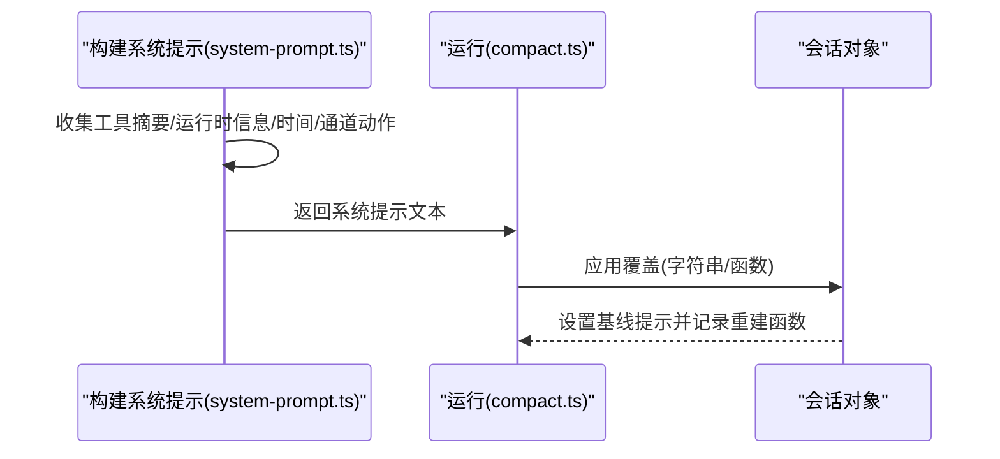
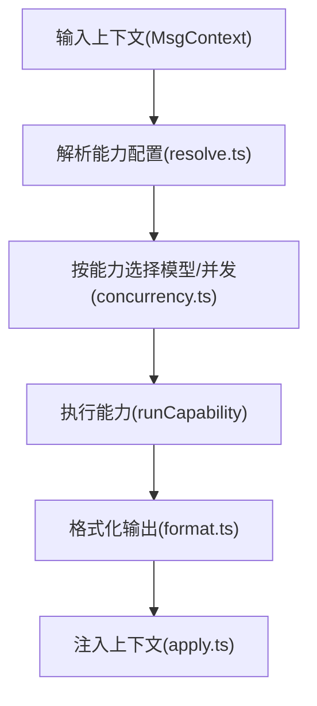
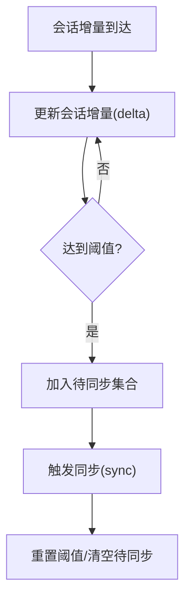
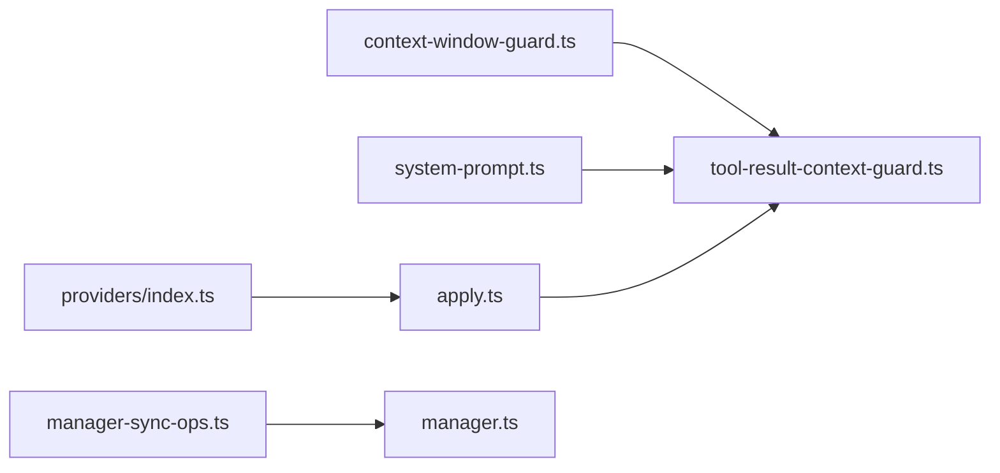

# 上下文管理

<cite>
**本文引用的文件**
- [src/agents/context-window-guard.ts](file://src/agents/context-window-guard.ts)
- [src/agents/pi-embedded-runner/tool-result-context-guard.ts](file://src/agents/pi-embedded-runner/tool-result-context-guard.ts)
- [src/agents/pi-embedded-runner/system-prompt.ts](file://src/agents/pi-embedded-runner/system-prompt.ts)
- [src/agents/pi-embedded-runner/compact.ts](file://src/agents/pi-embedded-runner/compact.ts)
- [src/media-understanding/apply.ts](file://src/media-understanding/apply.ts)
- [src/media-understanding/resolve.ts](file://src/media-understanding/resolve.ts)
- [src/media-understanding/concurrency.ts](file://src/media-understanding/concurrency.ts)
- [src/media-understanding/providers/index.ts](file://src/media-understanding/providers/index.ts)
- [src/memory/manager-sync-ops.ts](file://src/memory/manager-sync-ops.ts)
- [src/memory/manager.ts](file://src/memory/manager.ts)
- [docs/design/cross-session-memory-sync.md](file://docs/design/cross-session-memory-sync.md)
- [dist/plugin-sdk/agents/context.d.ts](file://dist/plugin-sdk/agents/context.d.ts)
- [src/commands/status.summary.ts](file://src/commands/status.summary.ts)
- [src/commands/sessions.ts](file://src/commands/sessions.ts)
- [src/agents/usage.normalization.test.ts](file://src/agents/usage.normalization.test.ts)
- [src/logging/diagnostic.ts](file://src/logging/diagnostic.ts)
- [src/logging/diagnostic-session-state.ts](file://src/logging/diagnostic-session-state.ts)
- [ui/src/ui/controllers/debug.ts](file://ui/src/ui/controllers/debug.ts)
</cite>

## 目录

1. [简介](#简介)
2. [项目结构](#项目结构)
3. [核心组件](#核心组件)
4. [架构总览](#架构总览)
5. [组件详解](#组件详解)
6. [依赖关系分析](#依赖关系分析)
7. [性能考量](#性能考量)
8. [故障排除指南](#故障排除指南)
9. [结论](#结论)
10. [附录](#附录)

## 简介

本文件系统性梳理 OpenClaw 的上下文管理系统，围绕“代理上下文的构建、维护与优化”展开，重点覆盖：

- 上下文窗口限制与令牌计算
- 内容压缩与溢出保护（上下文卫士）
- 系统提示的生成、参数注入与动态调整
- 上下文状态的持久化、恢复与跨会话同步
- 多模态内容处理、媒体理解与上下文扩展
- 最佳实践与调试排障

## 项目结构

OpenClaw 将上下文管理能力分布在多个子模块中：

- 上下文窗口解析与守卫：负责从配置、模型元数据与默认值中解析可用上下文窗口，并进行告警与阻断判定
- 工具结果上下文卫士：在消息进入推理前对工具输出进行预算评估与裁剪，避免整体上下文超限
- 系统提示构建与覆盖：集中生成系统提示，支持覆盖与动态注入运行时参数
- 多模态媒体理解：按能力维度解析模型与并发策略，统一输出格式并注入上下文
- 记忆与跨会话同步：管理本地/远程存储，实现增量同步与跨会话可见性
- 可观测性与诊断：命令行与 UI 调试接口，会话状态跟踪与日志

**图表来源**

- [src/agents/context-window-guard.ts](file://src/agents/context-window-guard.ts#L1-L75)
- [src/agents/pi-embedded-runner/tool-result-context-guard.ts](file://src/agents/pi-embedded-runner/tool-result-context-guard.ts#L1-L337)
- [src/agents/pi-embedded-runner/system-prompt.ts](file://src/agents/pi-embedded-runner/system-prompt.ts#L1-L107)
- [src/agents/pi-embedded-runner/compact.ts](file://src/agents/pi-embedded-runner/compact.ts#L1-L200)
- [src/media-understanding/apply.ts](file://src/media-understanding/apply.ts#L1-L200)
- [src/media-understanding/resolve.ts](file://src/media-understanding/resolve.ts#L36-L147)
- [src/media-understanding/concurrency.ts](file://src/media-understanding/concurrency.ts#L1-L18)
- [src/media-understanding/providers/index.ts](file://src/media-understanding/providers/index.ts#L1-L31)
- [src/memory/manager.ts](file://src/memory/manager.ts#L606-L640)
- [src/memory/manager-sync-ops.ts](file://src/memory/manager-sync-ops.ts#L122-L465)
- [docs/design/cross-session-memory-sync.md](file://docs/design/cross-session-memory-sync.md#L59-L91)
- [src/commands/status.summary.ts](file://src/commands/status.summary.ts#L148-L156)
- [src/commands/sessions.ts](file://src/commands/sessions.ts#L34-L68)
- [src/logging/diagnostic.ts](file://src/logging/diagnostic.ts#L169-L202)
- [src/logging/diagnostic-session-state.ts](file://src/logging/diagnostic-session-state.ts#L79-L103)
- [ui/src/ui/controllers/debug.ts](file://ui/src/ui/controllers/debug.ts#L45-L60)

**章节来源**

- [src/agents/context-window-guard.ts](file://src/agents/context-window-guard.ts#L1-L75)
- [src/agents/pi-embedded-runner/tool-result-context-guard.ts](file://src/agents/pi-embedded-runner/tool-result-context-guard.ts#L1-L337)
- [src/agents/pi-embedded-runner/system-prompt.ts](file://src/agents/pi-embedded-runner/system-prompt.ts#L1-L107)
- [src/agents/pi-embedded-runner/compact.ts](file://src/agents/pi-embedded-runner/compact.ts#L1-L200)
- [src/media-understanding/apply.ts](file://src/media-understanding/apply.ts#L1-L200)
- [src/media-understanding/resolve.ts](file://src/media-understanding/resolve.ts#L36-L147)
- [src/media-understanding/concurrency.ts](file://src/media-understanding/concurrency.ts#L1-L18)
- [src/media-understanding/providers/index.ts](file://src/media-understanding/providers/index.ts#L1-L31)
- [src/memory/manager.ts](file://src/memory/manager.ts#L606-L640)
- [src/memory/manager-sync-ops.ts](file://src/memory/manager-sync-ops.ts#L122-L465)
- [docs/design/cross-session-memory-sync.md](file://docs/design/cross-session-memory-sync.md#L59-L91)
- [src/commands/status.summary.ts](file://src/commands/status.summary.ts#L148-L156)
- [src/commands/sessions.ts](file://src/commands/sessions.ts#L34-L68)
- [src/logging/diagnostic.ts](file://src/logging/diagnostic.ts#L169-L202)
- [src/logging/diagnostic-session-state.ts](file://src/logging/diagnostic-session-state.ts#L79-L103)
- [ui/src/ui/controllers/debug.ts](file://ui/src/ui/controllers/debug.ts#L45-L60)

## 核心组件

- 上下文窗口解析与守卫：从配置与模型元数据解析可用上下文窗口，结合全局上限进行裁剪，并给出告警/阻断建议
- 工具结果上下文卫士：在推理前对工具输出进行字符级预算评估与裁剪，优先压缩最老的工具结果，必要时对单条超大结果进行截断并标注
- 系统提示构建与覆盖：集中生成系统提示，支持覆盖函数/字符串，注入运行时参数（时间、通道、沙箱、工具摘要等），并在会话中持久化基线提示
- 多模态媒体理解：按能力维度解析模型与并发策略，统一输出格式并注入上下文；支持多种提供商与能力映射
- 记忆与跨会话同步：管理增量同步、会话级变更阈值、定时/事件驱动同步，解决“跨会话无记忆”的感知问题
- 可观测性与诊断：命令行与 UI 提供上下文统计、会话状态跟踪与调试调用入口

**章节来源**

- [src/agents/context-window-guard.ts](file://src/agents/context-window-guard.ts#L21-L74)
- [src/agents/pi-embedded-runner/tool-result-context-guard.ts](file://src/agents/pi-embedded-runner/tool-result-context-guard.ts#L297-L337)
- [src/agents/pi-embedded-runner/system-prompt.ts](file://src/agents/pi-embedded-runner/system-prompt.ts#L56-L106)
- [src/media-understanding/apply.ts](file://src/media-understanding/apply.ts#L1-L200)
- [src/memory/manager-sync-ops.ts](file://src/memory/manager-sync-ops.ts#L429-L465)
- [src/commands/status.summary.ts](file://src/commands/status.summary.ts#L148-L156)

## 架构总览

OpenClaw 的上下文管理以“运行前评估 + 运行中保护 + 运行后沉淀”为主线：

- 运行前：解析上下文窗口，应用全局上限；构建系统提示并注入运行时参数；评估媒体理解输入规模与并发
- 运行中：对工具结果进行预算评估与压缩，确保整体上下文不超限；对单条超大结果进行截断并标注
- 运行后：将会话历史与记忆写入存储，按阈值触发增量同步，实现跨会话可见性

**图表来源**

- [src/agents/pi-embedded-runner/compact.ts](file://src/agents/pi-embedded-runner/compact.ts#L1-L200)
- [src/agents/pi-embedded-runner/tool-result-context-guard.ts](file://src/agents/pi-embedded-runner/tool-result-context-guard.ts#L297-L337)
- [src/agents/pi-embedded-runner/system-prompt.ts](file://src/agents/pi-embedded-runner/system-prompt.ts#L56-L106)
- [src/media-understanding/apply.ts](file://src/media-understanding/apply.ts#L1-L200)
- [src/memory/manager-sync-ops.ts](file://src/memory/manager-sync-ops.ts#L429-L465)

## 组件详解

### 上下文窗口解析与守卫

- 解析顺序：模型配置 > 模型元数据 > 默认值；随后与全局“代理上下文令牌”上限比较，取较小者
- 告警与阻断：基于预设阈值（如 32k 告警、16k 阻断）进行判断，避免低窗口模型引发失败
- 导出类型与常量：用于插件 SDK 的上下文查询与覆盖

**图表来源**

- [src/agents/context-window-guard.ts](file://src/agents/context-window-guard.ts#L21-L74)
- [dist/plugin-sdk/agents/context.d.ts](file://dist/plugin-sdk/agents/context.d.ts#L16-L33)

**章节来源**

- [src/agents/context-window-guard.ts](file://src/agents/context-window-guard.ts#L1-L75)
- [dist/plugin-sdk/agents/context.d.ts](file://dist/plugin-sdk/agents/context.d.ts#L1-L34)

### 工具结果上下文卫士

- 预算计算：根据上下文令牌估算字符预算与“输入头存”，并为单条工具结果设定上限
- 压缩策略：先对最老的工具结果进行占位压缩，再回填剩余预算；对单条超大结果进行截断并添加“超出上下文限制”的提示
- 估计方法：针对不同角色的消息采用不同的字符估计策略（文本、图像、未知块）

**图表来源**

- [src/agents/pi-embedded-runner/tool-result-context-guard.ts](file://src/agents/pi-embedded-runner/tool-result-context-guard.ts#L297-L337)
- [src/agents/pi-embedded-runner/tool-result-context-guard.ts](file://src/agents/pi-embedded-runner/tool-result-context-guard.ts#L269-L295)

**章节来源**

- [src/agents/pi-embedded-runner/tool-result-context-guard.ts](file://src/agents/pi-embedded-runner/tool-result-context-guard.ts#L1-L337)

### 系统提示生成、参数注入与动态调整

- 构建流程：集中生成系统提示，注入工具名称与摘要、运行时信息（主机、模型、通道动作）、时间与时区、沙箱信息、技能提示等
- 覆盖机制：支持字符串或函数形式的覆盖，覆盖后会更新会话基线提示，保证后续重建一致
- 动态调整：在运行前可追加额外提示，形成“追加式系统提示”，便于临时注入上下文

**图表来源**

- [src/agents/pi-embedded-runner/system-prompt.ts](file://src/agents/pi-embedded-runner/system-prompt.ts#L56-L106)
- [src/agents/pi-embedded-runner/compact.ts](file://src/agents/pi-embedded-runner/compact.ts#L484-L514)

**章节来源**

- [src/agents/pi-embedded-runner/system-prompt.ts](file://src/agents/pi-embedded-runner/system-prompt.ts#L1-L107)
- [src/agents/pi-embedded-runner/compact.ts](file://src/agents/pi-embedded-runner/compact.ts#L484-L514)

### 多模态内容处理与媒体理解

- 能力解析：按能力（图像/音频/视频/文件）解析模型配置、最大字符/字节限制、并发度
- 并发控制：统一并发限制，失败任务可选择性记录日志
- 提供商映射：标准化提供商 ID（如 gemini -> google），支持多提供商注册
- 输出注入：将媒体理解结果格式化并注入上下文，保持顺序（图像、音频、视频）

**图表来源**

- [src/media-understanding/resolve.ts](file://src/media-understanding/resolve.ts#L36-L147)
- [src/media-understanding/concurrency.ts](file://src/media-understanding/concurrency.ts#L1-L18)
- [src/media-understanding/providers/index.ts](file://src/media-understanding/providers/index.ts#L1-L31)
- [src/media-understanding/apply.ts](file://src/media-understanding/apply.ts#L1-L200)

**章节来源**

- [src/media-understanding/resolve.ts](file://src/media-understanding/resolve.ts#L36-L147)
- [src/media-understanding/concurrency.ts](file://src/media-understanding/concurrency.ts#L1-L18)
- [src/media-understanding/providers/index.ts](file://src/media-understanding/providers/index.ts#L1-L31)
- [src/media-understanding/apply.ts](file://src/media-understanding/apply.ts#L1-L200)

### 记忆与跨会话同步

- 增量同步：按字节/消息阈值聚合会话增量，满足条件后触发同步
- 会话级跟踪：维护每个会话的待同步文件集合与阈值，避免频繁同步
- 关闭与清理：在管理器关闭时清理计时器、订阅与数据库连接，确保资源回收

**图表来源**

- [src/memory/manager-sync-ops.ts](file://src/memory/manager-sync-ops.ts#L429-L465)
- [src/memory/manager.ts](file://src/memory/manager.ts#L606-L640)
- [docs/design/cross-session-memory-sync.md](file://docs/design/cross-session-memory-sync.md#L59-L91)

**章节来源**

- [src/memory/manager-sync-ops.ts](file://src/memory/manager-sync-ops.ts#L122-L465)
- [src/memory/manager.ts](file://src/memory/manager.ts#L606-L640)
- [docs/design/cross-session-memory-sync.md](file://docs/design/cross-session-memory-sync.md#L24-L91)

## 依赖关系分析

- 上下文窗口守卫依赖配置与模型元数据，最终影响工具结果上下文卫士的预算
- 工具结果上下文卫士依赖运行器的系统提示构建与运行时参数，确保提示长度纳入预算
- 多模态媒体理解依赖能力解析与并发控制，输出注入上下文后参与整体字符估算
- 记忆同步依赖会话增量阈值与定时器，与上下文状态共同决定何时持久化与恢复

**图表来源**

- [src/agents/context-window-guard.ts](file://src/agents/context-window-guard.ts#L1-L75)
- [src/agents/pi-embedded-runner/tool-result-context-guard.ts](file://src/agents/pi-embedded-runner/tool-result-context-guard.ts#L1-L337)
- [src/agents/pi-embedded-runner/system-prompt.ts](file://src/agents/pi-embedded-runner/system-prompt.ts#L1-L107)
- [src/media-understanding/apply.ts](file://src/media-understanding/apply.ts#L1-L200)
- [src/media-understanding/providers/index.ts](file://src/media-understanding/providers/index.ts#L1-L31)
- [src/memory/manager-sync-ops.ts](file://src/memory/manager-sync-ops.ts#L122-L465)
- [src/memory/manager.ts](file://src/memory/manager.ts#L606-L640)

**章节来源**

- [src/agents/context-window-guard.ts](file://src/agents/context-window-guard.ts#L1-L75)
- [src/agents/pi-embedded-runner/tool-result-context-guard.ts](file://src/agents/pi-embedded-runner/tool-result-context-guard.ts#L1-L337)
- [src/agents/pi-embedded-runner/system-prompt.ts](file://src/agents/pi-embedded-runner/system-prompt.ts#L1-L107)
- [src/media-understanding/apply.ts](file://src/media-understanding/apply.ts#L1-L200)
- [src/media-understanding/providers/index.ts](file://src/media-understanding/providers/index.ts#L1-L31)
- [src/memory/manager-sync-ops.ts](file://src/memory/manager-sync-ops.ts#L122-L465)
- [src/memory/manager.ts](file://src/memory/manager.ts#L606-L640)

## 性能考量

- 预算保守：输入预算引入“头存”系数，降低分词器差异与框架开销带来的超限风险
- 优先压缩：优先压缩最老的工具结果，尽量保留最新交互上下文
- 单条截断：对超大工具结果进行截断并标注，避免整体上下文崩溃
- 并发控制：媒体理解按能力维度设置并发，避免资源争用
- 增量同步：通过阈值与定时器减少频繁写入，平衡一致性与性能

[本节为通用指导，无需列出具体文件来源]

## 故障排除指南

- 上下文过小告警/阻断
  - 现象：系统提示显示“低于告警阈值/阻断阈值”
  - 排查：检查模型配置中的上下文窗口、全局代理上下文令牌上限
  - 参考
    - [src/agents/context-window-guard.ts](file://src/agents/context-window-guard.ts#L57-L74)
    - [src/commands/status.summary.ts](file://src/commands/status.summary.ts#L148-L156)
    - [src/commands/sessions.ts](file://src/commands/sessions.ts#L34-L68)
- 工具结果被压缩/截断
  - 现象：工具输出被替换为占位符或截断提示
  - 排查：确认上下文预算是否紧张；检查单条工具结果大小与预算上限
  - 参考
    - [src/agents/pi-embedded-runner/tool-result-context-guard.ts](file://src/agents/pi-embedded-runner/tool-result-context-guard.ts#L297-L337)
    - [src/agents/usage.normalization.test.ts](file://src/agents/usage.normalization.test.ts#L50-L92)
- 系统提示未生效
  - 现象：覆盖未生效或重建异常
  - 排查：确认覆盖方式（字符串/函数）与会话基线提示是否正确设置
  - 参考
    - [src/agents/pi-embedded-runner/system-prompt.ts](file://src/agents/pi-embedded-runner/system-prompt.ts#L94-L106)
- 媒体理解超限或并发不足
  - 现象：媒体理解失败或耗时过长
  - 排查：检查能力配置的最大字符/字节限制与并发设置
  - 参考
    - [src/media-understanding/resolve.ts](file://src/media-understanding/resolve.ts#L36-L147)
    - [src/media-understanding/concurrency.ts](file://src/media-understanding/concurrency.ts#L1-L18)
- 记忆跨会话不可见
  - 现象：新会话无法读取其他会话写入的记忆
  - 排查：确认增量同步阈值与触发条件；检查会话订阅与定时器
  - 参考
    - [docs/design/cross-session-memory-sync.md](file://docs/design/cross-session-memory-sync.md#L24-L91)
    - [src/memory/manager-sync-ops.ts](file://src/memory/manager-sync-ops.ts#L429-L465)
- 调试与诊断
  - 使用命令行查看上下文统计与百分比；通过 UI 控制台发起调试调用；检查会话状态变更日志
  - 参考
    - [src/commands/status.summary.ts](file://src/commands/status.summary.ts#L148-L156)
    - [src/commands/sessions.ts](file://src/commands/sessions.ts#L34-L68)
    - [ui/src/ui/controllers/debug.ts](file://ui/src/ui/controllers/debug.ts#L45-L60)
    - [src/logging/diagnostic.ts](file://src/logging/diagnostic.ts#L169-L202)
    - [src/logging/diagnostic-session-state.ts](file://src/logging/diagnostic-session-state.ts#L79-L103)

**章节来源**

- [src/agents/context-window-guard.ts](file://src/agents/context-window-guard.ts#L57-L74)
- [src/agents/pi-embedded-runner/tool-result-context-guard.ts](file://src/agents/pi-embedded-runner/tool-result-context-guard.ts#L297-L337)
- [src/agents/usage.normalization.test.ts](file://src/agents/usage.normalization.test.ts#L50-L92)
- [src/agents/pi-embedded-runner/system-prompt.ts](file://src/agents/pi-embedded-runner/system-prompt.ts#L94-L106)
- [src/media-understanding/resolve.ts](file://src/media-understanding/resolve.ts#L36-L147)
- [src/media-understanding/concurrency.ts](file://src/media-understanding/concurrency.ts#L1-L18)
- [docs/design/cross-session-memory-sync.md](file://docs/design/cross-session-memory-sync.md#L24-L91)
- [src/memory/manager-sync-ops.ts](file://src/memory/manager-sync-ops.ts#L429-L465)
- [src/commands/status.summary.ts](file://src/commands/status.summary.ts#L148-L156)
- [src/commands/sessions.ts](file://src/commands/sessions.ts#L34-L68)
- [ui/src/ui/controllers/debug.ts](file://ui/src/ui/controllers/debug.ts#L45-L60)
- [src/logging/diagnostic.ts](file://src/logging/diagnostic.ts#L169-L202)
- [src/logging/diagnostic-session-state.ts](file://src/logging/diagnostic-session-state.ts#L79-L103)

## 结论

OpenClaw 的上下文管理通过“运行前解析与守卫、运行中压缩与截断、运行后沉淀与同步”的闭环，实现了在多模型、多渠道、多模态场景下的稳定与可控。配合系统提示的动态注入与覆盖、媒体理解的并发与限额控制，以及记忆的跨会话同步，整体具备良好的可扩展性与可运维性。

[本节为总结性内容，无需列出具体文件来源]

## 附录

### 配置要点与最佳实践

- 上下文窗口
  - 优先从模型配置中获取；若缺失则回退到模型元数据与默认值；最后应用全局上限
  - 建议为关键模型配置更高的上下文窗口，并设置合理的告警/阻断阈值
- 工具结果预算
  - 为单条工具结果设置上限，避免个别输出拖垮整体预算
  - 优先压缩最老的工具结果，保留最新交互上下文
- 系统提示
  - 使用覆盖机制注入运行时参数；避免在提示中硬编码敏感信息
- 媒体理解
  - 为不同能力设置最大字符/字节限制与并发度；关注提供商能力映射
- 记忆同步
  - 合理设置会话增量阈值与同步频率；在高并发场景下适当提高阈值

[本节为通用指导，无需列出具体文件来源]
