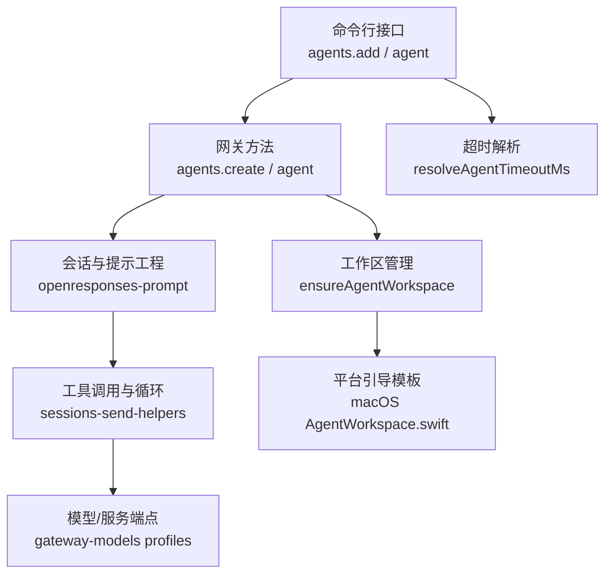
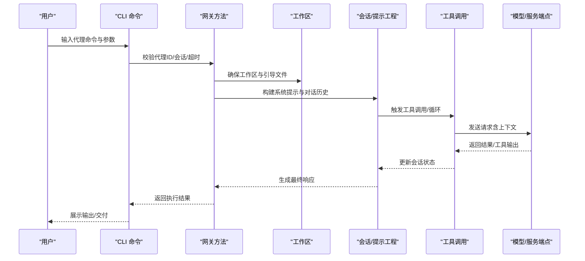
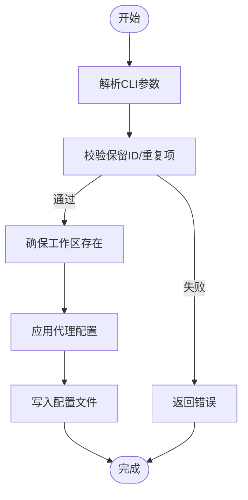
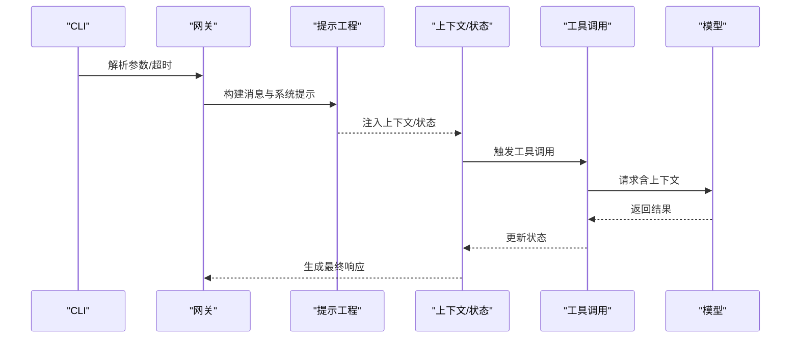
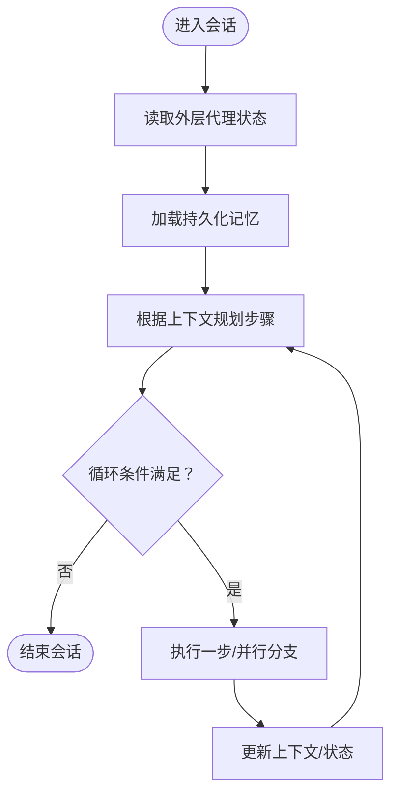
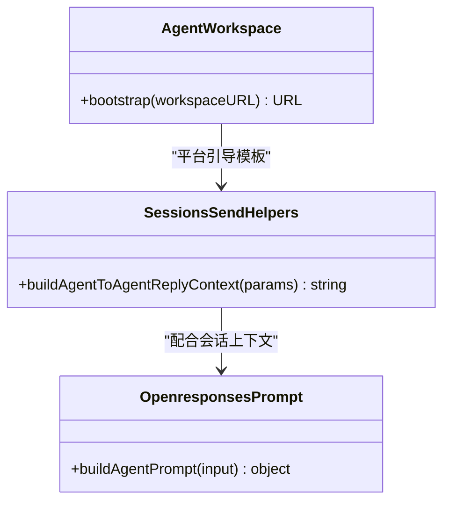
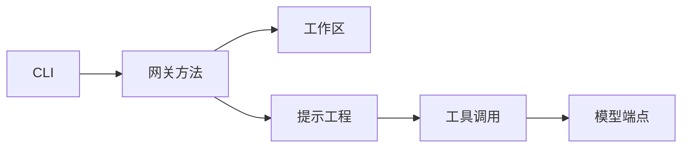

# 代理机制

<cite>
**本文引用的文件**
- [src/gateway/server-methods/agent.ts](file://src/gateway/server-methods/agent.ts)
- [src/gateway/server-methods/agents-mutate.test.ts](file://src/gateway/server-methods/agents-mutate.test.ts)
- [src/agents/workspace.ts](file://src/agents/workspace.ts)
- [apps/macos/Sources/OpenClaw/AgentWorkspace.swift](file://apps/macos/Sources/OpenClaw/AgentWorkspace.swift)
- [src/commands/agents.commands.add.ts](file://src/commands/agents.commands.add.ts)
- [src/commands/agent.ts](file://src/commands/agent.ts)
- [src/agents/timeout.ts](file://src/agents/timeout.ts)
- [src/gateway/openresponses-prompt.ts](file://src/gateway/openresponses-prompt.ts)
- [src/agents/tools/sessions-send-helpers.ts](file://src/agents/tools/sessions-send-helpers.ts)
- [extensions/open-prose/skills/prose/state/in-context.md](file://extensions/open-prose/skills/prose/state/in-context.md)
- [extensions/open-prose/skills/prose/primitives/session.md](file://extensions/open-prose/skills/prose/primitives/session.md)
- [src/gateway/gateway-models.profiles.live.test.ts](file://src/gateway/gateway-models.profiles.live.test.ts)
</cite>

## 目录

1. [简介](#简介)
2. [项目结构](#项目结构)
3. [核心组件](#核心组件)
4. [架构总览](#架构总览)
5. [详细组件分析](#详细组件分析)
6. [依赖关系分析](#依赖关系分析)
7. [性能考量](#性能考量)
8. [故障排查指南](#故障排查指南)
9. [结论](#结论)
10. [附录](#附录)

## 简介

本文件系统性阐述 OpenClaw 的代理（Agent）机制：从代理的生命周期、创建与初始化、执行与会话状态维护，到代理循环、上下文管理、工具调用策略与错误处理。文档同时覆盖代理与用户的交互模式、消息处理流程与响应生成机制，并给出配置选项、性能优化策略与最佳实践。

## 项目结构

OpenClaw 的代理能力由多层协作实现：

- 命令层：CLI 提供代理创建、参数解析与超时控制等入口。
- 网关层：RPC 方法负责代理查询、创建、执行与状态校验。
- 工作区层：确保代理工作空间存在并写入引导文件。
- 执行层：会话构建、提示工程、工具调用与响应生成。
- 平台适配层：不同平台（如 macOS）提供工作区引导模板。

图表来源

- [src/commands/agent.ts](file://src/commands/agent.ts#L263-L302)
- [src/commands/agents.commands.add.ts](file://src/commands/agents.commands.add.ts#L74-L113)
- [src/gateway/server-methods/agent.ts](file://src/gateway/server-methods/agent.ts#L260-L275)
- [src/agents/workspace.ts](file://src/agents/workspace.ts#L321-L349)
- [apps/macos/Sources/OpenClaw/AgentWorkspace.swift](file://apps/macos/Sources/OpenClaw/AgentWorkspace.swift#L94-L113)
- [src/gateway/openresponses-prompt.ts](file://src/gateway/openresponses-prompt.ts#L25-L49)
- [src/agents/tools/sessions-send-helpers.ts](file://src/agents/tools/sessions-send-helpers.ts#L91-L117)
- [src/gateway/gateway-models.profiles.live.test.ts](file://src/gateway/gateway-models.profiles.live.test.ts#L971-L998)

章节来源

- [src/commands/agent.ts](file://src/commands/agent.ts#L263-L302)
- [src/commands/agents.commands.add.ts](file://src/commands/agents.commands.add.ts#L74-L113)
- [src/gateway/server-methods/agent.ts](file://src/gateway/server-methods/agent.ts#L260-L275)
- [src/agents/workspace.ts](file://src/agents/workspace.ts#L321-L349)
- [apps/macos/Sources/OpenClaw/AgentWorkspace.swift](file://apps/macos/Sources/OpenClaw/AgentWorkspace.swift#L94-L113)
- [src/gateway/openresponses-prompt.ts](file://src/gateway/openresponses-prompt.ts#L25-L49)
- [src/agents/tools/sessions-send-helpers.ts](file://src/agents/tools/sessions-send-helpers.ts#L91-L117)
- [src/gateway/gateway-models.profiles.live.test.ts](file://src/gateway/gateway-models.profiles.live.test.ts#L971-L998)

## 核心组件

- 代理工作区与引导
  - 确保工作区目录存在，必要时创建默认引导文件（如 AGENTS.md、SOUL.md、IDENTITY.md 等），并处理 Git 初始化。
- 代理创建与校验
  - CLI 与网关方法共同完成代理创建、ID 规范化、重复性检查与配置应用。
- 会话与提示工程
  - 将输入内容转换为系统提示与对话历史，支持多角色与多模态片段抽取。
- 工具调用与代理间通信
  - 构建代理到代理的回复上下文，支持轮次控制与终止令牌。
- 超时与生命周期
  - 解析全局与覆盖超时，提供“无超时”安全上限，保障长任务稳定运行。
- 上下文与状态管理
  - OpenProse 提供会话上下文与状态管理指南，支持外层状态、持久化记忆与多种存储后端。

章节来源

- [src/agents/workspace.ts](file://src/agents/workspace.ts#L321-L349)
- [src/gateway/server-methods/agents-mutate.test.ts](file://src/gateway/server-methods/agents-mutate.test.ts#L230-L293)
- [src/gateway/openresponses-prompt.ts](file://src/gateway/openresponses-prompt.ts#L25-L49)
- [src/agents/tools/sessions-send-helpers.ts](file://src/agents/tools/sessions-send-helpers.ts#L91-L117)
- [src/agents/timeout.ts](file://src/agents/timeout.ts#L1-L48)
- [extensions/open-prose/skills/prose/primitives/session.md](file://extensions/open-prose/skills/prose/primitives/session.md#L1-L53)

## 架构总览

OpenClaw 代理执行链路如下：CLI 参数解析 → 网关方法校验与执行 → 工作区准备 → 会话构建与提示工程 → 工具调用与循环 → 模型服务端点 → 响应生成与交付。

图表来源

- [src/commands/agent.ts](file://src/commands/agent.ts#L263-L302)
- [src/gateway/server-methods/agent.ts](file://src/gateway/server-methods/agent.ts#L260-L275)
- [src/agents/workspace.ts](file://src/agents/workspace.ts#L321-L349)
- [src/gateway/openresponses-prompt.ts](file://src/gateway/openresponses-prompt.ts#L25-L49)
- [src/agents/tools/sessions-send-helpers.ts](file://src/agents/tools/sessions-send-helpers.ts#L91-L117)
- [src/gateway/gateway-models.profiles.live.test.ts](file://src/gateway/gateway-models.profiles.live.test.ts#L971-L998)

## 详细组件分析

### 组件A：代理创建与生命周期

- 创建流程
  - CLI 在非交互模式下要求提供工作区与名称；对保留 ID 进行校验；规范化代理 ID；检查重复；解析工作区路径；应用代理配置。
  - 网关方法在创建前确保工作区存在并写入配置；测试覆盖了成功创建、顺序约束、保留 ID 与重复项拒绝。
- 生命周期要点
  - 工作区初始化：创建目录、写入引导文件、可选 Git 初始化。
  - 配置应用：合并默认值与用户输入，生成最终配置。
  - 校验与幂等：创建后通过列表校验已知代理 ID，避免未知代理被调用。

图表来源

- [src/commands/agents.commands.add.ts](file://src/commands/agents.commands.add.ts#L74-L113)
- [src/gateway/server-methods/agents-mutate.test.ts](file://src/gateway/server-methods/agents-mutate.test.ts#L230-L293)
- [src/agents/workspace.ts](file://src/agents/workspace.ts#L321-L349)

章节来源

- [src/commands/agents.commands.add.ts](file://src/commands/agents.commands.add.ts#L74-L113)
- [src/gateway/server-methods/agents-mutate.test.ts](file://src/gateway/server-methods/agents-mutate.test.ts#L230-L293)
- [src/agents/workspace.ts](file://src/agents/workspace.ts#L321-L349)

### 组件B：代理执行与会话状态维护

- 会话解析与超时
  - CLI 支持思维层级、一次性思维、详细级别与超时设置；超时解析支持秒/毫秒覆盖与“无超时”安全上限。
- 提示工程
  - 将输入内容按类型提取文本，区分系统/开发者/助手/用户角色，拼装消息与额外系统提示。
- 代理间通信
  - 构建代理到代理的回复上下文，包含当前角色、轮次、会话键与通道信息，支持终止令牌以停止轮询。

图表来源

- [src/commands/agent.ts](file://src/commands/agent.ts#L263-L302)
- [src/agents/timeout.ts](file://src/agents/timeout.ts#L1-L48)
- [src/gateway/openresponses-prompt.ts](file://src/gateway/openresponses-prompt.ts#L25-L49)
- [src/agents/tools/sessions-send-helpers.ts](file://src/agents/tools/sessions-send-helpers.ts#L91-L117)

章节来源

- [src/commands/agent.ts](file://src/commands/agent.ts#L263-L302)
- [src/agents/timeout.ts](file://src/agents/timeout.ts#L1-L48)
- [src/gateway/openresponses-prompt.ts](file://src/gateway/openresponses-prompt.ts#L25-L49)
- [src/agents/tools/sessions-send-helpers.ts](file://src/agents/tools/sessions-send-helpers.ts#L91-L117)

### 组件C：上下文管理与代理循环

- 上下文分层
  - 外层代理状态：程序、阶段、已完成步骤等标记。
  - 持久化记忆：持久化代理的记忆文件，承载累积知识。
- 循环与并行
  - OpenProse 支持并行块、循环块与错误处理块，提供条件评估与退出语义，便于复杂任务编排。
- 状态存储
  - 支持文件系统、SQLite 与 PostgreSQL 等多种状态存储后端，按需选择。

图表来源

- [extensions/open-prose/skills/prose/primitives/session.md](file://extensions/open-prose/skills/prose/primitives/session.md#L1-L53)
- [extensions/open-prose/skills/prose/state/in-context.md](file://extensions/open-prose/skills/prose/state/in-context.md#L83-L131)

章节来源

- [extensions/open-prose/skills/prose/primitives/session.md](file://extensions/open-prose/skills/prose/primitives/session.md#L1-L53)
- [extensions/open-prose/skills/prose/state/in-context.md](file://extensions/open-prose/skills/prose/state/in-context.md#L83-L131)

### 组件D：工具调用策略与会话状态维护

- 代理到代理的回复上下文
  - 明确当前角色（请求方/目标方）、轮次范围、会话键与通道，提供“跳过”令牌以中止轮询。
- 会话状态
  - 通过提示工程与工具调用更新状态，结合 OpenProse 的变量绑定与输入/输出绑定，形成可追踪的状态流。

图表来源

- [src/agents/tools/sessions-send-helpers.ts](file://src/agents/tools/sessions-send-helpers.ts#L91-L117)
- [src/gateway/openresponses-prompt.ts](file://src/gateway/openresponses-prompt.ts#L25-L49)
- [apps/macos/Sources/OpenClaw/AgentWorkspace.swift](file://apps/macos/Sources/OpenClaw/AgentWorkspace.swift#L94-L113)

章节来源

- [src/agents/tools/sessions-send-helpers.ts](file://src/agents/tools/sessions-send-helpers.ts#L91-L117)
- [src/gateway/openresponses-prompt.ts](file://src/gateway/openresponses-prompt.ts#L25-L49)
- [apps/macos/Sources/OpenClaw/AgentWorkspace.swift](file://apps/macos/Sources/OpenClaw/AgentWorkspace.swift#L94-L113)

## 依赖关系分析

- 组件耦合
  - CLI 依赖网关方法进行代理操作；网关方法依赖工作区管理与提示工程；提示工程与工具调用共同依赖会话状态。
- 外部依赖
  - 模型服务端点（如 OpenAI Responses）参与最终响应生成；平台层提供工作区模板。
- 可能的循环依赖
  - 当前结构为单向依赖（CLI → 网关 → 工作区/提示/工具 → 模型），未见循环。

图表来源

- [src/commands/agent.ts](file://src/commands/agent.ts#L263-L302)
- [src/gateway/server-methods/agent.ts](file://src/gateway/server-methods/agent.ts#L260-L275)
- [src/agents/workspace.ts](file://src/agents/workspace.ts#L321-L349)
- [src/gateway/openresponses-prompt.ts](file://src/gateway/openresponses-prompt.ts#L25-L49)
- [src/gateway/gateway-models.profiles.live.test.ts](file://src/gateway/gateway-models.profiles.live.test.ts#L971-L998)

章节来源

- [src/commands/agent.ts](file://src/commands/agent.ts#L263-L302)
- [src/gateway/server-methods/agent.ts](file://src/gateway/server-methods/agent.ts#L260-L275)
- [src/agents/workspace.ts](file://src/agents/workspace.ts#L321-L349)
- [src/gateway/openresponses-prompt.ts](file://src/gateway/openresponses-prompt.ts#L25-L49)
- [src/gateway/gateway-models.profiles.live.test.ts](file://src/gateway/gateway-models.profiles.live.test.ts#L971-L998)

## 性能考量

- 超时策略
  - 使用安全上限表示“无超时”，避免不安全计时器；支持秒/毫秒覆盖，最小值约束保证稳定性。
- 工具调用与循环
  - 合理使用并行与循环，避免不必要的重复调用；通过条件评估减少无效迭代。
- 提示工程
  - 仅注入必要内容，避免冗余上下文导致延迟与成本上升。
- 存储后端
  - 在高并发场景优先考虑 SQLite/PostgreSQL 等结构化存储，降低文件系统争用。

章节来源

- [src/agents/timeout.ts](file://src/agents/timeout.ts#L1-L48)
- [extensions/open-prose/skills/prose/state/in-context.md](file://extensions/open-prose/skills/prose/state/in-context.md#L83-L131)

## 故障排查指南

- 代理创建失败
  - 保留 ID 或重复项：CLI 与网关方法均会拒绝保留 ID 与重复代理；检查代理 ID 规范化与列表校验。
  - 工作区不存在或权限不足：确保工作区目录存在且具备写权限；必要时启用引导模板。
- 执行超时
  - 检查超时覆盖是否为负数或 0（0 表示无超时）；确认最小超时约束。
- 响应异常
  - OpenAI Responses 等模型可能出现“仅工具调用”的回归问题；在测试中已覆盖该场景，建议在生产中增加断言与回退逻辑。
- 代理间通信
  - 若出现无限轮询，检查“跳过”令牌是否正确传递与识别。

章节来源

- [src/gateway/server-methods/agents-mutate.test.ts](file://src/gateway/server-methods/agents-mutate.test.ts#L230-L293)
- [src/agents/workspace.ts](file://src/agents/workspace.ts#L321-L349)
- [src/agents/timeout.ts](file://src/agents/timeout.ts#L1-L48)
- [src/gateway/gateway-models.profiles.live.test.ts](file://src/gateway/gateway-models.profiles.live.test.ts#L971-L998)
- [src/agents/tools/sessions-send-helpers.ts](file://src/agents/tools/sessions-send-helpers.ts#L91-L117)

## 结论

OpenClaw 的代理机制通过 CLI、网关、工作区、提示工程与工具调用的协同，实现了从创建到执行再到状态维护的完整闭环。借助 OpenProse 的上下文与循环模型，代理能够高效地组织复杂任务；通过超时与错误处理策略，保障执行稳定性与可观测性。建议在生产中结合平台模板与结构化存储，持续优化提示与工具调用策略。

## 附录

- 最佳实践
  - 代理 ID 规范化与唯一性检查；工作区引导模板统一；最小超时与“无超时”安全上限；仅注入必要上下文；合理使用并行与循环。
- 常见问题
  - 保留 ID 冲突、重复代理、工作区权限、超时覆盖非法、模型端点回归问题、无限轮询。
