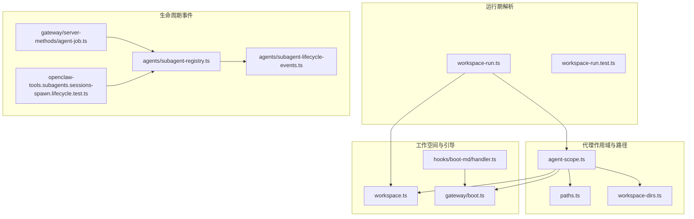
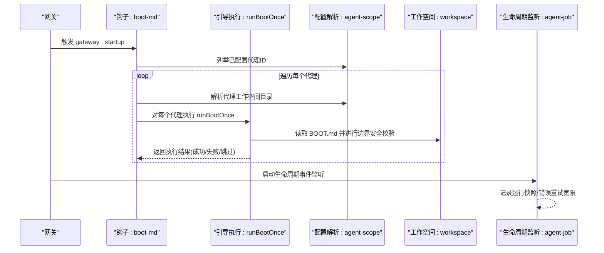
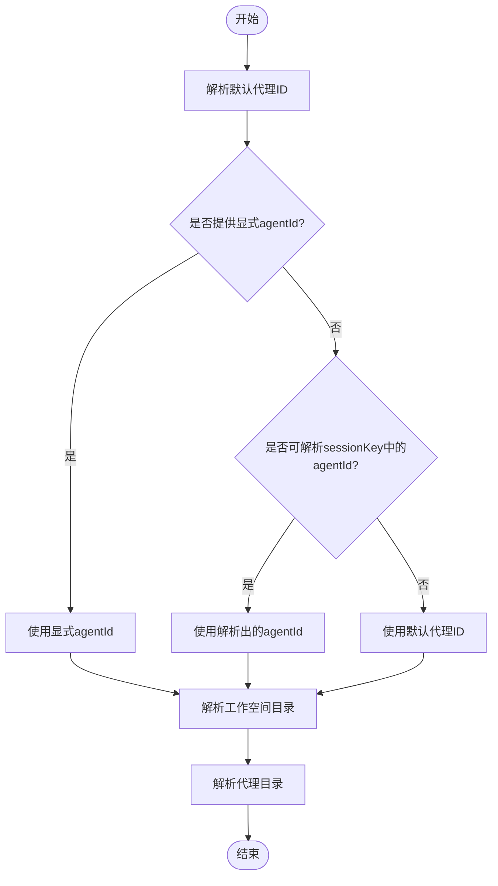
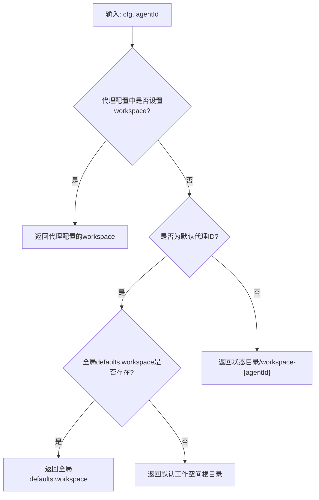
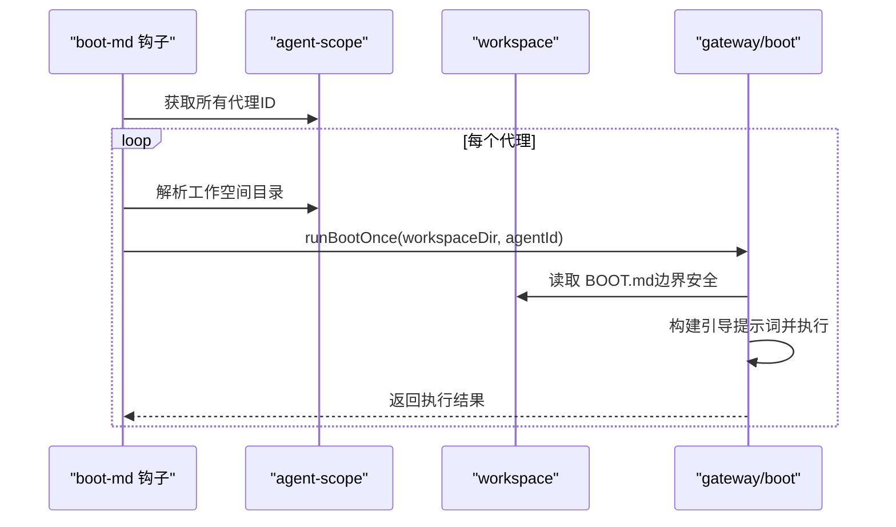
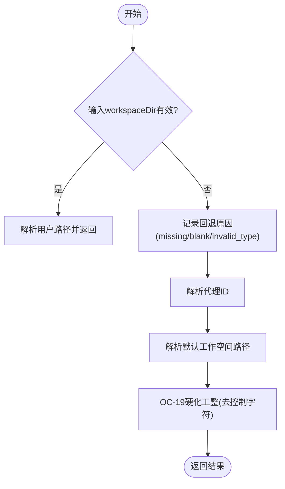
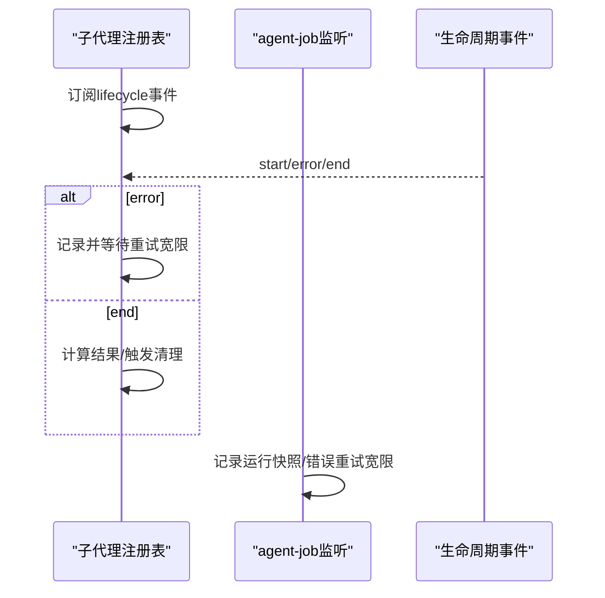
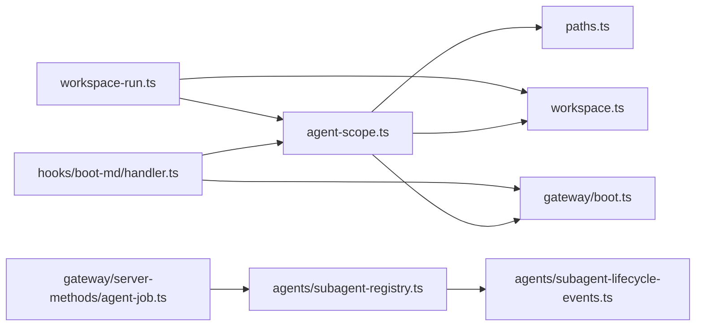

# 代理生命周期

<cite>
**本文引用的文件**
- [agent-scope.ts](file://src/agents/agent-scope.ts)
- [workspace.ts](file://src/agents/workspace.ts)
- [workspace-run.ts](file://src/agents/workspace-run.ts)
- [boot.ts](file://src/gateway/boot.ts)
- [handler.ts（boot-md 钩子）](file://src/hooks/bundled/boot-md/handler.ts)
- [HOOK.md（boot-md 钩子）](file://src/hooks/bundled/boot-md/HOOK.md)
- [agent-job.ts（服务器方法：agent-job）](file://src/gateway/server-methods/agent-job.ts)
- [subagent-registry.ts（子代理注册表）](file://src/agents/subagent-registry.ts)
- [subagent-lifecycle-events.ts（子代理生命周期事件）](file://src/agents/subagent-lifecycle-events.ts)
- [openclaw-tools.subagents.sessions-spawn.lifecycle.test.ts（子代理生命周期测试）](file://src/agents/openclaw-tools.subagents.sessions-spawn.lifecycle.test.ts)
- [paths.ts（路径解析）](file://src/config/paths.ts)
- [workspace-dirs.ts（工作空间目录列表）](file://src/agents/workspace-dirs.ts)
- [workspace-run.test.ts（运行工作空间解析测试）](file://src/agents/workspace-run.test.ts)
- [bootstrap-files.test.ts（引导文件测试）](file://src/agents/bootstrap-files.test.ts)
</cite>

## 目录

1. [简介](#简介)
2. [项目结构](#项目结构)
3. [核心组件](#核心组件)
4. [架构总览](#架构总览)
5. [详细组件分析](#详细组件分析)
6. [依赖关系分析](#依赖关系分析)
7. [性能考量](#性能考量)
8. [故障排查指南](#故障排查指南)
9. [结论](#结论)
10. [附录](#附录)

## 简介

本文件面向 OpenClaw 代理生命周期管理，系统化阐述从“创建到销毁”的完整流程，覆盖以下主题：

- 代理初始化与配置解析
- 代理作用域与默认 ID 解析、会话代理 ID 确定、配置继承规则
- 代理路径解析（工作空间目录、代理目录、状态目录）
- 引导文件处理、钩子函数执行与启动序列管理
- 生命周期各阶段的状态检查、错误处理与清理机制
- 配置校验、路径安全检查与资源释放最佳实践

## 项目结构

围绕代理生命周期的关键模块分布如下：

- 代理作用域与路径解析：src/agents/agent-scope.ts、src/config/paths.ts、src/agents/workspace-dirs.ts
- 工作空间与引导文件：src/agents/workspace.ts、src/gateway/boot.ts、src/hooks/bundled/boot-md/handler.ts
- 运行期工作空间解析与回退策略：src/agents/workspace-run.ts、src/agents/workspace-run.test.ts
- 子代理生命周期与清理：src/agents/subagent-registry.ts、src/agents/subagent-lifecycle-events.ts、src/agents/openclaw-tools.subagents.sessions-spawn.lifecycle.test.ts
- 生命周期事件监听与错误重试宽限：src/gateway/server-methods/agent-job.ts
- 引导文件钩子与安全校验：src/agents/bootstrap-files.test.ts

**图表来源**

- [agent-scope.ts](file://src/agents/agent-scope.ts#L1-L282)
- [paths.ts](file://src/config/paths.ts#L1-L200)
- [workspace-dirs.ts](file://src/agents/workspace-dirs.ts#L1-L16)
- [workspace.ts](file://src/agents/workspace.ts#L1-L656)
- [boot.ts](file://src/gateway/boot.ts#L1-L203)
- [handler.ts（boot-md 钩子）](file://src/hooks/bundled/boot-md/handler.ts#L1-L44)
- [workspace-run.ts](file://src/agents/workspace-run.ts#L1-L117)
- [agent-job.ts（服务器方法：agent-job）](file://src/gateway/server-methods/agent-job.ts#L53-L242)
- [subagent-registry.ts（子代理注册表）](file://src/agents/subagent-registry.ts#L586-L638)
- [subagent-lifecycle-events.ts（子代理生命周期事件）](file://src/agents/subagent-lifecycle-events.ts#L1-L48)
- [openclaw-tools.subagents.sessions-spawn.lifecycle.test.ts（子代理生命周期测试）](file://src/agents/openclaw-tools.subagents.sessions-spawn.lifecycle.test.ts#L1-L373)

**章节来源**

- [agent-scope.ts](file://src/agents/agent-scope.ts#L1-L282)
- [workspace.ts](file://src/agents/workspace.ts#L1-L656)
- [workspace-run.ts](file://src/agents/workspace-run.ts#L1-L117)
- [boot.ts](file://src/gateway/boot.ts#L1-L203)
- [handler.ts（boot-md 钩子）](file://src/hooks/bundled/boot-md/handler.ts#L1-L44)
- [agent-job.ts（服务器方法：agent-job）](file://src/gateway/server-methods/agent-job.ts#L53-L242)
- [subagent-registry.ts（子代理注册表）](file://src/agents/subagent-registry.ts#L586-L638)
- [subagent-lifecycle-events.ts（子代理生命周期事件）](file://src/agents/subagent-lifecycle-events.ts#L1-L48)
- [openclaw-tools.subagents.sessions-spawn.lifecycle.test.ts（子代理生命周期测试）](file://src/agents/openclaw-tools.subagents.sessions-spawn.lifecycle.test.ts#L1-L373)

## 核心组件

- 代理作用域与配置解析：负责默认代理 ID、会话代理 ID、代理配置继承、工作空间与代理目录解析。
- 工作空间与引导：负责默认工作空间目录、引导文件模板加载、边界安全读取、状态文件维护、Git 初始化。
- 运行期工作空间解析：在运行时根据输入参数与会话键解析最终工作空间路径，并提供回退策略。
- 引导钩子与启动序列：在网关启动时按代理作用域批量执行 BOOT.md 引导。
- 生命周期事件与清理：通过生命周期事件监听器跟踪子代理运行状态，实现超时、错误重试宽限与会话清理。

**章节来源**

- [agent-scope.ts](file://src/agents/agent-scope.ts#L71-L115)
- [workspace.ts](file://src/agents/workspace.ts#L12-L45)
- [workspace-run.ts](file://src/agents/workspace-run.ts#L74-L116)
- [boot.ts](file://src/gateway/boot.ts#L138-L202)
- [handler.ts（boot-md 钩子）](file://src/hooks/bundled/boot-md/handler.ts#L10-L42)

## 架构总览

下图展示代理生命周期从“配置解析”到“引导执行”再到“运行期监控与清理”的整体流程。

**图表来源**

- [handler.ts（boot-md 钩子）](file://src/hooks/bundled/boot-md/handler.ts#L10-L42)
- [boot.ts](file://src/gateway/boot.ts#L138-L202)
- [agent-scope.ts](file://src/agents/agent-scope.ts#L255-L281)
- [workspace.ts](file://src/agents/workspace.ts#L498-L555)
- [agent-job.ts（服务器方法：agent-job）](file://src/gateway/server-methods/agent-job.ts#L53-L242)

## 详细组件分析

### 代理作用域与配置解析

- 默认代理 ID 解析：当未配置或存在多个默认代理时，采用首个条目作为默认；并记录警告日志。
- 会话代理 ID 确定：优先使用显式传入的 agentId，其次从 sessionKey 中解析，最后回退到默认代理 ID。
- 配置继承规则：代理级配置优先于全局 defaults；模型主模型与回退列表支持显式覆盖与禁用。
- 路径解析：
  - 工作空间目录：优先使用代理配置；否则使用默认工作空间；若仍无，则使用状态目录下的 workspace-{agentId}。
  - 代理目录：优先使用代理配置；否则使用状态目录下的 agents/{agentId}/agent。

**图表来源**

- [agent-scope.ts](file://src/agents/agent-scope.ts#L85-L115)
- [agent-scope.ts](file://src/agents/agent-scope.ts#L255-L281)

**章节来源**

- [agent-scope.ts](file://src/agents/agent-scope.ts#L71-L115)
- [agent-scope.ts](file://src/agents/agent-scope.ts#L255-L281)

### 代理路径解析系统

- 工作空间目录：
  - 显式配置优先
  - 其次使用全局 defaults.workspace
  - 最后回退到默认工作空间根目录（基于用户主目录与 profile）
- 代理目录：显式配置优先，否则位于状态目录下固定路径
- 状态目录：由路径解析工具提供，用于存放代理数据与工作空间

**图表来源**

- [agent-scope.ts](file://src/agents/agent-scope.ts#L255-L271)
- [paths.ts](file://src/config/paths.ts#L1-L200)

**章节来源**

- [agent-scope.ts](file://src/agents/agent-scope.ts#L255-L271)
- [paths.ts](file://src/config/paths.ts#L1-L200)

### 代理引导文件处理与启动序列

- 引导文件加载：工作空间内预定义的引导文件（如 AGENTS.md、SOUL.md、TOOLS.md、IDENTITY.md、USER.md、HEARTBEAT.md、BOOTSTRAP.md、MEMORY 系列）按安全边界读取，支持缓存与最小集过滤。
- 引导执行：在网关启动时，对每个代理作用域调用 runBootOnce，读取 BOOT.md，构建提示词，生成临时会话并执行，同时对主会话映射做快照与恢复。
- 安全与边界：读取过程使用边界文件打开与 realpath 校验，防止路径逃逸；对文件名进行白名单校验。

**图表来源**

- [handler.ts（boot-md 钩子）](file://src/hooks/bundled/boot-md/handler.ts#L20-L41)
- [boot.ts](file://src/gateway/boot.ts#L138-L202)
- [workspace.ts](file://src/agents/workspace.ts#L498-L555)

**章节来源**

- [workspace.ts](file://src/agents/workspace.ts#L498-L555)
- [boot.ts](file://src/gateway/boot.ts#L138-L202)
- [handler.ts（boot-md 钩子）](file://src/hooks/bundled/boot-md/handler.ts#L10-L42)
- [HOOK.md（boot-md 钩子）](file://src/hooks/bundled/boot-md/HOOK.md#L1-L21)

### 运行期工作空间解析与回退

- 输入优先：若传入了非空字符串工作空间路径，则直接解析并返回
- 回退策略：若输入缺失/为空/类型不合法，则根据代理 ID 解析默认工作空间路径，并进行 OC-19 硬化（去除控制字符）
- 代理 ID 来源：显式参数 > 会话键解析 > 默认代理 ID

**图表来源**

- [workspace-run.ts](file://src/agents/workspace-run.ts#L74-L116)

**章节来源**

- [workspace-run.ts](file://src/agents/workspace-run.ts#L74-L116)
- [workspace-run.test.ts](file://src/agents/workspace-run.test.ts#L1-L35)

### 生命周期事件与清理机制

- 生命周期事件：通过 onAgentEvent 监听 runId 对应的 lifecycle 流事件，区分 start/end/error
- 错误重试宽限：对错误事件进行延迟记录，避免瞬时错误导致立即失败
- 子代理生命周期：注册表在 end/error 时计算结果与清理策略，支持“保持/删除”两种清理模式
- 会话清理：测试覆盖了“完成/超时/删除”等场景，确保会话正确关闭或保留

**图表来源**

- [subagent-registry.ts（子代理注册表）](file://src/agents/subagent-registry.ts#L586-L638)
- [agent-job.ts（服务器方法：agent-job）](file://src/gateway/server-methods/agent-job.ts#L53-L242)
- [openclaw-tools.subagents.sessions-spawn.lifecycle.test.ts（子代理生命周期测试）](file://src/agents/openclaw-tools.subagents.sessions-spawn.lifecycle.test.ts#L191-L255)

**章节来源**

- [subagent-registry.ts（子代理注册表）](file://src/agents/subagent-registry.ts#L586-L638)
- [agent-job.ts（服务器方法：agent-job）](file://src/gateway/server-methods/agent-job.ts#L53-L242)
- [openclaw-tools.subagents.sessions-spawn.lifecycle.test.ts（子代理生命周期测试）](file://src/agents/openclaw-tools.subagents.sessions-spawn.lifecycle.test.ts#L191-L255)

### 配置验证、路径安全与资源释放最佳实践

- 配置验证：
  - 代理 ID 正规化与去重
  - 会话键形状校验，拒绝格式错误的 agent session key
- 路径安全：
  - 使用 realpath 校验与边界文件打开，防止路径逃逸
  - 文件名白名单限制，仅允许受控的引导文件名
  - 控制字符清理（OC-19 硬化），避免注入风险
- 资源释放：
  - Git 初始化仅在全新工作空间进行，失败不影响总体流程
  - 状态文件写入采用临时文件 + 原子 rename，保证一致性

**章节来源**

- [workspace.ts](file://src/agents/workspace.ts#L48-L88)
- [workspace.ts](file://src/agents/workspace.ts#L557-L573)
- [workspace.ts](file://src/agents/workspace.ts#L287-L319)
- [workspace.ts](file://src/agents/workspace.ts#L262-L276)

## 依赖关系分析

- agent-scope.ts 依赖 paths.ts 提供状态目录，依赖路由模块解析会话键
- workspace.ts 依赖模板系统与边界文件读取，为引导执行提供安全基础
- boot.ts 依赖会话存储与消息工具，执行引导并维护主会话映射快照
- handler.ts（boot-md 钩子）依赖 agent-scope 与 boot，形成“启动即引导”的自动化序列
- agent-job.ts 依赖生命周期事件，实现运行期监控与错误重试宽限
- 子代理注册表与生命周期事件共同构成子代理的生命周期闭环

**图表来源**

- [agent-scope.ts](file://src/agents/agent-scope.ts#L1-L282)
- [paths.ts](file://src/config/paths.ts#L1-L200)
- [workspace.ts](file://src/agents/workspace.ts#L1-L656)
- [boot.ts](file://src/gateway/boot.ts#L1-L203)
- [handler.ts（boot-md 钩子）](file://src/hooks/bundled/boot-md/handler.ts#L1-L44)
- [workspace-run.ts](file://src/agents/workspace-run.ts#L1-L117)
- [agent-job.ts（服务器方法：agent-job）](file://src/gateway/server-methods/agent-job.ts#L53-L242)
- [subagent-registry.ts（子代理注册表）](file://src/agents/subagent-registry.ts#L586-L638)
- [subagent-lifecycle-events.ts（子代理生命周期事件）](file://src/agents/subagent-lifecycle-events.ts#L1-L48)

**章节来源**

- [agent-scope.ts](file://src/agents/agent-scope.ts#L1-L282)
- [workspace.ts](file://src/agents/workspace.ts#L1-L656)
- [boot.ts](file://src/gateway/boot.ts#L1-L203)
- [handler.ts（boot-md 钩子）](file://src/hooks/bundled/boot-md/handler.ts#L1-L44)
- [agent-job.ts（服务器方法：agent-job）](file://src/gateway/server-methods/agent-job.ts#L53-L242)
- [subagent-registry.ts（子代理注册表）](file://src/agents/subagent-registry.ts#L586-L638)
- [subagent-lifecycle-events.ts（子代理生命周期事件）](file://src/agents/subagent-lifecycle-events.ts#L1-L48)

## 性能考量

- 缓存与去重：工作空间文件内容按 inode/dev/size/mtime 身份缓存，避免重复读取
- 模板缓存：工作空间模板按名称缓存，减少 IO
- Git 可用性检测：异步缓存检测结果，避免重复探测
- 异步与原子操作：状态文件写入采用临时文件 + 原子 rename，降低锁竞争

[本节为通用指导，无需列出具体文件来源]

## 故障排查指南

- 引导执行失败：
  - 检查 BOOT.md 是否存在且非空
  - 查看 runBootOnce 的返回原因（agent run failed / mapping restore failed）
- 路径逃逸或读取失败：
  - 确认请求路径在工作空间根内，未使用 .. 或符号链接逃逸
  - 校验文件名是否在受控白名单内
- 会话映射异常：
  - 关注主会话映射快照与恢复日志，确认快照是否可恢复
- 子代理清理异常：
  - 检查生命周期事件是否正确发出 start/end/error
  - 确认清理策略（keep/delete）与会话键前缀

**章节来源**

- [boot.ts](file://src/gateway/boot.ts#L144-L202)
- [workspace.ts](file://src/agents/workspace.ts#L140-L165)
- [agent-job.ts（服务器方法：agent-job）](file://src/gateway/server-methods/agent-job.ts#L114-L136)
- [openclaw-tools.subagents.sessions-spawn.lifecycle.test.ts（子代理生命周期测试）](file://src/agents/openclaw-tools.subagents.sessions-spawn.lifecycle.test.ts#L191-L255)

## 结论

OpenClaw 的代理生命周期以“作用域解析 + 路径安全 + 引导执行 + 生命周期监控”为核心，形成从配置到运行再到清理的闭环。通过严格的路径安全校验、引导文件白名单与边界读取、生命周期事件与错误重试宽限，系统在保证安全性的同时提供了稳健的自动化能力。建议在生产环境中：

- 严格遵循配置继承规则与路径解析顺序
- 在引导文件中使用受控白名单文件名
- 对生命周期事件进行可观测与告警
- 在清理策略上明确“保持/删除”的业务语义

[本节为总结性内容，无需列出具体文件来源]

## 附录

- 引导文件钩子元信息与事件要求见 HOOK.md
- 运行期工作空间解析行为见 workspace-run.test.ts
- 引导文件钩子异常与安全校验见 bootstrap-files.test.ts

**章节来源**

- [HOOK.md（boot-md 钩子）](file://src/hooks/bundled/boot-md/HOOK.md#L1-L21)
- [workspace-run.test.ts（运行工作空间解析测试）](file://src/agents/workspace-run.test.ts#L1-L35)
- [bootstrap-files.test.ts（引导文件测试）](file://src/agents/bootstrap-files.test.ts#L27-L68)
