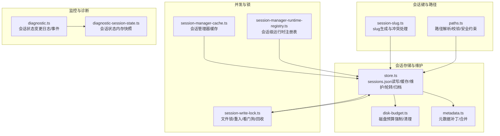
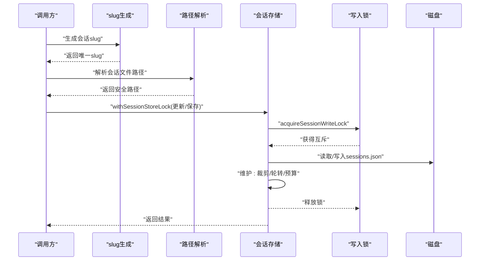
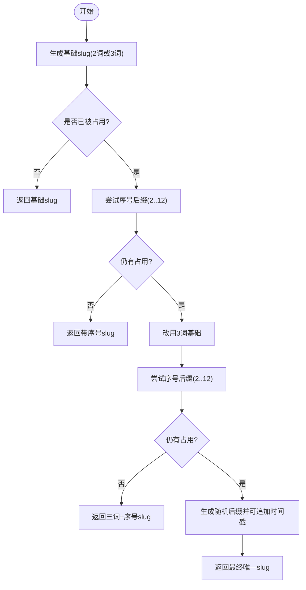
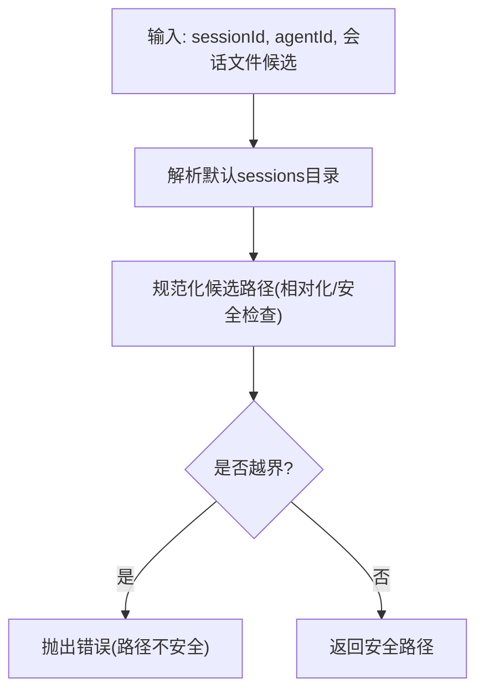
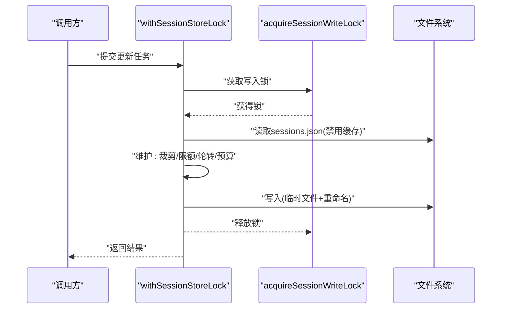
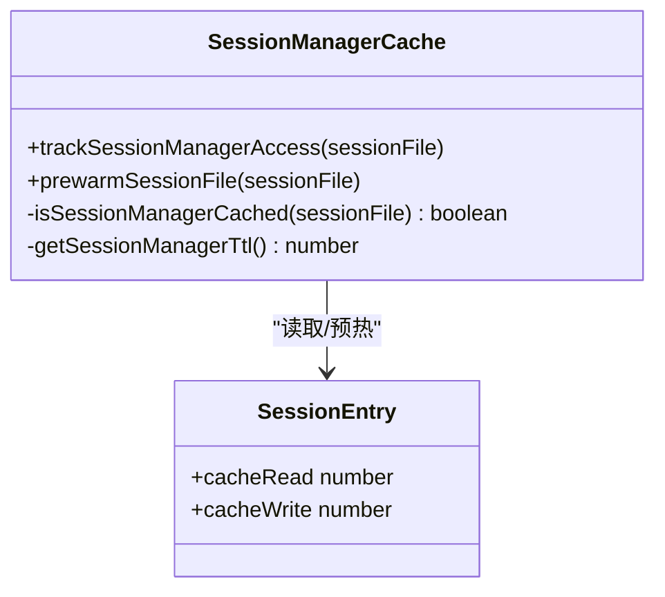
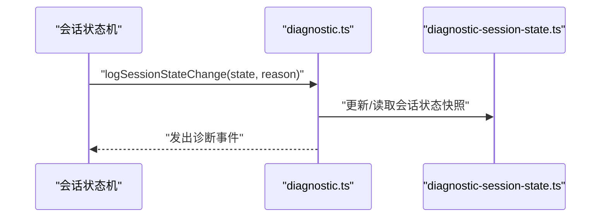
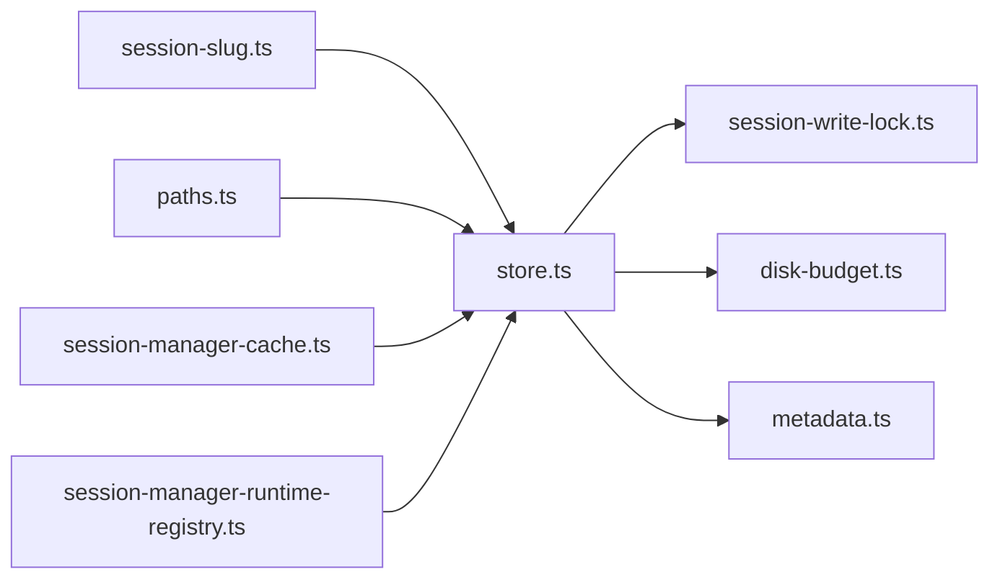

# 会话状态管理

<cite>
**本文引用的文件**
- [src/agents/session-slug.ts](file://src/agents/session-slug.ts)
- [src/agents/session-write-lock.ts](file://src/agents/session-write-lock.ts)
- [src/config/sessions/store.ts](file://src/config/sessions/store.ts)
- [src/config/sessions/paths.ts](file://src/config/sessions/paths.ts)
- [src/agents/pi-embedded-runner/session-manager-cache.ts](file://src/agents/pi-embedded-runner/session-manager-cache.ts)
- [src/agents/pi-extensions/session-manager-runtime-registry.ts](file://src/agents/pi-extensions/session-manager-runtime-registry.ts)
- [src/config/sessions/cache-fields.test.ts](file://src/config/sessions/cache-fields.test.ts)
- [src/memory/manager-sync-ops.ts](file://src/memory/manager-sync-ops.ts)
- [src/logging/diagnostic.ts](file://src/logging/diagnostic.ts)
- [src/logging/diagnostic-session-state.ts](file://src/logging/diagnostic-session-state.ts)
- [src/gateway/server-methods/usage.sessions-usage.test.ts](file://src/gateway/server-methods/usage.sessions-usage.test.ts)
- [src/commands/sessions-cleanup.test.ts](file://src/commands/sessions-cleanup.test.ts)
</cite>

## 目录

1. [简介](#简介)
2. [项目结构](#项目结构)
3. [核心组件](#核心组件)
4. [架构总览](#架构总览)
5. [详细组件分析](#详细组件分析)
6. [依赖关系分析](#依赖关系分析)
7. [性能考量](#性能考量)
8. [故障排查指南](#故障排查指南)
9. [结论](#结论)
10. [附录](#附录)

## 简介

本文件系统性梳理 OpenClaw 的会话状态管理系统，覆盖会话创建、维护与清理机制；会话目录结构与文件命名规范；会话 slug 生成算法与冲突处理；写入锁与并发控制；会话工具结果保护器（工具结果缓存与一致性）；持久化策略、备份与迁移；配置项、性能调优与容量规划；以及监控、诊断与常见问题。

## 项目结构

围绕会话状态管理的关键模块分布如下：

- 会话键与路径解析：负责会话 ID 校验、会话文件路径解析、默认存储位置等
- 会话存储与维护：负责 sessions.json 的读写、缓存、裁剪、轮转、磁盘预算与归档清理
- 写入锁与并发控制：基于文件锁的互斥与看门狗，避免死锁与资源竞争
- 工具结果保护器：对工具执行结果进行缓存与一致性校验
- 监控与诊断：会话状态事件记录与会话状态内存快照
- 测试与命令：清理命令与使用场景测试



**图表来源**

- [src/agents/session-slug.ts](file://src/agents/session-slug.ts#L115-L143)
- [src/config/sessions/paths.ts](file://src/config/sessions/paths.ts#L58-L66)
- [src/config/sessions/store.ts](file://src/config/sessions/store.ts#L198-L284)
- [src/agents/session-write-lock.ts](file://src/agents/session-write-lock.ts#L406-L497)
- [src/agents/pi-embedded-runner/session-manager-cache.ts](file://src/agents/pi-embedded-runner/session-manager-cache.ts#L24-L54)
- [src/agents/pi-extensions/session-manager-runtime-registry.ts](file://src/agents/pi-extensions/session-manager-runtime-registry.ts#L1-L29)
- [src/logging/diagnostic.ts](file://src/logging/diagnostic.ts#L169-L202)
- [src/logging/diagnostic-session-state.ts](file://src/logging/diagnostic-session-state.ts#L79-L103)

**章节来源**

- [src/config/sessions/paths.ts](file://src/config/sessions/paths.ts#L33-L35)
- [src/config/sessions/store.ts](file://src/config/sessions/store.ts#L198-L284)

## 核心组件

- 会话键与 slug 生成：提供两词或三词组合的 slug，冲突时自动追加序号，最终回退到随机后缀
- 会话路径与安全：严格限定会话文件必须位于 agents/<agentId>/sessions 下，支持相对路径与跨根兼容
- 会话存储与维护：提供缓存、裁剪、容量上限、轮转、磁盘预算、归档清理与警告模式
- 写入锁与队列：基于文件锁的互斥，支持重入、超时、过期回收、看门狗清理与任务队列串行化
- 工具结果保护器：缓存工具结果，确保一致性与完整性
- 监控与诊断：记录状态变更事件并维护会话状态内存快照

**章节来源**

- [src/agents/session-slug.ts](file://src/agents/session-slug.ts#L115-L143)
- [src/config/sessions/paths.ts](file://src/config/sessions/paths.ts#L58-L66)
- [src/config/sessions/store.ts](file://src/config/sessions/store.ts#L328-L448)
- [src/agents/session-write-lock.ts](file://src/agents/session-write-lock.ts#L406-L497)
- [src/agents/pi-embedded-runner/session-manager-cache.ts](file://src/agents/pi-embedded-runner/session-manager-cache.ts#L24-L54)
- [src/logging/diagnostic.ts](file://src/logging/diagnostic.ts#L169-L202)

## 架构总览

会话状态管理由“键/路径层”“存储层”“并发控制层”“工具结果保护层”“监控诊断层”组成，形成从键生成、路径安全、文件读写、并发互斥、结果保护到可观测性的完整闭环。



**图表来源**

- [src/agents/session-slug.ts](file://src/agents/session-slug.ts#L115-L143)
- [src/config/sessions/paths.ts](file://src/config/sessions/paths.ts#L242-L265)
- [src/config/sessions/store.ts](file://src/config/sessions/store.ts#L970-L1002)
- [src/agents/session-write-lock.ts](file://src/agents/session-write-lock.ts#L406-L497)

## 详细组件分析

### 会话键与 slug 生成

- 两词/三词组合：从形容词与名词词库中随机选择，形成易记且唯一的初始 slug
- 冲突处理：若被占用，尝试添加序号后缀（2..12），仍冲突则扩展为三词组合再试
- 回退策略：若仍冲突，生成带随机后缀的 slug，并在必要时追加时间戳后缀确保唯一性
- 复杂度：生成尝试次数有限，冲突概率低；冲突处理为线性探测，整体 O(k)（k≤12）



**图表来源**

- [src/agents/session-slug.ts](file://src/agents/session-slug.ts#L115-L143)

**章节来源**

- [src/agents/session-slug.ts](file://src/agents/session-slug.ts#L1-L144)

### 会话目录结构与文件命名规范

- 默认存储位置：agents/<agentId>/sessions/sessions.json
- 会话文件：agents/<agentId>/sessions/<sessionId>.jsonl 或带 topic 的 <sessionId>-topic-<topicId>.jsonl
- 安全约束：路径必须位于 sessions 目录内，绝对路径会被规范化为相对路径；支持跨根兼容与同级代理目录回退
- 会话 ID 校验：仅允许字母数字及少量特殊字符，长度限制



**图表来源**

- [src/config/sessions/paths.ts](file://src/config/sessions/paths.ts#L159-L221)
- [src/config/sessions/paths.ts](file://src/config/sessions/paths.ts#L242-L265)
- [src/config/sessions/paths.ts](file://src/config/sessions/paths.ts#L58-L66)

**章节来源**

- [src/config/sessions/paths.ts](file://src/config/sessions/paths.ts#L33-L35)
- [src/config/sessions/paths.ts](file://src/config/sessions/paths.ts#L223-L248)
- [src/config/sessions/paths.ts](file://src/config/sessions/paths.ts#L58-L66)

### 会话存储与维护（sessions.json）

- 缓存：基于 TTL 的内存缓存，命中则直接返回深拷贝；写入前失效缓存，保证一致性
- 读取：Windows 平台对空文件/锁定状态做短暂重试；支持旧字段迁移（provider→channel、room→groupChannel）
- 维护：按配置裁剪过期条目、限制总数、轮转大文件、清理归档、磁盘预算强制
- 保存：原子写入（临时文件+重命名），Windows 特别处理重命名失败重试；权限设置为只读
- 队列：以 Promise 链实现的串行化锁队列，避免争用与数据覆盖



**图表来源**

- [src/config/sessions/store.ts](file://src/config/sessions/store.ts#L970-L1002)
- [src/agents/session-write-lock.ts](file://src/agents/session-write-lock.ts#L406-L497)
- [src/config/sessions/store.ts](file://src/config/sessions/store.ts#L857-L879)

**章节来源**

- [src/config/sessions/store.ts](file://src/config/sessions/store.ts#L198-L284)
- [src/config/sessions/store.ts](file://src/config/sessions/store.ts#L642-L855)
- [src/config/sessions/store.ts](file://src/config/sessions/store.ts#L970-L1002)

### 写入锁机制（并发控制、死锁预防、资源竞争）

- 文件锁：在会话文件名后附加 .lock，写入 PID 与创建时间；支持重入计数
- 超时与过期：可配置超时、过期阈值；看门狗定时扫描并强制释放超长时间持有的锁
- 回收策略：竞争锁时可选择删除过期锁；支持同步进程退出清理
- 任务队列：同一 storePath 的多个写操作进入队列串行执行，避免竞态

```mermaid
flowchart TD
S["请求acquireSessionWriteLock"] --> R["尝试创建锁文件(独占)"]
R --> |成功| OK["持有锁并返回release函数"]
R --> |失败(EEXIST)| Inspect["读取锁负载(PID/createdAt)"]
Inspect --> Stale{"是否过期/无效?"}
Stale --> |是| Reclaim["删除过期锁并重试"]
Stale --> |否| Wait["等待/指数退避"] --> R
OK --> Release["调用release(支持重入计数)"]
Release --> Cleanup["关闭句柄并删除锁文件"]
```

**图表来源**

- [src/agents/session-write-lock.ts](file://src/agents/session-write-lock.ts#L406-L497)
- [src/agents/session-write-lock.ts](file://src/agents/session-write-lock.ts#L187-L206)
- [src/agents/session-write-lock.ts](file://src/agents/session-write-lock.ts#L916-L968)

**章节来源**

- [src/agents/session-write-lock.ts](file://src/agents/session-write-lock.ts#L1-L505)
- [src/config/sessions/store.ts](file://src/config/sessions/store.ts#L906-L968)

### 会话工具结果保护器（结果缓存、一致性、完整性）

- 缓存：会话管理器访问跟踪与 TTL 控制，减少重复加载
- 一致性：通过缓存 TTL 与失效策略，避免脏读；工具结果与会话状态保持一致
- 完整性：缓存项包含加载时间戳，结合 TTL 进行有效性判断



**图表来源**

- [src/agents/pi-embedded-runner/session-manager-cache.ts](file://src/agents/pi-embedded-runner/session-manager-cache.ts#L24-L54)
- [src/config/sessions/cache-fields.test.ts](file://src/config/sessions/cache-fields.test.ts#L6-L37)

**章节来源**

- [src/agents/pi-embedded-runner/session-manager-cache.ts](file://src/agents/pi-embedded-runner/session-manager-cache.ts#L1-L54)
- [src/config/sessions/cache-fields.test.ts](file://src/config/sessions/cache-fields.test.ts#L1-L68)

### 会话状态的持久化策略、备份与迁移

- 持久化：sessions.json 使用原子写入（临时文件+重命名），避免截断导致的空文件窗口
- 备份：超过阈值大小时进行轮转，保留最近若干个 .bak.\* 备份
- 迁移：读取时对旧字段进行迁移（provider→channel、room→groupChannel），并清理遗留键
- 归档清理：删除不再引用的会话文件并清理归档目录

**章节来源**

- [src/config/sessions/store.ts](file://src/config/sessions/store.ts#L575-L627)
- [src/config/sessions/store.ts](file://src/config/sessions/store.ts#L249-L271)
- [src/config/sessions/store.ts](file://src/config/sessions/store.ts#L711-L747)

### 监控、诊断与可观测性

- 状态事件：记录会话状态变化（如 idle/active 等），并发出诊断事件
- 内存快照：维护会话状态内存映射，限制最大条目数量并按最后活跃时间清理
- 使用统计：网关侧提供会话使用量查询、时间序列与日志接口



**图表来源**

- [src/logging/diagnostic.ts](file://src/logging/diagnostic.ts#L169-L202)
- [src/logging/diagnostic-session-state.ts](file://src/logging/diagnostic-session-state.ts#L79-L103)

**章节来源**

- [src/logging/diagnostic.ts](file://src/logging/diagnostic.ts#L169-L202)
- [src/logging/diagnostic-session-state.ts](file://src/logging/diagnostic-session-state.ts#L50-L112)
- [src/gateway/server-methods/usage.sessions-usage.test.ts](file://src/gateway/server-methods/usage.sessions-usage.test.ts#L135-L149)

## 依赖关系分析

- session-slug.ts 依赖于 session-slug 生成逻辑，用于创建新会话键
- paths.ts 提供路径解析与安全校验，贯穿所有文件操作
- store.ts 依赖写入锁、磁盘预算、元数据合并与归档清理
- session-write-lock.ts 为 store.ts 的写入提供互斥保障
- 会话管理器缓存与运行时注册表提升会话生命周期内的访问效率



**图表来源**

- [src/agents/session-slug.ts](file://src/agents/session-slug.ts#L115-L143)
- [src/config/sessions/paths.ts](file://src/config/sessions/paths.ts#L242-L265)
- [src/config/sessions/store.ts](file://src/config/sessions/store.ts#L198-L284)
- [src/agents/session-write-lock.ts](file://src/agents/session-write-lock.ts#L406-L497)
- [src/agents/pi-embedded-runner/session-manager-cache.ts](file://src/agents/pi-embedded-runner/session-manager-cache.ts#L24-L54)
- [src/agents/pi-extensions/session-manager-runtime-registry.ts](file://src/agents/pi-extensions/session-manager-runtime-registry.ts#L1-L29)

**章节来源**

- [src/config/sessions/store.ts](file://src/config/sessions/store.ts#L1-L31)
- [src/agents/session-write-lock.ts](file://src/agents/session-write-lock.ts#L1-L41)

## 性能考量

- 缓存策略：会话存储与会话管理器均提供 TTL 缓存，降低频繁读取开销；写入前主动失效缓存
- 原子写入：避免截断窗口导致的空文件读取，减少重试与回滚成本
- 队列串行化：同一 storePath 的写操作串行化，避免争用与数据覆盖
- 磁盘预算：高水位触发清理，防止磁盘压力过大
- Windows 兼容：针对临时文件+重命名的重试与回退策略，提升稳定性

[本节为通用指导，无需具体文件分析]

## 故障排查指南

- 锁相关
  - 现象：写入超时或卡住
  - 排查：确认锁文件是否存在、PID 是否存活、createdAt 是否过期；查看看门狗输出
  - 处理：删除过期锁或等待看门狗回收；必要时手动清理
- 会话存储损坏
  - 现象：读取为空或解析失败（Windows）
  - 排查：检查 sessions.json 是否被截断；观察临时文件+重命名过程
  - 处理：等待自动重试；若失败，检查磁盘空间与权限
- 维护策略
  - 现象：会话过多或文件过大
  - 排查：确认 pruneAfterMs、maxEntries、rotateBytes 设置；查看磁盘预算
  - 处理：调整维护配置或手动清理归档
- 监控与诊断
  - 现象：状态异常或未更新
  - 排查：查看诊断事件与内存快照；确认状态变更日志
  - 处理：根据事件定位问题并修复

**章节来源**

- [src/agents/session-write-lock.ts](file://src/agents/session-write-lock.ts#L359-L404)
- [src/config/sessions/store.ts](file://src/config/sessions/store.ts#L215-L247)
- [src/logging/diagnostic.ts](file://src/logging/diagnostic.ts#L169-L202)

## 结论

OpenClaw 的会话状态管理通过“安全的键与路径”“健壮的存储与维护”“可靠的并发控制”“结果保护与可观测性”构建了高可用、可扩展的会话生命周期管理体系。遵循本文的配置与运维建议，可在多平台环境下稳定运行并具备良好的可维护性。

## 附录

### 配置项与环境变量（摘要）

- 会话存储缓存 TTL：OPENCLAW_SESSION_CACHE_TTL_MS
- 会话管理器缓存 TTL：OPENCLAW_SESSION_MANAGER_CACHE_TTL_MS
- 维护模式：warn/cap/force（由配置决定）
- 维护参数：pruneAfterMs、maxEntries、rotateBytes、maxDiskBytes、highWaterBytes、resetArchiveRetentionMs

**章节来源**

- [src/config/sessions/store.ts](file://src/config/sessions/store.ts#L51-L60)
- [src/agents/pi-embedded-runner/session-manager-cache.ts](file://src/agents/pi-embedded-runner/session-manager-cache.ts#L13-L18)
- [src/config/sessions/store.ts](file://src/config/sessions/store.ts#L430-L448)

### 常见问题与解决方案清单

- 会话文件路径越界：严格使用 resolvePathWithinSessionsDir 并捕获异常
- 会话 ID 不合法：使用 validateSessionId 校验
- 写入阻塞：检查锁文件与看门狗；必要时清理过期锁
- 存储膨胀：调整维护参数或启用轮转与归档清理
- 诊断缺失：确认诊断开关与事件订阅

**章节来源**

- [src/config/sessions/paths.ts](file://src/config/sessions/paths.ts#L159-L221)
- [src/config/sessions/paths.ts](file://src/config/sessions/paths.ts#L60-L66)
- [src/agents/session-write-lock.ts](file://src/agents/session-write-lock.ts#L187-L206)
- [src/config/sessions/store.ts](file://src/config/sessions/store.ts#L642-L769)
