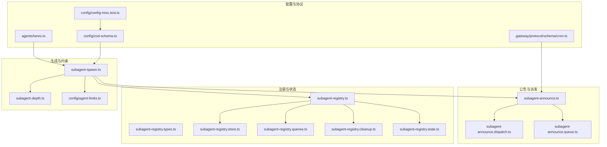
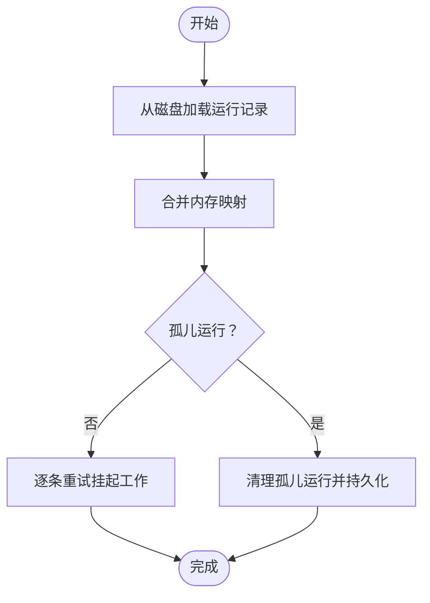
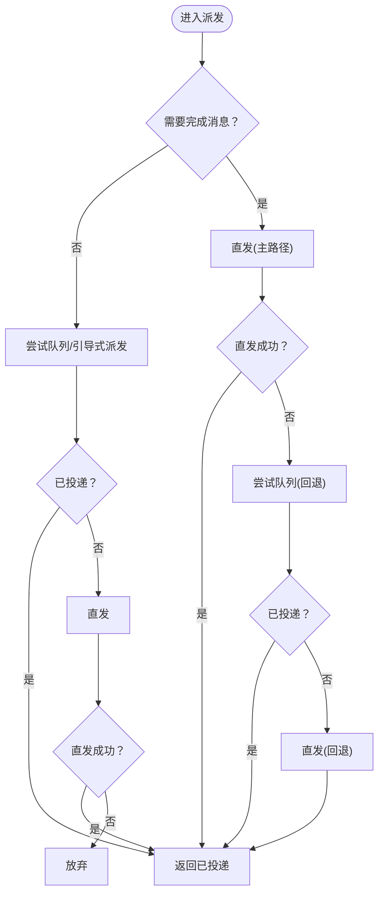
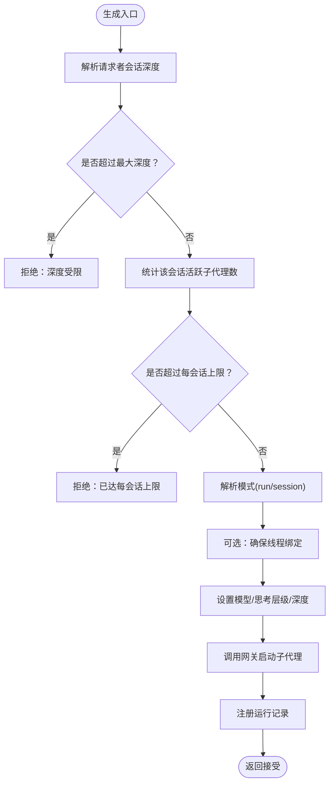
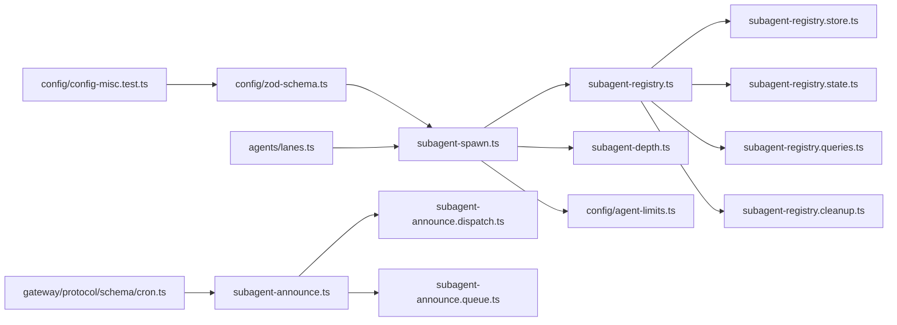

# 子代理系统

<cite>
**本文引用的文件**
- [src/agents/subagent-registry.ts](file://src/agents/subagent-registry.ts)
- [src/agents/subagent-registry.types.ts](file://src/agents/subagent-registry.types.ts)
- [src/agents/subagent-registry.store.ts](file://src/agents/subagent-registry.store.ts)
- [src/agents/subagent-registry.state.ts](file://src/agents/subagent-registry.state.ts)
- [src/agents/subagent-registry.queries.ts](file://src/agents/subagent-registry.queries.ts)
- [src/agents/subagent-registry.cleanup.ts](file://src/agents/subagent-registry.cleanup.ts)
- [src/agents/subagent-announce.ts](file://src/agents/subagent-announce.ts)
- [src/agents/subagent-announce.dispatch.ts](file://src/agents/subagent-announce.dispatch.ts)
- [src/agents/subagent-announce.queue.ts](file://src/agents/subagent-announce.queue.ts)
- [src/agents/subagent-spawn.ts](file://src/agents/subagent-spawn.ts)
- [src/agents/subagent-depth.ts](file://src/agents/subagent-depth.ts)
- [src/config/agent-limits.ts](file://src/config/agent-limits.ts)
- [src/config/zod-schema.ts](file://src/config/zod-schema.ts)
- [src/config/config-misc.test.ts](file://src/config/config-misc.test.ts)
- [src/agents/lanes.ts](file://src/agents/lanes.ts)
- [src/gateway/protocol/schema/cron.ts](file://src/gateway/protocol/schema/cron.ts)
</cite>

## 目录

1. [简介](#简介)
2. [项目结构](#项目结构)
3. [核心组件](#核心组件)
4. [架构总览](#架构总览)
5. [详细组件分析](#详细组件分析)
6. [依赖关系分析](#依赖关系分析)
7. [性能考量](#性能考量)
8. [故障排查指南](#故障排查指南)
9. [结论](#结论)
10. [附录](#附录)

## 简介

本文件系统性阐述 OpenClaw 子代理（Subagent）体系：从子代理的创建、注册与生命周期管理，到公告（Announce）分发与冲突处理，再到生成策略（深度限制、并发与队列）、消息传递与结果聚合、错误处理与恢复，以及配置项、监控与调试方法。目标是帮助开发者与运维人员快速理解并高效使用子代理系统。

## 项目结构

子代理系统主要由以下模块构成：

- 注册与状态：运行记录、持久化、查询与清理
- 公告与派发：直接发送、队列/引导式派发、重试与回退
- 生成与约束：深度限制、并发控制、会话绑定与线程保持
- 深度解析：从会话存储中推导当前会话的子代理层级
- 配置与校验：默认并发、最大深度、广播策略等

图表来源

- [src/agents/subagent-registry.ts](file://src/agents/subagent-registry.ts#L1-L1168)
- [src/agents/subagent-registry.types.ts](file://src/agents/subagent-registry.types.ts#L1-L36)
- [src/agents/subagent-registry.store.ts](file://src/agents/subagent-registry.store.ts#L1-L132)
- [src/agents/subagent-registry.state.ts](file://src/agents/subagent-registry.state.ts#L1-L57)
- [src/agents/subagent-registry.queries.ts](file://src/agents/subagent-registry.queries.ts#L1-L147)
- [src/agents/subagent-registry.cleanup.ts](file://src/agents/subagent-registry.cleanup.ts#L1-L68)
- [src/agents/subagent-announce.ts](file://src/agents/subagent-announce.ts#L1-L1383)
- [src/agents/subagent-announce.dispatch.ts](file://src/agents/subagent-announce.dispatch.ts#L1-L105)
- [src/agents/subagent-announce.queue.ts](file://src/agents/subagent-announce.queue.ts#L1-L229)
- [src/agents/subagent-spawn.ts](file://src/agents/subagent-spawn.ts#L1-L551)
- [src/agents/subagent-depth.ts](file://src/agents/subagent-depth.ts#L1-L177)
- [src/config/agent-limits.ts](file://src/config/agent-limits.ts#L1-L22)
- [src/config/zod-schema.ts](file://src/config/zod-schema.ts#L764-L813)
- [src/config/config-misc.test.ts](file://src/config/config-misc.test.ts#L194-L225)
- [src/agents/lanes.ts](file://src/agents/lanes.ts#L1-L4)
- [src/gateway/protocol/schema/cron.ts](file://src/gateway/protocol/schema/cron.ts#L1-L20)

章节来源

- [src/agents/subagent-registry.ts](file://src/agents/subagent-registry.ts#L1-L1168)
- [src/agents/subagent-announce.ts](file://src/agents/subagent-announce.ts#L1-L1383)
- [src/agents/subagent-spawn.ts](file://src/agents/subagent-spawn.ts#L1-L551)

## 核心组件

- 运行记录与注册表
  - 记录字段覆盖运行标识、父子会话键、请求者上下文、任务与超时、清理策略、生命周期时间戳、结果与原因、是否期望完成消息、重试计数与最后重试时间、线程保持标记等。
  - 提供持久化（磁盘 JSON）与内存映射，支持重启后恢复、孤儿运行清理、挂起工作重试、归档回收。
- 公告与派发
  - 支持“直接发送”和“队列/引导式派发”，在需要完成消息确认时采用主路径直发+回退队列的双阶段策略；否则优先尝试队列/引导式派发，失败再直发。
  - 对瞬时错误进行有限次数重试，永久错误直接放弃；支持幂等键避免重复。
- 生成与约束
  - 通过深度解析与配置限制，控制最大嵌套深度与每会话活跃子代理上限，防止过度分叉。
  - 支持“run”与“session”两种模式，后者可保持线程会话以便后续跟进。
- 深度解析
  - 从会话存储中读取 spawnDepth/spawnedBy 字段，递归计算当前会话的子代理层级，作为生成策略与公告路由的重要依据。
- 配置与校验
  - 默认并发、最大深度、广播策略等通过配置与 Zod 校验保障一致性；测试用例覆盖广播策略与键值合法性。

章节来源

- [src/agents/subagent-registry.types.ts](file://src/agents/subagent-registry.types.ts#L6-L35)
- [src/agents/subagent-registry.store.ts](file://src/agents/subagent-registry.store.ts#L48-L131)
- [src/agents/subagent-announce.dispatch.ts](file://src/agents/subagent-announce.dispatch.ts#L42-L104)
- [src/agents/subagent-spawn.ts](file://src/agents/subagent-spawn.ts#L231-L248)
- [src/agents/subagent-depth.ts](file://src/agents/subagent-depth.ts#L124-L176)
- [src/config/agent-limits.ts](file://src/config/agent-limits.ts#L1-L22)
- [src/config/zod-schema.ts](file://src/config/zod-schema.ts#L764-L813)
- [src/config/config-misc.test.ts](file://src/config/config-misc.test.ts#L194-L225)

## 架构总览

子代理系统围绕“生成—公告—清理—回收”的闭环运转：

- 生成阶段：根据请求者会话深度与配置，决定是否允许生成、最大并发与每会话活跃上限，并选择会话模式。
- 公告阶段：优先队列/引导式派发，失败则直发；若需完成消息确认，则采用“直发→队列回退”的策略。
- 清理阶段：根据是否成功公告、是否仍有后代运行、是否超过重试上限或过期，决定延迟重试、放弃或最终清理。
- 回收阶段：定期扫描并删除已归档的运行记录，必要时调用会话删除接口回收资源。

```mermaid
sequenceDiagram
participant Caller as "调用方"
participant Spawner as "生成器(subagent-spawn)"
participant Registry as "注册表(subagent-registry)"
participant Announcer as "公告器(subagent-announce)"
participant Dispatcher as "派发器(subagent-announce.dispatch)"
participant Queue as "队列(subagent-announce.queue)"
participant Gateway as "网关(gateway)"
Caller->>Spawner : 请求生成子代理
Spawner->>Spawner : 校验深度/并发/会话绑定
Spawner->>Gateway : 创建子代理会话并启动
Spawner->>Registry : 注册运行记录
Spawner-->>Caller : 返回接受/错误
Note over Registry : 后台监听生命周期事件
Registry->>Announcer : 触发清理流程
Announcer->>Dispatcher : 选择派发策略
alt 需要完成消息
Dispatcher->>Announcer : 直发(主路径)
Announcer->>Gateway : 发送完成消息
opt 失败
Dispatcher->>Queue : 入队(回退)
Queue->>Gateway : 定时出队发送
end
else 不需要完成消息
Dispatcher->>Queue : 尝试队列/引导式派发
opt 失败
Dispatcher->>Announcer : 直发
Announcer->>Gateway : 发送
end
end
Registry->>Registry : 判定是否放弃/重试/清理
Registry->>Gateway : 可选删除会话
```

图表来源

- [src/agents/subagent-spawn.ts](file://src/agents/subagent-spawn.ts#L166-L550)
- [src/agents/subagent-registry.ts](file://src/agents/subagent-registry.ts#L380-L486)
- [src/agents/subagent-announce.ts](file://src/agents/subagent-announce.ts#L572-L803)
- [src/agents/subagent-announce.dispatch.ts](file://src/agents/subagent-announce.dispatch.ts#L42-L104)
- [src/agents/subagent-announce.queue.ts](file://src/agents/subagent-announce.queue.ts#L202-L229)

## 详细组件分析

### 注册表与运行记录

- 数据模型
  - 关键字段：运行 ID、子代理会话键、请求者会话键、请求者交付上下文、显示键、任务文本、清理策略、标签、模型、运行超时秒、生成模式、创建/开始/结束时间、结果、归档时间、清理完成/处理标记、抑制公告原因、是否期望完成消息、重试计数与最后重试时间、生命周期原因、钩子已发出时间等。
- 生命周期管理
  - 启动：注册运行记录，持久化。
  - 监听：订阅生命周期事件，区分 start/error/end，对 error 延迟清理以避免瞬态重试导致的误判。
  - 结束：计算结果与原因，触发完成消息派发与清理流程。
  - 清理：根据是否收到完成消息、是否有后代运行、是否超过重试上限或过期，决定延迟重试、放弃或最终清理。
  - 回收：定期扫描并删除已归档记录，必要时删除对应会话。
- 恢复与一致性
  - 启动时从磁盘加载并合并内存映射，清理孤儿运行，按需重试挂起工作。
  - 提供快照读取，兼顾多进程可见性。

图表来源

- [src/agents/subagent-registry.store.ts](file://src/agents/subagent-registry.store.ts#L48-L118)
- [src/agents/subagent-registry.ts](file://src/agents/subagent-registry.ts#L488-L518)

章节来源

- [src/agents/subagent-registry.types.ts](file://src/agents/subagent-registry.types.ts#L6-L35)
- [src/agents/subagent-registry.store.ts](file://src/agents/subagent-registry.store.ts#L48-L131)
- [src/agents/subagent-registry.state.ts](file://src/agents/subagent-registry.state.ts#L15-L56)
- [src/agents/subagent-registry.cleanup.ts](file://src/agents/subagent-registry.cleanup.ts#L33-L67)
- [src/agents/subagent-registry.ts](file://src/agents/subagent-registry.ts#L488-L584)

### 公告与派发机制

- 派发策略
  - 若不需要完成消息：优先队列/引导式派发，失败则直发。
  - 若需要完成消息：先直发，失败则入队回退；若仍失败则回退到直发。
  - 每个阶段记录路径与错误，便于诊断。
- 错误分类与重试
  - 瞬时错误（如网关不可用、网络错误）进行有限次重试，指数退避。
  - 永久错误（如未知通道、用户屏蔽）直接放弃。
- 幂等与路由
  - 使用幂等键避免重复；完成消息路由优先使用绑定会话，其次全局钩子，最后回退到请求者来源。
- 队列行为
  - 支持收集模式汇总、去重策略、跨通道识别与退避重试；连续失败时指数退避，上限 60 秒。

图表来源

- [src/agents/subagent-announce.dispatch.ts](file://src/agents/subagent-announce.dispatch.ts#L42-L104)
- [src/agents/subagent-announce.ts](file://src/agents/subagent-announce.ts#L117-L201)
- [src/agents/subagent-announce.queue.ts](file://src/agents/subagent-announce.queue.ts#L116-L200)

章节来源

- [src/agents/subagent-announce.dispatch.ts](file://src/agents/subagent-announce.dispatch.ts#L1-L105)
- [src/agents/subagent-announce.ts](file://src/agents/subagent-announce.ts#L117-L201)
- [src/agents/subagent-announce.queue.ts](file://src/agents/subagent-announce.queue.ts#L1-L229)

### 生成策略与资源分配

- 深度限制
  - 通过深度解析确定当前会话层级，结合配置的最大嵌套深度判断是否允许生成。
- 并发与上限
  - 全局与子代理默认并发、每会话活跃子代理上限（默认 5），防止过度分叉。
- 会话模式
  - “run”：任务完成后会话销毁；“session”：保持会话以便后续跟进，需显式开启。
- 模型与思考层级
  - 支持按代理配置与覆盖参数设置模型与思考层级，失败时返回错误信息。

图表来源

- [src/agents/subagent-spawn.ts](file://src/agents/subagent-spawn.ts#L231-L248)
- [src/agents/subagent-spawn.ts](file://src/agents/subagent-spawn.ts#L386-L404)
- [src/agents/subagent-spawn.ts](file://src/agents/subagent-spawn.ts#L409-L431)
- [src/agents/subagent-spawn.ts](file://src/agents/subagent-spawn.ts#L488-L501)
- [src/agents/subagent-depth.ts](file://src/agents/subagent-depth.ts#L124-L176)
- [src/config/agent-limits.ts](file://src/config/agent-limits.ts#L1-L22)

章节来源

- [src/agents/subagent-spawn.ts](file://src/agents/subagent-spawn.ts#L166-L550)
- [src/agents/subagent-depth.ts](file://src/agents/subagent-depth.ts#L124-L176)
- [src/config/agent-limits.ts](file://src/config/agent-limits.ts#L1-L22)

### 消息传递、协调通信与结果聚合

- 完成消息合成
  - 根据运行结果（成功/失败/超时）与模式（run/session），生成简洁的摘要消息，必要时附加最新输出。
- 路由与回退
  - 绑定会话优先；无绑定时走全局钩子；最后回退到请求者来源。
- 结果聚合
  - 由于每层仅接收直接子代的公告，结果向上游逐层合成，最终由主代理向用户呈现。

章节来源

- [src/agents/subagent-announce.ts](file://src/agents/subagent-announce.ts#L68-L98)
- [src/agents/subagent-announce.ts](file://src/agents/subagent-announce.ts#L471-L570)

### 错误处理、失败恢复与降级策略

- 瞬态错误重试
  - 对网关不可用、网络错误等进行有限次重试，指数退避，避免雪崩。
- 永久错误放弃
  - 对不支持的通道、用户屏蔽等永久错误直接放弃，记录并清理。
- 生命周期错误延迟清理
  - 对嵌入式运行的瞬态错误事件延迟清理，等待后续 start/end 事件以修正状态。
- 清理决策
  - 若仍有后代运行，延迟重试；若超过重试上限或过期，放弃并清理；否则按指数退避重试。

章节来源

- [src/agents/subagent-announce.ts](file://src/agents/subagent-announce.ts#L117-L201)
- [src/agents/subagent-registry.ts](file://src/agents/subagent-registry.ts#L238-L272)
- [src/agents/subagent-registry.cleanup.ts](file://src/agents/subagent-registry.cleanup.ts#L33-L67)

### 配置选项、性能监控与调试

- 配置项
  - 默认并发、子代理默认并发、最大生成深度、每会话最大子代理数、公告超时、广播策略等。
- 性能监控
  - 运行时统计输入/输出令牌、总令牌与运行时长，用于评估成本与耗时。
- 调试
  - 提供快速测试模式与较短重试间隔；日志记录派发阶段、错误类型与重试次数，便于定位问题。

章节来源

- [src/config/agent-limits.ts](file://src/config/agent-limits.ts#L1-L22)
- [src/agents/subagent-announce.ts](file://src/agents/subagent-announce.ts#L391-L432)
- [src/config/zod-schema.ts](file://src/config/zod-schema.ts#L764-L813)
- [src/config/config-misc.test.ts](file://src/config/config-misc.test.ts#L194-L225)

## 依赖关系分析

- 组件耦合
  - 生成器依赖注册表进行运行记录登记与查询；注册表依赖存储模块进行持久化；公告器依赖派发器与队列模块；深度解析依赖会话存储。
- 外部依赖
  - 网关调用用于创建/删除会话、发送消息与读取历史；钩子系统用于路由与生命周期事件扩展。
- 循环依赖规避
  - 通过延迟导入与运行时检查避免循环引用；注册表内部对部分函数采用动态导入以减少耦合。

图表来源

- [src/agents/subagent-spawn.ts](file://src/agents/subagent-spawn.ts#L1-L551)
- [src/agents/subagent-registry.ts](file://src/agents/subagent-registry.ts#L1-L1168)
- [src/agents/subagent-announce.ts](file://src/agents/subagent-announce.ts#L1-L1383)
- [src/agents/subagent-announce.dispatch.ts](file://src/agents/subagent-announce.dispatch.ts#L1-L105)
- [src/agents/subagent-announce.queue.ts](file://src/agents/subagent-announce.queue.ts#L1-L229)
- [src/agents/subagent-depth.ts](file://src/agents/subagent-depth.ts#L1-L177)
- [src/config/agent-limits.ts](file://src/config/agent-limits.ts#L1-L22)
- [src/config/zod-schema.ts](file://src/config/zod-schema.ts#L764-L813)
- [src/config/config-misc.test.ts](file://src/config/config-misc.test.ts#L194-L225)
- [src/agents/lanes.ts](file://src/agents/lanes.ts#L1-L4)
- [src/gateway/protocol/schema/cron.ts](file://src/gateway/protocol/schema/cron.ts#L1-L20)

## 性能考量

- 并发控制
  - 全局与子代理默认并发限制，避免资源争用；每会话活跃子代理上限防止分叉失控。
- 队列与退避
  - 队列支持汇总与去重，跨通道识别；连续失败指数退避，降低对下游压力。
- 持久化与扫描
  - 定期归档与扫描删除，释放会话资源；磁盘读写失败不影响内存状态，保证可用性。

## 故障排查指南

- 常见问题
  - 深度受限：检查最大嵌套深度与当前层级，调整配置或重构任务拆分。
  - 并发不足：提升默认并发或子代理并发，观察资源占用与延迟。
  - 公告失败：查看瞬时/永久错误分类，确认通道支持与路由配置。
  - 孤儿运行：系统会自动清理，若未清理，检查会话存储与请求者会话键。
- 诊断建议
  - 开启快速测试模式定位瞬时问题；查看日志中的派发阶段与重试次数；核对钩子与路由配置。

章节来源

- [src/agents/subagent-spawn.ts](file://src/agents/subagent-spawn.ts#L231-L248)
- [src/agents/subagent-announce.ts](file://src/agents/subagent-announce.ts#L117-L201)
- [src/agents/subagent-registry.ts](file://src/agents/subagent-registry.ts#L112-L141)

## 结论

子代理系统通过严格的深度与并发控制、可靠的公告派发与清理回收机制，实现了可扩展、可观测且可恢复的多层任务执行框架。配合灵活的会话模式与路由钩子，既能满足复杂任务编排，又能保证用户体验与系统稳定性。

## 附录

- 最佳实践
  - 明确任务边界，避免过深嵌套；合理设置每会话活跃上限；在需要结果确认时启用完成消息。
  - 使用“session”模式保持线程会话，便于后续跟进；为关键代理配置专用模型与思考层级。
  - 监控令牌消耗与运行时长，优化提示词与工具调用。
- 常见陷阱
  - 忽视深度限制导致生成失败；未设置每会话上限引发资源膨胀。
  - 盲目依赖直发而忽略队列回退，导致高并发下的丢消息。
  - 未正确处理生命周期错误，导致误判与重复清理。
- 解决方案
  - 在生成前检查深度与并发；在需要确认时启用完成消息并使用队列回退。
  - 通过钩子与绑定路由确保消息可达；利用归档与回收机制释放资源。
