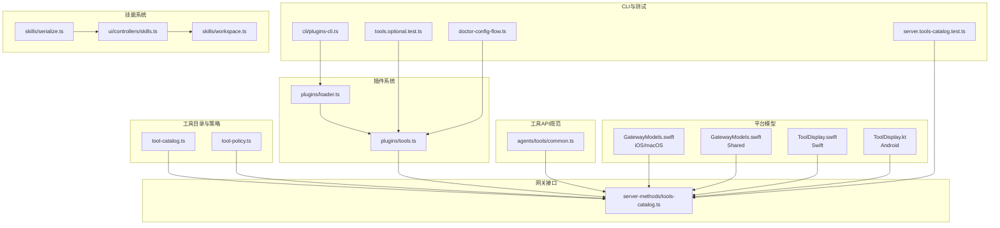
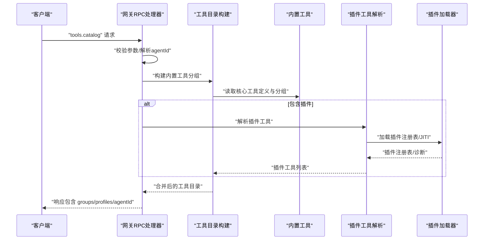
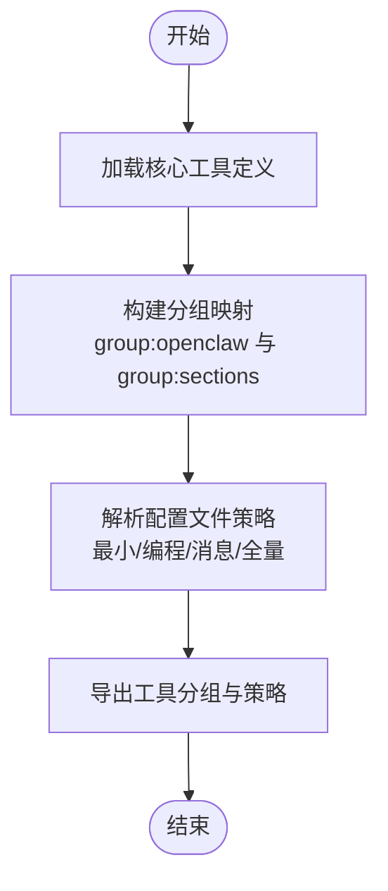
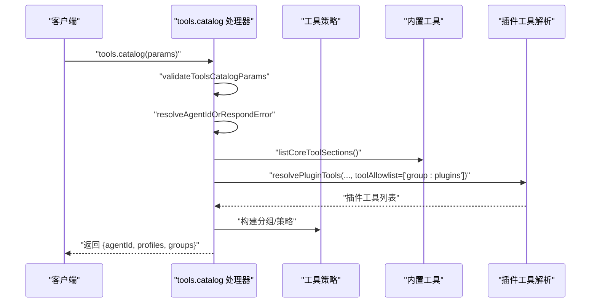
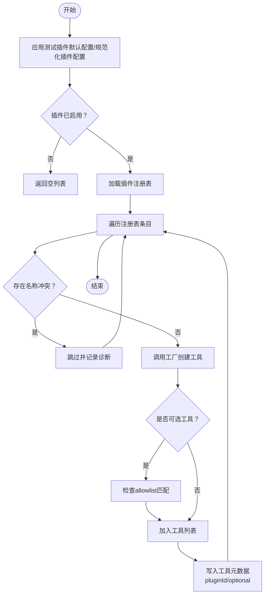
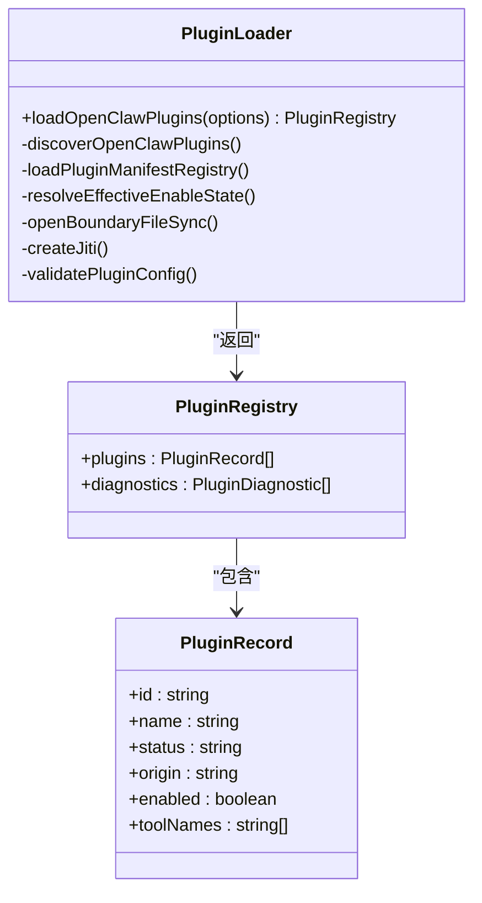
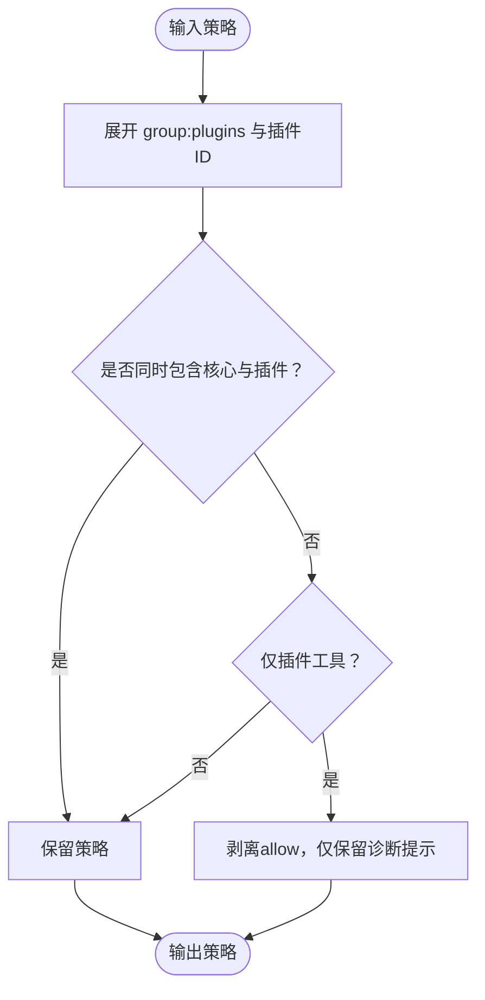
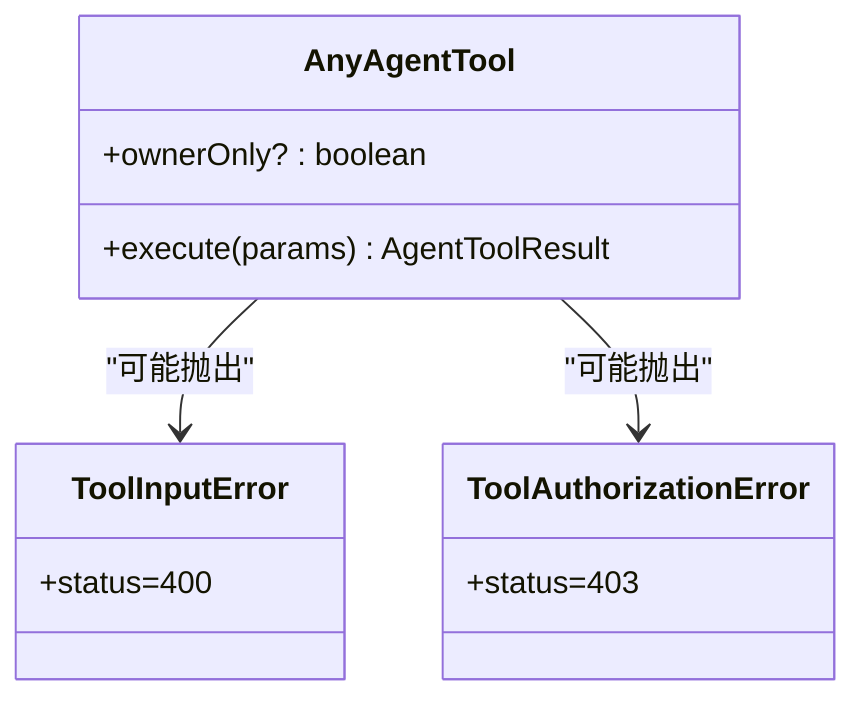
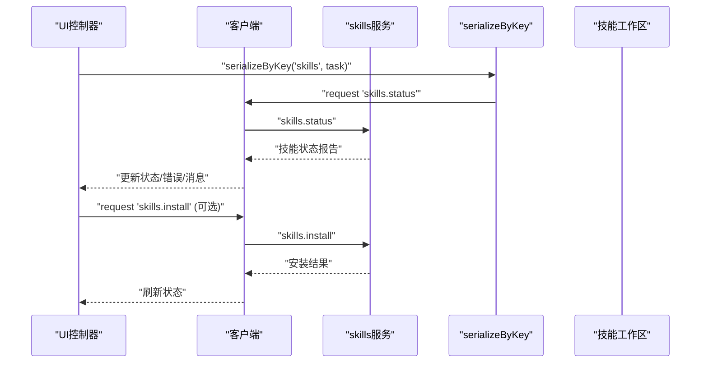
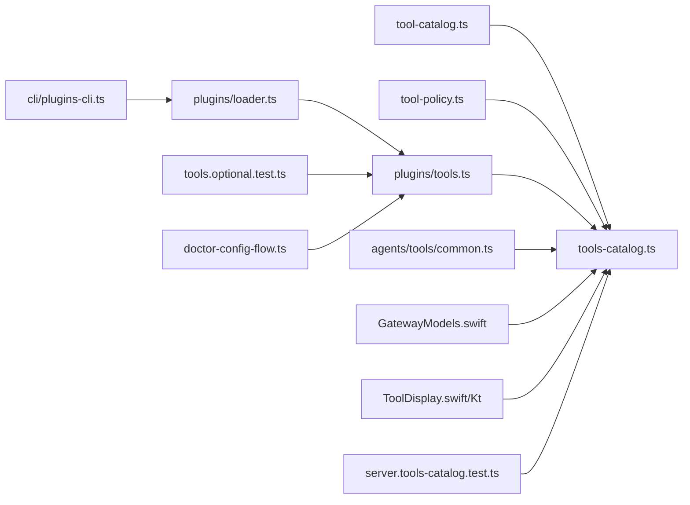

# 工具发现与注册

<cite>
**本文引用的文件**
- [src/agents/tool-catalog.ts](file://src/agents/tool-catalog.ts)
- [src/gateway/server-methods/tools-catalog.ts](file://src/gateway/server-methods/tools-catalog.ts)
- [src/plugins/tools.ts](file://src/plugins/tools.ts)
- [src/plugins/loader.ts](file://src/plugins/loader.ts)
- [src/agents/tool-policy.ts](file://src/agents/tool-policy.ts)
- [src/agents/tools/common.ts](file://src/agents/tools/common.ts)
- [src/gateway/server.tools-catalog.test.ts](file://src/gateway/server.tools-catalog.test.ts)
- [apps/shared/OpenClawKit/Sources/OpenClawProtocol/GatewayModels.swift](file://apps/shared/OpenClawKit/Sources/OpenClawProtocol/GatewayModels.swift)
- [apps/macos/Sources/OpenClawProtocol/GatewayModels.swift](file://apps/macos/Sources/OpenClawProtocol/GatewayModels.swift)
- [src/cli/plugins-cli.ts](file://src/cli/plugins-cli.ts)
- [src/plugins/tools.optional.test.ts](file://src/plugins/tools.optional.test.ts)
- [src/commands/doctor-config-flow.ts](file://src/commands/doctor-config-flow.ts)
- [apps/shared/OpenClawKit/Sources/OpenClawKit/ToolDisplay.swift](file://apps/shared/OpenClawKit/Sources/OpenClawKit/ToolDisplay.swift)
- [apps/android/app/src/main/java/ai/openclaw/android/tools/ToolDisplay.kt](file://apps/android/app/src/main/java/ai/openclaw/android/tools/ToolDisplay.kt)
- [src/agents/skills/serialize.ts](file://src/agents/skills/serialize.ts)
- [ui/src/ui/controllers/skills.ts](file://ui/src/ui/controllers/skills.ts)
- [src/agents/skills/workspace.ts](file://src/agents/skills/workspace.ts)
</cite>

## 目录

1. [简介](#简介)
2. [项目结构](#项目结构)
3. [核心组件](#核心组件)
4. [架构总览](#架构总览)
5. [详细组件分析](#详细组件分析)
6. [依赖分析](#依赖分析)
7. [性能考虑](#性能考虑)
8. [故障排查指南](#故障排查指南)
9. [结论](#结论)
10. [附录：开发者注册指南与最佳实践](#附录开发者注册指南与最佳实践)

## 简介

本文件系统化阐述 OpenClaw 的“工具发现与注册”机制，覆盖以下主题：

- 工具目录系统：内置工具、插件工具与自定义工具的发现与聚合
- 工具注册机制：元数据收集、校验与索引
- 工具分类体系：类型识别、优先级与分组、依赖与策略
- 工具加载策略：延迟加载、批量加载与热重载
- 工具 API 规范：参数、返回值、错误处理
- 与技能系统的集成：技能工具的特殊处理与优先级
- 开发者注册指南与最佳实践

## 项目结构

围绕工具发现与注册的关键模块分布如下：

- 工具目录与策略：src/agents/tool-catalog.ts、src/agents/tool-policy.ts
- 网关工具目录接口：src/gateway/server-methods/tools-catalog.ts
- 插件工具解析与注册：src/plugins/tools.ts、src/plugins/loader.ts
- 工具 API 规范与通用工具封装：src/agents/tools/common.ts
- 平台模型与显示层：apps/_/OpenClaw_/GatewayModels.swift、apps/\*/OpenClawKit/ToolDisplay.swift、apps/android/.../ToolDisplay.kt
- CLI 插件管理：src/cli/plugins-cli.ts
- 测试与配置扫描：src/gateway/server.tools-catalog.test.ts、src/plugins/tools.optional.test.ts、src/commands/doctor-config-flow.ts
- 技能系统与序列化：src/agents/skills/serialize.ts、ui/src/ui/controllers/skills.ts、src/agents/skills/workspace.ts

图表来源

- [src/agents/tool-catalog.ts](file://src/agents/tool-catalog.ts#L1-L327)
- [src/gateway/server-methods/tools-catalog.ts](file://src/gateway/server-methods/tools-catalog.ts#L1-L167)
- [src/plugins/tools.ts](file://src/plugins/tools.ts#L1-L140)
- [src/plugins/loader.ts](file://src/plugins/loader.ts#L368-L717)
- [src/agents/tool-policy.ts](file://src/agents/tool-policy.ts#L1-L206)
- [src/agents/tools/common.ts](file://src/agents/tools/common.ts#L1-L341)
- [apps/shared/OpenClawKit/Sources/OpenClawProtocol/GatewayModels.swift](file://apps/shared/OpenClawKit/Sources/OpenClawProtocol/GatewayModels.swift#L2226-L2283)
- [apps/macos/Sources/OpenClawProtocol/GatewayModels.swift](file://apps/macos/Sources/OpenClawProtocol/GatewayModels.swift#L2226-L2283)
- [apps/shared/OpenClawKit/Sources/OpenClawKit/ToolDisplay.swift](file://apps/shared/OpenClawKit/Sources/OpenClawKit/ToolDisplay.swift#L1-L46)
- [apps/android/app/src/main/java/ai/openclaw/android/tools/ToolDisplay.kt](file://apps/android/app/src/main/java/ai/openclaw/android/tools/ToolDisplay.kt#L1-L52)
- [src/cli/plugins-cli.ts](file://src/cli/plugins-cli.ts#L289-L540)
- [src/gateway/server.tools-catalog.test.ts](file://src/gateway/server.tools-catalog.test.ts#L1-L46)
- [src/plugins/tools.optional.test.ts](file://src/plugins/tools.optional.test.ts#L66-L112)
- [src/commands/doctor-config-flow.ts](file://src/commands/doctor-config-flow.ts#L1516-L1569)
- [src/agents/skills/serialize.ts](file://src/agents/skills/serialize.ts#L1-L14)
- [ui/src/ui/controllers/skills.ts](file://ui/src/ui/controllers/skills.ts#L46-L164)
- [src/agents/skills/workspace.ts](file://src/agents/skills/workspace.ts#L417-L463)

章节来源

- [src/agents/tool-catalog.ts](file://src/agents/tool-catalog.ts#L1-L327)
- [src/gateway/server-methods/tools-catalog.ts](file://src/gateway/server-methods/tools-catalog.ts#L1-L167)
- [src/plugins/tools.ts](file://src/plugins/tools.ts#L1-L140)
- [src/plugins/loader.ts](file://src/plugins/loader.ts#L368-L717)
- [src/agents/tool-policy.ts](file://src/agents/tool-policy.ts#L1-L206)
- [src/agents/tools/common.ts](file://src/agents/tools/common.ts#L1-L341)

## 核心组件

- 工具目录与分组（内置工具）
  - 定义核心工具清单、分组顺序与默认策略，支持按“最小/编程/消息/全量”等配置生成允许列表
- 网关工具目录 RPC 接口
  - 提供 tools.catalog 查询，聚合内置与插件工具，支持按 agentId 与 includePlugins 控制
- 插件工具解析与注册
  - 解析插件注册表，工厂实例化工具，处理可选工具与名称冲突，记录诊断信息
- 插件加载器
  - 发现插件、校验清单、边界安全检查、JITI 动态加载、缓存与内存槽决策
- 工具 API 规范
  - 统一参数读取、错误类型、结果封装、图片结果处理、执行守卫
- 工具策略与分组
  - 允许/拒绝策略、插件工具分组展开、核心与插件工具混合策略
- 显示与协议模型
  - 跨平台工具目录模型与显示配置结构
- CLI 与测试
  - 插件安装/状态展示、工具目录测试、可选工具行为测试、配置键扫描

章节来源

- [src/agents/tool-catalog.ts](file://src/agents/tool-catalog.ts#L1-L327)
- [src/gateway/server-methods/tools-catalog.ts](file://src/gateway/server-methods/tools-catalog.ts#L125-L166)
- [src/plugins/tools.ts](file://src/plugins/tools.ts#L45-L139)
- [src/plugins/loader.ts](file://src/plugins/loader.ts#L368-L717)
- [src/agents/tool-policy.ts](file://src/agents/tool-policy.ts#L89-L149)
- [src/agents/tools/common.ts](file://src/agents/tools/common.ts#L74-L302)
- [apps/shared/OpenClawKit/Sources/OpenClawProtocol/GatewayModels.swift](file://apps/shared/OpenClawKit/Sources/OpenClawProtocol/GatewayModels.swift#L2226-L2283)
- [apps/macos/Sources/OpenClawProtocol/GatewayModels.swift](file://apps/macos/Sources/OpenClawProtocol/GatewayModels.swift#L2226-L2283)

## 架构总览

工具发现与注册的整体流程：

- 网关接收 tools.catalog 请求，解析 agentId 与 includePlugins 参数
- 构建内置工具分组（来自 tool-catalog.ts）
- 可选构建插件工具分组（调用 plugins/tools.ts 的 resolvePluginTools）
- 合并内置与插件工具，返回包含工具 ID、标签、描述、来源、默认配置文件等信息的目录
- 插件加载器负责插件发现、清单校验、JITI 加载与注册，确保安全与可追踪性

图表来源

- [src/gateway/server-methods/tools-catalog.ts](file://src/gateway/server-methods/tools-catalog.ts#L125-L166)
- [src/agents/tool-catalog.ts](file://src/agents/tool-catalog.ts#L56-L69)
- [src/plugins/tools.ts](file://src/plugins/tools.ts#L45-L88)
- [src/plugins/loader.ts](file://src/plugins/loader.ts#L368-L448)

章节来源

- [src/gateway/server-methods/tools-catalog.ts](file://src/gateway/server-methods/tools-catalog.ts#L125-L166)
- [src/plugins/tools.ts](file://src/plugins/tools.ts#L45-L139)
- [src/plugins/loader.ts](file://src/plugins/loader.ts#L368-L717)

## 详细组件分析

### 工具目录与分组（内置工具）

- 核心工具定义：包含 ID、标签、描述、所属分组、默认配置文件集合
- 分组顺序：按“文件/运行时/网络/记忆/会话/UI/消息/自动化/节点/代理/媒体”等顺序组织
- 配置文件策略：按“最小/编程/消息/全量”生成允许列表；未显式声明的工具默认不可用
- 分组映射：支持 group:openclaw 与 group:sections 的工具集合，便于 UI 展示与策略扩展

图表来源

- [src/agents/tool-catalog.ts](file://src/agents/tool-catalog.ts#L27-L327)

章节来源

- [src/agents/tool-catalog.ts](file://src/agents/tool-catalog.ts#L1-L327)

### 网关工具目录接口

- 参数校验：agentId、includePlugins
- agentId 解析：若未提供则使用默认 agent；未知 agentId 返回 INVALID_REQUEST 错误
- 内置工具：从 tool-catalog.ts 读取分组与工具
- 插件工具：调用 resolvePluginTools 获取插件工具，按插件 ID 聚合成 group:plugin:<id>
- 响应：包含 agentId、可用配置文件选项、工具分组与工具列表

图表来源

- [src/gateway/server-methods/tools-catalog.ts](file://src/gateway/server-methods/tools-catalog.ts#L125-L166)

章节来源

- [src/gateway/server-methods/tools-catalog.ts](file://src/gateway/server-methods/tools-catalog.ts#L1-L167)

### 插件工具解析与注册

- 快速路径：当插件被禁用时跳过发现与 JITI，提升单元测试与热路径性能
- 注册表加载：通过 loadOpenClawPlugins 获取插件注册表与诊断
- 名称冲突处理：检测插件 ID 与核心工具名冲突、插件内工具名冲突；可选择抑制冲突日志
- 可选工具：仅在 allowlist 中包含工具名、插件 ID 或 group:plugins 时才加载
- 元数据注入：为每个工具写入 WeakMap 记录 pluginId 与 optional 标记

图表来源

- [src/plugins/tools.ts](file://src/plugins/tools.ts#L45-L139)
- [src/plugins/loader.ts](file://src/plugins/loader.ts#L368-L717)

章节来源

- [src/plugins/tools.ts](file://src/plugins/tools.ts#L1-L140)
- [src/plugins/loader.ts](file://src/plugins/loader.ts#L368-L717)

### 插件加载器（发现、校验、加载）

- 发现：扫描工作区与额外路径，建立候选集
- 清单注册表：加载插件清单，合并诊断
- 允许列表告警：当 plugins.allow 为空且发现非捆绑插件时发出警告
- 边界安全：入口文件必须位于插件根目录内，避免路径逃逸
- JITI 动态加载：支持 TS/JS 与别名，创建插件 API 并调用 register
- 缓存：基于工作区与插件配置构建缓存键，避免重复加载
- 内存槽决策：根据插件 kind 与配置决定是否启用并占用内存槽

图表来源

- [src/plugins/loader.ts](file://src/plugins/loader.ts#L368-L717)

章节来源

- [src/plugins/loader.ts](file://src/plugins/loader.ts#L368-L717)

### 工具策略与分组

- 插件工具分组：按 pluginId 收敛工具名，支持 group:plugins 展开
- 策略展开：将 allow/deny 列表中的 group:plugins 与插件 ID 展开为具体工具名
- 核心与插件混合策略：当 allowlist 仅包含插件工具时进行剥离，避免误禁用核心工具
- 允许列表规范化：合并 alsoAllow，去重，保留未知项以便诊断

图表来源

- [src/agents/tool-policy.ts](file://src/agents/tool-policy.ts#L89-L149)
- [src/agents/tool-policy.ts](file://src/agents/tool-policy.ts#L151-L206)

章节来源

- [src/agents/tool-policy.ts](file://src/agents/tool-policy.ts#L1-L206)

### 工具 API 规范

- 参数读取：统一读取字符串/数字/数组参数，支持 snake_case 兼容键
- 错误类型：ToolInputError（400）、ToolAuthorizationError（403）
- 结果封装：jsonResult 将任意负载序列化为文本内容与详情字段
- 图片结果：imageResult/imageResultFromFile 自动检测 MIME，支持图片净化
- 执行守卫：wrapOwnerOnlyToolExecution 对 ownerOnly 工具在非所有者调用时限制执行

图表来源

- [src/agents/tools/common.ts](file://src/agents/tools/common.ts#L7-L42)
- [src/agents/tools/common.ts](file://src/agents/tools/common.ts#L230-L302)

章节来源

- [src/agents/tools/common.ts](file://src/agents/tools/common.ts#L1-L341)

### 平台模型与显示层

- 网关模型：ToolCatalogEntry/ToolCatalogGroup 携带 id、label、description、source、pluginId、optional、defaultProfiles 等字段
- 显示配置：ToolDisplay.swift/ToolDisplay.kt 定义工具显示规格，支持 emoji/title/label/detail/actions 等

章节来源

- [apps/shared/OpenClawKit/Sources/OpenClawProtocol/GatewayModels.swift](file://apps/shared/OpenClawKit/Sources/OpenClawProtocol/GatewayModels.swift#L2226-L2283)
- [apps/macos/Sources/OpenClawProtocol/GatewayModels.swift](file://apps/macos/Sources/OpenClawProtocol/GatewayModels.swift#L2226-L2283)
- [apps/shared/OpenClawKit/Sources/OpenClawKit/ToolDisplay.swift](file://apps/shared/OpenClawKit/Sources/OpenClawKit/ToolDisplay.swift#L1-L46)
- [apps/android/app/src/main/java/ai/openclaw/android/tools/ToolDisplay.kt](file://apps/android/app/src/main/java/ai/openclaw/android/tools/ToolDisplay.kt#L1-L52)

### CLI 与测试

- 插件 CLI：展示插件状态、来源、工具/钩子/网关方法/提供商/CLI 命令/服务等信息
- 工具目录测试：验证 core 工具存在、includePlugins=false 行为、未知 agentId 错误
- 可选工具测试：验证可选工具在未显式允许时不加载，允许后可加载
- 配置扫描：扫描旧版 toolsBySender 键，生成迁移提示

章节来源

- [src/cli/plugins-cli.ts](file://src/cli/plugins-cli.ts#L289-L540)
- [src/gateway/server.tools-catalog.test.ts](file://src/gateway/server.tools-catalog.test.ts#L1-L46)
- [src/plugins/tools.optional.test.ts](file://src/plugins/tools.optional.test.ts#L66-L112)
- [src/commands/doctor-config-flow.ts](file://src/commands/doctor-config-flow.ts#L1516-L1569)

### 与技能系统的集成

- 技能状态与安装：通过 RPC skills.status/skills.install 获取与安装技能
- 序列化控制：serializeByKey 保证同一 key 的异步操作串行化
- 技能快照：buildWorkspaceSkillSnapshot 生成技能提示与过滤条件
- UI 控制器：skills 控制器负责加载、错误处理与消息反馈

图表来源

- [src/agents/skills/serialize.ts](file://src/agents/skills/serialize.ts#L1-L14)
- [ui/src/ui/controllers/skills.ts](file://ui/src/ui/controllers/skills.ts#L46-L164)
- [src/agents/skills/workspace.ts](file://src/agents/skills/workspace.ts#L417-L463)

章节来源

- [src/agents/skills/serialize.ts](file://src/agents/skills/serialize.ts#L1-L14)
- [ui/src/ui/controllers/skills.ts](file://ui/src/ui/controllers/skills.ts#L46-L164)
- [src/agents/skills/workspace.ts](file://src/agents/skills/workspace.ts#L417-L463)

## 依赖分析

- 工具目录依赖：内置工具定义与分组映射
- 网关依赖：工具目录、插件工具解析、参数校验
- 插件解析依赖：插件加载器、注册表、工厂函数
- 插件加载器依赖：发现、清单注册表、JITI、边界文件读取、内存槽决策
- 工具策略依赖：插件工具分组、核心工具集合
- 显示层依赖：跨平台模型与显示配置

图表来源

- [src/agents/tool-catalog.ts](file://src/agents/tool-catalog.ts#L1-L327)
- [src/gateway/server-methods/tools-catalog.ts](file://src/gateway/server-methods/tools-catalog.ts#L1-L167)
- [src/plugins/tools.ts](file://src/plugins/tools.ts#L1-L140)
- [src/plugins/loader.ts](file://src/plugins/loader.ts#L368-L717)
- [src/agents/tool-policy.ts](file://src/agents/tool-policy.ts#L1-L206)
- [src/agents/tools/common.ts](file://src/agents/tools/common.ts#L1-L341)
- [apps/shared/OpenClawKit/Sources/OpenClawProtocol/GatewayModels.swift](file://apps/shared/OpenClawKit/Sources/OpenClawProtocol/GatewayModels.swift#L2226-L2283)
- [apps/shared/OpenClawKit/Sources/OpenClawKit/ToolDisplay.swift](file://apps/shared/OpenClawKit/Sources/OpenClawKit/ToolDisplay.swift#L1-L46)
- [apps/android/app/src/main/java/ai/openclaw/android/tools/ToolDisplay.kt](file://apps/android/app/src/main/java/ai/openclaw/android/tools/ToolDisplay.kt#L1-L52)
- [src/cli/plugins-cli.ts](file://src/cli/plugins-cli.ts#L289-L540)
- [src/gateway/server.tools-catalog.test.ts](file://src/gateway/server.tools-catalog.test.ts#L1-L46)
- [src/plugins/tools.optional.test.ts](file://src/plugins/tools.optional.test.ts#L66-L112)
- [src/commands/doctor-config-flow.ts](file://src/commands/doctor-config-flow.ts#L1516-L1569)

章节来源

- [src/gateway/server-methods/tools-catalog.ts](file://src/gateway/server-methods/tools-catalog.ts#L1-L167)
- [src/plugins/tools.ts](file://src/plugins/tools.ts#L1-L140)
- [src/plugins/loader.ts](file://src/plugins/loader.ts#L368-L717)

## 性能考虑

- 快速路径：当插件禁用时跳过发现与 JITI，显著降低单元测试与热路径开销
- 缓存：基于工作区与插件配置构建缓存键，避免重复加载
- 延迟加载：JITI 按需创建，减少启动时间
- 批量加载：一次解析多个插件工具，减少多次工厂调用成本
- 热重载：通过缓存失效与注册表替换实现插件热重载（由上层框架或 CLI 触发）

## 故障排查指南

- tools.catalog 返回 unknown agent id
  - 检查 agentId 是否存在于已知 agent 列表中
  - 确认默认 agent 解析逻辑与配置
- 插件工具未出现
  - 检查 includePlugins 参数与 allowlist
  - 确认插件 ID 与核心工具名无冲突
  - 查看诊断信息（registry.diagnostics）了解加载失败原因
- 可选工具未加载
  - 确认 allowlist 中包含工具名、插件 ID 或 group:plugins
- 工具执行报错
  - ownerOnly 工具仅允许所有者调用
  - 参数缺失或类型不正确会抛出 ToolInputError
  - 权限不足会抛出 ToolAuthorizationError

章节来源

- [src/gateway/server-methods/tools-catalog.ts](file://src/gateway/server-methods/tools-catalog.ts#L40-L54)
- [src/plugins/tools.ts](file://src/plugins/tools.ts#L70-L139)
- [src/plugins/tools.optional.test.ts](file://src/plugins/tools.optional.test.ts#L66-L112)
- [src/agents/tools/common.ts](file://src/agents/tools/common.ts#L24-L42)

## 结论

OpenClaw 的工具发现与注册机制以“内置工具 + 插件工具”的双轨模式为核心，通过严格的参数校验、安全的插件加载与缓存、灵活的策略与分组展开，实现了高可扩展、可追踪、可维护的工具生态。配合网关 RPC 接口与跨平台显示模型，开发者可以快速注册新工具并融入现有工作流。

## 附录：开发者注册指南与最佳实践

- 注册步骤
  - 在插件中导出 register/activate 函数，返回工具定义或注册工具
  - 使用工具工厂函数创建工具实例，确保工具名称唯一且符合命名规范
  - 如工具为可选，请在 allowlist 中显式允许或使用 group:plugins
- 最佳实践
  - 为工具提供清晰的标签与描述，便于目录展示
  - 使用统一的参数读取与错误处理，保持 API 一致性
  - 对敏感工具设置 ownerOnly，避免非授权调用
  - 通过 plugins.allow 与安装记录追踪插件来源，避免未受控加载
  - 使用缓存与批量化加载策略，优化启动与运行时性能
  - 在 CI 中运行工具目录测试，确保工具可见性与兼容性

章节来源

- [src/plugins/loader.ts](file://src/plugins/loader.ts#L368-L717)
- [src/plugins/tools.ts](file://src/plugins/tools.ts#L45-L139)
- [src/agents/tools/common.ts](file://src/agents/tools/common.ts#L74-L302)
- [src/cli/plugins-cli.ts](file://src/cli/plugins-cli.ts#L289-L540)
- [src/gateway/server.tools-catalog.test.ts](file://src/gateway/server.tools-catalog.test.ts#L1-L46)
