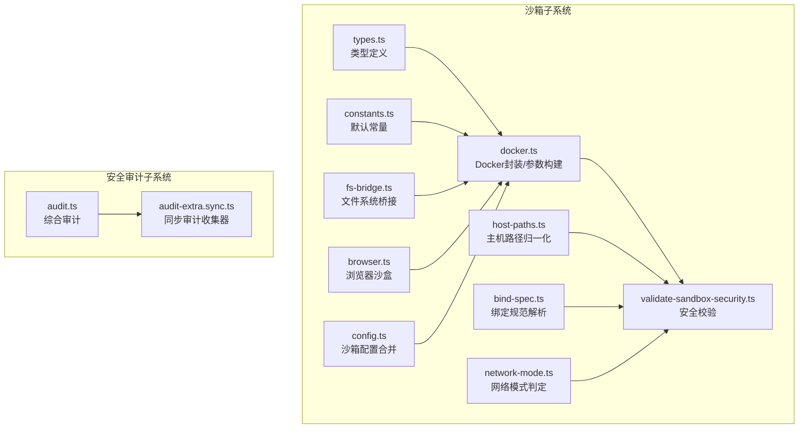
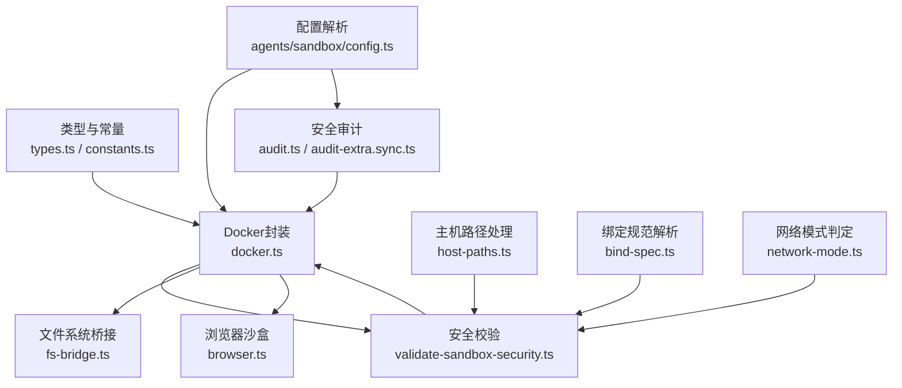
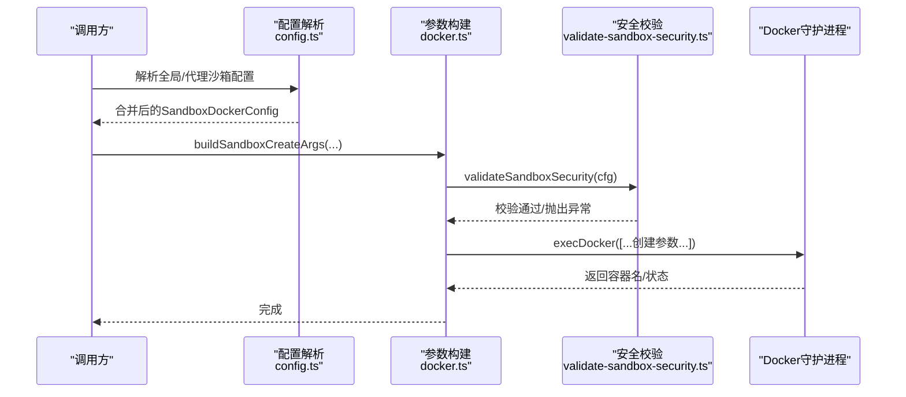
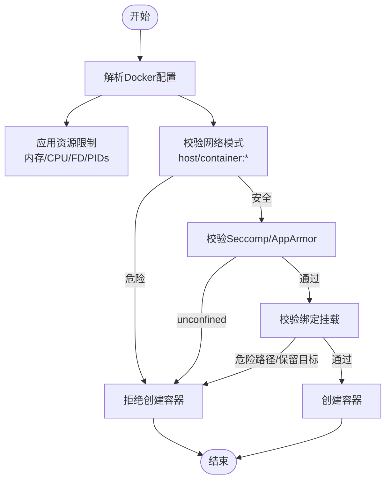
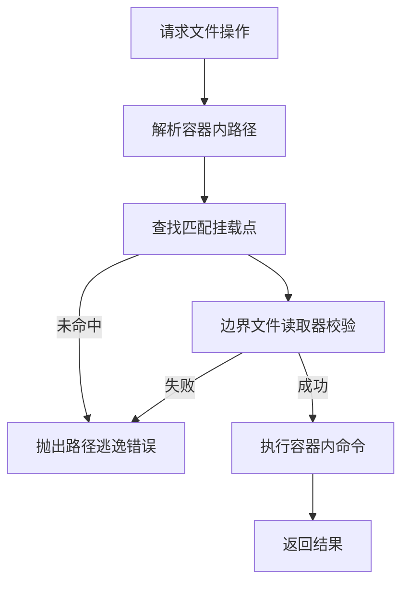
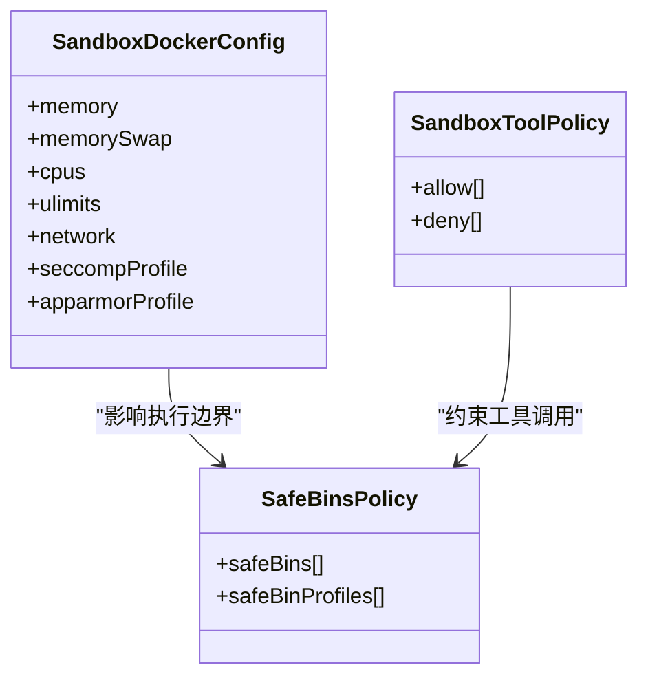
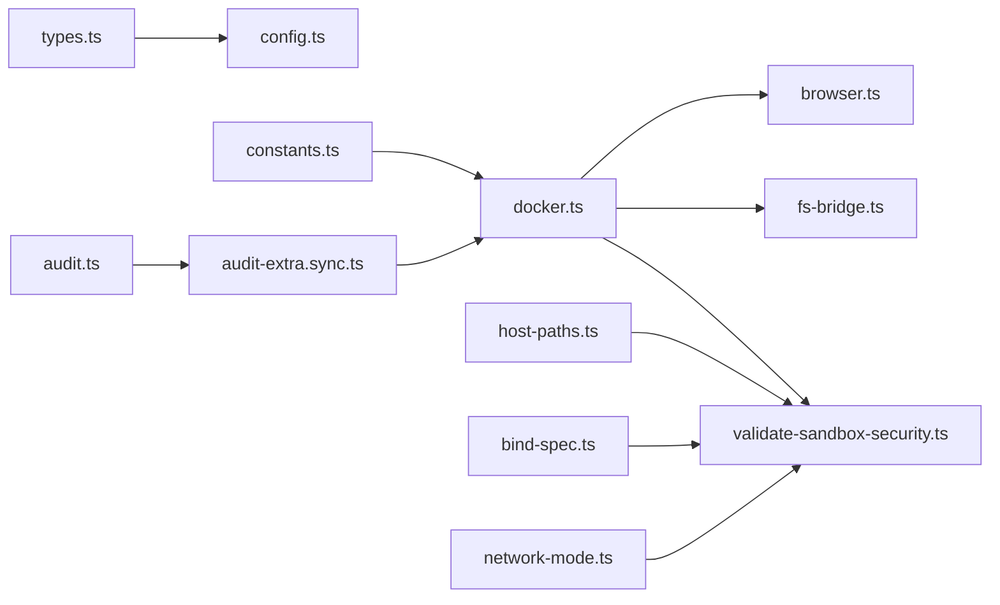

# 工具安全与隔离

<cite>
**本文引用的文件**
- [src/agents/sandbox/types.ts](file://src/agents/sandbox/types.ts)
- [src/agents/sandbox/constants.ts](file://src/agents/sandbox/constants.ts)
- [src/agents/sandbox/docker.ts](file://src/agents/sandbox/docker.ts)
- [src/agents/sandbox/validate-sandbox-security.ts](file://src/agents/sandbox/validate-sandbox-security.ts)
- [src/agents/sandbox/host-paths.ts](file://src/agents/sandbox/host-paths.ts)
- [src/agents/sandbox/fs-bridge.ts](file://src/agents/sandbox/fs-bridge.ts)
- [src/agents/sandbox/bind-spec.ts](file://src/agents/sandbox/bind-spec.ts)
- [src/agents/sandbox/network-mode.ts](file://src/agents/sandbox/network-mode.ts)
- [src/agents/sandbox/browser.ts](file://src/agents/sandbox/browser.ts)
- [src/agents/sandbox/config.ts](file://src/agents/sandbox/config.ts)
- [src/agents/sandbox-create-args.test.ts](file://src/agents/sandbox-create-args.test.ts)
- [src/gateway/server-methods/agents.ts](file://src/gateway/server-methods/agents.ts)
- [src/agents/pi-tools.read.ts](file://src/agents/pi-tools.read.ts)
- [src/infra/boundary-file-read.ts](file://src/infra/boundary-file-read.ts)
- [src/agents/pi-tools.safe-bins.test.ts](file://src/agents/pi-tools.safe-bins.test.ts)
- [docs/cli/security.md](file://docs/cli/security.md)
- [src/commands/status.command.ts](file://src/commands/status.command.ts)
- [docs/gateway/security/index.md](file://docs/gateway/security/index.md)
- [src/security/audit.ts](file://src/security/audit.ts)
- [src/security/audit-extra.sync.ts](file://src/security/audit-extra.sync.ts)
- [src/auto-reply/reply/abort.ts](file://src/auto-reply/reply/abort.ts)
- [src/auto-reply/reply/commands-session-abort.ts](file://src/auto-reply/reply/commands-session-abort.ts)
</cite>

## 目录

1. [简介](#简介)
2. [项目结构](#项目结构)
3. [核心组件](#核心组件)
4. [架构总览](#架构总览)
5. [详细组件分析](#详细组件分析)
6. [依赖关系分析](#依赖关系分析)
7. [性能考量](#性能考量)
8. [故障排查指南](#故障排查指南)
9. [结论](#结论)
10. [附录](#附录)

## 简介

本文件面向OpenClaw工具的安全与隔离机制，系统性阐述沙箱架构、路径安全策略、执行边界、跨平台实现、安全审计与监控、以及动态调整与紧急停用流程。目标是帮助安全管理员与开发者理解并正确配置与运维OpenClaw的安全边界，确保工具在受控环境中运行，降低风险面与攻击面。

## 项目结构

OpenClaw的安全与隔离主要由“沙箱子系统”与“安全审计子系统”两大块组成：

- 沙箱子系统：负责容器化隔离、文件系统桥接、浏览器沙盒、绑定挂载校验、网络模式与安全配置校验等。
- 安全审计子系统：负责静态配置审计、暴露面评估、敏感设置检查、以及CLI输出与修复建议。

图表来源

- [src/agents/sandbox/types.ts](file://src/agents/sandbox/types.ts#L1-L91)
- [src/agents/sandbox/constants.ts](file://src/agents/sandbox/constants.ts#L1-L55)
- [src/agents/sandbox/docker.ts](file://src/agents/sandbox/docker.ts#L200-L285)
- [src/agents/sandbox/validate-sandbox-security.ts](file://src/agents/sandbox/validate-sandbox-security.ts#L1-L343)
- [src/agents/sandbox/host-paths.ts](file://src/agents/sandbox/host-paths.ts#L1-L44)
- [src/agents/sandbox/fs-bridge.ts](file://src/agents/sandbox/fs-bridge.ts#L1-L367)
- [src/agents/sandbox/bind-spec.ts](file://src/agents/sandbox/bind-spec.ts#L1-L35)
- [src/agents/sandbox/network-mode.ts](file://src/agents/sandbox/network-mode.ts#L1-L29)
- [src/agents/sandbox/browser.ts](file://src/agents/sandbox/browser.ts#L1-L401)
- [src/agents/sandbox/config.ts](file://src/agents/sandbox/config.ts#L76-L92)
- [src/security/audit.ts](file://src/security/audit.ts#L1-L800)
- [src/security/audit-extra.sync.ts](file://src/security/audit-extra.sync.ts#L1-L800)

章节来源

- [src/agents/sandbox/types.ts](file://src/agents/sandbox/types.ts#L1-L91)
- [src/agents/sandbox/constants.ts](file://src/agents/sandbox/constants.ts#L1-L55)
- [src/agents/sandbox/docker.ts](file://src/agents/sandbox/docker.ts#L200-L285)
- [src/agents/sandbox/validate-sandbox-security.ts](file://src/agents/sandbox/validate-sandbox-security.ts#L1-L343)
- [src/agents/sandbox/host-paths.ts](file://src/agents/sandbox/host-paths.ts#L1-L44)
- [src/agents/sandbox/fs-bridge.ts](file://src/agents/sandbox/fs-bridge.ts#L1-L367)
- [src/agents/sandbox/bind-spec.ts](file://src/agents/sandbox/bind-spec.ts#L1-L35)
- [src/agents/sandbox/network-mode.ts](file://src/agents/sandbox/network-mode.ts#L1-L29)
- [src/agents/sandbox/browser.ts](file://src/agents/sandbox/browser.ts#L1-L401)
- [src/agents/sandbox/config.ts](file://src/agents/sandbox/config.ts#L76-L92)
- [src/security/audit.ts](file://src/security/audit.ts#L1-L800)
- [src/security/audit-extra.sync.ts](file://src/security/audit-extra.sync.ts#L1-L800)

## 核心组件

- 沙箱配置与类型：定义沙箱模式、作用域、工作区访问级别、Docker参数、浏览器配置、工具策略与清理策略等。
- Docker运行时与参数构建：封装镜像拉取、容器状态查询、ulimit格式化、安全参数构建与校验。
- 安全校验：针对危险绑定挂载、网络模式、Seccomp/AppArmor配置进行阻断式校验。
- 文件系统桥接：通过容器内命令与边界文件读取，实现安全的文件读写、统计与删除。
- 主机路径处理：归一化与解析宿主路径，防止符号链接逃逸与越界。
- 浏览器沙盒：独立的浏览器容器，端口映射、NoVNC认证、安全哈希标签与自动重启策略。
- 安全审计：综合扫描配置暴露面、权限、敏感项、工具策略与沙箱状态，输出可机器消费的JSON报告。

章节来源

- [src/agents/sandbox/types.ts](file://src/agents/sandbox/types.ts#L55-L91)
- [src/agents/sandbox/docker.ts](file://src/agents/sandbox/docker.ts#L200-L285)
- [src/agents/sandbox/validate-sandbox-security.ts](file://src/agents/sandbox/validate-sandbox-security.ts#L328-L343)
- [src/agents/sandbox/fs-bridge.ts](file://src/agents/sandbox/fs-bridge.ts#L248-L289)
- [src/agents/sandbox/host-paths.ts](file://src/agents/sandbox/host-paths.ts#L22-L44)
- [src/agents/sandbox/browser.ts](file://src/agents/sandbox/browser.ts#L129-L401)
- [src/security/audit.ts](file://src/security/audit.ts#L70-L122)

## 架构总览

下图展示OpenClaw安全与隔离的整体架构：从配置解析到沙箱容器创建、文件系统桥接、浏览器沙盒、再到安全审计与监控。

图表来源

- [src/agents/sandbox/config.ts](file://src/agents/sandbox/config.ts#L76-L92)
- [src/agents/sandbox/types.ts](file://src/agents/sandbox/types.ts#L1-L91)
- [src/agents/sandbox/constants.ts](file://src/agents/sandbox/constants.ts#L1-L55)
- [src/agents/sandbox/docker.ts](file://src/agents/sandbox/docker.ts#L200-L285)
- [src/agents/sandbox/validate-sandbox-security.ts](file://src/agents/sandbox/validate-sandbox-security.ts#L1-L343)
- [src/agents/sandbox/host-paths.ts](file://src/agents/sandbox/host-paths.ts#L1-L44)
- [src/agents/sandbox/fs-bridge.ts](file://src/agents/sandbox/fs-bridge.ts#L1-L367)
- [src/agents/sandbox/bind-spec.ts](file://src/agents/sandbox/bind-spec.ts#L1-L35)
- [src/agents/sandbox/network-mode.ts](file://src/agents/sandbox/network-mode.ts#L1-L29)
- [src/agents/sandbox/browser.ts](file://src/agents/sandbox/browser.ts#L1-L401)
- [src/security/audit.ts](file://src/security/audit.ts#L1-L800)
- [src/security/audit-extra.sync.ts](file://src/security/audit-extra.sync.ts#L1-L800)

## 详细组件分析

### 沙箱系统架构与进程隔离

- 进程隔离通过Docker容器实现，支持只读根文件系统、临时内存文件系统、用户命名空间、能力集降级、Seccomp/AppArmor策略、网络模式限制等。
- 容器生命周期管理：镜像存在性检查、容器状态查询、创建参数构建、启动与端口映射、环境变量注入、标签与哈希校验。
- 安全参数构建：统一格式化ulimit、标准化网络模式、阻止危险绑定挂载与网络模式、禁止禁用Seccomp/AppArmor的配置。

图表来源

- [src/agents/sandbox/config.ts](file://src/agents/sandbox/config.ts#L76-L92)
- [src/agents/sandbox/docker.ts](file://src/agents/sandbox/docker.ts#L259-L285)
- [src/agents/sandbox/validate-sandbox-security.ts](file://src/agents/sandbox/validate-sandbox-security.ts#L328-L343)

章节来源

- [src/agents/sandbox/docker.ts](file://src/agents/sandbox/docker.ts#L200-L285)
- [src/agents/sandbox/validate-sandbox-security.ts](file://src/agents/sandbox/validate-sandbox-security.ts#L1-L343)
- [src/agents/sandbox-create-args.test.ts](file://src/agents/sandbox-create-args.test.ts#L40-L204)

### 资源限制与网络隔离

- 资源限制：内存上限、内存交换、CPU配额、进程数限制、文件描述符限制、PID限制等，均通过Docker ulimit与运行时参数控制。
- 网络隔离：默认禁用host网络与容器命名空间join；仅允许bridge或none；自定义网络自动创建；浏览器沙盒网络独立且可配置源地址范围。
- 安全策略：禁止使用unconfined的Seccomp/AppArmor配置；对危险路径与保留目标路径进行白名单/黑名单控制。

图表来源

- [src/agents/sandbox/validate-sandbox-security.ts](file://src/agents/sandbox/validate-sandbox-security.ts#L16-L343)
- [src/agents/sandbox/network-mode.ts](file://src/agents/sandbox/network-mode.ts#L1-L29)
- [src/agents/sandbox/docker.ts](file://src/agents/sandbox/docker.ts#L234-L257)

章节来源

- [src/agents/sandbox/network-mode.ts](file://src/agents/sandbox/network-mode.ts#L1-L29)
- [src/agents/sandbox/validate-sandbox-security.ts](file://src/agents/sandbox/validate-sandbox-security.ts#L283-L326)

### 路径安全策略：工作空间限制、文件系统映射与路径验证

- 工作空间限制：默认工作目录位于容器内，支持将宿主工作空间与代理工作空间分别挂载，读写级别可选。
- 文件系统映射：通过mounts列表与容器内路径解析，确保所有操作限定在允许的挂载范围内。
- 路径验证：边界文件读取器结合宿主路径归一化与符号链接解析，防止路径逃逸与硬链接滥用；写入操作强制要求可写挂载与安全策略。

图表来源

- [src/agents/sandbox/fs-bridge.ts](file://src/agents/sandbox/fs-bridge.ts#L248-L289)
- [src/agents/sandbox/host-paths.ts](file://src/agents/sandbox/host-paths.ts#L22-L44)
- [src/infra/boundary-file-read.ts](file://src/infra/boundary-file-read.ts#L1-L37)

章节来源

- [src/agents/sandbox/fs-bridge.ts](file://src/agents/sandbox/fs-bridge.ts#L1-L367)
- [src/agents/sandbox/host-paths.ts](file://src/agents/sandbox/host-paths.ts#L1-L44)
- [src/infra/boundary-file-read.ts](file://src/infra/boundary-file-read.ts#L1-L37)

### 工具执行的安全边界：内存、CPU、文件描述符与执行策略

- 内存与CPU：通过Docker内存限制与CPU配额限制工具执行的资源消耗。
- 文件描述符：通过nofile ulimit限制文件句柄数量，降低资源耗尽风险。
- 执行策略：工具策略允许/拒绝列表、安全二进制白名单与可信目录策略、禁止危险元字符与递归标志等。

图表来源

- [src/agents/sandbox/types.ts](file://src/agents/sandbox/types.ts#L6-L27)
- [src/agents/sandbox/docker.ts](file://src/agents/sandbox/docker.ts#L234-L257)
- [src/agents/pi-tools.safe-bins.test.ts](file://src/agents/pi-tools.safe-bins.test.ts#L248-L284)

章节来源

- [src/agents/sandbox/docker.ts](file://src/agents/sandbox/docker.ts#L223-L257)
- [src/agents/pi-tools.safe-bins.test.ts](file://src/agents/pi-tools.safe-bins.test.ts#L248-L284)

### 跨平台沙箱实现：Docker容器、进程隔离与系统调用过滤

- Docker容器：统一的镜像管理、容器创建参数、网络与卷挂载、端口映射与环境变量注入。
- 进程隔离：通过用户命名空间、能力集降级、只读根文件系统、tmpfs等实现强隔离。
- 系统调用过滤：Seccomp与AppArmor策略，阻止高危系统调用与访问受限资源。

章节来源

- [src/agents/sandbox/docker.ts](file://src/agents/sandbox/docker.ts#L200-L211)
- [src/agents/sandbox/validate-sandbox-security.ts](file://src/agents/sandbox/validate-sandbox-security.ts#L308-L326)

### 浏览器沙盒：独立容器、认证与远程访问

- 独立镜像与网络：浏览器沙盒使用独立镜像与专用网络，端口映射严格绑定127.0.0.1。
- 认证与NoVNC：内置令牌与密码生成，支持观察者令牌与直连URL，保障远程访问安全。
- 自动重启与热窗口：根据配置哈希与最近使用时间决定是否重建或重启，保证安全策略生效。

章节来源

- [src/agents/sandbox/browser.ts](file://src/agents/sandbox/browser.ts#L129-L401)
- [src/agents/sandbox/constants.ts](file://src/agents/sandbox/constants.ts#L39-L48)

### 安全审计与监控：工具调用日志、异常检测与违规报告

- 综合审计：扫描配置暴露面、权限、敏感项、工具策略、沙箱状态、节点命令、模型风险等。
- CLI输出：支持JSON输出用于CI与策略检查；支持--fix自动修复部分问题。
- 报告维度：严重性分级（info/warn/critical），包含标题、详情与修复建议。

章节来源

- [src/security/audit.ts](file://src/security/audit.ts#L70-L122)
- [docs/cli/security.md](file://docs/cli/security.md#L43-L72)
- [src/commands/status.command.ts](file://src/commands/status.command.ts#L447-L482)
- [docs/gateway/security/index.md](file://docs/gateway/security/index.md#L223-L259)

### 动态调整与紧急停用机制

- 动态调整：通过CLI命令触发沙箱重建（如浏览器沙盒），在配置哈希变化时提示或自动重建。
- 紧急停用：当发现危险配置（如host网络、unconfined安全策略）时，立即阻止容器创建并给出明确错误信息。
- 会话中断：提供多语言“停止/中断”触发词，支持快速终止当前会话或子任务。

章节来源

- [src/agents/sandbox/browser.ts](file://src/agents/sandbox/browser.ts#L196-L214)
- [src/agents/sandbox/validate-sandbox-security.ts](file://src/agents/sandbox/validate-sandbox-security.ts#L291-L305)
- [src/auto-reply/reply/abort.ts](file://src/auto-reply/reply/abort.ts#L33-L97)
- [src/auto-reply/reply/commands-session-abort.ts](file://src/auto-reply/reply/commands-session-abort.ts#L21-L25)

## 依赖关系分析

- 沙箱子系统内部依赖清晰：配置解析依赖类型与常量，Docker封装依赖安全校验，文件系统桥接依赖边界文件读取与路径处理，浏览器沙盒依赖Docker与安全校验。
- 安全审计子系统依赖沙箱解析与工具策略，形成闭环：审计发现问题后，可通过CLI修复并重新审计。

图表来源

- [src/agents/sandbox/types.ts](file://src/agents/sandbox/types.ts#L1-L91)
- [src/agents/sandbox/constants.ts](file://src/agents/sandbox/constants.ts#L1-L55)
- [src/agents/sandbox/config.ts](file://src/agents/sandbox/config.ts#L76-L92)
- [src/agents/sandbox/docker.ts](file://src/agents/sandbox/docker.ts#L200-L285)
- [src/agents/sandbox/validate-sandbox-security.ts](file://src/agents/sandbox/validate-sandbox-security.ts#L1-L343)
- [src/agents/sandbox/host-paths.ts](file://src/agents/sandbox/host-paths.ts#L1-L44)
- [src/agents/sandbox/bind-spec.ts](file://src/agents/sandbox/bind-spec.ts#L1-L35)
- [src/agents/sandbox/network-mode.ts](file://src/agents/sandbox/network-mode.ts#L1-L29)
- [src/agents/sandbox/fs-bridge.ts](file://src/agents/sandbox/fs-bridge.ts#L1-L367)
- [src/agents/sandbox/browser.ts](file://src/agents/sandbox/browser.ts#L1-L401)
- [src/security/audit.ts](file://src/security/audit.ts#L1-L800)
- [src/security/audit-extra.sync.ts](file://src/security/audit-extra.sync.ts#L1-L800)

章节来源

- [src/agents/sandbox/docker.ts](file://src/agents/sandbox/docker.ts#L200-L285)
- [src/security/audit.ts](file://src/security/audit.ts#L1-L800)

## 性能考量

- 容器启动与网络创建：首次创建可能较慢，建议预热镜像与网络；浏览器沙盒按需启动，避免常驻。
- 文件系统桥接：通过容器内命令执行文件操作，避免频繁跨进程通信；合理使用tmpfs减少磁盘IO。
- 审计开销：深度审计涉及外部探测与文件系统扫描，建议在CI中按需启用--deep。

[本节为通用指导，无需特定文件引用]

## 故障排查指南

- 容器无法创建：检查危险网络模式、Seccomp/AppArmor配置、绑定挂载路径与保留目标；查看错误信息中的具体原因。
- 文件操作失败：确认挂载范围、写入权限与边界文件读取器返回的失败原因；检查符号链接与路径规范化。
- 浏览器沙盒不可用：检查端口映射、NoVNC密码、配置哈希与最近使用时间；必要时重建容器。
- 审计报告异常：核对配置文件权限、敏感项存储位置、工具策略与沙箱模式；使用--json与--fix辅助定位与修复。

章节来源

- [src/agents/sandbox/validate-sandbox-security.ts](file://src/agents/sandbox/validate-sandbox-security.ts#L283-L326)
- [src/agents/sandbox/fs-bridge.ts](file://src/agents/sandbox/fs-bridge.ts#L248-L289)
- [src/agents/sandbox/browser.ts](file://src/agents/sandbox/browser.ts#L276-L287)
- [src/security/audit.ts](file://src/security/audit.ts#L645-L659)

## 结论

OpenClaw通过容器化沙箱、严格的路径与网络安全校验、细粒度的资源限制与工具策略，构建了强大的安全边界。配合全面的安全审计与CLI修复能力，能够持续监测与优化部署安全状况。建议在生产环境中默认启用沙箱、最小化工具策略、严格控制网络暴露，并定期运行安全审计以发现潜在风险。

[本节为总结性内容，无需特定文件引用]

## 附录

- 安全管理员监控工具使用要点
  - 使用openclaw security audit生成报告，结合--json与jq进行自动化分析。
  - 使用--fix自动收紧权限与策略，但不替换密钥与禁用工具。
  - 关注关键检查项：fs.state_dir.perms_world_writable、gateway.bind_no_auth、sandbox.docker_config_mode_off、tools.exec.safe_bins_interpreter_unprofiled等。
- 应急响应流程
  - 发现危险配置：立即阻止创建容器并回滚配置。
  - 会话中断：通过多语言触发词快速终止当前任务。
  - 审计与修复：运行安全审计，按严重性分级处理，记录违规与修复过程。

章节来源

- [docs/cli/security.md](file://docs/cli/security.md#L43-L72)
- [src/commands/status.command.ts](file://src/commands/status.command.ts#L447-L482)
- [docs/gateway/security/index.md](file://docs/gateway/security/index.md#L223-L259)
- [src/auto-reply/reply/abort.ts](file://src/auto-reply/reply/abort.ts#L33-L97)
