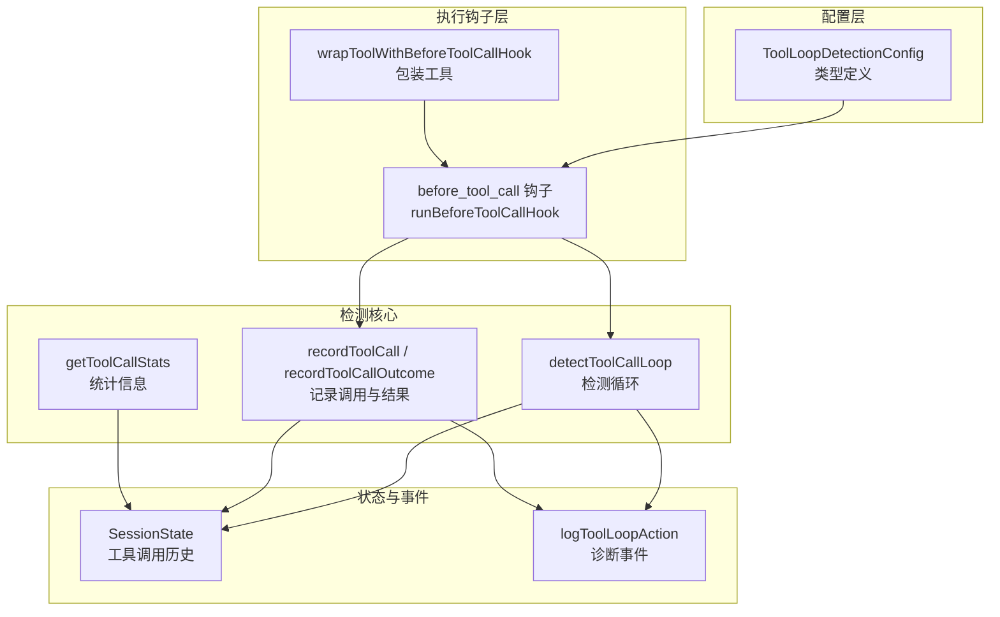
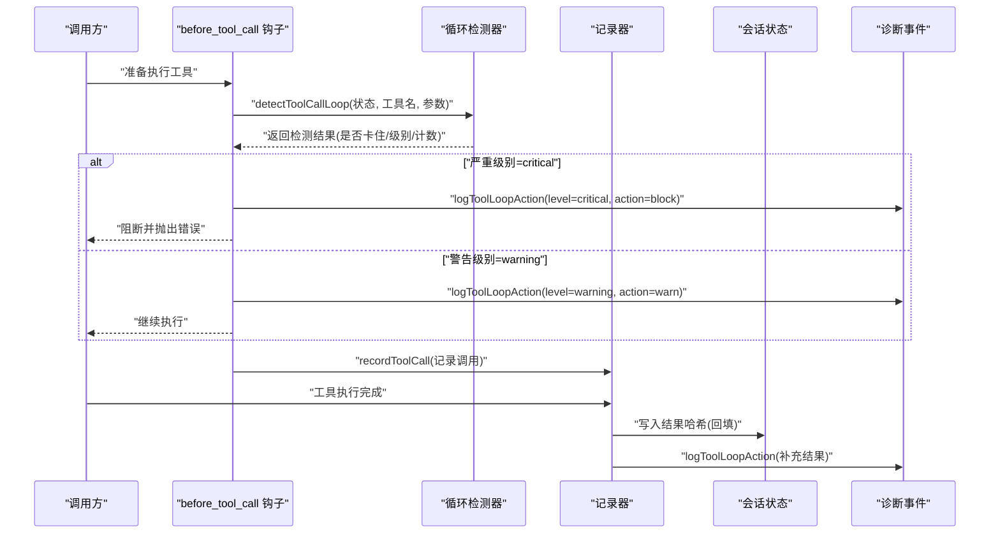
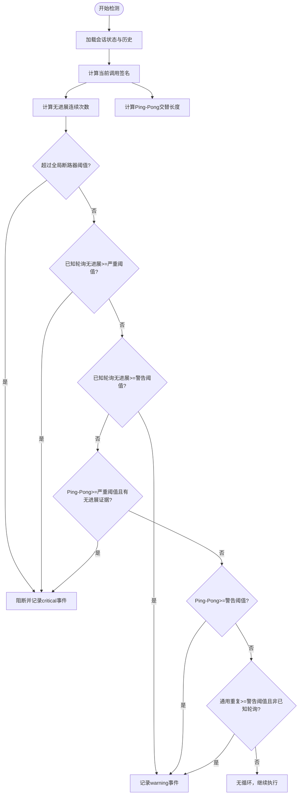
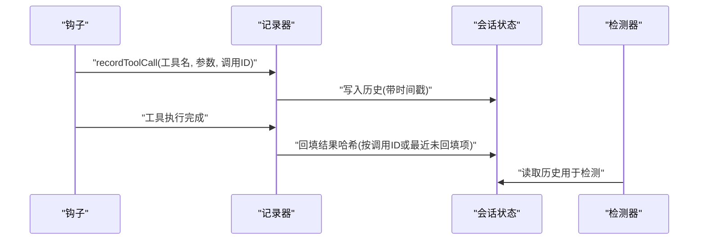
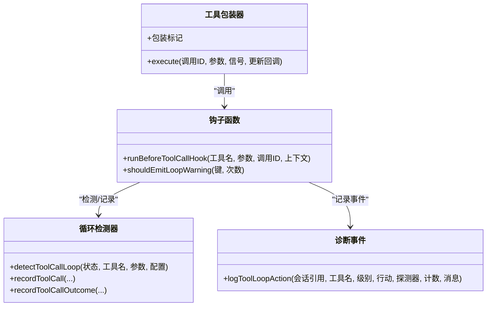
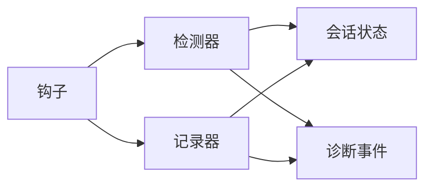

# 工具循环检测

<cite>
**本文档引用的文件**
- [src/agents/tool-loop-detection.ts](file://src/agents/tool-loop-detection.ts)
- [src/agents/pi-tools.before-tool-call.ts](file://src/agents/pi-tools.before-tool-call.ts)
- [src/config/types.tools.ts](file://src/config/types.tools.ts)
- [src/logging/diagnostic-session-state.ts](file://src/logging/diagnostic-session-state.ts)
- [src/logging/diagnostic.ts](file://src/logging/diagnostic.ts)
- [docs/tools/loop-detection.md](file://docs/tools/loop-detection.md)
- [src/agents/tool-loop-detection.test.ts](file://src/agents/tool-loop-detection.test.ts)
- [src/agents/pi-tools.before-tool-call.test.ts](file://src/agents/pi-tools.before-tool-call.test.ts)
</cite>

## 目录

1. [简介](#简介)
2. [项目结构](#项目结构)
3. [核心组件](#核心组件)
4. [架构总览](#架构总览)
5. [详细组件分析](#详细组件分析)
6. [依赖关系分析](#依赖关系分析)
7. [性能考量](#性能考量)
8. [故障排查指南](#故障排查指南)
9. [结论](#结论)
10. [附录](#附录)

## 简介

本文件面向OpenClaw工具循环检测系统，系统性阐述其算法原理、工作机制、配置项与运行流程。重点覆盖以下方面：

- 调用链跟踪与历史窗口管理
- 深度限制与全局断路器
- 终止条件判断（重复调用、无进展轮询、Ping-Pong交替）
- 阈值配置（警告阈值、严重阈值、全局断路器、历史窗口大小）
- 不同循环场景的检测方法（直接循环、间接循环、复杂依赖环）
- 对系统稳定性的影响与预防措施
- 检测结果处理（告警、阻断、事件上报、状态恢复）
- 开发者在工具开发中的设计原则与最佳实践

## 项目结构

OpenClaw将“工具循环检测”作为可插拔的保护机制，贯穿于工具执行生命周期的关键节点：

- 配置层：通过工具配置类型定义循环检测开关、阈值与探测器开关
- 执行钩子层：在工具调用前进行检测，在工具调用后记录结果
- 会话状态层：维护每个会话的工具调用历史与统计
- 诊断事件层：统一输出循环检测事件，便于监控与告警

图表来源

- [src/agents/pi-tools.before-tool-call.ts](file://src/agents/pi-tools.before-tool-call.ts#L74-L173)
- [src/agents/tool-loop-detection.ts](file://src/agents/tool-loop-detection.ts#L372-L495)
- [src/logging/diagnostic-session-state.ts](file://src/logging/diagnostic-session-state.ts#L3-L20)
- [src/logging/diagnostic.ts](file://src/logging/diagnostic.ts#L259-L293)
- [src/config/types.tools.ts](file://src/config/types.tools.ts#L142-L155)

章节来源

- [src/agents/tool-loop-detection.ts](file://src/agents/tool-loop-detection.ts#L1-L624)
- [src/agents/pi-tools.before-tool-call.ts](file://src/agents/pi-tools.before-tool-call.ts#L1-L252)
- [src/config/types.tools.ts](file://src/config/types.tools.ts#L1-L593)
- [src/logging/diagnostic-session-state.ts](file://src/logging/diagnostic-session-state.ts#L1-L113)
- [src/logging/diagnostic.ts](file://src/logging/diagnostic.ts#L1-L400)

## 核心组件

- 循环检测器（detectToolCallLoop）：综合多种探测器，返回是否“卡住”及严重级别
- 历史记录器（recordToolCall / recordToolCallOutcome）：维护滑动窗口的历史记录，并在完成后回填结果哈希
- 会话状态（SessionState）：承载每个会话的工具调用历史、警告桶等运行期状态
- 钩子（before_tool_call）：在工具执行前后插入检测与记录逻辑
- 诊断事件（logToolLoopAction）：标准化输出循环检测事件，支持告警与阻断

章节来源

- [src/agents/tool-loop-detection.ts](file://src/agents/tool-loop-detection.ts#L372-L495)
- [src/agents/pi-tools.before-tool-call.ts](file://src/agents/pi-tools.before-tool-call.ts#L74-L173)
- [src/logging/diagnostic-session-state.ts](file://src/logging/diagnostic-session-state.ts#L3-L20)
- [src/logging/diagnostic.ts](file://src/logging/diagnostic.ts#L259-L293)

## 架构总览

下图展示从工具调用到循环检测与事件上报的完整流程：

图表来源

- [src/agents/pi-tools.before-tool-call.ts](file://src/agents/pi-tools.before-tool-call.ts#L74-L173)
- [src/agents/tool-loop-detection.ts](file://src/agents/tool-loop-detection.ts#L372-L495)
- [src/logging/diagnostic.ts](file://src/logging/diagnostic.ts#L259-L293)

## 详细组件分析

### 组件A：循环检测器（detectToolCallLoop）

- 功能概述
  - 基于滑动窗口的历史记录，计算当前调用与历史模式的匹配程度
  - 支持三类探测器：通用重复、已知轮询无进展、Ping-Pong交替
  - 全局断路器在极端情况下直接阻断
- 关键算法
  - 通用重复：统计相同工具+参数在历史中的出现次数
  - 已知轮询无进展：针对特定轮询工具，仅当结果文本/状态未变化时计为无进展
  - Ping-Pong交替：检测两个或多个工具在参数签名间交替调用且结果稳定
  - 全局断路器：无论工具类型，只要无进展重复达到阈值即阻断
- 终止条件
  - 警告阈值触发“警告”，不阻断
  - 严重阈值触发“阻断”，并发出诊断事件
  - 全局断路器阈值直接阻断，优先级最高

图表来源

- [src/agents/tool-loop-detection.ts](file://src/agents/tool-loop-detection.ts#L372-L495)

章节来源

- [src/agents/tool-loop-detection.ts](file://src/agents/tool-loop-detection.ts#L232-L362)
- [src/agents/tool-loop-detection.ts](file://src/agents/tool-loop-detection.ts#L372-L495)

### 组件B：历史记录与结果回填（recordToolCall / recordToolCallOutcome）

- 记录调用
  - 将工具名、参数哈希、调用ID、时间戳写入滑动窗口
  - 当窗口溢出时移除最旧条目
- 结果回填
  - 在工具执行完成后，根据调用ID或最近一次未回填的调用，写入结果哈希
  - 结果哈希基于结果内容与错误信息的稳定序列化摘要
- 作用
  - 为“无进展”和“Ping-Pong”检测提供依据
  - 保证检测器能区分“重复但有进展”与“重复且无进展”

图表来源

- [src/agents/tool-loop-detection.ts](file://src/agents/tool-loop-detection.ts#L501-L588)
- [src/agents/pi-tools.before-tool-call.ts](file://src/agents/pi-tools.before-tool-call.ts#L43-L72)

章节来源

- [src/agents/tool-loop-detection.ts](file://src/agents/tool-loop-detection.ts#L501-L588)
- [src/agents/pi-tools.before-tool-call.ts](file://src/agents/pi-tools.before-tool-call.ts#L43-L72)

### 组件C：钩子集成（wrapToolWithBeforeToolCallHook / runBeforeToolCallHook）

- 包装工具
  - 为每个工具注入执行前后钩子，确保每次调用都经过检测与记录
- 检测与阻断
  - 在执行前调用检测器，若为“严重级别”则阻断并记录事件
  - 若为“警告级别”则记录事件但允许继续
- 结果回填
  - 工具执行成功或失败后，异步记录结果哈希

图表来源

- [src/agents/pi-tools.before-tool-call.ts](file://src/agents/pi-tools.before-tool-call.ts#L175-L233)
- [src/agents/tool-loop-detection.ts](file://src/agents/tool-loop-detection.ts#L372-L495)
- [src/logging/diagnostic.ts](file://src/logging/diagnostic.ts#L259-L293)

章节来源

- [src/agents/pi-tools.before-tool-call.ts](file://src/agents/pi-tools.before-tool-call.ts#L74-L173)
- [src/agents/pi-tools.before-tool-call.test.ts](file://src/agents/pi-tools.before-tool-call.test.ts#L1-L322)

### 组件D：配置与阈值

- 配置项
  - enabled：总开关
  - historySize：历史窗口大小
  - warningThreshold / criticalThreshold：警告与严重阈值
  - globalCircuitBreakerThreshold：全局断路器阈值
  - detectors：探测器开关（通用重复、已知轮询无进展、Ping-Pong）
- 默认行为
  - 默认关闭；默认阈值与探测器均开启
  - 严重阈值必须大于警告阈值，全局断路器阈值必须大于严重阈值

章节来源

- [src/config/types.tools.ts](file://src/config/types.tools.ts#L142-L155)
- [src/agents/tool-loop-detection.ts](file://src/agents/tool-loop-detection.ts#L64-L100)
- [docs/tools/loop-detection.md](file://docs/tools/loop-detection.md#L24-L100)

### 组件E：不同循环场景的检测方法

- 直接循环（同一工具+参数重复）
  - 使用通用重复探测器，比较历史中相同签名的出现次数
- 间接循环（多工具协作形成依赖环）
  - 使用Ping-Pong探测器，检测两个或多个工具在参数签名间交替调用且结果稳定
- 复杂依赖环
  - 通过滑动窗口与签名匹配，可识别多工具的交替与稳定结果模式
- 已知轮询工具（如process/poll）
  - 专门针对轮询工具，仅在文本/状态未变化时计为无进展

章节来源

- [src/agents/tool-loop-detection.ts](file://src/agents/tool-loop-detection.ts#L232-L362)
- [src/agents/tool-loop-detection.ts](file://src/agents/tool-loop-detection.ts#L147-L156)

### 组件F：检测结果处理与事件上报

- 告警通知
  - 警告级别：记录warning事件，配合“桶”机制去抖
- 自动阻断
  - 严重级别：记录critical事件并阻断工具调用
- 状态恢复
  - 会话状态包含历史窗口与警告桶，随会话清理而回收
- 诊断事件
  - 统一事件格式，包含工具名、级别、行动、探测器、计数、配对工具等

章节来源

- [src/agents/pi-tools.before-tool-call.ts](file://src/agents/pi-tools.before-tool-call.ts#L24-L41)
- [src/logging/diagnostic.ts](file://src/logging/diagnostic.ts#L259-L293)
- [src/logging/diagnostic-session-state.ts](file://src/logging/diagnostic-session-state.ts#L27-L64)

## 依赖关系分析

- 组件耦合
  - 钩子依赖检测器与记录器
  - 检测器依赖会话状态与配置
  - 记录器依赖会话状态与稳定哈希
  - 诊断事件依赖钩子与检测器的结果
- 外部依赖
  - 日志子系统用于输出事件
  - 诊断事件系统用于统一上报

图表来源

- [src/agents/pi-tools.before-tool-call.ts](file://src/agents/pi-tools.before-tool-call.ts#L74-L173)
- [src/agents/tool-loop-detection.ts](file://src/agents/tool-loop-detection.ts#L372-L495)
- [src/logging/diagnostic.ts](file://src/logging/diagnostic.ts#L259-L293)

章节来源

- [src/agents/tool-loop-detection.ts](file://src/agents/tool-loop-detection.ts#L1-L624)
- [src/agents/pi-tools.before-tool-call.ts](file://src/agents/pi-tools.before-tool-call.ts#L1-L252)

## 性能考量

- 时间复杂度
  - 检测：通常为O(n)，其中n为历史窗口大小；最坏情况下遍历整个窗口
  - 记录：O(1)均摊，滑动窗口固定大小
- 空间复杂度
  - 会话状态占用O(historySize)空间
- 哈希稳定性
  - 使用稳定序列化与摘要，保证参数顺序无关与大对象安全
- 去抖与限流
  - 警告桶按阈值分桶，避免频繁重复告警

章节来源

- [src/agents/tool-loop-detection.ts](file://src/agents/tool-loop-detection.ts#L106-L145)
- [src/agents/pi-tools.before-tool-call.ts](file://src/agents/pi-tools.before-tool-call.ts#L24-L41)

## 故障排查指南

- 症状：工具被阻断
  - 检查最近一次循环事件，确认探测器类型与计数
  - 调整阈值或禁用对应探测器
- 症状：误报过多
  - 提高warningThreshold与criticalThreshold
  - 减小historySize
  - 临时禁用特定探测器
- 症状：漏报
  - 启用更多探测器
  - 降低阈值
  - 检查工具是否属于已知轮询类型
- 症状：Ping-Pong被误判
  - 确认工具输出确实在进展
  - 适当提高阈值或禁用Ping-Pong探测器

章节来源

- [src/agents/tool-loop-detection.test.ts](file://src/agents/tool-loop-detection.test.ts#L1-L575)
- [src/agents/pi-tools.before-tool-call.test.ts](file://src/agents/pi-tools.before-tool-call.test.ts#L1-L322)
- [docs/tools/loop-detection.md](file://docs/tools/loop-detection.md#L79-L100)

## 结论

OpenClaw的工具循环检测通过“钩子+检测器+记录器+诊断事件”的组合，实现了对直接循环、轮询无进展与Ping-Pong交替的有效防护。其默认关闭的设计兼顾了灵活性与安全性，开发者可根据工具特性与业务需求调整阈值与探测器开关，从而在避免误报的同时提升系统稳定性。

## 附录

### 阈值与配置速查

- 默认阈值
  - 警告阈值：10
  - 严重阈值：20
  - 全局断路器阈值：30
  - 历史窗口大小：30
- 配置字段
  - enabled、historySize、warningThreshold、criticalThreshold、globalCircuitBreakerThreshold、detectors

章节来源

- [src/agents/tool-loop-detection.ts](file://src/agents/tool-loop-detection.ts#L27-L42)
- [src/config/types.tools.ts](file://src/config/types.tools.ts#L142-L155)
- [docs/tools/loop-detection.md](file://docs/tools/loop-detection.md#L24-L100)

### 开发者最佳实践

- 避免快速轮询
  - 使用轮询工具时确保等待足够时间或提供超时参数
- 明确输出语义
  - 轮询工具应返回可区分的“运行中/完成/错误”状态
- 合理设置阈值
  - 从默认阈值起步，逐步调整以平衡误报与漏报
- 分场景启用探测器
  - 对交互式工具谨慎启用通用重复探测器
- 监控与告警
  - 关注诊断事件中的循环检测报告，及时优化工具行为

章节来源

- [docs/tools/loop-detection.md](file://docs/tools/loop-detection.md#L79-L100)
- [src/agents/tool-loop-detection.ts](file://src/agents/tool-loop-detection.ts#L372-L495)
