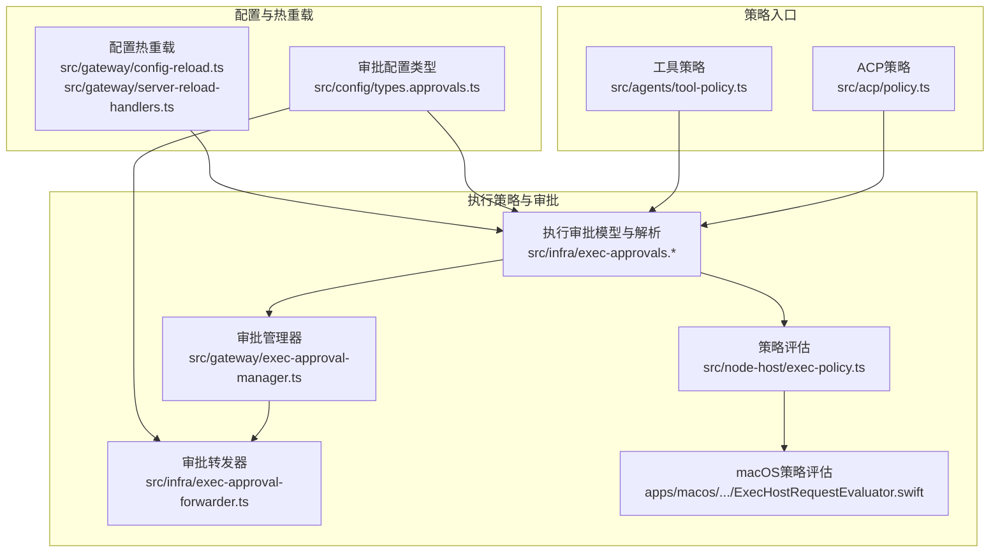
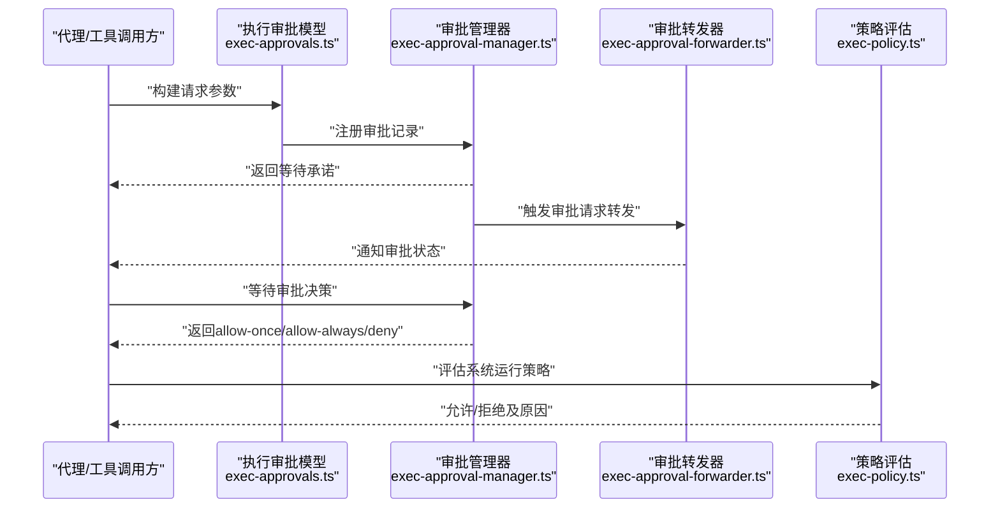
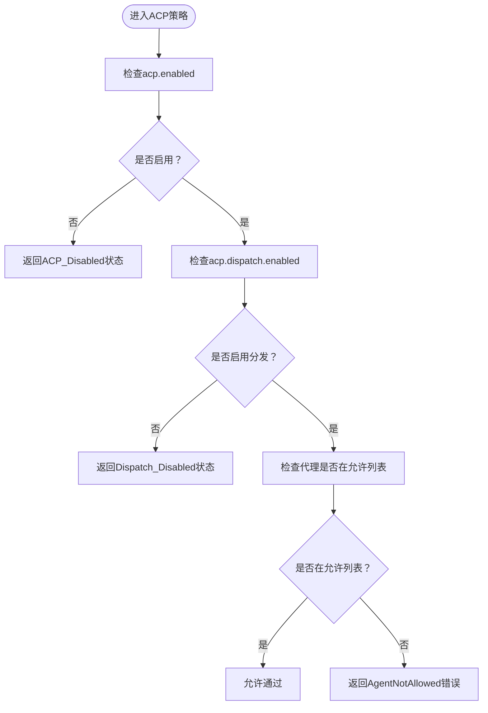
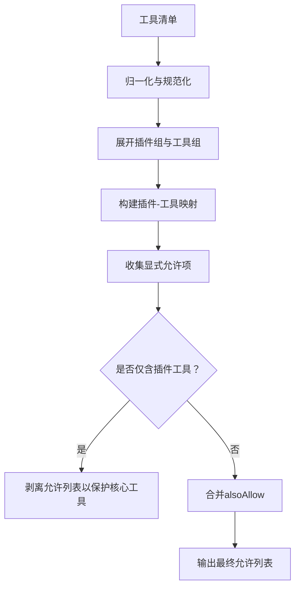
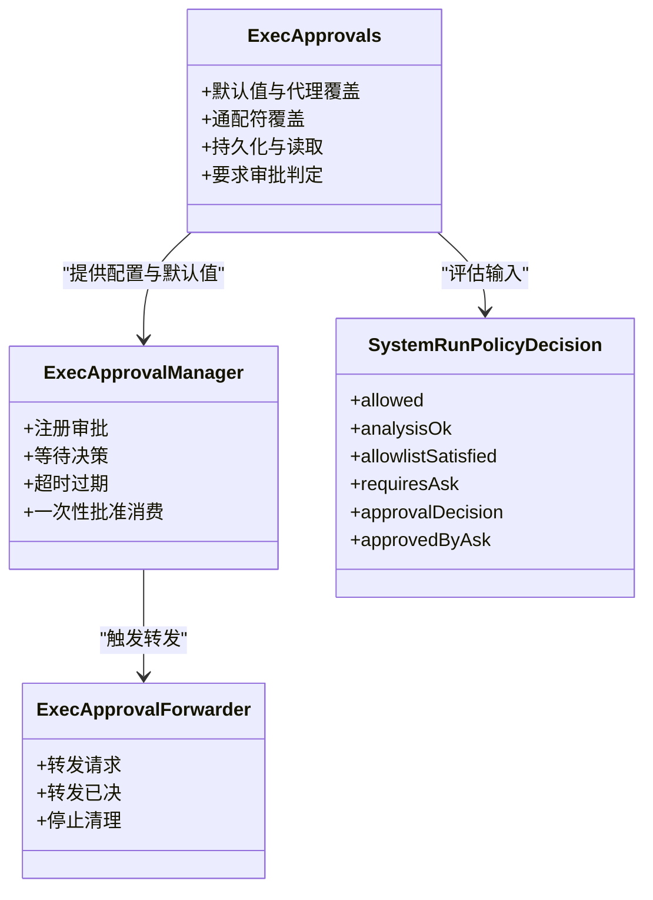
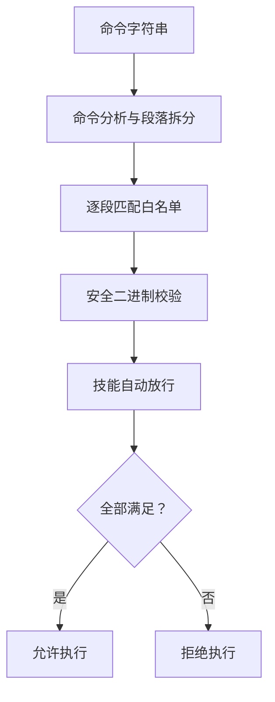
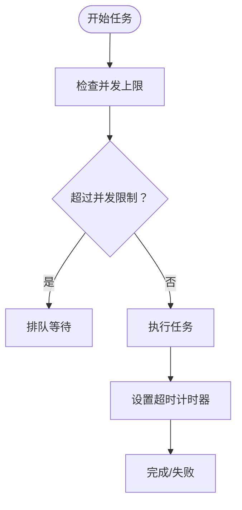
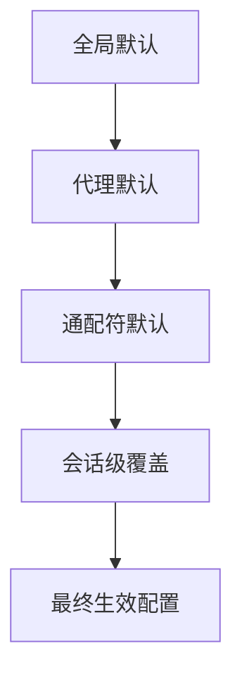
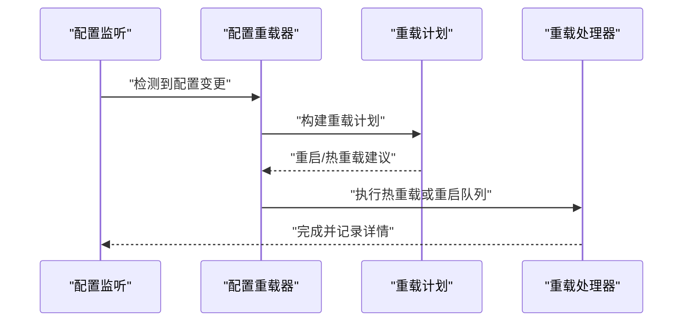
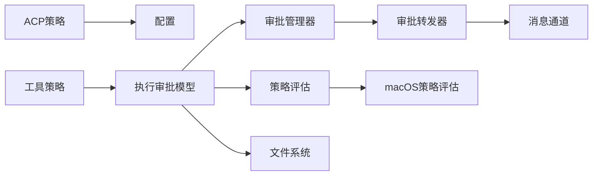

# 工具策略管理

<cite>
**本文档引用的文件**
- [src/acp/policy.ts](file://src/acp/policy.ts)
- [src/agents/tool-policy.ts](file://src/agents/tool-policy.ts)
- [src/infra/exec-approvals.ts](file://src/infra/exec-approvals.ts)
- [src/infra/exec-approvals-allowlist.ts](file://src/infra/exec-approvals-allowlist.ts)
- [src/infra/exec-approvals-analysis.ts](file://src/infra/exec-approvals-analysis.ts)
- [src/infra/exec-approval-forwarder.ts](file://src/infra/exec-approval-forwarder.ts)
- [src/gateway/exec-approval-manager.ts](file://src/gateway/exec-approval-manager.ts)
- [src/gateway/server-methods/exec-approval.ts](file://src/gateway/server-methods/exec-approval.ts)
- [src/node-host/exec-policy.ts](file://src/node-host/exec-policy.ts)
- [src/infra/exec-safe-bin-runtime-policy.ts](file://src/infra/exec-safe-bin-runtime-policy.ts)
- [src/infra/exec-safe-bin-policy.ts](file://src/infra/exec-safe-bin-policy.ts)
- [src/config/types.approvals.ts](file://src/config/types.approvals.ts)
- [src/gateway/config-reload.ts](file://src/gateway/config-reload.ts)
- [src/gateway/server-reload-handlers.ts](file://src/gateway/server-reload-handlers.ts)
- [apps/macos/Sources/OpenClaw/ExecHostRequestEvaluator.swift](file://apps/macos/Sources/OpenClaw/ExecHostRequestEvaluator.swift)
</cite>

## 目录

1. [简介](#简介)
2. [项目结构](#项目结构)
3. [核心组件](#核心组件)
4. [架构总览](#架构总览)
5. [详细组件分析](#详细组件分析)
6. [依赖关系分析](#依赖关系分析)
7. [性能考量](#性能考量)
8. [故障排查指南](#故障排查指南)
9. [结论](#结论)
10. [附录](#附录)

## 简介

本文件面向OpenClaw工具策略管理系统，系统性阐述工具访问控制策略（ACP）与执行策略（系统运行/命令执行）的架构与实现，包括：

- 基于角色的访问控制（RBAC）与动态权限验证
- 策略管道工作机制：策略评估顺序、条件判断与决策逻辑
- 文件系统策略：路径白名单、目录限制与文件类型控制
- 执行策略：并发控制、超时管理与资源配额限制
- 策略配置层次结构：全局策略、代理特定策略与会话级策略覆盖
- 策略动态更新与热重载机制
- 策略开发者配置指南与调试工具使用方法

## 项目结构

OpenClaw在多个子系统中实现策略管理：

- ACP策略：集中于src/acp，负责会话初始化与分发的策略判定
- 工具策略：src/agents/tool-policy.ts提供工具清单与组展开、允许列表解析与合并
- 执行审批与策略：src/infra/exec-approvals.\*系列文件定义执行策略数据模型、解析与评估
- 执行策略决策：src/node-host/exec-policy.ts与macOS端ExecHostRequestEvaluator.swift共同完成策略决策
- 执行审批转发：src/infra/exec-approval-forwarder.ts负责跨通道通知
- 审批管理器：src/gateway/exec-approval-manager.ts管理审批生命周期
- 配置与热重载：src/gateway/config-reload.ts与server-reload-handlers.ts支持配置变更的热重载或重启
- 安全二进制策略：src/infra/exec-safe-bin-\*系列文件提供安全二进制白名单与可信目录校验

**图表来源**

- [src/acp/policy.ts](file://src/acp/policy.ts#L1-L70)
- [src/agents/tool-policy.ts](file://src/agents/tool-policy.ts#L1-L206)
- [src/infra/exec-approvals.ts](file://src/infra/exec-approvals.ts#L1-L559)
- [src/gateway/exec-approval-manager.ts](file://src/gateway/exec-approval-manager.ts#L1-L174)
- [src/infra/exec-approval-forwarder.ts](file://src/infra/exec-approval-forwarder.ts#L1-L448)
- [src/node-host/exec-policy.ts](file://src/node-host/exec-policy.ts#L1-L135)
- [apps/macos/Sources/OpenClaw/ExecHostRequestEvaluator.swift](file://apps/macos/Sources/OpenClaw/ExecHostRequestEvaluator.swift#L40-L84)
- [src/config/types.approvals.ts](file://src/config/types.approvals.ts#L1-L30)
- [src/gateway/config-reload.ts](file://src/gateway/config-reload.ts#L324-L365)
- [src/gateway/server-reload-handlers.ts](file://src/gateway/server-reload-handlers.ts#L178-L190)

**章节来源**

- [src/acp/policy.ts](file://src/acp/policy.ts#L1-L70)
- [src/agents/tool-policy.ts](file://src/agents/tool-policy.ts#L1-L206)
- [src/infra/exec-approvals.ts](file://src/infra/exec-approvals.ts#L1-L559)
- [src/gateway/exec-approval-manager.ts](file://src/gateway/exec-approval-manager.ts#L1-L174)
- [src/infra/exec-approval-forwarder.ts](file://src/infra/exec-approval-forwarder.ts#L1-L448)
- [src/node-host/exec-policy.ts](file://src/node-host/exec-policy.ts#L1-L135)
- [apps/macos/Sources/OpenClaw/ExecHostRequestEvaluator.swift](file://apps/macos/Sources/OpenClaw/ExecHostRequestEvaluator.swift#L40-L84)
- [src/config/types.approvals.ts](file://src/config/types.approvals.ts#L1-L30)
- [src/gateway/config-reload.ts](file://src/gateway/config-reload.ts#L324-L365)
- [src/gateway/server-reload-handlers.ts](file://src/gateway/server-reload-handlers.ts#L178-L190)

## 核心组件

- ACP策略模块：提供会话初始化与分发策略的启用状态、允许代理列表与错误信息生成
- 工具策略模块：提供工具清单归一化、组展开、允许列表解析与合并、插件组处理
- 执行审批模块：定义执行策略的配置、默认值、代理覆盖、通配符覆盖、持久化与读取
- 执行策略评估：根据安全级别、询问策略、分析结果、白名单满足度与审批决策进行综合判定
- 审批转发器：将审批请求与结果转发到聊天通道，并支持会话目标解析与过滤
- 审批管理器：维护待审批记录、超时过期、一次性批准消费与查询
- 安全二进制策略：合并全局与本地安全二进制配置、可信目录校验与告警
- 配置热重载：检测配置变更并按策略决定重启或热重载

**章节来源**

- [src/acp/policy.ts](file://src/acp/policy.ts#L1-L70)
- [src/agents/tool-policy.ts](file://src/agents/tool-policy.ts#L1-L206)
- [src/infra/exec-approvals.ts](file://src/infra/exec-approvals.ts#L1-L559)
- [src/node-host/exec-policy.ts](file://src/node-host/exec-policy.ts#L1-L135)
- [src/infra/exec-approval-forwarder.ts](file://src/infra/exec-approval-forwarder.ts#L1-L448)
- [src/gateway/exec-approval-manager.ts](file://src/gateway/exec-approval-manager.ts#L1-L174)
- [src/infra/exec-safe-bin-runtime-policy.ts](file://src/infra/exec-safe-bin-runtime-policy.ts#L1-L158)
- [src/gateway/config-reload.ts](file://src/gateway/config-reload.ts#L324-L365)

## 架构总览

策略系统围绕“配置—解析—评估—执行”的闭环工作流构建：

- 配置层：全局、代理、会话多级配置，支持默认值与通配符覆盖
- 解析层：命令分析、段落拆分、链式操作符识别、安全二进制与可信目录解析
- 评估层：安全级别、询问策略、白名单满足度、审批决策与平台差异处理
- 执行层：节点侧策略决策与macOS侧策略评估协同

**图表来源**

- [src/infra/exec-approvals.ts](file://src/infra/exec-approvals.ts#L1-L559)
- [src/gateway/exec-approval-manager.ts](file://src/gateway/exec-approval-manager.ts#L1-L174)
- [src/infra/exec-approval-forwarder.ts](file://src/infra/exec-approval-forwarder.ts#L1-L448)
- [src/node-host/exec-policy.ts](file://src/node-host/exec-policy.ts#L1-L135)

## 详细组件分析

### ACP策略（基于角色的访问控制）

- 启用状态：默认启用，可通过配置关闭
- 分发策略：默认关闭，需显式开启
- 代理白名单：未配置时默认允许所有代理；配置后仅允许白名单内代理
- 错误与消息：提供统一的错误码与提示文本，便于上层展示与日志追踪

**图表来源**

- [src/acp/policy.ts](file://src/acp/policy.ts#L1-L70)

**章节来源**

- [src/acp/policy.ts](file://src/acp/policy.ts#L1-L70)

### 工具策略（工具清单与组展开）

- 工具归一化与组展开：支持插件组与工具组的展开，避免重复与遗漏
- 允许列表解析：收集显式允许项，剥离仅包含插件工具的允许列表以避免禁用核心工具
- 合并策略：支持alsoAllow合并，确保允许列表的去重与完整性
- 插件组聚合：按插件维度聚合工具，便于策略层面的批量控制

**图表来源**

- [src/agents/tool-policy.ts](file://src/agents/tool-policy.ts#L1-L206)

**章节来源**

- [src/agents/tool-policy.ts](file://src/agents/tool-policy.ts#L1-L206)

### 执行审批与策略评估

- 数据模型：定义执行主机、安全级别、询问策略、默认值、代理覆盖、通配符覆盖与持久化文件结构
- 默认值与覆盖：支持全局默认、代理默认、通配符默认与会话覆盖的层级合并
- 审批生命周期：注册、等待、超时过期、一次性批准消费与查询
- 转发策略：支持按会话、目标或两者模式转发，支持过滤与跳过特定渠道
- 策略评估：综合安全级别、询问策略、分析结果、白名单满足度与审批决策，区分shell wrapper与Windows平台差异

**图表来源**

- [src/infra/exec-approvals.ts](file://src/infra/exec-approvals.ts#L1-L559)
- [src/gateway/exec-approval-manager.ts](file://src/gateway/exec-approval-manager.ts#L1-L174)
- [src/infra/exec-approval-forwarder.ts](file://src/infra/exec-approval-forwarder.ts#L1-L448)
- [src/node-host/exec-policy.ts](file://src/node-host/exec-policy.ts#L1-L135)

**章节来源**

- [src/infra/exec-approvals.ts](file://src/infra/exec-approvals.ts#L1-L559)
- [src/gateway/exec-approval-manager.ts](file://src/gateway/exec-approval-manager.ts#L1-L174)
- [src/infra/exec-approval-forwarder.ts](file://src/infra/exec-approval-forwarder.ts#L1-L448)
- [src/node-host/exec-policy.ts](file://src/node-host/exec-policy.ts#L1-L135)

### 文件系统策略（路径白名单、目录限制与文件类型控制）

- 白名单匹配：对命令段逐一匹配，支持安全二进制、技能自动放行与链式命令
- 安全二进制：基于可执行名、可信目录与参数配置进行严格校验
- 技能自动放行：基于技能二进制信任索引，允许特定技能的二进制直接通过
- 目录与权限：对可信安全二进制目录进行写权限检查并发出警告
- 文件类型控制：通过允许列表与安全二进制策略控制可执行文件类型与来源

**图表来源**

- [src/infra/exec-approvals-allowlist.ts](file://src/infra/exec-approvals-allowlist.ts#L1-L552)
- [src/infra/exec-approvals-analysis.ts](file://src/infra/exec-approvals-analysis.ts#L1-L800)
- [src/infra/exec-safe-bin-runtime-policy.ts](file://src/infra/exec-safe-bin-runtime-policy.ts#L1-L158)

**章节来源**

- [src/infra/exec-approvals-allowlist.ts](file://src/infra/exec-approvals-allowlist.ts#L1-L552)
- [src/infra/exec-approvals-analysis.ts](file://src/infra/exec-approvals-analysis.ts#L1-L800)
- [src/infra/exec-safe-bin-runtime-policy.ts](file://src/infra/exec-safe-bin-runtime-policy.ts#L1-L158)

### 执行策略（并发控制、超时管理与资源配额限制）

- 并发控制：通过最大并发运行数限制任务并行度
- 超时管理：为每个任务设置超时，超时后中断并返回错误
- 资源配额：结合安全二进制与可信目录策略，限制潜在高风险执行

**图表来源**

- [src/cron/service/timer.ts](file://src/cron/service/timer.ts#L45-L82)

**章节来源**

- [src/cron/service/timer.ts](file://src/cron/service/timer.ts#L45-L82)

### 策略配置层次结构（全局、代理特定、会话级覆盖）

- 全局默认：定义默认安全级别、询问策略与自动放行技能开关
- 代理默认：针对特定代理覆盖全局默认
- 通配符默认：针对所有代理的通配符覆盖
- 会话级覆盖：在请求中传入覆盖参数，优先级最高

**图表来源**

- [src/infra/exec-approvals.ts](file://src/infra/exec-approvals.ts#L381-L451)

**章节来源**

- [src/infra/exec-approvals.ts](file://src/infra/exec-approvals.ts#L381-L451)

### 策略动态更新与热重载

- 配置变更检测：比较当前配置与新快照，提取变更路径
- 重载策略：根据配置决定重启或热重载；若需要重启则延迟至活动操作完成后执行
- 热重载回调：在热重载模式下应用变更并记录原因

**图表来源**

- [src/gateway/config-reload.ts](file://src/gateway/config-reload.ts#L324-L365)
- [src/gateway/server-reload-handlers.ts](file://src/gateway/server-reload-handlers.ts#L178-L190)

**章节来源**

- [src/gateway/config-reload.ts](file://src/gateway/config-reload.ts#L324-L365)
- [src/gateway/server-reload-handlers.ts](file://src/gateway/server-reload-handlers.ts#L178-L190)

### 策略开发者配置指南与调试工具

- 审批转发配置：通过配置类型定义转发模式、过滤器与目标
- 审批请求与响应：使用网关方法创建审批处理器，支持客户端探测与转发
- macOS策略评估：在macOS端根据安全级别、询问策略与白名单匹配进行决策
- 调试建议：利用错误码与消息、审批ID与超时、转发目标与过滤器进行定位

**章节来源**

- [src/config/types.approvals.ts](file://src/config/types.approvals.ts#L1-L30)
- [src/gateway/server-methods/exec-approval.ts](file://src/gateway/server-methods/exec-approval.ts#L1-L28)
- [apps/macos/Sources/OpenClaw/ExecHostRequestEvaluator.swift](file://apps/macos/Sources/OpenClaw/ExecHostRequestEvaluator.swift#L40-L84)

## 依赖关系分析

- 模块耦合
  - ACP策略与配置紧密耦合，用于会话初始化与分发控制
  - 工具策略与执行审批模型解耦，通过公共接口传递允许列表与覆盖
  - 审批管理器与转发器松耦合，通过事件与回调交互
  - 策略评估依赖命令分析与安全二进制策略，形成清晰的数据流
- 外部依赖
  - JSONL套接字用于审批请求与决策传输
  - 消息通道用于跨渠道审批通知
  - 文件系统用于执行审批配置的持久化

**图表来源**

- [src/acp/policy.ts](file://src/acp/policy.ts#L1-L70)
- [src/agents/tool-policy.ts](file://src/agents/tool-policy.ts#L1-L206)
- [src/infra/exec-approvals.ts](file://src/infra/exec-approvals.ts#L1-L559)
- [src/gateway/exec-approval-manager.ts](file://src/gateway/exec-approval-manager.ts#L1-L174)
- [src/infra/exec-approval-forwarder.ts](file://src/infra/exec-approval-forwarder.ts#L1-L448)
- [src/node-host/exec-policy.ts](file://src/node-host/exec-policy.ts#L1-L135)
- [apps/macos/Sources/OpenClaw/ExecHostRequestEvaluator.swift](file://apps/macos/Sources/OpenClaw/ExecHostRequestEvaluator.swift#L40-L84)

**章节来源**

- [src/acp/policy.ts](file://src/acp/policy.ts#L1-L70)
- [src/agents/tool-policy.ts](file://src/agents/tool-policy.ts#L1-L206)
- [src/infra/exec-approvals.ts](file://src/infra/exec-approvals.ts#L1-L559)
- [src/gateway/exec-approval-manager.ts](file://src/gateway/exec-approval-manager.ts#L1-L174)
- [src/infra/exec-approval-forwarder.ts](file://src/infra/exec-approval-forwarder.ts#L1-L448)
- [src/node-host/exec-policy.ts](file://src/node-host/exec-policy.ts#L1-L135)
- [apps/macos/Sources/OpenClaw/ExecHostRequestEvaluator.swift](file://apps/macos/Sources/OpenClaw/ExecHostRequestEvaluator.swift#L40-L84)

## 性能考量

- 命令分析与白名单匹配：对链式命令与管道进行保守解析，避免复杂语法导致的性能问题
- 安全二进制校验：仅在非Windows平台启用，减少不必要的开销
- 并发与超时：通过并发上限与超时控制防止资源滥用
- 缓存与去重：允许列表与插件组展开采用集合与去重，降低重复计算

## 故障排查指南

- 审批超时与过期：检查审批管理器的超时设置与转发器的目标可达性
- 白名单不匹配：确认命令分析是否成功、段落拆分是否正确、安全二进制与可信目录配置
- ACP策略错误：核对acp.enabled与acp.dispatch.enabled配置，以及代理白名单
- 热重载失败：查看配置重载日志，确认变更路径与重载模式

**章节来源**

- [src/gateway/exec-approval-manager.ts](file://src/gateway/exec-approval-manager.ts#L1-L174)
- [src/infra/exec-approvals-allowlist.ts](file://src/infra/exec-approvals-allowlist.ts#L1-L552)
- [src/acp/policy.ts](file://src/acp/policy.ts#L1-L70)
- [src/gateway/config-reload.ts](file://src/gateway/config-reload.ts#L324-L365)

## 结论

OpenClaw工具策略管理系统通过多层策略与严格的执行评估，实现了从会话初始化、工具调用到系统运行的全链路安全控制。其配置层次结构与热重载机制保证了策略的灵活性与可运维性，适合在复杂环境中部署与演进。

## 附录

- 开发者建议
  - 使用alsoAllow进行增量放行，避免仅包含插件工具的允许列表
  - 在Windows平台谨慎使用安全二进制策略，优先通过可信目录与参数校验
  - 合理设置并发与超时，平衡安全性与性能
- 调试要点
  - 关注错误码与消息，结合审批ID与超时时间定位问题
  - 利用转发器的日志与目标过滤，快速缩小问题范围
