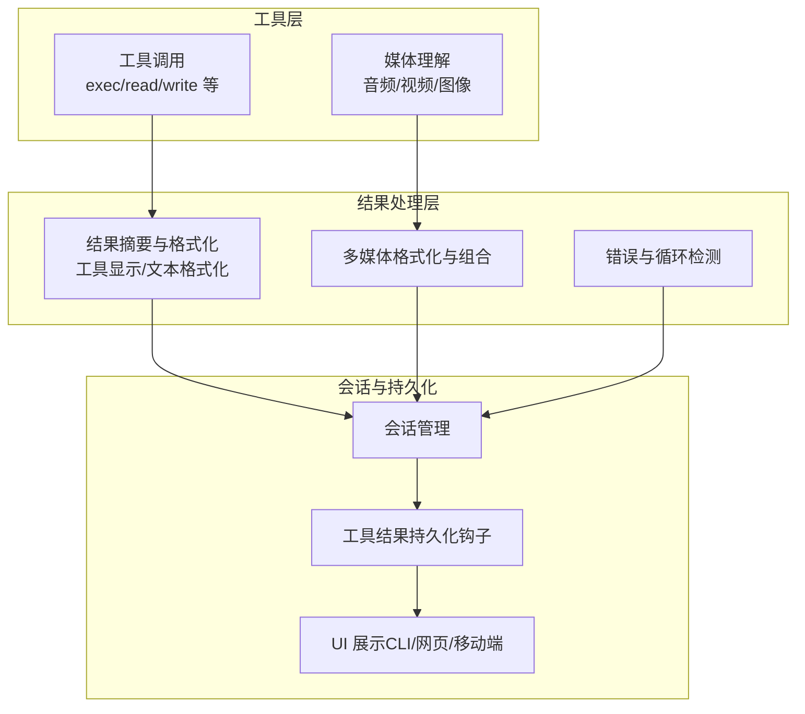
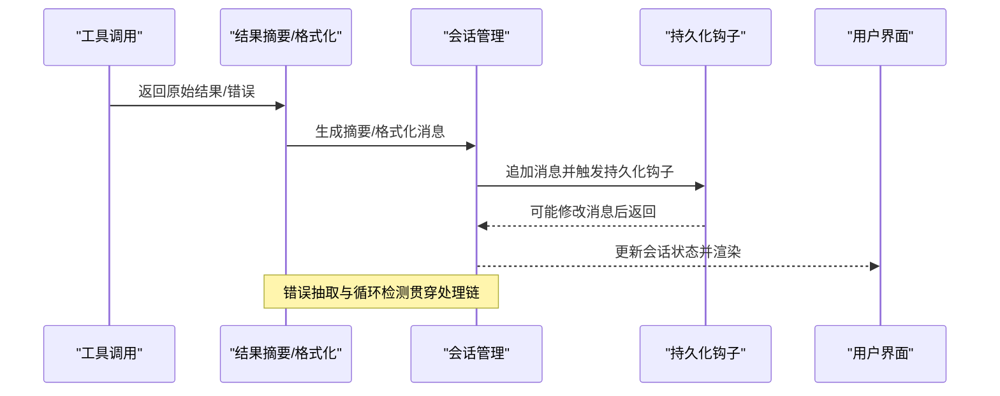
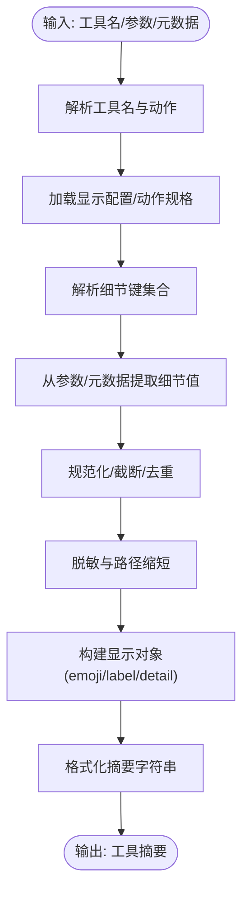
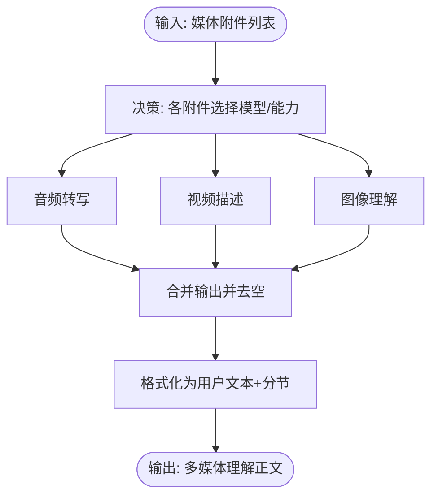
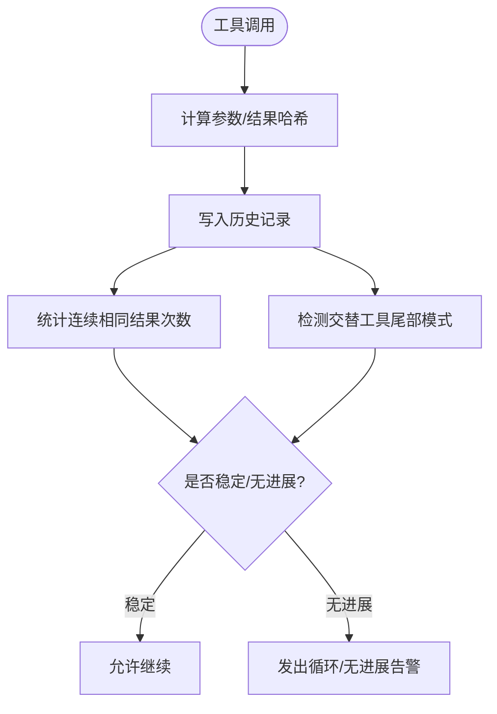
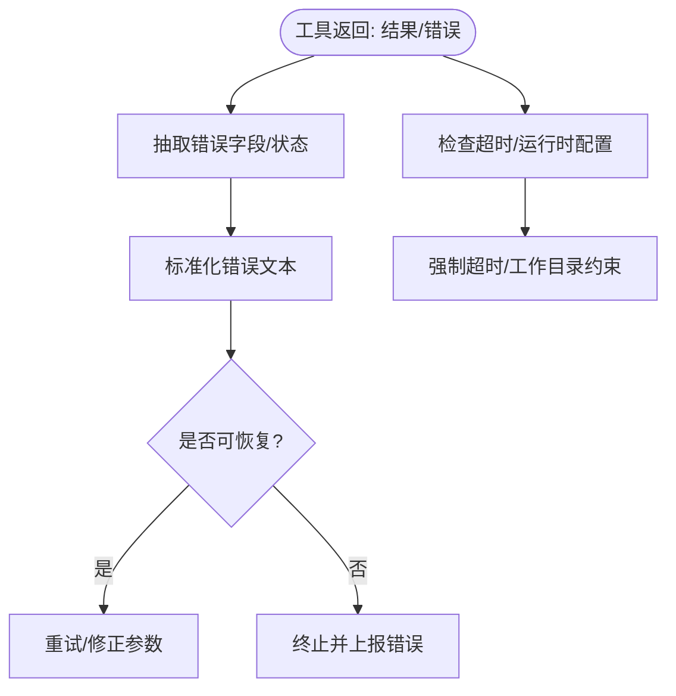
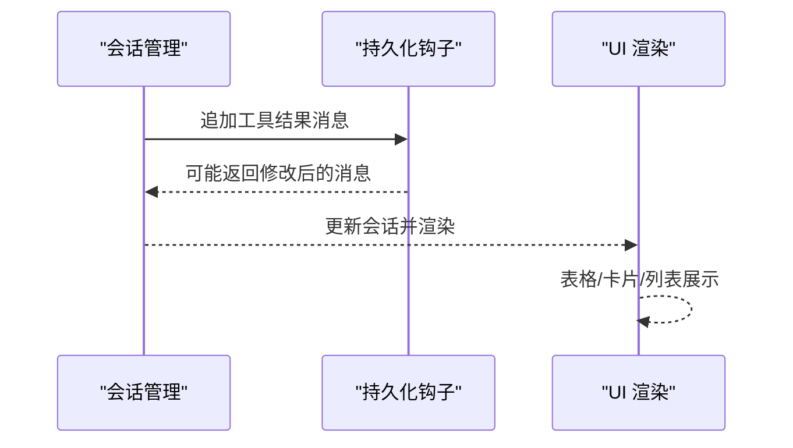
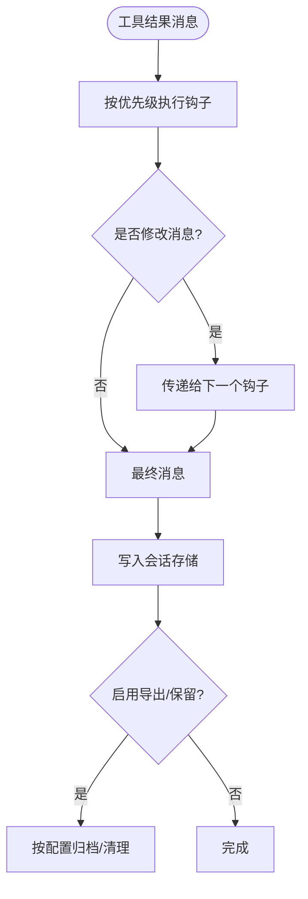
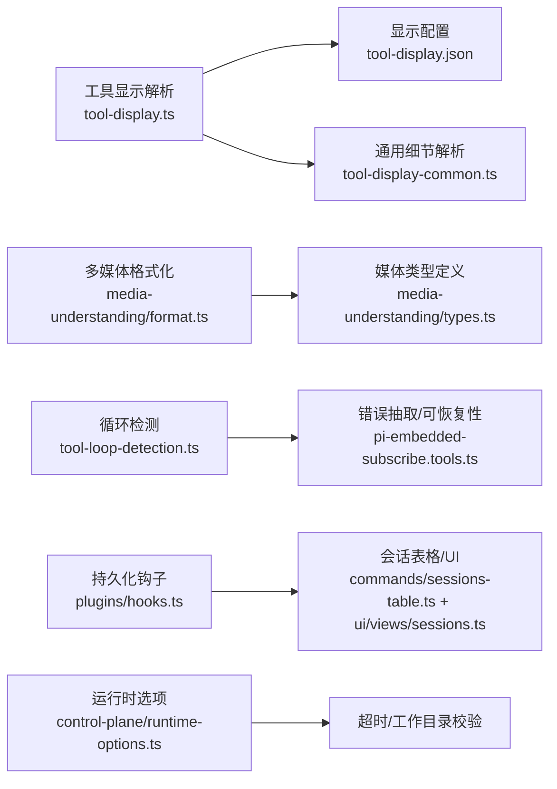

# 工具结果处理

<cite>
**本文引用的文件**
- [src/agents/tool-display.ts](file://src/agents/tool-display.ts)
- [src/agents/tool-display-common.ts](file://src/agents/tool-display-common.ts)
- [src/agents/tool-display.json](file://src/agents/tool-display.json)
- [apps/android/app/src/main/java/ai/openclaw/android/tools/ToolDisplay.kt](file://apps/android/app/src/main/java/ai/openclaw/android/tools/ToolDisplay.kt)
- [apps/shared/OpenClawKit/Sources/OpenClawChatUI/ToolResultTextFormatter.swift](file://apps/shared/OpenClawKit/Sources/OpenClawChatUI/ToolResultTextFormatter.swift)
- [apps/shared/OpenClawKit/Sources/OpenClawKit/ToolDisplay.swift](file://apps/shared/OpenClawKit/Sources/OpenClawKit/ToolDisplay.swift)
- [src/media-understanding/format.ts](file://src/media-understanding/format.ts)
- [src/media-understanding/types.ts](file://src/media-understanding/types.ts)
- [src/media-understanding/apply.test.ts](file://src/media-understanding/apply.test.ts)
- [src/agents/tool-loop-detection.ts](file://src/agents/tool-loop-detection.ts)
- [src/agents/pi-embedded-subscribe.tools.ts](file://src/agents/pi-embedded-subscribe.tools.ts)
- [src/agents/pi-embedded-runner/run/payloads.ts](file://src/agents/pi-embedded-runner/run/payloads.ts)
- [src/agents/session-tool-result-guard.tool-result-persist-hook.test.ts](file://src/agents/session-tool-result-guard.tool-result-persist-hook.test.ts)
- [src/plugins/hooks.ts](file://src/plugins/hooks.ts)
- [src/commands/sessions-table.ts](file://src/commands/sessions-table.ts)
- [ui/src/ui/views/sessions.ts](file://ui/src/ui/views/sessions.ts)
- [src/memory/backend-config.ts](file://src/memory/backend-config.ts)
- [src/agents/tool-catalog.ts](file://src/agents/tool-catalog.ts)
- [src/auto-reply/tool-meta.ts](file://src/auto-reply/tool-meta.ts)
- [src/acp/control-plane/runtime-options.ts](file://src/acp/control-plane/runtime-options.ts)
- [src/infra/provider-usage.fetch.minimax.ts](file://src/infra/provider-usage.fetch.minimax.ts)
- [src/infra/provider-usage.fetch.minimax.test.ts](file://src/infra/provider-usage.fetch.minimax.test.ts)
</cite>

## 目录

1. [简介](#简介)
2. [项目结构](#项目结构)
3. [核心组件](#核心组件)
4. [架构总览](#架构总览)
5. [详细组件分析](#详细组件分析)
6. [依赖关系分析](#依赖关系分析)
7. [性能考量](#性能考量)
8. [故障排查指南](#故障排查指南)
9. [结论](#结论)
10. [附录：结果格式规范与最佳实践](#附录结果格式规范与最佳实践)

## 简介

本文件面向OpenClaw工具结果处理系统，系统性阐述工具调用结果的收集、验证、处理与传播流程；覆盖成功响应、错误状态与超时处理；详解结果缓存与一致性保障；说明工具摘要生成（结果提取、格式化、摘要优化）；涵盖多媒体结果（图像、音频、视频）处理与传输；解释结果持久化与检索；并提供工具开发者的结果格式规范与最佳实践。

## 项目结构

OpenClaw在多平台与多模块中实现工具结果处理：

- 语言与平台适配：JavaScript/TypeScript（核心）、Swift（iOS/macOS）、Kotlin（Android）
- 结果摘要与显示：统一的工具显示配置与跨端渲染
- 多媒体理解：音频转写、视频描述、图像理解的输出格式与组合
- 会话与持久化：会话管理、消息持久钩子、UI展示
- 错误与循环检测：错误字段抽取、可恢复性判断、工具循环检测
- 运行时与超时：运行时选项校验、超时解析与控制

图示来源

- [src/agents/tool-display.ts](file://src/agents/tool-display.ts#L61-L130)
- [src/media-understanding/format.ts](file://src/media-understanding/format.ts#L32-L91)
- [src/agents/tool-loop-detection.ts](file://src/agents/tool-loop-detection.ts#L172-L292)
- [src/plugins/hooks.ts](file://src/plugins/hooks.ts#L466-L483)
- [ui/src/ui/views/sessions.ts](file://ui/src/ui/views/sessions.ts#L110-L285)

章节来源

- [src/agents/tool-display.ts](file://src/agents/tool-display.ts#L1-L154)
- [src/media-understanding/format.ts](file://src/media-understanding/format.ts#L1-L98)
- [src/agents/tool-loop-detection.ts](file://src/agents/tool-loop-detection.ts#L172-L366)
- [src/plugins/hooks.ts](file://src/plugins/hooks.ts#L456-L483)
- [ui/src/ui/views/sessions.ts](file://ui/src/ui/views/sessions.ts#L97-L285)

## 核心组件

- 工具显示与摘要
  - 统一的工具显示配置与摘要生成，支持跨端渲染与细节压缩
  - 参考：工具显示解析、摘要格式化、细节键映射
- 多媒体理解与格式化
  - 音频转写、视频描述、图像理解的输出结构与组合格式
  - 参考：媒体类型定义、格式化函数、测试用例
- 结果持久化与传播
  - 工具结果持久化钩子、会话消息追加、UI展示
  - 参考：钩子执行、会话表格格式化、UI渲染
- 错误与循环检测
  - 错误字段抽取与可恢复性判断、工具调用历史哈希与循环检测
  - 参考：错误抽取、可恢复性关键词、循环检测算法
- 运行时与超时
  - 运行时工作目录与超时参数校验、超时解析
  - 参考：运行时选项校验、超时解析

章节来源

- [src/agents/tool-display.ts](file://src/agents/tool-display.ts#L61-L154)
- [src/agents/tool-display-common.ts](file://src/agents/tool-display-common.ts#L1-L200)
- [src/media-understanding/types.ts](file://src/media-understanding/types.ts#L1-L116)
- [src/media-understanding/format.ts](file://src/media-understanding/format.ts#L32-L98)
- [src/plugins/hooks.ts](file://src/plugins/hooks.ts#L466-L483)
- [src/commands/sessions-table.ts](file://src/commands/sessions-table.ts#L42-L148)
- [src/agents/tool-loop-detection.ts](file://src/agents/tool-loop-detection.ts#L172-L366)
- [src/agents/pi-embedded-subscribe.tools.ts](file://src/agents/pi-embedded-subscribe.tools.ts#L33-L84)
- [src/agents/pi-embedded-runner/run/payloads.ts](file://src/agents/pi-embedded-runner/run/payloads.ts#L36-L53)
- [src/acp/control-plane/runtime-options.ts](file://src/acp/control-plane/runtime-options.ts#L88-L132)

## 架构总览

工具结果处理从“工具调用”开始，经“结果摘要与格式化”，再到“会话持久化与UI展示”。期间穿插“错误与循环检测”以保证稳定性，并通过“多媒体理解”对音视频图像进行统一格式化与组合。

图示来源

- [src/agents/tool-display.ts](file://src/agents/tool-display.ts#L61-L154)
- [src/plugins/hooks.ts](file://src/plugins/hooks.ts#L466-L483)
- [ui/src/ui/views/sessions.ts](file://ui/src/ui/views/sessions.ts#L110-L285)

## 详细组件分析

### 工具显示与摘要生成

- 工具显示解析
  - 解析工具名称、动作、参数，结合配置文件生成标题、标签、表情与细节
  - 支持路径、命令、URL等常见参数的摘要化
- 摘要格式化
  - 将细节键映射为可读标签，限制最大条目数，必要时截断
  - 对文本详情进行脱敏与路径缩短
- 跨端渲染
  - iOS/macOS与Android分别加载本地配置，生成统一的摘要与展示

图示来源

- [src/agents/tool-display.ts](file://src/agents/tool-display.ts#L61-L154)
- [src/agents/tool-display-common.ts](file://src/agents/tool-display-common.ts#L136-L282)
- [src/agents/tool-display.json](file://src/agents/tool-display.json#L1-L200)

章节来源

- [src/agents/tool-display.ts](file://src/agents/tool-display.ts#L1-L154)
- [src/agents/tool-display-common.ts](file://src/agents/tool-display-common.ts#L1-L200)
- [src/agents/tool-display.json](file://src/agents/tool-display.json#L1-L200)
- [apps/shared/OpenClawKit/Sources/OpenClawKit/ToolDisplay.swift](file://apps/shared/OpenClawKit/Sources/OpenClawKit/ToolDisplay.swift#L79-L102)
- [apps/android/app/src/main/java/ai/openclaw/android/tools/ToolDisplay.kt](file://apps/android/app/src/main/java/ai/openclaw/android/tools/ToolDisplay.kt#L1-L142)
- [apps/shared/OpenClawKit/Sources/OpenClawChatUI/ToolResultTextFormatter.swift](file://apps/shared/OpenClawKit/Sources/OpenClawChatUI/ToolResultTextFormatter.swift#L1-L33)

### 多媒体结果处理与传输

- 输出结构
  - 定义音频转写、视频描述、图像理解的输出结构与能力标识
- 格式化与组合
  - 用户文本与多模态输出组合，按类型分节，支持多附件编号
- 测试与应用
  - 测试用例覆盖混合媒体顺序与输出格式

图示来源

- [src/media-understanding/types.ts](file://src/media-understanding/types.ts#L1-L116)
- [src/media-understanding/format.ts](file://src/media-understanding/format.ts#L32-L98)
- [src/media-understanding/apply.test.ts](file://src/media-understanding/apply.test.ts#L668-L710)

章节来源

- [src/media-understanding/types.ts](file://src/media-understanding/types.ts#L1-L116)
- [src/media-understanding/format.ts](file://src/media-understanding/format.ts#L1-L98)
- [src/media-understanding/apply.test.ts](file://src/media-understanding/apply.test.ts#L668-L710)

### 结果缓存机制与一致性

- 缓存策略
  - 使用稳定哈希与结果签名记录工具调用历史，识别连续重复结果与交替模式
  - 通过argsHash与resultHash追踪稳定输出，避免无效重试
- 失效与一致性
  - 循环检测基于最近历史窗口，若出现“无进展证据”则提示可能的死循环或无效交互
  - 通过“配对签名”与交替尾部统计，识别工具间Ping-Pong无进展

图示来源

- [src/agents/tool-loop-detection.ts](file://src/agents/tool-loop-detection.ts#L172-L366)

章节来源

- [src/agents/tool-loop-detection.ts](file://src/agents/tool-loop-detection.ts#L172-L366)

### 错误状态与超时处理

- 错误抽取
  - 从字符串、对象或状态字段中抽取错误信息，支持多种错误形态
- 可恢复性判断
  - 关键词匹配（如缺失、无效、需要等），用于区分可自动修复与不可恢复错误
- 超时与运行时
  - 校验工作目录与超时参数范围，确保运行时安全

图示来源

- [src/agents/pi-embedded-subscribe.tools.ts](file://src/agents/pi-embedded-subscribe.tools.ts#L33-L84)
- [src/agents/pi-embedded-runner/run/payloads.ts](file://src/agents/pi-embedded-runner/run/payloads.ts#L36-L53)
- [src/acp/control-plane/runtime-options.ts](file://src/acp/control-plane/runtime-options.ts#L88-L132)

章节来源

- [src/agents/pi-embedded-subscribe.tools.ts](file://src/agents/pi-embedded-subscribe.tools.ts#L33-L84)
- [src/agents/pi-embedded-runner/run/payloads.ts](file://src/agents/pi-embedded-runner/run/payloads.ts#L36-L53)
- [src/acp/control-plane/runtime-options.ts](file://src/acp/control-plane/runtime-options.ts#L88-L132)

### 结果传播与会话状态更新

- 会话消息追加
  - 工具结果作为消息追加到会话，触发持久化钩子以进行裁剪或增强
- UI 展示
  - CLI/网页/移动端根据会话状态与配置渲染工具摘要与结果

图示来源

- [src/plugins/hooks.ts](file://src/plugins/hooks.ts#L466-L483)
- [src/commands/sessions-table.ts](file://src/commands/sessions-table.ts#L42-L148)
- [ui/src/ui/views/sessions.ts](file://ui/src/ui/views/sessions.ts#L110-L285)

章节来源

- [src/plugins/hooks.ts](file://src/plugins/hooks.ts#L456-L483)
- [src/commands/sessions-table.ts](file://src/commands/sessions-table.ts#L42-L148)
- [ui/src/ui/views/sessions.ts](file://ui/src/ui/views/sessions.ts#L97-L285)

### 结果持久化存储与检索

- 持久化钩子
  - 在热路径上同步执行，按优先级顺序处理，可裁剪大字段或添加元信息
- 存储与导出
  - 内存后端配置支持导出目录与保留天数，便于检索与审计

图示来源

- [src/plugins/hooks.ts](file://src/plugins/hooks.ts#L466-L483)
- [src/memory/backend-config.ts](file://src/memory/backend-config.ts#L180-L218)

章节来源

- [src/plugins/hooks.ts](file://src/plugins/hooks.ts#L456-L483)
- [src/memory/backend-config.ts](file://src/memory/backend-config.ts#L180-L218)

### 工具摘要生成系统

- 结构化摘要
  - 从工具显示配置与参数中提取摘要，支持Markdown聚合与路径短路
- 聚合与优化
  - 目录分组、括号折叠、最大条目限制，提升可读性

章节来源

- [src/auto-reply/tool-meta.ts](file://src/auto-reply/tool-meta.ts#L1-L57)
- [src/agents/tool-display.ts](file://src/agents/tool-display.ts#L132-L154)

## 依赖关系分析

图示来源

- [src/agents/tool-display.ts](file://src/agents/tool-display.ts#L1-L154)
- [src/agents/tool-display-common.ts](file://src/agents/tool-display-common.ts#L1-L200)
- [src/media-understanding/format.ts](file://src/media-understanding/format.ts#L1-L98)
- [src/media-understanding/types.ts](file://src/media-understanding/types.ts#L1-L116)
- [src/agents/tool-loop-detection.ts](file://src/agents/tool-loop-detection.ts#L172-L366)
- [src/agents/pi-embedded-subscribe.tools.ts](file://src/agents/pi-embedded-subscribe.tools.ts#L33-L84)
- [src/plugins/hooks.ts](file://src/plugins/hooks.ts#L456-L483)
- [src/commands/sessions-table.ts](file://src/commands/sessions-table.ts#L42-L148)
- [ui/src/ui/views/sessions.ts](file://ui/src/ui/views/sessions.ts#L110-L285)
- [src/acp/control-plane/runtime-options.ts](file://src/acp/control-plane/runtime-options.ts#L88-L132)

章节来源

- [src/agents/tool-display.ts](file://src/agents/tool-display.ts#L1-L154)
- [src/media-understanding/format.ts](file://src/media-understanding/format.ts#L1-L98)
- [src/agents/tool-loop-detection.ts](file://src/agents/tool-loop-detection.ts#L172-L366)
- [src/plugins/hooks.ts](file://src/plugins/hooks.ts#L456-L483)
- [src/commands/sessions-table.ts](file://src/commands/sessions-table.ts#L42-L148)
- [ui/src/ui/views/sessions.ts](file://ui/src/ui/views/sessions.ts#L97-L285)
- [src/acp/control-plane/runtime-options.ts](file://src/acp/control-plane/runtime-options.ts#L88-L132)

## 性能考量

- 摘要生成
  - 控制最大条目数与字符串长度，避免UI与日志膨胀
- 多媒体格式化
  - 仅保留非空文本，按类型分节减少冗余
- 循环检测
  - 历史窗口与哈希比较，避免无限重试
- 持久化钩子
  - 同步执行，优先级顺序处理，尽量在热路径外做轻量操作

[本节为通用指导，无需特定文件来源]

## 故障排查指南

- 常见错误形态
  - 从状态字段、message/error/reason中抽取错误文本，标准化后判断
- 可恢复性
  - 包含“缺失/无效/需要”等关键词时，尝试自动修复或重试
- 超时与工作目录
  - 确认超时范围与工作目录绝对路径约束
- 媒体理解
  - 检查附件类型与能力匹配，确认输出非空后再格式化

章节来源

- [src/agents/pi-embedded-subscribe.tools.ts](file://src/agents/pi-embedded-subscribe.tools.ts#L33-L84)
- [src/agents/pi-embedded-runner/run/payloads.ts](file://src/agents/pi-embedded-runner/run/payloads.ts#L36-L53)
- [src/acp/control-plane/runtime-options.ts](file://src/acp/control-plane/runtime-options.ts#L88-L132)
- [src/media-understanding/format.ts](file://src/media-understanding/format.ts#L32-L98)

## 结论

OpenClaw工具结果处理系统通过统一的工具显示与摘要、多媒体理解格式化、会话持久化与跨端UI展示，实现了从工具调用到用户可见结果的完整闭环。配合错误抽取与可恢复性判断、循环检测与超时控制，系统在可用性与稳定性之间取得平衡。建议在实际使用中遵循摘要生成与持久化钩子的最佳实践，确保结果可读、可检索且可追溯。

[本节为总结，无需特定文件来源]

## 附录：结果格式规范与最佳实践

- 工具结果格式规范
  - 文本类结果：保持简洁，必要时进行路径缩短与脱敏
  - 结构化结果：优先输出JSON，前端自动渲染；若为纯数组，按元素数量给出概要
  - 多媒体结果：遵循媒体理解输出结构，包含类型、附件索引与文本
- 最佳实践
  - 摘要生成：限制最大条目数与单行长度，避免长串日志
  - 持久化：利用钩子裁剪大字段，保留关键元信息
  - 错误处理：明确错误来源与可恢复性，避免无意义重试
  - 多媒体：仅保留有效文本，按类型分节，支持多附件编号

章节来源

- [apps/shared/OpenClawKit/Sources/OpenClawChatUI/ToolResultTextFormatter.swift](file://apps/shared/OpenClawKit/Sources/OpenClawChatUI/ToolResultTextFormatter.swift#L1-L33)
- [src/media-understanding/types.ts](file://src/media-understanding/types.ts#L1-L116)
- [src/media-understanding/format.ts](file://src/media-understanding/format.ts#L32-L98)
- [src/plugins/hooks.ts](file://src/plugins/hooks.ts#L466-L483)
- [src/auto-reply/tool-meta.ts](file://src/auto-reply/tool-meta.ts#L1-L57)
