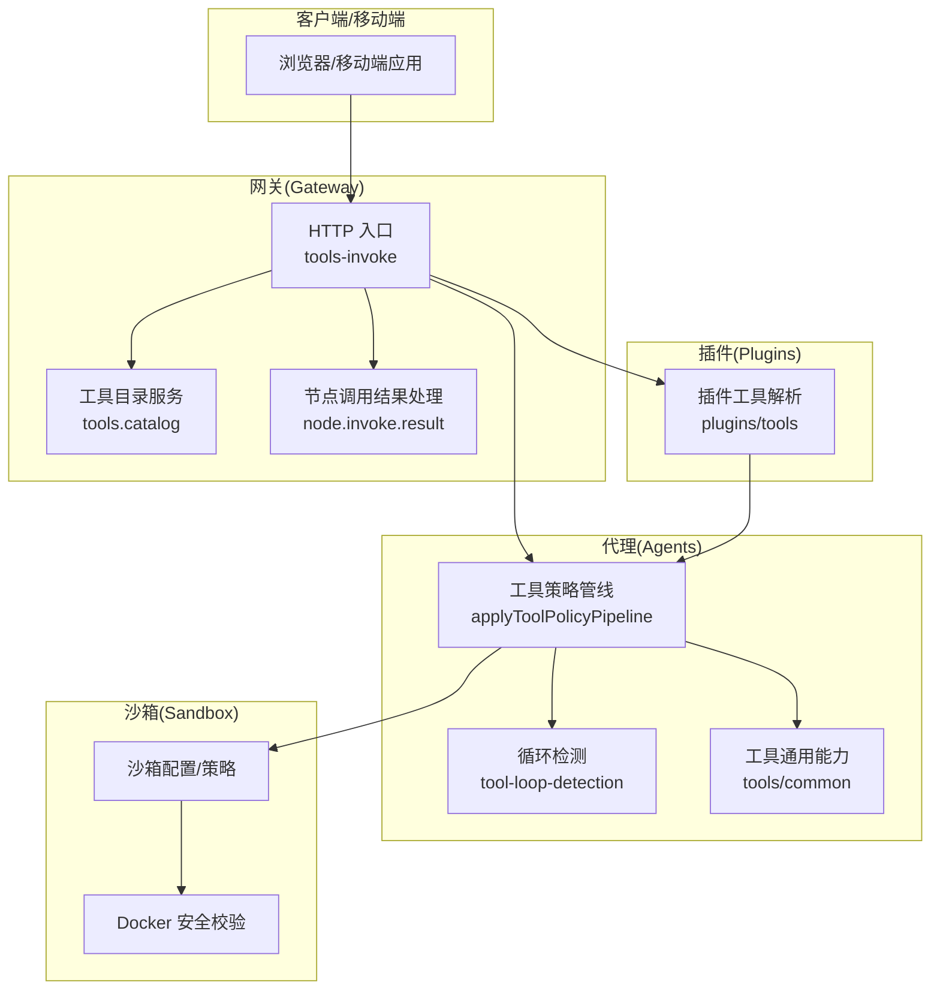
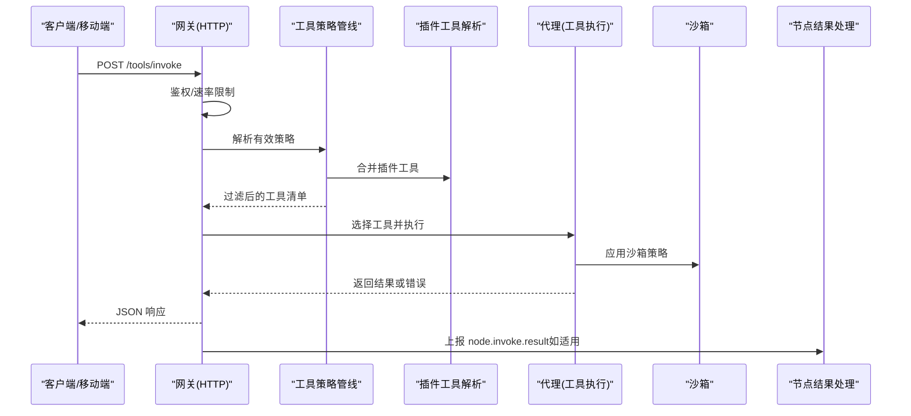
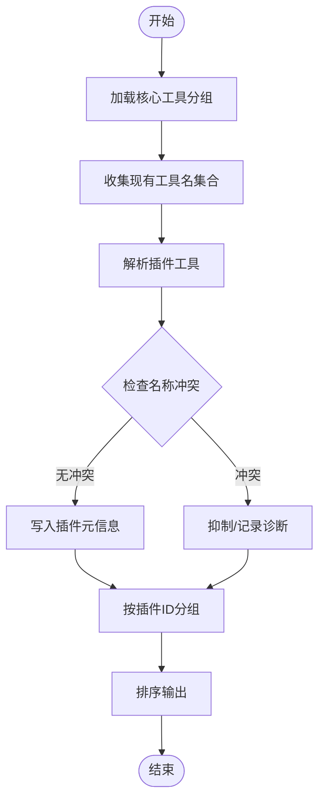
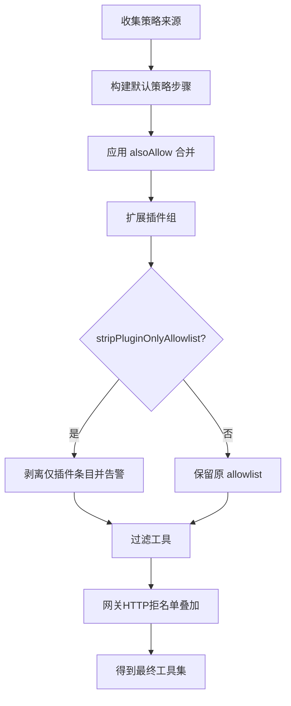
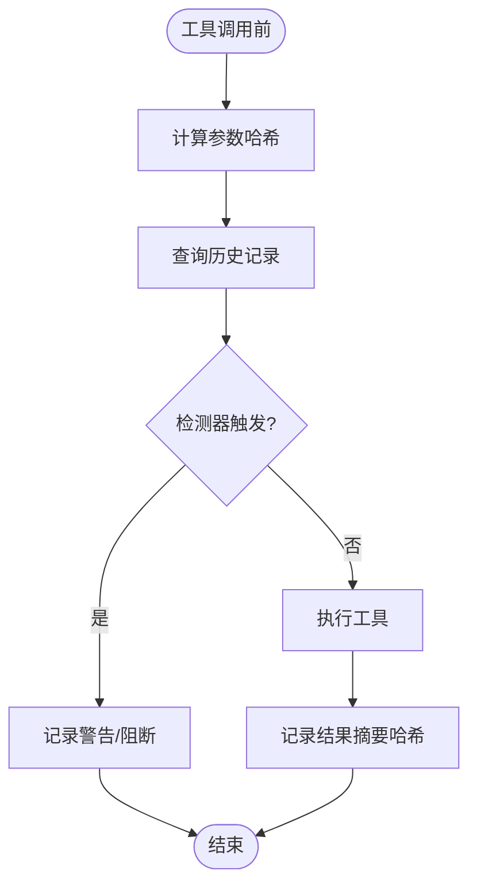
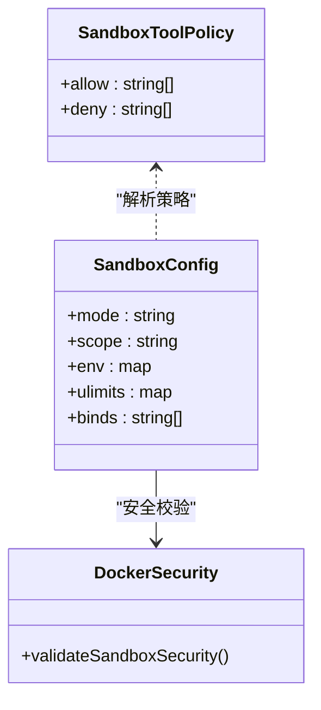
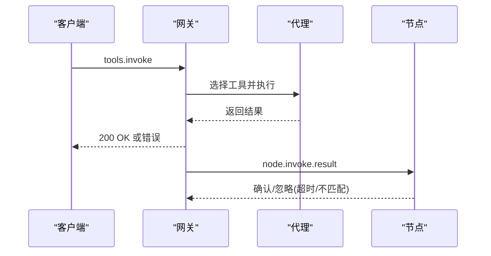
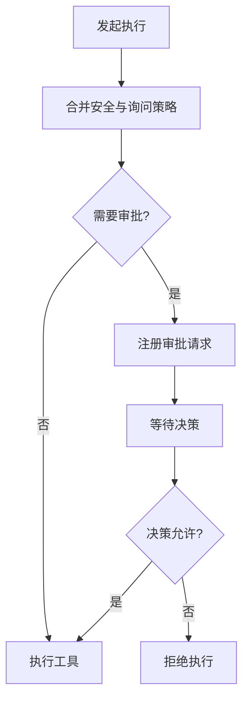
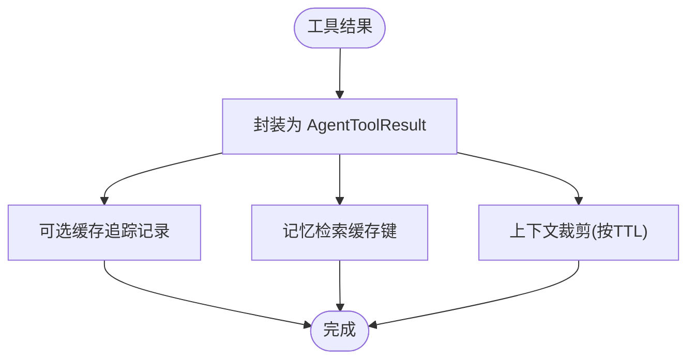
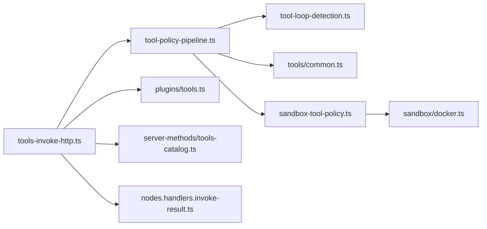

# 工具调用机制

<cite>
**本文档引用的文件**
- [src/gateway/tools-invoke-http.ts](file://src/gateway/tools-invoke-http.ts)
- [src/gateway/server-methods/tools-catalog.ts](file://src/gateway/server-methods/tools-catalog.ts)
- [src/plugins/tools.ts](file://src/plugins/tools.ts)
- [src/agents/tool-loop-detection.ts](file://src/agents/tool-loop-detection.ts)
- [src/agents/tool-policy-pipeline.ts](file://src/agents/tool-policy-pipeline.ts)
- [src/agents/tools/common.ts](file://src/agents/tools/common.ts)
- [src/agents/sandbox-tool-policy.ts](file://src/agents/sandbox-tool-policy.ts)
- [src/agents/sandbox/config.ts](file://src/agents/sandbox/config.ts)
- [src/agents/sandbox/docker.ts](file://src/agents/sandbox/docker.ts)
- [src/agents/sandbox/runtime-status.ts](file://src/agents/sandbox/runtime-status.ts)
- [src/agents/pi-tools.before-tool-call.ts](file://src/agents/pi-tools.before-tool-call.ts)
- [src/agents/bash-tools.exec.ts](file://src/agents/bash-tools.exec.ts)
- [src/agents/bash-tools.exec-approval-request.ts](file://src/agents/bash-tools.exec-approval-request.ts)
- [src/infra/exec-approvals.ts](file://src/infra/exec-approvals.ts)
- [src/gateway/server-methods/nodes.handlers.invoke-result.ts](file://src/gateway/server-methods/nodes.handlers.invoke-result.ts)
- [apps/android/app/src/main/java/ai/openclaw/android/gateway/GatewaySession.kt](file://apps/android/app/src/main/java/ai/openclaw/android/gateway/GatewaySession.kt)
- [apps/macos/Sources/OpenClawProtocol/GatewayModels.swift](file://apps/macos/Sources/OpenClawProtocol/GatewayModels.swift)
- [apps/shared/OpenClawKit/Sources/OpenClawProtocol/GatewayModels.swift](file://apps/shared/OpenClawKit/Sources/OpenClawProtocol/GatewayModels.swift)
- [src/logging/diagnostic.ts](file://src/logging/diagnostic.ts)
- [src/agents/cache-trace.ts](file://src/agents/cache-trace.ts)
- [src/memory/search-manager.ts](file://src/memory/search-manager.ts)
- [src/agents/pi-extensions/context-pruning.test.ts](file://src/agents/pi-extensions/context-pruning.test.ts)
- [src/agents/cache-trace.test.ts](file://src/agents/cache-trace.test.ts)
- [src/agents/usage.test.ts](file://src/agents/usage.test.ts)
- [src/agents/pi-embedded-runner/cache-ttl.ts](file://src/agents/pi-embedded-runner/cache-ttl.ts)
- [src/agents/pi-embedded-runner/run/payloads.ts](file://src/agents/pi-embedded-runner/run/payloads.ts)
- [src/config/zod-schema.agent-runtime.ts](file://src/config/zod-schema.agent-runtime.ts)
</cite>

## 目录

1. [简介](#简介)
2. [项目结构](#项目结构)
3. [核心组件](#核心组件)
4. [架构总览](#架构总览)
5. [详细组件分析](#详细组件分析)
6. [依赖关系分析](#依赖关系分析)
7. [性能考量](#性能考量)
8. [故障排查指南](#故障排查指南)
9. [结论](#结论)
10. [附录：API与最佳实践](#附录api与最佳实践)

## 简介

本文件系统性阐述 OpenClaw 的工具调用机制，覆盖代理工具的发现、注册与调用流程；工具策略系统（访问控制、权限验证、执行限制）；工具目录管理（内置、插件、自定义工具的分类与优先级）；安全防护（沙箱隔离、路径验证、资源限制）；循环检测（防无限递归与资源耗尽）；工具结果处理、缓存与传播；以及面向工具开发者的 API 规范、最佳实践与性能优化建议，并提供监控、调试与故障排除指南。

## 项目结构

OpenClaw 的工具调用涉及多层协作：

- 网关层负责 HTTP 调用入口、鉴权与策略管线过滤
- 插件层负责动态加载与注册工具
- 代理层负责工具策略、循环检测、结果记录与传播
- 沙箱层负责运行时隔离与安全约束
- 客户端与移动端通过 RPC/HTTP 与网关交互

图示来源

- [src/gateway/tools-invoke-http.ts](file://src/gateway/tools-invoke-http.ts#L134-L339)
- [src/gateway/server-methods/tools-catalog.ts](file://src/gateway/server-methods/tools-catalog.ts#L125-L167)
- [src/plugins/tools.ts](file://src/plugins/tools.ts#L45-L140)
- [src/agents/tool-policy-pipeline.ts](file://src/agents/tool-policy-pipeline.ts#L65-L109)
- [src/agents/tool-loop-detection.ts](file://src/agents/tool-loop-detection.ts#L372-L495)
- [src/agents/tools/common.ts](file://src/agents/tools/common.ts#L1-L341)
- [src/agents/sandbox/config.ts](file://src/agents/sandbox/config.ts#L76-L188)
- [src/agents/sandbox/docker.ts](file://src/agents/sandbox/docker.ts#L259-L285)

章节来源

- [src/gateway/tools-invoke-http.ts](file://src/gateway/tools-invoke-http.ts#L134-L339)
- [src/gateway/server-methods/tools-catalog.ts](file://src/gateway/server-methods/tools-catalog.ts#L125-L167)
- [src/plugins/tools.ts](file://src/plugins/tools.ts#L45-L140)

## 核心组件

- 工具目录与发现
  - 内置工具分组与默认配置由核心工具目录提供
  - 插件工具通过插件注册中心动态解析，支持可选工具与名称冲突处理
- 工具策略系统
  - 多层级策略管线：个人资料策略、提供商策略、全局/代理策略、群组策略、子代理策略
  - 支持 alsoAllow 扩展与插件组自动展开
- 循环检测
  - 基于滑动窗口的历史记录，识别重复调用、无进展轮询、Ping-Pong 交替模式与全局熔断
- 安全与隔离
  - 沙箱模式、工具白名单/黑名单、Docker 绑定与网络安全校验
- 结果处理与传播
  - 统一的结果封装、错误状态映射、节点调用结果回传与去重

章节来源

- [src/gateway/server-methods/tools-catalog.ts](file://src/gateway/server-methods/tools-catalog.ts#L56-L123)
- [src/plugins/tools.ts](file://src/plugins/tools.ts#L45-L140)
- [src/agents/tool-policy-pipeline.ts](file://src/agents/tool-policy-pipeline.ts#L17-L63)
- [src/agents/tool-loop-detection.ts](file://src/agents/tool-loop-detection.ts#L27-L100)
- [src/agents/sandbox-tool-policy.ts](file://src/agents/sandbox-tool-policy.ts#L21-L37)
- [src/agents/sandbox/docker.ts](file://src/agents/sandbox/docker.ts#L259-L285)
- [src/gateway/server-methods/nodes.handlers.invoke-result.ts](file://src/gateway/server-methods/nodes.handlers.invoke-result.ts#L25-L71)

## 架构总览

下图展示从 HTTP 请求到工具执行与结果返回的关键路径，以及策略过滤与循环检测的集成点。

图示来源

- [src/gateway/tools-invoke-http.ts](file://src/gateway/tools-invoke-http.ts#L134-L339)
- [src/agents/tool-policy-pipeline.ts](file://src/agents/tool-policy-pipeline.ts#L65-L109)
- [src/plugins/tools.ts](file://src/plugins/tools.ts#L45-L140)
- [src/agents/sandbox/config.ts](file://src/agents/sandbox/config.ts#L170-L188)
- [src/gateway/server-methods/nodes.handlers.invoke-result.ts](file://src/gateway/server-methods/nodes.handlers.invoke-result.ts#L25-L71)

## 详细组件分析

### 工具目录与发现

- 核心工具目录
  - 通过工具分组构建核心工具列表，并为每个工具解析默认配置文件
- 插件工具目录
  - 基于工作区与代理目录解析插件工具，支持可选工具与名称冲突抑制
  - 将插件元信息（插件 ID、是否可选）写入弱映射，供策略与 UI 使用
- 工具目录聚合
  - 合并核心与插件工具，按插件 ID 分组，生成统一的目录结构

图示来源

- [src/gateway/server-methods/tools-catalog.ts](file://src/gateway/server-methods/tools-catalog.ts#L56-L123)
- [src/plugins/tools.ts](file://src/plugins/tools.ts#L113-L139)

章节来源

- [src/gateway/server-methods/tools-catalog.ts](file://src/gateway/server-methods/tools-catalog.ts#L56-L123)
- [src/plugins/tools.ts](file://src/plugins/tools.ts#L45-L140)

### 工具策略系统

- 策略来源与顺序
  - 个人资料策略 → 提供商资料策略 → 全局策略 → 全局提供商策略 → 代理策略 → 代理提供商策略 → 群组策略
- 关键特性
  - alsoAllow 扩展允许在不破坏核心工具可用性的前提下启用插件工具
  - 插件组自动展开，未知 allowlist 条目会发出警告并被剥离
  - 子代理场景下追加子代理工具 allow 策略
- 网关 HTTP 层额外限制
  - 对所有 HTTP 会话应用网关级工具拒名单，支持 allow/deny 覆盖

图示来源

- [src/agents/tool-policy-pipeline.ts](file://src/agents/tool-policy-pipeline.ts#L17-L63)
- [src/agents/tool-policy-pipeline.ts](file://src/agents/tool-policy-pipeline.ts#L65-L109)
- [src/gateway/tools-invoke-http.ts](file://src/gateway/tools-invoke-http.ts#L268-L300)

章节来源

- [src/agents/tool-policy-pipeline.ts](file://src/agents/tool-policy-pipeline.ts#L17-L63)
- [src/agents/tool-policy-pipeline.ts](file://src/agents/tool-policy-pipeline.ts#L65-L109)
- [src/gateway/tools-invoke-http.ts](file://src/gateway/tools-invoke-http.ts#L268-L300)

### 循环检测与防护

- 检测器类型
  - 通用重复调用、已知轮询无进展、Ping-Pong 交替模式、全局熔断
- 阈值与行为
  - 不同阈值触发 warning/critical 级别日志与阻断
  - 记录调用历史、结果摘要哈希，用于识别无进展与交替模式
- 与钩子集成
  - 在工具调用前进行检测，在完成后记录结果摘要

图示来源

- [src/agents/tool-loop-detection.ts](file://src/agents/tool-loop-detection.ts#L372-L495)
- [src/agents/tool-loop-detection.ts](file://src/agents/tool-loop-detection.ts#L501-L588)
- [src/agents/pi-tools.before-tool-call.ts](file://src/agents/pi-tools.before-tool-call.ts#L74-L93)
- [src/logging/diagnostic.ts](file://src/logging/diagnostic.ts#L259-L293)

章节来源

- [src/agents/tool-loop-detection.ts](file://src/agents/tool-loop-detection.ts#L27-L100)
- [src/agents/tool-loop-detection.ts](file://src/agents/tool-loop-detection.ts#L372-L495)
- [src/agents/tool-loop-detection.ts](file://src/agents/tool-loop-detection.ts#L501-L588)
- [src/agents/pi-tools.before-tool-call.ts](file://src/agents/pi-tools.before-tool-call.ts#L43-L72)
- [src/logging/diagnostic.ts](file://src/logging/diagnostic.ts#L259-L293)

### 安全与沙箱隔离

- 沙箱策略
  - 支持 allow/alsoAllow/deny 组合，alsoAllow 在无显式 allow 时作为累加
- 沙箱配置
  - 环境变量、ulimit、绑定卷合并；作用域（共享/会话/代理）与生命周期修剪
- Docker 安全校验
  - 绑定源根、保留容器目标、命名空间加入等危险配置严格校验
- 运行时状态
  - 判断会话是否沙箱化、工具策略解析与阻断提示格式化

图示来源

- [src/agents/sandbox-tool-policy.ts](file://src/agents/sandbox-tool-policy.ts#L21-L37)
- [src/agents/sandbox/config.ts](file://src/agents/sandbox/config.ts#L76-L188)
- [src/agents/sandbox/docker.ts](file://src/agents/sandbox/docker.ts#L259-L285)
- [src/agents/sandbox/runtime-status.ts](file://src/agents/sandbox/runtime-status.ts#L45-L97)

章节来源

- [src/agents/sandbox-tool-policy.ts](file://src/agents/sandbox-tool-policy.ts#L21-L37)
- [src/agents/sandbox/config.ts](file://src/agents/sandbox/config.ts#L76-L188)
- [src/agents/sandbox/docker.ts](file://src/agents/sandbox/docker.ts#L259-L285)
- [src/agents/sandbox/runtime-status.ts](file://src/agents/sandbox/runtime-status.ts#L45-L97)

### 工具调用流程与结果传播

- HTTP 调用
  - 鉴权通过后，解析工具名与参数，合并 action 参数，执行工具并返回 JSON
  - 输入错误与授权错误映射到不同 HTTP 状态码
- 节点调用结果
  - 网关侧校验 node.id 一致性，处理延迟到达结果，记录调试信息

图示来源

- [src/gateway/tools-invoke-http.ts](file://src/gateway/tools-invoke-http.ts#L134-L339)
- [src/gateway/server-methods/nodes.handlers.invoke-result.ts](file://src/gateway/server-methods/nodes.handlers.invoke-result.ts#L25-L71)

章节来源

- [src/gateway/tools-invoke-http.ts](file://src/gateway/tools-invoke-http.ts#L134-L339)
- [src/gateway/server-methods/nodes.handlers.invoke-result.ts](file://src/gateway/server-methods/nodes.handlers.invoke-result.ts#L25-L71)

### 访问控制与权限验证

- 执行策略
  - 安全级别与询问策略的最小/最大取值，支持提升模式下的豁免
- 执行审批
  - 审批请求注册、等待决策、过期处理与“缺失/过期”降级
- 审批记录与操作
  - 允许一次性/永久允许/拒绝，支持在 CLI 中查看与编辑

图示来源

- [src/agents/bash-tools.exec.ts](file://src/agents/bash-tools.exec.ts#L321-L333)
- [src/agents/bash-tools.exec-approval-request.ts](file://src/agents/bash-tools.exec-approval-request.ts#L127-L153)
- [src/infra/exec-approvals.ts](file://src/infra/exec-approvals.ts#L494-L526)

章节来源

- [src/agents/bash-tools.exec.ts](file://src/agents/bash-tools.exec.ts#L321-L333)
- [src/agents/bash-tools.exec-approval-request.ts](file://src/agents/bash-tools.exec-approval-request.ts#L127-L153)
- [src/infra/exec-approvals.ts](file://src/infra/exec-approvals.ts#L494-L526)

### 工具结果处理、缓存与传播

- 结果封装
  - 统一 JSON 文本内容与 details 明细
- 缓存追踪
  - 可选缓存事件追踪文件，记录阶段与摘要
- 记忆检索缓存
  - QMD 缓存键稳定序列化，按 TTL 清理与复用
- 上下文裁剪与缓存
  - 工具结果文本可按 TTL 清理，避免上下文膨胀

图示来源

- [src/agents/tools/common.ts](file://src/agents/tools/common.ts#L230-L240)
- [src/agents/cache-trace.ts](file://src/agents/cache-trace.ts#L166-L191)
- [src/memory/search-manager.ts](file://src/memory/search-manager.ts#L219-L238)
- [src/agents/pi-extensions/context-pruning.test.ts](file://src/agents/pi-extensions/context-pruning.test.ts#L321-L357)

章节来源

- [src/agents/tools/common.ts](file://src/agents/tools/common.ts#L230-L240)
- [src/agents/cache-trace.ts](file://src/agents/cache-trace.ts#L166-L191)
- [src/memory/search-manager.ts](file://src/memory/search-manager.ts#L219-L238)
- [src/agents/pi-extensions/context-pruning.test.ts](file://src/agents/pi-extensions/context-pruning.test.ts#L321-L357)

## 依赖关系分析

- 网关 HTTP 入口依赖策略管线与插件工具解析，再委托代理执行
- 代理层依赖循环检测与工具通用能力，同时受沙箱策略约束
- 客户端/移动端通过 RPC/HTTP 与网关交互，节点结果通过专用处理器回传

图示来源

- [src/gateway/tools-invoke-http.ts](file://src/gateway/tools-invoke-http.ts#L134-L339)
- [src/agents/tool-policy-pipeline.ts](file://src/agents/tool-policy-pipeline.ts#L65-L109)
- [src/plugins/tools.ts](file://src/plugins/tools.ts#L45-L140)
- [src/agents/tool-loop-detection.ts](file://src/agents/tool-loop-detection.ts#L372-L495)
- [src/agents/tools/common.ts](file://src/agents/tools/common.ts#L1-L341)
- [src/agents/sandbox-tool-policy.ts](file://src/agents/sandbox-tool-policy.ts#L21-L37)
- [src/agents/sandbox/docker.ts](file://src/agents/sandbox/docker.ts#L259-L285)
- [src/gateway/server-methods/tools-catalog.ts](file://src/gateway/server-methods/tools-catalog.ts#L125-L167)
- [src/gateway/server-methods/nodes.handlers.invoke-result.ts](file://src/gateway/server-methods/nodes.handlers.invoke-result.ts#L25-L71)

章节来源

- [src/gateway/tools-invoke-http.ts](file://src/gateway/tools-invoke-http.ts#L134-L339)
- [src/agents/tool-policy-pipeline.ts](file://src/agents/tool-policy-pipeline.ts#L65-L109)
- [src/plugins/tools.ts](file://src/plugins/tools.ts#L45-L140)
- [src/agents/tool-loop-detection.ts](file://src/agents/tool-loop-detection.ts#L372-L495)
- [src/agents/tools/common.ts](file://src/agents/tools/common.ts#L1-L341)
- [src/agents/sandbox-tool-policy.ts](file://src/agents/sandbox-tool-policy.ts#L21-L37)
- [src/agents/sandbox/docker.ts](file://src/agents/sandbox/docker.ts#L259-L285)
- [src/gateway/server-methods/tools-catalog.ts](file://src/gateway/server-methods/tools-catalog.ts#L125-L167)
- [src/gateway/server-methods/nodes.handlers.invoke-result.ts](file://src/gateway/server-methods/nodes.handlers.invoke-result.ts#L25-L71)

## 性能考量

- 策略管线短路与快速路径
  - 插件禁用时跳过插件发现，减少热路径开销
- 工具列表合并与去重
  - 名称规范化与集合去重，避免重复扫描
- 循环检测滑动窗口
  - 固定大小窗口与哈希摘要，降低内存与 CPU 开销
- 缓存与上下文裁剪
  - TTL 清理与稳定序列化，避免上下文膨胀与重复计算
- 沙箱绑定与修剪
  - 合并配置与按需修剪，减少容器生命周期成本

[本节为通用指导，无需列出章节来源]

## 故障排查指南

- 循环检测告警与阻断
  - 查看诊断日志中的 tool.loop 事件，定位触发检测器与计数
  - 调整阈值或策略以缓解误报
- 工具不可用
  - 确认工具名大小写与规范化；检查策略管线是否剥离了插件工具
  - 网关 HTTP 层拒名单可能屏蔽工具
- 执行审批
  - 审批请求未及时决策会导致“过期/未找到”，检查审批记录与 CLI
- 沙箱问题
  - Docker 安全校验失败通常由危险绑定/网络/命名空间设置引起
  - 检查沙箱策略与配置合并结果
- 节点结果延迟
  - 网关对延迟结果采取忽略策略，确认客户端是否正确上报 node.invoke.result

章节来源

- [src/logging/diagnostic.ts](file://src/logging/diagnostic.ts#L259-L293)
- [src/agents/tool-loop-detection.ts](file://src/agents/tool-loop-detection.ts#L372-L495)
- [src/gateway/tools-invoke-http.ts](file://src/gateway/tools-invoke-http.ts#L268-L300)
- [src/agents/bash-tools.exec-approval-request.ts](file://src/agents/bash-tools.exec-approval-request.ts#L127-L153)
- [src/agents/sandbox/docker.ts](file://src/agents/sandbox/docker.ts#L259-L285)
- [src/gateway/server-methods/nodes.handlers.invoke-result.ts](file://src/gateway/server-methods/nodes.handlers.invoke-result.ts#L62-L68)

## 结论

OpenClaw 的工具调用机制通过“目录发现 + 策略过滤 + 沙箱隔离 + 循环检测 + 结果传播”的闭环设计，实现了高安全性、可扩展与可观测的工具执行体系。策略管线与插件系统确保工具的可控启用，沙箱与安全校验保障运行时安全，循环检测与缓存策略提升稳定性与性能。配合完善的监控与故障排查手段，能够满足复杂场景下的工具编排需求。

[本节为总结性内容，无需列出章节来源]

## 附录：API与最佳实践

### 工具开发 API 规范

- 工具接口
  - 工具对象需包含名称、标签、描述、参数 Schema 与执行函数
  - 使用统一结果封装与错误类型，便于网关映射状态码
- 参数读取
  - 提供字符串/数字/数组等参数读取辅助方法，支持必填、去空、驼峰/蛇形兼容
- 图像结果
  - 提供图像结果封装与安全净化，支持 MIME 类型与细节字段

章节来源

- [src/agents/tools/common.ts](file://src/agents/tools/common.ts#L74-L201)
- [src/agents/tools/common.ts](file://src/agents/tools/common.ts#L230-L302)

### 最佳实践

- 策略与插件
  - 优先使用 alsoAllow 启用插件工具，避免破坏核心工具可用性
  - 对插件工具进行可选声明与名称冲突抑制
- 循环检测
  - 合理设置阈值，区分轮询与正常重试；对 Ping-Pong 模式特别关注
- 沙箱
  - 明确工具白名单，谨慎使用危险配置；按需修剪容器与卷
- 结果与缓存
  - 使用稳定序列化与摘要，避免上下文膨胀；必要时启用缓存追踪

章节来源

- [src/agents/tool-policy-pipeline.ts](file://src/agents/tool-policy-pipeline.ts#L65-L109)
- [src/plugins/tools.ts](file://src/plugins/tools.ts#L101-L139)
- [src/agents/tool-loop-detection.ts](file://src/agents/tool-loop-detection.ts#L27-L100)
- [src/agents/sandbox-tool-policy.ts](file://src/agents/sandbox-tool-policy.ts#L21-L37)
- [src/memory/search-manager.ts](file://src/memory/search-manager.ts#L219-L238)

### 监控与调试

- 诊断事件
  - 工具循环检测动作通过诊断事件上报，支持级别化日志
- 缓存追踪
  - 可配置缓存事件追踪文件，记录阶段与摘要
- 会话状态
  - 获取工具调用统计（总调用次数、唯一模式数、最频繁模式）

章节来源

- [src/logging/diagnostic.ts](file://src/logging/diagnostic.ts#L259-L293)
- [src/agents/cache-trace.ts](file://src/agents/cache-trace.ts#L166-L191)
- [src/agents/tool-loop-detection.ts](file://src/agents/tool-loop-detection.ts#L593-L623)

### 客户端/移动端集成要点

- Android
  - 解析 invoke 事件载荷，调用回调并发送结果
- iOS/Mac
  - 工具目录模型包含工具与分组信息，支持插件标识与可选标记
- Web/桌面
  - 通过网关 HTTP 接口调用工具，遵循鉴权与策略过滤

章节来源

- [apps/android/app/src/main/java/ai/openclaw/android/gateway/GatewaySession.kt](file://apps/android/app/src/main/java/ai/openclaw/android/gateway/GatewaySession.kt#L523-L547)
- [apps/macos/Sources/OpenClawProtocol/GatewayModels.swift](file://apps/macos/Sources/OpenClawProtocol/GatewayModels.swift#L2255-L2283)
- [apps/shared/OpenClawKit/Sources/OpenClawProtocol/GatewayModels.swift](file://apps/shared/OpenClawKit/Sources/OpenClawProtocol/GatewayModels.swift#L2226-L2283)
