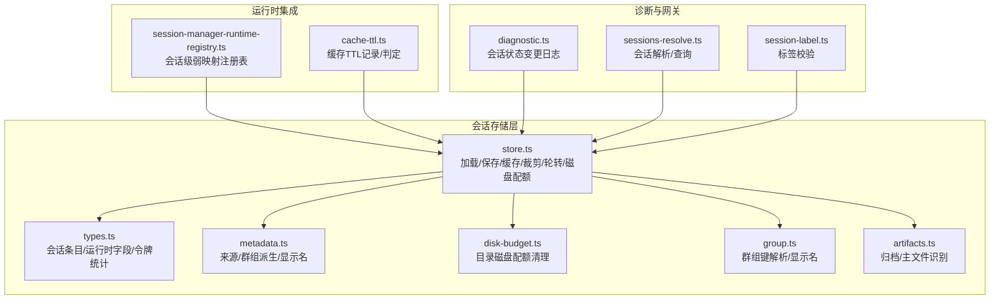
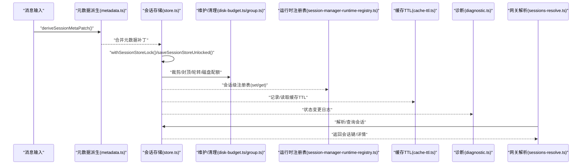
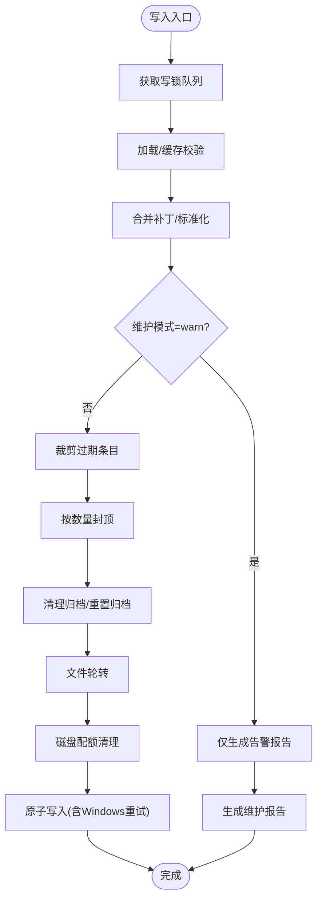
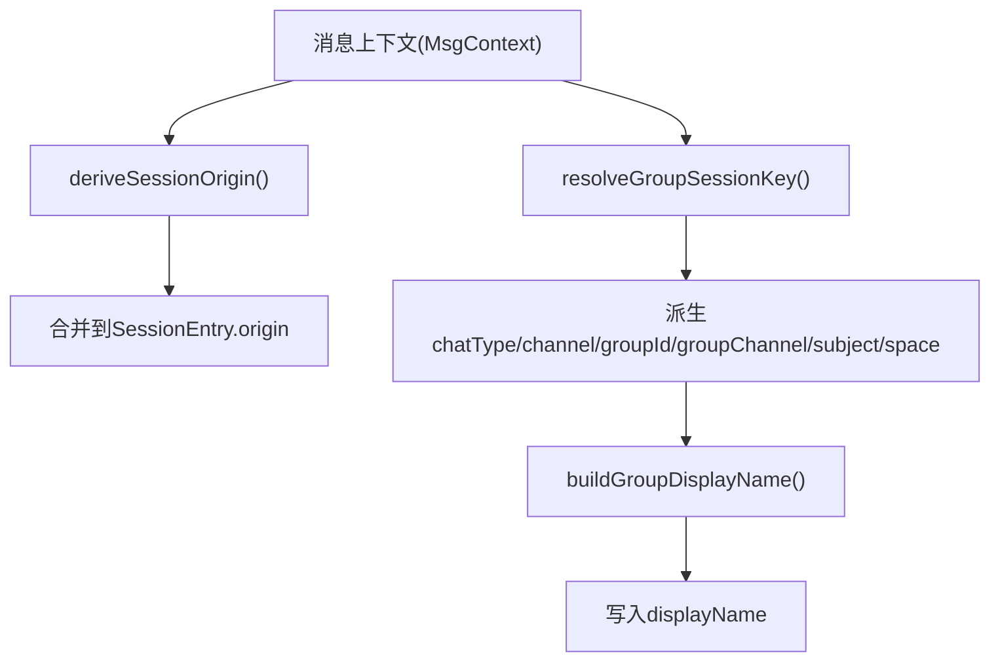
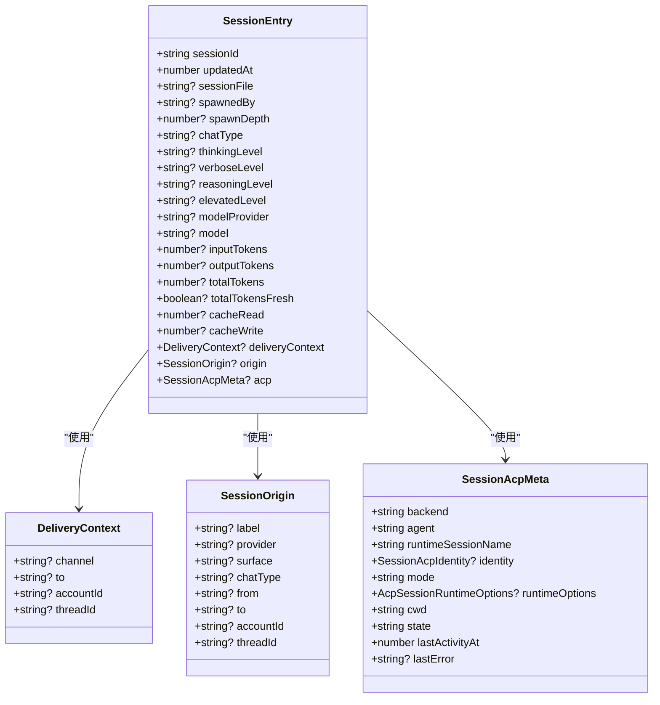
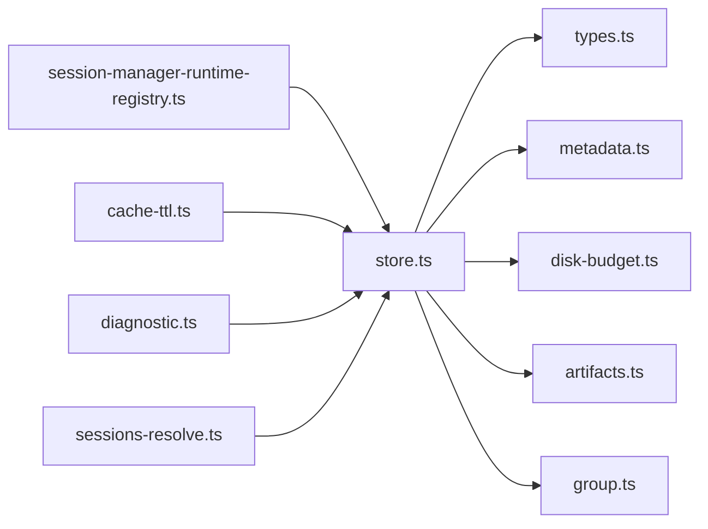

# 会话管理

<cite>
**本文引用的文件**
- [src/config/sessions/store.ts](file://src/config/sessions/store.ts)
- [src/config/sessions/types.ts](file://src/config/sessions/types.ts)
- [src/config/sessions/metadata.ts](file://src/config/sessions/metadata.ts)
- [src/config/sessions/disk-budget.ts](file://src/config/sessions/disk-budget.ts)
- [src/config/sessions/group.ts](file://src/config/sessions/group.ts)
- [src/config/sessions/artifacts.ts](file://src/config/sessions/artifacts.ts)
- [src/agents/pi-extensions/session-manager-runtime-registry.ts](file://src/agents/pi-extensions/session-manager-runtime-registry.ts)
- [src/agents/pi-embedded-runner/cache-ttl.ts](file://src/agents/pi-embedded-runner/cache-ttl.ts)
- [src/logging/diagnostic.ts](file://src/logging/diagnostic.ts)
- [src/gateway/sessions-resolve.ts](file://src/gateway/sessions-resolve.ts)
- [src/sessions/session-label.ts](file://src/sessions/session-label.ts)
- [docs/gateway/configuration-reference.md](file://docs/gateway/configuration-reference.md)
</cite>

## 目录

1. [简介](#简介)
2. [项目结构](#项目结构)
3. [核心组件](#核心组件)
4. [架构总览](#架构总览)
5. [详细组件分析](#详细组件分析)
6. [依赖关系分析](#依赖关系分析)
7. [性能考量](#性能考量)
8. [故障排查指南](#故障排查指南)
9. [结论](#结论)
10. [附录](#附录)

## 简介

本文件系统性阐述 OpenClaw 会话管理系统：从会话概念、生命周期与状态管理，到创建、维护、更新与清理流程；覆盖持久化策略、缓存机制与并发控制；解释会话与代理、频道、工具调用的关系；并提供配置项、性能优化与故障恢复的最佳实践与调试技巧。

## 项目结构

围绕“会话”的核心代码主要位于 src/config/sessions 及其周边模块：

- 存储与维护：store.ts（加载/保存、缓存、裁剪、轮转、磁盘配额）
- 数据模型：types.ts（会话条目、运行时字段、令牌统计等）
- 元数据派生：metadata.ts（来源、群组键解析、显示名构建）
- 磁盘预算：disk-budget.ts（按目录总大小清理过期/冗余文件）
- 群组会话：group.ts（群组/频道键解析与显示名）
- 归档与文件识别：artifacts.ts（归档文件命名规则）
- 运行时注册表：session-manager-runtime-registry.ts（会话级弱映射注册表）
- 缓存 TTL：cache-ttl.ts（缓存时间戳记录与判定）
- 诊断日志：diagnostic.ts（会话状态变更事件）
- 网关解析：sessions-resolve.ts（会话查询与解析）
- 标签校验：session-label.ts（标签长度与合法性）

图表来源

- [src/config/sessions/store.ts](file://src/config/sessions/store.ts#L1-L1159)
- [src/config/sessions/types.ts](file://src/config/sessions/types.ts#L1-L339)
- [src/config/sessions/metadata.ts](file://src/config/sessions/metadata.ts#L1-L173)
- [src/config/sessions/disk-budget.ts](file://src/config/sessions/disk-budget.ts#L1-L376)
- [src/config/sessions/group.ts](file://src/config/sessions/group.ts#L1-L108)
- [src/config/sessions/artifacts.ts](file://src/config/sessions/artifacts.ts#L1-L68)
- [src/agents/pi-extensions/session-manager-runtime-registry.ts](file://src/agents/pi-extensions/session-manager-runtime-registry.ts#L1-L30)
- [src/agents/pi-embedded-runner/cache-ttl.ts](file://src/agents/pi-embedded-runner/cache-ttl.ts#L1-L77)
- [src/logging/diagnostic.ts](file://src/logging/diagnostic.ts#L169-L202)
- [src/gateway/sessions-resolve.ts](file://src/gateway/sessions-resolve.ts#L72-L115)
- [src/sessions/session-label.ts](file://src/sessions/session-label.ts#L1-L20)

章节来源

- [src/config/sessions/store.ts](file://src/config/sessions/store.ts#L1-L1159)
- [src/config/sessions/types.ts](file://src/config/sessions/types.ts#L1-L339)
- [src/config/sessions/metadata.ts](file://src/config/sessions/metadata.ts#L1-L173)
- [src/config/sessions/disk-budget.ts](file://src/config/sessions/disk-budget.ts#L1-L376)
- [src/config/sessions/group.ts](file://src/config/sessions/group.ts#L1-L108)
- [src/config/sessions/artifacts.ts](file://src/config/sessions/artifacts.ts#L1-L68)
- [src/agents/pi-extensions/session-manager-runtime-registry.ts](file://src/agents/pi-extensions/session-manager-runtime-registry.ts#L1-L30)
- [src/agents/pi-embedded-runner/cache-ttl.ts](file://src/agents/pi-embedded-runner/cache-ttl.ts#L1-L77)
- [src/logging/diagnostic.ts](file://src/logging/diagnostic.ts#L169-L202)
- [src/gateway/sessions-resolve.ts](file://src/gateway/sessions-resolve.ts#L72-L115)
- [src/sessions/session-label.ts](file://src/sessions/session-label.ts#L1-L20)

## 核心组件

- 会话条目与运行时字段：定义会话元数据、运行参数、令牌统计、队列策略、ACP 元信息等。
- 会话存储与锁：提供带缓存的读写、跨进程写锁队列、Windows 原子写入策略、维护模式（警告/执行）。
- 维护与清理：按时间裁剪、按数量封顶、文件轮转、磁盘配额清理、归档清理。
- 元数据派生：从消息上下文推导来源、群组键、显示名，保证键规范化与一致性。
- 运行时集成：会话级注册表、缓存 TTL 记录，支持插件/扩展在会话生命周期内挂载状态。
- 诊断与查询：会话状态变更日志、会话解析与查询接口。

章节来源

- [src/config/sessions/types.ts](file://src/config/sessions/types.ts#L68-L174)
- [src/config/sessions/store.ts](file://src/config/sessions/store.ts#L198-L284)
- [src/config/sessions/metadata.ts](file://src/config/sessions/metadata.ts#L45-L172)
- [src/agents/pi-extensions/session-manager-runtime-registry.ts](file://src/agents/pi-extensions/session-manager-runtime-registry.ts#L1-L30)
- [src/agents/pi-embedded-runner/cache-ttl.ts](file://src/agents/pi-embedded-runner/cache-ttl.ts#L38-L76)
- [src/logging/diagnostic.ts](file://src/logging/diagnostic.ts#L169-L202)

## 架构总览

下图展示会话从创建到维护的关键路径：消息进入后派生元数据，写入会话存储；随后根据维护策略进行裁剪、轮转与磁盘清理；运行时通过注册表与缓存 TTL 协同；诊断系统记录状态变化；网关负责会话解析与查询。

图表来源

- [src/config/sessions/metadata.ts](file://src/config/sessions/metadata.ts#L153-L172)
- [src/config/sessions/store.ts](file://src/config/sessions/store.ts#L642-L800)
- [src/config/sessions/disk-budget.ts](file://src/config/sessions/disk-budget.ts#L188-L375)
- [src/agents/pi-extensions/session-manager-runtime-registry.ts](file://src/agents/pi-extensions/session-manager-runtime-registry.ts#L1-L30)
- [src/agents/pi-embedded-runner/cache-ttl.ts](file://src/agents/pi-embedded-runner/cache-ttl.ts#L38-L76)
- [src/logging/diagnostic.ts](file://src/logging/diagnostic.ts#L169-L202)
- [src/gateway/sessions-resolve.ts](file://src/gateway/sessions-resolve.ts#L72-L115)

## 详细组件分析

### 会话存储与并发控制

- 缓存：基于 Map 的 TTL 缓存，避免频繁磁盘 IO；缓存命中时深拷贝返回，防止外部修改污染缓存。
- 写锁队列：同一 storePath 的写操作串行化，支持超时与过期清理；Windows 使用临时文件 + 重命名实现原子写入。
- 维护模式：warn 模式仅告警不删除，enforce 模式执行裁剪、封顶、轮转与磁盘清理。
- 文件轮转：超过阈值自动备份并保留最近若干份；清理旧备份。
- 磁盘配额：按目录总大小清理归档与主文件，优先删除最旧且未被引用的会话文件。

图表来源

- [src/config/sessions/store.ts](file://src/config/sessions/store.ts#L642-L800)
- [src/config/sessions/store.ts](file://src/config/sessions/store.ts#L575-L627)
- [src/config/sessions/disk-budget.ts](file://src/config/sessions/disk-budget.ts#L188-L375)

章节来源

- [src/config/sessions/store.ts](file://src/config/sessions/store.ts#L198-L284)
- [src/config/sessions/store.ts](file://src/config/sessions/store.ts#L642-L800)
- [src/config/sessions/store.ts](file://src/config/sessions/store.ts#L575-L627)
- [src/config/sessions/disk-budget.ts](file://src/config/sessions/disk-budget.ts#L188-L375)

### 会话元数据与群组键

- 来源派生：从消息上下文提取标签、提供商、表面、聊天类型、发送方、接收方、账号、线程等。
- 群组键解析：根据 From/Provider/ChatType 推断 provider:kind:id，并生成显示名。
- 显示名构建：规范化并截断，确保唯一性与可读性。

图表来源

- [src/config/sessions/metadata.ts](file://src/config/sessions/metadata.ts#L45-L172)
- [src/config/sessions/group.ts](file://src/config/sessions/group.ts#L54-L107)

章节来源

- [src/config/sessions/metadata.ts](file://src/config/sessions/metadata.ts#L45-L172)
- [src/config/sessions/group.ts](file://src/config/sessions/group.ts#L23-L52)

### 会话数据模型与运行时字段

- 关键字段：sessionId、updatedAt、channel/groupChannel/groupId/subject/space、origin、deliveryContext、队列策略、令牌统计、ACP 元信息等。
- 运行时字段标准化：统一 provider/model 大小写与空值处理，避免陈旧字段残留。
- 合并策略：以最新时间戳为准，必要时清除不一致的 provider 字段。

图表来源

- [src/config/sessions/types.ts](file://src/config/sessions/types.ts#L68-L174)
- [src/config/sessions/types.ts](file://src/config/sessions/types.ts#L14-L23)
- [src/config/sessions/types.ts](file://src/config/sessions/types.ts#L38-L49)

章节来源

- [src/config/sessions/types.ts](file://src/config/sessions/types.ts#L68-L174)

### 会话与代理、频道、工具调用的关系

- 代理侧：会话级注册表用于在会话生命周期内挂载运行时状态；缓存 TTL 记录用于跨轮次复用缓存。
- 频道侧：消息动作分发需要可信请求者身份；会话存储负责标准化 deliveryContext 与 last\* 字段。
- 工具调用：会话状态影响队列策略、令牌统计与回放边界（abortCutoff）。

章节来源

- [src/agents/pi-extensions/session-manager-runtime-registry.ts](file://src/agents/pi-extensions/session-manager-runtime-registry.ts#L1-L30)
- [src/agents/pi-embedded-runner/cache-ttl.ts](file://src/agents/pi-embedded-runner/cache-ttl.ts#L38-L76)
- [src/config/sessions/store.ts](file://src/config/sessions/store.ts#L72-L103)

### 会话配置选项与维护策略

- 维护模式：warn/enforce
- 裁剪：pruneAfter（默认30天）、maxEntries（默认500）
- 轮转：rotateBytes（默认10MB）
- 磁盘配额：maxDiskBytes、highWaterBytes（默认80%）
- 归档保留：resetArchiveRetention（默认等于pruneAfter；可设为false禁用）
- 网关维度：dmScope、reset/resetByType、sendPolicy、threadBindings 等

章节来源

- [docs/gateway/configuration-reference.md](file://docs/gateway/configuration-reference.md#L1394-L1418)
- [src/config/sessions/store.ts](file://src/config/sessions/store.ts#L426-L448)
- [src/config/sessions/disk-budget.ts](file://src/config/sessions/disk-budget.ts#L7-L21)

### 会话状态管理与诊断

- 状态变更：记录 prev/new/state/queueDepth 等上下文，支持调试与可观测性。
- 会话解析：支持按 sessionId/key/label 查询，带去重与错误提示。

章节来源

- [src/logging/diagnostic.ts](file://src/logging/diagnostic.ts#L169-L202)
- [src/gateway/sessions-resolve.ts](file://src/gateway/sessions-resolve.ts#L72-L115)

## 依赖关系分析

- store.ts 依赖 types.ts（数据模型）、metadata.ts（元数据）、disk-budget.ts（磁盘清理）、artifacts.ts（文件识别）、group.ts（群组键）、以及写锁与文件系统 API。
- 运行时集成通过 session-manager-runtime-registry.ts 与 cache-ttl.ts 与 store.ts 解耦协作。
- 诊断与网关分别通过 diagnostic.ts 与 sessions-resolve.ts 间接依赖 store.ts。

图表来源

- [src/config/sessions/store.ts](file://src/config/sessions/store.ts#L1-L30)
- [src/agents/pi-extensions/session-manager-runtime-registry.ts](file://src/agents/pi-extensions/session-manager-runtime-registry.ts#L1-L30)
- [src/agents/pi-embedded-runner/cache-ttl.ts](file://src/agents/pi-embedded-runner/cache-ttl.ts#L1-L77)
- [src/logging/diagnostic.ts](file://src/logging/diagnostic.ts#L169-L202)
- [src/gateway/sessions-resolve.ts](file://src/gateway/sessions-resolve.ts#L72-L115)

章节来源

- [src/config/sessions/store.ts](file://src/config/sessions/store.ts#L1-L30)

## 性能考量

- 缓存 TTL：通过环境变量可调，默认约 45 秒；建议在高并发场景适当提高以减少磁盘 IO。
- 写锁队列：串行化写入，避免竞态；Windows 使用重试与临时文件策略，降低写入失败概率。
- 维护策略：warn 模式对性能影响最小；enforce 模式在保存时执行裁剪、封顶、轮转与磁盘清理，建议在低峰时段触发。
- 磁盘配额：合理设置 maxDiskBytes 与 highWaterBytes，避免频繁清理导致抖动。
- 缓存 TTL 记录：仅记录最近一次时间戳，避免重复持久化开销。

章节来源

- [src/config/sessions/store.ts](file://src/config/sessions/store.ts#L51-L60)
- [src/config/sessions/store.ts](file://src/config/sessions/store.ts#L778-L800)
- [src/agents/pi-embedded-runner/cache-ttl.ts](file://src/agents/pi-embedded-runner/cache-ttl.ts#L38-L76)

## 故障排查指南

- 会话丢失或为空：检查 Windows 原子写入是否因重命名失败；查看写锁队列任务是否堆积。
- 维护误删活跃会话：确认维护模式为 warn 时不会删除；若为 enforce，检查 activeSessionKey 是否被排除。
- 磁盘空间不足：调整 maxDiskBytes 与 highWaterBytes；确认归档清理与轮转生效。
- 群组键冲突：核对 resolveGroupSessionKey 输出与显示名构建逻辑；确保键规范化。
- 标签非法：使用 session-label.ts 的解析器校验标签长度与格式。
- 诊断事件：通过 diagnostic 日志定位状态变更原因与队列深度变化。

章节来源

- [src/config/sessions/store.ts](file://src/config/sessions/store.ts#L778-L800)
- [src/config/sessions/store.ts](file://src/config/sessions/store.ts#L658-L694)
- [src/config/sessions/disk-budget.ts](file://src/config/sessions/disk-budget.ts#L227-L244)
- [src/config/sessions/group.ts](file://src/config/sessions/group.ts#L54-L107)
- [src/sessions/session-label.ts](file://src/sessions/session-label.ts#L5-L20)
- [src/logging/diagnostic.ts](file://src/logging/diagnostic.ts#L169-L202)

## 结论

OpenClaw 的会话管理以“安全、可观测、可维护”为核心设计目标：通过强一致的写锁与原子写入保障并发安全；通过缓存与维护策略平衡性能与资源占用；通过磁盘配额与归档清理维持长期稳定性；通过元数据派生与群组键解析提升可用性与可追溯性。配合运行时注册表与缓存 TTL，系统在复杂场景下仍能保持高效与可靠。

## 附录

- 最佳实践
  - 在高并发场景启用缓存并适度提高 TTL；在生产环境使用 enforce 维护模式并设定合理的磁盘配额。
  - 对于多账户/多通道场景，使用 dmScope 与 identityLinks 精细隔离与共享会话。
  - 定期检查维护报告与诊断日志，关注活跃会话预警与磁盘清理结果。
- 调试技巧
  - 使用 sessions-resolve 查询会话键与详情，结合 diagnostic 日志定位状态变化。
  - 通过 session-label 校验标签合法性；通过 metadata 与 group 模块核对来源与群组键。
  - 在测试中使用 clearSessionStoreCacheForTest 清理缓存，避免脏读。
