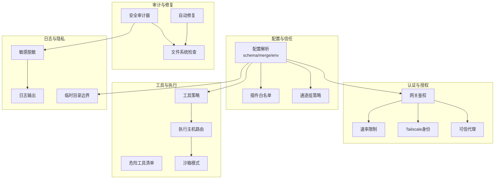
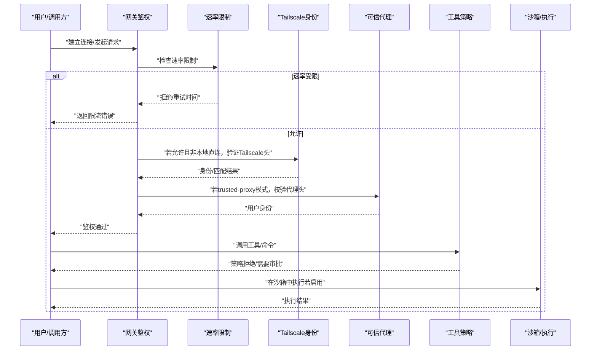
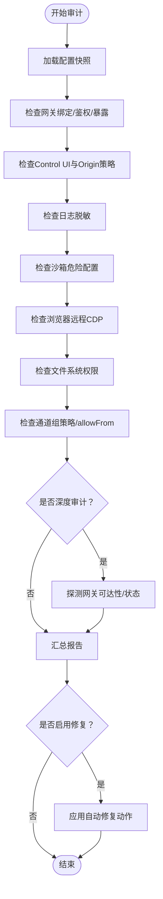
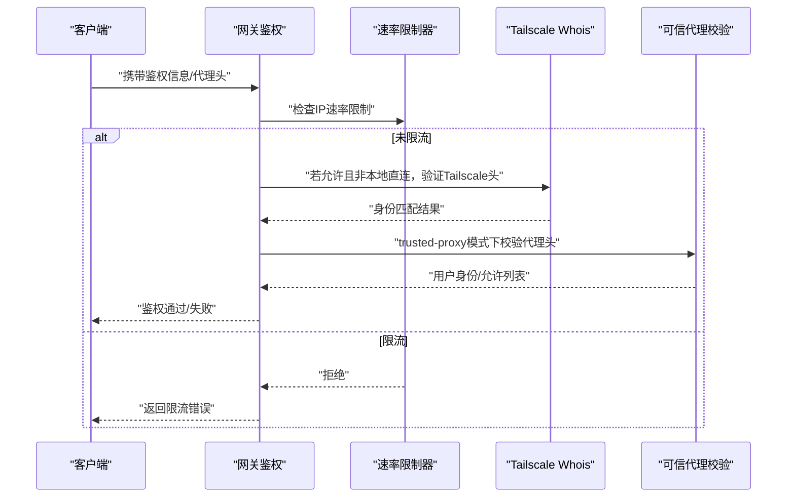
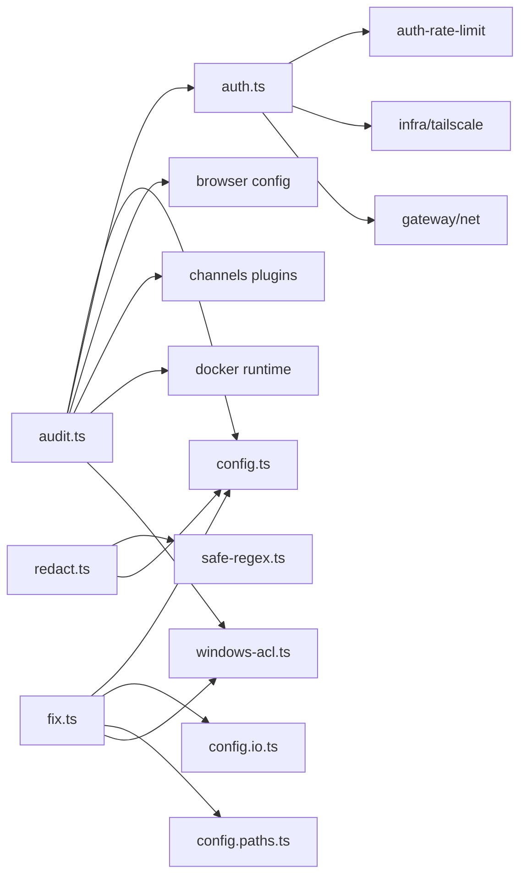

# 安全设计

<cite>
**本文引用的文件**
- [SECURITY.md](file://SECURITY.md)
- [audit.ts](file://src/security/audit.ts)
- [fix.ts](file://src/security/fix.ts)
- [redact.ts](file://src/logging/redact.ts)
- [auth.ts](file://src/gateway/auth.ts)
- [dangerous-tools.ts](file://src/security/dangerous-tools.ts)
- [index.md](file://docs/zh-CN/gateway/security/index.md)
- [security.md](file://docs/cli/security.md)
- [status.command.ts](file://src/commands/status.command.ts)
- [audit.test.ts](file://src/security/audit.test.ts)
- [audit-extra.async.ts](file://src/security/audit-extra.async.ts)
- [audit-extra.sync.ts](file://src/security/audit-extra.sync.ts)
- [redact-identifier.ts](file://src/logging/redact-identifier.ts)
- [windows-acl.ts](file://src/security/windows-acl.ts)
- [secret-equal.ts](file://src/security/secret-equal.ts)
- [auth-context.ts](file://src/gateway/server/ws-connection/auth-context.ts)
- [sandbox.ts](file://src/agents/sandbox.ts)
- [scan-paths.ts](file://src/security/scan-paths.ts)
- [external-content.ts](file://src/security/external-content.ts)
- [dm-policy-shared.ts](file://src/security/dm-policy-shared.ts)
- [temp-path-guard.test.ts](file://src/security/temp-path-guard.test.ts)
- [safe-regex.ts](file://src/security/safe-regex.ts)
- [dangerous-config-flags.ts](file://src/security/dangerous-config-flags.ts)
- [dangerous-tools.ts](file://src/security/dangerous-tools.ts)
- [mutable-allowlist-detectors.ts](file://src/security/mutable-allowlist-detectors.ts)
- [skill-scanner.ts](file://src/security/skill-scanner.ts)
- [channel-metadata.ts](file://src/security/channel-metadata.ts)
- [audit-channel.ts](file://src/security/audit-channel.ts)
- [dm-policy-channel-smoke.test.ts](file://src/security/dm-policy-channel-smoke.test.ts)
- [dm-policy-shared.test.ts](file://src/security/dm-policy-shared.test.ts)
- [external-content.test.ts](file://src/security/external-content.test.ts)
- [windows-acl.test.ts](file://src/security/windows-acl.test.ts)
- [audit-fs.ts](file://src/security/audit-fs.ts)
- [paths.ts](file://src/config/paths.ts)
- [io.ts](file://src/config/io.ts)
- [config.ts](file://src/config/config.ts)
- [schema.ts](file://src/config/schema.ts)
- [validation.ts](file://src/config/validation.ts)
- [merge-patch.ts](file://src/config/merge-patch.ts)
- [env-substitution.ts](file://src/config/env-substitution.ts)
- [group-policy.ts](file://src/config/group-policy.ts)
- [runtime-group-policy.ts](file://src/config/runtime-group-policy.ts)
- [plugins-allowlist.ts](file://src/config/plugins-allowlist.ts)
- [types.openclaw.ts](file://src/config/types.openclaw.ts)
- [types.sandbox.ts](file://src/config/types.sandbox.ts)
- [types.auth.ts](file://src/config/types.auth.ts)
- [types.channels.ts](file://src/config/types.channels.ts)
- [types.tools.ts](file://src/config/types.tools.ts)
- [types.base.ts](file://src/config/types.base.ts)
- [types.ts](file://src/config/types.ts)
- [defaults.ts](file://src/config/defaults.ts)
- [legacy.ts](file://src/config/legacy.ts)
- [legacy.migrations.ts](file://src/config/legacy.migrations.ts)
- [legacy.migrations.part-1.ts](file://src/config/legacy.migrations.part-1.ts)
- [legacy.migrations.part-2.ts](file://src/config/legacy.migrations.part-2.ts)
- [legacy.migrations.part-3.ts](file://src/config/legacy.migrations.part-3.ts)
- [legacy.shared.ts](file://src/config/legacy.shared.ts)
- [legacy.rules.ts](file://src/config/legacy.rules.ts)
- [config.ts](file://src/config/config.ts)
- [config.io.ts](file://src/config/io.ts)
- [config.paths.ts](file://src/config/paths.ts)
- [config.merge-patch.ts](file://src/config/merge-patch.ts)
- [config.env-substitution.ts](file://src/config/env-substitution.ts)
- [config.group-policy.ts](file://src/config/group-policy.ts)
- [config.runtime-group-policy.ts](file://src/config/runtime-group-policy.ts)
- [config.plugins-allowlist.ts](file://src/config/plugins-allowlist.ts)
- [config.types.openclaw.ts](file://src/config/types.openclaw.ts)
- [config.types.sandbox.ts](file://src/config/types.sandbox.ts)
- [config.types.auth.ts](file://src/config/types.auth.ts)
- [config.types.channels.ts](file://src/config/types.channels.ts)
- [config.types.tools.ts](file://src/config/types.tools.ts)
- [config.types.base.ts](file://src/config/types.base.ts)
- [config.types.ts](file://src/config/types.ts)
- [config.defaults.ts](file://src/config/defaults.ts)
- [config.legacy.ts](file://src/config/legacy.ts)
- [config.legacy.migrations.ts](file://src/config/legacy.migrations.ts)
- [config.legacy.migrations.part-1.ts](file://src/config/legacy.migrations.part-1.ts)
- [config.legacy.migrations.part-2.ts](file://src/config/legacy.migrations.part-2.ts)
- [config.legacy.migrations.part-3.ts](file://src/config/legacy.migrations.part-3.ts)
- [config.legacy.shared.ts](file://src/config/legacy.shared.ts)
- [config.legacy.rules.ts](file://src/config/legacy.rules.ts)
- [config.config.ts](file://src/config/config.ts)
- [config.io.ts](file://src/config/io.ts)
- [config.paths.ts](file://src/config/paths.ts)
- [config.merge-patch.ts](file://src/config/merge-patch.ts)
- [config.env-substitution.ts](file://src/config/env-substitution.ts)
- [config.group-policy.ts](file://src/config/group-policy.ts)
- [config.runtime-group-policy.ts](file://src/config/runtime-group-policy.ts)
- [config.plugins-allowlist.ts](file://src/config/plugins-allowlist.ts)
- [config.types.openclaw.ts](file://src/config/types.openclaw.ts)
- [config.types.sandbox.ts](file://src/config/types.sandbox.ts)
- [config.types.auth.ts](file://src/config/types.auth.ts)
- [config.types.channels.ts](file://src/config/types.channels.ts)
- [config.types.tools.ts](file://src/config/types.tools.ts)
- [config.types.base.ts](file://src/config/types.base.ts)
- [config.types.ts](file://src/config/types.ts)
- [config.defaults.ts](file://src/config/defaults.ts)
- [config.legacy.ts](file://src/config/legacy.ts)
- [config.legacy.migrations.ts](file://src/config/legacy.migrations.ts)
- [config.legacy.migrations.part-1.ts](file://src/config/legacy.migrations.part-1.ts)
- [config.legacy.migrations.part-2.ts](file://src/config/legacy.migrations.part-2.ts)
- [config.legacy.migrations.part-3.ts](file://src/config/legacy.migrations.part-3.ts)
- [config.legacy.shared.ts](file://src/config/legacy.shared.ts)
- [config.legacy.rules.ts](file://src/config/legacy.rules.ts)
- [config.config.ts](file://src/config/config.ts)
- [config.io.ts](file://src/config/io.ts)
- [config.paths.ts](file://src/config/paths.ts)
- [config.merge-patch.ts](file://src/config/merge-patch.ts)
- [config.env-substitution.ts](file://src/config/env-substitution.ts)
- [config.group-policy.ts](file://src/config/group-policy.ts)
- [config.runtime-group-policy.ts](file://src/config/runtime-group-policy.ts)
- [config.plugins-allowlist.ts](file://src/config/plugins-allowlist.ts)
- [config.types.openclaw.ts](file://src/config/types.openclaw.ts)
- [config.types.sandbox.ts](file://src/config/types.sandbox.ts)
- [config.types.auth.ts](file://src/config/types.auth.ts)
- [config.types.channels.ts](file://src/config/types.channels.ts)
- [config.types.tools.ts](file://src/config/types.tools.ts)
- [config.types.base.ts](file://src/config/types.base.ts)
- [config.types.ts](file://src/config/types.ts)
- [config.defaults.ts](file://src/config/defaults.ts)
- [config.legacy.ts](file://src/config/legacy.ts)
- [config.legacy.migrations.ts](file://src/config/legacy.migrations.ts)
- [config.legacy.migrations.part-1.ts](file://src/config/legacy.migrations.part-1.ts)
- [config.legacy.migrations.part-2.ts](file://src/config/legacy.migrations.part-2.ts)
- [config.legacy.migrations.part-3.ts](file://src/config/legacy.migrations.part-3.ts)
- [config.legacy.shared.ts](file://src/config/legacy.shared.ts)
- [config.legacy.rules.ts](file://src/config/legacy.rules.ts)
- [config.config.ts](file://src/config/config.ts)
- [config.io.ts](file://src/config/io.ts)
- [config.paths.ts](file://src/config/paths.ts)
- [config.merge-patch.ts](file://src/config/merge-patch.ts)
- [config.env-substitution.ts](file://src/config/env-substitution.ts)
- [config.group-policy.ts](file://src/config/group-policy.ts)
- [config.runtime-group-policy.ts](file://src/config/runtime-group-policy.ts)
- [config.plugins-allowlist.ts](file://src/config/plugins-allowlist.ts)
- [config.types.openclaw.ts](file://src/config/types.openclaw.ts)
- [config.types.sandbox.ts](file://src/config/types.sandbox.ts)
- [config.types.auth.ts](file://src/config/types.auth.ts)
- [config.types.channels.ts](file://src/config/types.channels.ts)
- [config.types.tools.ts](file://src/config/types.tools.ts)
- [config.types.base.ts](file://src/config/types.base.ts)
- [config.types.ts](file://src/config/types.ts)
- [config.defaults.ts](file://src/config/defaults.ts)
- [config.legacy.ts](file://src/config/legacy.ts)
- [config.legacy.migrations.ts](file://src/config/legacy.migrations.ts)
- [config.legacy.migrations.part-1.ts](file://src/config/legacy.migrations.part-1.ts)
- [config.legacy.migrations.part-2.ts](file://src/config/legacy.migrations.part-2.ts)
- [config.legacy.migrations.part-3.ts](file://src/config/legacy.migrations.part-3.ts)
- [config.legacy.shared.ts](file://src/config/legacy.shared.ts)
- [config.legacy.rules.ts](file://src/config/legacy.rules.ts)
- [config.config.ts](file://src/config/config.ts)
- [config.io.ts](file://src/config/io.ts)
- [config.paths.ts](file://src/config/paths.ts)
- [config.merge-patch.ts](file://src/config/merge-patch.ts)
- [config.env-substitution.ts](file://src/config/env-substitution.ts)
- [config.group-policy.ts](file://src/config/group-policy.ts)
- [config.runtime-group-policy.ts](file://src/config/runtime-group-policy.ts)
- [config.plugins-allowlist.ts](file://src/config/plugins-allowlist.ts)
- [config.types.openclaw.ts](file://src/config/types.openclaw.ts)
- [config.types.sandbox.ts](file://src/config/types.sandbox.ts)
- [config.types.auth.ts](file://src/config/types.auth.ts)
- [config.types.channels.ts](file://src/config/types.channels.ts)
- [config.types.tools.ts](file://src/config/types.tools.ts)
- [config.types.base.ts](file://src/config/types.base.ts)
- [config.types.ts](file://src/config/types.ts)
- [config.defaults.ts](file://src/config/defaults.ts)
- [config.legacy.ts](file://src/config/legacy.ts)
- [config.legacy.migrations.ts](file://src/config/legacy.migrations.ts)
- [config.legacy.migrations.part-1.ts](file://src/config/legacy.migrations.part-1.ts)
- [config.legacy.migrations.part-2.ts](file://src/config/legacy.migrations.part-2.ts)
- [config.legacy.migrations.part-3.ts](file://src/config/legacy.migrations.part-3.ts)
- [config.legacy.shared.ts](file://src/config/legacy.shared.ts)
- [config.legacy.rules.ts](file://src/config/legacy.rules.ts)
- [config.config.ts](file://src/config/config.ts)
- [config.io.ts](file://src/config/io.ts)
- [config.paths.ts](file://src/config/paths.ts)
- [config.merge-patch.ts](file://src/config/merge-patch.ts)
- [config.env-substitution.ts](file://src/config/env-substitution.ts)
- [config.group-policy.ts](file://src/config/group-policy.ts)
- [config.runtime-group-policy.ts](file://src/config/runtime-group-policy.ts)
- [config.plugins-allowlist.ts](file://src/config/plugins-allowlist.ts)
- [config.types.openclaw.ts](file://src/config/types.openclaw.ts)
- [config.types.sandbox.ts](file://src/config/types.sandbox.ts)
- [config.types.auth.ts](file://src/config/types.auth.ts)
- [config.types.channels.ts](file://src/config/types.channels.ts)
- [config.types.tools.ts](file://src/config/types.tools.ts)
- [config.types.base.ts](file://src/config/types.base.ts)
- [config.types.ts](file://src/config/types.ts)
- [config.defaults.ts](file://src/config/defaults.ts)
- [config.legacy.ts](file://src/config/legacy.ts)
- [config.legacy.migrations.ts](file://src/config/legacy.migrations.ts)
- [config.legacy.migrations.part-1.ts](file://src/config/legacy.migrations.part-1.ts)
- [config.legacy.migrations.part-2.ts](file://src/config/legacy.migrations.part-2.ts)
- [config.legacy.migrations.part-3.ts](file://src/config/legacy.migrations.part-3.ts)
- [config.legacy.shared.ts](file://src/config/legacy.shared.ts)
- [config.legacy.rules.ts](file://src/config/legacy.rules.ts)
- [config.config.ts](file://src/config/config.ts)
......
</cite>

## 目录

1. [引言](#引言)
2. [项目结构](#项目结构)
3. [核心组件](#核心组件)
4. [架构总览](#架构总览)
5. [详细组件分析](#详细组件分析)
6. [依赖关系分析](#依赖关系分析)
7. [性能考量](#性能考量)
8. [故障排查指南](#故障排查指南)
9. [结论](#结论)
10. [附录](#附录)

## 引言

本文件面向OpenClaw的安全设计，系统化阐述其安全架构、威胁模型与防护机制，覆盖认证授权、访问控制、数据加密与隐私保护、沙箱隔离与权限隔离、资源限制、安全审计与日志记录、异常检测、安全配置指南、漏洞防护与应急响应流程，并给出安全最佳实践与合规性建议。内容基于仓库中安全审计、认证授权、日志脱敏、沙箱与工具策略等源码与文档。

## 项目结构

OpenClaw将安全能力分布于多层：

- 配置与信任边界：配置解析、模式校验、默认值与迁移、插件白名单、通道组策略等
- 认证与授权：网关鉴权、速率限制、代理信任、设备令牌、Tailscale集成
- 工具与执行：危险工具清单、工具策略、执行主机路由、沙箱模式
- 审计与修复：安全审计器、自动修复、文件系统权限检查、通道安全检查
- 日志与隐私：敏感信息脱敏、日志输出控制、临时目录边界
- 漏洞扫描与合规：可移植正则、可变白名单检测、技能扫描、外部内容检查

图表来源

- [config.ts](file://src/config/config.ts#L1-L200)
- [auth.ts](file://src/gateway/auth.ts#L1-L120)
- [dangerous-tools.ts](file://src/security/dangerous-tools.ts#L1-L40)
- [audit.ts](file://src/security/audit.ts#L1-L120)
- [redact.ts](file://src/logging/redact.ts#L1-L80)

章节来源

- [config.ts](file://src/config/config.ts#L1-L200)
- [auth.ts](file://src/gateway/auth.ts#L1-L120)
- [dangerous-tools.ts](file://src/security/dangerous-tools.ts#L1-L40)
- [audit.ts](file://src/security/audit.ts#L1-L120)
- [redact.ts](file://src/logging/redact.ts#L1-L80)

## 核心组件

- 安全审计器：对网关绑定/鉴权、浏览器控制、日志脱敏、沙箱危险配置、通道安全、文件系统权限等进行静态与动态检查，生成严重度分级的发现项并支持深度探测。
- 自动修复：对常见不安全配置与权限问题进行可逆、确定性的修复，如收紧状态与配置文件权限、调整通道组策略、设置日志脱敏级别等。
- 鉴权与速率限制：统一解析网关鉴权模式（token/password/trusted-proxy），结合速率限制与本地直连判定，保障接入面安全。
- 工具策略与危险工具：集中定义高风险工具与需要显式批准的工具集合，作为HTTP与交互式界面的默认拒绝与审批边界。
- 日志脱敏：按配置模式与正则规则对敏感文本进行掩码处理，避免凭证与密钥泄露。
- 沙箱与执行：提供沙箱模式、作用域与工作区访问控制，以及工具策略在沙箱中的应用与运行时状态检查。

章节来源

- [audit.ts](file://src/security/audit.ts#L1-L200)
- [fix.ts](file://src/security/fix.ts#L1-L120)
- [auth.ts](file://src/gateway/auth.ts#L1-L120)
- [dangerous-tools.ts](file://src/security/dangerous-tools.ts#L1-L40)
- [redact.ts](file://src/logging/redact.ts#L1-L80)
- [sandbox.ts](file://src/agents/sandbox.ts#L1-L45)

## 架构总览

OpenClaw的安全架构围绕“信任边界”展开：网关控制面与节点执行面同属一个受信操作者边界；工具策略、沙箱与执行审批构成执行面的多重防线；日志与配置的最小暴露原则与强权限控制确保内部状态不被越权读取或篡改。

图表来源

- [auth.ts](file://src/gateway/auth.ts#L360-L488)
- [auth-context.ts](file://src/gateway/server/ws-connection/auth-context.ts#L180-L218)
- [dangerous-tools.ts](file://src/security/dangerous-tools.ts#L1-L40)
- [sandbox.ts](file://src/agents/sandbox.ts#L1-L45)

## 详细组件分析

### 安全审计器与自动修复

- 审计范围：网关绑定与鉴权、反向代理信任、Control UI暴露、日志脱敏、危险配置标志、沙箱危险参数、浏览器远程CDP、通道组策略、文件系统权限、日志文件权限、OAuth目录权限、模型与小模型风险、节点危险命令、钩子硬化工单等。
- 发现分级：critical/warn/info，支持深度探测（如探测网关可达性）。
- 自动修复：收紧权限（chmod/ACL）、调整通道组策略、设置日志脱敏模式、填充WhatsApp群组allowFrom等。

图表来源

- [audit.ts](file://src/security/audit.ts#L260-L551)
- [audit-extra.async.ts](file://src/security/audit-extra.async.ts#L920-L954)
- [audit-extra.sync.ts](file://src/security/audit-extra.sync.ts#L1023-L1059)
- [fix.ts](file://src/security/fix.ts#L387-L478)

章节来源

- [audit.ts](file://src/security/audit.ts#L260-L551)
- [audit-extra.async.ts](file://src/security/audit-extra.async.ts#L920-L954)
- [audit-extra.sync.ts](file://src/security/audit-extra.sync.ts#L1023-L1059)
- [fix.ts](file://src/security/fix.ts#L387-L478)

### 认证授权与访问控制

- 鉴权模式：token/password/trusted-proxy，默认优先级与环境变量覆盖；支持Tailscale头认证（仅在特定场景启用）。
- 速率限制：共享密钥作用域的失败次数统计与锁定；本地直连请求的特殊判定。
- 反向代理信任：严格环回代理条目判定，避免DNS重绑定与来源欺骗；X-Real-IP回退需谨慎启用。
- 设备令牌与会话键：设备令牌校验与失败记录，配合速率限制降低暴力破解风险。

图表来源

- [auth.ts](file://src/gateway/auth.ts#L360-L488)
- [auth-context.ts](file://src/gateway/server/ws-connection/auth-context.ts#L180-L218)

章节来源

- [auth.ts](file://src/gateway/auth.ts#L216-L315)
- [auth.ts](file://src/gateway/auth.ts#L360-L488)
- [auth-context.ts](file://src/gateway/server/ws-connection/auth-context.ts#L180-L218)

### 工具策略与危险工具

- 危险工具清单：默认HTTP拒绝的高危工具集合，防止会话编排、跨会话注入、持久化自动化控制平面与网关控制面操作。
- ACP工具：需要显式用户批准的 mutating/执行类工具集合，避免“静默同意”。

章节来源

- [dangerous-tools.ts](file://src/security/dangerous-tools.ts#L1-L40)

### 沙箱机制与权限隔离

- 沙箱模式与作用域：支持关闭、非主进程、全部隔离等模式；作用域可限定到agent或session，避免跨智能体访问。
- 工作区访问：none/只读/读写三种挂载策略，控制智能体工作区可见性。
- 提权模式：tools.elevated的allowFrom需严格限制，避免宽泛放行。
- 文档与推荐：建议使用Docker容器边界或工具沙箱，保持agent作用域为agent或session。

章节来源

- [index.md](file://docs/zh-CN/gateway/security/index.md#L551-L568)
- [sandbox.ts](file://src/agents/sandbox.ts#L1-L45)

### 数据加密与隐私保护

- 敏感脱敏：按配置模式与正则规则对凭证、密钥、令牌、PEM私钥等进行掩码处理；支持自定义脱敏模式与正则。
- 日志输出：建议开启工具级脱敏，避免将敏感信息写入日志文件。
- 临时目录边界：仅允许OpenClaw管理的临时根目录下的绝对路径，避免任意主机tmp路径成为媒体根。

章节来源

- [redact.ts](file://src/logging/redact.ts#L1-L151)
- [SECURITY.md](file://SECURITY.md#L178-L194)

### 安全审计CLI与报告

- CLI能力：支持JSON输出、深度审计、自动修复；修复不会改变网关暴露选择与插件/技能。
- 报告展示：命令行状态命令会汇总关键与警告级别的发现项。

章节来源

- [security.md](file://docs/cli/security.md#L43-L72)
- [status.command.ts](file://src/commands/status.command.ts#L447-L482)

### 漏洞扫描与合规

- 可移植正则：用于安全正则编译，避免重正则攻击。
- 可变白名单检测：识别潜在的可变allowlist配置风险。
- 技能扫描：对技能代码进行扫描，识别潜在安全问题。
- 外部内容检查：对通道外部内容进行安全检查。
- 渠道策略：对渠道组策略与元数据进行一致性检查。

章节来源

- [safe-regex.ts](file://src/security/safe-regex.ts#L1-L80)
- [mutable-allowlist-detectors.ts](file://src/security/mutable-allowlist-detectors.ts#L1-L120)
- [skill-scanner.ts](file://src/security/skill-scanner.ts#L1-L120)
- [external-content.ts](file://src/security/external-content.ts#L1-L120)
- [channel-metadata.ts](file://src/security/channel-metadata.ts#L1-L120)
- [audit-channel.ts](file://src/security/audit-channel.ts#L1-L120)

## 依赖关系分析

- 审计器依赖配置解析、网关鉴权、浏览器控制、通道插件、Docker运行时、Windows ACL等模块。
- 修复器依赖配置IO、路径解析、Windows ACL命令、通道允许列表存储等。
- 鉴权模块依赖速率限制、Tailscale、代理地址解析等。
- 日志脱敏依赖安全正则与配置加载。

图表来源

- [audit.ts](file://src/security/audit.ts#L1-L60)
- [fix.ts](file://src/security/fix.ts#L1-L20)
- [auth.ts](file://src/gateway/auth.ts#L1-L20)
- [redact.ts](file://src/logging/redact.ts#L1-L10)

章节来源

- [audit.ts](file://src/security/audit.ts#L1-L60)
- [fix.ts](file://src/security/fix.ts#L1-L20)
- [auth.ts](file://src/gateway/auth.ts#L1-L20)
- [redact.ts](file://src/logging/redact.ts#L1-L10)

## 性能考量

- 审计器的深度探测（如网关探测）应设置超时，避免阻塞。
- 文件系统权限检查与Windows ACL重置在大量文件时可能较慢，建议批量执行或分批处理。
- 日志脱敏正则编译与替换应避免重复编译，采用缓存策略。
- 沙箱容器生命周期管理与清理策略影响执行延迟与资源占用。

## 故障排查指南

- 常见问题定位
  - 网关暴露与鉴权：确认bind与auth配置，检查trusted proxies与allowed origins。
  - Control UI风险：检查loopback与auth缺失、Host-header origin fallback、dangerouslyDisableDeviceAuth。
  - 日志脱敏：确认logging.redactSensitive设置，避免敏感信息泄露。
  - 沙箱危险配置：检查bind mounts、network、seccomp、apparmor等危险项。
  - 文件系统权限：检查state/config/oauth目录权限，必要时使用自动修复。
- 修复建议
  - 使用`openclaw security audit --fix`进行自动修复。
  - 对Windows环境使用ACL重置命令，对Unix环境使用chmod。
  - 对通道组策略从“open”切换为“allowlist”，并填充allowFrom。
- 测试与回归
  - 使用审计测试用例验证修复效果与危险配置识别。

章节来源

- [audit.test.ts](file://src/security/audit.test.ts#L489-L539)
- [audit.test.ts](file://src/security/audit.test.ts#L868-L929)
- [fix.ts](file://src/security/fix.ts#L387-L478)
- [windows-acl.ts](file://src/security/windows-acl.ts#L1-L120)

## 结论

OpenClaw通过“信任边界+工具策略+沙箱+审计修复+日志脱敏”的多层安全设计，在个人助理场景下提供了可操作的安全基线。建议在生产部署中遵循最小暴露原则、严格鉴权与速率限制、启用沙箱与工具审批、强化日志脱敏与文件权限，并定期运行安全审计与修复。

## 附录

- 安全配置清单
  - 网关：bind=loopback或受控网络；启用token/password/trusted-proxy；配置trustedProxies与allowedOrigins；启用速率限制。
  - 浏览器控制：启用鉴权或禁用远程CDP；避免HTTP CDP。
  - 日志：logging.redactSensitive="tools"；限制日志文件权限。
  - 沙箱：agents.defaults.sandbox.mode="non-main"/"all"；scope="agent"/"session"；workspaceAccess按需设置。
  - 通道：groupPolicy="allowlist"；明确allowFrom；whatsapp使用配对存储的allowFrom。
- 应急响应流程
  - 发现问题：运行`openclaw security audit --deep`获取报告。
  - 评估与修复：根据严重度分级采取修复或手动加固。
  - 回归验证：运行审计测试用例与关键路径功能测试。
  - 记录与复盘：记录修复过程与影响面，更新安全基线。
