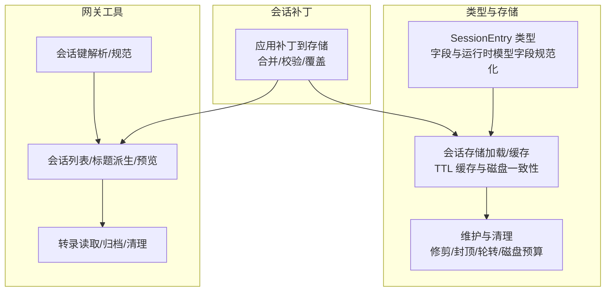
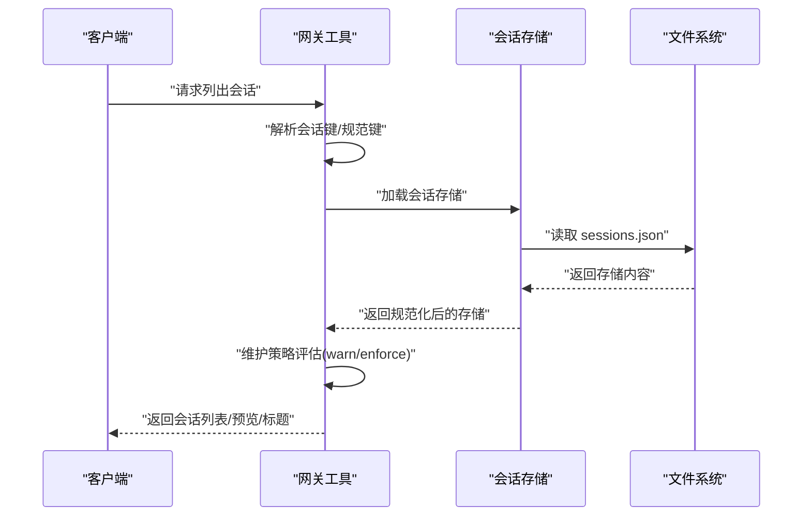
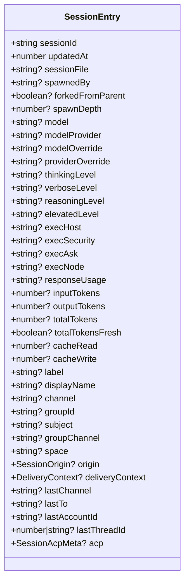
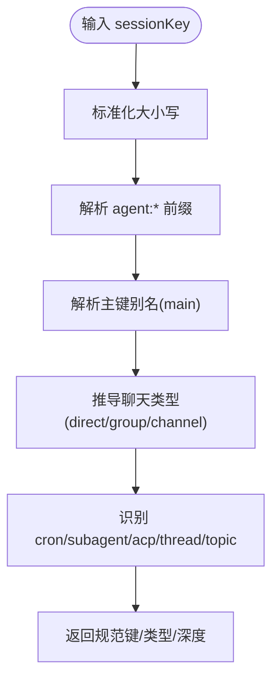
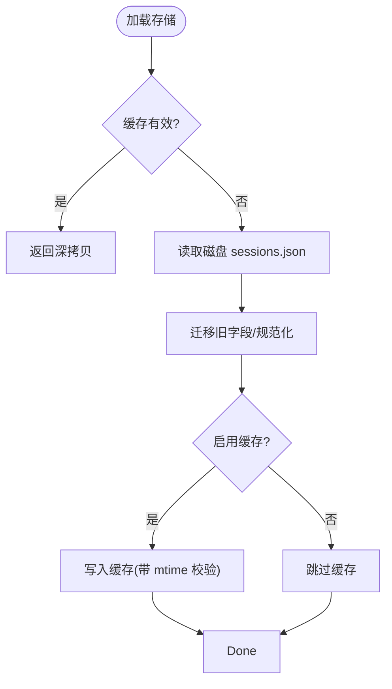
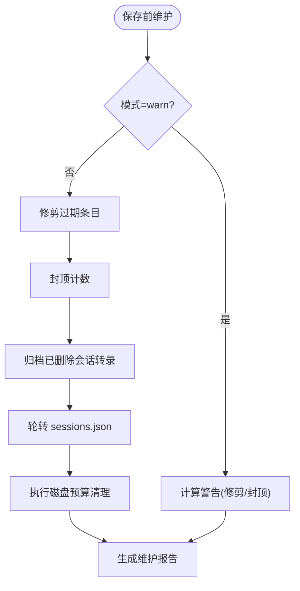
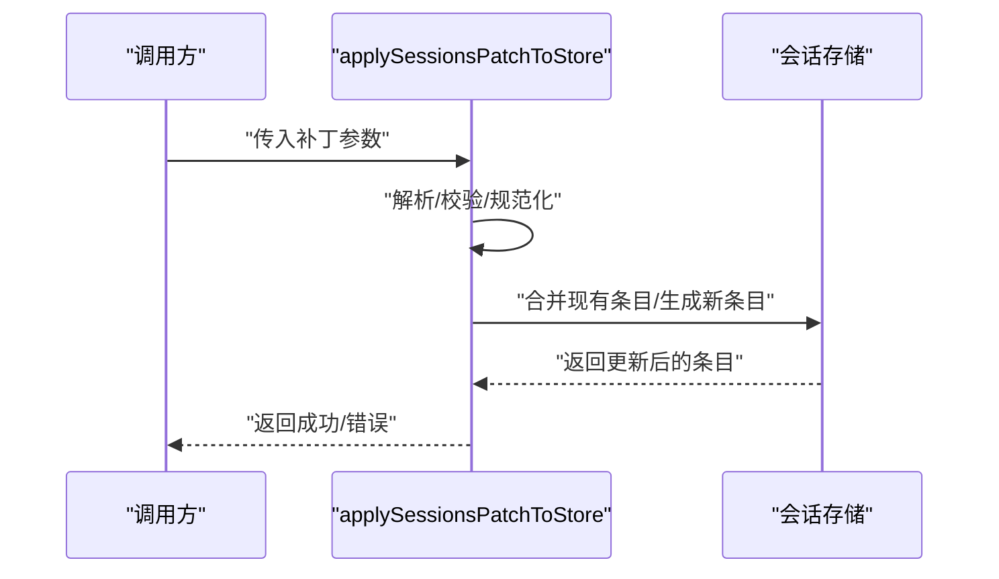
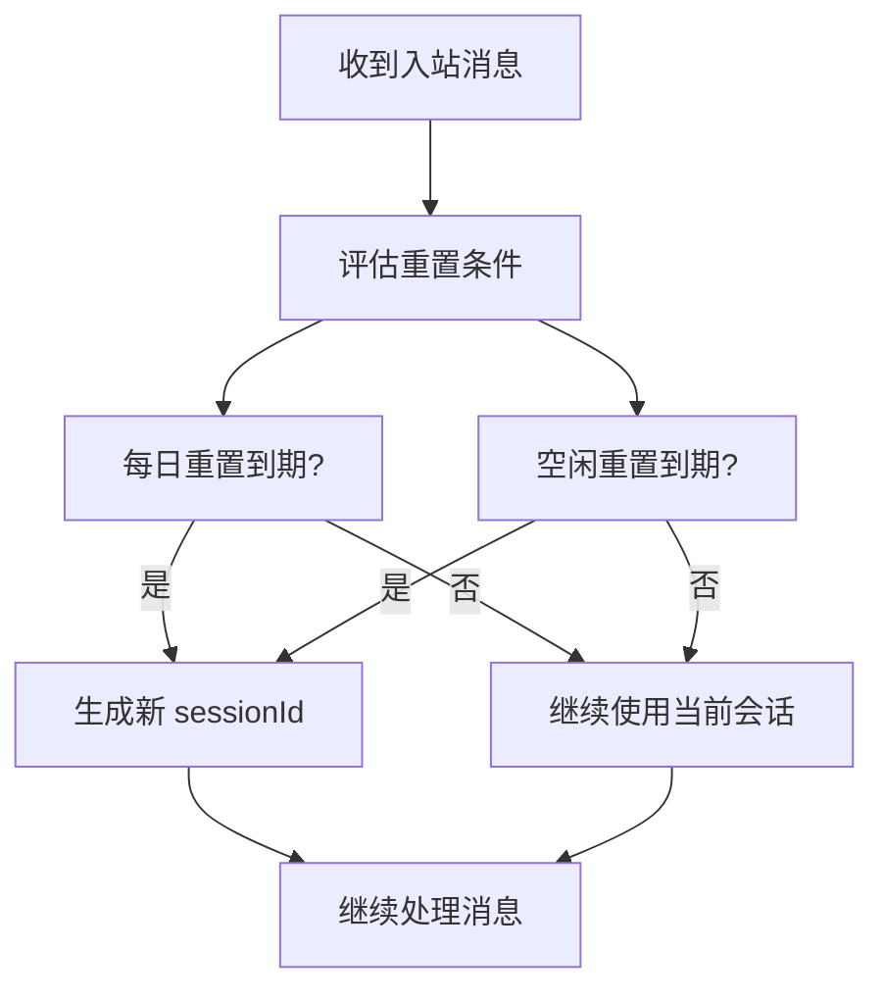
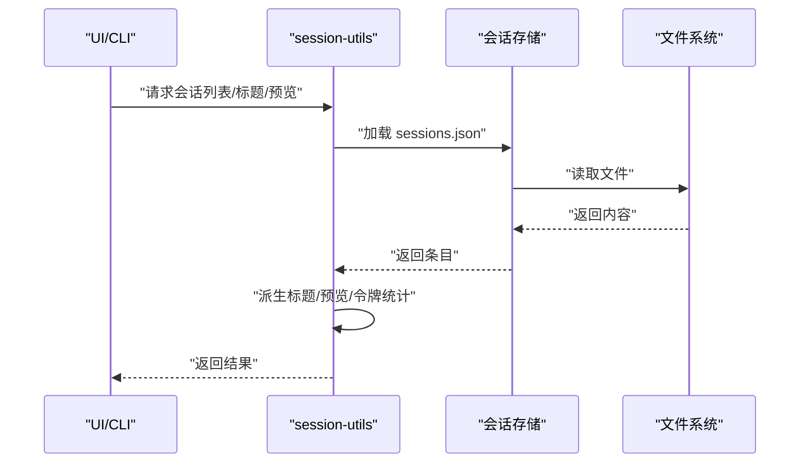
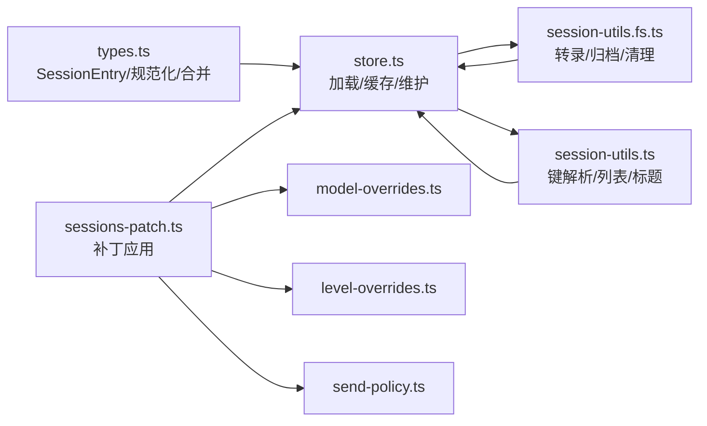

# 会话模型

<cite>
**本文引用的文件**
- [src/config/sessions/types.ts](file://src/config/sessions/types.ts)
- [src/config/sessions/store.ts](file://src/config/sessions/store.ts)
- [src/gateway/session-utils.ts](file://src/gateway/session-utils.ts)
- [src/gateway/sessions-patch.ts](file://src/gateway/sessions-patch.ts)
- [src/gateway/session-utils.fs.ts](file://src/gateway/session-utils.fs.ts)
- [src/sessions/session-key-utils.ts](file://src/sessions/session-key-utils.ts)
- [src/sessions/model-overrides.ts](file://src/sessions/model-overrides.ts)
- [src/sessions/level-overrides.ts](file://src/sessions/level-overrides.ts)
- [src/sessions/send-policy.ts](file://src/sessions/send-policy.ts)
- [docs/concepts/session.md](file://docs/concepts/session.md)
</cite>

## 目录

1. [简介](#简介)
2. [项目结构](#项目结构)
3. [核心组件](#核心组件)
4. [架构总览](#架构总览)
5. [详细组件分析](#详细组件分析)
6. [依赖关系分析](#依赖关系分析)
7. [性能考量](#性能考量)
8. [故障排查指南](#故障排查指南)
9. [结论](#结论)
10. [附录](#附录)

## 简介

本文件系统性阐述 OpenClaw 的会话模型，围绕 SessionEntry 会话条目、会话状态管理与生命周期、数据结构与状态转换、持久化与维护策略、缓存与内存管理、性能优化、清理与过期处理以及资源回收机制进行深入解析，并提供使用示例、状态查询方法与最佳实践。

## 项目结构

OpenClaw 将会话管理分为三层：

- 类型与存储：定义 SessionEntry 结构、会话键解析、存储读写与维护（含缓存）。
- 网关工具：提供会话列表、标题派生、预览、转录读取、归档与清理等能力。
- 会话补丁：对会话条目进行增量更新（如模型、思考层级、发送策略等），并保证一致性与时序。

**图表来源**

- [src/config/sessions/types.ts](file://src/config/sessions/types.ts#L68-L174)
- [src/config/sessions/store.ts](file://src/config/sessions/store.ts#L198-L284)
- [src/gateway/session-utils.ts](file://src/gateway/session-utils.ts#L178-L188)
- [src/gateway/session-utils.fs.ts](file://src/gateway/session-utils.fs.ts#L73-L118)
- [src/gateway/sessions-patch.ts](file://src/gateway/sessions-patch.ts#L65-L87)

**章节来源**

- [src/config/sessions/types.ts](file://src/config/sessions/types.ts#L1-L339)
- [src/config/sessions/store.ts](file://src/config/sessions/store.ts#L1-L800)
- [src/gateway/session-utils.ts](file://src/gateway/session-utils.ts#L1-L800)
- [src/gateway/session-utils.fs.ts](file://src/gateway/session-utils.fs.ts#L1-L744)
- [src/gateway/sessions-patch.ts](file://src/gateway/sessions-patch.ts#L1-L365)

## 核心组件

- SessionEntry：会话条目的核心数据结构，包含会话标识、时间戳、令牌统计、运行时模型、队列与执行策略、发送策略、来源元数据、交付上下文、ACP 元信息等。
- 会话存储（store）：负责会话存储文件的加载、缓存、规范化、维护与写入；支持 TTL 缓存、跨平台原子写入、维护模式（warn/enforce）。
- 网关工具：提供会话键解析、会话列表、标题派生、转录读取、归档与清理等能力。
- 会话补丁（patch）：对 SessionEntry 进行增量更新，确保字段合法性与一致性，支持模型选择、思考/推理/提升级别、执行策略、发送策略等。

**章节来源**

- [src/config/sessions/types.ts](file://src/config/sessions/types.ts#L68-L174)
- [src/config/sessions/store.ts](file://src/config/sessions/store.ts#L198-L284)
- [src/gateway/session-utils.ts](file://src/gateway/session-utils.ts#L178-L188)
- [src/gateway/sessions-patch.ts](file://src/gateway/sessions-patch.ts#L65-L87)

## 架构总览

下图展示从“请求会话状态”到“返回会话列表”的端到端流程，包括键解析、存储加载、维护策略与结果生成。

**图表来源**

- [src/gateway/session-utils.ts](file://src/gateway/session-utils.ts#L178-L188)
- [src/config/sessions/store.ts](file://src/config/sessions/store.ts#L198-L284)
- [src/gateway/session-utils.fs.ts](file://src/gateway/session-utils.fs.ts#L73-L118)

## 详细组件分析

### SessionEntry 数据结构与字段语义

- 基础字段：sessionId、updatedAt、sessionFile、spawnedBy、spawnDepth、forkedFromParent 等，用于标识会话、父子关系与分叉状态。
- 运行时模型：model、modelProvider、modelOverride、providerOverride、fallbackNotice\* 等，记录实际使用的模型与回退提示。
- 执行与显示：execHost、execSecurity、execAsk、execNode、responseUsage、ttsAuto 等，控制执行环境与输出展示。
- 思考与调试：thinkingLevel、verboseLevel、reasoningLevel、elevatedLevel 等，控制推理与输出细节。
- 队列与限流：queueMode、queueDebounceMs、queueCap、queueDrop 等，控制消息队列行为。
- 令牌统计：inputTokens、outputTokens、totalTokens、totalTokensFresh、cacheRead/write 等，用于上下文与缓存统计。
- 标签与元数据：label、displayName、channel、groupId、subject、groupChannel、space、origin、deliveryContext、last\* 等，用于 UI 展示与路由。
- ACP 元信息：acp 字段，记录 ACP 后端、运行模式、权限配置、工作目录、状态与活动时间等。
- 系统提示报告：systemPromptReport，记录系统提示生成来源、注入文件、工具描述等统计信息。

**图表来源**

- [src/config/sessions/types.ts](file://src/config/sessions/types.ts#L68-L174)

**章节来源**

- [src/config/sessions/types.ts](file://src/config/sessions/types.ts#L68-L174)

### 会话键解析与规范

- 支持 agent:\* 前缀的会话键解析，统一大小写与主键别名（如 main）。
- 派生聊天类型（direct/group/channel/unknown），识别 cron、subagent、acp、thread/topic 等特殊键形态。
- 提供“遗留键”扫描与清理能力，保证大小写不一致的键被合并与清理。

**图表来源**

- [src/gateway/session-utils.ts](file://src/gateway/session-utils.ts#L417-L452)
- [src/sessions/session-key-utils.ts](file://src/sessions/session-key-utils.ts#L12-L59)

**章节来源**

- [src/gateway/session-utils.ts](file://src/gateway/session-utils.ts#L417-L452)
- [src/sessions/session-key-utils.ts](file://src/sessions/session-key-utils.ts#L1-L133)

### 会话存储加载与缓存

- TTL 缓存：基于环境变量与默认 TTL（毫秒）决定缓存有效期；缓存命中时返回深拷贝以避免外部修改污染。
- 跨平台原子写入：Windows 使用临时文件 + 重命名策略，避免并发读取空文件或锁文件导致的数据竞争。
- 规范化：在加载时迁移旧字段（如 provider/lastProvider、room/groupChannel），并对运行时模型字段进行规范化。
- 维护策略：在保存前根据配置执行修剪（按时间）、封顶（按数量）、轮转（按大小）、磁盘预算清理与归档清理。

**图表来源**

- [src/config/sessions/store.ts](file://src/config/sessions/store.ts#L198-L284)
- [src/config/sessions/store.ts](file://src/config/sessions/store.ts#L642-L800)

**章节来源**

- [src/config/sessions/store.ts](file://src/config/sessions/store.ts#L198-L284)
- [src/config/sessions/store.ts](file://src/config/sessions/store.ts#L642-L800)

### 会话维护与清理

- 修剪（pruneStaleEntries）：删除 updatedAt 早于阈值的条目。
- 封顶（capEntryCount）：保留最近更新的 N 条，其余删除。
- 轮转（rotateSessionFile）：超过阈值大小时重命名为 .bak.<timestamp>，最多保留最近 3 个备份。
- 磁盘预算（enforceSessionDiskBudget）：在 warn 模式下仅报告，在 enforce 模式下执行清理。
- 归档与清理：对移除的会话归档其转录文件，按保留策略清理旧归档。

**图表来源**

- [src/config/sessions/store.ts](file://src/config/sessions/store.ts#L642-L769)
- [src/gateway/session-utils.fs.ts](file://src/gateway/session-utils.fs.ts#L187-L227)

**章节来源**

- [src/config/sessions/store.ts](file://src/config/sessions/store.ts#L455-L559)
- [src/config/sessions/store.ts](file://src/config/sessions/store.ts#L575-L627)
- [src/gateway/session-utils.fs.ts](file://src/gateway/session-utils.fs.ts#L187-L227)

### 会话补丁与状态变更

- 补丁应用：合并现有条目与新补丁，更新 updatedAt；支持设置/清除 spawnedBy/spawnDepth、标签、思考/推理/提升级别、verboseLevel、响应用量、执行主机/安全/询问策略、模型选择、发送策略、群组激活等。
- 校验与约束：对非法值返回错误；对子代理键限制某些字段；对 xhigh 思考级别进行能力校验。
- 模型覆盖：根据配置与模型目录解析允许的模型引用，支持默认/覆盖/清空。
- 会话标签：全局唯一性检查，防止冲突。

**图表来源**

- [src/gateway/sessions-patch.ts](file://src/gateway/sessions-patch.ts#L65-L365)
- [src/sessions/model-overrides.ts](file://src/sessions/model-overrides.ts#L9-L76)
- [src/sessions/level-overrides.ts](file://src/sessions/level-overrides.ts#L4-L32)
- [src/sessions/send-policy.ts](file://src/sessions/send-policy.ts#L53-L123)

**章节来源**

- [src/gateway/sessions-patch.ts](file://src/gateway/sessions-patch.ts#L65-L365)
- [src/sessions/model-overrides.ts](file://src/sessions/model-overrides.ts#L1-L77)
- [src/sessions/level-overrides.ts](file://src/sessions/level-overrides.ts#L1-L33)
- [src/sessions/send-policy.ts](file://src/sessions/send-policy.ts#L1-L124)

### 会话生命周期与过期策略

- 重置策略：会话在下一次入站消息时评估是否过期；支持每日重置（本地时间）与空闲重置（分钟），两者取先到期者。
- 类型与通道覆盖：可针对 direct/group/thread 与特定通道设置独立重置策略。
- 手动触发：/new 或 /reset 可启动全新会话 ID，并透传剩余消息。
- 孤立性：定时任务每次运行都会生成新的 sessionId，不复用空闲会话。

**图表来源**

- [docs/concepts/session.md](file://docs/concepts/session.md#L207-L217)

**章节来源**

- [docs/concepts/session.md](file://docs/concepts/session.md#L207-L217)

### 会话状态查询与使用示例

- 列出会话：通过网关工具读取存储并过滤（支持按 agentId、spawnedBy、label、搜索词、活跃窗口等）。
- 标题派生：优先使用 displayName/subject，其次取第一条用户消息摘要，最后回退到 sessionId 前缀。
- 预览与转录：读取最近消息、提取工具调用与媒体摘要，构建预览项集合。
- 发送策略：结合配置规则与会话级覆盖，决定允许/拒绝发送。

**图表来源**

- [src/gateway/session-utils.ts](file://src/gateway/session-utils.ts#L728-L800)
- [src/gateway/session-utils.fs.ts](file://src/gateway/session-utils.fs.ts#L73-L118)

**章节来源**

- [src/gateway/session-utils.ts](file://src/gateway/session-utils.ts#L728-L800)
- [src/gateway/session-utils.fs.ts](file://src/gateway/session-utils.fs.ts#L73-L118)

## 依赖关系分析

- SessionEntry 依赖运行时模型规范化函数与合并逻辑，确保字段一致性。
- 会话存储依赖配置解析、路径解析、磁盘预算与转录归档工具。
- 网关工具依赖会话存储、转录读取与键解析工具。
- 会话补丁依赖模型目录解析、级别覆盖与发送策略解析。

**图表来源**

- [src/config/sessions/types.ts](file://src/config/sessions/types.ts#L181-L256)
- [src/config/sessions/store.ts](file://src/config/sessions/store.ts#L1-L800)
- [src/gateway/session-utils.ts](file://src/gateway/session-utils.ts#L1-L800)
- [src/gateway/session-utils.fs.ts](file://src/gateway/session-utils.fs.ts#L1-L744)
- [src/gateway/sessions-patch.ts](file://src/gateway/sessions-patch.ts#L1-L365)
- [src/sessions/model-overrides.ts](file://src/sessions/model-overrides.ts#L1-L77)
- [src/sessions/level-overrides.ts](file://src/sessions/level-overrides.ts#L1-L33)
- [src/sessions/send-policy.ts](file://src/sessions/send-policy.ts#L1-L124)

**章节来源**

- [src/config/sessions/types.ts](file://src/config/sessions/types.ts#L181-L256)
- [src/config/sessions/store.ts](file://src/config/sessions/store.ts#L1-L800)
- [src/gateway/session-utils.ts](file://src/gateway/session-utils.ts#L1-L800)
- [src/gateway/session-utils.fs.ts](file://src/gateway/session-utils.fs.ts#L1-L744)
- [src/gateway/sessions-patch.ts](file://src/gateway/sessions-patch.ts#L1-L365)
- [src/sessions/model-overrides.ts](file://src/sessions/model-overrides.ts#L1-L77)
- [src/sessions/level-overrides.ts](file://src/sessions/level-overrides.ts#L1-L33)
- [src/sessions/send-policy.ts](file://src/sessions/send-policy.ts#L1-L124)

## 性能考量

- 缓存策略：启用 TTL 缓存可显著降低重复读取开销；缓存失效与 mtime 校验保障一致性。
- 写入路径成本：维护操作（修剪/封顶/轮转/预算）在写入路径执行，大存储会增加延迟；建议在生产使用 enforce 模式并合理设置 pruneAfter 与 maxEntries。
- 磁盘预算：启用 maxDiskBytes 与高水位线可限制增长，但需配合合理的 prune/cap 限制，避免过度扫描与删除。
- 转录读取：标题与预览采用分层读取与缓存，避免全量扫描；注意预览项数量与字符上限的折中。

[本节为通用指导，无需具体文件引用]

## 故障排查指南

- 会话存储为空或损坏：加载器在 Windows 上具备重试与短暂等待机制；若仍失败，检查文件是否存在与权限。
- 维护模式误判：warn 模式仅报告不会删除；若担心影响活跃会话，可先 dry-run 预览。
- 键大小写不一致：使用规范键与遗留键扫描功能，清理冗余变体。
- 发送策略异常：检查会话级覆盖与全局 sendPolicy 规则，确认匹配项与默认值。
- 模型覆盖无效：确认模型目录可用、模型引用合法，且未被默认覆盖清空。

**章节来源**

- [src/config/sessions/store.ts](file://src/config/sessions/store.ts#L215-L247)
- [src/config/sessions/store.ts](file://src/config/sessions/store.ts#L658-L694)
- [src/gateway/session-utils.ts](file://src/gateway/session-utils.ts#L237-L260)
- [src/sessions/send-policy.ts](file://src/sessions/send-policy.ts#L53-L123)
- [src/gateway/sessions-patch.ts](file://src/gateway/sessions-patch.ts#L289-L322)

## 结论

OpenClaw 的会话模型以 SessionEntry 为核心，结合严格的键解析、健壮的存储加载与维护策略、灵活的会话补丁机制，实现了高可靠、可扩展且易于运维的会话管理。通过 TTL 缓存、跨平台原子写入与磁盘预算控制，兼顾性能与稳定性；通过 warn/enforce 维护模式与归档清理，保障长期运行的可维护性。遵循本文最佳实践，可在多渠道、多代理场景下实现安全、可控、可观测的会话生命周期管理。

[本节为总结，无需具体文件引用]

## 附录

- 使用示例与最佳实践
  - 查询活跃会话：使用网关工具的会话列表接口，按 agentId/spawnedBy/label/search 过滤。
  - 设置发送策略：在会话补丁中设置 sendPolicy，或在配置中定义规则与默认值。
  - 调整模型：通过补丁应用模型覆盖，或在会话中设置模型别名/提供商组合。
  - 清理与维护：定期执行 sessions cleanup，建议生产使用 enforce 模式并设置 pruneAfter 与 maxEntries。
  - 安全隔离：在多用户/多账户场景下，使用 per-channel-peer/per-account-channel-peer 等隔离策略，并通过 identityLinks 合并同一人的跨渠道会话。

**章节来源**

- [docs/concepts/session.md](file://docs/concepts/session.md#L279-L294)
- [src/gateway/sessions-patch.ts](file://src/gateway/sessions-patch.ts#L336-L365)
- [src/sessions/send-policy.ts](file://src/sessions/send-policy.ts#L53-L123)
- [src/config/sessions/store.ts](file://src/config/sessions/store.ts#L658-L694)
