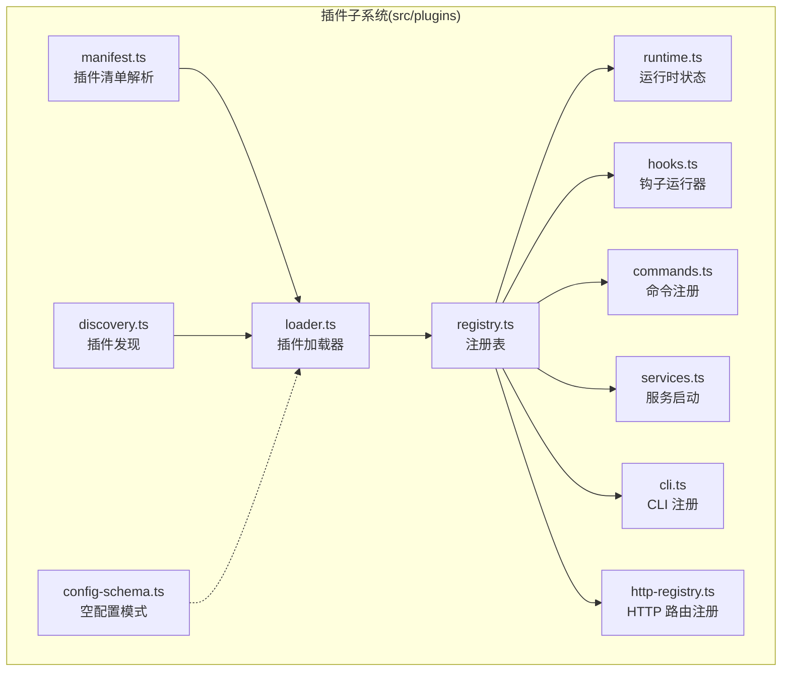
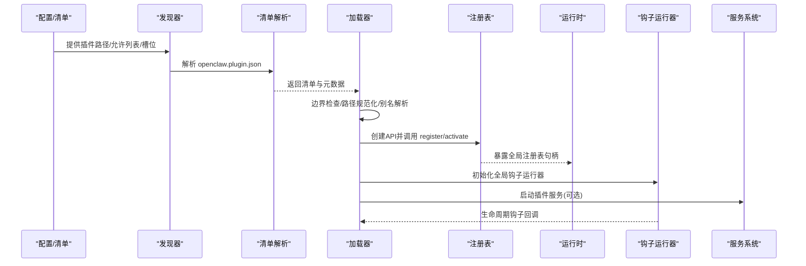
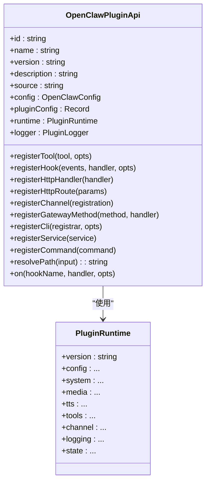
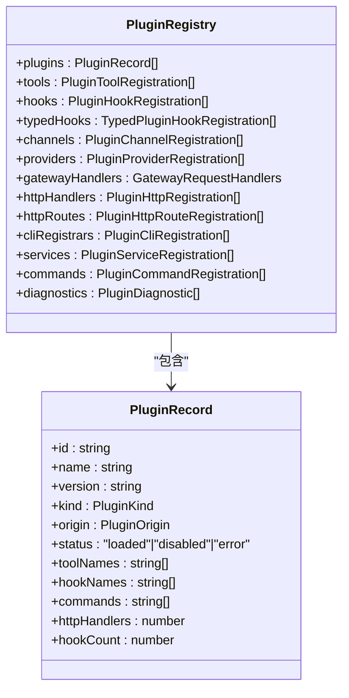
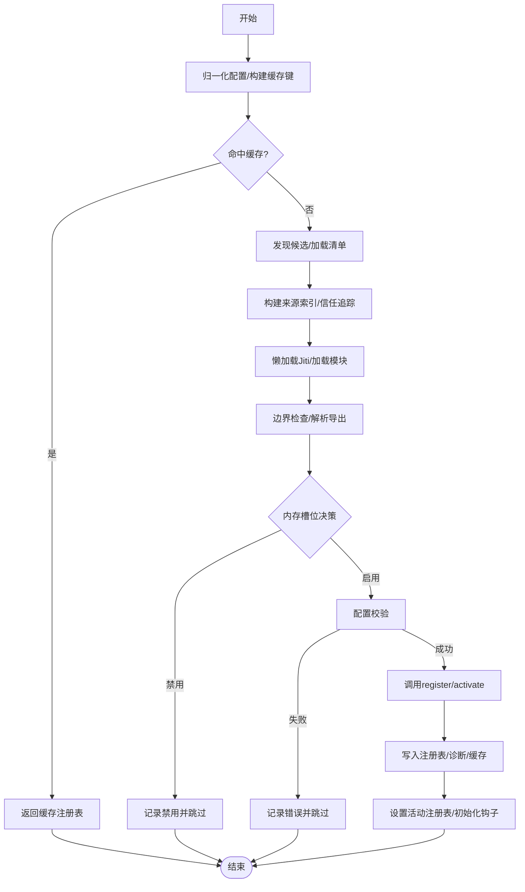
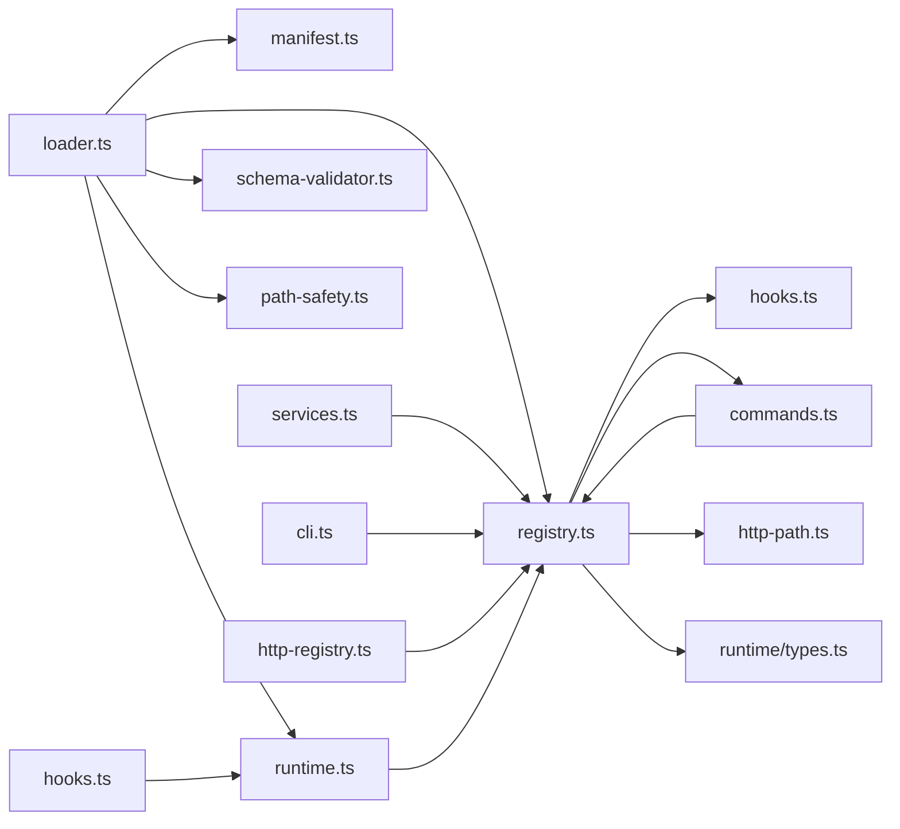

# 插件模型

<cite>
**本文引用的文件**
- [src/plugins/types.ts](file://src/plugins/types.ts)
- [src/plugins/registry.ts](file://src/plugins/registry.ts)
- [src/plugins/loader.ts](file://src/plugins/loader.ts)
- [src/plugins/manifest.ts](file://src/plugins/manifest.ts)
- [src/plugins/runtime.ts](file://src/plugins/runtime.ts)
- [src/plugins/runtime/types.ts](file://src/plugins/runtime/types.ts)
- [src/plugins/hooks.ts](file://src/plugins/hooks.ts)
- [src/plugins/commands.ts](file://src/plugins/commands.ts)
- [src/plugins/services.ts](file://src/plugins/services.ts)
- [src/plugins/cli.ts](file://src/plugins/cli.ts)
- [src/plugins/http-registry.ts](file://src/plugins/http-registry.ts)
- [src/plugins/config-schema.ts](file://src/plugins/config-schema.ts)
- [src/config/types.plugins.ts](file://src/config/types.plugins.ts)
- [SECURITY.md](file://SECURITY.md)
</cite>

## 目录

1. [引言](#引言)
2. [项目结构](#项目结构)
3. [核心组件](#核心组件)
4. [架构总览](#架构总览)
5. [详细组件分析](#详细组件分析)
6. [依赖关系分析](#依赖关系分析)
7. [性能考量](#性能考量)
8. [故障排查指南](#故障排查指南)
9. [结论](#结论)
10. [附录](#附录)

## 引言

本文件系统化阐述 OpenClaw 的插件模型：从 PluginEntry 插件条目、插件注册机制与生命周期管理，到插件接口定义、加载流程与依赖管理；并覆盖插件配置结构、元数据与版本控制，以及安全策略、沙箱与隔离机制。文末提供使用示例、开发规范与最佳实践，帮助开发者在保证安全与性能的前提下高效扩展 OpenClaw。

## 项目结构

OpenClaw 插件子系统位于 src/plugins 目录，围绕“清单解析 → 发现与验证 → 加载与注册 → 运行时服务与钩子执行”构建，形成清晰的分层与职责边界。

图示来源

- [src/plugins/manifest.ts](file://src/plugins/manifest.ts#L1-L167)
- [src/plugins/loader.ts](file://src/plugins/loader.ts#L1-L726)
- [src/plugins/registry.ts](file://src/plugins/registry.ts#L1-L520)
- [src/plugins/runtime.ts](file://src/plugins/runtime.ts#L1-L41)
- [src/plugins/hooks.ts](file://src/plugins/hooks.ts#L1-L754)
- [src/plugins/commands.ts](file://src/plugins/commands.ts#L1-L318)
- [src/plugins/services.ts](file://src/plugins/services.ts#L1-L76)
- [src/plugins/cli.ts](file://src/plugins/cli.ts#L1-L60)
- [src/plugins/http-registry.ts](file://src/plugins/http-registry.ts#L1-L54)
- [src/plugins/config-schema.ts](file://src/plugins/config-schema.ts#L1-L34)

章节来源

- [src/plugins/manifest.ts](file://src/plugins/manifest.ts#L1-L167)
- [src/plugins/loader.ts](file://src/plugins/loader.ts#L1-L726)
- [src/plugins/registry.ts](file://src/plugins/registry.ts#L1-L520)
- [src/plugins/runtime.ts](file://src/plugins/runtime.ts#L1-L41)

## 核心组件

- 插件接口与类型定义：统一的插件 API、钩子事件、工具、命令、HTTP/网关能力注册点，以及日志与路径解析等运行时能力。
- 注册表与记录：集中存储已加载插件的元信息、注册项（工具、钩子、通道、提供商、命令、服务、HTTP 路由）及诊断信息。
- 加载器：负责清单解析、路径边界检查、模块加载、配置校验、内存插件槽位决策、重复/冲突处理与缓存。
- 钩子运行器：按优先级顺序串行或并行执行插件生命周期钩子，提供错误捕获与结果合并策略。
- 命令系统：插件自定义命令注册、匹配、鉴权与执行，支持参数清洗与长度限制。
- 服务系统：插件服务的统一启动与停止生命周期管理。
- CLI/HTTP 注册：将插件注册的 CLI 子命令与 HTTP 路由注入到宿主系统。
- 运行时：全局插件注册表的激活与查询，以及插件可用的运行时能力集合。

章节来源

- [src/plugins/types.ts](file://src/plugins/types.ts#L230-L284)
- [src/plugins/registry.ts](file://src/plugins/registry.ts#L97-L138)
- [src/plugins/loader.ts](file://src/plugins/loader.ts#L368-L717)
- [src/plugins/hooks.ts](file://src/plugins/hooks.ts#L110-L751)
- [src/plugins/commands.ts](file://src/plugins/commands.ts#L108-L288)
- [src/plugins/services.ts](file://src/plugins/services.ts#L34-L75)
- [src/plugins/cli.ts](file://src/plugins/cli.ts#L11-L59)
- [src/plugins/http-registry.ts](file://src/plugins/http-registry.ts#L11-L53)
- [src/plugins/runtime.ts](file://src/plugins/runtime.ts#L23-L41)

## 架构总览

下图展示从“配置与清单”到“加载注册”，再到“运行时钩子与服务”的端到端流程。

图示来源

- [src/plugins/loader.ts](file://src/plugins/loader.ts#L368-L717)
- [src/plugins/manifest.ts](file://src/plugins/manifest.ts#L45-L115)
- [src/plugins/registry.ts](file://src/plugins/registry.ts#L472-L503)
- [src/plugins/hooks.ts](file://src/plugins/hooks.ts#L125-L128)
- [src/plugins/services.ts](file://src/plugins/services.ts#L34-L75)

## 详细组件分析

### 插件接口与类型定义（OpenClawPluginApi）

- 职责：向插件暴露受控能力，包括注册工具、钩子、命令、HTTP/路由、通道、提供商、网关方法、CLI、服务等；提供日志、路径解析与生命周期钩子注册。
- 关键点：
  - 注册工具：支持工厂函数与静态工具，可声明名称集合与可选性。
  - 生命周期钩子：on(hookName, handler, { priority? }) 支持优先级排序。
  - 网关与 HTTP：registerGatewayMethod、registerHttpHandler、registerHttpRoute。
  - 命令：registerCommand 定义无代理绕过型命令，支持鉴权与参数。
  - 通道/提供商：registerChannel/registerProvider 用于扩展消息通道与模型提供商生态。
  - 服务：registerService 以 id 启动/停止插件服务。
  - CLI：registerCli 将插件命令注入宿主 CLI。
  - 运行时：通过 runtime 字段提供系统命令、媒体、TTS、会话、路由、配对、活动记录、提及、反应、去抖、命令授权、各渠道能力等。

图示来源

- [src/plugins/types.ts](file://src/plugins/types.ts#L245-L284)
- [src/plugins/runtime/types.ts](file://src/plugins/runtime/types.ts#L188-L375)

章节来源

- [src/plugins/types.ts](file://src/plugins/types.ts#L230-L284)
- [src/plugins/runtime/types.ts](file://src/plugins/runtime/types.ts#L188-L375)

### 插件注册表与记录（PluginRegistry/PluginRecord）

- 职责：集中管理插件记录与各类注册项，维护诊断信息与状态。
- 关键点：
  - 记录字段：id/name/version/description/kind/origin/workspaceDir/status/error/toolNames/hookNames/commands/… 等。
  - 注册项：工具、钩子、通道、提供商、命令、服务、HTTP 处理器/路由、CLI 注册器。
  - 工具注册：支持工厂函数与静态工具，收集名称集合与可选标记。
  - 钩子注册：支持内部钩子系统集成与 typedHooks（带优先级）。
  - HTTP 注册：路径规范化与重复检测，避免冲突。
  - 提供商注册：ID 去重与冲突诊断。
  - CLI 注册：命令名去重与冲突提示。
  - 命令注册：基于命令系统进行合法性校验与重复检测。

图示来源

- [src/plugins/registry.ts](file://src/plugins/registry.ts#L124-L138)
- [src/plugins/registry.ts](file://src/plugins/registry.ts#L97-L122)

章节来源

- [src/plugins/registry.ts](file://src/plugins/registry.ts#L124-L138)
- [src/plugins/registry.ts](file://src/plugins/registry.ts#L97-L122)

### 插件加载流程（loadOpenClawPlugins）

- 流程要点：
  - 应用测试默认策略与配置归一化。
  - 构建缓存键并命中缓存则直接返回。
  - 清理旧命令注册，创建运行时与注册表。
  - 发现候选插件，加载清单，推送诊断。
  - 构建来源索引与信任追踪，警告未受控加载。
  - 懒加载 Jiti 别名（支持 openclaw/plugin-sdk），加载模块。
  - 边界检查（root 目录约束），解析导出（definition/register/activate）。
  - 内存插件槽位决策与禁用逻辑。
  - 配置校验（schema 校验），失败则记录错误。
  - 调用 register/activate 并注册到注册表，支持异步返回警告。
  - 缓存注册表并设置为活动注册表，初始化全局钩子运行器。

图示来源

- [src/plugins/loader.ts](file://src/plugins/loader.ts#L368-L717)

章节来源

- [src/plugins/loader.ts](file://src/plugins/loader.ts#L368-L717)

### 插件清单与元数据（openclaw.plugin.json）

- 职责：声明插件 id、配置 schema、可选 kind/name/description/version、UI 提示、通道/提供商/技能等元信息。
- 关键点：
  - 必填字段：id、configSchema。
  - 可选字段：kind/name/description/version/uiHints/channels/providers/skills。
  - 路径边界检查：确保清单文件在插件根目录内，防止逃逸。

章节来源

- [src/plugins/manifest.ts](file://src/plugins/manifest.ts#L45-L115)

### 插件配置结构与版本控制

- 配置结构：
  - 全局开关 enabled、白名单 allow、黑名单 deny、额外加载路径 load.paths、内存槽位 slots.memory、插件条目 entries、安装记录 installs。
  - 条目 entries[id] 包含 enabled/config。
- 版本控制：
  - 清单中 version 字段作为元数据；运行时记录在 PluginRecord.version 中。
  - 插件导出可包含 version 字段，最终以清单为准（导出与清单不一致将产生诊断告警）。

章节来源

- [src/config/types.plugins.ts](file://src/config/types.plugins.ts#L1-L30)
- [src/plugins/manifest.ts](file://src/plugins/manifest.ts#L11-L22)
- [src/plugins/loader.ts](file://src/plugins/loader.ts#L576-L597)

### 插件生命周期与钩子（Hook Runner）

- 生命周期钩子：before*model_resolve、before_prompt_build、before_agent_start、llm_input、llm_output、agent_end、before_compaction、after_compaction、before_reset、message*_、tool\__、before*message_write、session*_、subagent\__、gateway\_\*。
- 执行策略：
  - 并行钩子：message_received/sending/sent、llm_input/output、agent_end、session/start/end、subagent/\*、gateway/start/stop 等。
  - 串行钩子：before_model_resolve/before_prompt_build、message_sending、before_tool_call、tool_result_persist（热路径同步）、before_message_write（热路径同步）。
  - 结果合并：如 before*model_resolve/provider、before_prompt_build、subagent*\* 等，采用“先到先得”或合并策略。
- 错误处理：可选择捕获错误并记录，或抛出异常中断流程。

章节来源

- [src/plugins/hooks.ts](file://src/plugins/hooks.ts#L113-L751)
- [src/plugins/types.ts](file://src/plugins/types.ts#L299-L323)

### 插件命令系统（Plugin Commands）

- 职责：注册插件自定义命令，支持鉴权、参数清洗与长度限制，优先于内置命令与代理调用。
- 关键点：
  - 命令名规则：字母开头，仅含字母/数字/连字符/下划线；保留命令不可覆盖。
  - 匹配逻辑：区分是否接受参数；参数超过最大长度会被截断；移除控制字符。
  - 执行流程：鉴权检查、参数清洗、构造上下文、执行处理器、异常捕获与安全回退。

章节来源

- [src/plugins/commands.ts](file://src/plugins/commands.ts#L78-L288)

### 插件服务系统（Plugin Services）

- 职责：统一启动/停止插件服务，提供服务上下文（config/workspace/state/logger）。
- 行为：遍历注册表中的服务，依次启动；停止时逆序调用 stop，并忽略失败。

章节来源

- [src/plugins/services.ts](file://src/plugins/services.ts#L34-L75)

### 插件 CLI 注册（Plugin CLI）

- 职责：将插件注册的 CLI 子命令注入宿主 CLI，避免与已有命令冲突。
- 行为：加载插件注册表，遍历 cliRegistrars，检查重名后调用注册器。

章节来源

- [src/plugins/cli.ts](file://src/plugins/cli.ts#L11-L59)

### 插件 HTTP 路由注册（Plugin HTTP）

- 职责：注册插件 Webhook 路由，支持路径规范化与替换。
- 行为：标准化路径，若存在同路径则替换；返回注销函数以便清理。

章节来源

- [src/plugins/http-registry.ts](file://src/plugins/http-registry.ts#L11-L53)

### 插件运行时（Plugin Runtime）

- 职责：提供插件可用的运行时能力集合（系统命令、媒体、TTS、工具、通道、会话、路由、配对、活动、提及、反应、去抖、命令授权、各渠道能力等），并暴露全局注册表的激活/查询接口。
- 全局状态：通过 Symbol 保护的 registryState，支持 setActivePluginRegistry/getActivePluginRegistry/requireActivePluginRegistry/getActivePluginRegistryKey。

章节来源

- [src/plugins/runtime.ts](file://src/plugins/runtime.ts#L1-L41)
- [src/plugins/runtime/types.ts](file://src/plugins/runtime/types.ts#L188-L375)

### 插件安全策略与隔离

- 安全边界：
  - 插件被视为与本地代码同等信任级别，安装/启用即授予相同权限。
  - 审计需证明越过了可信边界（例如未认证的插件加载、白名单/策略绕过、沙箱/路径安全绕过），而非仅插件内恶意行为。
- 路径与边界：
  - 清单与入口文件均进行边界检查，防止逃逸。
  - 插件来源追踪：基于 load.paths 与安装记录，未受控加载将产生警告。
- 配置与策略：
  - plugins.allow 空时对非捆绑插件发出自动加载警告，建议显式列出可信插件 id。
  - 内存插件槽位：仅被选中的 memory 插件处于 loaded，其余 disabled 并记录原因。
- 沙箱与隔离：
  - 仓库未提供专用浏览器/进程沙箱实现；安全依赖于“信任边界”与“路径安全”策略。
  - 建议：在生产环境严格使用 plugins.allow 与安装记录，避免未受控路径加载。

章节来源

- [SECURITY.md](file://SECURITY.md#L100-L106)
- [src/plugins/loader.ts](file://src/plugins/loader.ts#L410-L419)
- [src/plugins/loader.ts](file://src/plugins/loader.ts#L698-L703)
- [src/plugins/manifest.ts](file://src/plugins/manifest.ts#L47-L61)

## 依赖关系分析

- 组件耦合：
  - loader 依赖 manifest、discovery、registry、runtime、schema-validator、path-safety 等。
  - registry 依赖 hooks/types、commands、http-path、runtime/types。
  - hooks 依赖 registry 与 types。
  - commands/services/cli/http-registry 依赖 registry。
  - runtime 为全局状态持有者，被其他模块查询/设置。
- 外部依赖：
  - jiti 用于插件模块加载与别名解析。
  - Node 内置 fs/path/url 与边界文件读取工具。

图示来源

- [src/plugins/loader.ts](file://src/plugins/loader.ts#L1-L31)
- [src/plugins/registry.ts](file://src/plugins/registry.ts#L1-L35)
- [src/plugins/hooks.ts](file://src/plugins/hooks.ts#L8-L52)
- [src/plugins/commands.ts](file://src/plugins/commands.ts#L8-L14)
- [src/plugins/http-registry.ts](file://src/plugins/http-registry.ts#L1-L4)
- [src/plugins/runtime.ts](file://src/plugins/runtime.ts#L1-L21)

章节来源

- [src/plugins/loader.ts](file://src/plugins/loader.ts#L1-L31)
- [src/plugins/registry.ts](file://src/plugins/registry.ts#L1-L35)

## 性能考量

- 加载缓存：基于工作区与插件配置生成缓存键，避免重复加载与解析。
- 并行执行：消息钩子、LLM 输入/输出、会话钩子等采用并行执行以提升吞吐。
- 串行与同步钩子：tool_result_persist 与 before_message_write 在热路径上保持串行与同步，确保一致性与安全性。
- 路由与命令：HTTP 路由与命令匹配采用快速前缀与映射，减少匹配开销。
- 资源释放：服务停止逆序执行，降低资源泄漏风险。

## 故障排查指南

- 常见问题与定位：
  - 插件未加载：检查清单是否存在、id 与 configSchema 是否满足要求；查看边界检查错误与路径规范化结果。
  - 注册阶段失败：register/activate 缺失或抛错，查看诊断信息与错误堆栈。
  - 配置校验失败：configSchema 不匹配，核对 entries[id].config 结构。
  - 内存插件未启用：确认 slots.memory 与插件 kind/memory 是否一致，以及是否被其他插件覆盖。
  - 未受控加载警告：plugins.allow 为空且存在非捆绑插件被发现，建议设置 allow 或添加安装记录。
  - 命令冲突：命令名重复或保留命令被占用，调整命令名或移除冲突插件。
  - HTTP 路由冲突：同路径重复注册，系统会替换旧路由，检查日志确认。
- 诊断与日志：
  - 使用 registry.diagnostics 获取加载期诊断。
  - 使用插件日志接口输出调试信息。
  - 钩子运行器可配置 catchErrors 控制错误传播。

章节来源

- [src/plugins/loader.ts](file://src/plugins/loader.ts#L187-L210)
- [src/plugins/loader.ts](file://src/plugins/loader.ts#L514-L526)
- [src/plugins/loader.ts](file://src/plugins/loader.ts#L651-L664)
- [src/plugins/loader.ts](file://src/plugins/loader.ts#L698-L703)
- [src/plugins/commands.ts](file://src/plugins/commands.ts#L129-L141)
- [src/plugins/http-registry.ts](file://src/plugins/http-registry.ts#L32-L37)

## 结论

OpenClaw 插件模型通过“清单驱动 + 边界安全 + 分层注册 + 生命周期钩子 + 命令与服务体系”实现了高扩展性与可控性。开发者可在严格的信任边界与路径安全策略下，利用统一的 API 与运行时能力快速扩展功能；同时，通过配置与诊断工具保障了部署与运维的可观测性与安全性。

## 附录

### 使用示例（步骤化）

- 新增插件清单：在插件根目录创建 openclaw.plugin.json，填写 id/configSchema 等必要字段。
- 实现插件导出：提供 register/activate 函数，使用 OpenClawPluginApi 注册工具、钩子、命令、HTTP/路由、通道、提供商、网关方法、CLI、服务。
- 配置启用：在配置中设置 plugins.enabled/plugins.allow/plugins.entries 等，必要时指定 slots.memory。
- 加载与验证：调用 loadOpenClawPlugins，观察诊断信息与注册表状态。
- 运行期调试：通过钩子运行器与插件日志定位问题。

章节来源

- [src/plugins/manifest.ts](file://src/plugins/manifest.ts#L45-L115)
- [src/plugins/types.ts](file://src/plugins/types.ts#L245-L284)
- [src/plugins/loader.ts](file://src/plugins/loader.ts#L368-L717)
- [src/config/types.plugins.ts](file://src/config/types.plugins.ts#L18-L29)

### 开发规范

- 清单与导出：
  - 清单必须包含 id 与 configSchema；可选 name/description/version/uiHints。
  - 导出应提供 register/activate；若导出对象与清单 id/kind 不一致，会产生诊断告警。
- 配置：
  - 使用 configSchema 严格约束 entries[id].config；空配置可用空配置模式。
- 安全：
  - 避免在插件中执行不受控命令或访问敏感路径；遵循信任边界原则。
  - 使用 resolvePath 规范化路径，避免相对路径逃逸。
- 命令与钩子：
  - 命令名遵守规则且不与保留命令冲突；参数长度受限并进行清洗。
  - 钩子优先级合理设置；热路径钩子保持串行与同步。
- 服务与 CLI：
  - 服务提供明确的 start/stop；CLI 注册避免与宿主命令冲突。

章节来源

- [src/plugins/manifest.ts](file://src/plugins/manifest.ts#L77-L97)
- [src/plugins/config-schema.ts](file://src/plugins/config-schema.ts#L13-L33)
- [src/plugins/commands.ts](file://src/plugins/commands.ts#L78-L97)
- [src/plugins/hooks.ts](file://src/plugins/hooks.ts#L113-L120)
- [src/plugins/services.ts](file://src/plugins/services.ts#L34-L59)
- [src/plugins/cli.ts](file://src/plugins/cli.ts#L26-L38)

### 最佳实践

- 生产环境：
  - 显式设置 plugins.allow，仅允许受信插件 id。
  - 使用安装记录跟踪插件来源，避免未受控路径加载。
  - 对内存插件使用 slots.memory 明确唯一启用实例。
- 开发与测试：
  - 使用 validateOnly 模式仅验证配置与清单，不实际加载。
  - 利用缓存加速多次加载，避免重复解析。
- 可观测性：
  - 关注 registry.diagnostics 与钩子运行器日志，及时发现异常。
  - 对关键钩子与命令增加细粒度日志，便于排障。

章节来源

- [src/plugins/loader.ts](file://src/plugins/loader.ts#L373-L374)
- [src/plugins/loader.ts](file://src/plugins/loader.ts#L410-L419)
- [src/plugins/loader.ts](file://src/plugins/loader.ts#L698-L703)
- [src/plugins/hooks.ts](file://src/plugins/hooks.ts#L175-L188)
