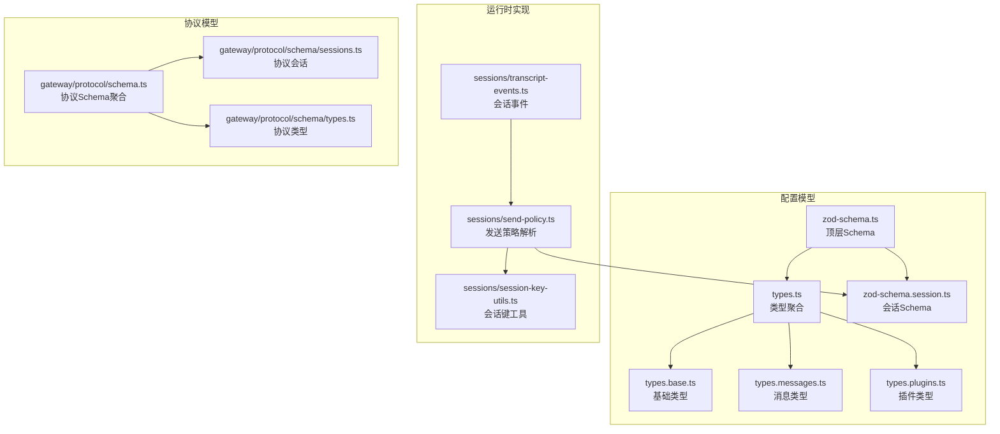
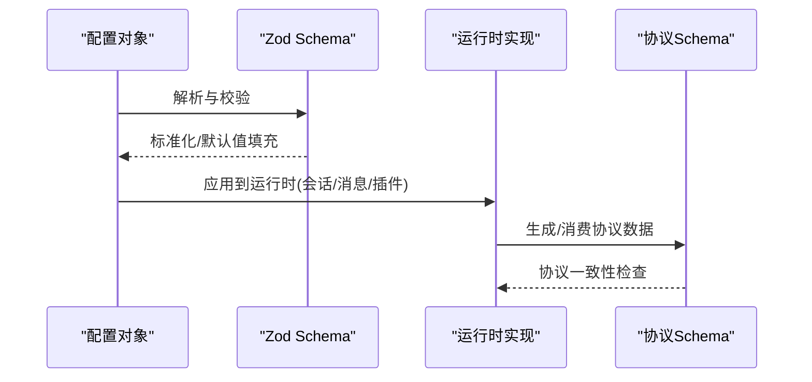
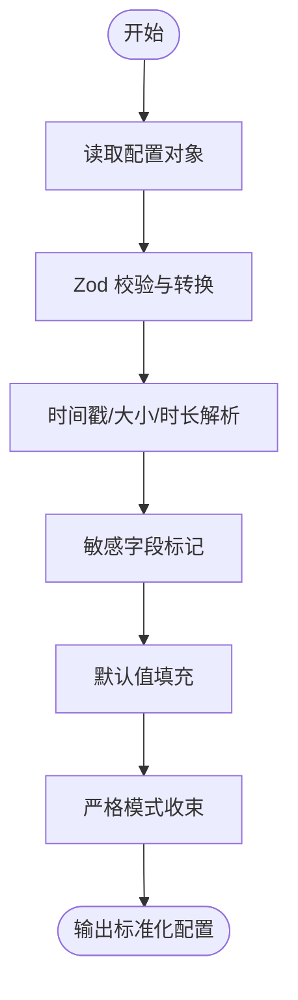
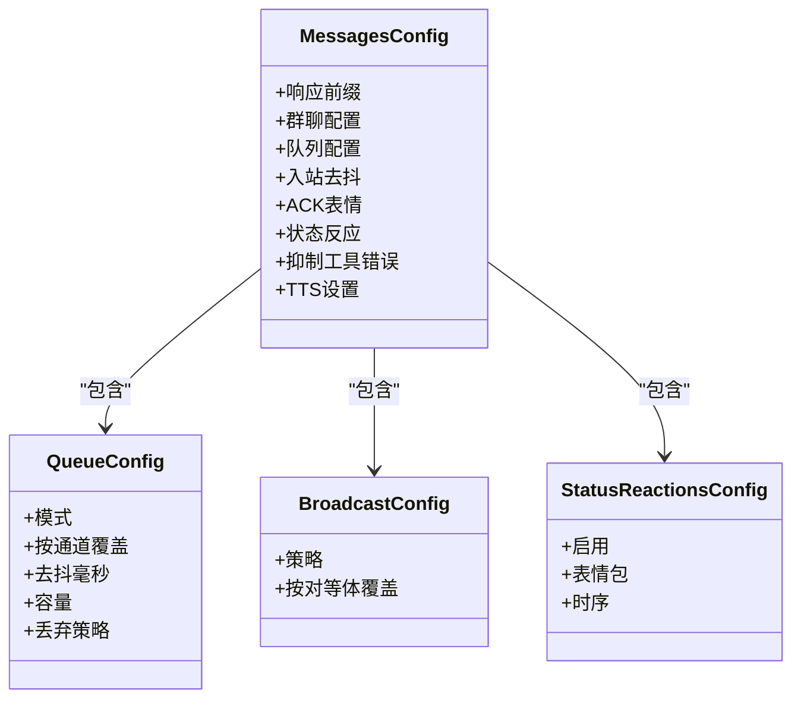
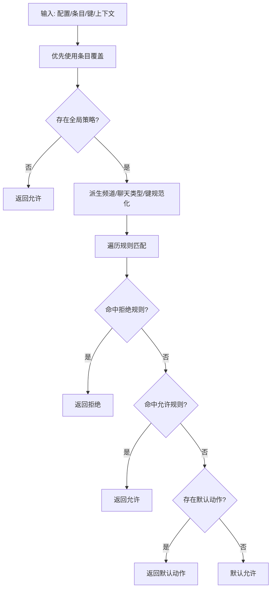
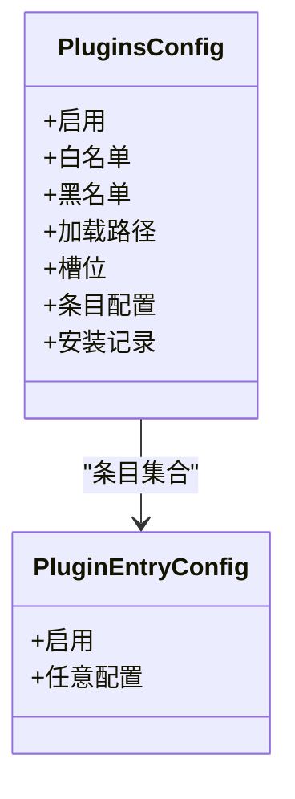
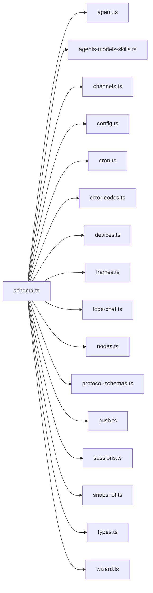
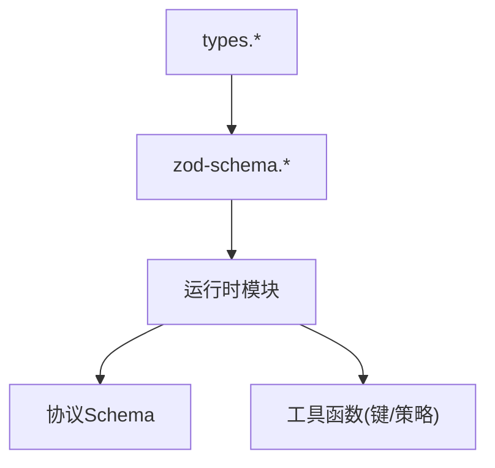

# 数据模型

<cite>
**本文引用的文件**
- [src/config/types.ts](file://src/config/types.ts)
- [src/config/types.base.ts](file://src/config/types.base.ts)
- [src/config/types.messages.ts](file://src/config/types.messages.ts)
- [src/config/types.plugins.ts](file://src/config/types.plugins.ts)
- [src/config/zod-schema.ts](file://src/config/zod-schema.ts)
- [src/config/zod-schema.session.ts](file://src/config/zod-schema.session.ts)
- [src/sessions/send-policy.ts](file://src/sessions/send-policy.ts)
- [src/sessions/session-key-utils.ts](file://src/sessions/session-key-utils.ts)
- [src/sessions/transcript-events.ts](file://src/sessions/transcript-events.ts)
- [src/gateway/protocol/schema.ts](file://src/gateway/protocol/schema.ts)
- [src/gateway/protocol/schema/sessions.ts](file://src/gateway/protocol/schema/sessions.ts)
- [src/gateway/protocol/schema/types.ts](file://src/gateway/protocol/schema/types.ts)
- [src/config/schema.help.quality.test.ts](file://src/config/schema.help.quality.test.ts)
- [src/config/zod-schema.typing-mode.test.ts](file://src/config/zod-schema.typing-mode.test.ts)
</cite>

## 目录

1. [引言](#引言)
2. [项目结构](#项目结构)
3. [核心组件](#核心组件)
4. [架构总览](#架构总览)
5. [详细组件分析](#详细组件分析)
6. [依赖分析](#依赖分析)
7. [性能考量](#性能考量)
8. [故障排查指南](#故障排查指南)
9. [结论](#结论)
10. [附录](#附录)

## 引言

本文件系统化梳理 OpenClaw 的数据模型，覆盖配置模型、消息模型、会话模型与插件模型的结构与关系；解释数据验证规则、序列化机制与版本兼容策略；阐述 TypeBox/Zod 类型系统与 Schema 定义；并给出数据模型演进历史、迁移策略与最佳实践。

## 项目结构

OpenClaw 将数据模型按“功能域+分层”组织：类型定义集中在 types._ 文件中，校验逻辑集中在 zod-schema._ 中，运行时行为在 sessions/_ 与 gateway/protocol/schema/_ 中体现。核心模块包括：

- 配置模型：集中于 config 目录，导出 types._ 与 zod-schema._
- 消息模型：消息队列、去抖、前缀、状态反应等
- 会话模型：会话作用域、重置策略、维护策略、发送策略
- 插件模型：插件启用、白名单/黑名单、槽位、安装记录
- 协议模型：网关协议中的会话、类型、错误码等

**图表来源**

- [src/config/types.ts](file://src/config/types.ts#L1-L35)
- [src/config/types.base.ts](file://src/config/types.base.ts#L1-L237)
- [src/config/types.messages.ts](file://src/config/types.messages.ts#L1-L177)
- [src/config/types.plugins.ts](file://src/config/types.plugins.ts#L1-L31)
- [src/config/zod-schema.ts](file://src/config/zod-schema.ts#L1-L814)
- [src/config/zod-schema.session.ts](file://src/config/zod-schema.session.ts#L1-L213)
- [src/sessions/send-policy.ts](file://src/sessions/send-policy.ts#L1-L124)
- [src/sessions/session-key-utils.ts](file://src/sessions/session-key-utils.ts#L1-L133)
- [src/sessions/transcript-events.ts](file://src/sessions/transcript-events.ts#L1-L26)
- [src/gateway/protocol/schema.ts](file://src/gateway/protocol/schema.ts#L1-L17)
- [src/gateway/protocol/schema/sessions.ts](file://src/gateway/protocol/schema/sessions.ts)
- [src/gateway/protocol/schema/types.ts](file://src/gateway/protocol/schema/types.ts)

**章节来源**

- [src/config/types.ts](file://src/config/types.ts#L1-L35)
- [src/config/zod-schema.ts](file://src/config/zod-schema.ts#L1-L814)

## 核心组件

- 基础类型与通用配置
  - 会话作用域、打字模式、会话重置策略、线程绑定、日志与诊断、Web 配置等
- 消息模型
  - 群聊/私聊历史限制、队列模式与丢弃策略、入站去抖、广播策略、状态反应、TTS 设置
- 会话模型
  - 会话作用域、DM 作用域、重置触发器、空闲重置、按类型/通道重置、维护策略（裁剪、轮转、磁盘配额）
- 插件模型
  - 启用开关、白名单/黑名单、额外加载路径、槽位选择、条目配置、安装记录
- 协议模型
  - 网关协议中的会话、类型、设备、帧、快照、错误码等

**章节来源**

- [src/config/types.base.ts](file://src/config/types.base.ts#L1-L237)
- [src/config/types.messages.ts](file://src/config/types.messages.ts#L1-L177)
- [src/config/types.plugins.ts](file://src/config/types.plugins.ts#L1-L31)
- [src/gateway/protocol/schema.ts](file://src/gateway/protocol/schema.ts#L1-L17)

## 架构总览

下图展示配置模型、运行时实现与协议模型之间的交互关系，以及 Schema 对数据约束的作用。

**图表来源**

- [src/config/zod-schema.ts](file://src/config/zod-schema.ts#L131-L782)
- [src/config/zod-schema.session.ts](file://src/config/zod-schema.session.ts#L26-L144)
- [src/sessions/send-policy.ts](file://src/sessions/send-policy.ts#L53-L123)
- [src/gateway/protocol/schema.ts](file://src/gateway/protocol/schema.ts#L1-L17)

## 详细组件分析

### 配置模型（TypeBox/Zod）

- 聚合入口
  - types.ts 导出各领域类型，便于按需引入
- 顶层 Schema 结构
  - 包含 meta/env/wizard/diagnostics/logging/update/browser/ui/secrets/auth/acp/models/nodeHost/agents/tools/bindings/broadcast/audio/media/messages/commands/approvals/session/cron/hooks/web/channels/discovery/canvasHost/talk/gateway/memory/skills/plugins 等段落
  - 使用严格模式与 catchall，确保未知字段可被保留或拒绝
- 校验与转换
  - 时间戳自动从数字转 ISO 字符串
  - 大小/时长字符串通过解析器进行单位校验与转换
  - 敏感字段使用注册标记进行脱敏处理
- 典型约束
  - 枚举值限定（如日志级别、更新通道、会话作用域）
  - 数值范围校验（正整数、非负数、0-1 小数）
  - URL 协议限定（http/https）

**图表来源**

- [src/config/zod-schema.ts](file://src/config/zod-schema.ts#L131-L782)

**章节来源**

- [src/config/types.ts](file://src/config/types.ts#L1-L35)
- [src/config/zod-schema.ts](file://src/config/zod-schema.ts#L1-L814)

### 消息模型

- 组/群聊配置：提及模式、历史限制
- 队列配置：全局/按通道模式、去抖、容量、丢弃策略
- 广播策略：全局策略与按对等体覆盖
- 入站去抖：全局与按通道覆盖
- 状态反应：启用开关、表情包、时序参数
- 响应前缀：模板变量支持（模型名、提供商、思考等级、身份名等）
- TTS 设置：文本转语音参数
- 命令授权：原生命令注册、所有者显示方式与密钥

**图表来源**

- [src/config/types.messages.ts](file://src/config/types.messages.ts#L1-L177)

**章节来源**

- [src/config/types.messages.ts](file://src/config/types.messages.ts#L1-L177)

### 会话模型

- 会话作用域与 DM 作用域
- 重置策略：按日/空闲、每日边界小时、空闲分钟、按类型/通道覆盖
- 维护策略：裁剪窗口、最大条目、轮转阈值、归档保留、磁盘配额与高水位
- 发送策略：允许/拒绝规则与匹配项（频道、聊天类型、键前缀、原始键前缀）
- 线程绑定：启用、空闲小时、最大年龄小时
- 代理间交互：最大往返轮次
- 关键工具函数
  - 会话键解析与聊天类型推断
  - 发送策略决策流程（条目覆盖 -> 全局策略 -> 规则匹配 -> 默认动作）

**图表来源**

- [src/sessions/send-policy.ts](file://src/sessions/send-policy.ts#L53-L123)

**章节来源**

- [src/config/types.base.ts](file://src/config/types.base.ts#L105-L166)
- [src/config/zod-schema.session.ts](file://src/config/zod-schema.session.ts#L26-L144)
- [src/sessions/send-policy.ts](file://src/sessions/send-policy.ts#L1-L124)
- [src/sessions/session-key-utils.ts](file://src/sessions/session-key-utils.ts#L1-L133)

### 插件模型

- 插件启用/禁用、白名单/黑名单
- 额外加载路径
- 槽位选择（如内存插件）
- 条目配置（启用、任意配置对象）
- 安装记录（来自安装记录基形）

**图表来源**

- [src/config/types.plugins.ts](file://src/config/types.plugins.ts#L1-L31)

**章节来源**

- [src/config/types.plugins.ts](file://src/config/types.plugins.ts#L1-L31)

### 协议模型

- 协议 Schema 聚合导出，涵盖 agent、agents-models-skills、channels、config、cron、error-codes、devices、frames、logs-chat、nodes、protocol-schemas、push、sessions、snapshot、types、wizard
- 网关协议中的会话、类型、错误码等，用于跨进程/远程通信的一致性保障

**图表来源**

- [src/gateway/protocol/schema.ts](file://src/gateway/protocol/schema.ts#L1-L17)

**章节来源**

- [src/gateway/protocol/schema.ts](file://src/gateway/protocol/schema.ts#L1-L17)

## 依赖分析

- 类型与实现解耦：types._ 提供纯类型，zod-schema._ 提供运行时校验与默认值，运行时模块仅依赖已校验的配置对象
- 会话策略依赖：发送策略解析依赖会话键工具与聊天类型推断
- 协议一致性：网关协议 Schema 作为契约，确保跨模块数据交换稳定

**图表来源**

- [src/config/types.ts](file://src/config/types.ts#L1-L35)
- [src/config/zod-schema.ts](file://src/config/zod-schema.ts#L1-L814)
- [src/sessions/send-policy.ts](file://src/sessions/send-policy.ts#L1-L124)
- [src/sessions/session-key-utils.ts](file://src/sessions/session-key-utils.ts#L1-L133)
- [src/gateway/protocol/schema.ts](file://src/gateway/protocol/schema.ts#L1-L17)

**章节来源**

- [src/config/zod-schema.ts](file://src/config/zod-schema.ts#L1-L814)
- [src/sessions/send-policy.ts](file://src/sessions/send-policy.ts#L1-L124)

## 性能考量

- 会话维护策略
  - pruneAfter/rotateBytes/maxEntries 控制存储规模，避免无限增长
  - maxDiskBytes/highWaterBytes 限制磁盘占用，防止 IO 压力
- 队列与去抖
  - 合理设置去抖与容量，降低瞬时峰值
- 日志与诊断
  - 控制日志级别与文件大小，避免 I/O 抖动
- 广播策略
  - 并行/串行策略影响吞吐与资源占用，按场景选择

[本节为通用指导，无需特定文件来源]

## 故障排查指南

- 校验失败
  - 检查枚举/数值范围/单位格式（时长/大小），确认默认值是否满足预期
- 发送策略异常
  - 核对会话键前缀、频道/聊天类型匹配、规则顺序与默认动作
- 会话维护问题
  - 检查 pruneAfter/rotateBytes/resetArchiveRetention/maxDiskBytes 配置是否合法
- 协议不一致
  - 对照协议 Schema，确保双方版本兼容

**章节来源**

- [src/config/zod-schema.session.ts](file://src/config/zod-schema.session.ts#L85-L141)
- [src/sessions/send-policy.ts](file://src/sessions/send-policy.ts#L53-L123)

## 结论

OpenClaw 的数据模型以清晰的类型与严格的 Schema 为基础，结合运行时工具函数与协议契约，实现了配置驱动、可演进且可维护的数据层。通过合理的默认值、强约束与可观测性，系统在复杂多渠道场景下保持了稳定性与扩展性。

[本节为总结，无需特定文件来源]

## 附录

### 数据验证规则与序列化机制

- 类型系统
  - 使用 Zod 进行运行时校验与转换，提供严格模式与默认值填充
- 序列化
  - 配置对象经 Schema 解析后，作为只读输入传递给运行时模块
- 版本兼容
  - 顶层 Schema 支持未知字段保留/拒绝，配合元信息字段实现向后兼容

**章节来源**

- [src/config/zod-schema.ts](file://src/config/zod-schema.ts#L131-L782)

### TypeBox 类型系统与 Schema 定义

- 当前代码库主要采用 Zod；TypeBox 在仓库中未直接出现
- 若未来引入 TypeBox，建议与现有 Zod Schema 保持契约一致，并统一命名与默认值策略

[本节为概念性说明，无需特定文件来源]

### 数据模型演进历史与迁移策略

- 元信息字段
  - lastTouchedVersion/lastTouchedAt 记录最后修改版本与时点，便于迁移脚本识别
- 迁移策略
  - 建议基于版本号增量迁移，先解析再写回，失败回滚
  - 对于废弃字段，保留读取但不再写入，逐步清理
- 向后兼容性
  - 严格模式与 catchall 并存，未知字段可被保留或拒绝，避免破坏性变更

**章节来源**

- [src/config/zod-schema.ts](file://src/config/zod-schema.ts#L134-L153)

### 最佳实践与常见陷阱

- 最佳实践
  - 明确区分类型定义与运行时校验，保持类型纯净
  - 为关键配置提供合理默认值，减少用户配置负担
  - 使用枚举与范围约束，避免无效值进入运行时
  - 对敏感字段统一脱敏处理
- 常见陷阱
  - 忽视单位格式（时长/大小）导致解析失败
  - 规则匹配顺序不当导致策略误判
  - 会话键前缀不规范导致匹配失败
  - 未设置维护策略导致存储膨胀

**章节来源**

- [src/config/zod-schema.ts](file://src/config/zod-schema.ts#L85-L141)
- [src/config/zod-schema.typing-mode.test.ts](file://src/config/zod-schema.typing-mode.test.ts#L1-L15)
- [src/config/schema.help.quality.test.ts](file://src/config/schema.help.quality.test.ts#L1-L37)
