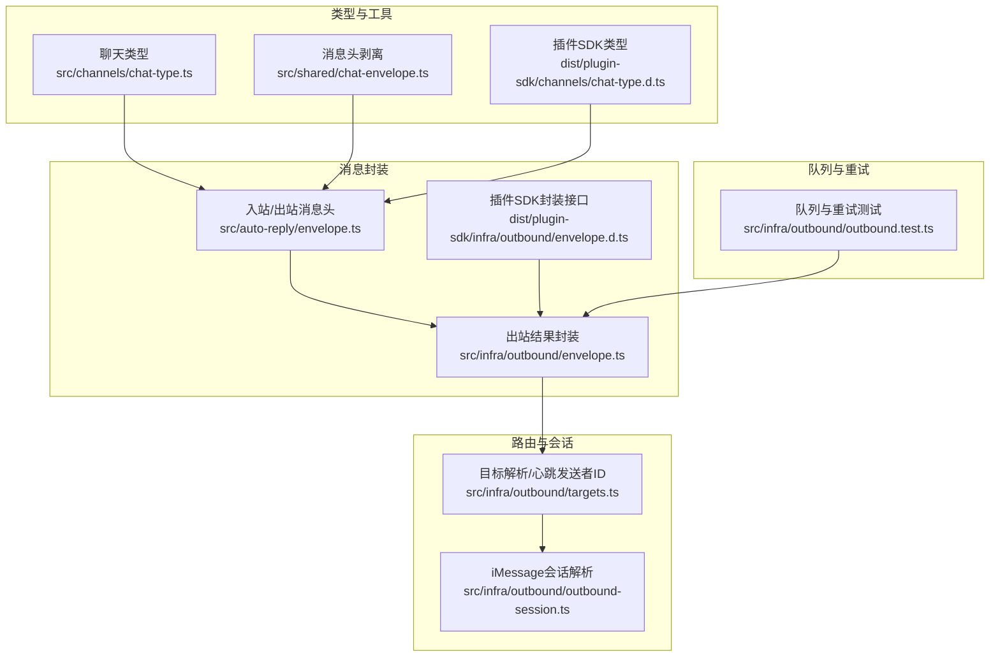
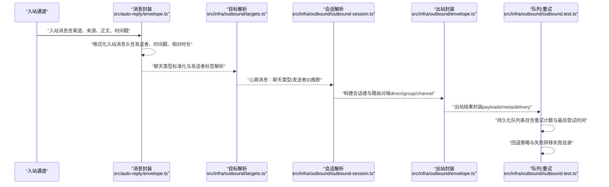
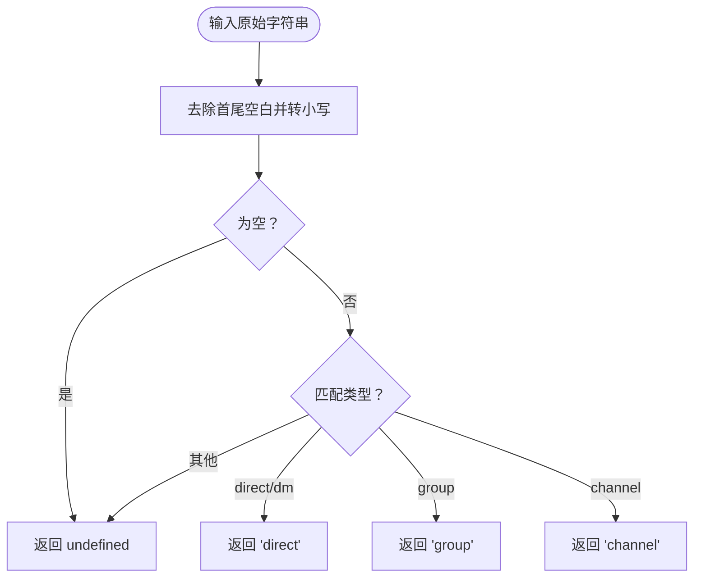
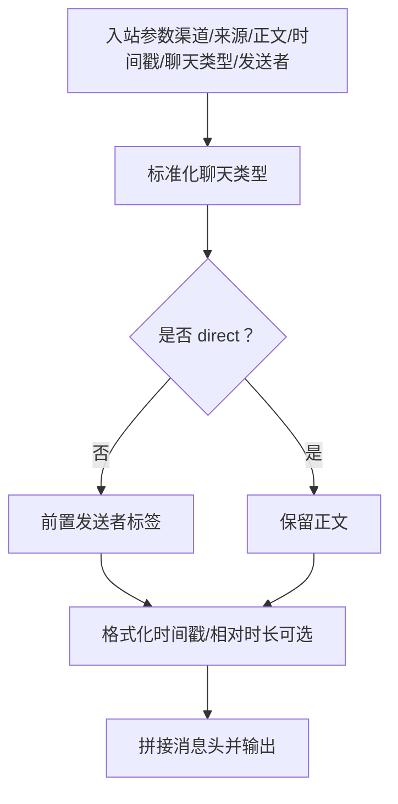
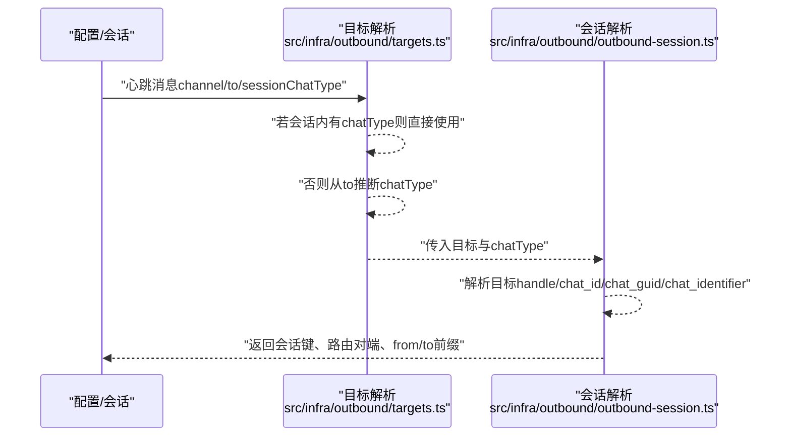
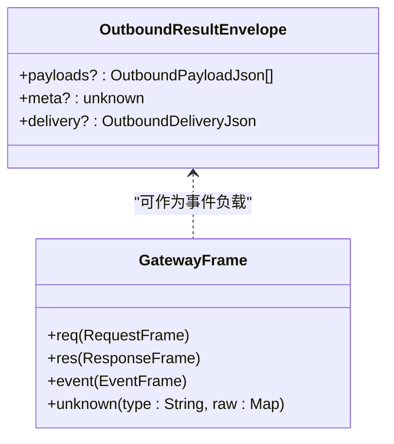
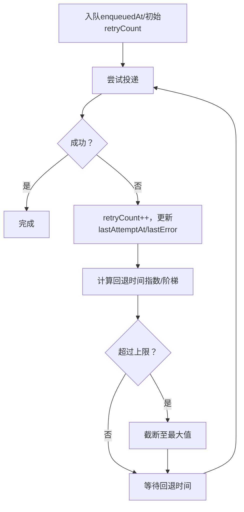

# 消息模型

<cite>
**本文引用的文件**
- [src/channels/chat-type.ts](file://src/channels/chat-type.ts)
- [src/auto-reply/envelope.ts](file://src/auto-reply/envelope.ts)
- [src/shared/chat-envelope.ts](file://src/shared/chat-envelope.ts)
- [src/infra/outbound/envelope.ts](file://src/infra/outbound/envelope.ts)
- [src/infra/outbound/targets.ts](file://src/infra/outbound/targets.ts)
- [src/infra/outbound/outbound-session.ts](file://src/infra/outbound/outbound-session.ts)
- [src/infra/outbound/outbound.test.ts](file://src/infra/outbound/outbound.test.ts)
- [dist/plugin-sdk/channels/chat-type.d.ts](file://dist/plugin-sdk/channels/chat-type.d.ts)
- [dist/plugin-sdk/shared/chat-envelope.d.ts](file://dist/plugin-sdk/shared/chat-envelope.d.ts)
- [dist/plugin-sdk/infra/outbound/envelope.d.ts](file://dist/plugin-sdk/infra/outbound/envelope.d.ts)
</cite>

## 目录

1. [引言](#引言)
2. [项目结构](#项目结构)
3. [核心组件](#核心组件)
4. [架构总览](#架构总览)
5. [详细组件分析](#详细组件分析)
6. [依赖关系分析](#依赖关系分析)
7. [性能考量](#性能考量)
8. [故障排查指南](#故障排查指南)
9. [结论](#结论)
10. [附录](#附录)

## 引言

本文件系统性阐述 OpenClaw 的消息模型，重点覆盖以下方面：

- MessageEnvelope 消息封装：消息头（Envelope）的生成、时间戳与相对时长、发送者标签、通道标识等元数据如何被规范化并注入到消息正文。
- ChatType 聊天类型：直接对话（direct）、群组（group）、频道（channel）三类类型的语义、标准化与在路由中的作用。
- 消息路由机制：目标解析、会话键构建、聊天类型推断与发送者 ID 解析。
- 序列化格式与传输协议：出站结果封装、JSON 化载荷、网关帧枚举与桥接协议版本。
- 状态管理：消息生命周期、消息队列处理、重试与失败转移策略。
- 使用示例、格式转换与最佳实践：如何正确构造与解析消息头、在不同聊天类型下进行格式化、以及在多通道场景下的路由与回退。

## 项目结构

围绕消息模型的关键目录与文件如下：

- 类型定义与标准化
  - 聊天类型：src/channels/chat-type.ts
  - 插件 SDK 类型：dist/plugin-sdk/channels/chat-type.d.ts
- 消息封装与格式化
  - 入站/出站消息头：src/auto-reply/envelope.ts
  - 通用消息头剥离：src/shared/chat-envelope.ts
  - 出站结果封装：src/infra/outbound/envelope.ts
  - 插件 SDK 封装接口：dist/plugin-sdk/infra/outbound/envelope.d.ts
- 路由与会话
  - 目标解析与心跳发送者 ID：src/infra/outbound/targets.ts
  - iMessage 会话解析：src/infra/outbound/outbound-session.ts
- 队列与重试
  - 队列行为与重试策略测试：src/infra/outbound/outbound.test.ts



**图表来源**

- [src/channels/chat-type.ts](file://src/channels/chat-type.ts#L1-L19)
- [src/shared/chat-envelope.ts](file://src/shared/chat-envelope.ts#L1-L49)
- [src/auto-reply/envelope.ts](file://src/auto-reply/envelope.ts#L1-L254)
- [src/infra/outbound/envelope.ts](file://src/infra/outbound/envelope.ts#L1-L45)
- [src/infra/outbound/targets.ts](file://src/infra/outbound/targets.ts#L471-L518)
- [src/infra/outbound/outbound-session.ts](file://src/infra/outbound/outbound-session.ts#L415-L473)
- [src/infra/outbound/outbound.test.ts](file://src/infra/outbound/outbound.test.ts#L118-L372)
- [dist/plugin-sdk/channels/chat-type.d.ts](file://dist/plugin-sdk/channels/chat-type.d.ts#L1-L3)
- [dist/plugin-sdk/infra/outbound/envelope.d.ts](file://dist/plugin-sdk/infra/outbound/envelope.d.ts)

**章节来源**

- [src/channels/chat-type.ts](file://src/channels/chat-type.ts#L1-L19)
- [src/auto-reply/envelope.ts](file://src/auto-reply/envelope.ts#L1-L254)
- [src/shared/chat-envelope.ts](file://src/shared/chat-envelope.ts#L1-L49)
- [src/infra/outbound/envelope.ts](file://src/infra/outbound/envelope.ts#L1-L45)
- [src/infra/outbound/targets.ts](file://src/infra/outbound/targets.ts#L471-L518)
- [src/infra/outbound/outbound-session.ts](file://src/infra/outbound/outbound-session.ts#L415-L473)
- [src/infra/outbound/outbound.test.ts](file://src/infra/outbound/outbound.test.ts#L118-L372)
- [dist/plugin-sdk/channels/chat-type.d.ts](file://dist/plugin-sdk/channels/chat-type.d.ts#L1-L3)
- [dist/plugin-sdk/infra/outbound/envelope.d.ts](file://dist/plugin-sdk/infra/outbound/envelope.d.ts)

## 核心组件

- 聊天类型（ChatType）
  - 定义：direct、group、channel 三类。
  - 标准化：支持大小写与空白字符处理，并兼容“dm”别名。
- 消息封装（MessageEnvelope）
  - 入站消息头：根据聊天类型决定是否前置发送者标签；可选绝对时间戳与相对时长；通道与来源信息参与头部拼接。
  - 出站结果封装：将 payloads、meta、delivery 组合为统一结果载体，必要时扁平化 delivery。
  - 通用剥离：从文本中剥离标准消息头与消息 ID 提示行。
- 路由与会话
  - 心跳消息的聊天类型与发送者 ID 推断：优先使用会话内已知类型，否则从目标字符串推断。
  - iMessage 会话解析：根据目标类型（个人或群组）构建会话键与路由对端标识。
- 队列与重试
  - 队列条目持久化：包含 enqueuedAt、retryCount、lastAttemptAt、lastError 等字段。
  - 回退策略：按指数/阶梯式回退，超过上限则截断至最大值；永久错误直接移入 failed 子目录。

**章节来源**

- [src/channels/chat-type.ts](file://src/channels/chat-type.ts#L1-L19)
- [src/auto-reply/envelope.ts](file://src/auto-reply/envelope.ts#L12-L254)
- [src/shared/chat-envelope.ts](file://src/shared/chat-envelope.ts#L1-L49)
- [src/infra/outbound/envelope.ts](file://src/infra/outbound/envelope.ts#L1-L45)
- [src/infra/outbound/targets.ts](file://src/infra/outbound/targets.ts#L471-L518)
- [src/infra/outbound/outbound-session.ts](file://src/infra/outbound/outbound-session.ts#L415-L473)
- [src/infra/outbound/outbound.test.ts](file://src/infra/outbound/outbound.test.ts#L118-L372)

## 架构总览

消息模型贯穿“接收—封装—路由—出站—持久化/重试”的全链路，核心交互如下：



**图表来源**

- [src/auto-reply/envelope.ts](file://src/auto-reply/envelope.ts#L190-L214)
- [src/infra/outbound/targets.ts](file://src/infra/outbound/targets.ts#L471-L518)
- [src/infra/outbound/outbound-session.ts](file://src/infra/outbound/outbound-session.ts#L415-L473)
- [src/infra/outbound/envelope.ts](file://src/infra/outbound/envelope.ts#L22-L44)
- [src/infra/outbound/outbound.test.ts](file://src/infra/outbound/outbound.test.ts#L118-L372)

## 详细组件分析

### 组件一：聊天类型（ChatType）

- 语义
  - direct：一对一直接对话。
  - group：群组对话（可能包含多个参与者）。
  - channel：平台频道（如 Slack 频道）。
- 标准化流程
  - 去除空白并转小写；“dm”映射为“direct”。



**图表来源**

- [src/channels/chat-type.ts](file://src/channels/chat-type.ts#L3-L18)
- [dist/plugin-sdk/channels/chat-type.d.ts](file://dist/plugin-sdk/channels/chat-type.d.ts#L1-L3)

**章节来源**

- [src/channels/chat-type.ts](file://src/channels/chat-type.ts#L1-L19)
- [dist/plugin-sdk/channels/chat-type.d.ts](file://dist/plugin-sdk/channels/chat-type.d.ts#L1-L3)

### 组件二：消息封装（MessageEnvelope）

- 入站消息头（formatInboundEnvelope）
  - 根据聊天类型决定是否前置发送者标签；当非 direct 且存在发送者标签时，自动加前缀。
  - 时间戳与相对时长：可配置是否包含绝对时间戳与相对时长；相对时长基于当前与上一条消息的时间差计算。
  - 头部安全：对通道、来源、主机、IP 等头部字段进行清洗，避免破坏括号前缀。
- 出站结果封装（buildOutboundResultEnvelope）
  - 自动将 ReplyPayload 规范化为 JSON 可序列化格式；若仅有一个 delivery 且无 meta/payloads，则直接返回 delivery（扁平化）。
- 通用剥离（stripEnvelope、stripMessageIdHints）
  - 识别并剥离标准消息头；过滤掉消息 ID 提示行，便于下游处理。



**图表来源**

- [src/auto-reply/envelope.ts](file://src/auto-reply/envelope.ts#L190-L214)
- [src/auto-reply/envelope.ts](file://src/auto-reply/envelope.ts#L152-L188)
- [src/shared/chat-envelope.ts](file://src/shared/chat-envelope.ts#L29-L48)
- [src/infra/outbound/envelope.ts](file://src/infra/outbound/envelope.ts#L22-L44)

**章节来源**

- [src/auto-reply/envelope.ts](file://src/auto-reply/envelope.ts#L12-L254)
- [src/shared/chat-envelope.ts](file://src/shared/chat-envelope.ts#L1-L49)
- [src/infra/outbound/envelope.ts](file://src/infra/outbound/envelope.ts#L1-L45)
- [dist/plugin-sdk/shared/chat-envelope.d.ts](file://dist/plugin-sdk/shared/chat-envelope.d.ts#L1-L3)
- [dist/plugin-sdk/infra/outbound/envelope.d.ts](file://dist/plugin-sdk/infra/outbound/envelope.d.ts)

### 组件三：消息路由机制

- 心跳消息的聊天类型与发送者 ID
  - 若会话内已有聊天类型，优先沿用；否则从目标字符串推断。
  - 发送者 ID 优先级：deliveryTo、provider:deliveryTo、lastTo、provider:lastTo，允许通配符“\*”。
- iMessage 会话解析
  - 目标为个人：构建 direct 会话键与路由对端。
  - 目标为群组：根据 chat_id/chat_guid/chat_identifier 构建 group 会话键与路由对端，并设置 from/to 前缀。



**图表来源**

- [src/infra/outbound/targets.ts](file://src/infra/outbound/targets.ts#L471-L518)
- [src/infra/outbound/outbound-session.ts](file://src/infra/outbound/outbound-session.ts#L415-L473)

**章节来源**

- [src/infra/outbound/targets.ts](file://src/infra/outbound/targets.ts#L471-L518)
- [src/infra/outbound/outbound-session.ts](file://src/infra/outbound/outbound-session.ts#L415-L473)

### 组件四：序列化格式与传输协议

- 出站结果封装
  - payloads：ReplyPayload 自动规范化为 JSON 可序列化对象。
  - meta：任意结构化元数据。
  - delivery：出站投递信息；当仅存在 delivery 且无 meta/payloads 时可直接返回 delivery（扁平化）。
- 网关帧与桥接协议
  - 网关帧 GatewayFrame 支持 req、res、event 三类，未知类型以原始字典形式保留。
  - 协议版本：当前为隐式 v1，后续变更需引入显式版本字段以保证向后兼容。



**图表来源**

- [src/infra/outbound/envelope.ts](file://src/infra/outbound/envelope.ts#L5-L9)
- [src/infra/outbound/envelope.ts](file://src/infra/outbound/envelope.ts#L22-L44)
- [apps/shared/OpenClawKit/Sources/OpenClawProtocol/GatewayModels.swift](file://apps/shared/OpenClawKit/Sources/OpenClawProtocol/GatewayModels.swift#L3289-L3297)

**章节来源**

- [src/infra/outbound/envelope.ts](file://src/infra/outbound/envelope.ts#L1-L45)
- [apps/shared/OpenClawKit/Sources/OpenClawProtocol/GatewayModels.swift](file://apps/shared/OpenClawKit/Sources/OpenClawProtocol/GatewayModels.swift#L3289-L3297)

### 组件五：消息生命周期、队列处理与重试机制

- 生命周期
  - 入站消息经封装后进入出站阶段；随后写入队列等待投递。
- 队列与持久化
  - 条目包含：enqueuedAt、retryCount、lastAttemptAt、lastError 等。
  - 支持将失败条目移动到 failed 子目录。
- 重试策略
  - 指数/阶梯回退：retryCount=0 返回立即重试，随后按固定间隔递增，超过上限截断。
  - 兼容旧条目：加载时回填缺失的 lastAttemptAt 字段。
  - 永久错误：出现特定错误时直接移入失败目录，不再重试。



**图表来源**

- [src/infra/outbound/outbound.test.ts](file://src/infra/outbound/outbound.test.ts#L118-L372)

**章节来源**

- [src/infra/outbound/outbound.test.ts](file://src/infra/outbound/outbound.test.ts#L118-L372)

## 依赖关系分析

- 类型依赖
  - ChatType 在 auto-reply、gateway、config 等模块广泛使用，确保跨模块一致的聊天类型语义。
- 功能耦合
  - 消息封装依赖聊天类型标准化与发送者标签解析；出站封装依赖 payload 规范化；路由依赖心跳消息的聊天类型与发送者 ID 推断。
- 外部集成
  - 网关帧 GatewayFrame 用于跨语言/跨进程通信，Swift 实现与 TypeScript 逻辑保持一致的枚举与编码方式。

```mermaid
graph LR
CT["ChatType<br/>src/channels/chat-type.ts"] --> AE["入站消息头<br/>src/auto-reply/envelope.ts"]
CT --> TGT["心跳消息推断<br/>src/infra/outbound/targets.ts"]
AE --> OE["出站封装<br/>src/infra/outbound/envelope.ts"]
SEnv["剥离工具<br/>src/shared/chat-envelope.ts"] --> AE
PSDK_CT["插件SDK类型"] --> AE
PSDK_OE["插件SDK封装接口"] --> OE
GF["GatewayFrame<br/>Swift实现"] <- --> OE
```

**图表来源**

- [src/channels/chat-type.ts](file://src/channels/chat-type.ts#L1-L19)
- [src/auto-reply/envelope.ts](file://src/auto-reply/envelope.ts#L1-L254)
- [src/shared/chat-envelope.ts](file://src/shared/chat-envelope.ts#L1-L49)
- [src/infra/outbound/envelope.ts](file://src/infra/outbound/envelope.ts#L1-L45)
- [apps/shared/OpenClawKit/Sources/OpenClawProtocol/GatewayModels.swift](file://apps/shared/OpenClawKit/Sources/OpenClawProtocol/GatewayModels.swift#L3289-L3297)
- [dist/plugin-sdk/channels/chat-type.d.ts](file://dist/plugin-sdk/channels/chat-type.d.ts#L1-L3)
- [dist/plugin-sdk/infra/outbound/envelope.d.ts](file://dist/plugin-sdk/infra/outbound/envelope.d.ts)

**章节来源**

- [src/channels/chat-type.ts](file://src/channels/chat-type.ts#L1-L19)
- [src/auto-reply/envelope.ts](file://src/auto-reply/envelope.ts#L1-L254)
- [src/shared/chat-envelope.ts](file://src/shared/chat-envelope.ts#L1-L49)
- [src/infra/outbound/envelope.ts](file://src/infra/outbound/envelope.ts#L1-L45)
- [apps/shared/OpenClawKit/Sources/OpenClawProtocol/GatewayModels.swift](file://apps/shared/OpenClawKit/Sources/OpenClawProtocol/GatewayModels.swift#L3289-L3297)
- [dist/plugin-sdk/channels/chat-type.d.ts](file://dist/plugin-sdk/channels/chat-type.d.ts#L1-L3)
- [dist/plugin-sdk/infra/outbound/envelope.d.ts](file://dist/plugin-sdk/infra/outbound/envelope.d.ts)

## 性能考量

- 时间戳与相对时长计算
  - 仅在需要时启用，避免不必要的日期解析与格式化开销。
- 头部清洗
  - 对 ASCII 限制与换行/空白折叠，减少正则匹配复杂度。
- 扁平化封装
  - 当仅存在 delivery 时直接返回，减少序列化与网络传输负担。
- 队列回退
  - 明确的回退上限与截断策略，防止无限重试导致资源耗尽。

## 故障排查指南

- 常见问题
  - 消息头未正确剥离：检查文本是否符合标准消息头格式，或是否存在消息 ID 提示行干扰。
  - 聊天类型不一致：确认目标字符串与会话内 chatType 是否冲突；必要时显式指定 chatType。
  - 重试次数异常：检查队列条目是否包含 lastAttemptAt；旧条目会在加载时回填该字段。
  - 永久错误导致失败：某些错误（如无法解析用户会话引用）会被直接移入失败目录。
- 排查步骤
  - 查看队列条目字段：enqueuedAt、retryCount、lastAttemptAt、lastError。
  - 核对回退策略：确认 retryCount 是否达到上限并被截断。
  - 验证网关帧：确保 GatewayFrame 的 type 字段与解码逻辑一致。

**章节来源**

- [src/shared/chat-envelope.ts](file://src/shared/chat-envelope.ts#L29-L48)
- [src/infra/outbound/targets.ts](file://src/infra/outbound/targets.ts#L471-L518)
- [src/infra/outbound/outbound.test.ts](file://src/infra/outbound/outbound.test.ts#L118-L372)

## 结论

OpenClaw 的消息模型通过 ChatType 的标准化、MessageEnvelope 的灵活封装、路由与会话的清晰边界，以及队列与重试的稳健策略，实现了跨通道、跨平台的一致消息处理能力。遵循本文的最佳实践与排障建议，可在复杂场景下稳定地完成消息的接收、封装、路由与投递。

## 附录

- 使用示例（路径参考）
  - 入站消息头格式化：[src/auto-reply/envelope.ts](file://src/auto-reply/envelope.ts#L190-L214)
  - 出站结果封装：[src/infra/outbound/envelope.ts](file://src/infra/outbound/envelope.ts#L22-L44)
  - 心跳消息聊天类型推断：[src/infra/outbound/targets.ts](file://src/infra/outbound/targets.ts#L471-L483)
  - iMessage 会话解析：[src/infra/outbound/outbound-session.ts](file://src/infra/outbound/outbound-session.ts#L415-L473)
  - 队列与重试策略：[src/infra/outbound/outbound.test.ts](file://src/infra/outbound/outbound.test.ts#L118-L372)
- 最佳实践
  - 显式声明 chatType，避免歧义。
  - 在群组与频道中保留发送者标签，提升可读性。
  - 合理配置时间戳与相对时长，兼顾模型理解与性能。
  - 对 payload 进行必要的规范化，确保 JSON 可序列化。
  - 使用失败目录隔离永久错误，避免阻塞队列。
