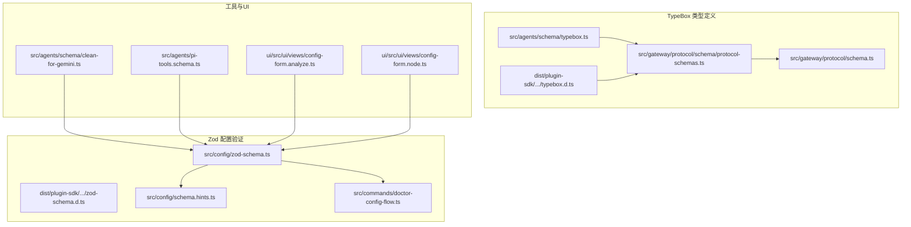
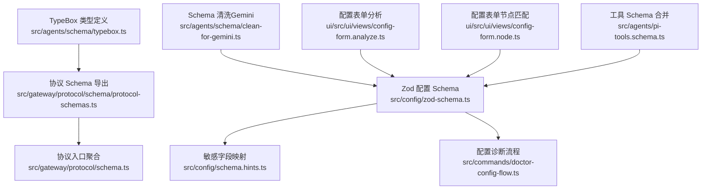
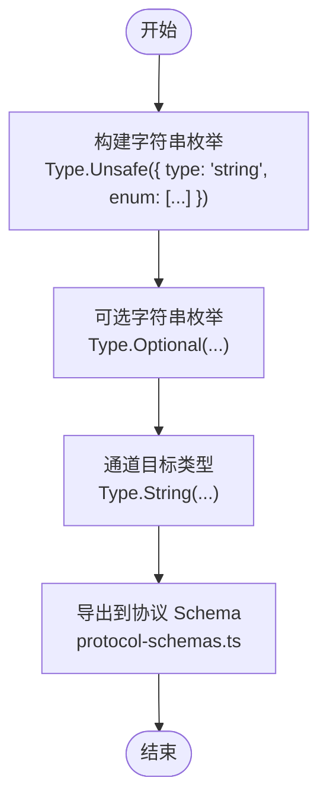
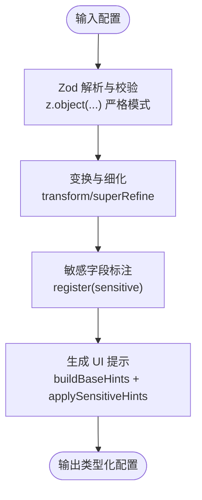
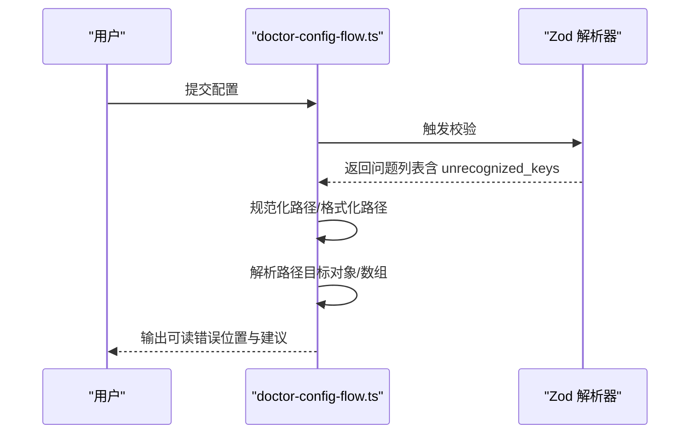
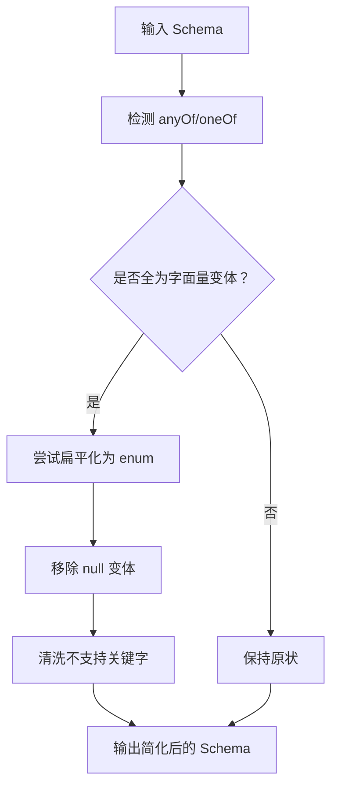
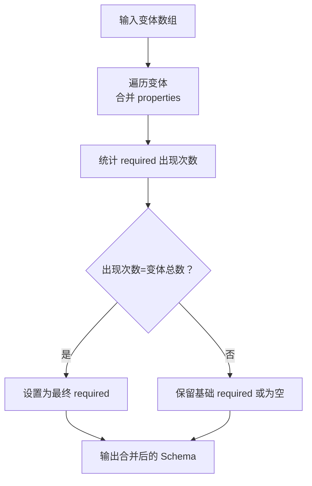
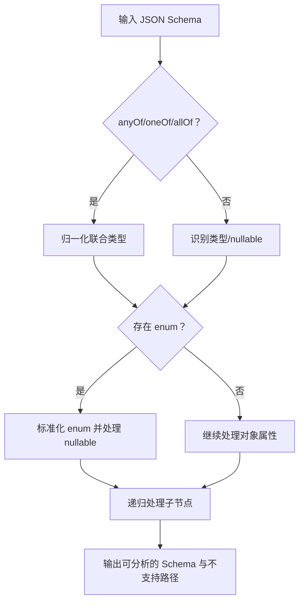
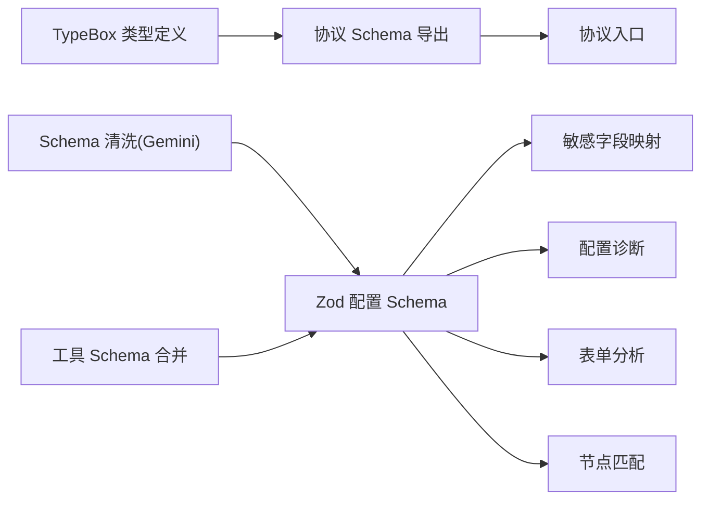

# 类型系统

<cite>
**本文引用的文件**
- [src/agents/schema/typebox.ts](file://src/agents/schema/typebox.ts)
- [dist/plugin-sdk/agents/schema/typebox.d.ts](file://dist/plugin-sdk/agents/schema/typebox.d.ts)
- [src/agents/schema/clean-for-gemini.ts](file://src/agents/schema/clean-for-gemini.ts)
- [src/config/zod-schema.ts](file://src/config/zod-schema.ts)
- [dist/plugin-sdk/config/zod-schema.d.ts](file://dist/plugin-sdk/config/zod-schema.d.ts)
- [src/config/schema.hints.ts](file://src/config/schema.hints.ts)
- [src/commands/doctor-config-flow.ts](file://src/commands/doctor-config-flow.ts)
- [src/gateway/protocol/schema/protocol-schemas.ts](file://src/gateway/protocol/schema/protocol-schemas.ts)
- [src/gateway/protocol/schema.ts](file://src/gateway/protocol/schema.ts)
- [src/agents/pi-tools.schema.ts](file://src/agents/pi-tools.schema.ts)
- [ui/src/ui/views/config-form.analyze.ts](file://ui/src/ui/views/config-form.analyze.ts)
- [ui/src/ui/views/config-form.node.ts](file://ui/src/ui/views/config-form.node.ts)
</cite>

## 目录

1. [简介](#简介)
2. [项目结构](#项目结构)
3. [核心组件](#核心组件)
4. [架构总览](#架构总览)
5. [详细组件分析](#详细组件分析)
6. [依赖分析](#依赖分析)
7. [性能考量](#性能考量)
8. [故障排查指南](#故障排查指南)
9. [结论](#结论)
10. [附录](#附录)

## 简介

本文件系统性梳理 OpenClaw 的类型系统，覆盖 TypeBox 类型定义、Zod Schema 验证与类型推导、数据验证规则与约束、运行时类型检查、性能优化（含类型缓存与转换）、扩展机制（自定义验证器与类型别名）以及使用示例与最佳实践。内容以仓库中实际实现为依据，配合可视化图示帮助理解。

## 项目结构

OpenClaw 的类型系统主要由两部分构成：

- 基于 TypeBox 的协议与工具 Schema 定义：用于网关协议、代理配置等场景的静态类型与运行时校验。
- 基于 Zod 的配置 Schema 定义：用于应用配置的强类型校验、敏感字段标注与 UI 提示生成。

图表来源

- [src/agents/schema/typebox.ts](file://src/agents/schema/typebox.ts#L1-L44)
- [dist/plugin-sdk/agents/schema/typebox.d.ts](file://dist/plugin-sdk/agents/schema/typebox.d.ts#L1-L15)
- [src/gateway/protocol/schema/protocol-schemas.ts](file://src/gateway/protocol/schema/protocol-schemas.ts#L1-L286)
- [src/gateway/protocol/schema.ts](file://src/gateway/protocol/schema.ts#L1-L18)
- [src/config/zod-schema.ts](file://src/config/zod-schema.ts#L1-L814)
- [dist/plugin-sdk/config/zod-schema.d.ts](file://dist/plugin-sdk/config/zod-schema.d.ts#L1-L800)
- [src/config/schema.hints.ts](file://src/config/schema.hints.ts#L1-L248)
- [src/commands/doctor-config-flow.ts](file://src/commands/doctor-config-flow.ts#L48-L99)
- [src/agents/schema/clean-for-gemini.ts](file://src/agents/schema/clean-for-gemini.ts#L42-L305)
- [src/agents/pi-tools.schema.ts](file://src/agents/pi-tools.schema.ts#L130-L167)
- [ui/src/ui/views/config-form.analyze.ts](file://ui/src/ui/views/config-form.analyze.ts#L42-L79)
- [ui/src/ui/views/config-form.node.ts](file://ui/src/ui/views/config-form.node.ts#L243-L285)

章节来源

- [src/agents/schema/typebox.ts](file://src/agents/schema/typebox.ts#L1-L44)
- [src/config/zod-schema.ts](file://src/config/zod-schema.ts#L1-L814)
- [src/config/schema.hints.ts](file://src/config/schema.hints.ts#L1-L248)
- [src/commands/doctor-config-flow.ts](file://src/commands/doctor-config-flow.ts#L48-L99)
- [src/gateway/protocol/schema/protocol-schemas.ts](file://src/gateway/protocol/schema/protocol-schemas.ts#L1-L286)

## 核心组件

- TypeBox 类型定义与工具函数
  - 提供字符串枚举、可选字符串枚举、通道目标等常用类型构造器，确保生成的 Schema 更利于外部工具解析。
  - 协议层通过 TypeBox 定义请求/响应参数与结果的静态类型，并在协议导出文件中集中管理。
- Zod 配置 Schema
  - 定义全局配置的完整结构，包含严格对象、联合类型、字面量、记录、数组、变换与超精细校验（如时间戳、URL、字节大小、正则约束等）。
  - 支持敏感字段注册与 UI 提示构建，辅助生成配置表单与提示信息。
- 工具与 UI 层
  - 针对特定平台（如 Gemini）的 Schema 清洗与简化逻辑，提升兼容性。
  - 配置表单分析与节点遍历，支持复杂 Schema 的 UI 友好展示与搜索匹配。

章节来源

- [src/agents/schema/typebox.ts](file://src/agents/schema/typebox.ts#L1-L44)
- [src/gateway/protocol/schema/protocol-schemas.ts](file://src/gateway/protocol/schema/protocol-schemas.ts#L153-L283)
- [src/config/zod-schema.ts](file://src/config/zod-schema.ts#L131-L782)
- [src/config/schema.hints.ts](file://src/config/schema.hints.ts#L10-L242)
- [src/agents/schema/clean-for-gemini.ts](file://src/agents/schema/clean-for-gemini.ts#L42-L305)
- [ui/src/ui/views/config-form.analyze.ts](file://ui/src/ui/views/config-form.analyze.ts#L42-L79)
- [ui/src/ui/views/config-form.node.ts](file://ui/src/ui/views/config-form.node.ts#L243-L285)

## 架构总览

下图展示了类型系统在不同层次的协作关系：TypeBox 负责协议与工具的类型定义；Zod 负责配置的强类型校验与敏感字段处理；工具与 UI 层负责 Schema 清洗与表单渲染。

图表来源

- [src/agents/schema/typebox.ts](file://src/agents/schema/typebox.ts#L1-L44)
- [src/gateway/protocol/schema/protocol-schemas.ts](file://src/gateway/protocol/schema/protocol-schemas.ts#L1-L286)
- [src/gateway/protocol/schema.ts](file://src/gateway/protocol/schema.ts#L1-L18)
- [src/config/zod-schema.ts](file://src/config/zod-schema.ts#L1-L814)
- [src/config/schema.hints.ts](file://src/config/schema.hints.ts#L1-L248)
- [src/commands/doctor-config-flow.ts](file://src/commands/doctor-config-flow.ts#L48-L99)
- [src/agents/schema/clean-for-gemini.ts](file://src/agents/schema/clean-for-gemini.ts#L42-L305)
- [ui/src/ui/views/config-form.analyze.ts](file://ui/src/ui/views/config-form.analyze.ts#L42-L79)
- [ui/src/ui/views/config-form.node.ts](file://ui/src/ui/views/config-form.node.ts#L243-L285)
- [src/agents/pi-tools.schema.ts](file://src/agents/pi-tools.schema.ts#L130-L167)

## 详细组件分析

### TypeBox 类型定义与工具函数

- 设计要点
  - 使用 Unsafe 包装字符串枚举，避免 anyOf 形式导致某些 LLM/工具链不兼容，直接生成扁平 enum。
  - 提供可选字符串枚举与通道目标类型，统一对外暴露的类型接口。
- 典型用途
  - 协议参数与返回值的静态类型定义，结合 ProtocolSchemas 统一导出。
- 性能与兼容性
  - 扁平枚举减少 Schema 复杂度，有利于下游工具解析与 LLM 推理。

图表来源

- [src/agents/schema/typebox.ts](file://src/agents/schema/typebox.ts#L13-L31)
- [src/gateway/protocol/schema/protocol-schemas.ts](file://src/gateway/protocol/schema/protocol-schemas.ts#L153-L283)

章节来源

- [src/agents/schema/typebox.ts](file://src/agents/schema/typebox.ts#L1-L44)
- [dist/plugin-sdk/agents/schema/typebox.d.ts](file://dist/plugin-sdk/agents/schema/typebox.d.ts#L1-L15)
- [src/gateway/protocol/schema/protocol-schemas.ts](file://src/gateway/protocol/schema/protocol-schemas.ts#L153-L283)

### Zod 配置 Schema 与验证规则

- 结构化定义
  - 采用 z.object(...) 严格模式，支持嵌套对象、数组、联合类型、字面量、记录等。
  - 对时间戳、URL、字节大小、正整数等进行精细化校验与转换。
- 敏感字段与 UI 提示
  - 通过 register(sensitive) 标注敏感字段，结合 mapSensitivePaths 自动识别潜在敏感键。
  - buildBaseHints 与 applySensitiveHints 生成 UI 标签、分组、顺序与占位符。
- 运行时校验
  - 使用 superRefine 在同一上下文中执行跨字段校验（如 cron 的 sessionRetention 与 runLog.maxBytes 的格式校验）。

图表来源

- [src/config/zod-schema.ts](file://src/config/zod-schema.ts#L131-L782)
- [src/config/schema.hints.ts](file://src/config/schema.hints.ts#L133-L174)

章节来源

- [src/config/zod-schema.ts](file://src/config/zod-schema.ts#L1-L814)
- [dist/plugin-sdk/config/zod-schema.d.ts](file://dist/plugin-sdk/config/zod-schema.d.ts#L1-L800)
- [src/config/schema.hints.ts](file://src/config/schema.hints.ts#L1-L248)

### 配置诊断与路径解析

- 未识别键处理
  - 识别 unrecognized_keys 错误，规范化路径，定位根对象中的具体键或索引。
- 路径解析
  - 将路径数组转换为可读字符串，支持对象与数组索引的递归解析，便于错误定位与用户提示。

图表来源

- [src/commands/doctor-config-flow.ts](file://src/commands/doctor-config-flow.ts#L48-L99)

章节来源

- [src/commands/doctor-config-flow.ts](file://src/commands/doctor-config-flow.ts#L48-L99)

### Schema 清洗与简化（面向 Gemini）

- 目标
  - 将 TypeBox Literal 生成的 anyOf/oneOf 中的纯字面量变体合并为扁平 enum，移除不被 Gemini 支持的关键字，提升兼容性。
- 关键算法
  - 尝试扁平化 anyOf/oneOf 中仅含字面量的变体。
  - 移除 null 变体并保留剩余类型一致性。
  - 清洗不支持的关键字，必要时改写 type 与 enum 字段。

图表来源

- [src/agents/schema/clean-for-gemini.ts](file://src/agents/schema/clean-for-gemini.ts#L42-L86)
- [src/agents/schema/clean-for-gemini.ts](file://src/agents/schema/clean-for-gemini.ts#L266-L305)

章节来源

- [src/agents/schema/clean-for-gemini.ts](file://src/agents/schema/clean-for-gemini.ts#L42-L305)

### 工具 Schema 合并与 Required 推断

- 场景
  - 合并多个变体对象的属性集合，统计 required 字段出现频次，推断最终 required 列表。
- 实现
  - 遍历 variants，合并 properties 并递增 required 计数，最终根据出现次数确定必填项。

图表来源

- [src/agents/pi-tools.schema.ts](file://src/agents/pi-tools.schema.ts#L130-L167)

章节来源

- [src/agents/pi-tools.schema.ts](file://src/agents/pi-tools.schema.ts#L130-L167)

### 配置表单分析与节点匹配

- 表单分析
  - 对 anyOf/oneOf/allOf 进行归一化处理；对 enum 进行去重与空集判定；对对象类型递归分析其属性。
- 节点匹配
  - 递归遍历对象属性与额外属性，基于搜索条件匹配节点，支持路径与提示信息联动。

图表来源

- [ui/src/ui/views/config-form.analyze.ts](file://ui/src/ui/views/config-form.analyze.ts#L42-L79)

章节来源

- [ui/src/ui/views/config-form.analyze.ts](file://ui/src/ui/views/config-form.analyze.ts#L42-L79)
- [ui/src/ui/views/config-form.node.ts](file://ui/src/ui/views/config-form.node.ts#L243-L285)

## 依赖分析

- TypeBox 与协议
  - TypeBox 类型定义通过 protocol-schemas.ts 汇总导出，供协议层统一引用。
- Zod 与 UI/工具
  - Zod Schema 与敏感字段映射共同驱动 UI 表单生成与提示；doctor-config-flow 用于诊断未识别键与路径定位。
  - clean-for-gemini 与 pi-tools.schema 作为工具层对 Zod Schema 进行二次处理，增强兼容性与可维护性。

图表来源

- [src/gateway/protocol/schema/protocol-schemas.ts](file://src/gateway/protocol/schema/protocol-schemas.ts#L153-L283)
- [src/config/zod-schema.ts](file://src/config/zod-schema.ts#L131-L782)
- [src/config/schema.hints.ts](file://src/config/schema.hints.ts#L192-L242)
- [src/commands/doctor-config-flow.ts](file://src/commands/doctor-config-flow.ts#L48-L99)
- [src/agents/schema/clean-for-gemini.ts](file://src/agents/schema/clean-for-gemini.ts#L266-L305)
- [src/agents/pi-tools.schema.ts](file://src/agents/pi-tools.schema.ts#L130-L167)
- [ui/src/ui/views/config-form.analyze.ts](file://ui/src/ui/views/config-form.analyze.ts#L42-L79)
- [ui/src/ui/views/config-form.node.ts](file://ui/src/ui/views/config-form.node.ts#L243-L285)

章节来源

- [src/gateway/protocol/schema/protocol-schemas.ts](file://src/gateway/protocol/schema/protocol-schemas.ts#L153-L283)
- [src/config/zod-schema.ts](file://src/config/zod-schema.ts#L131-L782)
- [src/config/schema.hints.ts](file://src/config/schema.hints.ts#L192-L242)
- [src/commands/doctor-config-flow.ts](file://src/commands/doctor-config-flow.ts#L48-L99)
- [src/agents/schema/clean-for-gemini.ts](file://src/agents/schema/clean-for-gemini.ts#L266-L305)
- [src/agents/pi-tools.schema.ts](file://src/agents/pi-tools.schema.ts#L130-L167)
- [ui/src/ui/views/config-form.analyze.ts](file://ui/src/ui/views/config-form.analyze.ts#L42-L79)
- [ui/src/ui/views/config-form.node.ts](file://ui/src/ui/views/config-form.node.ts#L243-L285)

## 性能考量

- 类型缓存与复用
  - 将常用类型（如字符串枚举、通道目标）定义为可复用模块，避免重复构造，降低编译与运行时开销。
- Schema 简化
  - 通过扁平枚举与移除不必要 anyOf/oneOf，减少 Schema 复杂度，提高 LLM/工具链解析效率。
- 超精细校验的代价
  - 对 URL、字节大小、时间戳等进行变换与细化校验会增加解析成本，建议在必要场景启用，避免全局过度使用。
- 路径解析与诊断
  - doctor-config-flow 的路径解析为 O(n) 遍历，建议在错误较多时优先聚焦关键路径，减少不必要的深度遍历。

[本节为通用指导，无需列出章节来源]

## 故障排查指南

- 未识别键问题
  - 使用 doctor-config-flow 的路径解析功能，将问题路径规范化为可读字符串，快速定位键或索引。
  - 若涉及数组索引，确保路径中包含正确的索引号；若为额外属性，注意通配符表示法。
- 敏感字段误报
  - 通过 mapSensitivePaths 与 isSensitiveConfigPath 的组合判断，结合白名单后缀（如 token、contextTokens 等）进行修正。
- Schema 不兼容
  - 针对特定平台（如 Gemini），使用 clean-for-gemini 的清洗逻辑，将 anyOf/oneOf 中的字面量扁平化为 enum，并移除不支持关键字。

章节来源

- [src/commands/doctor-config-flow.ts](file://src/commands/doctor-config-flow.ts#L48-L99)
- [src/config/schema.hints.ts](file://src/config/schema.hints.ts#L129-L131)
- [src/agents/schema/clean-for-gemini.ts](file://src/agents/schema/clean-for-gemini.ts#L266-L305)

## 结论

OpenClaw 的类型系统通过 TypeBox 与 Zod 的协同，实现了从协议到配置的全栈强类型保障。TypeBox 提供简洁、兼容性好的类型定义；Zod 提供严格的校验与丰富的变换能力，并结合敏感字段与 UI 提示形成完整的配置体验。工具层的 Schema 清洗与合并进一步提升了跨平台兼容性与可维护性。建议在新场景中优先采用 TypeBox 的扁平枚举与 Zod 的超精细校验策略，同时结合缓存与简化手段优化性能。

[本节为总结性内容，无需列出章节来源]

## 附录

- 使用示例与最佳实践
  - 协议方法新增：在协议 Schema 中添加参数与结果类型，统一导出并在类型中生成静态类型别名，确保前后端一致。
  - 配置字段新增：在 zod-schema 中定义字段与校验规则，必要时使用 transform/superRefine，最后通过 schema.hints 注入 UI 提示。
  - 工具链兼容：对 LLM/工具链不友好 Schema，优先采用扁平枚举与清洗逻辑，减少 anyOf/oneOf 的使用。
- 类型别名与扩展
  - TypeBox 提供 stringEnum/optionalStringEnum 等便捷函数，建议封装为可复用类型别名。
  - Zod 支持通过 register(sensitive) 与自定义校验器扩展，建议在插件与第三方集成中统一规范。

[本节为概念性内容，无需列出章节来源]
