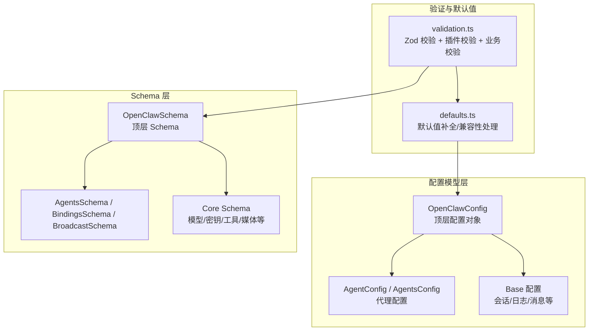
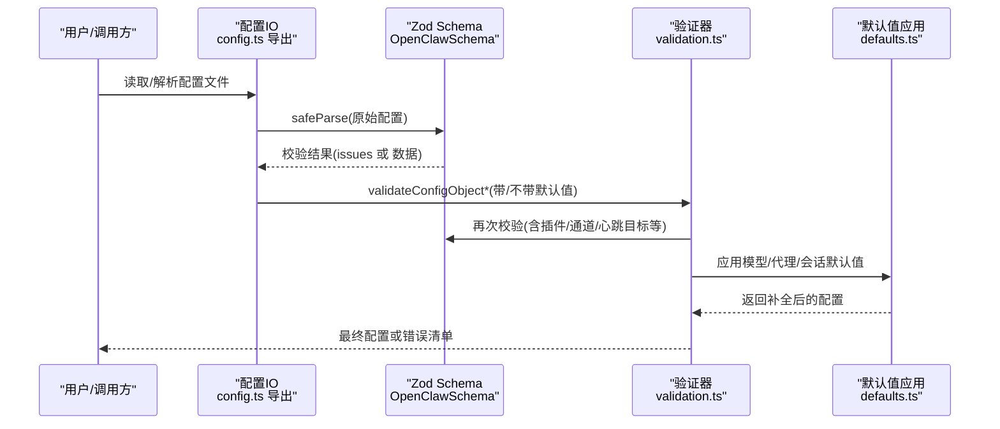
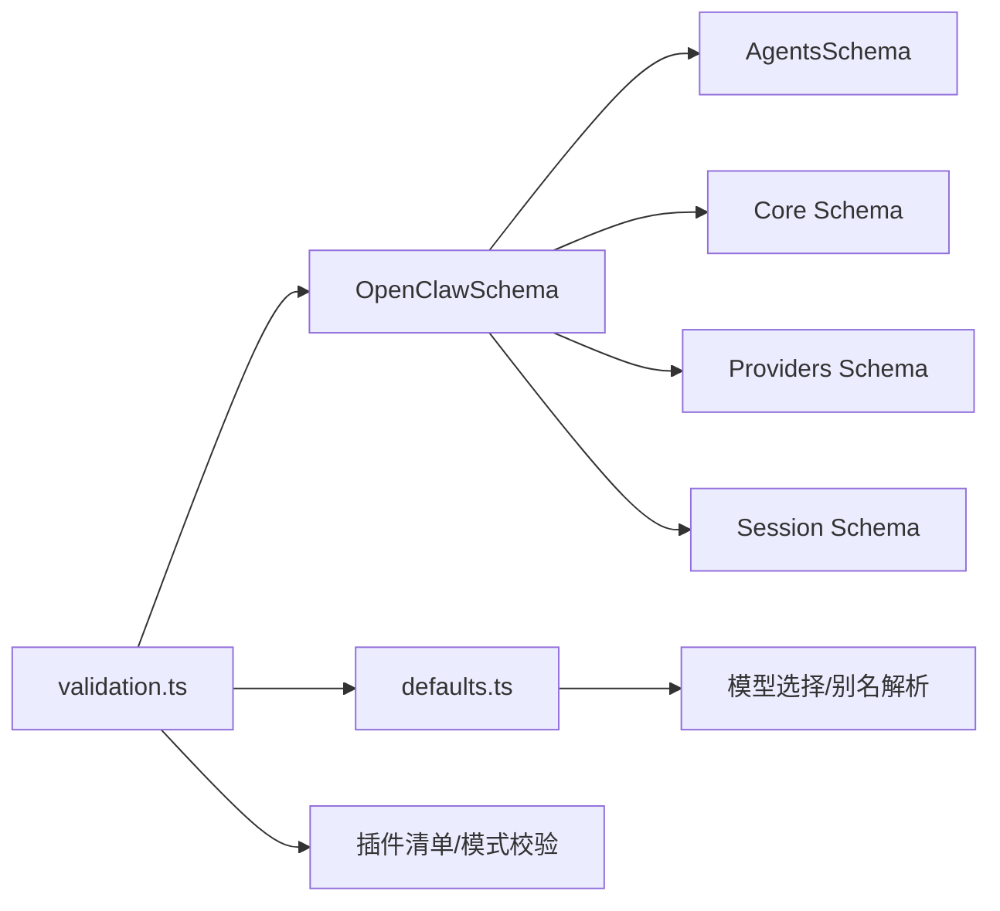

# 配置模型

<cite>
**本文引用的文件**
- [src/config/zod-schema.ts](file://src/config/zod-schema.ts)
- [src/config/types.openclaw.ts](file://src/config/types.openclaw.ts)
- [src/config/types.base.ts](file://src/config/types.base.ts)
- [src/config/types.agents.ts](file://src/config/types.agents.ts)
- [src/config/zod-schema.core.ts](file://src/config/zod-schema.core.ts)
- [src/config/zod-schema.agents.ts](file://src/config/zod-schema.agents.ts)
- [src/config/validation.ts](file://src/config/validation.ts)
- [src/config/defaults.ts](file://src/config/defaults.ts)
- [src/config/merge-config.ts](file://src/config/merge-config.ts)
- [src/config/config.ts](file://src/config/config.ts)
</cite>

## 目录

1. [简介](#简介)
2. [项目结构](#项目结构)
3. [核心组件](#核心组件)
4. [架构总览](#架构总览)
5. [详细组件分析](#详细组件分析)
6. [依赖关系分析](#依赖关系分析)
7. [性能考量](#性能考量)
8. [故障排查指南](#故障排查指南)
9. [结论](#结论)
10. [附录](#附录)

## 简介

本文件系统性梳理 OpenClaw 的配置模型与验证体系，重点覆盖以下内容：

- OpenClaw 主配置模型（OpenClawConfig）的结构与字段定义
- Agent 配置模型（AgentConfig、AgentsConfig）与 Base 配置模型（SessionConfig、LoggingConfig 等）的结构与字段定义
- Zod Schema 定义、类型约束与数据验证逻辑
- 默认值处理与运行时默认应用流程
- 配置加载顺序、合并策略与优先级规则
- 使用示例、最佳实践与常见错误的解决方案

## 项目结构

OpenClaw 的配置模型由“类型定义 + Zod Schema + 验证器 + 默认值应用”四部分组成：

- 类型定义：集中于 types.\* 文件，明确各模块的接口与可选字段
- Zod Schema：集中于 zod-schema.\* 文件，对类型进行严格约束与校验
- 验证器：validation.ts 负责执行 Zod 校验、插件校验与二次业务规则校验
- 默认值应用：defaults.ts 提供多处默认值补全与兼容性处理

图表来源

- [src/config/zod-schema.ts](file://src/config/zod-schema.ts#L131-L782)
- [src/config/zod-schema.agents.ts](file://src/config/zod-schema.agents.ts#L6-L62)
- [src/config/zod-schema.core.ts](file://src/config/zod-schema.core.ts#L253-L260)
- [src/config/validation.ts](file://src/config/validation.ts#L87-L143)
- [src/config/defaults.ts](file://src/config/defaults.ts#L144-L168)

章节来源

- [src/config/zod-schema.ts](file://src/config/zod-schema.ts#L131-L782)
- [src/config/types.openclaw.ts](file://src/config/types.openclaw.ts#L30-L115)
- [src/config/types.base.ts](file://src/config/types.base.ts#L105-L166)
- [src/config/types.agents.ts](file://src/config/types.agents.ts#L8-L40)
- [src/config/zod-schema.agents.ts](file://src/config/zod-schema.agents.ts#L6-L62)
- [src/config/zod-schema.core.ts](file://src/config/zod-schema.core.ts#L253-L260)
- [src/config/validation.ts](file://src/config/validation.ts#L87-L143)
- [src/config/defaults.ts](file://src/config/defaults.ts#L144-L168)

## 核心组件

- OpenClaw 主配置模型（OpenClawConfig）
  - 字段覆盖：元信息、环境变量、向导记录、诊断、日志、更新、浏览器、UI、密钥、认证、Acp、模型、节点主机、代理、工具、绑定、广播、音频、消息、命令、审批、会话、Web、通道、定时任务、钩子、发现、画布主机、TTS、网关、内存、技能、插件等
  - 关键点：严格模式（strict）、catchall 支持、敏感字段注册（register(sensitive)）、超细化的 superRefine 自定义校验
- Agent 配置模型（AgentConfig、AgentsConfig）
  - AgentConfig：单个代理的标识、工作区、模型、技能、记忆检索、人类延迟、心跳、身份、群聊、子代理、沙箱、参数、工具等
  - AgentsConfig：默认值与代理列表
- Base 配置模型（SessionConfig、LoggingConfig 等）
  - SessionConfig：会话范围、DM 作用域、重置策略、typing 行为、发送策略、线程绑定、维护策略等
  - LoggingConfig：日志级别、输出文件、最大文件大小、控制台样式、敏感信息脱敏策略与正则

章节来源

- [src/config/types.openclaw.ts](file://src/config/types.openclaw.ts#L30-L115)
- [src/config/types.agents.ts](file://src/config/types.agents.ts#L8-L40)
- [src/config/types.base.ts](file://src/config/types.base.ts#L105-L166)

## 架构总览

OpenClaw 的配置从“原始 JSON/JSON5”到“最终可用配置”的关键流程如下：

图表来源

- [src/config/config.ts](file://src/config/config.ts#L1-L25)
- [src/config/zod-schema.ts](file://src/config/zod-schema.ts#L131-L782)
- [src/config/validation.ts](file://src/config/validation.ts#L87-L143)
- [src/config/defaults.ts](file://src/config/defaults.ts#L144-L168)

## 详细组件分析

### OpenClaw 主配置模型（OpenClawConfig）

- 结构要点
  - 顶层为严格对象，支持 catchall 扩展字段
  - 大量子模块通过 Schema 组合而成，如 models、agents、channels、gateway、skills、plugins 等
  - 敏感字段统一注册（例如 webhookToken、apiKey、token 等），便于后续脱敏与审计
  - 超细化自定义校验（superRefine）用于复杂约束，如 cron.sessionRetention 与 runLog.maxBytes 的单位解析
- 关键字段与约束
  - meta.lastTouchedAt 支持字符串与数值时间戳转换
  - env.vars 与 env.shellEnv 控制环境注入
  - logging.redactSensitive 默认值在默认值应用阶段设置
  - browser.profiles 校验 cdpPort 与 cdpUrl 至少设置其一
  - gateway.auth.trustedProxy.userHeader 必填校验
  - hooks.token/webhookToken 注册敏感标记
- 典型用途
  - 作为配置文件的根对象，承载所有功能开关与参数
  - 作为验证与默认值应用的输入，确保运行期一致性

章节来源

- [src/config/types.openclaw.ts](file://src/config/types.openclaw.ts#L30-L115)
- [src/config/zod-schema.ts](file://src/config/zod-schema.ts#L131-L782)
- [src/config/zod-schema.core.ts](file://src/config/zod-schema.core.ts#L377-L379)

### Agent 配置模型（AgentConfig、AgentsConfig）

- AgentConfig
  - 基本属性：id、default、name、workspace、agentDir
  - 模型与工具：model、tools、memorySearch、params
  - 行为与体验：humanDelay、heartbeat、identity、groupChat、subagents、sandbox
  - 技能与权限：skills（数组，空表示无技能；省略表示全部）
- AgentsConfig
  - defaults：全局默认行为（并发、上下文修剪、心跳、模型别名等）
  - list：代理实例列表
- 广播与绑定
  - broadcast：按 peerId 分组的代理 ID 列表，支持策略（并行/串行）
  - bindings：基于通道/账号/群组/角色的路由匹配规则

章节来源

- [src/config/types.agents.ts](file://src/config/types.agents.ts#L8-L40)
- [src/config/zod-schema.agents.ts](file://src/config/zod-schema.agents.ts#L6-L62)

### Base 配置模型（SessionConfig、LoggingConfig 等）

- SessionConfig
  - 会话范围与 DM 作用域、重置策略（每日/空闲）、typing 行为、发送策略、线程绑定、维护策略（裁剪、轮转、磁盘配额）
  - 特殊默认：mainKey 强制为 "main"，非 "main" 将被忽略并发出警告
- LoggingConfig
  - 日志级别、输出文件、最大文件大小、控制台样式、敏感信息脱敏策略与正则
  - 默认值：redactSensitive 默认为 "tools"

章节来源

- [src/config/types.base.ts](file://src/config/types.base.ts#L105-L166)
- [src/config/defaults.ts](file://src/config/defaults.ts#L144-L168)

### Zod Schema 定义与类型约束

- OpenClawSchema
  - 顶层严格对象，分模块组合
  - 大量枚举与联合类型约束（如日志级别、会话作用域、队列模式等）
  - 超细化自定义校验：cron.sessionRetention/runLog.maxBytes 单位解析、gateway.auth.trustedProxy.userHeader 必填
- Core Schema（模型/密钥/工具/媒体等）
  - SecretRef/SecretInput：支持 env/file/exec 三种密钥来源
  - ModelDefinition/ModelProvider：模型 API、成本、上下文窗口、最大输出等
  - MediaUnderstanding/ToolsLinks：媒体理解与链接提取的 CLI/Provider 双模式
- Agents Schema
  - AgentDefaultsSchema、AgentEntrySchema、BindingsSchema、BroadcastSchema、AudioSchema

章节来源

- [src/config/zod-schema.ts](file://src/config/zod-schema.ts#L131-L782)
- [src/config/zod-schema.core.ts](file://src/config/zod-schema.core.ts#L253-L260)
- [src/config/zod-schema.agents.ts](file://src/config/zod-schema.agents.ts#L6-L62)

### 配置验证规则与默认值处理

- 验证流程
  - validateConfigObjectRaw：仅执行 Zod 校验与遗留问题检测，不应用默认值
  - validateConfigObject：在 Raw 基础上应用模型/代理/会话默认值
  - validateConfigObjectWithPlugins / validateConfigObjectRawWithPlugins：额外进行插件清单、槽位、配置模式校验，并收集警告
- 默认值处理
  - 会话默认：强制 mainKey 为 "main"，并给出非 "main" 的警告
  - 日志默认：redactSensitive 默认为 "tools"
  - 模型默认：为模型补充 reasoning/input/cost/contextWindow/maxTokens/api 等字段
  - 代理默认：maxConcurrent/subagents.maxConcurrent、contextPruning.mode/heartbeat.every 等
- 运行时默认应用顺序
  - applySessionDefaults → applyAgentDefaults → applyModelDefaults → applyLoggingDefaults（在应用模型默认时可能再次补全代理默认）

章节来源

- [src/config/validation.ts](file://src/config/validation.ts#L87-L143)
- [src/config/defaults.ts](file://src/config/defaults.ts#L144-L168)
- [src/config/defaults.ts](file://src/config/defaults.ts#L213-L347)
- [src/config/defaults.ts](file://src/config/defaults.ts#L349-L388)
- [src/config/defaults.ts](file://src/config/defaults.ts#L390-L405)

### 配置继承机制与合并策略

- 继承与覆盖
  - AgentsConfig.defaults 作为全局默认，AgentConfig 中未显式设置的字段将继承自 defaults
  - 模型别名（如 gpt、opus 等）在应用模型默认时自动补全
- 合并策略
  - mergeConfigSection：对单个配置段进行浅合并，支持 unsetOnUndefined 删除键
  - mergeWhatsAppConfig：针对 channels.whatsapp 的便捷合并封装
- 优先级规则
  - 实例级（AgentConfig） > 全局默认（AgentsConfig.defaults） > 运行时默认（defaults.ts）
  - 插件配置中，已知插件优先；未知插件以警告形式提示，避免启动失败

章节来源

- [src/config/merge-config.ts](file://src/config/merge-config.ts#L8-L39)
- [src/config/defaults.ts](file://src/config/defaults.ts#L320-L334)

### 配置加载顺序与写回策略

- 加载顺序
  - 读取原始配置文件（JSON/JSON5）
  - 解析 $include 与 ${ENV} 替换
  - Zod 校验（OpenClawSchema.safeParse）
  - 插件与业务规则二次校验（validation.ts）
  - 应用运行时默认值（defaults.ts）
- 写回策略
  - 使用“解析后但未应用运行时默认值”的快照（resolved 字段）进行写回，避免将默认值写入配置文件
  - 对敏感字段统一脱敏标记，便于安全输出

章节来源

- [src/config/types.openclaw.ts](file://src/config/types.openclaw.ts#L127-L144)
- [src/config/validation.ts](file://src/config/validation.ts#L87-L143)

### 使用示例与最佳实践

- 示例场景
  - 设置会话主键为 "main"（无需显式设置，系统会强制）
  - 为代理设置默认并发数与子代理并发数，避免遗漏导致的资源争用
  - 在模型配置中为缺失字段自动补全 reasoning/input/cost/contextWindow/maxTokens/api
  - 为 TTS 提供默认提供商与语音参数，减少重复配置
- 最佳实践
  - 明确区分“运行时默认值”与“配置文件中的显式值”，避免误写默认值
  - 使用敏感字段注册（register(sensitive)）并在日志中启用脱敏
  - 对插件配置进行最小化授权，避免 allowAll
  - 使用 channels.\* 的已知通道 ID，避免拼写错误导致的无效配置

### 常见配置错误与解决方案

- 错误：browser.profiles 缺少 cdpPort 或 cdpUrl
  - 解决：至少设置其一
- 错误：gateway.auth.trustedProxy.userHeader 为空
  - 解决：必须设置且非空
- 错误：cron.sessionRetention/runLog.maxBytes 单位非法
  - 解决：使用 ms/s/m/h/d 或 b/kb/mb/gb/tb
- 错误：agents.list 存在重复 agentDir
  - 解决：调整工作区路径，确保唯一
- 错误：identity.avatar 路径越权
  - 解决：使用工作区相对路径、HTTP(S) URL 或 Data URI

章节来源

- [src/config/zod-schema.ts](file://src/config/zod-schema.ts#L267-L278)
- [src/config/zod-schema.ts](file://src/config/zod-schema.ts#L552-L556)
- [src/config/zod-schema.ts](file://src/config/zod-schema.ts#L389-L412)
- [src/config/validation.ts](file://src/config/validation.ts#L110-L121)
- [src/config/validation.ts](file://src/config/validation.ts#L33-L81)

## 依赖关系分析

- 组件耦合
  - OpenClawSchema 依赖多个子 Schema（agents、core、providers、session 等）
  - validation.ts 依赖 OpenClawSchema、defaults.ts 与插件清单
  - defaults.ts 依赖模型选择与 TTS 配置解析
- 外部依赖
  - Zod 用于强类型校验
  - 插件清单与模式校验来自插件系统

图表来源

- [src/config/zod-schema.ts](file://src/config/zod-schema.ts#L1-L25)
- [src/config/validation.ts](file://src/config/validation.ts#L1-L23)
- [src/config/defaults.ts](file://src/config/defaults.ts#L1-L12)

章节来源

- [src/config/zod-schema.ts](file://src/config/zod-schema.ts#L1-L25)
- [src/config/validation.ts](file://src/config/validation.ts#L1-L23)
- [src/config/defaults.ts](file://src/config/defaults.ts#L1-L12)

## 性能考量

- 校验性能
  - Zod safeParse 为 O(n) 级别，复杂 Schema（如 plugins.entries.\*.config）建议缓存模式校验结果
  - 对大型 channels.\* 或 agents.list，建议分批处理或延迟校验
- 默认值应用
  - defaults.ts 的默认值补全是就地修改，注意避免重复应用
- I/O 与写回
  - 写回前使用“解析后但未应用默认值”的快照，减少冗余字段写入

## 故障排查指南

- 如何定位校验错误
  - 使用 validateConfigObjectRaw 获取原始错误路径与消息
  - 使用 validateConfigObjectWithPlugins 获取插件相关警告与错误
- 常见排查步骤
  - 检查 meta.lastTouchedAt 时间戳格式
  - 校验 browser.profiles、gateway.auth.trustedProxy、cron.sessionRetention 等字段
  - 确认 agents.list 的 agentDir 唯一性
  - 检查 identity.avatar 是否符合工作区相对路径/URL/Data URI 规范

章节来源

- [src/config/validation.ts](file://src/config/validation.ts#L87-L143)
- [src/config/validation.ts](file://src/config/validation.ts#L159-L171)
- [src/config/validation.ts](file://src/config/validation.ts#L173-L453)

## 结论

OpenClaw 的配置模型以 Zod Schema 为核心，结合严格的类型定义、完备的验证器与智能默认值应用，实现了高可靠性与可扩展性。通过清晰的继承与合并策略、明确的加载与写回流程，以及完善的错误诊断与最佳实践，开发者可以构建稳定、可维护的配置体系。

## 附录

- 关键 API 与导出
  - 配置导出：config.ts 汇总导出 IO、迁移、路径、运行时覆盖、类型与验证入口
  - 验证入口：OpenClawSchema、validateConfigObject*、apply*Defaults

章节来源

- [src/config/config.ts](file://src/config/config.ts#L1-L25)
