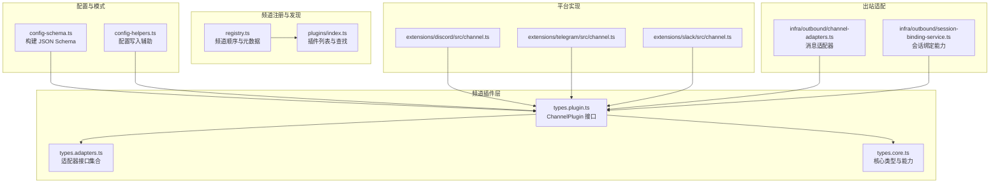
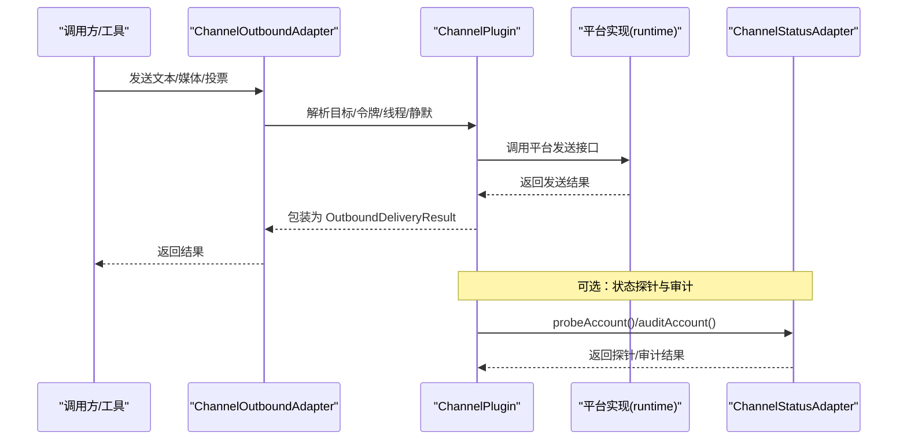
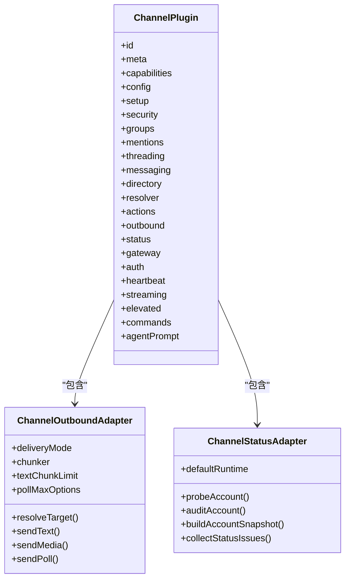
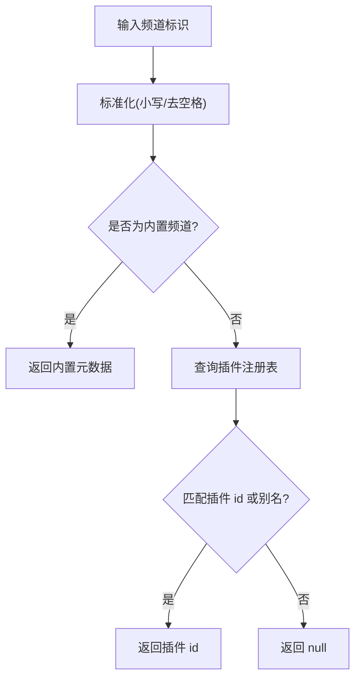
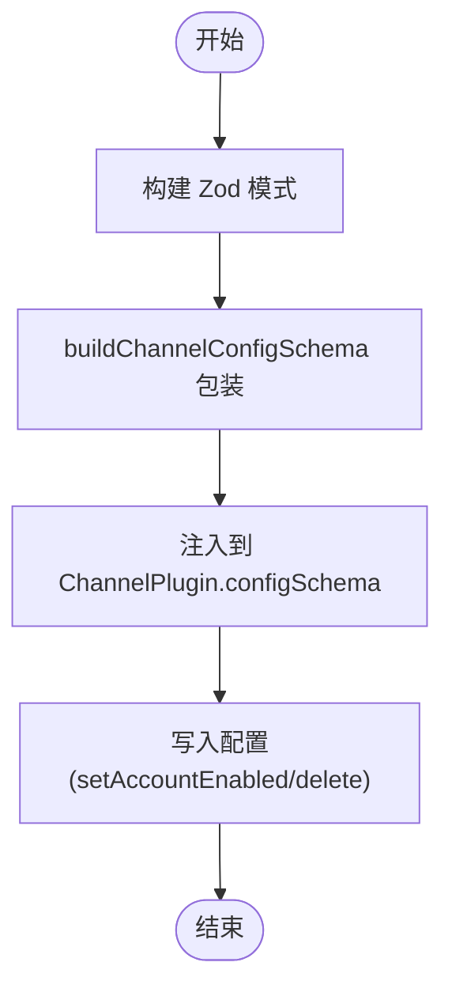
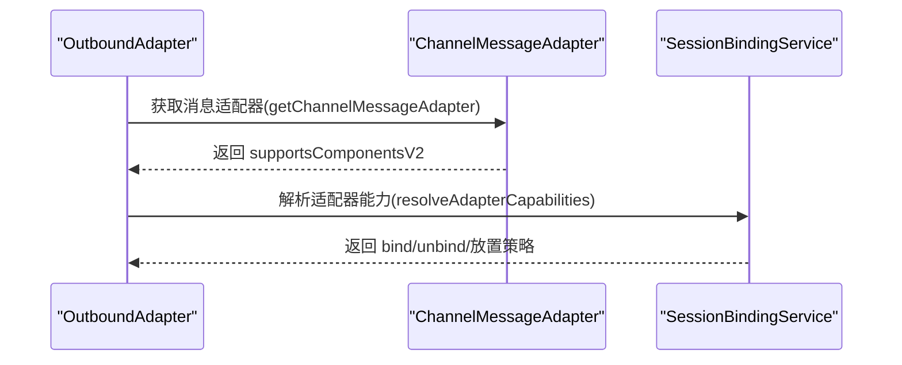
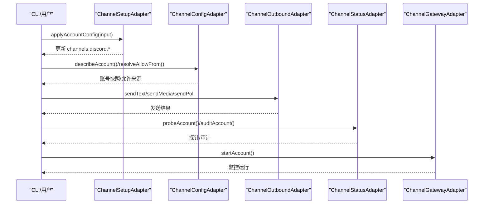
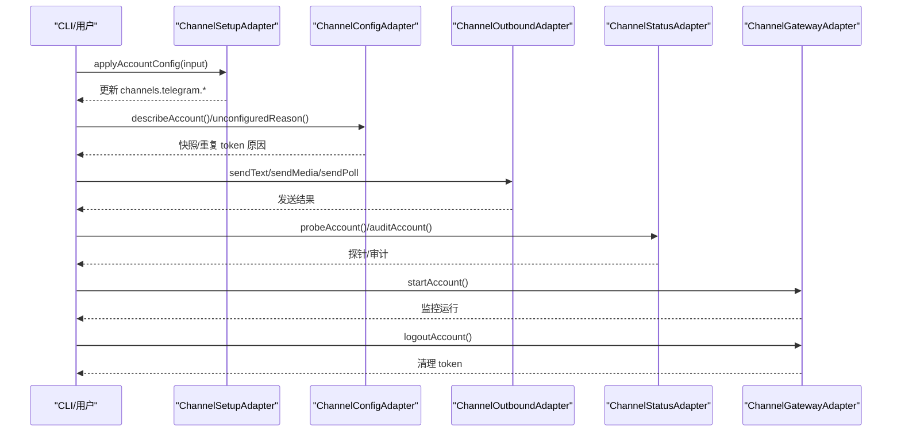
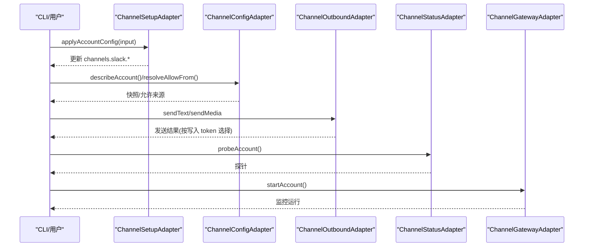
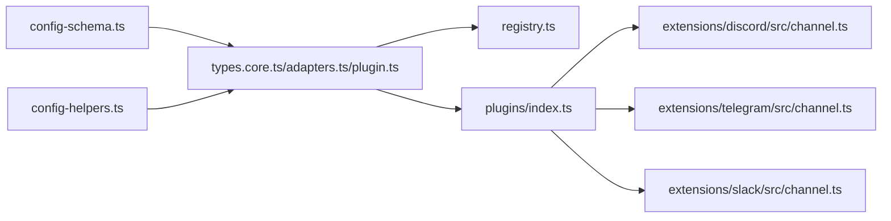

# 频道模型

<cite>
**本文引用的文件**
- [src/channels/plugins/types.core.ts](file://src/channels/plugins/types.core.ts)
- [src/channels/plugins/types.adapters.ts](file://src/channels/plugins/types.adapters.ts)
- [src/channels/plugins/types.plugin.ts](file://src/channels/plugins/types.plugin.ts)
- [src/channels/plugins/index.ts](file://src/channels/plugins/index.ts)
- [src/channels/registry.ts](file://src/channels/registry.ts)
- [src/channels/plugins/config-schema.ts](file://src/channels/plugins/config-schema.ts)
- [src/channels/plugins/config-helpers.ts](file://src/channels/plugins/config-helpers.ts)
- [src/infra/outbound/channel-adapters.ts](file://src/infra/outbound/channel-adapters.ts)
- [src/infra/outbound/session-binding-service.ts](file://src/infra/outbound/session-binding-service.ts)
- [extensions/discord/src/channel.ts](file://extensions/discord/src/channel.ts)
- [extensions/telegram/src/channel.ts](file://extensions/telegram/src/channel.ts)
- [extensions/slack/src/channel.ts](file://extensions/slack/src/channel.ts)
- [docs/zh-CN/tools/plugin.md](file://docs/zh-CN/tools/plugin.md)
</cite>

## 目录

1. [简介](#简介)
2. [项目结构](#项目结构)
3. [核心组件](#核心组件)
4. [架构总览](#架构总览)
5. [详细组件分析](#详细组件分析)
6. [依赖关系分析](#依赖关系分析)
7. [性能考量](#性能考量)
8. [故障排查指南](#故障排查指南)
9. [结论](#结论)
10. [附录](#附录)

## 简介

本文件系统化阐述 OpenClaw 的“频道模型”，覆盖频道类型与配置模型、频道适配器接口、频道特定参数、主流频道（Discord、Telegram、Slack）的配置结构与认证机制、消息格式与权限控制、状态管理、配置验证、连接管理与故障转移、使用示例、配置模板与最佳实践。目标是帮助开发者与运维人员快速理解并正确集成与扩展频道能力。

## 项目结构

OpenClaw 将“频道”抽象为可插拔的插件，通过统一的适配器接口对接不同平台。核心定义位于 channels/plugins 目录，具体频道实现位于 extensions/<channel>/src。频道注册与顺序由 registry 统一管理，配置模式由 schema 构建工具生成。

**图表来源**

- [src/channels/plugins/types.plugin.ts](file://src/channels/plugins/types.plugin.ts#L49-L85)
- [src/channels/plugins/types.adapters.ts](file://src/channels/plugins/types.adapters.ts#L1-L320)
- [src/channels/plugins/types.core.ts](file://src/channels/plugins/types.core.ts#L1-L372)
- [src/channels/registry.ts](file://src/channels/registry.ts#L1-L190)
- [src/channels/plugins/index.ts](file://src/channels/plugins/index.ts#L1-L85)
- [src/channels/plugins/config-schema.ts](file://src/channels/plugins/config-schema.ts#L1-L28)
- [src/channels/plugins/config-helpers.ts](file://src/channels/plugins/config-helpers.ts#L1-L114)
- [src/infra/outbound/channel-adapters.ts](file://src/infra/outbound/channel-adapters.ts#L40-L56)
- [src/infra/outbound/session-binding-service.ts](file://src/infra/outbound/session-binding-service.ts#L113-L148)
- [extensions/discord/src/channel.ts](file://extensions/discord/src/channel.ts#L51-L452)
- [extensions/telegram/src/channel.ts](file://extensions/telegram/src/channel.ts#L87-L570)
- [extensions/slack/src/channel.ts](file://extensions/slack/src/channel.ts#L54-L422)

**章节来源**

- [src/channels/plugins/types.core.ts](file://src/channels/plugins/types.core.ts#L1-L372)
- [src/channels/plugins/types.adapters.ts](file://src/channels/plugins/types.adapters.ts#L1-L320)
- [src/channels/plugins/types.plugin.ts](file://src/channels/plugins/types.plugin.ts#L1-L86)
- [src/channels/plugins/index.ts](file://src/channels/plugins/index.ts#L1-L85)
- [src/channels/registry.ts](file://src/channels/registry.ts#L1-L190)
- [src/channels/plugins/config-schema.ts](file://src/channels/plugins/config-schema.ts#L1-L28)
- [src/channels/plugins/config-helpers.ts](file://src/channels/plugins/config-helpers.ts#L1-L114)
- [src/infra/outbound/channel-adapters.ts](file://src/infra/outbound/channel-adapters.ts#L40-L56)
- [src/infra/outbound/session-binding-service.ts](file://src/infra/outbound/session-binding-service.ts#L113-L148)
- [extensions/discord/src/channel.ts](file://extensions/discord/src/channel.ts#L51-L452)
- [extensions/telegram/src/channel.ts](file://extensions/telegram/src/channel.ts#L87-L570)
- [extensions/slack/src/channel.ts](file://extensions/slack/src/channel.ts#L54-L422)

## 核心组件

- 频道插件接口：ChannelPlugin，定义频道元信息、能力、适配器集合与生命周期钩子。
- 适配器接口集合：涵盖配置、设置、安全、目录、解析、消息动作、网关、心跳、流式传输、线程、消息、命令、代理工具等。
- 核心类型：包括频道 ID、能力集、账号快照、消息动作上下文、投票上下文、探针结果等。
- 注册与发现：通过 registry 维护频道顺序、别名与元数据；plugins/index 提供插件列表与查找。
- 配置模式：通过 buildChannelConfigSchema 将 Zod 模式转换为 JSON Schema，结合 config-helpers 写入配置。
- 出站适配：默认消息适配器与按频道定制的适配器；会话绑定服务根据适配器能力决定放置策略。

**章节来源**

- [src/channels/plugins/types.plugin.ts](file://src/channels/plugins/types.plugin.ts#L49-L85)
- [src/channels/plugins/types.adapters.ts](file://src/channels/plugins/types.adapters.ts#L1-L320)
- [src/channels/plugins/types.core.ts](file://src/channels/plugins/types.core.ts#L76-L372)
- [src/channels/registry.ts](file://src/channels/registry.ts#L1-L190)
- [src/channels/plugins/config-schema.ts](file://src/channels/plugins/config-schema.ts#L1-L28)
- [src/channels/plugins/config-helpers.ts](file://src/channels/plugins/config-helpers.ts#L1-L114)
- [src/infra/outbound/channel-adapters.ts](file://src/infra/outbound/channel-adapters.ts#L40-L56)
- [src/infra/outbound/session-binding-service.ts](file://src/infra/outbound/session-binding-service.ts#L113-L148)

## 架构总览

下图展示频道模型在运行时的交互：客户端/工具调用通道适配器，经由插件桥接到具体平台实现，再通过网关或直接方式发送消息，并进行状态与权限审计。

**图表来源**

- [src/channels/plugins/types.adapters.ts](file://src/channels/plugins/types.adapters.ts#L106-L123)
- [src/channels/plugins/types.adapters.ts](file://src/channels/plugins/types.adapters.ts#L125-L164)
- [extensions/discord/src/channel.ts](file://extensions/discord/src/channel.ts#L299-L341)
- [extensions/telegram/src/channel.ts](file://extensions/telegram/src/channel.ts#L317-L368)
- [extensions/slack/src/channel.ts](file://extensions/slack/src/channel.ts#L324-L357)

## 详细组件分析

### 频道插件与适配器接口

- ChannelPlugin：集中声明频道 id、meta、capabilities、configSchema、各适配器与生命周期方法。
- 适配器职责：
  - config：列出账号、解析账号、启用/删除账号、描述账号快照、解析允许来源与默认目标。
  - setup：解析账号、应用配置、校验输入。
  - security：解析私信策略、收集安全告警。
  - groups：解析是否需要提及、工具策略。
  - mentions：提及剥离规则。
  - threading：回复到模式、线程工具上下文。
  - messaging：目标规范化与解析提示。
  - directory/resolver：自/他者列表、群组成员、目标解析。
  - actions：消息动作清单、提取工具发送、处理动作。
  - outbound：直连/网关混合投递、分块策略、文本限制、投票最大选项数、发送文本/媒体/投票。
  - status：默认运行态、构建摘要、探针、审计、构建账号快照、收集问题。
  - gateway：启动/停止账号、二维码登录/等待、登出。
  - auth/heartbeat/streaming/elevated/command/agentPrompt/directory/resolver：分别负责认证、就绪检查、流式控制、提升权限、命令约束、提示词、目录与解析。

**图表来源**

- [src/channels/plugins/types.plugin.ts](file://src/channels/plugins/types.plugin.ts#L49-L85)
- [src/channels/plugins/types.adapters.ts](file://src/channels/plugins/types.adapters.ts#L106-L164)

**章节来源**

- [src/channels/plugins/types.plugin.ts](file://src/channels/plugins/types.plugin.ts#L49-L85)
- [src/channels/plugins/types.adapters.ts](file://src/channels/plugins/types.adapters.ts#L1-L320)

### 频道注册与发现

- CHAT_CHANNEL_ORDER 定义内置频道顺序与别名映射。
- normalizeChannelId/normalizeAnyChannelId 支持标准化频道 ID 并解析插件别名。
- listChannelPlugins/getChannelPlugin 提供插件列表与按 id 查找。

**图表来源**

- [src/channels/registry.ts](file://src/channels/registry.ts#L119-L172)
- [src/channels/plugins/index.ts](file://src/channels/plugins/index.ts#L45-L57)

**章节来源**

- [src/channels/registry.ts](file://src/channels/registry.ts#L1-L190)
- [src/channels/plugins/index.ts](file://src/channels/plugins/index.ts#L1-L85)

### 配置模式与验证

- buildChannelConfigSchema：将 Zod 模式转换为 JSON Schema，供 UI/CLI 使用。
- config-helpers：提供 setAccountEnabledInConfigSection、deleteAccountFromConfigSection 等写入辅助，支持多账号与顶层启用字段。
- 插件侧 configSchema 字段由 buildChannelConfigSchema 包装后注入 ChannelPlugin。

**图表来源**

- [src/channels/plugins/config-schema.ts](file://src/channels/plugins/config-schema.ts#L8-L27)
- [src/channels/plugins/config-helpers.ts](file://src/channels/plugins/config-helpers.ts#L9-L51)
- [src/channels/plugins/config-helpers.ts](file://src/channels/plugins/config-helpers.ts#L53-L113)

**章节来源**

- [src/channels/plugins/config-schema.ts](file://src/channels/plugins/config-schema.ts#L1-L28)
- [src/channels/plugins/config-helpers.ts](file://src/channels/plugins/config-helpers.ts#L1-L114)

### 出站消息与适配器

- 默认适配器：支持组件 v2 开关与跨上下文组件构建。
- Discord 特定：启用组件 v2，支持跨上下文容器。
- 会话绑定能力：根据适配器 capabilities 决定 bind/unbind 与放置位置（当前/子会话）。

**图表来源**

- [src/infra/outbound/channel-adapters.ts](file://src/infra/outbound/channel-adapters.ts#L40-L56)
- [src/infra/outbound/session-binding-service.ts](file://src/infra/outbound/session-binding-service.ts#L113-L148)

**章节来源**

- [src/infra/outbound/channel-adapters.ts](file://src/infra/outbound/channel-adapters.ts#L40-L56)
- [src/infra/outbound/session-binding-service.ts](file://src/infra/outbound/session-binding-service.ts#L113-L148)

### Discord 频道

- 元信息与能力：支持 direct/channel/thread、投票、反应、线程、媒体、原生命令。
- 配置与安全：支持按账号路径的 dm 策略与 allowFrom，支持环境变量 token。
- 目标解析与消息动作：提供 normalizeTarget、resolver、directory、actions。
- 出站：直连模式，文本限制 2000，投票最多 10 项。
- 状态：探针包含 application/bot 信息，审计检查频道权限。
- 网关：启动时检查消息内容意图状态并监控提供者。

**图表来源**

- [extensions/discord/src/channel.ts](file://extensions/discord/src/channel.ts#L51-L452)

**章节来源**

- [extensions/discord/src/channel.ts](file://extensions/discord/src/channel.ts#L51-L452)

### Telegram 频道

- 元信息与能力：支持 direct/group/channel/thread、反应、线程、媒体、投票、原生命令，阻断流式输出。
- 配置与安全：支持按账号路径的 dmPolicy/allowFrom，支持 tokenFile 与环境变量；检测重复 token 所有者。
- 目标解析与消息动作：提供 normalizeTarget、resolver、directory、actions。
- 出站：直连模式，文本分块采用 Markdown，限制 4000；支持线程 ID 与回复消息 ID。
- 状态：探针包含代理配置；审计检查未提及群组；构建快照包含模式（webhook/polling）。
- 网关：启动时检查重复 token 并监控提供者；logoutAccount 清理 token。

**图表来源**

- [extensions/telegram/src/channel.ts](file://extensions/telegram/src/channel.ts#L87-L570)

**章节来源**

- [extensions/telegram/src/channel.ts](file://extensions/telegram/src/channel.ts#L87-L570)

### Slack 频道

- 元信息与能力：支持 direct/channel/thread、反应、线程、媒体、原生命令。
- 配置与安全：要求 botToken 与 appToken，支持按账号路径 dm 策略与 allowFrom。
- 目标解析与消息动作：提供 resolver、directory、actions。
- 出站：根据 userTokenReadOnly 决定读写 token 选择；支持 threadTs。
- 状态：构建摘要包含 token 来源；探针检查 bot/app token。
- 网关：启动时监控提供者。

**图表来源**

- [extensions/slack/src/channel.ts](file://extensions/slack/src/channel.ts#L54-L422)

**章节来源**

- [extensions/slack/src/channel.ts](file://extensions/slack/src/channel.ts#L54-L422)

### 频道消息格式、权限与状态管理

- 消息格式：
  - 文本限制：Discord 2000、Telegram 4000、Slack 4000。
  - 分块策略：Telegram 使用 Markdown 分块；Discord/Slack 默认禁用分块器。
  - 投票：各频道支持投票，最大选项数限制见各实现。
- 权限与私信策略：
  - 各频道提供 resolveDmPolicy，支持策略、允许来源路径、提示文案与条目归一化。
  - 安全告警：collectWarnings 输出风险提示（如开放组策略与未配置白名单）。
- 状态管理：
  - defaultRuntime 提供初始运行态。
  - probeAccount/auditAccount 返回探针/审计结果。
  - buildAccountSnapshot 汇总配置、运行、探针、审计与时间戳。

**章节来源**

- [src/channels/plugins/types.adapters.ts](file://src/channels/plugins/types.adapters.ts#L125-L164)
- [extensions/discord/src/channel.ts](file://extensions/discord/src/channel.ts#L119-L160)
- [extensions/telegram/src/channel.ts](file://extensions/telegram/src/channel.ts#L184-L221)
- [extensions/slack/src/channel.ts](file://extensions/slack/src/channel.ts#L138-L178)

### 配置验证、连接管理与故障转移

- 配置验证：
  - setup.validateInput：对必填字段进行校验（如 Discord/Telegram/Slack token）。
  - config.isConfigured/unconfiguredReason：综合判断配置完整性与冲突（如 Telegram 重复 token 所有者）。
- 连接管理：
  - gateway.startAccount：启动监控，记录 bot 信息与意图状态（Discord）。
  - gateway.logoutAccount：清理 token（Telegram）。
- 故障转移：
  - 通过 status.probeAccount/auditAccount 检测异常，结合 collectStatusIssues 提示修复。
  - 会话绑定服务根据适配器能力决定放置策略，避免不兼容场景。

**章节来源**

- [extensions/discord/src/channel.ts](file://extensions/discord/src/channel.ts#L234-L298)
- [extensions/telegram/src/channel.ts](file://extensions/telegram/src/channel.ts#L242-L316)
- [extensions/telegram/src/channel.ts](file://extensions/telegram/src/channel.ts#L500-L568)
- [extensions/slack/src/channel.ts](file://extensions/slack/src/channel.ts#L253-L322)
- [src/channels/plugins/types.adapters.ts](file://src/channels/plugins/types.adapters.ts#L125-L164)
- [src/infra/outbound/session-binding-service.ts](file://src/infra/outbound/session-binding-service.ts#L113-L148)

### 使用示例与配置模板

- 新频道插件编写步骤与最小配置示例参见插件文档指南。
- 以下为常见频道的配置要点（以路径形式给出，便于查阅）：
  - Discord 多账号与令牌来源：channels.discord.accounts.<id>.enabled/token
  - Telegram 环境变量与 token 文件：channels.telegram.\*（含 tokenFile/name）
  - Slack botToken 与 appToken：channels.slack.\*（含 accounts）

**章节来源**

- [docs/zh-CN/tools/plugin.md](file://docs/zh-CN/tools/plugin.md#L404-L449)
- [extensions/discord/src/channel.ts](file://extensions/discord/src/channel.ts#L80-L118)
- [extensions/telegram/src/channel.ts](file://extensions/telegram/src/channel.ts#L121-L183)
- [extensions/slack/src/channel.ts](file://extensions/slack/src/channel.ts#L99-L137)

### 最佳实践

- 优先使用多账号配置，明确 token 来源与作用域。
- 配置开放组策略时，务必配合允许列表与提及要求，降低未授权触发风险。
- 合理设置文本分块与投票选项上限，确保平台兼容性。
- 使用 status.probeAccount/auditAccount 定期巡检，提前发现权限与意图问题。
- 在 Telegram 等平台，避免多个账号共享同一 bot token，防止冲突与权限混乱。

## 依赖关系分析

- 插件层依赖：ChannelPlugin 依赖各适配器接口；适配器之间解耦，通过统一的 OpenClawConfig 与运行时环境交互。
- 平台实现依赖：各频道实现依赖其 runtime（如 Discord/Telegram/Slack runtime），并通过网关/直接方式发送消息。
- 注册与发现：registry 与 plugins/index 协作，保证频道顺序与别名解析一致。
- 配置依赖：config-schema 与 config-helpers 为插件提供统一的模式与写入能力。

**图表来源**

- [src/channels/plugins/types.core.ts](file://src/channels/plugins/types.core.ts#L1-L372)
- [src/channels/plugins/types.adapters.ts](file://src/channels/plugins/types.adapters.ts#L1-L320)
- [src/channels/plugins/types.plugin.ts](file://src/channels/plugins/types.plugin.ts#L1-L86)
- [src/channels/registry.ts](file://src/channels/registry.ts#L1-L190)
- [src/channels/plugins/index.ts](file://src/channels/plugins/index.ts#L1-L85)
- [src/channels/plugins/config-schema.ts](file://src/channels/plugins/config-schema.ts#L1-L28)
- [src/channels/plugins/config-helpers.ts](file://src/channels/plugins/config-helpers.ts#L1-L114)
- [extensions/discord/src/channel.ts](file://extensions/discord/src/channel.ts#L51-L452)
- [extensions/telegram/src/channel.ts](file://extensions/telegram/src/channel.ts#L87-L570)
- [extensions/slack/src/channel.ts](file://extensions/slack/src/channel.ts#L54-L422)

**章节来源**

- [src/channels/plugins/types.core.ts](file://src/channels/plugins/types.core.ts#L1-L372)
- [src/channels/plugins/types.adapters.ts](file://src/channels/plugins/types.adapters.ts#L1-L320)
- [src/channels/plugins/types.plugin.ts](file://src/channels/plugins/types.plugin.ts#L1-L86)
- [src/channels/plugins/index.ts](file://src/channels/plugins/index.ts#L1-L85)
- [src/channels/registry.ts](file://src/channels/registry.ts#L1-L190)
- [src/channels/plugins/config-schema.ts](file://src/channels/plugins/config-schema.ts#L1-L28)
- [src/channels/plugins/config-helpers.ts](file://src/channels/plugins/config-helpers.ts#L1-L114)
- [extensions/discord/src/channel.ts](file://extensions/discord/src/channel.ts#L51-L452)
- [extensions/telegram/src/channel.ts](file://extensions/telegram/src/channel.ts#L87-L570)
- [extensions/slack/src/channel.ts](file://extensions/slack/src/channel.ts#L54-L422)

## 性能考量

- 文本分块：仅在必要时启用（如 Telegram），避免过度拆分导致消息碎片化。
- 投票选项上限：合理设置，减少长轮询与重试开销。
- 探针与审计：定期执行，避免频繁高成本请求；结合缓存与增量检查。
- 线程与回复：在高并发场景下，注意 replyToMode 与线程工具上下文的开销。

## 故障排查指南

- 配置错误：
  - 缺少令牌：setup.validateInput 会返回错误；检查 channels.<id>.\* 是否填写完整。
  - 重复令牌（Telegram）：unconfiguredReason 会提示重复 token 所有者，需保留单一所有者。
- 权限问题：
  - Discord 消息内容意图关闭：gateway.startAccount 会记录警告，建议开启或改为提及触发。
  - Slack 未配置 botToken/appToken：status.probeAccount 返回缺失 token 错误。
- 运行时异常：
  - 使用 status.collectStatusIssues 收集问题并按提示修复。
  - Telegram 登出后清理 token：gateway.logoutAccount 返回清理结果。

**章节来源**

- [extensions/discord/src/channel.ts](file://extensions/discord/src/channel.ts#L406-L450)
- [extensions/telegram/src/channel.ts](file://extensions/telegram/src/channel.ts#L453-L500)
- [extensions/telegram/src/channel.ts](file://extensions/telegram/src/channel.ts#L500-L568)
- [extensions/slack/src/channel.ts](file://extensions/slack/src/channel.ts#L377-L383)
- [src/channels/plugins/types.adapters.ts](file://src/channels/plugins/types.adapters.ts#L162-L163)

## 结论

OpenClaw 的频道模型通过统一的插件接口与适配器体系，实现了对 Discord、Telegram、Slack 等主流平台的一致接入。借助配置模式、安全策略、状态与权限审计以及会话绑定能力，开发者可以快速构建稳定、可维护且可扩展的多频道消息系统。遵循本文档的最佳实践与排障流程，可显著降低集成复杂度与运行风险。

## 附录

- 频道配置模板参考路径：
  - Discord：channels.discord.accounts.<id>.enabled/token
  - Telegram：channels.telegram.\*（tokenFile/name）
  - Slack：channels.slack.\*（botToken/appToken）
- 新频道插件开发参考：插件文档指南中的“编写新的消息渠道（分步指南）”。
