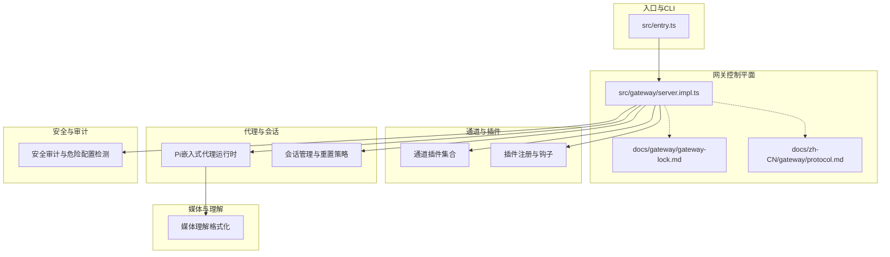
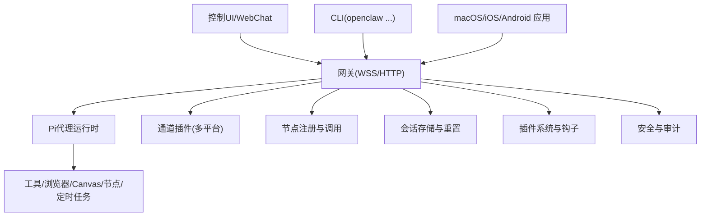
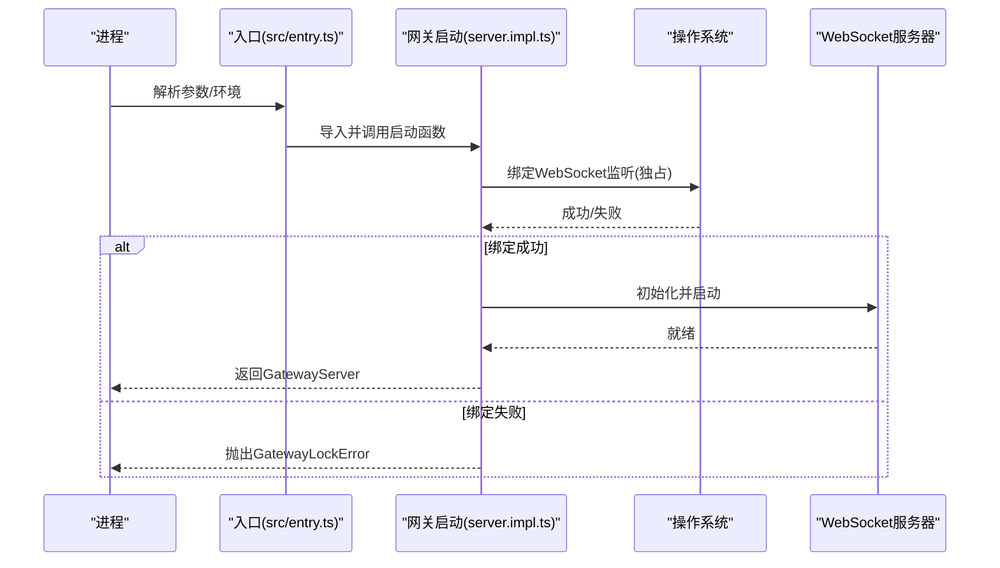
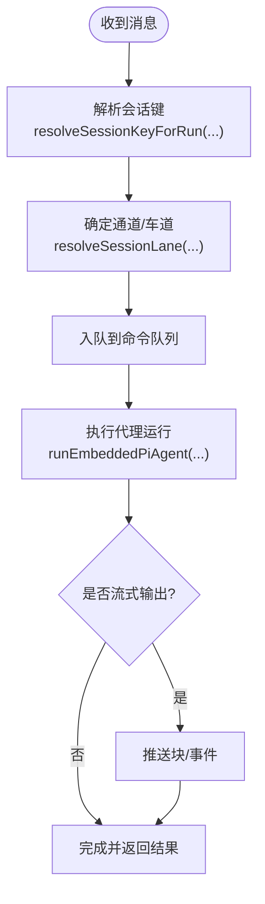
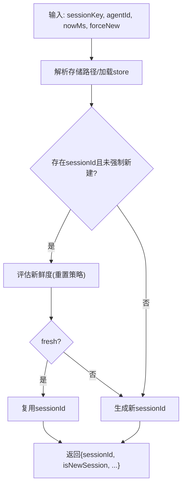
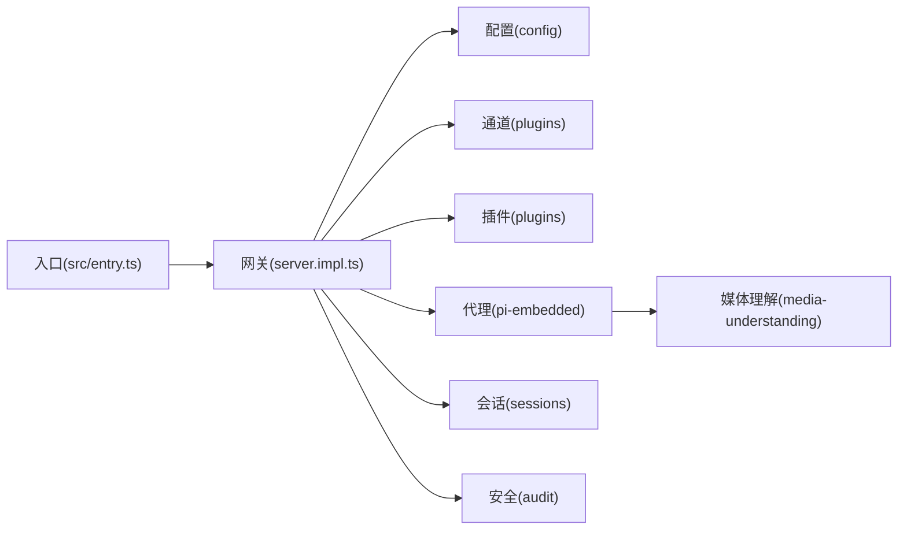

# 核心概念

<cite>
**本文引用的文件**
- [README.md](file://README.md)
- [VISION.md](file://VISION.md)
- [src/entry.ts](file://src/entry.ts)
- [src/gateway/server.ts](file://src/gateway/server.ts)
- [src/gateway/server.impl.ts](file://src/gateway/server.impl.ts)
- [docs/gateway/gateway-lock.md](file://docs/gateway/gateway-lock.md)
- [docs/zh-CN/gateway/gateway-lock.md](file://docs/zh-CN/gateway/gateway-lock.md)
- [docs/zh-CN/gateway/protocol.md](file://docs/zh-CN/gateway/protocol.md)
- [src/gateway/server.sessions.gateway-server-sessions-a.test.ts](file://src/gateway/server.sessions.gateway-server-sessions-a.test.ts)
- [src/gateway/hooks.ts](file://src/gateway/hooks.ts)
- [src/gateway/session-utils.test.ts](file://src/gateway/session-utils.test.ts)
- [src/cron/isolated-agent/session.ts](file://src/cron/isolated-agent/session.ts)
- [src/config/sessions/reset.ts](file://src/config/sessions/reset.ts)
- [src/config/sessions/sessions.test.ts](file://src/config/sessions/sessions.test.ts)
- [src/gateway/sessions-patch.test.ts](file://src/gateway/sessions-patch.test.ts)
- [src/auto-reply/reply/session.ts](file://src/auto-reply/reply/session.ts)
- [src/agents/pi-embedded-runner/lanes.ts](file://src/agents/pi-embedded-runner/lanes.ts)
- [src/agents/pi-extensions/session-manager-runtime-registry.ts](file://src/agents/pi-extensions/session-manager-runtime-registry.ts)
- [src/commands/status.command.ts](file://src/commands/status.command.ts)
- [src/imessage/client.ts](file://src/imessage/client.ts)
- [src/commands/node-daemon-runtime.ts](file://src/commands/node-daemon-runtime.ts)
- [docs/channels/groups.md](file://docs/channels/groups.md)
- [docs/zh-CN/channels/groups.md](file://docs/zh-CN/channels/groups.md)
- [src/media-understanding/format.ts](file://src/media-understanding/format.ts)
- [src/media-understanding/apply.test.ts](file://src/media-understanding/apply.test.ts)
- [src/security/audit-extra.sync.ts](file://src/security/audit-extra.sync.ts)
- [src/security/audit.test.ts](file://src/security/audit.test.ts)
- [src/config/config.sandbox-docker.test.ts](file://src/config/config.sandbox-docker.test.ts)
</cite>

## 目录

1. [引言](#引言)
2. [项目结构](#项目结构)
3. [核心组件](#核心组件)
4. [架构总览](#架构总览)
5. [详细组件分析](#详细组件分析)
6. [依赖分析](#依赖分析)
7. [性能考虑](#性能考虑)
8. [故障排查指南](#故障排查指南)
9. [结论](#结论)
10. [附录](#附录)

## 引言

本文件面向开发者与高级用户，系统化阐述 OpenClaw 的核心概念与设计理念。OpenClaw 是一款“本地优先”的个人 AI 助手，强调安全、可控与可扩展。其核心在于“网关系统”作为统一控制平面，承载会话管理、通道接入、工具调度、节点能力与安全策略，并通过 WebSocket 协议对外暴露完整 API。本文将从架构模式、关键术语、数据流与设计原则出发，深入解释网关工作原理、代理循环机制、会话管理、消息路由与安全模型，帮助读者建立对系统内部机制的全面认知。

## 项目结构

OpenClaw 采用模块化分层组织：入口与 CLI、网关服务、通道插件、代理运行时、会话与任务调度、媒体与理解、安全审计、以及文档与示例。核心入口负责环境初始化、参数解析与 CLI 启动；网关负责服务生命周期、认证授权、协议处理与子系统编排；通道与插件提供多渠道接入；代理运行时负责推理与工具调用；会话与任务负责状态持久化与并发控制；媒体与理解负责多模态输入处理；安全审计贯穿配置与运行期检查。

图示来源

- [src/entry.ts](file://src/entry.ts#L1-L144)
- [src/gateway/server.impl.ts](file://src/gateway/server.impl.ts#L1-L200)
- [docs/gateway/gateway-lock.md](file://docs/gateway/gateway-lock.md#L1-L35)
- [docs/zh-CN/gateway/protocol.md](file://docs/zh-CN/gateway/protocol.md#L199-L221)

章节来源

- [README.md](file://README.md#L185-L240)
- [src/entry.ts](file://src/entry.ts#L1-L144)
- [src/gateway/server.impl.ts](file://src/gateway/server.impl.ts#L1-L200)

## 核心组件

- 网关（Gateway）：WebSocket 控制平面，统一承载会话、通道、工具、事件与 UI 表面；提供完整 API（状态、通道、模型、聊天、代理、会话、节点、审批等）。
- 会话（Session）：以键空间隔离不同上下文（主会话、群组、线程、按发送者等），支持重置策略、并发与持久化。
- 代理（Agent）：Pi 嵌入式代理运行时，支持消息队列、并发通道、流式输出与工具调用。
- 通道（Channel）：多平台接入（WhatsApp、Telegram、Slack、Discord、Google Chat、Signal、iMessage、BlueBubbles、Microsoft Teams、Matrix、Zalo、WebChat 等），统一路由到会话。
- 节点（Node）：设备节点（macOS/iOS/Android）通过网关协议进行能力声明与调用（如系统命令、通知、Canvas、相机、屏幕录制、位置等）。
- 媒体理解（Media Understanding）：对图像、音频、视频进行理解与格式化输出，支持多模态组合。
- 安全与审计（Security & Audit）：默认安全策略、沙箱隔离、危险配置检测与修复建议。

章节来源

- [README.md](file://README.md#L126-L177)
- [src/gateway/server.impl.ts](file://src/gateway/server.impl.ts#L1-L200)
- [src/gateway/server.ts](file://src/gateway/server.ts#L1-L4)

## 架构总览

OpenClaw 的架构以“网关控制平面 + 多通道接入 + 代理运行时 + 会话与任务 + 媒体理解 + 安全审计”为核心。网关通过 WebSocket 对外暴露 API，内部编排通道、代理、节点、插件与资源。系统强调本地优先与安全可控，默认最小权限，必要时通过沙箱与显式授权提升能力。

图示来源

- [README.md](file://README.md#L185-L240)
- [src/gateway/server.impl.ts](file://src/gateway/server.impl.ts#L1-L200)

## 详细组件分析

### 网关系统（Gateway）

- 单实例保护：启动时通过独占 TCP 监听器绑定 WebSocket 端口，避免重复实例；失败时抛出明确错误，崩溃后自动释放端口。
- 协议与范围：暴露完整 Gateway API，支持设备身份与配对、TLS 与证书指纹固定、范围控制。
- 生命周期与编排：加载配置、启动子系统（通道、插件、健康、诊断、发现、Tailscale）、挂载方法处理器、建立 WS 运行时。
- 认证与速率限制：支持多种认证模式与浏览器专用速率限制策略。

图示来源

- [src/entry.ts](file://src/entry.ts#L1-L144)
- [src/gateway/server.impl.ts](file://src/gateway/server.impl.ts#L195-L200)
- [docs/gateway/gateway-lock.md](file://docs/gateway/gateway-lock.md#L19-L29)
- [docs/zh-CN/gateway/gateway-lock.md](file://docs/zh-CN/gateway/gateway-lock.md#L26-L31)

章节来源

- [docs/gateway/gateway-lock.md](file://docs/gateway/gateway-lock.md#L1-L35)
- [docs/zh-CN/gateway/protocol.md](file://docs/zh-CN/gateway/protocol.md#L199-L221)
- [src/gateway/server.impl.ts](file://src/gateway/server.impl.ts#L1-L200)

### 代理循环机制（Agent Loop）

- 并发通道与消息队列：代理运行时基于命令通道与队列实现并发控制，支持会话级与全局级通道。
- 会话键解析：根据消息上下文解析目标会话键，支持主会话、群组、线程与按发送者隔离。
- 运行时注册表：会话级运行时注册表确保对象生命周期与会话绑定，避免跨会话泄漏。
- 嵌入式代理：提供消息入队、运行、中断、压缩与流式输出等能力。

图示来源

- [src/agents/pi-embedded-runner/lanes.ts](file://src/agents/pi-embedded-runner/lanes.ts#L1-L15)
- [src/auto-reply/reply/session.ts](file://src/auto-reply/reply/session.ts#L165-L191)
- [src/agents/pi-extensions/session-manager-runtime-registry.ts](file://src/agents/pi-extensions/session-manager-runtime-registry.ts#L1-L29)

章节来源

- [src/agents/pi-embedded-runner/lanes.ts](file://src/agents/pi-embedded-runner/lanes.ts#L1-L15)
- [src/auto-reply/reply/session.ts](file://src/auto-reply/reply/session.ts#L165-L191)
- [src/agents/pi-extensions/session-manager-runtime-registry.ts](file://src/agents/pi-extensions/session-manager-runtime-registry.ts#L1-L29)

### 会话管理系统（Sessions）

- 会话键与作用域：支持全局、主会话与按发送者隔离；群组/线程使用特定键前缀；主别名映射到规范键。
- 重置策略：按日/空闲重置，区分直接对话、群组与线程场景；支持强制新建会话。
- 存储与并发：会话存储采用 Promise 链互斥，保证并发更新不丢失；支持会话补丁（thinkingLevel、verboseLevel、sendPolicy、groupActivation 等）。
- Hook 会话键归一：在钩子分发时规范化会话键，避免跨代理歧义。

图示来源

- [src/cron/isolated-agent/session.ts](file://src/cron/isolated-agent/session.ts#L1-L41)
- [src/config/sessions/reset.ts](file://src/config/sessions/reset.ts#L1-L50)
- [src/gateway/session-utils.test.ts](file://src/gateway/session-utils.test.ts#L117-L160)
- [src/gateway/hooks.ts](file://src/gateway/hooks.ts#L335-L352)

章节来源

- [src/gateway/server.sessions.gateway-server-sessions-a.test.ts](file://src/gateway/server.sessions.gateway-server-sessions-a.test.ts#L315-L350)
- [src/gateway/sessions-patch.test.ts](file://src/gateway/sessions-patch.test.ts#L293-L379)
- [src/config/sessions/sessions.test.ts](file://src/config/sessions/sessions.test.ts#L140-L177)
- [src/gateway/session-utils.test.ts](file://src/gateway/session-utils.test.ts#L117-L160)
- [src/gateway/hooks.ts](file://src/gateway/hooks.ts#L335-L352)

### 消息路由机制（Message Routing）

- 通道到会话：通道插件将消息转换为统一上下文，按规则路由到目标会话键；群组/线程/私聊采用不同键策略。
- 群组激活与策略：支持“提及激活”、“总是激活”等策略；群组会话跳过心跳，避免干扰。
- 会话键规范化：在钩子与跨代理场景中，确保会话键一致性与目标代理正确性。

章节来源

- [docs/channels/groups.md](file://docs/channels/groups.md#L41-L66)
- [docs/zh-CN/channels/groups.md](file://docs/zh-CN/channels/groups.md#L47-L74)
- [src/gateway/hooks.ts](file://src/gateway/hooks.ts#L335-L352)

### 多模态媒体理解（Media Understanding）

- 输入与理解：对图像、音频、视频分别进行描述/转录/总结，支持多模态组合。
- 输出格式化：按类型与数量生成结构化文本，支持单一与多路输出格式。
- 测试覆盖：测试用例覆盖混合媒体顺序、转录合并与格式化输出。

章节来源

- [src/media-understanding/format.ts](file://src/media-understanding/format.ts#L47-L98)
- [src/media-understanding/apply.test.ts](file://src/media-understanding/apply.test.ts#L146-L710)

### 安全与审计（Security & Audit）

- 默认安全策略：工具在主会话运行，群组/通道会话可启用沙箱隔离；默认允许列表与拒绝列表明确。
- 危险配置检测：检测容器危险挂载、网络模式、Seccomp/AppArmor 配置等，提供修复建议。
- 配置校验：对沙箱 Docker 配置进行严格校验，仅接受安全的挂载与镜像设置。

章节来源

- [README.md](file://README.md#L332-L339)
- [src/security/audit-extra.sync.ts](file://src/security/audit-extra.sync.ts#L726-L794)
- [src/security/audit.test.ts](file://src/security/audit.test.ts#L868-L929)
- [src/config/config.sandbox-docker.test.ts](file://src/config/config.sandbox-docker.test.ts#L1-L43)

### 设备节点与权限（Nodes & Permissions）

- 设备身份与配对：节点通过稳定的设备身份与网关颁发令牌进行配对；本地连接可自动批准。
- 权限模型：macOS TCC 权限与会话级提升权限结合；支持系统命令、通知、Canvas、相机、屏幕录制、位置等能力。
- 节点调用：通过 node.invoke 路由到设备节点，遵循权限与安全策略。

章节来源

- [docs/zh-CN/gateway/protocol.md](file://docs/zh-CN/gateway/protocol.md#L199-L221)
- [src/imessage/client.ts](file://src/imessage/client.ts#L48-L194)
- [src/commands/node-daemon-runtime.ts](file://src/commands/node-daemon-runtime.ts#L1-L16)

## 依赖分析

- 入口到网关：入口模块负责环境与参数准备，随后导入并启动网关；网关内部依赖配置、通道、插件、代理、会话、安全与 UI 资产。
- 网关到子系统：网关通过方法列表与运行时处理器挂载各子系统；通道与插件解耦，便于扩展。
- 会话与代理：代理运行时依赖会话键解析与通道调度；会话存储提供并发控制与持久化。
- 媒体理解：媒体理解模块独立于代理，但被代理在理解阶段使用；测试覆盖完善。
- 安全审计：贯穿配置加载与运行期检查，形成闭环。

图示来源

- [src/entry.ts](file://src/entry.ts#L1-L144)
- [src/gateway/server.impl.ts](file://src/gateway/server.impl.ts#L1-L200)

章节来源

- [src/entry.ts](file://src/entry.ts#L1-L144)
- [src/gateway/server.impl.ts](file://src/gateway/server.impl.ts#L1-L200)

## 性能考虑

- 单实例绑定：通过独占监听避免端口竞争与重复实例，减少资源浪费与冲突。
- 并发与队列：代理运行时采用命令队列与通道并发，避免阻塞；会话存储互斥保障一致性。
- 重置策略：按日/空闲重置降低长期会话的上下文膨胀；群组/线程场景采用更短生命周期。
- 媒体理解：多模态理解按需触发，输出格式化减少冗余传输。
- 安全与审计：在启动与运行期进行配置校验，避免低效或危险配置导致的性能回退。

## 故障排查指南

- 网关端口占用：若启动报错提示端口被占用，确认是否存在其他实例；可通过指定端口或释放端口解决。
- 网关单实例保护：若出现“另一个网关实例已在监听”错误，检查进程是否异常退出未释放端口；系统会在崩溃后自动释放。
- 会话状态异常：通过 sessions.list 与 sessions.patch 接口查看与调整会话参数（如 thinkingLevel、verboseLevel、sendPolicy、groupActivation）。
- 媒体理解失败：检查媒体类型与路径，确认理解模块已启用对应 Provider；查看格式化输出是否符合预期。
- 安全配置问题：运行安全审计，修正危险配置（如危险挂载、网络模式、Seccomp/AppArmor）。

章节来源

- [docs/gateway/gateway-lock.md](file://docs/gateway/gateway-lock.md#L26-L29)
- [src/gateway/server.sessions.gateway-server-sessions-a.test.ts](file://src/gateway/server.sessions.gateway-server-sessions-a.test.ts#L315-L350)
- [src/gateway/sessions-patch.test.ts](file://src/gateway/sessions-patch.test.ts#L293-L379)
- [src/media-understanding/format.ts](file://src/media-understanding/format.ts#L47-L98)
- [src/security/audit.test.ts](file://src/security/audit.test.ts#L868-L929)

## 结论

OpenClaw 以“网关控制平面”为核心，构建了安全、可控、可扩展的个人 AI 助手体系。通过严格的会话隔离、代理并发与队列调度、多模态媒体理解与全面的安全审计，系统在本地优先的前提下实现了强大的跨平台与多通道能力。开发者可基于本文档理解系统边界、组件交互与消息路由，从而高效扩展与集成。

## 附录

- 术语速览
  - 网关：控制平面，提供 WebSocket/HTTP API。
  - 会话：上下文隔离单元，键空间区分主/群组/线程/按发送者。
  - 代理：推理与工具调用执行单元，支持并发与流式输出。
  - 通道：多平台接入抽象，统一路由到会话。
  - 节点：设备侧能力与动作的远程执行单元。
  - 媒体理解：对图像/音频/视频的理解与格式化输出。
  - 安全审计：配置与运行期安全检查与修复建议。

章节来源

- [README.md](file://README.md#L126-L177)
- [VISION.md](file://VISION.md#L41-L84)
