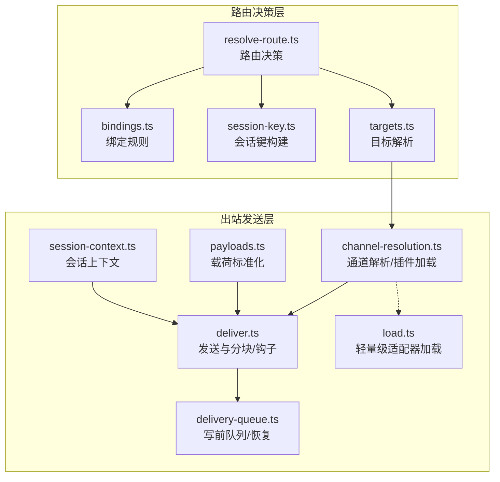
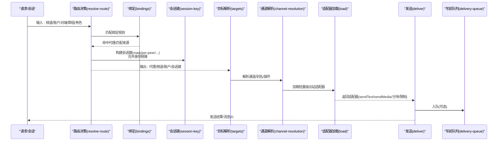
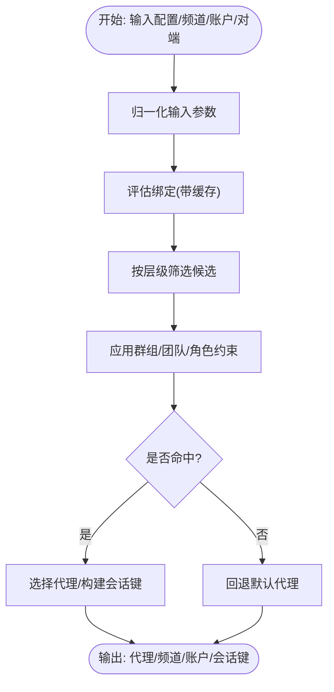
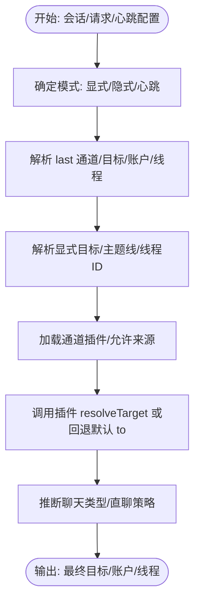
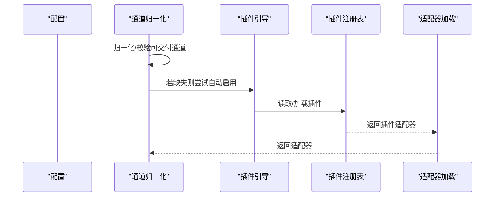
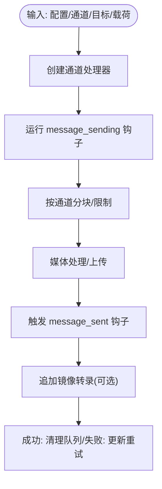
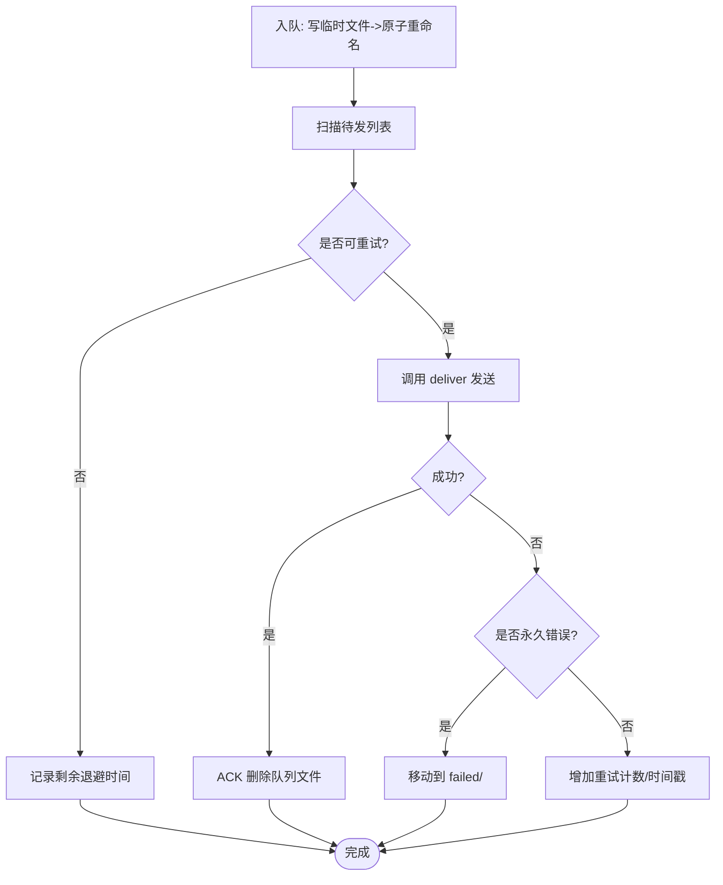
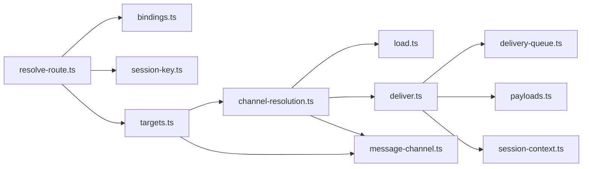

# 消息路由

<cite>
**本文引用的文件**
- [src/routing/resolve-route.ts](file://src/routing/resolve-route.ts)
- [src/routing/bindings.ts](file://src/routing/bindings.ts)
- [src/routing/session-key.ts](file://src/routing/session-key.ts)
- [src/infra/outbound/targets.ts](file://src/infra/outbound/targets.ts)
- [src/infra/outbound/channel-resolution.ts](file://src/infra/outbound/channel-resolution.ts)
- [src/infra/outbound/deliver.ts](file://src/infra/outbound/deliver.ts)
- [src/infra/outbound/delivery-queue.ts](file://src/infra/outbound/delivery-queue.ts)
- [src/infra/outbound/payloads.ts](file://src/infra/outbound/payloads.ts)
- [src/infra/outbound/session-context.ts](file://src/infra/outbound/session-context.ts)
- [src/utils/message-channel.ts](file://src/utils/message-channel.ts)
- [src/channels/plugins/outbound/load.ts](file://src/channels/plugins/outbound/load.ts)
- [src/gateway/server-node-events.ts](file://src/gateway/server-node-events.ts)
- [src/agents/failover-error.ts](file://src/agents/failover-error.ts)
- [src/infra/outbound/outbound.test.ts](file://src/infra/outbound/outbound.test.ts)
</cite>

## 目录

1. [简介](#简介)
2. [项目结构](#项目结构)
3. [核心组件](#核心组件)
4. [架构总览](#架构总览)
5. [详细组件分析](#详细组件分析)
6. [依赖关系分析](#依赖关系分析)
7. [性能考量](#性能考量)
8. [故障排除指南](#故障排除指南)
9. [结论](#结论)
10. [附录](#附录)

## 简介

本文件面向OpenClaw消息路由系统，系统性阐述消息从接收、解析、路由决策到发送的完整流程；解释频道间的消息转换、协议适配与格式标准化；说明消息队列、重试与失败处理、故障转移策略；并给出配置要点、性能优化建议与监控指标，以及调试与排障方法。

## 项目结构

OpenClaw的消息路由由“路由决策层”和“出站发送层”构成：

- 路由决策层：根据会话上下文、绑定规则、聊天类型等确定目标通道与收件人，并生成会话键。
- 出站发送层：将消息载荷标准化后，按通道适配器进行分块、格式化、媒体处理与发送；通过写前队列保证可靠性。

图表来源

- [src/routing/resolve-route.ts](file://src/routing/resolve-route.ts#L291-L443)
- [src/routing/bindings.ts](file://src/routing/bindings.ts#L16-L18)
- [src/routing/session-key.ts](file://src/routing/session-key.ts#L106-L162)
- [src/infra/outbound/targets.ts](file://src/infra/outbound/targets.ts#L64-L167)
- [src/infra/outbound/channel-resolution.ts](file://src/infra/outbound/channel-resolution.ts#L61-L79)
- [src/infra/outbound/deliver.ts](file://src/infra/outbound/deliver.ts#L230-L288)
- [src/infra/outbound/delivery-queue.ts](file://src/infra/outbound/delivery-queue.ts#L81-L108)
- [src/infra/outbound/payloads.ts](file://src/infra/outbound/payloads.ts#L43-L77)
- [src/infra/outbound/session-context.ts](file://src/infra/outbound/session-context.ts#L19-L37)
- [src/channels/plugins/outbound/load.ts](file://src/channels/plugins/outbound/load.ts#L13-L17)

章节来源

- [src/routing/resolve-route.ts](file://src/routing/resolve-route.ts#L1-L444)
- [src/infra/outbound/targets.ts](file://src/infra/outbound/targets.ts#L1-L550)

## 核心组件

- 路由决策（resolve-route）：基于绑定规则、账户、群组/团队角色、频道与对端信息，选择代理与会话键，并输出匹配来源，便于审计与调试。
- 目标解析（targets）：将请求的目标规范化，支持“上一次”回溯、主题线（Telegram topic）解析、心跳目标推断与允许来源校验。
- 通道解析与插件加载（channel-resolution）：标准化通道名，按需引导插件自动启用并加载对应出站适配器。
- 发送与分块（deliver）：按通道适配器进行文本分块、Markdown表格模式、Signal样式分块、媒体上传与发送；支持插件钩子（message_sending/message_sent）。
- 写前队列与恢复（delivery-queue）：持久化待发消息，指数退避重试，超过最大重试次数或永久错误移入失败目录。
- 载荷标准化（payloads）：合并媒体URL、解析指令、过滤静默/不可渲染载荷，统一输出格式。
- 会话上下文（session-context）：提供会话键与活跃代理ID，用于内部钩子与媒体根路径作用域。
- 通道工具（message-channel）：通道名归一化、内置通道集合、Markdown能力判定、网关通道枚举。

章节来源

- [src/routing/resolve-route.ts](file://src/routing/resolve-route.ts#L291-L443)
- [src/infra/outbound/targets.ts](file://src/infra/outbound/targets.ts#L170-L237)
- [src/infra/outbound/channel-resolution.ts](file://src/infra/outbound/channel-resolution.ts#L16-L79)
- [src/infra/outbound/deliver.ts](file://src/infra/outbound/deliver.ts#L230-L621)
- [src/infra/outbound/delivery-queue.ts](file://src/infra/outbound/delivery-queue.ts#L81-L394)
- [src/infra/outbound/payloads.ts](file://src/infra/outbound/payloads.ts#L43-L127)
- [src/infra/outbound/session-context.ts](file://src/infra/outbound/session-context.ts#L19-L37)
- [src/utils/message-channel.ts](file://src/utils/message-channel.ts#L55-L149)

## 架构总览

下图展示从“请求/会话上下文”到“插件适配器”的端到端路由与发送链路：

图表来源

- [src/routing/resolve-route.ts](file://src/routing/resolve-route.ts#L291-L443)
- [src/routing/bindings.ts](file://src/routing/bindings.ts#L16-L18)
- [src/routing/session-key.ts](file://src/routing/session-key.ts#L106-L162)
- [src/infra/outbound/targets.ts](file://src/infra/outbound/targets.ts#L64-L167)
- [src/infra/outbound/channel-resolution.ts](file://src/infra/outbound/channel-resolution.ts#L61-L79)
- [src/channels/plugins/outbound/load.ts](file://src/channels/plugins/outbound/load.ts#L13-L17)
- [src/infra/outbound/deliver.ts](file://src/infra/outbound/deliver.ts#L230-L288)
- [src/infra/outbound/delivery-queue.ts](file://src/infra/outbound/delivery-queue.ts#L81-L108)

## 详细组件分析

### 组件A：路由决策（resolve-route）

- 输入：配置、频道、账户、对端（含父线程）、群组/团队角色。
- 处理：缓存绑定评估、按优先级层级匹配（对端、父对端、群组+角色、群组、团队、账户、频道），返回代理ID、会话键、匹配来源。
- 输出：代理路由对象（含会话键、主会话键、匹配来源）。
- 关键点：支持线程父继承、默认代理回退、调试日志与匹配来源标注。

图表来源

- [src/routing/resolve-route.ts](file://src/routing/resolve-route.ts#L291-L443)

章节来源

- [src/routing/resolve-route.ts](file://src/routing/resolve-route.ts#L291-L443)
- [src/routing/bindings.ts](file://src/routing/bindings.ts#L16-L18)
- [src/routing/session-key.ts](file://src/routing/session-key.ts#L106-L162)

### 组件B：目标解析与心跳（targets）

- 功能：将“请求通道/显式目标/会话历史”整合为最终发送目标；支持“last”回溯、主题线解析、心跳目标推断、允许来源校验、直聊策略控制。
- 心跳目标：从配置或会话中解析，必要时推断聊天类型（直聊/群组/频道），并考虑允许来源回退。

图表来源

- [src/infra/outbound/targets.ts](file://src/infra/outbound/targets.ts#L64-L167)
- [src/infra/outbound/targets.ts](file://src/infra/outbound/targets.ts#L170-L237)
- [src/infra/outbound/targets.ts](file://src/infra/outbound/targets.ts#L239-L369)

章节来源

- [src/infra/outbound/targets.ts](file://src/infra/outbound/targets.ts#L64-L369)

### 组件C：通道解析与插件加载（channel-resolution）

- 功能：通道名归一化、可交付通道判定、插件自动启用与加载；首次解析失败时尝试引导插件加载，避免阻塞后续解析。
- 关联：与“消息通道工具”配合，确保通道名在内置通道与插件别名之间正确映射。

图表来源

- [src/infra/outbound/channel-resolution.ts](file://src/infra/outbound/channel-resolution.ts#L16-L79)
- [src/utils/message-channel.ts](file://src/utils/message-channel.ts#L55-L149)
- [src/channels/plugins/outbound/load.ts](file://src/channels/plugins/outbound/load.ts#L13-L17)

章节来源

- [src/infra/outbound/channel-resolution.ts](file://src/infra/outbound/channel-resolution.ts#L16-L79)
- [src/utils/message-channel.ts](file://src/utils/message-channel.ts#L55-L149)
- [src/channels/plugins/outbound/load.ts](file://src/channels/plugins/outbound/load.ts#L13-L17)

### 组件D：发送、分块与钩子（deliver）

- 功能：创建通道处理器（sendText/sendMedia/sendPayload），按通道限制进行文本分块与Markdown表格模式；支持Signal样式分块与媒体大小限制；执行发送前/后钩子；记录镜像转录。
- 错误处理：bestEffort模式下捕获单条载荷错误；Abort信号检测；失败时入队失败或更新重试计数。

图表来源

- [src/infra/outbound/deliver.ts](file://src/infra/outbound/deliver.ts#L230-L621)

章节来源

- [src/infra/outbound/deliver.ts](file://src/infra/outbound/deliver.ts#L230-L621)

### 组件E：写前队列与恢复（delivery-queue）

- 功能：入队持久化、ACK清理、失败重试、指数退避、最大重试阈值、永久错误识别、启动恢复扫描。
- 恢复：按最早入队优先，计算退避时间，超过预算中断并延后至下次启动。

图表来源

- [src/infra/outbound/delivery-queue.ts](file://src/infra/outbound/delivery-queue.ts#L81-L108)
- [src/infra/outbound/delivery-queue.ts](file://src/infra/outbound/delivery-queue.ts#L278-L376)

章节来源

- [src/infra/outbound/delivery-queue.ts](file://src/infra/outbound/delivery-queue.ts#L81-L394)

### 组件F：载荷标准化（payloads）

- 功能：解析回复指令、合并媒体URL、去重、静默/不可渲染过滤、统一输出结构；支持多媒体URL与单媒体URL自动切换。

章节来源

- [src/infra/outbound/payloads.ts](file://src/infra/outbound/payloads.ts#L43-L127)

### 组件G：会话上下文（session-context）

- 功能：从会话键解析代理ID，结合显式代理ID构建出站会话上下文，用于内部钩子与媒体本地根目录作用域。

章节来源

- [src/infra/outbound/session-context.ts](file://src/infra/outbound/session-context.ts#L19-L37)

### 组件H：通道工具（message-channel）

- 功能：通道名归一化、内置通道集合、Markdown能力判定、网关通道枚举、客户端类型判断。

章节来源

- [src/utils/message-channel.ts](file://src/utils/message-channel.ts#L55-L149)

## 依赖关系分析

- 路由决策依赖绑定与会话键工具，输出代理与会话键。
- 目标解析依赖通道解析与插件配置，输出最终发送目标。
- 发送层依赖适配器加载与写前队列，承载错误与钩子处理。
- 通道工具贯穿多处，提供通道名与能力判定。

图表来源

- [src/routing/resolve-route.ts](file://src/routing/resolve-route.ts#L291-L443)
- [src/routing/bindings.ts](file://src/routing/bindings.ts#L16-L18)
- [src/routing/session-key.ts](file://src/routing/session-key.ts#L106-L162)
- [src/infra/outbound/targets.ts](file://src/infra/outbound/targets.ts#L64-L167)
- [src/infra/outbound/channel-resolution.ts](file://src/infra/outbound/channel-resolution.ts#L61-L79)
- [src/channels/plugins/outbound/load.ts](file://src/channels/plugins/outbound/load.ts#L13-L17)
- [src/infra/outbound/deliver.ts](file://src/infra/outbound/deliver.ts#L230-L288)
- [src/infra/outbound/delivery-queue.ts](file://src/infra/outbound/delivery-queue.ts#L81-L108)
- [src/infra/outbound/payloads.ts](file://src/infra/outbound/payloads.ts#L43-L77)
- [src/infra/outbound/session-context.ts](file://src/infra/outbound/session-context.ts#L19-L37)
- [src/utils/message-channel.ts](file://src/utils/message-channel.ts#L55-L149)

## 性能考量

- 分块与限流：按通道适配器限制进行文本分块与媒体大小限制，减少单次发送失败与超时。
- 写前队列：通过磁盘持久化与最小化内存占用，降低崩溃丢失风险；指数退避减少对上游的压力。
- 缓存与预热：路由绑定评估结果弱缓存，避免重复计算；通道插件按需引导加载，减少冷启动成本。
- 并发与超时：发送层支持Abort信号与超时控制，避免长时间阻塞；钩子失败不影响整体发送。
- 日志与可观测：路由决策输出匹配来源，发送层记录消息发送事件与错误，便于定位瓶颈。

## 故障排除指南

- 常见错误分类：账单/限流/鉴权/超时/格式/连接异常等，依据状态码与错误消息进行故障原因分类。
- 永久错误识别：针对“无对话引用/用户不存在/被屏蔽/频道无效/未配置”等错误直接移入失败目录。
- 启动恢复：网关启动时扫描队列，按最早入队优先与退避策略恢复；超时预算内尽可能恢复。
- 网关节点事件：在需要回执时检查会话路由完整性，缺失路由时记录告警并跳过回执。
- 测试验证：队列生命周期（入队/确认/失败/移动失败）与失败场景（连接拒绝/移动失败）均有单元测试覆盖。

章节来源

- [src/agents/failover-error.ts](file://src/agents/failover-error.ts#L154-L196)
- [src/infra/outbound/delivery-queue.ts](file://src/infra/outbound/delivery-queue.ts#L380-L394)
- [src/gateway/server-node-events.ts](file://src/gateway/server-node-events.ts#L383-L421)
- [src/infra/outbound/outbound.test.ts](file://src/infra/outbound/outbound.test.ts#L45-L147)

## 结论

OpenClaw消息路由系统以“可扩展的通道适配器 + 可靠的写前队列 + 精细的路由与目标解析”为核心，实现了跨频道的一致性消息发送。通过绑定规则、会话键与心跳策略，系统在多账户、多群组/团队场景下仍能保持稳定与可追踪。配合钩子、镜像转录与可观测日志，开发者可以快速定位问题并优化性能。

## 附录

### 路由配置要点

- 绑定规则：按频道/账户/对端/群组/团队/角色设置代理映射，支持通配账户与默认代理回退。
- 会话键策略：直聊作用域（main/per-peer/per-channel-peer/per-account-channel-peer）影响会话收敛与并发控制。
- 心跳目标：支持“last/none/指定通道”，并可配置直聊策略与允许来源回退。

章节来源

- [src/routing/resolve-route.ts](file://src/routing/resolve-route.ts#L291-L443)
- [src/routing/session-key.ts](file://src/routing/session-key.ts#L106-L162)
- [src/infra/outbound/targets.ts](file://src/infra/outbound/targets.ts#L239-L369)

### 协议适配与格式标准化

- 文本分块：按通道适配器提供的分块器与模式（长度/段落/换行）进行分块。
- Markdown表格：Signal通道采用特定表格模式，其他通道遵循各自限制。
- 媒体处理：统一媒体URL去重与大小限制，逐个发送并保留首条作为回复引用。

章节来源

- [src/infra/outbound/deliver.ts](file://src/infra/outbound/deliver.ts#L317-L424)
- [src/infra/outbound/payloads.ts](file://src/infra/outbound/payloads.ts#L43-L127)

### 监控指标与调试

- 路由匹配来源：输出“binding.peer/binding.guild+roles/binding.account/…”，便于审计。
- 发送事件：message_sending/message_sent钩子事件与内容摘要，记录成功/失败与错误信息。
- 队列统计：恢复完成后的回收/失败/跳过/延迟数量，辅助容量规划。

章节来源

- [src/routing/resolve-route.ts](file://src/routing/resolve-route.ts#L435-L438)
- [src/infra/outbound/deliver.ts](file://src/infra/outbound/deliver.ts#L472-L510)
- [src/infra/outbound/delivery-queue.ts](file://src/infra/outbound/delivery-queue.ts#L285-L376)
