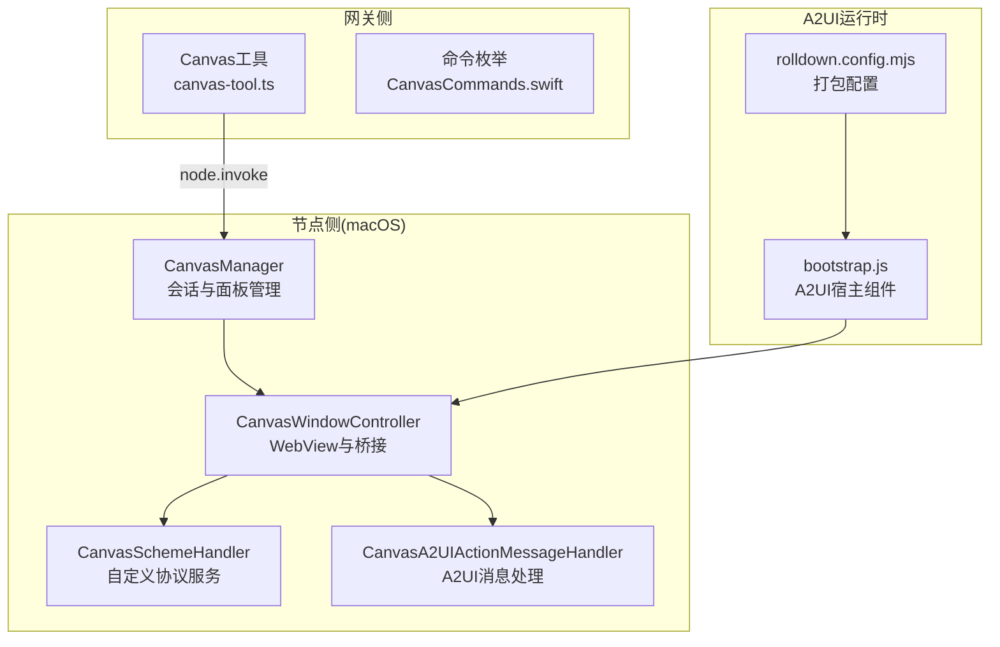
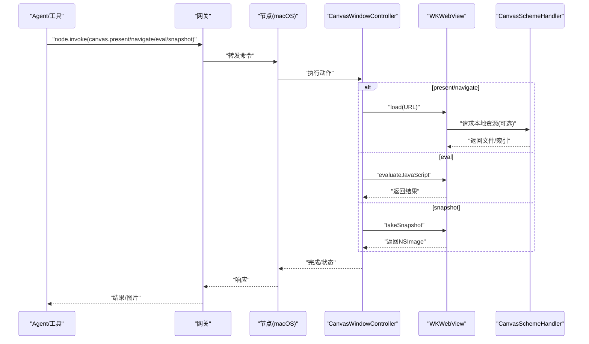
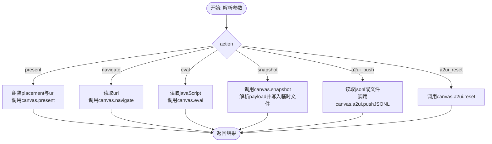
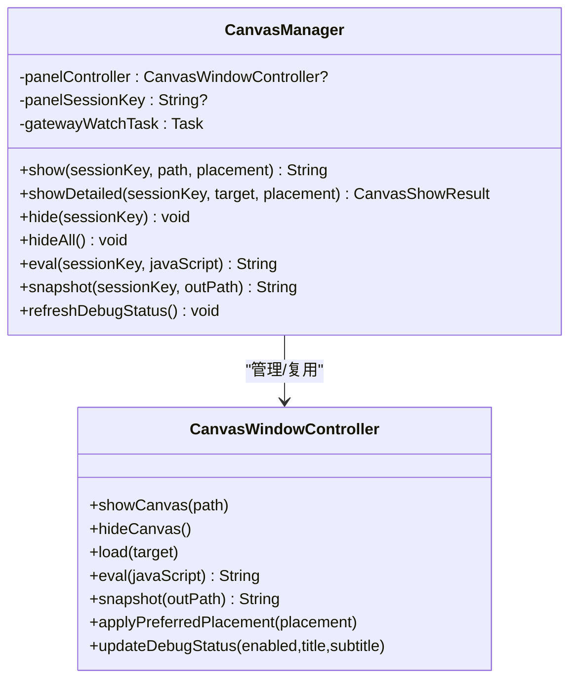
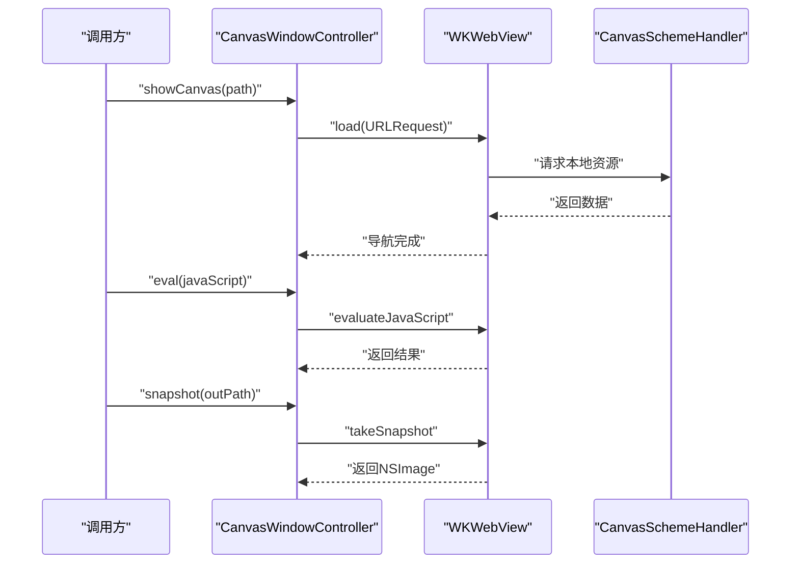
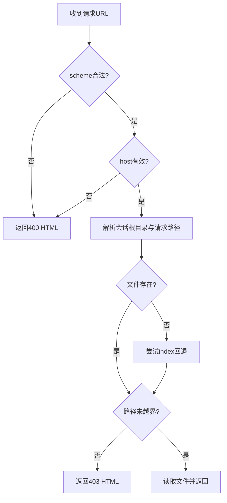
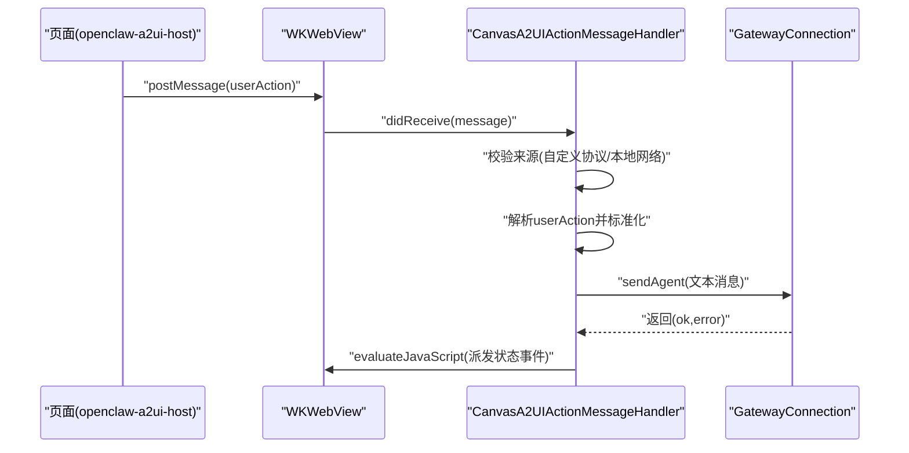
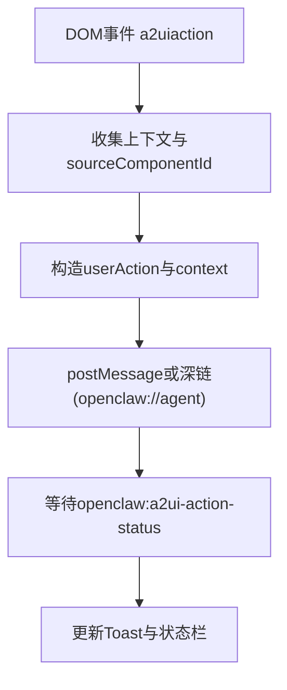
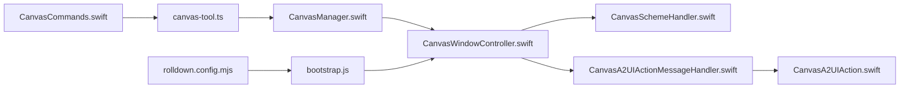

# Canvas控制

<cite>
**本文引用的文件**
- [skills/canvas/SKILL.md](file://skills/canvas/SKILL.md)
- [src/agents/tools/canvas-tool.ts](file://src/agents/tools/canvas-tool.ts)
- [apps/shared/OpenClawKit/Sources/OpenClawKit/CanvasCommands.swift](file://apps/shared/OpenClawKit/Sources/OpenClawKit/CanvasCommands.swift)
- [apps/macos/Sources/OpenClaw/CanvasManager.swift](file://apps/macos/Sources/OpenClaw/CanvasManager.swift)
- [apps/macos/Sources/OpenClaw/CanvasWindowController.swift](file://apps/macos/Sources/OpenClaw/CanvasWindowController.swift)
- [apps/macos/Sources/OpenClaw/CanvasWindow.swift](file://apps/macos/Sources/OpenClaw/CanvasWindow.swift)
- [apps/macos/Sources/OpenClaw/CanvasSchemeHandler.swift](file://apps/macos/Sources/OpenClaw/CanvasSchemeHandler.swift)
- [apps/macos/Sources/OpenClaw/CanvasA2UIActionMessageHandler.swift](file://apps/macos/Sources/OpenClaw/CanvasA2UIActionMessageHandler.swift)
- [apps/shared/OpenClawKit/Sources/OpenClawKit/CanvasA2UIAction.swift](file://apps/shared/OpenClawKit/Sources/OpenClawKit/CanvasA2UIAction.swift)
- [apps/shared/OpenClawKit/Tools/CanvasA2UI/bootstrap.js](file://apps/shared/OpenClawKit/Tools/CanvasA2UI/bootstrap.js)
- [apps/shared/OpenClawKit/Tools/CanvasA2UI/rolldown.config.mjs](file://apps/shared/OpenClawKit/Tools/CanvasA2UI/rolldown.config.mjs)
- [apps/macos/Sources/OpenClaw/CanvasWindowController+Window.swift](file://apps/macos/Sources/OpenClaw/CanvasWindowController+Window.swift)
- [apps/macos/Tests/OpenClawIPCTests/CanvasWindowSmokeTests.swift](file://apps/macos/Tests/OpenClawIPCTests/CanvasWindowSmokeTests.swift)
</cite>

## 目录

1. [简介](#简介)
2. [项目结构](#项目结构)
3. [核心组件](#核心组件)
4. [架构总览](#架构总览)
5. [详细组件分析](#详细组件分析)
6. [依赖关系分析](#依赖关系分析)
7. [性能考量](#性能考量)
8. [故障排查指南](#故障排查指南)
9. [结论](#结论)
10. [附录](#附录)

## 简介

本文件面向OpenClaw Canvas控制功能，系统化阐述Canvas可视化系统的架构、渲染引擎与交互控制，覆盖窗口管理、截图捕获、图像处理、绘图工具与标注、媒体理解、缩放与滚动、视口管理、事件处理与用户交互、以及与AI代理的集成（含A2UI消息桥接与自动导航）。文档以代码为依据，辅以多类Mermaid图示帮助读者快速建立整体认知。

## 项目结构

Canvas能力横跨“网关侧工具”“节点侧应用”“A2UI运行时”三层：

- 网关侧：Canvas工具负责解析动作参数并调用节点命令（呈现、隐藏、导航、执行脚本、截图、推送A2UI JSONL等）。
- 节点侧（macOS）：CanvasManager统一管理面板生命周期；CanvasWindowController承载WKWebView，实现加载、调试状态注入、截图、A2UI桥接与自动导航；CanvasSchemeHandler提供自定义协议文件服务；CanvasA2UIActionMessageHandler接收来自页面的A2UI动作并转发给网关。
- A2UI运行时：bootstrap.js提供A2UI宿主组件与消息处理器，支持主题、状态提示、Toast、消息推送与重置；rolldown.config.mjs用于打包生成a2ui.bundle.js供Canvas托管。

**图表来源**

- [src/agents/tools/canvas-tool.ts](file://src/agents/tools/canvas-tool.ts#L51-L181)
- [apps/shared/OpenClawKit/Sources/OpenClawKit/CanvasCommands.swift](file://apps/shared/OpenClawKit/Sources/OpenClawKit/CanvasCommands.swift#L3-L9)
- [apps/macos/Sources/OpenClaw/CanvasManager.swift](file://apps/macos/Sources/OpenClaw/CanvasManager.swift#L32-L114)
- [apps/macos/Sources/OpenClaw/CanvasWindowController.swift](file://apps/macos/Sources/OpenClaw/CanvasWindowController.swift#L26-L183)
- [apps/macos/Sources/OpenClaw/CanvasSchemeHandler.swift](file://apps/macos/Sources/OpenClaw/CanvasSchemeHandler.swift#L8-L41)
- [apps/macos/Sources/OpenClaw/CanvasA2UIActionMessageHandler.swift](file://apps/macos/Sources/OpenClaw/CanvasA2UIActionMessageHandler.swift#L7-L29)
- [apps/shared/OpenClawKit/Tools/CanvasA2UI/bootstrap.js](file://apps/shared/OpenClawKit/Tools/CanvasA2UI/bootstrap.js#L154-L491)
- [apps/shared/OpenClawKit/Tools/CanvasA2UI/rolldown.config.mjs](file://apps/shared/OpenClawKit/Tools/CanvasA2UI/rolldown.config.mjs#L20-L45)

**章节来源**

- [skills/canvas/SKILL.md](file://skills/canvas/SKILL.md#L1-L199)
- [src/agents/tools/canvas-tool.ts](file://src/agents/tools/canvas-tool.ts#L1-L181)
- [apps/macos/Sources/OpenClaw/CanvasManager.swift](file://apps/macos/Sources/OpenClaw/CanvasManager.swift#L1-L343)

## 核心组件

- Canvas工具（网关侧）
  - 支持动作：present、hide、navigate、eval、snapshot、a2ui_push、a2ui_reset。
  - 参数校验与默认值处理，调用网关节点invoke接口。
  - 截图返回图片结果，支持格式与尺寸参数。
- Canvas命令枚举（共享层）
  - 统一的命令字符串集合，便于跨平台一致性。
- CanvasManager（macOS）
  - 单例管理器，负责面板显示/隐藏、会话目录、锚定位置、调试状态注入、A2UI自动导航。
- CanvasWindowController（macOS）
  - 承载WKWebView，安装自定义协议处理器、A2UI桥接脚本、文件监视器；提供加载、执行JS、截图、可见性回调。
- CanvasSchemeHandler（macOS）
  - 自定义协议（CanvasScheme）文件服务，安全地映射请求路径到会话根目录，内置欢迎页与索引回退。
- CanvasA2UIActionMessageHandler（macOS）
  - 接收来自页面的A2UI动作消息，构造Agent消息文本，通过网关发送，并回传状态。
- A2UI运行时（Web）
  - bootstrap.js提供A2UI宿主组件、主题上下文、消息处理器、状态与Toast展示、消息推送与重置。
  - rolldown.config.mjs定义打包入口与别名，输出a2ui.bundle.js。

**章节来源**

- [src/agents/tools/canvas-tool.ts](file://src/agents/tools/canvas-tool.ts#L12-L50)
- [apps/shared/OpenClawKit/Sources/OpenClawKit/CanvasCommands.swift](file://apps/shared/OpenClawKit/Sources/OpenClawKit/CanvasCommands.swift#L3-L9)
- [apps/macos/Sources/OpenClaw/CanvasManager.swift](file://apps/macos/Sources/OpenClaw/CanvasManager.swift#L32-L114)
- [apps/macos/Sources/OpenClaw/CanvasWindowController.swift](file://apps/macos/Sources/OpenClaw/CanvasWindowController.swift#L26-L183)
- [apps/macos/Sources/OpenClaw/CanvasSchemeHandler.swift](file://apps/macos/Sources/OpenClaw/CanvasSchemeHandler.swift#L47-L106)
- [apps/macos/Sources/OpenClaw/CanvasA2UIActionMessageHandler.swift](file://apps/macos/Sources/OpenClaw/CanvasA2UIActionMessageHandler.swift#L18-L109)
- [apps/shared/OpenClawKit/Tools/CanvasA2UI/bootstrap.js](file://apps/shared/OpenClawKit/Tools/CanvasA2UI/bootstrap.js#L154-L491)
- [apps/shared/OpenClawKit/Tools/CanvasA2UI/rolldown.config.mjs](file://apps/shared/OpenClawKit/Tools/CanvasA2UI/rolldown.config.mjs#L20-L45)

## 架构总览

Canvas采用“网关-节点-WebView”的分层设计：

- 网关侧Canvas工具将动作转化为节点命令；
- 节点侧CanvasManager协调CanvasWindowController，后者通过WKWebView渲染内容；
- 自定义协议CanvasSchemeHandler提供本地文件服务，确保内容隔离与安全；
- A2UI消息通过MessageHandler与桥接脚本在页面与原生之间双向流转；
- 网关推送的Canvas主机URL触发A2UI自动导航。

**图表来源**

- [src/agents/tools/canvas-tool.ts](file://src/agents/tools/canvas-tool.ts#L73-L127)
- [apps/macos/Sources/OpenClaw/CanvasWindowController.swift](file://apps/macos/Sources/OpenClaw/CanvasWindowController.swift#L225-L265)
- [apps/macos/Sources/OpenClaw/CanvasSchemeHandler.swift](file://apps/macos/Sources/OpenClaw/CanvasSchemeHandler.swift#L15-L36)

**章节来源**

- [skills/canvas/SKILL.md](file://skills/canvas/SKILL.md#L13-L28)
- [apps/macos/Sources/OpenClaw/CanvasManager.swift](file://apps/macos/Sources/OpenClaw/CanvasManager.swift#L140-L172)

## 详细组件分析

### Canvas工具（网关侧）

- 动作路由：根据action分支执行不同逻辑，如present、navigate、eval、snapshot、a2ui_push、a2ui_reset。
- 参数处理：对placement、url、javaScript、outputFormat、maxWidth、quality、delayMs、jsonl/jsonlPath进行校验与转换。
- 截图流程：调用canvas.snapshot后解析payload，写入临时文件并返回图片结果。

**图表来源**

- [src/agents/tools/canvas-tool.ts](file://src/agents/tools/canvas-tool.ts#L81-L177)

**章节来源**

- [src/agents/tools/canvas-tool.ts](file://src/agents/tools/canvas-tool.ts#L51-L181)

### CanvasManager（会话与面板管理）

- 会话管理：按sessionKey创建/复用CanvasWindowController，支持首选放置与锚定。
- 显示/隐藏：根据目标路径决定是否导航；支持自动导航至A2UI主机URL。
- 调试状态：根据连接模式与状态更新WebView中的调试信息。
- 文件定位：根据有效目标推导直接URL、本地状态与Canvas URL。

**图表来源**

- [apps/macos/Sources/OpenClaw/CanvasManager.swift](file://apps/macos/Sources/OpenClaw/CanvasManager.swift#L8-L114)
- [apps/macos/Sources/OpenClaw/CanvasWindowController.swift](file://apps/macos/Sources/OpenClaw/CanvasWindowController.swift#L199-L215)

**章节来源**

- [apps/macos/Sources/OpenClaw/CanvasManager.swift](file://apps/macos/Sources/OpenClaw/CanvasManager.swift#L32-L114)

### CanvasWindowController（窗口与WebView）

- 初始化：构建WKWebView配置，安装自定义协议处理器与A2UI桥接脚本；注册A2UI消息处理器；启动文件监视器。
- 加载策略：支持http/https/file与Canvas自定义协议；对绝对路径存在性做容错；根路径回退至index.html或内置scaffold。
- 调试状态：向WebView注入调试状态函数，动态更新标题与副标题。
- 截图：调用WKWebView快照，编码为PNG并写出到指定路径或临时目录。
- 可见性回调：对外暴露onVisibilityChanged，便于上层联动。

**图表来源**

- [apps/macos/Sources/OpenClaw/CanvasWindowController.swift](file://apps/macos/Sources/OpenClaw/CanvasWindowController.swift#L199-L316)
- [apps/macos/Sources/OpenClaw/CanvasSchemeHandler.swift](file://apps/macos/Sources/OpenClaw/CanvasSchemeHandler.swift#L47-L106)

**章节来源**

- [apps/macos/Sources/OpenClaw/CanvasWindowController.swift](file://apps/macos/Sources/OpenClaw/CanvasWindowController.swift#L26-L183)
- [apps/macos/Sources/OpenClaw/CanvasWindowController+Window.swift](file://apps/macos/Sources/OpenClaw/CanvasWindowController+Window.swift#L7-L20)

### CanvasSchemeHandler（自定义协议文件服务）

- 安全校验：禁止路径穿越，仅允许受控会话目录内的文件被访问。
- 路径映射：请求路径直接映射到会话根目录；支持目录索引回退（index.html/htm）。
- 搭配回退：当根目录无index时，返回内置scaffold页面或经典欢迎页。

**图表来源**

- [apps/macos/Sources/OpenClaw/CanvasSchemeHandler.swift](file://apps/macos/Sources/OpenClaw/CanvasSchemeHandler.swift#L47-L106)

**章节来源**

- [apps/macos/Sources/OpenClaw/CanvasSchemeHandler.swift](file://apps/macos/Sources/OpenClaw/CanvasSchemeHandler.swift#L15-L106)

### CanvasA2UIActionMessageHandler（A2UI消息桥接）

- 输入过滤：仅接受来自Canvas自定义协议或本地网络域（.local、.ts.net、.tailscale.net、私有IP段）的消息。
- 消息解析：从消息体提取userAction，标准化字段（id、name、surfaceId、componentId、context）。
- 上行转发：构造Agent消息文本，通过网关发送；在本地模式下激活网关进程。
- 状态回传：在主线程中向WebView注入自定义事件，携带成功/失败与错误信息。

**图表来源**

- [apps/macos/Sources/OpenClaw/CanvasA2UIActionMessageHandler.swift](file://apps/macos/Sources/OpenClaw/CanvasA2UIActionMessageHandler.swift#L18-L109)
- [apps/shared/OpenClawKit/Sources/OpenClawKit/CanvasA2UIAction.swift](file://apps/shared/OpenClawKit/Sources/OpenClawKit/CanvasA2UIAction.swift#L69-L81)

**章节来源**

- [apps/macos/Sources/OpenClaw/CanvasA2UIActionMessageHandler.swift](file://apps/macos/Sources/OpenClaw/CanvasA2UIActionMessageHandler.swift#L18-L109)
- [apps/shared/OpenClawKit/Sources/OpenClawKit/CanvasA2UIAction.swift](file://apps/shared/OpenClawKit/Sources/OpenClawKit/CanvasA2UIAction.swift#L40-L81)

### A2UI运行时（Web端）

- 组件与主题：提供A2UI宿主组件、主题上下文、样式与布局；支持Toast与状态提示。
- 消息处理：监听a2uiaction事件，收集上下文（literal与data path），构造userAction并发送到原生侧。
- 状态反馈：监听openclaw:a2ui-action-status事件，更新pendingAction状态与Toast。
- 打包配置：rolldown.config.mjs定义别名与输出路径，确保与Canvas托管一致。

**图表来源**

- [apps/shared/OpenClawKit/Tools/CanvasA2UI/bootstrap.js](file://apps/shared/OpenClawKit/Tools/CanvasA2UI/bootstrap.js#L333-L422)
- [apps/shared/OpenClawKit/Tools/CanvasA2UI/rolldown.config.mjs](file://apps/shared/OpenClawKit/Tools/CanvasA2UI/rolldown.config.mjs#L20-L45)

**章节来源**

- [apps/shared/OpenClawKit/Tools/CanvasA2UI/bootstrap.js](file://apps/shared/OpenClawKit/Tools/CanvasA2UI/bootstrap.js#L154-L491)
- [apps/shared/OpenClawKit/Tools/CanvasA2UI/rolldown.config.mjs](file://apps/shared/OpenClawKit/Tools/CanvasA2UI/rolldown.config.mjs#L20-L45)

## 依赖关系分析

- 命令契约：CanvasCommands.swift统一命令字符串，确保跨平台一致性。
- 窗口与容器：CanvasWindowController组合HoverChromeContainerView，支持面板与窗口两种呈现形态。
- 文件服务与安全：CanvasSchemeHandler严格限制文件访问范围，避免路径穿越。
- A2UI桥接：WKScriptMessageHandler与注入脚本形成闭环，保证消息来源可信与上下文完整。
- 自动导航：CanvasManager订阅网关推送，解析Canvas主机URL并自动导航至A2UI主机。

**图表来源**

- [apps/shared/OpenClawKit/Sources/OpenClawKit/CanvasCommands.swift](file://apps/shared/OpenClawKit/Sources/OpenClawKit/CanvasCommands.swift#L3-L9)
- [src/agents/tools/canvas-tool.ts](file://src/agents/tools/canvas-tool.ts#L73-L79)
- [apps/macos/Sources/OpenClaw/CanvasManager.swift](file://apps/macos/Sources/OpenClaw/CanvasManager.swift#L142-L172)
- [apps/macos/Sources/OpenClaw/CanvasWindowController.swift](file://apps/macos/Sources/OpenClaw/CanvasWindowController.swift#L169-L176)
- [apps/macos/Sources/OpenClaw/CanvasSchemeHandler.swift](file://apps/macos/Sources/OpenClaw/CanvasSchemeHandler.swift#L47-L106)
- [apps/macos/Sources/OpenClaw/CanvasA2UIActionMessageHandler.swift](file://apps/macos/Sources/OpenClaw/CanvasA2UIActionMessageHandler.swift#L18-L109)
- [apps/shared/OpenClawKit/Sources/OpenClawKit/CanvasA2UIAction.swift](file://apps/shared/OpenClawKit/Sources/OpenClawKit/CanvasA2UIAction.swift#L69-L81)
- [apps/shared/OpenClawKit/Tools/CanvasA2UI/bootstrap.js](file://apps/shared/OpenClawKit/Tools/CanvasA2UI/bootstrap.js#L154-L491)
- [apps/shared/OpenClawKit/Tools/CanvasA2UI/rolldown.config.mjs](file://apps/shared/OpenClawKit/Tools/CanvasA2UI/rolldown.config.mjs#L20-L45)

**章节来源**

- [apps/macos/Sources/OpenClaw/CanvasWindow.swift](file://apps/macos/Sources/OpenClaw/CanvasWindow.swift#L5-L26)
- [apps/macos/Sources/OpenClaw/CanvasWindowController+Window.swift](file://apps/macos/Sources/OpenClaw/CanvasWindowController+Window.swift#L7-L20)

## 性能考量

- 截图与编码：macOS端使用NSImage与NSBitmapImageRep进行PNG编码，建议在需要时限制maxWidth以降低内存占用与I/O开销。
- 文件监视：CanvasFileWatcher在本地Canvas会话目录启用，变更时触发reload，开发期提升迭代效率，但需注意频繁写入对磁盘的影响。
- WebView快照：takeSnapshot为同步阻塞操作，应在后台任务中执行，避免阻塞主线程。
- A2UI消息：消息体序列化与回传状态在主线程注入，应避免过大的contextJSON导致JS注入开销增大。

[本节为通用指导，不直接分析具体文件]

## 故障排查指南

- 白屏或内容不加载
  - 检查服务器绑定模式与节点期望的主机名是否匹配；使用curl验证URL可达。
  - 确认Canvas根目录存在且index.html可用，或使用内置scaffold作为回退。
- “node required”或“node not connected”
  - 确保在调用时提供有效的node参数，且节点处于在线状态。
- Live reload不生效
  - 检查canvasHost.liveReload配置、文件位于canvas root目录、查看日志中的watcher错误。
- A2UI动作未到达网关
  - 确认消息来源为Canvas自定义协议或本地网络域；检查注入脚本是否已安装；查看状态事件是否正确回传。
- 截图失败
  - 检查WebView快照返回值与编码流程；确认输出路径可写。

**章节来源**

- [skills/canvas/SKILL.md](file://skills/canvas/SKILL.md#L151-L199)
- [apps/macos/Sources/OpenClaw/CanvasSchemeHandler.swift](file://apps/macos/Sources/OpenClaw/CanvasSchemeHandler.swift#L47-L106)
- [apps/macos/Sources/OpenClaw/CanvasA2UIActionMessageHandler.swift](file://apps/macos/Sources/OpenClaw/CanvasA2UIActionMessageHandler.swift#L111-L147)

## 结论

OpenClaw Canvas通过清晰的分层设计实现了跨平台的可视化控制：网关侧工具统一动作语义，节点侧以WKWebView为核心承载渲染与交互，自定义协议保障内容安全与隔离，A2UI桥接打通页面与原生代理的通信。结合会话管理、自动导航与调试状态注入，Canvas为AI代理提供了稳定、可控且可扩展的可视化界面。

[本节为总结性内容，不直接分析具体文件]

## 附录

### Canvas窗口与呈现模式

- 面板模式：支持锚定到菜单栏或鼠标位置，适合悬浮窗场景。
- 窗口模式：标准窗口，适合全屏或独立工作流。

**章节来源**

- [apps/macos/Sources/OpenClaw/CanvasWindow.swift](file://apps/macos/Sources/OpenClaw/CanvasWindow.swift#L13-L26)
- [apps/macos/Sources/OpenClaw/CanvasWindowController+Window.swift](file://apps/macos/Sources/OpenClaw/CanvasWindowController+Window.swift#L7-L20)

### Canvas窗口生命周期测试

- 面板控制器：展示/隐藏/关闭、窗口移动与调整大小、eval与hide等行为的端到端验证。
- 窗口控制器：展示/关闭、窗口关闭通知、hide等行为验证。

**章节来源**

- [apps/macos/Tests/OpenClawIPCTests/CanvasWindowSmokeTests.swift](file://apps/macos/Tests/OpenClawIPCTests/CanvasWindowSmokeTests.swift#L10-L49)
