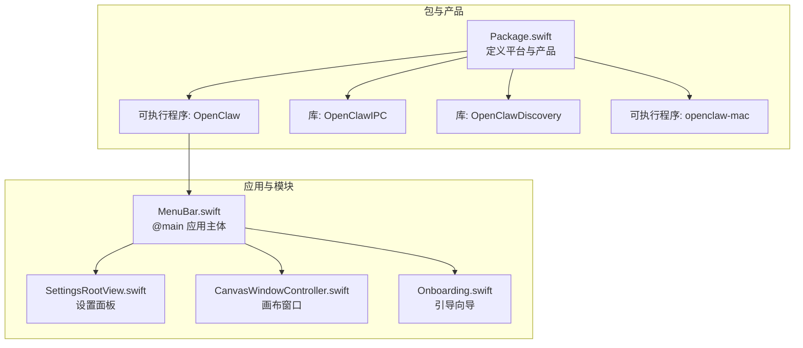
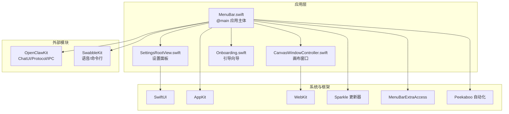
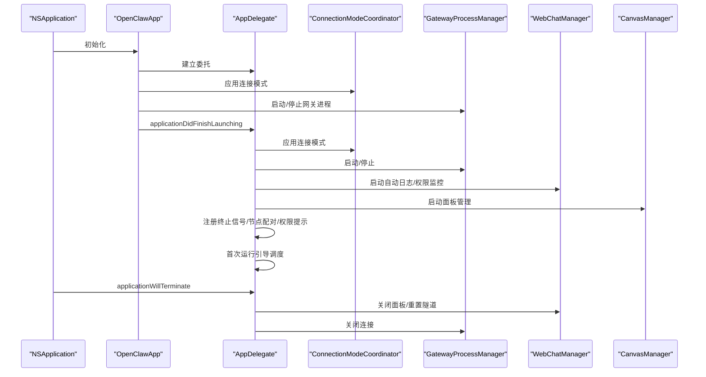
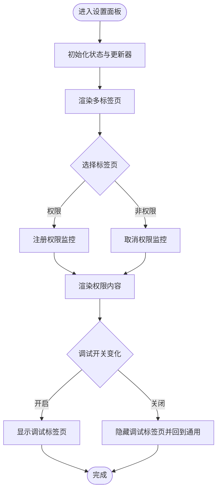
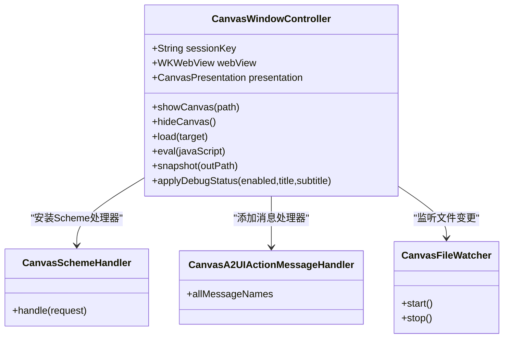
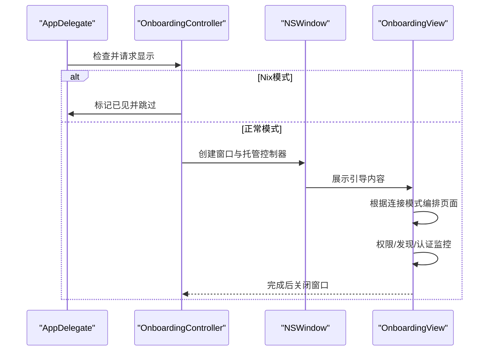
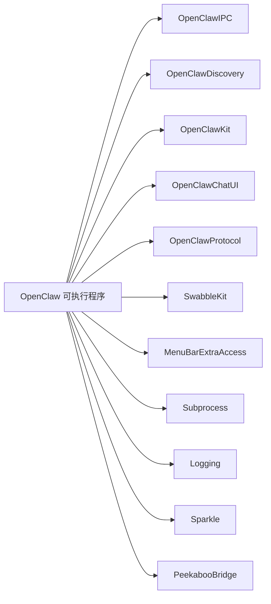

# macOS应用核心

<cite>
**本文档引用的文件**
- [apps/macos/Package.swift](file://apps/macos/Package.swift)
- [apps/macos/README.md](file://apps/macos/README.md)
- [apps/macos/Sources/OpenClaw/MenuBar.swift](file://apps/macos/Sources/OpenClaw/MenuBar.swift)
- [apps/macos/Sources/OpenClaw/CanvasWindowController.swift](file://apps/macos/Sources/OpenClaw/CanvasWindowController.swift)
- [apps/macos/Sources/OpenClaw/SettingsRootView.swift](file://apps/macos/Sources/OpenClaw/SettingsRootView.swift)
- [apps/macos/Sources/OpenClaw/Onboarding.swift](file://apps/macos/Sources/OpenClaw/Onboarding.swift)
</cite>

## 目录

1. [简介](#简介)
2. [项目结构](#项目结构)
3. [核心组件](#核心组件)
4. [架构总览](#架构总览)
5. [详细组件分析](#详细组件分析)
6. [依赖关系分析](#依赖关系分析)
7. [性能考虑](#性能考虑)
8. [故障排除指南](#故障排除指南)
9. [结论](#结论)
10. [附录](#附录)

## 简介

本文件面向OpenClaw macOS应用的核心功能与实现，聚焦以下主题：

- 应用的主要功能模块：菜单栏集成、系统托盘控制、设置面板、画布/网页容器、引导向导、权限与连接管理等
- 用户界面设计：菜单栏图标状态、悬浮HUD抑制、设置多标签页、画布窗口与锚定面板
- 启动流程、初始化过程与生命周期管理：AppDelegate应用级生命周期、菜单栏App主体、更新器控制器
- 窗口管理、多标签页系统与视图控制器架构：CanvasWindowController、SettingsRootView、OnboardingController
- 主题系统、自定义样式与响应式布局：基于SwiftUI的视图层次与尺寸约束
- 国际化支持、本地化配置与多语言切换机制：UI字符串集中管理与多语言文档
- 性能优化、内存管理与资源使用：并发模型、资源清理、自动重载与快照

## 项目结构

OpenClaw macOS应用位于apps/macos目录，采用Swift Package组织多目标产物（库与可执行程序），并包含菜单栏应用、IPC库、发现服务、CLI工具等模块。

**图表来源**

- [apps/macos/Package.swift](file://apps/macos/Package.swift#L6-L92)
- [apps/macos/Sources/OpenClaw/MenuBar.swift](file://apps/macos/Sources/OpenClaw/MenuBar.swift#L10-L92)
- [apps/macos/Sources/OpenClaw/SettingsRootView.swift](file://apps/macos/Sources/OpenClaw/SettingsRootView.swift#L4-L244)
- [apps/macos/Sources/OpenClaw/CanvasWindowController.swift](file://apps/macos/Sources/OpenClaw/CanvasWindowController.swift#L7-L372)
- [apps/macos/Sources/OpenClaw/Onboarding.swift](file://apps/macos/Sources/OpenClaw/Onboarding.swift#L13-L56)

**章节来源**

- [apps/macos/Package.swift](file://apps/macos/Package.swift#L1-L93)
- [apps/macos/README.md](file://apps/macos/README.md#L1-L65)

## 核心组件

- 菜单栏应用主体：负责菜单栏图标、状态项外观、悬停HUD抑制、设置面板、更新器控制器与应用生命周期
- 设置面板：多标签页设置界面，包含通用、通道、语音唤醒、配置、实例、会话、定时任务、技能、权限、调试、关于等
- 画布窗口控制器：基于WKWebView的画布容器，支持本地文件与自定义协议加载、自动重载、A2UI桥接、快照输出
- 引导向导：首次运行或版本升级时的交互式引导，包含连接模式选择、权限检查、Anthropic认证、工作区与聊天体验

**章节来源**

- [apps/macos/Sources/OpenClaw/MenuBar.swift](file://apps/macos/Sources/OpenClaw/MenuBar.swift#L10-L207)
- [apps/macos/Sources/OpenClaw/SettingsRootView.swift](file://apps/macos/Sources/OpenClaw/SettingsRootView.swift#L4-L176)
- [apps/macos/Sources/OpenClaw/CanvasWindowController.swift](file://apps/macos/Sources/OpenClaw/CanvasWindowController.swift#L7-L372)
- [apps/macos/Sources/OpenClaw/Onboarding.swift](file://apps/macos/Sources/OpenClaw/Onboarding.swift#L13-L185)

## 架构总览

OpenClaw macOS应用采用SwiftUI作为UI框架，结合AppKit与WebKit实现菜单栏集成、设置面板与画布容器。应用通过OpenClawKit与相关子模块提供聊天UI、协议与IPC能力；通过Sparkle实现更新器；通过MenuBarExtraAccess实现菜单栏集成；通过Peekaboo实现自动化桥接。

**图表来源**

- [apps/macos/Sources/OpenClaw/MenuBar.swift](file://apps/macos/Sources/OpenClaw/MenuBar.swift#L10-L92)
- [apps/macos/Sources/OpenClaw/SettingsRootView.swift](file://apps/macos/Sources/OpenClaw/SettingsRootView.swift#L4-L244)
- [apps/macos/Sources/OpenClaw/CanvasWindowController.swift](file://apps/macos/Sources/OpenClaw/CanvasWindowController.swift#L7-L372)
- [apps/macos/Sources/OpenClaw/Onboarding.swift](file://apps/macos/Sources/OpenClaw/Onboarding.swift#L13-L185)
- [apps/macos/Package.swift](file://apps/macos/Package.swift#L42-L57)

## 详细组件分析

### 菜单栏应用主体与生命周期

- 应用入口：@main结构体OpenClawApp，绑定AppDelegate，使用状态存储与网关连接协调器
- 菜单栏集成：MenuBarExtra提供菜单样式，状态项外观随暂停/睡眠状态变化
- 鼠标事件处理：自定义透明覆盖视图拦截点击与悬停，控制面板显示与菜单呈现
- 生命周期：应用启动时去重、应用激活策略、连接模式应用、信号监听、节点配对与权限提示、健康状态刷新、端口清理、Peekaboo桥启用、引导向导调度；退出时停止各类服务与隧道、关闭网关连接、停止Peekaboo桥
- 更新器：根据签名状态动态启用Sparkle或禁用更新器

**图表来源**

- [apps/macos/Sources/OpenClaw/MenuBar.swift](file://apps/macos/Sources/OpenClaw/MenuBar.swift#L254-L335)

**章节来源**

- [apps/macos/Sources/OpenClaw/MenuBar.swift](file://apps/macos/Sources/OpenClaw/MenuBar.swift#L10-L207)

### 设置面板与多标签页系统

- 多标签页：通用、通道、语音唤醒、配置、实例、会话、定时任务、技能、权限、调试、关于
- 响应式布局：固定窗口尺寸，垂直内边距与间距，TabView驱动内容切换
- 权限监控：仅在权限标签页时注册监控，避免不必要的开销
- 动态可见性：调试标签页按开关状态动态显示/隐藏

**图表来源**

- [apps/macos/Sources/OpenClaw/SettingsRootView.swift](file://apps/macos/Sources/OpenClaw/SettingsRootView.swift#L20-L176)

**章节来源**

- [apps/macos/Sources/OpenClaw/SettingsRootView.swift](file://apps/macos/Sources/OpenClaw/SettingsRootView.swift#L4-L244)

### 画布窗口与视图控制器架构

- 容器与导航：基于WKWebView的画布容器，支持锚定面板与普通窗口两种展示形式
- 协议与脚本：安装自定义URL Scheme处理器，注入A2UI动作桥接脚本，回传到原生代理循环
- 文件监听与自动重载：监听会话目录变更，自动重载当前页面（仅本地画布）
- 调试状态：动态设置调试状态标题/副标题，通过JS注入生效
- 快照输出：将Web内容转为PNG并写入指定路径
- 生命周期：初始化创建会话目录与配置，释放时移除消息处理器并停止文件监听

**图表来源**

- [apps/macos/Sources/OpenClaw/CanvasWindowController.swift](file://apps/macos/Sources/OpenClaw/CanvasWindowController.swift#L7-L372)

**章节来源**

- [apps/macos/Sources/OpenClaw/CanvasWindowController.swift](file://apps/macos/Sources/OpenClaw/CanvasWindowController.swift#L7-L372)

### 引导向导与首次运行体验

- 首次运行检测：基于版本号与用户偏好判断是否显示
- 窗口与样式：无边框标题栏、居中显示、临时显示Dock图标
- 页面编排：根据连接模式动态决定页面顺序（远程/本地/未配置），支持向导阻塞逻辑
- 权限与发现：内置权限监控与网关发现模型，支持剪贴板轮询与OAuth流程

**图表来源**

- [apps/macos/Sources/OpenClaw/Onboarding.swift](file://apps/macos/Sources/OpenClaw/Onboarding.swift#L13-L185)

**章节来源**

- [apps/macos/Sources/OpenClaw/Onboarding.swift](file://apps/macos/Sources/OpenClaw/Onboarding.swift#L13-L185)

## 依赖关系分析

- 包定义：目标产物包括OpenClaw（菜单栏应用）、OpenClawIPC（IPC库）、OpenClawDiscovery（发现服务）、OpenClawMacCLI（CLI）
- 外部依赖：MenuBarExtraAccess用于菜单栏集成、Subprocess用于进程管理、Logging用于日志、Sparkle用于更新、Peekaboo用于自动化桥接、OpenClawKit提供聊天UI/协议/IPC、Swabble提供语音与命令行能力
- 平台要求：最低macOS 15

**图表来源**

- [apps/macos/Package.swift](file://apps/macos/Package.swift#L26-L57)

**章节来源**

- [apps/macos/Package.swift](file://apps/macos/Package.swift#L1-L93)

## 性能考虑

- 并发模型：严格并发（StrictConcurrency）启用，确保线程安全与类型安全
- 资源清理：窗口控制器在析构时移除WKScript消息处理器并停止文件监听，避免泄漏
- 自动重载：仅在本地画布内容下触发重载，减少不必要刷新
- 快照编码：将图像转换为PNG并原子写入，保证一致性
- 更新器：开发/未签名构建禁用Sparkle以避免弹窗与验证开销
- 端口清理：启动时扫描并清理残留端口，降低冲突概率

**章节来源**

- [apps/macos/Package.swift](file://apps/macos/Package.swift#L30-L32)
- [apps/macos/Sources/OpenClaw/CanvasWindowController.swift](file://apps/macos/Sources/OpenClaw/CanvasWindowController.swift#L188-L193)
- [apps/macos/Sources/OpenClaw/MenuBar.swift](file://apps/macos/Sources/OpenClaw/MenuBar.swift#L368-L472)

## 故障排除指南

- 开发签名与库验证：若因Sparkle团队ID不匹配导致加载失败，可通过环境变量禁用库验证（仅限开发）
- 团队ID审计：打包后读取应用Bundle团队ID并与嵌入二进制对比，不一致则失败
- 首次运行引导：Nix模式下自动跳过引导；若需要重新显示，可通过调试动作重启
- 端口冲突：启动时进行端口清扫；如仍异常，检查连接模式与网关状态
- 权限问题：在权限标签页启用监控，检查麦克风、屏幕录制、辅助功能等权限状态

**章节来源**

- [apps/macos/README.md](file://apps/macos/README.md#L25-L65)
- [apps/macos/Sources/OpenClaw/Onboarding.swift](file://apps/macos/Sources/OpenClaw/Onboarding.swift#L18-L25)
- [apps/macos/Sources/OpenClaw/MenuBar.swift](file://apps/macos/Sources/OpenClaw/MenuBar.swift#L268-L318)

## 结论

OpenClaw macOS应用以菜单栏为核心入口，结合设置面板、画布容器与引导向导，形成完整的本地与远程连接体验。其架构清晰、模块职责明确，通过SwiftUI与AppKit实现响应式界面，并借助外部库完善功能边界。开发与发布流程提供了灵活的签名与验证选项，便于在不同阶段进行调试与分发。

## 附录

- 打包与签名：提供脚本与环境变量以支持快速打包、签名与库验证绕过
- 版本与更新：根据签名状态启用Sparkle更新器，支持自动检查与下载
- 国际化与本地化：UI字符串集中管理，多语言文档位于docs目录，便于扩展

**章节来源**

- [apps/macos/README.md](file://apps/macos/README.md#L17-L65)
- [apps/macos/Sources/OpenClaw/MenuBar.swift](file://apps/macos/Sources/OpenClaw/MenuBar.swift#L368-L472)
