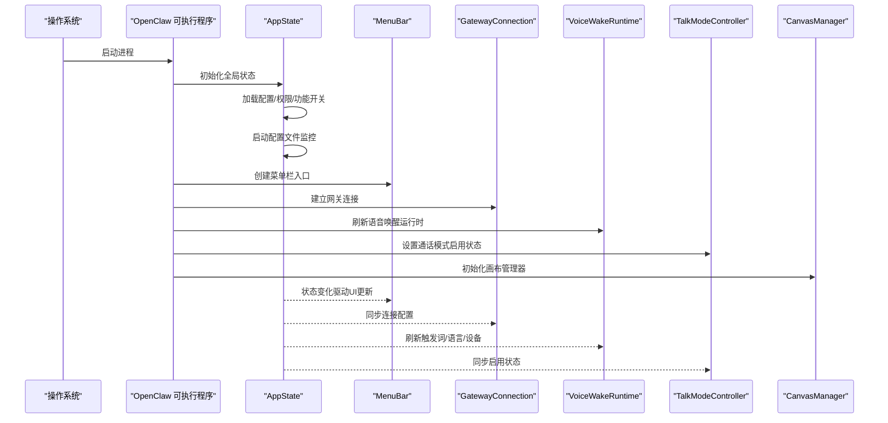
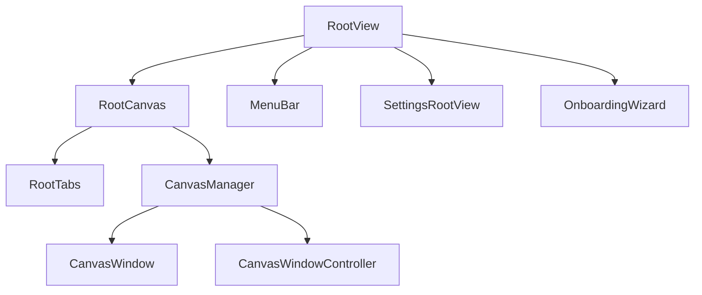
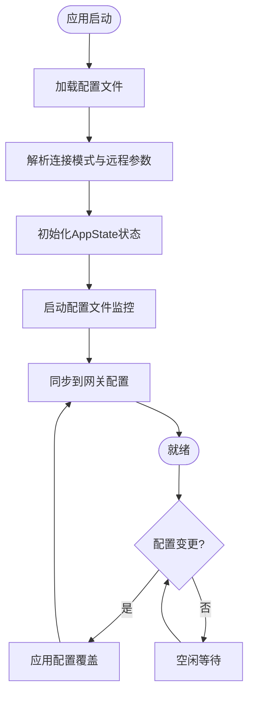
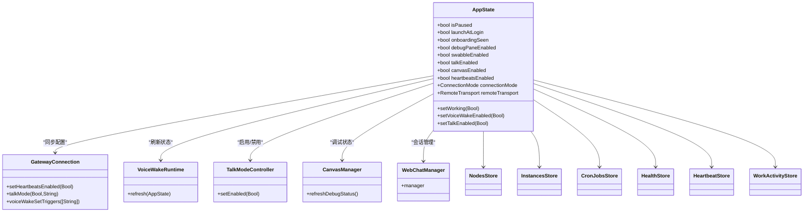
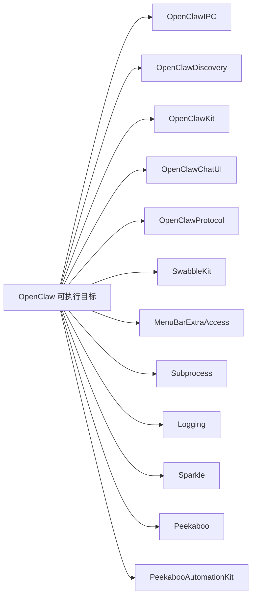

# 应用核心架构

<cite>
**本文引用的文件**
- [apps/macos/Package.swift](file://apps/macos/Package.swift)
- [apps/macos/Sources/OpenClaw/AppState.swift](file://apps/macos/Sources/OpenClaw/AppState.swift)
- [apps/macos/Sources/OpenClaw/Logging/OpenClawLogging.swift](file://apps/macos/Sources/OpenClaw/Logging/OpenClawLogging.swift)
- [apps/macos/Sources/OpenClaw/CanvasWindowController.swift](file://apps/macos/Sources/OpenClaw/CanvasWindowController.swift)
- [apps/macos/Sources/OpenClaw/CanvasWindow.swift](file://apps/macos/Sources/OpenClaw/CanvasWindow.swift)
- [apps/macos/Sources/OpenClaw/CanvasManager.swift](file://apps/macos/Sources/OpenClaw/CanvasManager.swift)
- [apps/macos/Sources/OpenClaw/MenuBar.swift](file://apps/macos/Sources/OpenClaw/MenuBar.swift)
- [apps/macos/Sources/OpenClaw/SettingsRootView.swift](file://apps/macos/Sources/OpenClaw/SettingsRootView.swift)
- [apps/macos/Sources/OpenClaw/OnboardingWizard.swift](file://apps/macos/Sources/OpenClaw/OnboardingWizard.swift)
- [apps/macos/Sources/OpenClaw/GatewayConnection.swift](file://apps/macos/Sources/OpenClaw/GatewayConnection.swift)
- [apps/macos/Sources/OpenClaw/PermissionManager.swift](file://apps/macos/Sources/OpenClaw/PermissionManager.swift)
- [apps/macos/Sources/OpenClaw/RuntimeLocator.swift](file://apps/macos/Sources/OpenClaw/RuntimeLocator.swift)
- [apps/macos/Sources/OpenClaw/LaunchAgentManager.swift](file://apps/macos/Sources/OpenClaw/LaunchAgentManager.swift)
- [apps/macos/Sources/OpenClaw/LaunchdManager.swift](file://apps/macos/Sources/OpenClaw/LaunchdManager.swift)
- [apps/macos/Sources/OpenClaw/LogLocator.swift](file://apps/macos/Sources/OpenClaw/LogLocator.swift)
- [apps/macos/Sources/OpenClaw/ConfigStore.swift](file://apps/macos/Sources/OpenClaw/ConfigStore.swift)
- [apps/macos/Sources/OpenClaw/ConfigFileWatcher.swift](file://apps/macos/Sources/OpenClaw/ConfigFileWatcher.swift)
- [apps/macos/Sources/OpenClaw/OpenClawConfigFile.swift](file://apps/macos/Sources/OpenClaw/OpenClawConfigFile.swift)
- [apps/macos/Sources/OpenClaw/VoiceWakeRuntime.swift](file://apps/macos/Sources/OpenClaw/VoiceWakeRuntime.swift)
- [apps/macos/Sources/OpenClaw/TalkModeController.swift](file://apps/macos/Sources/OpenClaw/TalkModeController.swift)
- [apps/macos/Sources/OpenClaw/WebChatManager.swift](file://apps/macos/Sources/OpenClaw/WebChatManager.swift)
- [apps/macos/Sources/OpenClaw/PeekabooBridgeHostCoordinator.swift](file://apps/macos/Sources/OpenClaw/PeekabooBridgeHostCoordinator.swift)
- [apps/macos/Sources/OpenClaw/NodesStore.swift](file://apps/macos/Sources/OpenClaw/NodesStore.swift)
- [apps/macos/Sources/OpenClaw/InstancesStore.swift](file://apps/macos/Sources/OpenClaw/InstancesStore.swift)
- [apps/macos/Sources/OpenClaw/CronJobsStore.swift](file://apps/macos/Sources/OpenClaw/CronJobsStore.swift)
- [apps/macos/Sources/OpenClaw/HealthStore.swift](file://apps/macos/Sources/OpenClaw/HealthStore.swift)
- [apps/macos/Sources/OpenClaw/HeartbeatStore.swift](file://apps/macos/Sources/OpenClaw/HeartbeatStore.swift)
- [apps/macos/Sources/OpenClaw/WorkActivityStore.swift](file://apps/macos/Sources/OpenClaw/WorkActivityStore.swift)
- [apps/macos/Sources/OpenClaw/NotificationManager.swift](file://apps/macos/Sources/OpenClaw/NotificationManager.swift)
- [apps/macos/Sources/OpenClaw/DockIconManager.swift](file://apps/macos/Sources/OpenClaw/DockIconManager.swift)
- [apps/macos/Sources/OpenClaw/ScreenRecordService.swift](file://apps/macos/Sources/OpenClaw/ScreenRecordService.swift)
- [apps/macos/Sources/OpenClaw/CameraCaptureService.swift](file://apps/macos/Sources/OpenClaw/CameraCaptureService.swift)
- [apps/macos/Sources/OpenClaw/AudioInputDeviceObserver.swift](file://apps/macos/Sources/OpenClaw/AudioInputDeviceObserver.swift)
- [apps/macos/Sources/OpenClaw/RemoteTunnelManager.swift](file://apps/macos/Sources/OpenClaw/RemoteTunnelManager.swift)
- [apps/macos/Sources/OpenClaw/RemotePortTunnel.swift](file://apps/macos/Sources/OpenClaw/RemotePortTunnel.swift)
- [apps/macos/Sources/OpenClaw/TerminationSignalWatcher.swift](file://apps/macos/Sources/OpenClaw/TerminationSignalWatcher.swift)
- [apps/macos/Sources/OpenClaw/ProcessInfo+OpenClaw.swift](file://apps/macos/Sources/OpenClaw/ProcessInfo+OpenClaw.swift)
- [apps/macos/Sources/OpenClaw/WindowPlacement.swift](file://apps/macos/Sources/OpenClaw/WindowPlacement.swift)
- [apps/macos/Sources/OpenClaw/VisualEffectView.swift](file://apps/macos/Sources/OpenClaw/VisualEffectView.swift)
- [apps/macos/Sources/OpenClaw/StatusBarIcon.swift](file://apps/macos/Sources/OpenClaw/StatusBarIcon.swift)
- [apps/macos/Sources/OpenClaw/StatusBarIconView.swift](file://apps/macos/Sources/OpenClaw/StatusBarIconView.swift)
- [apps/macos/Sources/OpenClaw/StatusBarIconController.swift](file://apps/macos/Sources/OpenClaw/StatusBarIconController.swift)
- [apps/macos/Sources/OpenClaw/StatusBarIconState.swift](file://apps/macos/Sources/OpenClaw/StatusBarIconState.swift)
- [apps/macos/Sources/OpenClaw/StatusBarIconAnimation.swift](file://apps/macos/Sources/OpenClaw/StatusBarIconAnimation.swift)
- [apps/macos/Sources/OpenClaw/StatusBarIconRenderer.swift](file://apps/macos/Sources/OpenClaw/StatusBarIconRenderer.swift)
- [apps/macos/Sources/OpenClaw/StatusBarIconRenderer+Animation.swift](file://apps/macos/Sources/OpenClaw/StatusBarIconRenderer+Animation.swift)
- [apps/macos/Sources/OpenClaw/StatusBarIconRenderer+State.swift](file://apps/macos/Sources/OpenClaw/StatusBarIconRenderer+State.swift)
- [apps/macos/Sources/OpenClaw/StatusBarIconRenderer+Theme.swift](file://apps/macos/Sources/OpenClaw/StatusBarIconRenderer+Theme.swift)
- [apps/macos/Sources/OpenClaw/StatusBarIconRenderer+Utils.swift](file://apps/macos/Sources/OpenClaw/StatusBarIconRenderer+Utils.swift)
- [apps/macos/Sources/OpenClaw/StatusBarIconRenderer+Accessibility.swift](file://apps/macos/Sources/OpenClaw/StatusBarIconRenderer+Accessibility.swift)
- [apps/macos/Sources/OpenClaw/StatusBarIconRenderer+Debug.swift](file://apps/macos/Sources/OpenClaw/StatusBarIconRenderer+Debug.swift)
- [apps/macos/Sources/OpenClaw/StatusBarIconRenderer+Testing.swift](file://apps/macos/Sources/OpenClaw/StatusBarIconRenderer+Testing.swift)
- [apps/macos/Sources/OpenClaw/StatusBarIconRenderer+Preview.swift](file://apps/macos/Sources/OpenClaw/StatusBarIconRenderer+Preview.swift)
- [apps/macos/Sources/OpenClaw/StatusBarIconRenderer+Snapshot.swift](file://apps/macos/Sources/OpenClaw/StatusBarIconRenderer+Snapshot.swift)
- [apps/macos/Sources/OpenClaw/StatusBarIconRenderer+Snapshot+Animation.swift](file://apps/macos/Sources/OpenClaw/StatusBarIconRenderer+Snapshot+Animation.swift)
- [apps/macos/Sources/OpenClaw/StatusBarIconRenderer+Snapshot+State.swift](file://apps/macos/Sources/OpenClaw/StatusBarIconRenderer+Snapshot+State.swift)
- [apps/macos/Sources/OpenClaw/StatusBarIconRenderer+Snapshot+Theme.swift](file://apps/macos/Sources/OpenClaw/StatusBarIconRenderer+Snapshot+Theme.swift)
- [apps/macos/Sources/OpenClaw/StatusBarIconRenderer+Snapshot+Utils.swift](file://apps/macos/Sources/OpenClaw/StatusBarIconRenderer+Snapshot+Utils.swift)
- [apps/macos/Sources/OpenClaw/StatusBarIconRenderer+Snapshot+Accessibility.swift](file://apps/macos/Sources/OpenClaw/StatusBarIconRenderer+Snapshot+Accessibility.swift)
- [apps/macos/Sources/OpenClaw/StatusBarIconRenderer+Snapshot+Debug.swift](file://apps/macos/Sources/OpenClaw/StatusBarIconRenderer+Snapshot+Debug.swift)
- [apps/macos/Sources/OpenClaw/StatusBarIconRenderer+Snapshot+Testing.swift](file://apps/macos/Sources/OpenClaw/StatusBarIconRenderer+Snapshot+Testing.swift)
- [apps/macos/Sources/OpenClaw/StatusBarIconRenderer+Snapshot+Preview.swift](file://apps/macos/Sources/OpenClaw/StatusBarIconRenderer+Snapshot+Preview.swift)
</cite>

## 目录

1. [引言](#引言)
2. [项目结构](#项目结构)
3. [核心组件](#核心组件)
4. [架构总览](#架构总览)
5. [详细组件分析](#详细组件分析)
6. [依赖分析](#依赖分析)
7. [性能考虑](#性能考虑)
8. [故障排除指南](#故障排除指南)
9. [结论](#结论)
10. [附录](#附录)

## 引言

本文件面向OpenClaw macOS应用的核心架构，聚焦于应用入口、初始化流程与生命周期管理，以及状态管理、全局配置与共享服务的实现方式。文档同时覆盖视图层次结构（RootView、RootCanvas、RootTabs等）的职责划分、数据流与控制流，并提供启动时序、内存管理与资源清理的最佳实践，以及错误处理、异常恢复与调试支持策略。

## 项目结构

OpenClaw macOS应用位于apps/macos目录下，采用Swift Package Manager组织多目标产物：可执行程序OpenClaw、IPC库OpenClawIPC、发现库OpenClawDiscovery与命令行工具openclaw-mac。应用以菜单栏常驻形式运行，通过状态驱动的视图体系提供设置、画布、节点与会话管理等功能。

```mermaid
graph TB
subgraph "macOS应用包"
Pkg["Package.swift<br/>产品: OpenClaw, OpenClawIPC, OpenClawDiscovery, openclaw-mac"]
Exec["可执行目标: OpenClaw"]
IPC["库目标: OpenClawIPC"]
Disc["库目标: OpenClawDiscovery"]
CLI["可执行目标: openclaw-mac"]
end
subgraph "OpenClaw 可执行目标"
State["AppState.swift<br/>全局状态与配置"]
Menu["MenuBar.swift<br/>菜单栏入口"]
Canvas["CanvasManager.swift<br/>画布管理"]
Settings["SettingsRootView.swift<br/>设置根视图"]
Onboarding["OnboardingWizard.swift<br/>引导向导"]
Gateway["GatewayConnection.swift<br/>网关连接"]
Runtime["VoiceWakeRuntime.swift<br/>语音唤醒运行时"]
Talk["TalkModeController.swift<br/>通话模式控制器"]
WebChat["WebChatManager.swift<br/>网页聊天管理器"]
Nodes["NodesStore.swift<br/>节点存储"]
Instances["InstancesStore.swift<br/>实例存储"]
Cron["CronJobsStore.swift<br/>定时任务存储"]
Health["HealthStore.swift<br/>健康状态"]
Heartbeat["HeartbeatStore.swift<br/>心跳状态"]
Work["WorkActivityStore.swift<br/>工作活动"]
Notify["NotificationManager.swift<br/>通知管理"]
Dock["DockIconManager.swift<br/>Dock图标管理"]
Screen["ScreenRecordService.swift<br/>屏幕录制服务"]
Cam["CameraCaptureService.swift<br/>相机捕获服务"]
Audio["AudioInputDeviceObserver.swift<br/>音频输入设备观察"]
Remote["RemoteTunnelManager.swift<br/>远程隧道管理"]
Port["RemotePortTunnel.swift<br/>端口隧道"]
Term["TerminationSignalWatcher.swift<br/>终止信号监听"]
ProcInfo["ProcessInfo+OpenClaw.swift<br/>进程信息扩展"]
WinPlace["WindowPlacement.swift<br/>窗口放置"]
Visual["VisualEffectView.swift<br/>视觉效果视图"]
end
Pkg --> Exec
Pkg --> IPC
Pkg --> Disc
Pkg --> CLI
Exec --> State
Exec --> Menu
Exec --> Canvas
Exec --> Settings
Exec --> Onboarding
Exec --> Gateway
Exec --> Runtime
Exec --> Talk
Exec --> WebChat
Exec --> Nodes
Exec --> Instances
Exec --> Cron
Exec --> Health
Exec --> Heartbeat
Exec --> Work
Exec --> Notify
Exec --> Dock
Exec --> Screen
Exec --> Cam
Exec --> Audio
Exec --> Remote
Exec --> Port
Exec --> Term
Exec --> ProcInfo
Exec --> WinPlace
Exec --> Visual
```

图表来源

- [apps/macos/Package.swift](file://apps/macos/Package.swift#L6-L92)
- [apps/macos/Sources/OpenClaw/AppState.swift](file://apps/macos/Sources/OpenClaw/AppState.swift#L1-L721)

章节来源

- [apps/macos/Package.swift](file://apps/macos/Package.swift#L1-L93)

## 核心组件

- 全局状态与配置
  - AppState：集中式状态容器，负责连接模式、远程传输、Canvas开关、权限与功能开关、心跳、图标动画、开机自启等。提供配置文件监控与热更新能力，确保本地偏好与网关配置同步。
- 视图与界面
  - MenuBar：菜单栏入口，承载状态图标与上下文菜单。
  - SettingsRootView：设置根视图，聚合各类设置面板。
  - OnboardingWizard：新用户引导流程。
  - Canvas相关：CanvasManager、CanvasWindow、CanvasWindowController负责画布窗口的创建、导航与生命周期管理。
- 运行时与服务
  - VoiceWakeRuntime：语音唤醒运行时，与系统权限交互并刷新模型。
  - TalkModeController：通话模式启用/禁用控制。
  - GatewayConnection：网关连接与远程配置同步。
  - WebChatManager：网页聊天会话管理。
  - NodesStore/InstancesStore：节点与实例的持久化存储。
  - CronJobsStore：定时任务存储与调度。
  - HealthStore/HeartbeatStore/WorkActivityStore：健康与活动状态跟踪。
  - NotificationManager/DockIconManager：通知与Dock图标管理。
  - ScreenRecordService/CameraCaptureService/AudioInputDeviceObserver：媒体与音频输入服务。
  - RemoteTunnelManager/RemotePortTunnel：远程隧道与端口转发。
  - TerminationSignalWatcher：进程终止信号监听。
  - ProcessInfo+OpenClaw：进程信息扩展。
  - WindowPlacement/VisualEffectView：窗口布局与视觉效果。
- 日志与诊断
  - OpenClawLogging：统一日志配置与级别管理。
  - LogLocator：日志路径定位。
- 启动与权限
  - LaunchAgentManager/LaunchdManager：开机自启与launchd集成。
  - PermissionManager：系统权限校验与请求。
- 配置与文件
  - ConfigStore/ConfigFileWatcher/OpenClawConfigFile：配置读取、监控与保存。

章节来源

- [apps/macos/Sources/OpenClaw/AppState.swift](file://apps/macos/Sources/OpenClaw/AppState.swift#L1-L721)
- [apps/macos/Sources/OpenClaw/Logging/OpenClawLogging.swift](file://apps/macos/Sources/OpenClaw/Logging/OpenClawLogging.swift#L1-L56)
- [apps/macos/Sources/OpenClaw/CanvasManager.swift](file://apps/macos/Sources/OpenClaw/CanvasManager.swift)
- [apps/macos/Sources/OpenClaw/CanvasWindow.swift](file://apps/macos/Sources/OpenClaw/CanvasWindow.swift)
- [apps/macos/Sources/OpenClaw/CanvasWindowController.swift](file://apps/macos/Sources/OpenClaw/CanvasWindowController.swift)
- [apps/macos/Sources/OpenClaw/MenuBar.swift](file://apps/macos/Sources/OpenClaw/MenuBar.swift)
- [apps/macos/Sources/OpenClaw/SettingsRootView.swift](file://apps/macos/Sources/OpenClaw/SettingsRootView.swift)
- [apps/macos/Sources/OpenClaw/OnboardingWizard.swift](file://apps/macos/Sources/OpenClaw/OnboardingWizard.swift)
- [apps/macos/Sources/OpenClaw/GatewayConnection.swift](file://apps/macos/Sources/OpenClaw/GatewayConnection.swift)
- [apps/macos/Sources/OpenClaw/VoiceWakeRuntime.swift](file://apps/macos/Sources/OpenClaw/VoiceWakeRuntime.swift)
- [apps/macos/Sources/OpenClaw/TalkModeController.swift](file://apps/macos/Sources/OpenClaw/TalkModeController.swift)
- [apps/macos/Sources/OpenClaw/WebChatManager.swift](file://apps/macos/Sources/OpenClaw/WebChatManager.swift)
- [apps/macos/Sources/OpenClaw/NodesStore.swift](file://apps/macos/Sources/OpenClaw/NodesStore.swift)
- [apps/macos/Sources/OpenClaw/InstancesStore.swift](file://apps/macos/Sources/OpenClaw/InstancesStore.swift)
- [apps/macos/Sources/OpenClaw/CronJobsStore.swift](file://apps/macos/Sources/OpenClaw/CronJobsStore.swift)
- [apps/macos/Sources/OpenClaw/HealthStore.swift](file://apps/macos/Sources/OpenClaw/HealthStore.swift)
- [apps/macos/Sources/OpenClaw/HeartbeatStore.swift](file://apps/macos/Sources/OpenClaw/HeartbeatStore.swift)
- [apps/macos/Sources/OpenClaw/WorkActivityStore.swift](file://apps/macos/Sources/OpenClaw/WorkActivityStore.swift)
- [apps/macos/Sources/OpenClaw/NotificationManager.swift](file://apps/macos/Sources/OpenClaw/NotificationManager.swift)
- [apps/macos/Sources/OpenClaw/DockIconManager.swift](file://apps/macos/Sources/OpenClaw/DockIconManager.swift)
- [apps/macos/Sources/OpenClaw/ScreenRecordService.swift](file://apps/macos/Sources/OpenClaw/ScreenRecordService.swift)
- [apps/macos/Sources/OpenClaw/CameraCaptureService.swift](file://apps/macos/Sources/OpenClaw/CameraCaptureService.swift)
- [apps/macos/Sources/OpenClaw/AudioInputDeviceObserver.swift](file://apps/macos/Sources/OpenClaw/AudioInputDeviceObserver.swift)
- [apps/macos/Sources/OpenClaw/RemoteTunnelManager.swift](file://apps/macos/Sources/OpenClaw/RemoteTunnelManager.swift)
- [apps/macos/Sources/OpenClaw/RemotePortTunnel.swift](file://apps/macos/Sources/OpenClaw/RemotePortTunnel.swift)
- [apps/macos/Sources/OpenClaw/TerminationSignalWatcher.swift](file://apps/macos/Sources/OpenClaw/TerminationSignalWatcher.swift)
- [apps/macos/Sources/OpenClaw/ProcessInfo+OpenClaw.swift](file://apps/macos/Sources/OpenClaw/ProcessInfo+OpenClaw.swift)
- [apps/macos/Sources/OpenClaw/WindowPlacement.swift](file://apps/macos/Sources/OpenClaw/WindowPlacement.swift)
- [apps/macos/Sources/OpenClaw/VisualEffectView.swift](file://apps/macos/Sources/OpenClaw/VisualEffectView.swift)
- [apps/macos/Sources/OpenClaw/LaunchAgentManager.swift](file://apps/macos/Sources/OpenClaw/LaunchAgentManager.swift)
- [apps/macos/Sources/OpenClaw/LaunchdManager.swift](file://apps/macos/Sources/OpenClaw/LaunchdManager.swift)
- [apps/macos/Sources/OpenClaw/PermissionManager.swift](file://apps/macos/Sources/OpenClaw/PermissionManager.swift)
- [apps/macos/Sources/OpenClaw/ConfigStore.swift](file://apps/macos/Sources/OpenClaw/ConfigStore.swift)
- [apps/macos/Sources/OpenClaw/ConfigFileWatcher.swift](file://apps/macos/Sources/OpenClaw/ConfigFileWatcher.swift)
- [apps/macos/Sources/OpenClaw/OpenClawConfigFile.swift](file://apps/macos/Sources/OpenClaw/OpenClawConfigFile.swift)
- [apps/macos/Sources/OpenClaw/LogLocator.swift](file://apps/macos/Sources/OpenClaw/LogLocator.swift)

## 架构总览

OpenClaw macOS应用采用“状态驱动的菜单栏应用”架构。应用通过AppState集中管理全局状态与配置，MenuBar作为入口展示状态图标与快捷操作；CanvasManager负责画布窗口的生命周期与导航；GatewayConnection负责与远端网关通信并同步配置；VoiceWakeRuntime与TalkModeController分别负责语音唤醒与通话模式；WebChatManager提供网页聊天会话；NodesStore/InstancesStore/CronJobsStore等存储层负责数据持久化；日志与诊断通过OpenClawLogging与LogLocator统一管理；启动与权限通过LaunchAgentManager/LaunchdManager与PermissionManager集成。

```mermaid
graph TB
subgraph "应用入口与状态"
App["OpenClaw 可执行程序"]
State["AppState"]
Menu["MenuBar"]
end
subgraph "界面与画布"
Settings["SettingsRootView"]
Onboarding["OnboardingWizard"]
CanvasMgr["CanvasManager"]
CanvasWin["CanvasWindow"]
CanvasCtl["CanvasWindowController"]
end
subgraph "运行时与服务"
Gateway["GatewayConnection"]
VWR["VoiceWakeRuntime"]
TalkCtl["TalkModeController"]
WebChat["WebChatManager"]
Nodes["NodesStore"]
Inst["InstancesStore"]
Cron["CronJobsStore"]
Health["HealthStore"]
Heartbeat["HeartbeatStore"]
Work["WorkActivityStore"]
Notify["NotificationManager"]
Dock["DockIconManager"]
Screen["ScreenRecordService"]
Cam["CameraCaptureService"]
Audio["AudioInputDeviceObserver"]
Remote["RemoteTunnelManager"]
Port["RemotePortTunnel"]
Term["TerminationSignalWatcher"]
ProcInfo["ProcessInfo+OpenClaw"]
WinPlace["WindowPlacement"]
Visual["VisualEffectView"]
end
subgraph "日志与诊断"
Log["OpenClawLogging"]
LogLoc["LogLocator"]
end
subgraph "启动与权限"
LA["LaunchAgentManager"]
LD["LaunchdManager"]
Perm["PermissionManager"]
Conf["OpenClawConfigFile"]
ConfWatch["ConfigFileWatcher"]
end
App --> State
App --> Menu
App --> Settings
App --> Onboarding
App --> CanvasMgr
CanvasMgr --> CanvasWin
CanvasMgr --> CanvasCtl
App --> Gateway
App --> VWR
App --> TalkCtl
App --> WebChat
App --> Nodes
App --> Inst
App --> Cron
App --> Health
App --> Heartbeat
App --> Work
App --> Notify
App --> Dock
App --> Screen
App --> Cam
App --> Audio
App --> Remote
App --> Port
App --> Term
App --> ProcInfo
App --> WinPlace
App --> Visual
App --> Log
App --> LogLoc
App --> LA
App --> LD
App --> Perm
App --> Conf
App --> ConfWatch
```

图表来源

- [apps/macos/Package.swift](file://apps/macos/Package.swift#L26-L92)
- [apps/macos/Sources/OpenClaw/AppState.swift](file://apps/macos/Sources/OpenClaw/AppState.swift#L1-L721)
- [apps/macos/Sources/OpenClaw/Logging/OpenClawLogging.swift](file://apps/macos/Sources/OpenClaw/Logging/OpenClawLogging.swift#L1-L56)
- [apps/macos/Sources/OpenClaw/CanvasManager.swift](file://apps/macos/Sources/OpenClaw/CanvasManager.swift)
- [apps/macos/Sources/OpenClaw/CanvasWindow.swift](file://apps/macos/Sources/OpenClaw/CanvasWindow.swift)
- [apps/macos/Sources/OpenClaw/CanvasWindowController.swift](file://apps/macos/Sources/OpenClaw/CanvasWindowController.swift)
- [apps/macos/Sources/OpenClaw/MenuBar.swift](file://apps/macos/Sources/OpenClaw/MenuBar.swift)
- [apps/macos/Sources/OpenClaw/SettingsRootView.swift](file://apps/macos/Sources/OpenClaw/SettingsRootView.swift)
- [apps/macos/Sources/OpenClaw/OnboardingWizard.swift](file://apps/macos/Sources/OpenClaw/OnboardingWizard.swift)
- [apps/macos/Sources/OpenClaw/GatewayConnection.swift](file://apps/macos/Sources/OpenClaw/GatewayConnection.swift)
- [apps/macos/Sources/OpenClaw/VoiceWakeRuntime.swift](file://apps/macos/Sources/OpenClaw/VoiceWakeRuntime.swift)
- [apps/macos/Sources/OpenClaw/TalkModeController.swift](file://apps/macos/Sources/OpenClaw/TalkModeController.swift)
- [apps/macos/Sources/OpenClaw/WebChatManager.swift](file://apps/macos/Sources/OpenClaw/WebChatManager.swift)
- [apps/macos/Sources/OpenClaw/NodesStore.swift](file://apps/macos/Sources/OpenClaw/NodesStore.swift)
- [apps/macos/Sources/OpenClaw/InstancesStore.swift](file://apps/macos/Sources/OpenClaw/InstancesStore.swift)
- [apps/macos/Sources/OpenClaw/CronJobsStore.swift](file://apps/macos/Sources/OpenClaw/CronJobsStore.swift)
- [apps/macos/Sources/OpenClaw/HealthStore.swift](file://apps/macos/Sources/OpenClaw/HealthStore.swift)
- [apps/macos/Sources/OpenClaw/HeartbeatStore.swift](file://apps/macos/Sources/OpenClaw/HeartbeatStore.swift)
- [apps/macos/Sources/OpenClaw/WorkActivityStore.swift](file://apps/macos/Sources/OpenClaw/WorkActivityStore.swift)
- [apps/macos/Sources/OpenClaw/NotificationManager.swift](file://apps/macos/Sources/OpenClaw/NotificationManager.swift)
- [apps/macos/Sources/OpenClaw/DockIconManager.swift](file://apps/macos/Sources/OpenClaw/DockIconManager.swift)
- [apps/macos/Sources/OpenClaw/ScreenRecordService.swift](file://apps/macos/Sources/OpenClaw/ScreenRecordService.swift)
- [apps/macos/Sources/OpenClaw/CameraCaptureService.swift](file://apps/macos/Sources/OpenClaw/CameraCaptureService.swift)
- [apps/macos/Sources/OpenClaw/AudioInputDeviceObserver.swift](file://apps/macos/Sources/OpenClaw/AudioInputDeviceObserver.swift)
- [apps/macos/Sources/OpenClaw/RemoteTunnelManager.swift](file://apps/macos/Sources/OpenClaw/RemoteTunnelManager.swift)
- [apps/macos/Sources/OpenClaw/RemotePortTunnel.swift](file://apps/macos/Sources/OpenClaw/RemotePortTunnel.swift)
- [apps/macos/Sources/OpenClaw/TerminationSignalWatcher.swift](file://apps/macos/Sources/OpenClaw/TerminationSignalWatcher.swift)
- [apps/macos/Sources/OpenClaw/ProcessInfo+OpenClaw.swift](file://apps/macos/Sources/OpenClaw/ProcessInfo+OpenClaw.swift)
- [apps/macos/Sources/OpenClaw/WindowPlacement.swift](file://apps/macos/Sources/OpenClaw/WindowPlacement.swift)
- [apps/macos/Sources/OpenClaw/VisualEffectView.swift](file://apps/macos/Sources/OpenClaw/VisualEffectView.swift)
- [apps/macos/Sources/OpenClaw/LaunchAgentManager.swift](file://apps/macos/Sources/OpenClaw/LaunchAgentManager.swift)
- [apps/macos/Sources/OpenClaw/LaunchdManager.swift](file://apps/macos/Sources/OpenClaw/LaunchdManager.swift)
- [apps/macos/Sources/OpenClaw/PermissionManager.swift](file://apps/macos/Sources/OpenClaw/PermissionManager.swift)
- [apps/macos/Sources/OpenClaw/OpenClawConfigFile.swift](file://apps/macos/Sources/OpenClaw/OpenClawConfigFile.swift)
- [apps/macos/Sources/OpenClaw/ConfigFileWatcher.swift](file://apps/macos/Sources/OpenClaw/ConfigFileWatcher.swift)
- [apps/macos/Sources/OpenClaw/LogLocator.swift](file://apps/macos/Sources/OpenClaw/LogLocator.swift)

## 详细组件分析

### 应用入口与生命周期（MenuApp）

- 入口点与生命周期
  - 应用以菜单栏常驻形式运行，MenuBar作为UI入口，状态由AppState集中管理。
  - 生命周期事件通过ScenePhase与环境变量感知，配合状态变更触发网关连接控制器与运行时服务的同步。
- 初始化流程
  - 启动时加载配置文件，解析连接模式与远程参数，初始化权限与功能开关。
  - 启动配置文件监控，实现配置热更新。
  - 初始化各运行时服务（语音唤醒、通话模式、网关连接、画布、Web聊天等）。
- 资源清理
  - deinit中停止配置监控，释放后台任务与监听器。
  - 终止信号监听器在进程退出时清理资源。

图表来源

- [apps/macos/Sources/OpenClaw/AppState.swift](file://apps/macos/Sources/OpenClaw/AppState.swift#L230-L331)
- [apps/macos/Sources/OpenClaw/MenuBar.swift](file://apps/macos/Sources/OpenClaw/MenuBar.swift)
- [apps/macos/Sources/OpenClaw/GatewayConnection.swift](file://apps/macos/Sources/OpenClaw/GatewayConnection.swift)
- [apps/macos/Sources/OpenClaw/VoiceWakeRuntime.swift](file://apps/macos/Sources/OpenClaw/VoiceWakeRuntime.swift)
- [apps/macos/Sources/OpenClaw/TalkModeController.swift](file://apps/macos/Sources/OpenClaw/TalkModeController.swift)
- [apps/macos/Sources/OpenClaw/CanvasManager.swift](file://apps/macos/Sources/OpenClaw/CanvasManager.swift)

章节来源

- [apps/macos/Sources/OpenClaw/AppState.swift](file://apps/macos/Sources/OpenClaw/AppState.swift#L1-L721)
- [apps/macos/Sources/OpenClaw/MenuBar.swift](file://apps/macos/Sources/OpenClaw/MenuBar.swift)
- [apps/macos/Sources/OpenClaw/TerminationSignalWatcher.swift](file://apps/macos/Sources/OpenClaw/TerminationSignalWatcher.swift)

### 视图层次结构与职责

- RootView/RootCanvas/RootTabs
  - RootView：应用的根视图容器，承载菜单栏与主界面。
  - RootCanvas：Canvas窗口的根画布视图，负责画布内容渲染与交互。
  - RootTabs：标签页容器，用于切换不同功能面板（设置、节点、会话等）。
- 职责划分
  - MenuBar：提供状态图标、上下文菜单与快速操作入口。
  - SettingsRootView：聚合设置面板，响应AppState变化。
  - OnboardingWizard：引导新用户完成初始配置。
  - Canvas相关：CanvasManager负责窗口生命周期与导航；CanvasWindow/CanvasWindowController负责窗口行为与测试辅助。

图表来源

- [apps/macos/Sources/OpenClaw/MenuBar.swift](file://apps/macos/Sources/OpenClaw/MenuBar.swift)
- [apps/macos/Sources/OpenClaw/SettingsRootView.swift](file://apps/macos/Sources/OpenClaw/SettingsRootView.swift)
- [apps/macos/Sources/OpenClaw/OnboardingWizard.swift](file://apps/macos/Sources/OpenClaw/OnboardingWizard.swift)
- [apps/macos/Sources/OpenClaw/CanvasManager.swift](file://apps/macos/Sources/OpenClaw/CanvasManager.swift)
- [apps/macos/Sources/OpenClaw/CanvasWindow.swift](file://apps/macos/Sources/OpenClaw/CanvasWindow.swift)
- [apps/macos/Sources/OpenClaw/CanvasWindowController.swift](file://apps/macos/Sources/OpenClaw/CanvasWindowController.swift)

章节来源

- [apps/macos/Sources/OpenClaw/MenuBar.swift](file://apps/macos/Sources/OpenClaw/MenuBar.swift)
- [apps/macos/Sources/OpenClaw/SettingsRootView.swift](file://apps/macos/Sources/OpenClaw/SettingsRootView.swift)
- [apps/macos/Sources/OpenClaw/OnboardingWizard.swift](file://apps/macos/Sources/OpenClaw/OnboardingWizard.swift)
- [apps/macos/Sources/OpenClaw/CanvasManager.swift](file://apps/macos/Sources/OpenClaw/CanvasManager.swift)
- [apps/macos/Sources/OpenClaw/CanvasWindow.swift](file://apps/macos/Sources/OpenClaw/CanvasWindow.swift)
- [apps/macos/Sources/OpenClaw/CanvasWindowController.swift](file://apps/macos/Sources/OpenClaw/CanvasWindowController.swift)

### 状态管理与全局配置

- 状态管理
  - AppState使用@Observable与@MainActor保证主线程状态一致性，封装大量布尔开关、枚举状态与字符串配置项。
  - 提供配置文件监控与热更新，自动同步到网关配置，避免覆盖远程设置。
- 全局配置
  - OpenClawConfigFile负责配置读取与保存；ConfigFileWatcher监听配置变更；ConfigStore提供统一访问接口。
  - 连接模式（本地/远程/未配置）、远程传输（SSH/直连）、Canvas开关、心跳、开机自启等均通过UserDefaults持久化。

图表来源

- [apps/macos/Sources/OpenClaw/AppState.swift](file://apps/macos/Sources/OpenClaw/AppState.swift#L282-L417)
- [apps/macos/Sources/OpenClaw/OpenClawConfigFile.swift](file://apps/macos/Sources/OpenClaw/OpenClawConfigFile.swift)
- [apps/macos/Sources/OpenClaw/ConfigFileWatcher.swift](file://apps/macos/Sources/OpenClaw/ConfigFileWatcher.swift)
- [apps/macos/Sources/OpenClaw/ConfigStore.swift](file://apps/macos/Sources/OpenClaw/ConfigStore.swift)

章节来源

- [apps/macos/Sources/OpenClaw/AppState.swift](file://apps/macos/Sources/OpenClaw/AppState.swift#L167-L550)
- [apps/macos/Sources/OpenClaw/OpenClawConfigFile.swift](file://apps/macos/Sources/OpenClaw/OpenClawConfigFile.swift)
- [apps/macos/Sources/OpenClaw/ConfigFileWatcher.swift](file://apps/macos/Sources/OpenClaw/ConfigFileWatcher.swift)
- [apps/macos/Sources/OpenClaw/ConfigStore.swift](file://apps/macos/Sources/OpenClaw/ConfigStore.swift)

### 共享服务与运行时

- 语音唤醒与通话模式
  - VoiceWakeRuntime：根据AppState刷新触发词、语言、设备与权限状态。
  - TalkModeController：根据AppState启用/禁用通话模式，并与网关通信。
- 网关连接与远程配置
  - GatewayConnection：维护与远端网关的连接，同步连接模式与远程参数。
- 画布与Web聊天
  - CanvasManager：管理画布窗口生命周期与导航。
  - WebChatManager：管理网页聊天会话与消息。
- 存储与状态
  - NodesStore/InstancesStore/CronJobsStore：节点、实例与定时任务的持久化。
  - HealthStore/HeartbeatStore/WorkActivityStore：健康与活动状态跟踪。
- 媒体与权限
  - ScreenRecordService/CameraCaptureService/AudioInputDeviceObserver：媒体与音频输入服务。
  - PermissionManager：系统权限校验与请求。
- 启动与日志
  - LaunchAgentManager/LaunchdManager：开机自启与launchd集成。
  - OpenClawLogging/LogLocator：日志配置与路径定位。

图表来源

- [apps/macos/Sources/OpenClaw/AppState.swift](file://apps/macos/Sources/OpenClaw/AppState.swift#L1-L721)
- [apps/macos/Sources/OpenClaw/GatewayConnection.swift](file://apps/macos/Sources/OpenClaw/GatewayConnection.swift)
- [apps/macos/Sources/OpenClaw/VoiceWakeRuntime.swift](file://apps/macos/Sources/OpenClaw/VoiceWakeRuntime.swift)
- [apps/macos/Sources/OpenClaw/TalkModeController.swift](file://apps/macos/Sources/OpenClaw/TalkModeController.swift)
- [apps/macos/Sources/OpenClaw/CanvasManager.swift](file://apps/macos/Sources/OpenClaw/CanvasManager.swift)
- [apps/macos/Sources/OpenClaw/WebChatManager.swift](file://apps/macos/Sources/OpenClaw/WebChatManager.swift)
- [apps/macos/Sources/OpenClaw/NodesStore.swift](file://apps/macos/Sources/OpenClaw/NodesStore.swift)
- [apps/macos/Sources/OpenClaw/InstancesStore.swift](file://apps/macos/Sources/OpenClaw/InstancesStore.swift)
- [apps/macos/Sources/OpenClaw/CronJobsStore.swift](file://apps/macos/Sources/OpenClaw/CronJobsStore.swift)
- [apps/macos/Sources/OpenClaw/HealthStore.swift](file://apps/macos/Sources/OpenClaw/HealthStore.swift)
- [apps/macos/Sources/OpenClaw/HeartbeatStore.swift](file://apps/macos/Sources/OpenClaw/HeartbeatStore.swift)
- [apps/macos/Sources/OpenClaw/WorkActivityStore.swift](file://apps/macos/Sources/OpenClaw/WorkActivityStore.swift)

章节来源

- [apps/macos/Sources/OpenClaw/AppState.swift](file://apps/macos/Sources/OpenClaw/AppState.swift#L578-L625)
- [apps/macos/Sources/OpenClaw/GatewayConnection.swift](file://apps/macos/Sources/OpenClaw/GatewayConnection.swift)
- [apps/macos/Sources/OpenClaw/VoiceWakeRuntime.swift](file://apps/macos/Sources/OpenClaw/VoiceWakeRuntime.swift)
- [apps/macos/Sources/OpenClaw/TalkModeController.swift](file://apps/macos/Sources/OpenClaw/TalkModeController.swift)
- [apps/macos/Sources/OpenClaw/CanvasManager.swift](file://apps/macos/Sources/OpenClaw/CanvasManager.swift)
- [apps/macos/Sources/OpenClaw/WebChatManager.swift](file://apps/macos/Sources/OpenClaw/WebChatManager.swift)
- [apps/macos/Sources/OpenClaw/NodesStore.swift](file://apps/macos/Sources/OpenClaw/NodesStore.swift)
- [apps/macos/Sources/OpenClaw/InstancesStore.swift](file://apps/macos/Sources/OpenClaw/InstancesStore.swift)
- [apps/macos/Sources/OpenClaw/CronJobsStore.swift](file://apps/macos/Sources/OpenClaw/CronJobsStore.swift)
- [apps/macos/Sources/OpenClaw/HealthStore.swift](file://apps/macos/Sources/OpenClaw/HealthStore.swift)
- [apps/macos/Sources/OpenClaw/HeartbeatStore.swift](file://apps/macos/Sources/OpenClaw/HeartbeatStore.swift)
- [apps/macos/Sources/OpenClaw/WorkActivityStore.swift](file://apps/macos/Sources/OpenClaw/WorkActivityStore.swift)

## 依赖分析

- 模块依赖
  - OpenClaw可执行目标依赖OpenClawIPC、OpenClawDiscovery、OpenClawKit、OpenClawChatUI、OpenClawProtocol、SwabbleKit、MenuBarExtraAccess、Subprocess、Logging、Sparkle、Peekaboo与PeekabooAutomationKit。
- 外部依赖
  - Swift标准库与Foundation用于状态与配置管理。
  - AppKit用于菜单栏与窗口管理。
  - Observation用于状态观察。
  - ServiceManagement用于开机自启。
  - Logging用于日志记录。
  - Sparkle用于应用更新。
  - Peekaboo用于自动化桥接。
- 内部依赖
  - OpenClawKit提供核心协议与UI组件。
  - SwabbleKit提供语音唤醒相关能力。
  - OpenClawIPC/OpenClawDiscovery提供IPC与发现能力。

图表来源

- [apps/macos/Package.swift](file://apps/macos/Package.swift#L42-L57)

章节来源

- [apps/macos/Package.swift](file://apps/macos/Package.swift#L17-L57)

## 性能考虑

- 状态更新批处理
  - 对频繁变更的状态（如触发词、语言、设备）进行去抖与合并，减少刷新频率。
- 后台任务优先级
  - 使用Detached任务与Utility优先级处理启动与配置同步，避免阻塞主线程。
- 配置监控
  - 仅在非预览与非初始化阶段启动配置监控，降低不必要的IO开销。
- 图标动画与视觉效果
  - 在低性能设备上可关闭动画或降低刷新频率，减少CPU/GPU占用。
- 日志级别控制
  - 通过UserDefaults动态调整日志级别，生产环境默认INFO以上，开发环境可提升至DEBUG。

## 故障排除指南

- 权限问题
  - 语音唤醒与通话模式需麦克风权限，若权限缺失将自动禁用相应功能。可通过PermissionManager检查与请求权限。
- 网关连接失败
  - 检查连接模式与远程参数，确认SSH密钥与主机可达性；必要时切换到本地模式验证。
- 配置不生效
  - 确认配置文件监控已启动，且未被远程网关覆盖；通过ConfigFileWatcher与OpenClawConfigFile核对当前配置。
- 日志定位
  - 通过LogLocator获取日志路径，结合OpenClawLogging调整日志级别，收集启动与运行期日志。
- 进程终止
  - 终止信号监听器负责清理资源，若出现异常退出，检查TerminationSignalWatcher与相关服务的deinit逻辑。

章节来源

- [apps/macos/Sources/OpenClaw/PermissionManager.swift](file://apps/macos/Sources/OpenClaw/PermissionManager.swift)
- [apps/macos/Sources/OpenClaw/GatewayConnection.swift](file://apps/macos/Sources/OpenClaw/GatewayConnection.swift)
- [apps/macos/Sources/OpenClaw/ConfigFileWatcher.swift](file://apps/macos/Sources/OpenClaw/ConfigFileWatcher.swift)
- [apps/macos/Sources/OpenClaw/OpenClawConfigFile.swift](file://apps/macos/Sources/OpenClaw/OpenClawConfigFile.swift)
- [apps/macos/Sources/OpenClaw/LogLocator.swift](file://apps/macos/Sources/OpenClaw/LogLocator.swift)
- [apps/macos/Sources/OpenClaw/Logging/OpenClawLogging.swift](file://apps/macos/Sources/OpenClaw/Logging/OpenClawLogging.swift#L1-L56)
- [apps/macos/Sources/OpenClaw/TerminationSignalWatcher.swift](file://apps/macos/Sources/OpenClaw/TerminationSignalWatcher.swift)

## 结论

OpenClaw macOS应用以AppState为核心，结合菜单栏入口与画布系统，构建了状态驱动、模块解耦、易于扩展的架构。通过严格的权限管理、配置监控与运行时服务协调，实现了稳定的本地与远程协作体验。建议在后续迭代中进一步完善异常恢复与调试工具链，持续优化性能与用户体验。

## 附录

- 启动脚本与构建
  - 提供构建与运行脚本，便于本地调试与快速启动。
- 状态预览
  - AppState提供预览态，便于UI组件独立测试与可视化。

章节来源

- [apps/macos/Sources/OpenClaw/AppState.swift](file://apps/macos/Sources/OpenClaw/AppState.swift#L665-L696)
