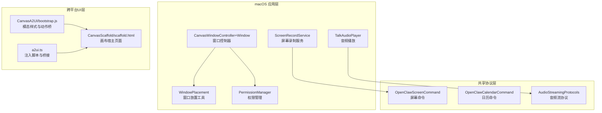
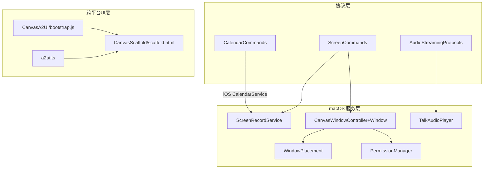
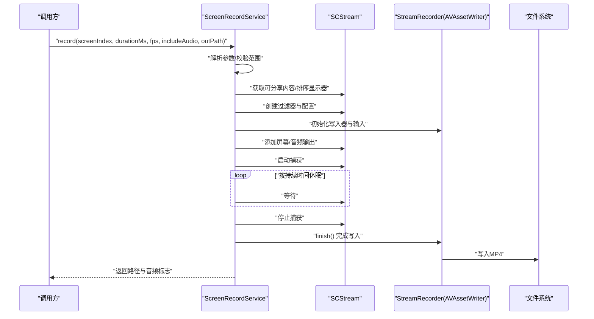
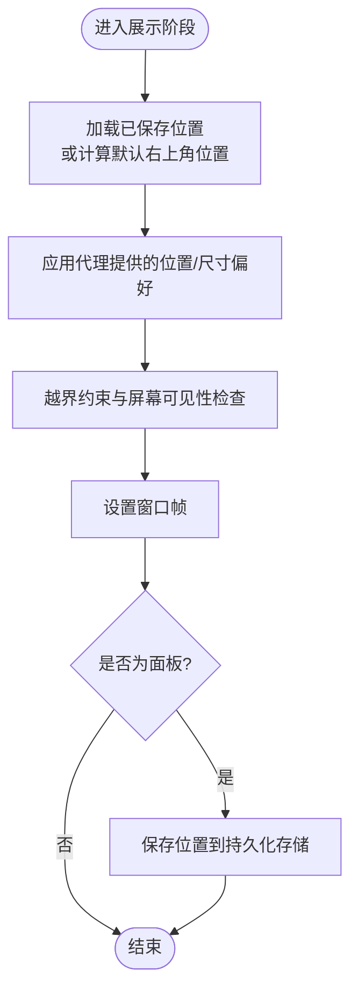
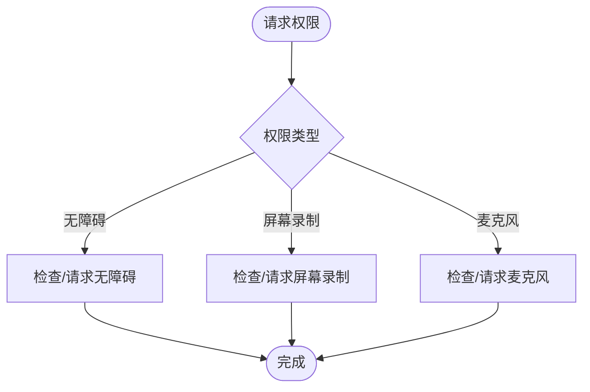
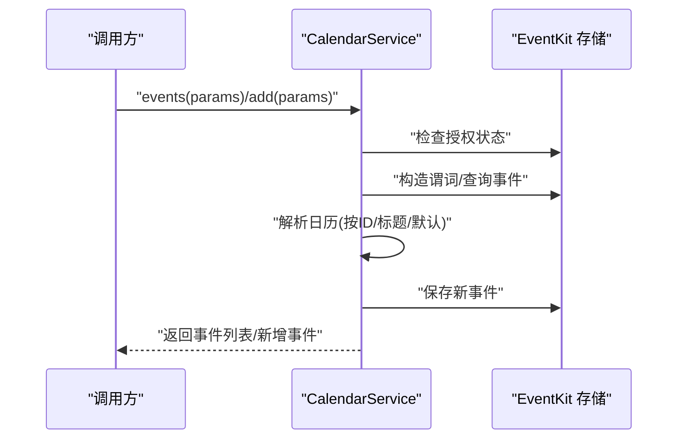
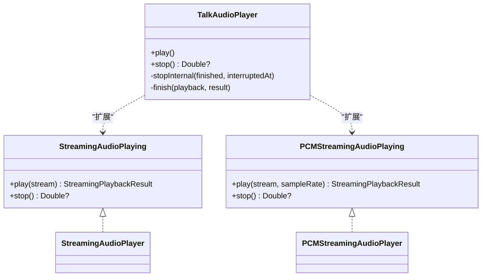
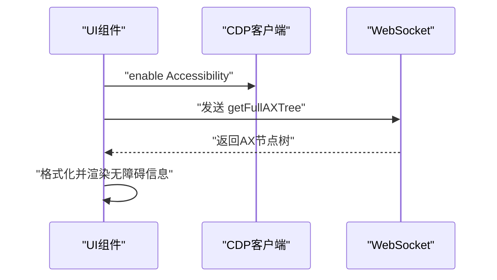
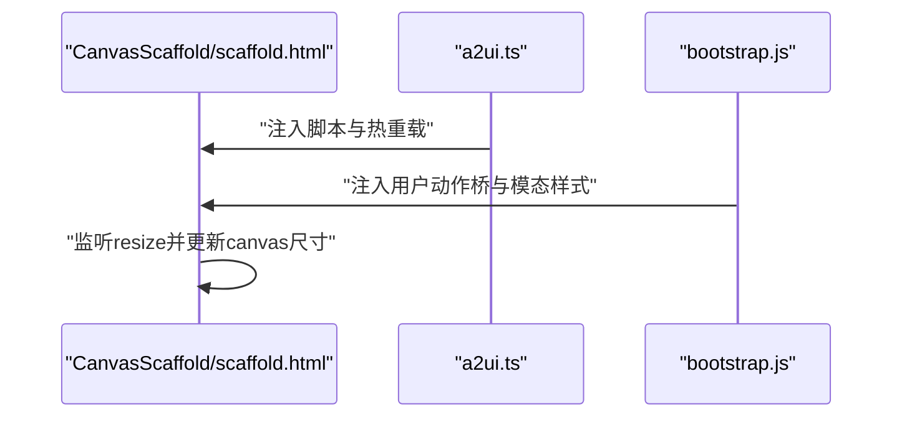
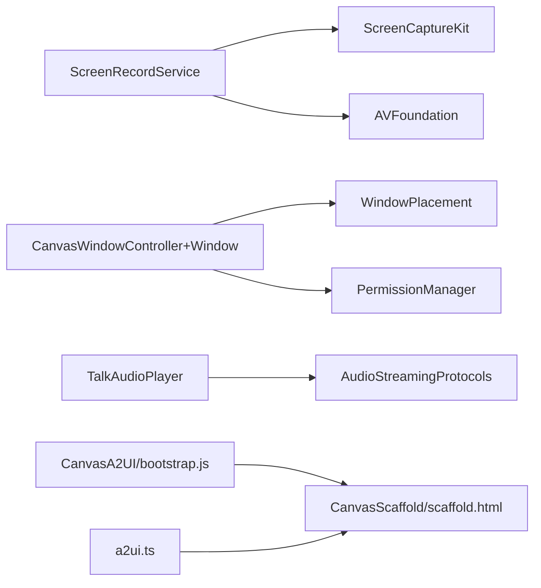

# 窗口管理系统

<cite>
**本文引用的文件**
- [apps/macos/Sources/OpenClaw/ScreenRecordService.swift](file://apps/macos/Sources/OpenClaw/ScreenRecordService.swift)
- [apps/shared/OpenClawKit/Sources/OpenClawKit/ScreenCommands.swift](file://apps/shared/OpenClawKit/Sources/OpenClawKit/ScreenCommands.swift)
- [apps/macos/Sources/OpenClaw/NodeMode/MacNodeScreenCommands.swift](file://apps/macos/Sources/OpenClaw/NodeMode/MacNodeScreenCommands.swift)
- [apps/ios/Sources/Calendar/CalendarService.swift](file://apps/ios/Sources/Calendar/CalendarService.swift)
- [apps/shared/OpenClawKit/Sources/OpenClawKit/CalendarCommands.swift](file://apps/shared/OpenClawKit/Sources/OpenClawKit/CalendarCommands.swift)
- [apps/ios/Sources/Model/NodeAppModel.swift](file://apps/ios/Sources/Model/NodeAppModel.swift)
- [apps/macos/Sources/OpenClaw/WindowPlacement.swift](file://apps/macos/Sources/OpenClaw/WindowPlacement.swift)
- [apps/macos/Sources/OpenClaw/CanvasWindowController+Window.swift](file://apps/macos/Sources/OpenClaw/CanvasWindowController+Window.swift)
- [apps/macos/Sources/OpenClaw/PermissionManager.swift](file://apps/macos/Sources/OpenClaw/PermissionManager.swift)
- [apps/macos/Sources/OpenClaw/TalkAudioPlayer.swift](file://apps/macos/Sources/OpenClaw/TalkAudioPlayer.swift)
- [apps/shared/OpenClawKit/Sources/OpenClawKit/AudioStreamingProtocols.swift](file://apps/shared/OpenClawKit/Sources/OpenClawKit/AudioStreamingProtocols.swift)
- [src/browser/cdp.ts](file://src/browser/cdp.ts)
- [src/browser/cdp.test.ts](file://src/browser/cdp.test.ts)
- [apps/shared/OpenClawKit/Tools/CanvasA2UI/bootstrap.js](file://apps/shared/OpenClawKit/Tools/CanvasA2UI/bootstrap.js)
- [apps/shared/OpenClawKit/Sources/OpenClawKit/Resources/CanvasScaffold/scaffold.html](file://apps/shared/OpenClawKit/Sources/OpenClawKit/Resources/CanvasScaffold/scaffold.html)
- [src/canvas-host/a2ui.ts](file://src/canvas-host/a2ui.ts)
- [ui/src/ui/views/delete-session-dialog.ts](file://ui/src/ui/views/delete-session-dialog.ts)
</cite>

## 目录

1. [简介](#简介)
2. [项目结构](#项目结构)
3. [核心组件](#核心组件)
4. [架构总览](#架构总览)
5. [详细组件分析](#详细组件分析)
6. [依赖关系分析](#依赖关系分析)
7. [性能考虑](#性能考虑)
8. [故障排查指南](#故障排查指南)
9. [结论](#结论)
10. [附录](#附录)

## 简介

本文件面向OpenClaw在macOS平台的窗口管理系统，聚焦以下能力：

- 多窗口架构与窗口生命周期管理
- 窗口间通信机制
- Screen模块：屏幕录制、截图与显示控制
- Calendar模块：日历集成、事件管理与时间同步
- Media模块：媒体播放、音频处理与视频控制
- 窗口尺寸调整、位置记忆与全屏模式
- 窗口焦点管理、模态对话框与辅助功能支持
- 性能优化、渲染管线与GPU加速使用

## 项目结构

OpenClaw在macOS侧采用“应用层服务 + 共享协议 + 跨平台UI”的分层设计：

- 应用层服务：负责系统级能力（如屏幕录制、权限管理、窗口布局）
- 共享协议：定义跨平台命令与参数（ScreenCommands、CalendarCommands等）
- 跨平台UI：通过CanvasA2UI与浏览器桥接，实现统一的UI体验

**图表来源**

- [apps/macos/Sources/OpenClaw/ScreenRecordService.swift](file://apps/macos/Sources/OpenClaw/ScreenRecordService.swift#L1-L110)
- [apps/macos/Sources/OpenClaw/WindowPlacement.swift](file://apps/macos/Sources/OpenClaw/WindowPlacement.swift#L1-L85)
- [apps/macos/Sources/OpenClaw/CanvasWindowController+Window.swift](file://apps/macos/Sources/OpenClaw/CanvasWindowController+Window.swift#L1-L167)
- [apps/macos/Sources/OpenClaw/PermissionManager.swift](file://apps/macos/Sources/OpenClaw/PermissionManager.swift#L85-L120)
- [apps/macos/Sources/OpenClaw/TalkAudioPlayer.swift](file://apps/macos/Sources/OpenClaw/TalkAudioPlayer.swift#L64-L100)
- [apps/shared/OpenClawKit/Sources/OpenClawKit/ScreenCommands.swift](file://apps/shared/OpenClawKit/Sources/OpenClawKit/ScreenCommands.swift#L1-L28)
- [apps/shared/OpenClawKit/Sources/OpenClawKit/CalendarCommands.swift](file://apps/shared/OpenClawKit/Sources/OpenClawKit/CalendarCommands.swift#L1-L93)
- [apps/shared/OpenClawKit/Sources/OpenClawKit/AudioStreamingProtocols.swift](file://apps/shared/OpenClawKit/Sources/OpenClawKit/AudioStreamingProtocols.swift#L1-L16)
- [apps/shared/OpenClawKit/Tools/CanvasA2UI/bootstrap.js](file://apps/shared/OpenClawKit/Tools/CanvasA2UI/bootstrap.js#L1-L42)
- [apps/shared/OpenClawKit/Sources/OpenClawKit/Resources/CanvasScaffold/scaffold.html](file://apps/shared/OpenClawKit/Sources/OpenClawKit/Resources/CanvasScaffold/scaffold.html#L160-L195)
- [src/canvas-host/a2ui.ts](file://src/canvas-host/a2ui.ts#L102-L190)

**章节来源**

- [apps/macos/Sources/OpenClaw/ScreenRecordService.swift](file://apps/macos/Sources/OpenClaw/ScreenRecordService.swift#L1-L110)
- [apps/macos/Sources/OpenClaw/WindowPlacement.swift](file://apps/macos/Sources/OpenClaw/WindowPlacement.swift#L1-L85)
- [apps/macos/Sources/OpenClaw/CanvasWindowController+Window.swift](file://apps/macos/Sources/OpenClaw/CanvasWindowController+Window.swift#L1-L167)
- [apps/shared/OpenClawKit/Sources/OpenClawKit/ScreenCommands.swift](file://apps/shared/OpenClawKit/Sources/OpenClawKit/ScreenCommands.swift#L1-L28)
- [apps/shared/OpenClawKit/Sources/OpenClawKit/CalendarCommands.swift](file://apps/shared/OpenClawKit/Sources/OpenClawKit/CalendarCommands.swift#L1-L93)
- [apps/shared/OpenClawKit/Sources/OpenClawKit/AudioStreamingProtocols.swift](file://apps/shared/OpenClawKit/Sources/OpenClawKit/AudioStreamingProtocols.swift#L1-L16)
- [apps/shared/OpenClawKit/Tools/CanvasA2UI/bootstrap.js](file://apps/shared/OpenClawKit/Tools/CanvasA2UI/bootstrap.js#L1-L42)
- [apps/shared/OpenClawKit/Sources/OpenClawKit/Resources/CanvasScaffold/scaffold.html](file://apps/shared/OpenClawKit/Sources/OpenClawKit/Resources/CanvasScaffold/scaffold.html#L160-L195)
- [src/canvas-host/a2ui.ts](file://src/canvas-host/a2ui.ts#L102-L190)

## 核心组件

- 屏幕录制服务：基于ScreenCaptureKit与AVFoundation，提供屏幕录制、音频采集、帧率与时长限制、输出路径选择与结果回传。
- 窗口放置与生命周期：提供窗口居中、右上角定位、锚点下方定位、越界约束、移动与调整后的位置持久化。
- 权限管理：对无障碍、屏幕录制、麦克风等系统权限进行授权检查与引导。
- 日历服务：iOS侧基于EventKit，提供事件查询、新增与日历解析。
- 音频播放：支持流式音频播放与PCM流播放，提供播放/停止与播放完成回调。
- 跨平台UI桥接：通过CanvasA2UI与浏览器注入脚本，实现模态样式、用户动作桥与热重载。

**章节来源**

- [apps/macos/Sources/OpenClaw/ScreenRecordService.swift](file://apps/macos/Sources/OpenClaw/ScreenRecordService.swift#L1-L110)
- [apps/macos/Sources/OpenClaw/WindowPlacement.swift](file://apps/macos/Sources/OpenClaw/WindowPlacement.swift#L1-L85)
- [apps/macos/Sources/OpenClaw/CanvasWindowController+Window.swift](file://apps/macos/Sources/OpenClaw/CanvasWindowController+Window.swift#L1-L167)
- [apps/macos/Sources/OpenClaw/PermissionManager.swift](file://apps/macos/Sources/OpenClaw/PermissionManager.swift#L85-L120)
- [apps/ios/Sources/Calendar/CalendarService.swift](file://apps/ios/Sources/Calendar/CalendarService.swift#L1-L167)
- [apps/macos/Sources/OpenClaw/TalkAudioPlayer.swift](file://apps/macos/Sources/OpenClaw/TalkAudioPlayer.swift#L64-L100)
- [apps/shared/OpenClawKit/Sources/OpenClawKit/AudioStreamingProtocols.swift](file://apps/shared/OpenClawKit/Sources/OpenClawKit/AudioStreamingProtocols.swift#L1-L16)
- [apps/shared/OpenClawKit/Tools/CanvasA2UI/bootstrap.js](file://apps/shared/OpenClawKit/Tools/CanvasA2UI/bootstrap.js#L1-L42)
- [src/canvas-host/a2ui.ts](file://src/canvas-host/a2ui.ts#L102-L190)

## 架构总览

OpenClaw在macOS的窗口管理由“服务层 + 控制器层 + 协议层 + UI层”构成，形成清晰的职责分离与跨平台一致性。

**图表来源**

- [apps/shared/OpenClawKit/Sources/OpenClawKit/ScreenCommands.swift](file://apps/shared/OpenClawKit/Sources/OpenClawKit/ScreenCommands.swift#L1-L28)
- [apps/shared/OpenClawKit/Sources/OpenClawKit/CalendarCommands.swift](file://apps/shared/OpenClawKit/Sources/OpenClawKit/CalendarCommands.swift#L1-L93)
- [apps/shared/OpenClawKit/Sources/OpenClawKit/AudioStreamingProtocols.swift](file://apps/shared/OpenClawKit/Sources/OpenClawKit/AudioStreamingProtocols.swift#L1-L16)
- [apps/macos/Sources/OpenClaw/ScreenRecordService.swift](file://apps/macos/Sources/OpenClaw/ScreenRecordService.swift#L1-L110)
- [apps/macos/Sources/OpenClaw/WindowPlacement.swift](file://apps/macos/Sources/OpenClaw/WindowPlacement.swift#L1-L85)
- [apps/macos/Sources/OpenClaw/CanvasWindowController+Window.swift](file://apps/macos/Sources/OpenClaw/CanvasWindowController+Window.swift#L1-L167)
- [apps/macos/Sources/OpenClaw/PermissionManager.swift](file://apps/macos/Sources/OpenClaw/PermissionManager.swift#L85-L120)
- [apps/macos/Sources/OpenClaw/TalkAudioPlayer.swift](file://apps/macos/Sources/OpenClaw/TalkAudioPlayer.swift#L64-L100)
- [apps/shared/OpenClawKit/Tools/CanvasA2UI/bootstrap.js](file://apps/shared/OpenClawKit/Tools/CanvasA2UI/bootstrap.js#L1-L42)
- [apps/shared/OpenClawKit/Sources/OpenClawKit/Resources/CanvasScaffold/scaffold.html](file://apps/shared/OpenClawKit/Sources/OpenClawKit/Resources/CanvasScaffold/scaffold.html#L160-L195)
- [src/canvas-host/a2ui.ts](file://src/canvas-host/a2ui.ts#L102-L190)

## 详细组件分析

### 屏幕录制（ScreenRecordService）

- 功能要点
  - 选择目标显示器并构建内容过滤器
  - 配置录制参数（分辨率、队列深度、光标显示、最小帧间隔、是否录制音频）
  - 启动/停止捕获与写入MP4，支持异步完成回调
  - 参数校验与错误处理（无显示器、无效索引、无帧被捕获、写入失败）
- 关键流程

**图表来源**

- [apps/macos/Sources/OpenClaw/ScreenRecordService.swift](file://apps/macos/Sources/OpenClaw/ScreenRecordService.swift#L30-L98)
- [apps/macos/Sources/OpenClaw/ScreenRecordService.swift](file://apps/macos/Sources/OpenClaw/ScreenRecordService.swift#L112-L266)

- 参数与命令
  - 命令枚举与参数结构见共享协议层的屏幕命令定义
  - macOS节点侧也提供对应的命令与参数类型

**章节来源**

- [apps/macos/Sources/OpenClaw/ScreenRecordService.swift](file://apps/macos/Sources/OpenClaw/ScreenRecordService.swift#L1-L110)
- [apps/shared/OpenClawKit/Sources/OpenClawKit/ScreenCommands.swift](file://apps/shared/OpenClawKit/Sources/OpenClawKit/ScreenCommands.swift#L1-L28)
- [apps/macos/Sources/OpenClaw/NodeMode/MacNodeScreenCommands.swift](file://apps/macos/Sources/OpenClaw/NodeMode/MacNodeScreenCommands.swift#L1-L14)

### 窗口生命周期与位置记忆

- 窗口类型
  - 独立窗口：带标题栏、可关闭、可调整大小、最小尺寸限制
  - 无边框面板：透明背景、可调整大小、随空间、辅助全屏、层级低于语音唤醒覆盖层
- 放置策略
  - 居中、右上角、锚点下方定位
  - 越界约束与屏幕可见性检测
  - 移动/调整结束时持久化面板位置
- 事件委托
  - 关闭、移动、结束实时调整触发位置保存

**图表来源**

- [apps/macos/Sources/OpenClaw/CanvasWindowController+Window.swift](file://apps/macos/Sources/OpenClaw/CanvasWindowController+Window.swift#L55-L111)
- [apps/macos/Sources/OpenClaw/WindowPlacement.swift](file://apps/macos/Sources/OpenClaw/WindowPlacement.swift#L19-L65)

**章节来源**

- [apps/macos/Sources/OpenClaw/CanvasWindowController+Window.swift](file://apps/macos/Sources/OpenClaw/CanvasWindowController+Window.swift#L1-L167)
- [apps/macos/Sources/OpenClaw/WindowPlacement.swift](file://apps/macos/Sources/OpenClaw/WindowPlacement.swift#L1-L85)

### 权限管理

- 无障碍权限：通过AXIsProcessTrusted检查与请求
- 屏幕录制权限：通过ScreenRecordingProbe检查与请求
- 麦克风权限：基于AVCaptureDevice授权状态检查与引导

**图表来源**

- [apps/macos/Sources/OpenClaw/PermissionManager.swift](file://apps/macos/Sources/OpenClaw/PermissionManager.swift#L85-L120)

**章节来源**

- [apps/macos/Sources/OpenClaw/PermissionManager.swift](file://apps/macos/Sources/OpenClaw/PermissionManager.swift#L85-L120)

### 日历集成（iOS）

- 功能
  - 事件查询：支持起止时间范围、数量限制、ISO时间格式
  - 新增事件：标题必填、开始/结束时间必填、可选全天、地点、备注、日历选择
  - 授权检查：读取/写入权限分离，未授权抛出错误
- 流程

**图表来源**

- [apps/ios/Sources/Calendar/CalendarService.swift](file://apps/ios/Sources/Calendar/CalendarService.swift#L1-L167)

**章节来源**

- [apps/ios/Sources/Calendar/CalendarService.swift](file://apps/ios/Sources/Calendar/CalendarService.swift#L1-L167)
- [apps/shared/OpenClawKit/Sources/OpenClawKit/CalendarCommands.swift](file://apps/shared/OpenClawKit/Sources/OpenClawKit/CalendarCommands.swift#L1-L93)
- [apps/ios/Sources/Model/NodeAppModel.swift](file://apps/ios/Sources/Model/NodeAppModel.swift#L1178-L1197)

### 媒体播放与音频处理

- 协议
  - StreamingAudioPlaying/PCMStreamingAudioPlaying：定义流式播放接口
- 实现
  - TalkAudioPlayer：基于AVAudioPlayer，支持播放/停止、播放完成回调、看门狗超时
- 使用场景
  - 文本转语音、音频流播放、媒体控制

**图表来源**

- [apps/shared/OpenClawKit/Sources/OpenClawKit/AudioStreamingProtocols.swift](file://apps/shared/OpenClawKit/Sources/OpenClawKit/AudioStreamingProtocols.swift#L1-L16)
- [apps/macos/Sources/OpenClaw/TalkAudioPlayer.swift](file://apps/macos/Sources/OpenClaw/TalkAudioPlayer.swift#L64-L100)

**章节来源**

- [apps/shared/OpenClawKit/Sources/OpenClawKit/AudioStreamingProtocols.swift](file://apps/shared/OpenClawKit/Sources/OpenClawKit/AudioStreamingProtocols.swift#L1-L16)
- [apps/macos/Sources/OpenClaw/TalkAudioPlayer.swift](file://apps/macos/Sources/OpenClaw/TalkAudioPlayer.swift#L64-L100)

### 辅助功能与模态对话框

- 辅助功能
  - 通过CDP（Chrome DevTools Protocol）快照AX树，支持无障碍节点抓取与限制
- 模态对话框
  - 使用role="dialog"、aria-modal="true"、aria-live="polite"标识与语义
  - 提供打开/关闭覆盖层与焦点管理

**图表来源**

- [src/browser/cdp.ts](file://src/browser/cdp.ts#L251-L274)
- [src/browser/cdp.test.ts](file://src/browser/cdp.test.ts#L119-L164)

**章节来源**

- [src/browser/cdp.ts](file://src/browser/cdp.ts#L251-L274)
- [src/browser/cdp.test.ts](file://src/browser/cdp.test.ts#L119-L164)
- [ui/src/ui/views/delete-session-dialog.ts](file://ui/src/ui/views/delete-session-dialog.ts#L32-L62)

### 跨平台UI桥接与画布宿主

- 注入脚本：向画布页面注入跨平台消息桥与热重载逻辑
- 模态样式：自定义dialog样式与backdrop滤镜，适配不同平台阴影差异
- 画布宿主：根据设备像素比动态设置canvas尺寸与变换矩阵

**图表来源**

- [apps/shared/OpenClawKit/Sources/OpenClawKit/Resources/CanvasScaffold/scaffold.html](file://apps/shared/OpenClawKit/Sources/OpenClawKit/Resources/CanvasScaffold/scaffold.html#L160-L195)
- [src/canvas-host/a2ui.ts](file://src/canvas-host/a2ui.ts#L102-L190)
- [apps/shared/OpenClawKit/Tools/CanvasA2UI/bootstrap.js](file://apps/shared/OpenClawKit/Tools/CanvasA2UI/bootstrap.js#L1-L42)

**章节来源**

- [apps/shared/OpenClawKit/Sources/OpenClawKit/Resources/CanvasScaffold/scaffold.html](file://apps/shared/OpenClawKit/Sources/OpenClawKit/Resources/CanvasScaffold/scaffold.html#L160-L195)
- [src/canvas-host/a2ui.ts](file://src/canvas-host/a2ui.ts#L102-L190)
- [apps/shared/OpenClawKit/Tools/CanvasA2UI/bootstrap.js](file://apps/shared/OpenClawKit/Tools/CanvasA2UI/bootstrap.js#L1-L42)

## 依赖关系分析

- 组件耦合
  - ScreenRecordService依赖ScreenCaptureKit与AVFoundation；与共享命令协议解耦
  - CanvasWindowController依赖WindowPlacement与PermissionManager；与协议层通过命令参数解耦
  - AudioStreamingProtocols为抽象协议，TalkAudioPlayer实现具体播放逻辑
- 外部依赖
  - macOS系统框架：AppKit、AVFoundation、ScreenCaptureKit、EventKit
  - 跨平台UI：CanvasA2UI、浏览器注入脚本

**图表来源**

- [apps/macos/Sources/OpenClaw/ScreenRecordService.swift](file://apps/macos/Sources/OpenClaw/ScreenRecordService.swift#L1-L110)
- [apps/macos/Sources/OpenClaw/CanvasWindowController+Window.swift](file://apps/macos/Sources/OpenClaw/CanvasWindowController+Window.swift#L1-L167)
- [apps/macos/Sources/OpenClaw/WindowPlacement.swift](file://apps/macos/Sources/OpenClaw/WindowPlacement.swift#L1-L85)
- [apps/macos/Sources/OpenClaw/PermissionManager.swift](file://apps/macos/Sources/OpenClaw/PermissionManager.swift#L85-L120)
- [apps/macos/Sources/OpenClaw/TalkAudioPlayer.swift](file://apps/macos/Sources/OpenClaw/TalkAudioPlayer.swift#L64-L100)
- [apps/shared/OpenClawKit/Sources/OpenClawKit/AudioStreamingProtocols.swift](file://apps/shared/OpenClawKit/Sources/OpenClawKit/AudioStreamingProtocols.swift#L1-L16)
- [apps/shared/OpenClawKit/Tools/CanvasA2UI/bootstrap.js](file://apps/shared/OpenClawKit/Tools/CanvasA2UI/bootstrap.js#L1-L42)
- [apps/shared/OpenClawKit/Sources/OpenClawKit/Resources/CanvasScaffold/scaffold.html](file://apps/shared/OpenClawKit/Sources/OpenClawKit/Resources/CanvasScaffold/scaffold.html#L160-L195)
- [src/canvas-host/a2ui.ts](file://src/canvas-host/a2ui.ts#L102-L190)

**章节来源**

- [apps/macos/Sources/OpenClaw/ScreenRecordService.swift](file://apps/macos/Sources/OpenClaw/ScreenRecordService.swift#L1-L110)
- [apps/macos/Sources/OpenClaw/CanvasWindowController+Window.swift](file://apps/macos/Sources/OpenClaw/CanvasWindowController+Window.swift#L1-L167)
- [apps/macos/Sources/OpenClaw/WindowPlacement.swift](file://apps/macos/Sources/OpenClaw/WindowPlacement.swift#L1-L85)
- [apps/macos/Sources/OpenClaw/PermissionManager.swift](file://apps/macos/Sources/OpenClaw/PermissionManager.swift#L85-L120)
- [apps/macos/Sources/OpenClaw/TalkAudioPlayer.swift](file://apps/macos/Sources/OpenClaw/TalkAudioPlayer.swift#L64-L100)
- [apps/shared/OpenClawKit/Sources/OpenClawKit/AudioStreamingProtocols.swift](file://apps/shared/OpenClawKit/Sources/OpenClawKit/AudioStreamingProtocols.swift#L1-L16)
- [apps/shared/OpenClawKit/Tools/CanvasA2UI/bootstrap.js](file://apps/shared/OpenClawKit/Tools/CanvasA2UI/bootstrap.js#L1-L42)
- [apps/shared/OpenClawKit/Sources/OpenClawKit/Resources/CanvasScaffold/scaffold.html](file://apps/shared/OpenClawKit/Sources/OpenClawKit/Resources/CanvasScaffold/scaffold.html#L160-L195)
- [src/canvas-host/a2ui.ts](file://src/canvas-host/a2ui.ts#L102-L190)

## 性能考虑

- 录制性能
  - 帧率与持续时间限制：避免过高的CPU/GPU占用
  - 写入器实时数据与队列深度：保证实时性与稳定性
  - 音频采集可选：减少额外I/O开销
- 窗口渲染
  - 设备像素比感知：根据dpr设置canvas尺寸与变换矩阵，提升清晰度与性能
  - 越界约束与最小尺寸：减少无效重绘
- 音频播放
  - 播放完成回调与看门狗：避免资源泄漏与卡顿
- GPU加速
  - AVAssetWriter/H.264编码：利用硬件加速编码（取决于设备与系统版本）

[本节为通用指导，无需列出具体文件来源]

## 故障排查指南

- 屏幕录制
  - 无显示器可用：检查系统显示配置与权限
  - 无效屏幕索引：确认显示器数量与索引范围
  - 无帧被捕获：检查捕获是否成功启动与队列深度
  - 写入失败：检查输出路径权限与磁盘空间
- 权限
  - 无障碍/屏幕录制/麦克风未授权：根据提示前往系统设置开启
- 日历
  - 未授予权限：调用方需先确保授权状态
  - 日历不存在：检查日历ID/标题或回退至默认日历
- 窗口位置
  - 窗口不在任何屏幕：自动迁移到主屏幕并居中
  - 移动/调整后未保存：确认是否为面板且委托回调正常
- 辅助功能
  - AX树为空：确认CDP连接与Accessibility启用

**章节来源**

- [apps/macos/Sources/OpenClaw/ScreenRecordService.swift](file://apps/macos/Sources/OpenClaw/ScreenRecordService.swift#L8-L26)
- [apps/macos/Sources/OpenClaw/PermissionManager.swift](file://apps/macos/Sources/OpenClaw/PermissionManager.swift#L85-L120)
- [apps/ios/Sources/Calendar/CalendarService.swift](file://apps/ios/Sources/Calendar/CalendarService.swift#L1-L167)
- [apps/macos/Sources/OpenClaw/CanvasWindowController+Window.swift](file://apps/macos/Sources/OpenClaw/CanvasWindowController+Window.swift#L67-L83)
- [src/browser/cdp.ts](file://src/browser/cdp.ts#L251-L274)

## 结论

OpenClaw在macOS的窗口管理系统以清晰的分层架构实现了：

- 可靠的屏幕录制与窗口生命周期管理
- 严格的权限控制与跨平台UI桥接
- 完整的日历服务与音频播放能力
- 辅助功能与模态对话框的可访问性支持
  建议在生产环境中结合设备能力与系统版本，合理配置帧率、分辨率与缓存策略，以获得更佳的性能与用户体验。

[本节为总结性内容，无需列出具体文件来源]

## 附录

- 命令与参数参考
  - 屏幕命令与参数：参见共享协议中的OpenClawScreenCommand与OpenClawScreenRecordParams
  - 日历命令与参数：参见共享协议中的OpenClawCalendarCommand、OpenClawCalendarEventsParams、OpenClawCalendarAddParams
- 节点侧命令
  - macOS节点侧提供MacNodeScreenCommand与MacNodeScreenRecordParams，用于本地调用

**章节来源**

- [apps/shared/OpenClawKit/Sources/OpenClawKit/ScreenCommands.swift](file://apps/shared/OpenClawKit/Sources/OpenClawKit/ScreenCommands.swift#L1-L28)
- [apps/macos/Sources/OpenClaw/NodeMode/MacNodeScreenCommands.swift](file://apps/macos/Sources/OpenClaw/NodeMode/MacNodeScreenCommands.swift#L1-L14)
- [apps/shared/OpenClawKit/Sources/OpenClawKit/CalendarCommands.swift](file://apps/shared/OpenClawKit/Sources/OpenClawKit/CalendarCommands.swift#L1-L93)
