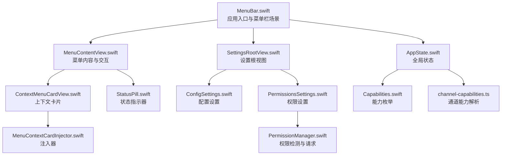
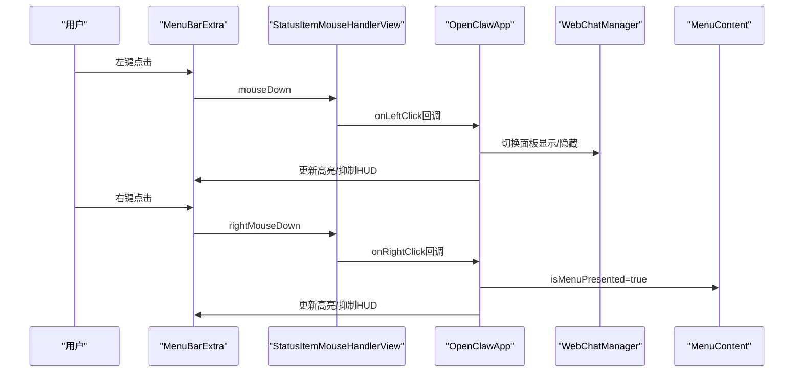
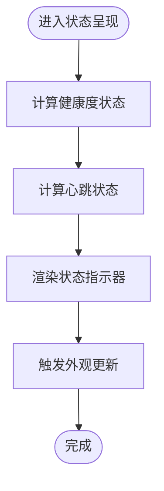
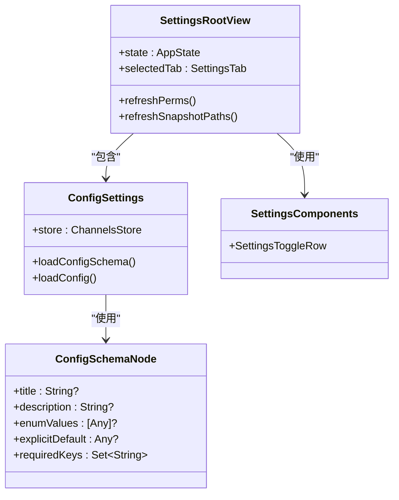
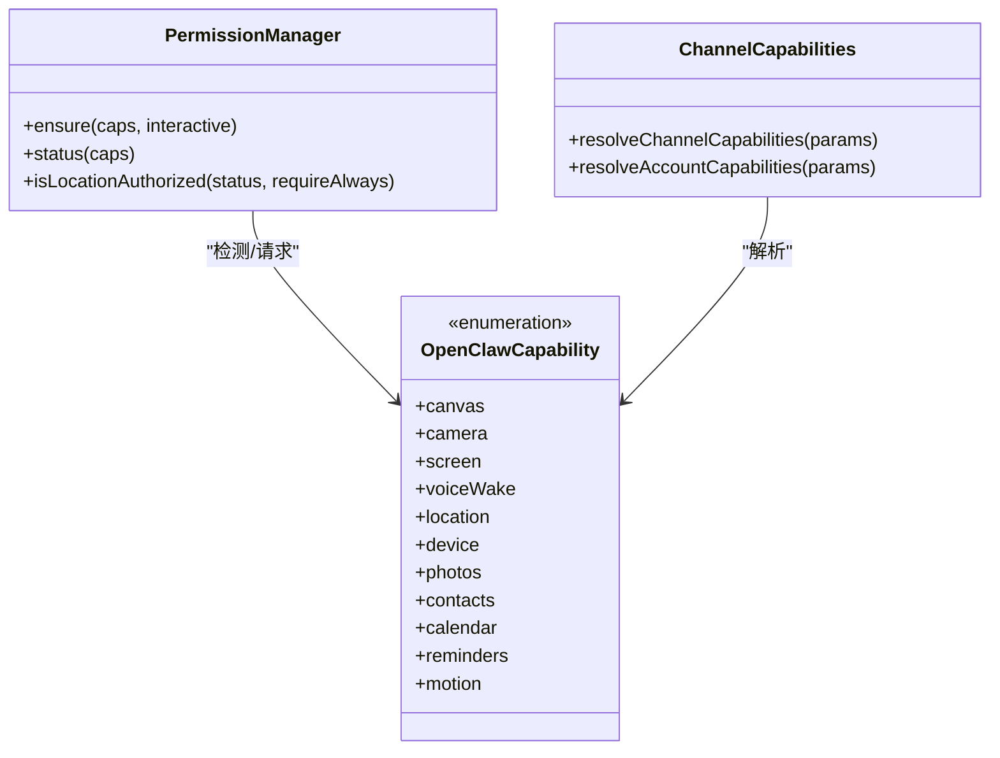
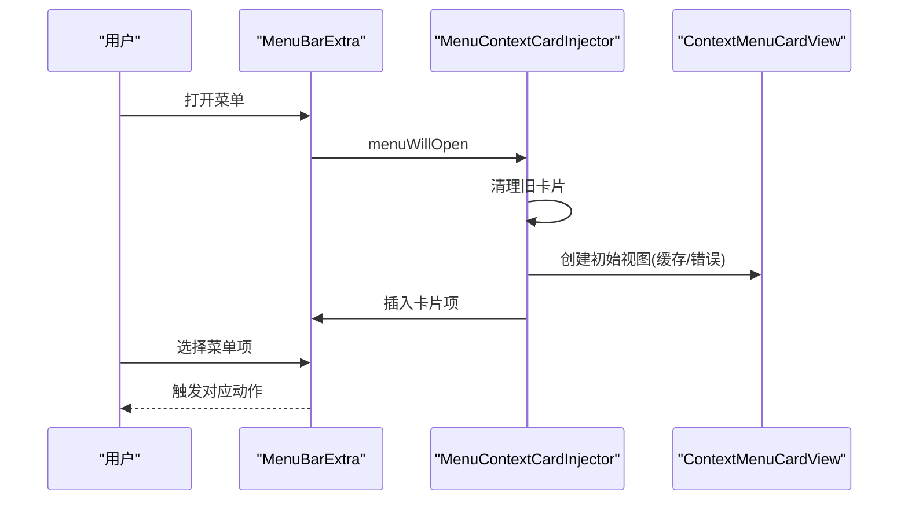
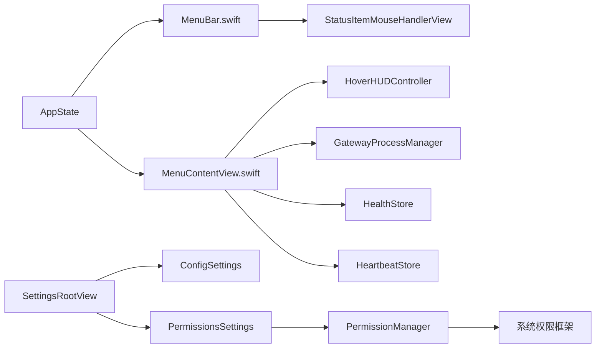

# 菜单栏控制

<cite>
**本文引用的文件**
- [apps/macos/Sources/OpenClaw/MenuBar.swift](file://apps/macos/Sources/OpenClaw/MenuBar.swift)
- [apps/macos/Sources/OpenClaw/MenuContentView.swift](file://apps/macos/Sources/OpenClaw/MenuContentView.swift)
- [apps/macos/Sources/OpenClaw/SettingsRootView.swift](file://apps/macos/Sources/OpenClaw/SettingsRootView.swift)
- [apps/macos/Sources/OpenClaw/ConfigSettings.swift](file://apps/macos/Sources/OpenClaw/ConfigSettings.swift)
- [apps/macos/Sources/OpenClaw/ConfigSchemaSupport.swift](file://apps/macos/Sources/OpenClaw/ConfigSchemaSupport.swift)
- [apps/macos/Sources/OpenClaw/SettingsComponents.swift](file://apps/macos/Sources/OpenClaw/SettingsComponents.swift)
- [apps/macos/Sources/OpenClaw/PermissionsSettings.swift](file://apps/macos/Sources/OpenClaw/PermissionsSettings.swift)
- [apps/macos/Sources/OpenClaw/PermissionManager.swift](file://apps/macos/Sources/OpenClaw/PermissionManager.swift)
- [apps/macos/Sources/OpenClaw/AppState.swift](file://apps/macos/Sources/OpenClaw/AppState.swift)
- [apps/macos/Sources/OpenClaw/StatusPill.swift](file://apps/macos/Sources/OpenClaw/StatusPill.swift)
- [apps/macos/Sources/OpenClaw/ContextMenuCardView.swift](file://apps/macos/Sources/OpenClaw/ContextMenuCardView.swift)
- [apps/macos/Sources/OpenClaw/MenuContextCardInjector.swift](file://apps/macos/Sources/OpenClaw/MenuContextCardInjector.swift)
- [apps/shared/OpenClawKit/Sources/OpenClawKit/Capabilities.swift](file://apps/shared/OpenClawKit/Sources/OpenClawKit/Capabilities.swift)
- [src/config/channel-capabilities.ts](file://src/config/channel-capabilities.ts)
- [src/commands/status.command.ts](file://src/commands/status.command.ts)
- [src/infra/heartbeat-visibility.test.ts](file://src/infra/heartbeat-visibility.test.ts)
</cite>

## 目录

1. [简介](#简介)
2. [项目结构](#项目结构)
3. [核心组件](#核心组件)
4. [架构总览](#架构总览)
5. [详细组件分析](#详细组件分析)
6. [依赖关系分析](#依赖关系分析)
7. [性能考量](#性能考量)
8. [故障排查指南](#故障排查指南)
9. [结论](#结论)
10. [附录](#附录)

## 简介

本文件面向OpenClaw在macOS平台的菜单栏控制功能，系统性梳理菜单栏集成、状态指示与交互控制、状态模块（Status）与通知机制、设置模块（Settings）的配置界面与偏好项、能力模块（Capabilities）的功能权限管理与能力检测、菜单栏快捷键与上下文菜单/右键操作的实现细节，并总结内存占用优化、后台运行策略与系统集成最佳实践。

## 项目结构

OpenClaw的macOS菜单栏控制主要由SwiftUI应用入口、菜单内容视图、设置视图、权限与能力管理等模块组成。应用通过MenuBarExtra集成到菜单栏，使用自定义鼠标事件拦截器处理点击与悬停，菜单内容动态反映应用状态与外部服务健康度。

**图表来源**

- [apps/macos/Sources/OpenClaw/MenuBar.swift](file://apps/macos/Sources/OpenClaw/MenuBar.swift#L41-L92)
- [apps/macos/Sources/OpenClaw/MenuContentView.swift](file://apps/macos/Sources/OpenClaw/MenuContentView.swift#L41-L183)
- [apps/macos/Sources/OpenClaw/SettingsRootView.swift](file://apps/macos/Sources/OpenClaw/SettingsRootView.swift#L20-L110)
- [apps/macos/Sources/OpenClaw/ConfigSettings.swift](file://apps/macos/Sources/OpenClaw/ConfigSettings.swift#L16-L33)
- [apps/macos/Sources/OpenClaw/PermissionsSettings.swift](file://apps/macos/Sources/OpenClaw/PermissionsSettings.swift#L6-L31)
- [apps/macos/Sources/OpenClaw/PermissionManager.swift](file://apps/macos/Sources/OpenClaw/PermissionManager.swift#L25-L31)
- [apps/macos/Sources/OpenClaw/ContextMenuCardView.swift](file://apps/macos/Sources/OpenClaw/ContextMenuCardView.swift#L5-L23)
- [apps/macos/Sources/OpenClaw/MenuContextCardInjector.swift](file://apps/macos/Sources/OpenClaw/MenuContextCardInjector.swift#L35-L70)
- [apps/macos/Sources/OpenClaw/AppState.swift](file://apps/macos/Sources/OpenClaw/AppState.swift#L8-L331)
- [apps/macos/Sources/OpenClaw/StatusPill.swift](file://apps/macos/Sources/OpenClaw/StatusPill.swift#L3-L15)
- [apps/shared/OpenClawKit/Sources/OpenClawKit/Capabilities.swift](file://apps/shared/OpenClawKit/Sources/OpenClawKit/Capabilities.swift#L3-L15)
- [src/config/channel-capabilities.ts](file://src/config/channel-capabilities.ts#L51-L73)

**章节来源**

- [apps/macos/Sources/OpenClaw/MenuBar.swift](file://apps/macos/Sources/OpenClaw/MenuBar.swift#L41-L92)
- [apps/macos/Sources/OpenClaw/MenuContentView.swift](file://apps/macos/Sources/OpenClaw/MenuContentView.swift#L41-L183)

## 核心组件

- 应用入口与菜单栏场景：负责初始化状态、注册菜单栏、安装鼠标事件拦截器、响应状态变化并更新外观。
- 菜单内容视图：提供开关与按钮，绑定全局状态，展示健康度与心跳状态，支持调试菜单与快捷键。
- 设置根视图：多标签页设置中心，按需加载权限监控，支持通知驱动的标签切换。
- 配置设置：基于配置模式生成UI，异步加载schema与配置，支持预览与Nix模式提示。
- 权限设置与权限管理：集中展示与刷新权限状态，逐项请求授权，支持位置权限与系统设置跳转。
- 能力模块：定义OpenClaw能力集合，配合通道能力解析决定功能可用性。
- 上下文卡片与注入器：在菜单顶部插入上下文卡片，动态加载会话信息与状态文本。
- 全局状态：统一管理连接模式、心跳、语音唤醒、画布、执行审批等状态项。

**章节来源**

- [apps/macos/Sources/OpenClaw/MenuBar.swift](file://apps/macos/Sources/OpenClaw/MenuBar.swift#L134-L173)
- [apps/macos/Sources/OpenClaw/MenuContentView.swift](file://apps/macos/Sources/OpenClaw/MenuContentView.swift#L41-L183)
- [apps/macos/Sources/OpenClaw/SettingsRootView.swift](file://apps/macos/Sources/OpenClaw/SettingsRootView.swift#L20-L110)
- [apps/macos/Sources/OpenClaw/ConfigSettings.swift](file://apps/macos/Sources/OpenClaw/ConfigSettings.swift#L16-L33)
- [apps/macos/Sources/OpenClaw/PermissionsSettings.swift](file://apps/macos/Sources/OpenClaw/PermissionsSettings.swift#L99-L128)
- [apps/macos/Sources/OpenClaw/PermissionManager.swift](file://apps/macos/Sources/OpenClaw/PermissionManager.swift#L25-L31)
- [apps/macos/Sources/OpenClaw/ContextMenuCardView.swift](file://apps/macos/Sources/OpenClaw/ContextMenuCardView.swift#L5-L23)
- [apps/macos/Sources/OpenClaw/MenuContextCardInjector.swift](file://apps/macos/Sources/OpenClaw/MenuContextCardInjector.swift#L35-L70)
- [apps/macos/Sources/OpenClaw/AppState.swift](file://apps/macos/Sources/OpenClaw/AppState.swift#L8-L331)
- [apps/shared/OpenClawKit/Sources/OpenClawKit/Capabilities.swift](file://apps/shared/OpenClawKit/Sources/OpenClawKit/Capabilities.swift#L3-L15)
- [src/config/channel-capabilities.ts](file://src/config/channel-capabilities.ts#L51-L73)

## 架构总览

菜单栏控制采用“状态驱动+事件拦截”的架构：MenuBarExtra作为入口，MenuContentView根据AppState与外部服务状态渲染；通过自定义NSView拦截点击与悬停，实现左键打开聊天面板、右键弹出菜单、悬停HUD抑制等行为；设置视图通过通知与任务异步加载配置与权限状态。

**图表来源**

- [apps/macos/Sources/OpenClaw/MenuBar.swift](file://apps/macos/Sources/OpenClaw/MenuBar.swift#L134-L173)
- [apps/macos/Sources/OpenClaw/MenuBar.swift](file://apps/macos/Sources/OpenClaw/MenuBar.swift#L216-L227)
- [apps/macos/Sources/OpenClaw/MenuContentView.swift](file://apps/macos/Sources/OpenClaw/MenuContentView.swift#L149-L156)

## 详细组件分析

### 状态模块（Status）

- 状态聚合与呈现
  - 健康度状态：结合工作活动与健康检查结果，动态显示主/其他角色与最近检查时间。
  - 心跳状态：根据控制通道与心跳存储，显示最后心跳发送/成功/跳过/失败及年龄。
  - 状态指示器：使用小圆点颜色与文本组合，清晰表达当前状态。
- 通知机制
  - 通过状态变更触发外观更新（如禁用态、睡眠态），影响菜单栏图标的视觉反馈。
  - 支持心跳就绪提示与更新就绪提醒（若启用Sparkle）。
- 与命令行状态输出的关系
  - 命令行status输出会汇总代理状态、守护进程与节点守护进程摘要，用于CLI诊断与自动化脚本。

**图表来源**

- [apps/macos/Sources/OpenClaw/MenuContentView.swift](file://apps/macos/Sources/OpenClaw/MenuContentView.swift#L350-L418)
- [apps/macos/Sources/OpenClaw/StatusPill.swift](file://apps/macos/Sources/OpenClaw/StatusPill.swift#L3-L15)
- [src/commands/status.command.ts](file://src/commands/status.command.ts#L236-L264)

**章节来源**

- [apps/macos/Sources/OpenClaw/MenuContentView.swift](file://apps/macos/Sources/OpenClaw/MenuContentView.swift#L350-L418)
- [apps/macos/Sources/OpenClaw/StatusPill.swift](file://apps/macos/Sources/OpenClaw/StatusPill.swift#L3-L15)
- [src/commands/status.command.ts](file://src/commands/status.command.ts#L236-L264)

### 设置模块（Settings）

- 多标签页设置中心
  - 包含通用、通道、语音唤醒、配置、实例、会话、定时任务、技能、权限、调试、关于等标签。
  - 支持Nix模式提示与路径快照，便于运维与容器化环境管理。
- 配置设置
  - 异步加载配置schema与当前配置，支持预览模式与首次加载。
  - 通过ConfigSchemaSupport解析UI提示（标签、帮助、顺序、敏感字段等）。
- 设置组件
  - 提供复用的设置控件（如开关行），统一风格与交互。
- 设置标签路由
  - 通过通知中心接收标签选择请求，平滑切换至目标标签。

**图表来源**

- [apps/macos/Sources/OpenClaw/SettingsRootView.swift](file://apps/macos/Sources/OpenClaw/SettingsRootView.swift#L4-L110)
- [apps/macos/Sources/OpenClaw/ConfigSettings.swift](file://apps/macos/Sources/OpenClaw/ConfigSettings.swift#L16-L33)
- [apps/macos/Sources/OpenClaw/ConfigSchemaSupport.swift](file://apps/macos/Sources/OpenClaw/ConfigSchemaSupport.swift#L34-L49)
- [apps/macos/Sources/OpenClaw/SettingsComponents.swift](file://apps/macos/Sources/OpenClaw/SettingsComponents.swift#L3-L24)

**章节来源**

- [apps/macos/Sources/OpenClaw/SettingsRootView.swift](file://apps/macos/Sources/OpenClaw/SettingsRootView.swift#L20-L110)
- [apps/macos/Sources/OpenClaw/ConfigSettings.swift](file://apps/macos/Sources/OpenClaw/ConfigSettings.swift#L16-L33)
- [apps/macos/Sources/OpenClaw/ConfigSchemaSupport.swift](file://apps/macos/Sources/OpenClaw/ConfigSchemaSupport.swift#L10-L49)
- [apps/macos/Sources/OpenClaw/SettingsComponents.swift](file://apps/macos/Sources/OpenClaw/SettingsComponents.swift#L3-L24)

### 能力模块（Capabilities）

- 能力枚举
  - 定义OpenClaw能力集合（如画布、相机、屏幕、语音唤醒、位置、设备、照片、联系人、日历、提醒事项、运动）。
- 通道能力解析
  - 根据通道与账户配置解析最终能力集，支持账户级覆盖与默认能力合并。
- 权限管理
  - PermissionManager对各类系统权限进行检测与请求，包括通知、AppleScript、无障碍、屏幕录制、麦克风、语音识别、摄像头、位置等。

**图表来源**

- [apps/shared/OpenClawKit/Sources/OpenClawKit/Capabilities.swift](file://apps/shared/OpenClawKit/Sources/OpenClawKit/Capabilities.swift#L3-L15)
- [apps/macos/Sources/OpenClaw/PermissionManager.swift](file://apps/macos/Sources/OpenClaw/PermissionManager.swift#L25-L31)
- [src/config/channel-capabilities.ts](file://src/config/channel-capabilities.ts#L51-L73)

**章节来源**

- [apps/shared/OpenClawKit/Sources/OpenClawKit/Capabilities.swift](file://apps/shared/OpenClawKit/Sources/OpenClawKit/Capabilities.swift#L3-L15)
- [apps/macos/Sources/OpenClaw/PermissionManager.swift](file://apps/macos/Sources/OpenClaw/PermissionManager.swift#L12-L31)
- [src/config/channel-capabilities.ts](file://src/config/channel-capabilities.ts#L51-L73)

### 菜单栏快捷键、上下文菜单与右键操作

- 快捷键
  - 打开设置使用Command+逗号快捷键。
- 上下文菜单
  - 在菜单顶部插入上下文卡片，展示会话行与状态文本，支持缓存与错误提示。
  - 注入器在菜单打开时动态插入卡片视图，避免重复与错位。
- 右键操作
  - 右键点击菜单栏图标不触发系统菜单，而是由拦截器接管，直接将菜单呈现为isMenuPresented绑定的菜单视图。

**图表来源**

- [apps/macos/Sources/OpenClaw/MenuContentView.swift](file://apps/macos/Sources/OpenClaw/MenuContentView.swift#L149-L156)
- [apps/macos/Sources/OpenClaw/ContextMenuCardView.swift](file://apps/macos/Sources/OpenClaw/ContextMenuCardView.swift#L5-L23)
- [apps/macos/Sources/OpenClaw/MenuContextCardInjector.swift](file://apps/macos/Sources/OpenClaw/MenuContextCardInjector.swift#L35-L70)

**章节来源**

- [apps/macos/Sources/OpenClaw/MenuContentView.swift](file://apps/macos/Sources/OpenClaw/MenuContentView.swift#L149-L156)
- [apps/macos/Sources/OpenClaw/ContextMenuCardView.swift](file://apps/macos/Sources/OpenClaw/ContextMenuCardView.swift#L5-L23)
- [apps/macos/Sources/OpenClaw/MenuContextCardInjector.swift](file://apps/macos/Sources/OpenClaw/MenuContextCardInjector.swift#L35-L70)

### 菜单栏图标与状态指示器

- 图标状态
  - 根据工作状态、睡眠态、动画开关与图标覆盖策略综合决定最终图标状态。
  - 睡眠态时禁用外观以提示不可用。
- 状态指示器
  - 使用小圆点+文本组合，颜色区分健康度与心跳状态，支持多行文本与自适应布局。

**章节来源**

- [apps/macos/Sources/OpenClaw/MenuBar.swift](file://apps/macos/Sources/OpenClaw/MenuBar.swift#L194-L206)
- [apps/macos/Sources/OpenClaw/MenuBar.swift](file://apps/macos/Sources/OpenClaw/MenuBar.swift#L94-L96)
- [apps/macos/Sources/OpenClaw/StatusPill.swift](file://apps/macos/Sources/OpenClaw/StatusPill.swift#L3-L15)

## 依赖关系分析

- 组件耦合
  - MenuBarExtra依赖AppState与Gateway状态，通过拦截器与HUD控制器协调UI反馈。
  - MenuContentView依赖多个服务（健康、心跳、网关、会话、画布、语音唤醒）以渲染菜单。
  - 设置模块通过ChannelsStore与PermissionMonitor解耦配置与权限刷新。
- 外部依赖
  - 系统权限框架（通知、AppleScript、无障碍、屏幕录制、音频/视频、位置、UNUserNotificationCenter）。
  - Sparkle（可选）用于更新检查与下载。
- 循环依赖
  - 未发现直接循环依赖；状态与视图通过观察者模式松耦合。

**图表来源**

- [apps/macos/Sources/OpenClaw/AppState.swift](file://apps/macos/Sources/OpenClaw/AppState.swift#L8-L331)
- [apps/macos/Sources/OpenClaw/MenuBar.swift](file://apps/macos/Sources/OpenClaw/MenuBar.swift#L41-L92)
- [apps/macos/Sources/OpenClaw/MenuContentView.swift](file://apps/macos/Sources/OpenClaw/MenuContentView.swift#L8-L33)
- [apps/macos/Sources/OpenClaw/SettingsRootView.swift](file://apps/macos/Sources/OpenClaw/SettingsRootView.swift#L4-L110)
- [apps/macos/Sources/OpenClaw/PermissionsSettings.swift](file://apps/macos/Sources/OpenClaw/PermissionsSettings.swift#L6-L31)
- [apps/macos/Sources/OpenClaw/PermissionManager.swift](file://apps/macos/Sources/OpenClaw/PermissionManager.swift#L12-L31)

**章节来源**

- [apps/macos/Sources/OpenClaw/AppState.swift](file://apps/macos/Sources/OpenClaw/AppState.swift#L8-L331)
- [apps/macos/Sources/OpenClaw/MenuBar.swift](file://apps/macos/Sources/OpenClaw/MenuBar.swift#L41-L92)
- [apps/macos/Sources/OpenClaw/MenuContentView.swift](file://apps/macos/Sources/OpenClaw/MenuContentView.swift#L8-L33)
- [apps/macos/Sources/OpenClaw/SettingsRootView.swift](file://apps/macos/Sources/OpenClaw/SettingsRootView.swift#L4-L110)
- [apps/macos/Sources/OpenClaw/PermissionsSettings.swift](file://apps/macos/Sources/OpenClaw/PermissionsSettings.swift#L6-L31)
- [apps/macos/Sources/OpenClaw/PermissionManager.swift](file://apps/macos/Sources/OpenClaw/PermissionManager.swift#L12-L31)

## 性能考量

- 内存占用优化
  - 菜单内容视图仅在出现时加载微控制器与设备列表，消失时取消任务与停止观察器，降低常驻内存。
  - 语音唤醒与推词说话热键在支持情况下才启用，避免无效资源占用。
- 后台运行策略
  - 连接模式切换时延迟同步配置，避免频繁写盘；权限监控仅在权限标签页激活时进行。
  - 睡眠态（远程未连接或本地未启动）时禁用外观与动画，减少CPU/GPU消耗。
- 系统集成最佳实践
  - 使用MenuBarExtraAccess与透明拦截器避免抢占菜单栏所有权。
  - 通过HUD控制器抑制悬浮提示，提升菜单交互体验。

**章节来源**

- [apps/macos/Sources/OpenClaw/MenuContentView.swift](file://apps/macos/Sources/OpenClaw/MenuContentView.swift#L172-L179)
- [apps/macos/Sources/OpenClaw/MenuContentView.swift](file://apps/macos/Sources/OpenClaw/MenuContentView.swift#L163-L168)
- [apps/macos/Sources/OpenClaw/MenuBar.swift](file://apps/macos/Sources/OpenClaw/MenuBar.swift#L94-L96)
- [apps/macos/Sources/OpenClaw/MenuBar.swift](file://apps/macos/Sources/OpenClaw/MenuBar.swift#L134-L173)

## 故障排查指南

- 心跳可见性配置
  - 不同通道的心跳显示策略可通过配置解析，支持是否显示OK、是否告警、是否使用指示器。
- 权限问题
  - 若语音唤醒或推词说话无法使用，检查权限状态并逐项授权；位置权限需要系统设置确认。
- 菜单无响应
  - 检查右键是否被拦截器接管；确认isMenuPresented绑定是否正确更新。
- 设置页面不刷新
  - 确认权限监控已注册且在权限标签页；检查通知广播与标签路由逻辑。

**章节来源**

- [src/infra/heartbeat-visibility.test.ts](file://src/infra/heartbeat-visibility.test.ts#L188-L249)
- [apps/macos/Sources/OpenClaw/PermissionsSettings.swift](file://apps/macos/Sources/OpenClaw/PermissionsSettings.swift#L99-L128)
- [apps/macos/Sources/OpenClaw/MenuContentView.swift](file://apps/macos/Sources/OpenClaw/MenuContentView.swift#L149-L156)
- [apps/macos/Sources/OpenClaw/SettingsRootView.swift](file://apps/macos/Sources/OpenClaw/SettingsRootView.swift#L98-L101)

## 结论

OpenClaw的macOS菜单栏控制通过清晰的状态驱动与事件拦截机制，实现了稳定的菜单栏集成、直观的状态指示与丰富的交互控制。设置模块提供完善的配置与权限管理，能力模块确保功能在合规前提下可用。结合性能优化与系统集成最佳实践，可在保证用户体验的同时降低资源占用并提升稳定性。

## 附录

- 快捷键速查
  - 打开设置：Command + 逗号
- 常见问题
  - 心跳状态异常：检查通道配置与网络连通性。
  - 权限缺失：在“权限”标签页逐一授权，必要时跳转系统设置。
  - 菜单不显示：确认连接模式与远程/本地状态，确保isMenuPresented正确更新。
