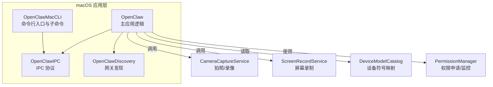
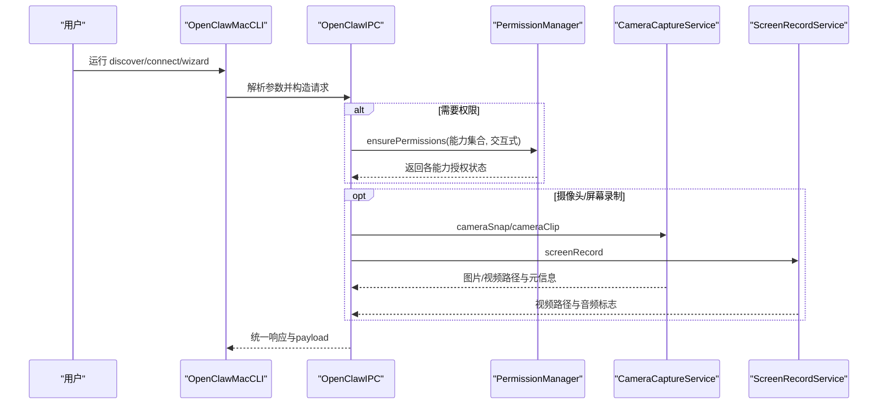
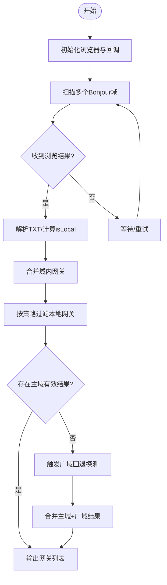
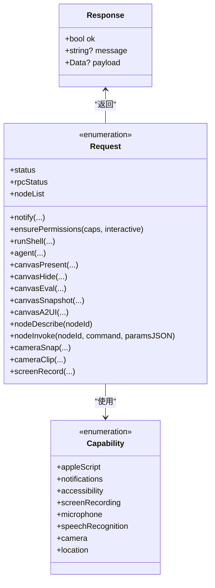
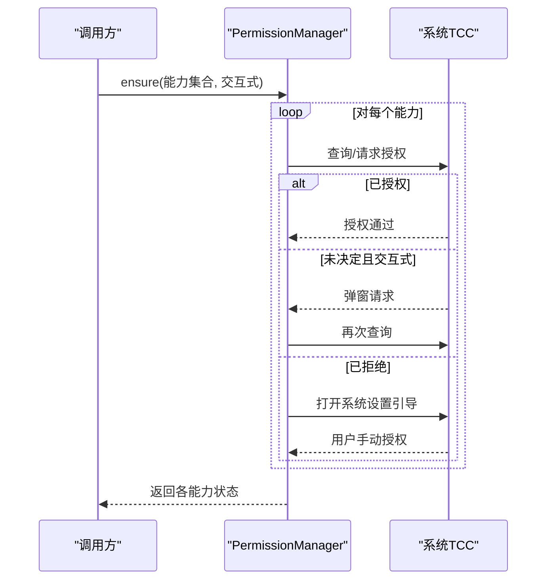
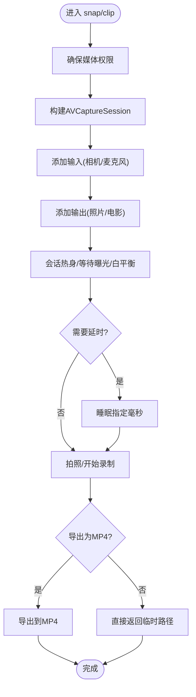
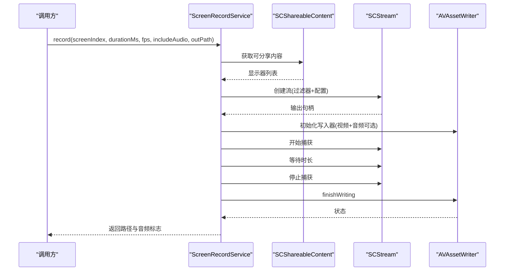
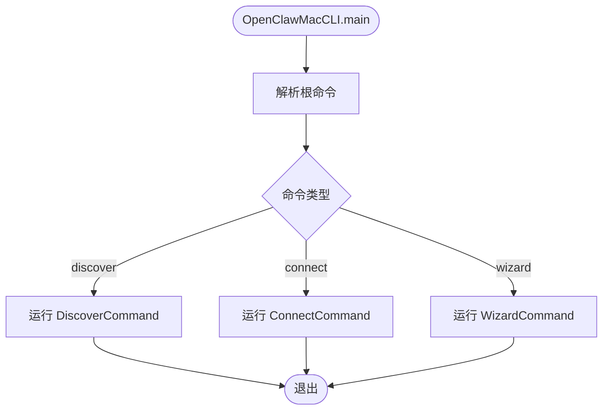
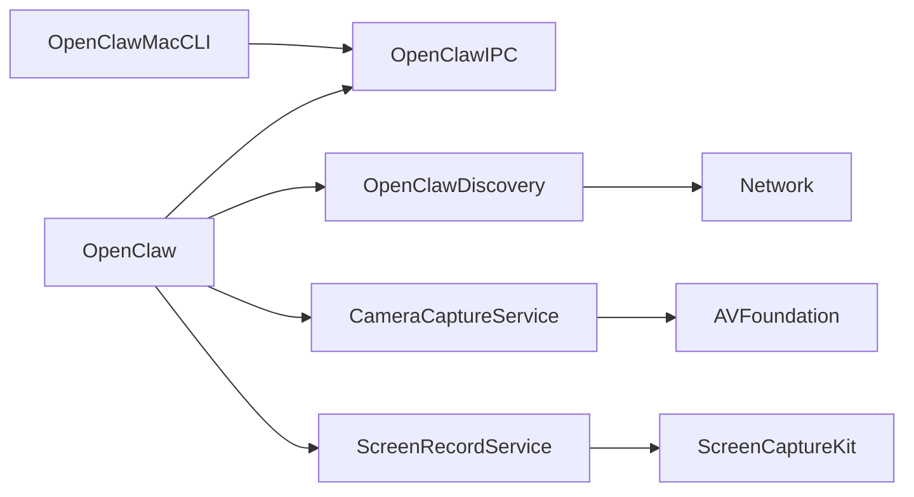

# 设备集成

<cite>
**本文引用的文件**
- [apps/macos/Sources/OpenClawDiscovery/GatewayDiscoveryModel.swift](file://apps/macos/Sources/OpenClawDiscovery/GatewayDiscoveryModel.swift)
- [apps/macos/Sources/OpenClawIPC/IPC.swift](file://apps/macos/Sources/OpenClawIPC/IPC.swift)
- [apps/macos/Sources/OpenClaw/PermissionManager.swift](file://apps/macos/Sources/OpenClaw/PermissionManager.swift)
- [apps/macos/Sources/OpenClaw/CameraCaptureService.swift](file://apps/macos/Sources/OpenClaw/CameraCaptureService.swift)
- [apps/macos/Sources/OpenClaw/ScreenRecordService.swift](file://apps/macos/Sources/OpenClaw/ScreenRecordService.swift)
- [apps/macos/Sources/OpenClaw/DeviceModelCatalog.swift](file://apps/macos/Sources/OpenClaw/DeviceModelCatalog.swift)
- [apps/macos/Sources/OpenClawMacCLI/EntryPoint.swift](file://apps/macos/Sources/OpenClawMacCLI/EntryPoint.swift)
- [apps/macos/Sources/OpenClawMacCLI/DiscoverCommand.swift](file://apps/macos/Sources/OpenClawMacCLI/DiscoverCommand.swift)
- [apps/macos/Sources/OpenClawMacCLI/ConnectCommand.swift](file://apps/macos/Sources/OpenClawMacCLI/ConnectCommand.swift)
- [apps/macos/Sources/OpenClawMacCLI/WizardCommand.swift](file://apps/macos/Sources/OpenClawMacCLI/WizardCommand.swift)
- [apps/macos/Sources/OpenClawMacCLI/GatewayConfig.swift](file://apps/macos/Sources/OpenClawMacCLI/GatewayConfig.swift)
- [apps/macos/Sources/OpenClawMacCLI/TypeAliases.swift](file://apps/macos/Sources/OpenClawMacCLI/TypeAliases.swift)
</cite>

## 目录

1. [简介](#简介)
2. [项目结构](#项目结构)
3. [核心组件](#核心组件)
4. [架构总览](#架构总览)
5. [详细组件分析](#详细组件分析)
6. [依赖关系分析](#依赖关系分析)
7. [性能考虑](#性能考虑)
8. [故障排查指南](#故障排查指南)
9. [结论](#结论)
10. [附录](#附录)

## 简介

本文件面向OpenClaw在macOS平台的设备集成功能，聚焦以下方面：

- 硬件设备访问：摄像头、麦克风、屏幕录制等多媒体能力
- 权限管理：系统TCC（透明检查）权限的申请、状态监控与交互式授权
- 设备状态监控：权限状态轮询、设备可用性检测
- 设备发现与连接：基于Bonjour的网关发现、本地/远程连接流程
- 摄像头控制与图像捕获：拍照、短视频录制、导出与尺寸质量控制
- 屏幕录制：多显示器选择、帧率、音频采集与写入
- 设备兼容性与符号映射：设备族与型号到UI符号的映射
- 命令行工具：discover/connect/wizard三类命令的用法与参数
- 隐私与安全：最小化权限请求、错误处理与用户引导
- 兼容性测试与驱动：系统版本差异、外部设备支持
- 性能监控与优化：采样缓冲、导出策略、延迟补偿

## 项目结构

OpenClaw macOS相关代码主要位于apps/macos目录，按功能划分为多个模块：

- OpenClawDiscovery：网关发现与DNS-SD/Bonjour集成
- OpenClawIPC：跨进程通信协议定义（请求/响应、能力枚举）
- OpenClaw：主应用逻辑（权限管理、摄像头、屏幕录制、设备模型等）
- OpenClawMacCLI：命令行工具入口与子命令实现
- OpenClawProtocol：协议相关（如网关端点ID等）

**图表来源**

- [apps/macos/Sources/OpenClawMacCLI/EntryPoint.swift](file://apps/macos/Sources/OpenClawMacCLI/EntryPoint.swift#L1-L57)
- [apps/macos/Sources/OpenClawDiscovery/GatewayDiscoveryModel.swift](file://apps/macos/Sources/OpenClawDiscovery/GatewayDiscoveryModel.swift#L1-L685)
- [apps/macos/Sources/OpenClawIPC/IPC.swift](file://apps/macos/Sources/OpenClawIPC/IPC.swift#L1-L418)
- [apps/macos/Sources/OpenClaw/CameraCaptureService.swift](file://apps/macos/Sources/OpenClaw/CameraCaptureService.swift#L1-L426)
- [apps/macos/Sources/OpenClaw/ScreenRecordService.swift](file://apps/macos/Sources/OpenClaw/ScreenRecordService.swift#L1-L267)
- [apps/macos/Sources/OpenClaw/DeviceModelCatalog.swift](file://apps/macos/Sources/OpenClaw/DeviceModelCatalog.swift#L1-L189)
- [apps/macos/Sources/OpenClaw/PermissionManager.swift](file://apps/macos/Sources/OpenClaw/PermissionManager.swift#L1-L507)

**章节来源**

- [apps/macos/Sources/OpenClawMacCLI/EntryPoint.swift](file://apps/macos/Sources/OpenClawMacCLI/EntryPoint.swift#L1-L57)
- [apps/macos/Sources/OpenClawDiscovery/GatewayDiscoveryModel.swift](file://apps/macos/Sources/OpenClawDiscovery/GatewayDiscoveryModel.swift#L1-L685)
- [apps/macos/Sources/OpenClawIPC/IPC.swift](file://apps/macos/Sources/OpenClawIPC/IPC.swift#L1-L418)
- [apps/macos/Sources/OpenClaw/CameraCaptureService.swift](file://apps/macos/Sources/OpenClaw/CameraCaptureService.swift#L1-L426)
- [apps/macos/Sources/OpenClaw/ScreenRecordService.swift](file://apps/macos/Sources/OpenClaw/ScreenRecordService.swift#L1-L267)
- [apps/macos/Sources/OpenClaw/DeviceModelCatalog.swift](file://apps/macos/Sources/OpenClaw/DeviceModelCatalog.swift#L1-L189)
- [apps/macos/Sources/OpenClaw/PermissionManager.swift](file://apps/macos/Sources/OpenClaw/PermissionManager.swift#L1-L507)

## 核心组件

- 设备发现与连接（GatewayDiscoveryModel）
  - 基于Bonjour服务类型扫描，解析TXT记录，合并本地/广域结果，去重排序，过滤本地实例
  - 支持TXT解析器异步解析缺失字段，宽域发现回退机制
- IPC协议（OpenClawIPC）
  - 定义能力枚举（通知、AppleScript、无障碍、屏幕录制、麦克风、语音识别、相机、位置）
  - 请求类型覆盖通知、权限确保、Shell执行、状态查询、Canvas操作、节点列表/描述/调用、摄像头拍照/录像、屏幕录制
  - 响应统一结构，携带payload或错误消息
- 权限管理（PermissionManager）
  - 统一入口确保多种能力；分别处理通知、AppleScript、无障碍、屏幕录制、麦克风、语音识别、相机、位置
  - 提供状态查询与周期性监控（PermissionMonitor）
- 摄像头控制（CameraCaptureService）
  - 列举设备、选择前置/后置/指定ID设备
  - 拍照（可选延时、尺寸与质量裁剪）、短视频录制（含音频）、导出MP4
  - 自动曝光/白平衡等待、会话热身、权限保障
- 屏幕录制（ScreenRecordService）
  - 多显示器内容获取、SCStream配置、视频/音频写入、帧率限制、时长控制
- 设备模型与符号（DeviceModelCatalog）
  - 将设备型号/家族映射为友好名称与UI符号，支持iOS/macOS标识符资源

**章节来源**

- [apps/macos/Sources/OpenClawDiscovery/GatewayDiscoveryModel.swift](file://apps/macos/Sources/OpenClawDiscovery/GatewayDiscoveryModel.swift#L1-L685)
- [apps/macos/Sources/OpenClawIPC/IPC.swift](file://apps/macos/Sources/OpenClawIPC/IPC.swift#L1-L418)
- [apps/macos/Sources/OpenClaw/PermissionManager.swift](file://apps/macos/Sources/OpenClaw/PermissionManager.swift#L1-L507)
- [apps/macos/Sources/OpenClaw/CameraCaptureService.swift](file://apps/macos/Sources/OpenClaw/CameraCaptureService.swift#L1-L426)
- [apps/macos/Sources/OpenClaw/ScreenRecordService.swift](file://apps/macos/Sources/OpenClaw/ScreenRecordService.swift#L1-L267)
- [apps/macos/Sources/OpenClaw/DeviceModelCatalog.swift](file://apps/macos/Sources/OpenClaw/DeviceModelCatalog.swift#L1-L189)

## 架构总览

下图展示从命令行到IPC再到具体设备能力的调用链路。

**图表来源**

- [apps/macos/Sources/OpenClawMacCLI/EntryPoint.swift](file://apps/macos/Sources/OpenClawMacCLI/EntryPoint.swift#L1-L57)
- [apps/macos/Sources/OpenClawIPC/IPC.swift](file://apps/macos/Sources/OpenClawIPC/IPC.swift#L108-L136)
- [apps/macos/Sources/OpenClaw/PermissionManager.swift](file://apps/macos/Sources/OpenClaw/PermissionManager.swift#L25-L31)
- [apps/macos/Sources/OpenClaw/CameraCaptureService.swift](file://apps/macos/Sources/OpenClaw/CameraCaptureService.swift#L51-L118)
- [apps/macos/Sources/OpenClaw/ScreenRecordService.swift](file://apps/macos/Sources/OpenClaw/ScreenRecordService.swift#L30-L98)

## 详细组件分析

### 设备发现与连接（GatewayDiscoveryModel）

- 功能要点
  - 启动NWBrowser扫描多个Bonjour域，监听状态变化与结果变更
  - 解析服务端点的TXT记录，合并已解析与待解析项
  - 本地身份构建（主机名/显示名令牌），用于区分本地/远端网关
  - 广域回退：当本地域仅返回本地结果时，启动定时探测并合并结果
  - 去重与排序：基于稳定ID去重，按显示名排序
- 关键流程（启动/更新/重组）
  - start：初始化浏览器、注册回调、启动队列
  - browseResultsChangedHandler：更新域内结果、解析TXT、计算isLocal
  - recomputeGateways：优先主域非本地结果，否则回退广域结果
  - scheduleWideAreaFallback：指数退避探测，避免测试环境无限循环
- 错误与状态
  - 状态文本根据NWBrowser状态映射（Setup/Searching/Waiting/Failed）
  - TXT解析失败/取消不阻断整体流程

**图表来源**

- [apps/macos/Sources/OpenClawDiscovery/GatewayDiscoveryModel.swift](file://apps/macos/Sources/OpenClawDiscovery/GatewayDiscoveryModel.swift#L81-L144)
- [apps/macos/Sources/OpenClawDiscovery/GatewayDiscoveryModel.swift](file://apps/macos/Sources/OpenClawDiscovery/GatewayDiscoveryModel.swift#L168-L185)
- [apps/macos/Sources/OpenClawDiscovery/GatewayDiscoveryModel.swift](file://apps/macos/Sources/OpenClawDiscovery/GatewayDiscoveryModel.swift#L246-L277)

**章节来源**

- [apps/macos/Sources/OpenClawDiscovery/GatewayDiscoveryModel.swift](file://apps/macos/Sources/OpenClawDiscovery/GatewayDiscoveryModel.swift#L1-L685)

### IPC协议与设备能力（OpenClawIPC）

- 能力枚举
  - 包括AppleScript、通知、无障碍、屏幕录制、麦克风、语音识别、相机、位置
- 请求类型
  - 通知：标题/正文/声音/优先级/投递方式
  - 权限：ensurePermissions(能力集合, 交互式)
  - Shell：命令、工作目录、环境、超时、是否需要屏幕录制
  - Canvas：present/hide/eval/snapshot/A2UI
  - 节点：list/describe/invoke
  - 摄像头：snap/clip（含朝向、尺寸、质量、时长、音频、输出路径）
  - 屏幕录制：screenIndex、durationMs、fps、includeAudio、outPath
- 响应
  - ok/message/payload（如PNG字节、stdout文本）

**图表来源**

- [apps/macos/Sources/OpenClawIPC/IPC.swift](file://apps/macos/Sources/OpenClawIPC/IPC.swift#L6-L16)
- [apps/macos/Sources/OpenClawIPC/IPC.swift](file://apps/macos/Sources/OpenClawIPC/IPC.swift#L108-L136)
- [apps/macos/Sources/OpenClawIPC/IPC.swift](file://apps/macos/Sources/OpenClawIPC/IPC.swift#L140-L151)

**章节来源**

- [apps/macos/Sources/OpenClawIPC/IPC.swift](file://apps/macos/Sources/OpenClawIPC/IPC.swift#L1-L418)

### 权限管理（PermissionManager 与 PermissionMonitor）

- 统一入口
  - ensure([Capability], interactive)：并发确保多项能力
  - status([Capability])：查询当前授权状态
- 各能力处理
  - 通知：UNUserNotificationCenter授权状态
  - AppleScript：通过轻量脚本尝试验证Automation授权
  - 无障碍：AXIsProcessTrusted
  - 屏幕录制：CGPreflight/Request Screen Capture Access
  - 麦克风/相机：AVCaptureDevice授权
  - 语音识别：SFSpeechRecognizer授权
  - 位置：CLLocationManager授权，支持whenInUse/always
- 监控
  - PermissionMonitor：定时轮询状态，最小间隔0.5秒，注册计数控制启停

**图表来源**

- [apps/macos/Sources/OpenClaw/PermissionManager.swift](file://apps/macos/Sources/OpenClaw/PermissionManager.swift#L25-L31)
- [apps/macos/Sources/OpenClaw/PermissionManager.swift](file://apps/macos/Sources/OpenClaw/PermissionManager.swift#L54-L75)
- [apps/macos/Sources/OpenClaw/PermissionManager.swift](file://apps/macos/Sources/OpenClaw/PermissionManager.swift#L421-L490)

**章节来源**

- [apps/macos/Sources/OpenClaw/PermissionManager.swift](file://apps/macos/Sources/OpenClaw/PermissionManager.swift#L1-L507)

### 摄像头控制（CameraCaptureService）

- 设备发现与选择
  - 列举内置/连续/外部设备（macOS 14+支持external）
  - 按facing/deviceId选择目标设备
- 拍照
  - 设置photo质量优先、最大宽度与质量裁剪
  - 会话热身、曝光/白平衡稳定、可选延时
  - 使用AVCapturePhotoOutput捕获，转码为JPEG并限制payload大小
- 录制
  - 高质量preset，可选麦克风输入
  - 限制最大录制时长，临时MOV录制后导出MP4
- 错误处理
  - 权限不足、设备不可用、捕获失败、导出失败等细分错误

**图表来源**

- [apps/macos/Sources/OpenClaw/CameraCaptureService.swift](file://apps/macos/Sources/OpenClaw/CameraCaptureService.swift#L51-L118)
- [apps/macos/Sources/OpenClaw/CameraCaptureService.swift](file://apps/macos/Sources/OpenClaw/CameraCaptureService.swift#L120-L196)
- [apps/macos/Sources/OpenClaw/CameraCaptureService.swift](file://apps/macos/Sources/OpenClaw/CameraCaptureService.swift#L279-L314)

**章节来源**

- [apps/macos/Sources/OpenClaw/CameraCaptureService.swift](file://apps/macos/Sources/OpenClaw/CameraCaptureService.swift#L1-L426)

### 屏幕录制（ScreenRecordService）

- 内容获取
  - 使用SCShareableContent.current获取可分享内容（显示器/窗口）
  - 默认选择索引0显示器，支持指定索引
- 流配置
  - 设置分辨率、队列深度、光标显示、最小帧间隔（由fps推导）
  - 可选开启音频采集
- 写入与导出
  - 使用AVAssetWriter写入H.264视频与AAC音频
  - 实时写入队列，结束时finishWriting并校验状态
- 错误处理
  - 无显示器、无效索引、无帧被捕获、写入失败等

**图表来源**

- [apps/macos/Sources/OpenClaw/ScreenRecordService.swift](file://apps/macos/Sources/OpenClaw/ScreenRecordService.swift#L30-L98)
- [apps/macos/Sources/OpenClaw/ScreenRecordService.swift](file://apps/macos/Sources/OpenClaw/ScreenRecordService.swift#L112-L266)

**章节来源**

- [apps/macos/Sources/OpenClaw/ScreenRecordService.swift](file://apps/macos/Sources/OpenClaw/ScreenRecordService.swift#L1-L267)

### 设备模型与符号（DeviceModelCatalog）

- 功能
  - 将设备型号/家族映射为友好名称与UI符号
  - 优先使用资源包内的标识符映射，回退到基于family/model的启发式规则
- 符号映射规则
  - iPhone/iPad/Watch/Apple TV/Speaker/Mac系列等分类
  - 无法识别时回退到通用CPU符号

**章节来源**

- [apps/macos/Sources/OpenClaw/DeviceModelCatalog.swift](file://apps/macos/Sources/OpenClaw/DeviceModelCatalog.swift#L1-L189)

### 命令行工具（OpenClawMacCLI）

- 入口
  - 解析根命令与参数，分发到discover/connect/wizard
- 子命令
  - discover：扫描网关，支持超时与JSON输出
  - connect：建立连接（本地/远程），支持鉴权与模式
  - wizard：向导式配置与连接
- 类型别名与配置
  - TypeAliases：常用类型别名
  - GatewayConfig：网关配置结构

**图表来源**

- [apps/macos/Sources/OpenClawMacCLI/EntryPoint.swift](file://apps/macos/Sources/OpenClawMacCLI/EntryPoint.swift#L8-L30)
- [apps/macos/Sources/OpenClawMacCLI/DiscoverCommand.swift](file://apps/macos/Sources/OpenClawMacCLI/DiscoverCommand.swift)
- [apps/macos/Sources/OpenClawMacCLI/ConnectCommand.swift](file://apps/macos/Sources/OpenClawMacCLI/ConnectCommand.swift)
- [apps/macos/Sources/OpenClawMacCLI/WizardCommand.swift](file://apps/macos/Sources/OpenClawMacCLI/WizardCommand.swift)
- [apps/macos/Sources/OpenClawMacCLI/TypeAliases.swift](file://apps/macos/Sources/OpenClawMacCLI/TypeAliases.swift)
- [apps/macos/Sources/OpenClawMacCLI/GatewayConfig.swift](file://apps/macos/Sources/OpenClawMacCLI/GatewayConfig.swift)

**章节来源**

- [apps/macos/Sources/OpenClawMacCLI/EntryPoint.swift](file://apps/macos/Sources/OpenClawMacCLI/EntryPoint.swift#L1-L57)

## 依赖关系分析

- 模块耦合
  - OpenClawMacCLI依赖OpenClawIPC进行命令到请求的转换
  - OpenClaw主应用同时依赖OpenClawIPC与OpenClawDiscovery进行连接与能力交互
  - CameraCaptureService/ScreenRecordService依赖AVFoundation/ScreenCaptureKit等系统框架
- 外部依赖
  - Network（Bonjour/DNS-SD）、Observation（状态可观测）、OSLog（日志）
  - AVFoundation（相机/录制）、ScreenCaptureKit（屏幕录制）
  - CoreGraphics/CoreLocation/UserNotifications/AppKit等

**图表来源**

- [apps/macos/Sources/OpenClawDiscovery/GatewayDiscoveryModel.swift](file://apps/macos/Sources/OpenClawDiscovery/GatewayDiscoveryModel.swift#L1-L6)
- [apps/macos/Sources/OpenClawIPC/IPC.swift](file://apps/macos/Sources/OpenClawIPC/IPC.swift#L1-L4)
- [apps/macos/Sources/OpenClaw/CameraCaptureService.swift](file://apps/macos/Sources/OpenClaw/CameraCaptureService.swift#L1-L6)
- [apps/macos/Sources/OpenClaw/ScreenRecordService.swift](file://apps/macos/Sources/OpenClaw/ScreenRecordService.swift#L1-L4)

**章节来源**

- [apps/macos/Sources/OpenClawDiscovery/GatewayDiscoveryModel.swift](file://apps/macos/Sources/OpenClawDiscovery/GatewayDiscoveryModel.swift#L1-L6)
- [apps/macos/Sources/OpenClawIPC/IPC.swift](file://apps/macos/Sources/OpenClawIPC/IPC.swift#L1-L4)
- [apps/macos/Sources/OpenClaw/CameraCaptureService.swift](file://apps/macos/Sources/OpenClaw/CameraCaptureService.swift#L1-L6)
- [apps/macos/Sources/OpenClaw/ScreenRecordService.swift](file://apps/macos/Sources/OpenClaw/ScreenRecordService.swift#L1-L4)

## 性能考虑

- 摄像头
  - 会话热身与曝光/白平衡等待减少首帧黑屏概率
  - 导出前对JPEG进行转码并限制最大编码字节数以控制API负载
  - 录制时长限制与高质量preset平衡画质与体积
- 屏幕录制
  - 最小帧间隔由fps推导，避免过高导致CPU/GPU压力
  - 实时写入队列，finishWriting阶段一次性落盘，降低I/O抖动
- 权限监控
  - 最小检查间隔0.5秒，避免频繁TCC查询
  - 注册计数控制定时器启停，减少后台开销
- 发现与回退
  - 广域回退采用指数退避，避免长时间忙轮询
  - 测试环境下禁用后台任务，防止无限探测

[本节为通用指导，无需特定文件分析]

## 故障排查指南

- 权限相关
  - 通知/AppleScript/无障碍/屏幕录制/麦克风/相机/语音识别/位置均需用户明确授权
  - 若被拒绝，将打开系统设置引导页；交互式ensure会在未授权时弹窗请求
- 摄像头
  - 设备不可用：确认facing/deviceId是否匹配实际设备
  - 权限被拒：检查系统隐私设置；必要时重新请求
  - 导出失败：检查输出路径可写与磁盘空间
- 屏幕录制
  - 无显示器：确认SCShareableContent返回的显示器列表
  - 无效索引：检查screenIndex范围
  - 无帧被捕获：确认录制时长与流配置
- 发现与连接
  - Bonjour无结果：检查网络与DNS-SD服务；观察状态文本
  - 广域回退：若主域仅本地结果，等待回退探测完成
- 命令行
  - 参数错误：参考帮助输出与示例
  - 连接失败：检查URL、token、密码与模式

**章节来源**

- [apps/macos/Sources/OpenClaw/PermissionManager.swift](file://apps/macos/Sources/OpenClaw/PermissionManager.swift#L54-L75)
- [apps/macos/Sources/OpenClaw/CameraCaptureService.swift](file://apps/macos/Sources/OpenClaw/CameraCaptureService.swift#L198-L217)
- [apps/macos/Sources/OpenClaw/ScreenRecordService.swift](file://apps/macos/Sources/OpenClaw/ScreenRecordService.swift#L167-L174)
- [apps/macos/Sources/OpenClawDiscovery/GatewayDiscoveryModel.swift](file://apps/macos/Sources/OpenClawDiscovery/GatewayDiscoveryModel.swift#L314-L352)
- [apps/macos/Sources/OpenClawMacCLI/EntryPoint.swift](file://apps/macos/Sources/OpenClawMacCLI/EntryPoint.swift#L37-L56)

## 结论

OpenClaw在macOS上的设备集成功能围绕“发现—连接—权限—能力”闭环展开：通过Bonjour实现网关发现与状态呈现，借助统一IPC协议抽象各类设备能力，配合完善的权限申请与监控机制保障用户体验与隐私合规，并针对摄像头与屏幕录制提供高性能、低延迟的媒体处理路径。命令行工具为自动化与运维场景提供了便捷入口。

[本节为总结，无需特定文件分析]

## 附录

- 常用参数与行为
  - 摄像头snap：默认最大宽度约1600像素，质量0.05~1.0区间裁剪
  - 摄像头clip：默认时长250~60000ms，包含音频时自动添加麦克风输入
  - 屏幕录制：默认时长250~60000ms，帧率1~60，音频AAC编码
  - 权限监控：最小检查间隔0.5秒，注册计数控制启停
- 隐私与安全
  - 仅在交互式场景弹窗请求权限，非交互场景直接返回失败
  - 系统设置引导页指向具体隐私类别，便于快速定位
- 兼容性提示
  - 外部摄像头在macOS 14+通过external设备类型识别
  - 屏幕录制在较新系统上支持更丰富的导出策略

[本节为补充说明，无需特定文件分析]
