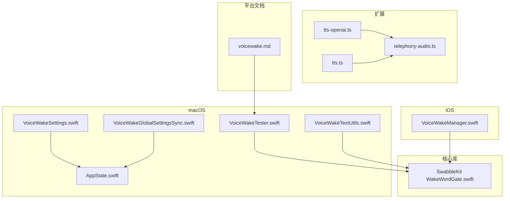
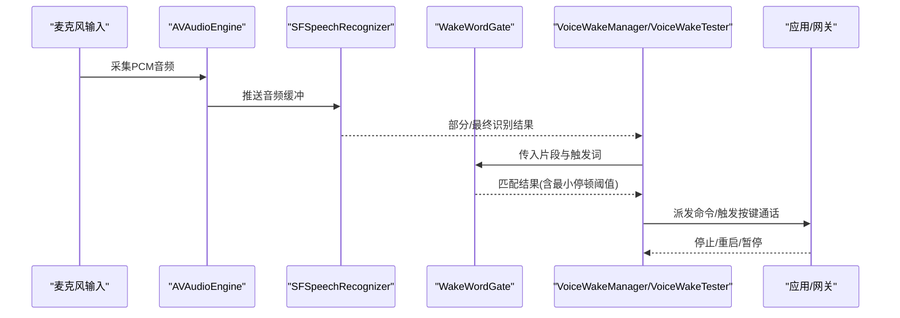
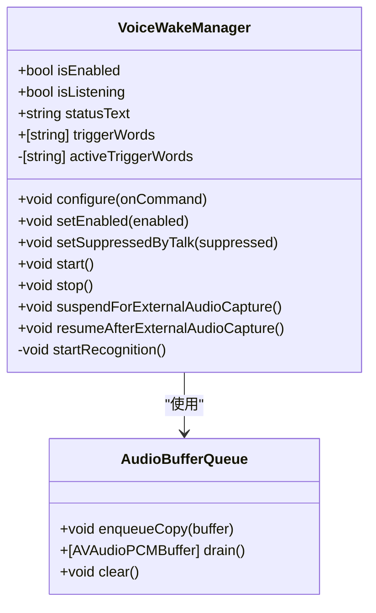
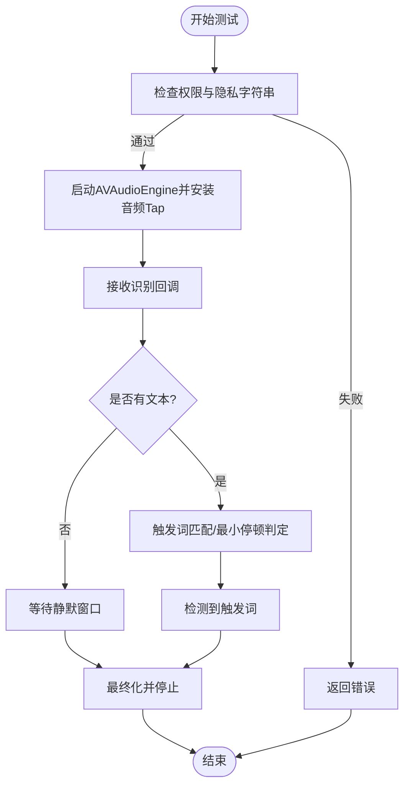
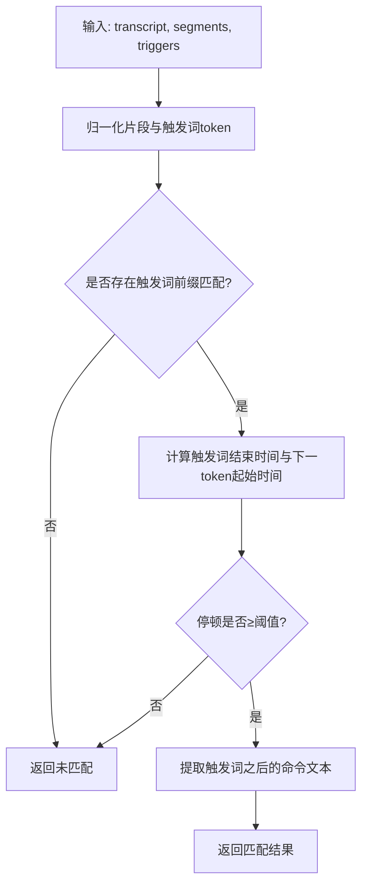
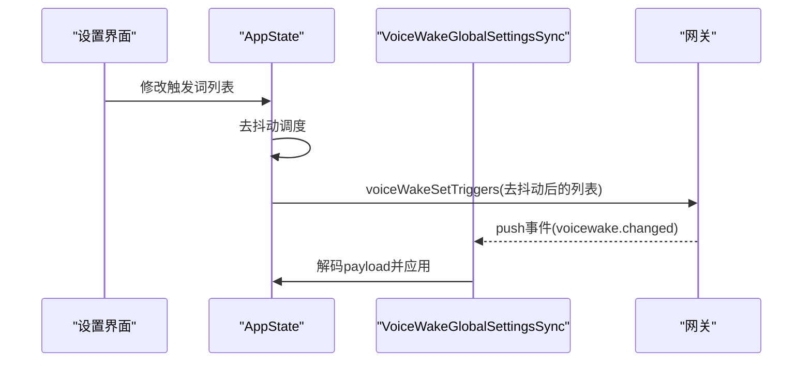
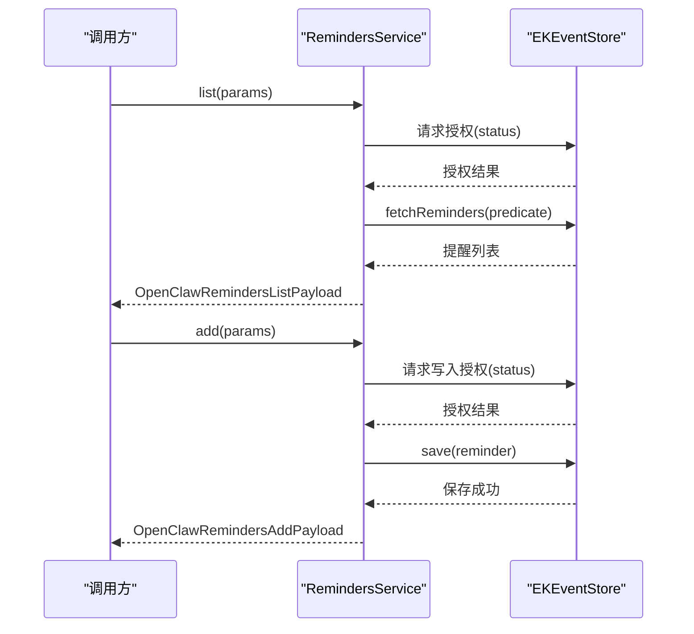
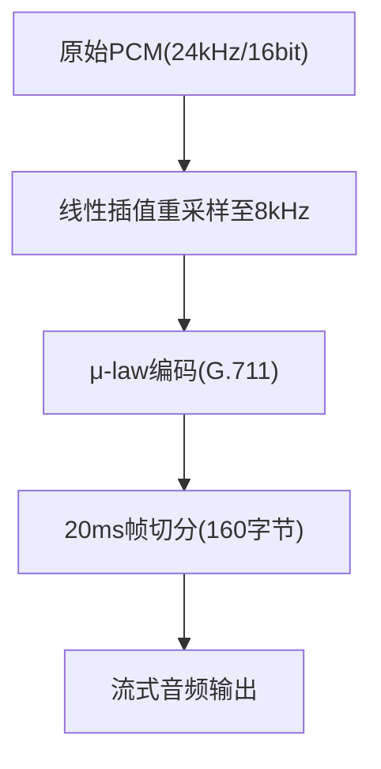
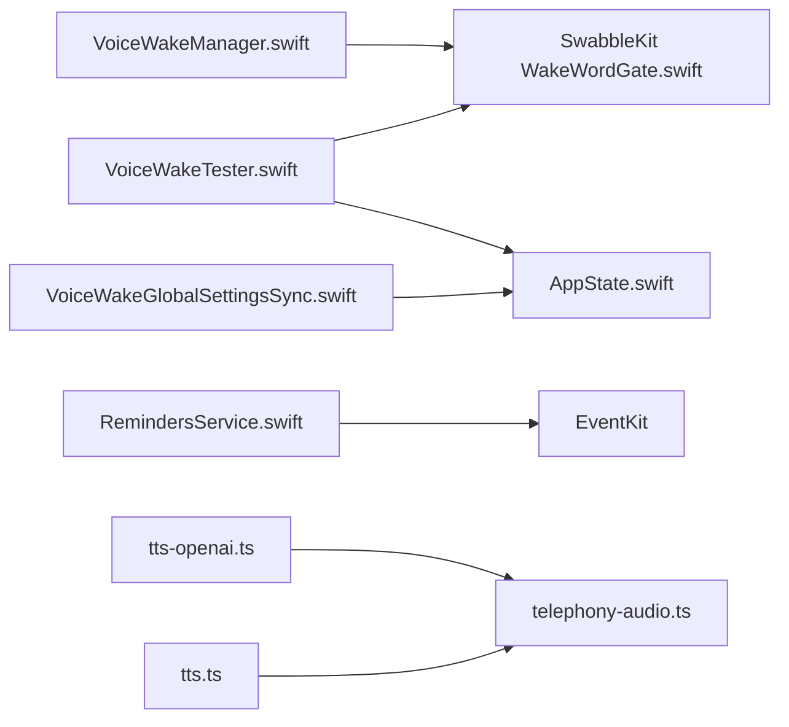

# 语音功能

<cite>
**本文引用的文件**
- [VoiceWakeManager.swift](file://apps/ios/Sources/Voice/VoiceWakeManager.swift)
- [VoiceWakeTester.swift](file://apps/macos/Sources/OpenClaw/VoiceWakeTester.swift)
- [VoiceWakeSettings.swift](file://apps/macos/Sources/OpenClaw/VoiceWakeSettings.swift)
- [VoiceWakeGlobalSettingsSync.swift](file://apps/macos/Sources/OpenClaw/VoiceWakeGlobalSettingsSync.swift)
- [AppState.swift](file://apps/macos/Sources/OpenClaw/AppState.swift)
- [VoiceWakeTextUtils.swift](file://apps/macos/Sources/OpenClaw/VoiceWakeTextUtils.swift)
- [RemindersService.swift](file://apps/ios/Sources/Reminders/RemindersService.swift)
- [SwabbleKit WakeWordGate.swift](file://Swabble/Sources/SwabbleKit/WakeWordGate.swift)
- [voicewake.md](file://docs/zh-CN/platforms/mac/voicewake.md)
- [telephony-audio.ts](file://extensions/voice-call/src/telephony-audio.ts)
- [tts-openai.ts](file://extensions/voice-call/src/providers/tts-openai.ts)
- [tts.ts](file://src/tts/tts.ts)
- [VoiceWakeTesterTests.swift](file://apps/macos/Tests/OpenClawIPCTests/VoiceWakeTesterTests.swift)
- [WakeWordGateTests.swift](file://Swabble/Tests/SwabbleKitTests/WakeWordGateTests.swift)
</cite>

## 目录

1. [简介](#简介)
2. [项目结构](#项目结构)
3. [核心组件](#核心组件)
4. [架构总览](#架构总览)
5. [详细组件分析](#详细组件分析)
6. [依赖关系分析](#依赖关系分析)
7. [性能考虑](#性能考虑)
8. [故障排查指南](#故障排查指南)
9. [结论](#结论)
10. [附录](#附录)

## 简介

本文件面向OpenClaw在macOS平台的语音功能，系统化梳理语音识别（唤醒词检测）、实时转录、语音合成（TTS）与语音控制链路，覆盖以下主题：

- 语音唤醒：触发词匹配、静默窗口、按键通话模式、测试工具与权限管理
- 实时转录与命令提取：基于Apple Speech框架的流式识别与命令抽取
- 语音合成：多提供商TTS、采样率转换与μ-law编码（电话场景）
- 提醒系统：iOS端Reminders服务对接系统日历
- 语音质量：采样率重采样、μ-law编解码、帧切分与延迟控制
- 自然语言处理：触发词归一化、时间戳片段匹配、最小停顿阈值
- 隐私与安全：权限请求、本地处理、敏感信息脱敏
- 性能优化：音频缓冲队列、后台暂停/恢复、错误自愈与重启

## 项目结构

OpenClaw的语音功能由多平台组件协同完成：

- iOS端：VoiceWakeManager负责麦克风采集、SFSpeech识别与命令派发
- macOS端：VoiceWakeTester用于测试与调试，配合全局设置同步与状态持久化
- 核心库：SwabbleKit提供触发词匹配算法与片段解析
- 扩展：voice-call提供电话场景的TTS/音频处理能力
- 平台文档：macOS语音唤醒模式与生命周期约束

**图表来源**

- [VoiceWakeManager.swift](file://apps/ios/Sources/Voice/VoiceWakeManager.swift#L1-L496)
- [VoiceWakeTester.swift](file://apps/macos/Sources/OpenClaw/VoiceWakeTester.swift#L1-L474)
- [VoiceWakeSettings.swift](file://apps/macos/Sources/OpenClaw/VoiceWakeSettings.swift#L147-L262)
- [VoiceWakeGlobalSettingsSync.swift](file://apps/macos/Sources/OpenClaw/VoiceWakeGlobalSettingsSync.swift#L41-L66)
- [AppState.swift](file://apps/macos/Sources/OpenClaw/AppState.swift#L627-L663)
- [VoiceWakeTextUtils.swift](file://apps/macos/Sources/OpenClaw/VoiceWakeTextUtils.swift#L1-L32)
- [SwabbleKit WakeWordGate.swift](file://Swabble/Sources/SwabbleKit/WakeWordGate.swift#L159-L197)
- [telephony-audio.ts](file://extensions/voice-call/src/telephony-audio.ts#L1-L90)
- [tts-openai.ts](file://extensions/voice-call/src/providers/tts-openai.ts#L125-L229)
- [tts.ts](file://src/tts/tts.ts#L1351-L1391)
- [voicewake.md](file://docs/zh-CN/platforms/mac/voicewake.md#L1-L35)

**章节来源**

- [VoiceWakeManager.swift](file://apps/ios/Sources/Voice/VoiceWakeManager.swift#L1-L496)
- [VoiceWakeTester.swift](file://apps/macos/Sources/OpenClaw/VoiceWakeTester.swift#L1-L474)
- [VoiceWakeSettings.swift](file://apps/macos/Sources/OpenClaw/VoiceWakeSettings.swift#L147-L262)
- [VoiceWakeGlobalSettingsSync.swift](file://apps/macos/Sources/OpenClaw/VoiceWakeGlobalSettingsSync.swift#L41-L66)
- [AppState.swift](file://apps/macos/Sources/OpenClaw/AppState.swift#L627-L663)
- [VoiceWakeTextUtils.swift](file://apps/macos/Sources/OpenClaw/VoiceWakeTextUtils.swift#L1-L32)
- [SwabbleKit WakeWordGate.swift](file://Swabble/Sources/SwabbleKit/WakeWordGate.swift#L159-L197)
- [telephony-audio.ts](file://extensions/voice-call/src/telephony-audio.ts#L1-L90)
- [tts-openai.ts](file://extensions/voice-call/src/providers/tts-openai.ts#L125-L229)
- [tts.ts](file://src/tts/tts.ts#L1351-L1391)
- [voicewake.md](file://docs/zh-CN/platforms/mac/voicewake.md#L1-L35)

## 核心组件

- 语音唤醒（iOS）：VoiceWakeManager封装麦克风采集、SFSpeech识别、权限请求、音频会话配置与命令派发
- 语音唤醒（macOS测试）：VoiceWakeTester提供测试模式、权限校验、静默窗口与最终化流程
- 触发词匹配：SwabbleKit WakeWordGate提供片段级归一化、触发词匹配与最小停顿阈值判定
- 全局设置同步：VoiceWakeGlobalSettingsSync与AppState负责触发词列表的拉取/推送与持久化
- 提醒系统（iOS）：RemindersService对接系统日历，提供列表查询与新增提醒
- 语音合成与音频处理：telephony-audio.ts与tts-openai.ts提供采样率重采样、μ-law编解码与帧切分

**章节来源**

- [VoiceWakeManager.swift](file://apps/ios/Sources/Voice/VoiceWakeManager.swift#L81-L390)
- [VoiceWakeTester.swift](file://apps/macos/Sources/OpenClaw/VoiceWakeTester.swift#L16-L208)
- [SwabbleKit WakeWordGate.swift](file://Swabble/Sources/SwabbleKit/WakeWordGate.swift#L159-L197)
- [VoiceWakeGlobalSettingsSync.swift](file://apps/macos/Sources/OpenClaw/VoiceWakeGlobalSettingsSync.swift#L41-L66)
- [AppState.swift](file://apps/macos/Sources/OpenClaw/AppState.swift#L627-L663)
- [RemindersService.swift](file://apps/ios/Sources/Reminders/RemindersService.swift#L5-L166)
- [telephony-audio.ts](file://extensions/voice-call/src/telephony-audio.ts#L1-L90)
- [tts-openai.ts](file://extensions/voice-call/src/providers/tts-openai.ts#L125-L229)

## 架构总览

OpenClaw的语音链路由“采集-识别-匹配-派发”构成，iOS与macOS分别承担运行时与测试验证职责，核心匹配逻辑来自SwabbleKit。

**图表来源**

- [VoiceWakeManager.swift](file://apps/ios/Sources/Voice/VoiceWakeManager.swift#L270-L357)
- [VoiceWakeTester.swift](file://apps/macos/Sources/OpenClaw/VoiceWakeTester.swift#L125-L259)
- [SwabbleKit WakeWordGate.swift](file://Swabble/Sources/SwabbleKit/WakeWordGate.swift#L159-L197)

## 详细组件分析

### 语音唤醒（iOS：VoiceWakeManager）

- 音频采集与缓冲：使用AVAudioEngine与AudioBufferQueue将实时PCM缓冲复制并投递到识别请求
- 权限管理：分别请求麦克风与语音识别权限，超时保护与错误自愈
- 识别与派发：识别回调中提取命令，派发后自动重启监听，避免会话卡死
- 外部占用暂停：摄像头等外部音频占用时主动释放麦克风并暂停监听

**图表来源**

- [VoiceWakeManager.swift](file://apps/ios/Sources/Voice/VoiceWakeManager.swift#L81-L390)

**章节来源**

- [VoiceWakeManager.swift](file://apps/ios/Sources/Voice/VoiceWakeManager.swift#L81-L390)

### 语音唤醒（macOS：VoiceWakeTester）

- 测试模式：支持启动/停止/最终化，权限检查与隐私字符串校验
- 静默窗口：在无新转录时延时检测，满足最小停顿阈值后仍可触发
- 调试日志：输出片段归一化、候选间隙与匹配摘要，便于定位误触发/漏触发
- 最终化流程：在识别请求结束与引擎停止后，确保资源回收

**图表来源**

- [VoiceWakeTester.swift](file://apps/macos/Sources/OpenClaw/VoiceWakeTester.swift#L40-L208)
- [VoiceWakeTester.swift](file://apps/macos/Sources/OpenClaw/VoiceWakeTester.swift#L371-L424)

**章节来源**

- [VoiceWakeTester.swift](file://apps/macos/Sources/OpenClaw/VoiceWakeTester.swift#L16-L208)
- [VoiceWakeTester.swift](file://apps/macos/Sources/OpenClaw/VoiceWakeTester.swift#L371-L424)

### 触发词匹配与归一化（SwabbleKit）

- 片段归一化：去除标点与空白，统一小写，保留时间戳范围
- 触发词匹配：按归一化后的token序列进行前缀匹配，结合最小停顿阈值
- 文档约束：macOS文档明确“明显停顿”与静默窗口、硬性停止等行为

**图表来源**

- [SwabbleKit WakeWordGate.swift](file://Swabble/Sources/SwabbleKit/WakeWordGate.swift#L159-L197)
- [VoiceWakeTextUtils.swift](file://apps/macos/Sources/OpenClaw/VoiceWakeTextUtils.swift#L9-L32)
- [voicewake.md](file://docs/zh-CN/platforms/mac/voicewake.md#L22-L31)

**章节来源**

- [SwabbleKit WakeWordGate.swift](file://Swabble/Sources/SwabbleKit/WakeWordGate.swift#L159-L197)
- [VoiceWakeTextUtils.swift](file://apps/macos/Sources/OpenClaw/VoiceWakeTextUtils.swift#L1-L32)
- [voicewake.md](file://docs/zh-CN/platforms/mac/voicewake.md#L22-L31)

### 全局设置同步与持久化（macOS）

- 触发词拉取/推送：从网关获取全局触发词，应用到本地状态，定时去抖动后同步
- 声音设置持久化：声音配置JSON编码/解码存储于UserDefaults
- 设置界面：支持添加/删除触发词、重置默认值、测试开关与状态反馈

**图表来源**

- [AppState.swift](file://apps/macos/Sources/OpenClaw/AppState.swift#L627-L663)
- [VoiceWakeGlobalSettingsSync.swift](file://apps/macos/Sources/OpenClaw/VoiceWakeGlobalSettingsSync.swift#L41-L66)
- [VoiceWakeSettings.swift](file://apps/macos/Sources/OpenClaw/VoiceWakeSettings.swift#L147-L262)

**章节来源**

- [AppState.swift](file://apps/macos/Sources/OpenClaw/AppState.swift#L627-L663)
- [VoiceWakeGlobalSettingsSync.swift](file://apps/macos/Sources/OpenClaw/VoiceWakeGlobalSettingsSync.swift#L41-L66)
- [VoiceWakeSettings.swift](file://apps/macos/Sources/OpenClaw/VoiceWakeSettings.swift#L147-L262)

### 提醒系统（iOS：RemindersService）

- 权限策略：读取/写入授权状态，不阻塞node.invoke的授权提示
- 列表查询：限制数量与状态过滤，ISO-8601日期格式化
- 新增提醒：标题必填、备注可选、日历列表解析与到期时间解析

**图表来源**

- [RemindersService.swift](file://apps/ios/Sources/Reminders/RemindersService.swift#L5-L166)

**章节来源**

- [RemindersService.swift](file://apps/ios/Sources/Reminders/RemindersService.swift#L5-L166)

### 语音合成与音频处理（电话场景）

- 采样率重采样：将高采样率（如24kHz）线性插值至8kHz
- μ-law编码：标准G.711编码，适配电话媒体流
- 帧切分：20ms帧（160字节μ-law），支持流式传输
- 多提供商TTS：优先选择支持电话场景的提供商，边缘情况（如edge）跳过

**图表来源**

- [telephony-audio.ts](file://extensions/voice-call/src/telephony-audio.ts#L10-L68)
- [tts-openai.ts](file://extensions/voice-call/src/providers/tts-openai.ts#L149-L180)
- [tts-openai.ts](file://extensions/voice-call/src/providers/tts-openai.ts#L186-L229)
- [tts.ts](file://src/tts/tts.ts#L1351-L1391)

**章节来源**

- [telephony-audio.ts](file://extensions/voice-call/src/telephony-audio.ts#L1-L90)
- [tts-openai.ts](file://extensions/voice-call/src/providers/tts-openai.ts#L125-L229)
- [tts.ts](file://src/tts/tts.ts#L1351-L1391)

## 依赖关系分析

- iOS VoiceWakeManager依赖SwabbleKit进行触发词匹配，使用SFSpeech与AVAudioEngine
- macOS VoiceWakeTester同样依赖SwabbleKit，提供测试与调试能力
- AppState与VoiceWakeGlobalSettingsSync负责跨设备触发词同步
- RemindersService依赖EventKit访问系统日历
- 电话场景TTS依赖telephony-audio.ts与tts-openai.ts进行音频格式转换

**图表来源**

- [VoiceWakeManager.swift](file://apps/ios/Sources/Voice/VoiceWakeManager.swift#L1-L496)
- [VoiceWakeTester.swift](file://apps/macos/Sources/OpenClaw/VoiceWakeTester.swift#L1-L474)
- [AppState.swift](file://apps/macos/Sources/OpenClaw/AppState.swift#L627-L663)
- [VoiceWakeGlobalSettingsSync.swift](file://apps/macos/Sources/OpenClaw/VoiceWakeGlobalSettingsSync.swift#L41-L66)
- [RemindersService.swift](file://apps/ios/Sources/Reminders/RemindersService.swift#L1-L166)
- [telephony-audio.ts](file://extensions/voice-call/src/telephony-audio.ts#L1-L90)
- [tts-openai.ts](file://extensions/voice-call/src/providers/tts-openai.ts#L125-L229)
- [tts.ts](file://src/tts/tts.ts#L1351-L1391)

**章节来源**

- [VoiceWakeManager.swift](file://apps/ios/Sources/Voice/VoiceWakeManager.swift#L1-L496)
- [VoiceWakeTester.swift](file://apps/macos/Sources/OpenClaw/VoiceWakeTester.swift#L1-L474)
- [AppState.swift](file://apps/macos/Sources/OpenClaw/AppState.swift#L627-L663)
- [VoiceWakeGlobalSettingsSync.swift](file://apps/macos/Sources/OpenClaw/VoiceWakeGlobalSettingsSync.swift#L41-L66)
- [RemindersService.swift](file://apps/ios/Sources/Reminders/RemindersService.swift#L1-L166)
- [telephony-audio.ts](file://extensions/voice-call/src/telephony-audio.ts#L1-L90)
- [tts-openai.ts](file://extensions/voice-call/src/providers/tts-openai.ts#L125-L229)
- [tts.ts](file://src/tts/tts.ts#L1351-L1391)

## 性能考虑

- 实时性保障
  - iOS端使用AudioBufferQueue与深拷贝缓冲，避免主线程阻塞与实时线程锁竞争
  - 识别回调在主线程派发，但识别任务与音频Tap在后台队列处理
- 延迟控制
  - macOS测试静默窗口与最终化流程，避免过早/过晚触发
  - 电话场景采用20ms帧切分，降低端到端延迟
- 错误自愈
  - 识别错误后短暂延迟重启，提升鲁棒性
  - 外部占用时主动暂停，恢复后自动重启
- 资源回收
  - 测试/识别结束时移除Tap、停止引擎、释放会话，防止资源泄漏

**章节来源**

- [VoiceWakeManager.swift](file://apps/ios/Sources/Voice/VoiceWakeManager.swift#L8-L79)
- [VoiceWakeManager.swift](file://apps/ios/Sources/Voice/VoiceWakeManager.swift#L270-L357)
- [VoiceWakeTester.swift](file://apps/macos/Sources/OpenClaw/VoiceWakeTester.swift#L160-L207)
- [telephony-audio.ts](file://extensions/voice-call/src/telephony-audio.ts#L62-L68)

## 故障排查指南

- 权限问题
  - iOS：麦克风/语音识别权限未授予或被拒绝，需在系统设置中开启
  - macOS：缺失隐私字符串（NSSpeechRecognitionUsageDescription/NSMicrophoneUsageDescription）会导致测试失败
- 触发词误检/漏检
  - 检查最小停顿阈值是否合理（iOS默认0.45s，macOS文档建议0.55s）
  - 使用调试日志查看片段归一化与候选间隙
- 识别不稳定
  - 查看识别错误状态文本，确认是否因会话异常导致自动重启
  - 在外部占用（如相机）场景下，确认是否正确暂停/恢复
- 电话音频质量
  - 确认采样率转换与μ-law编码流程完整，帧大小符合20ms规范

**章节来源**

- [VoiceWakeManager.swift](file://apps/ios/Sources/Voice/VoiceWakeManager.swift#L329-L357)
- [VoiceWakeTester.swift](file://apps/macos/Sources/OpenClaw/VoiceWakeTester.swift#L69-L87)
- [VoiceWakeTester.swift](file://apps/macos/Sources/OpenClaw/VoiceWakeTester.swift#L261-L291)
- [VoiceWakeTesterTests.swift](file://apps/macos/Tests/OpenClawIPCTests/VoiceWakeTesterTests.swift#L1-L47)
- [WakeWordGateTests.swift](file://Swabble/Tests/SwabbleKitTests/WakeWordGateTests.swift#L1-L33)

## 结论

OpenClaw在macOS与iOS平台实现了完整的语音唤醒与实时转录链路，结合SwabbleKit的触发词匹配与Apple Speech框架，提供了稳定可靠的语音控制体验。macOS侧通过测试工具与全局设置同步完善了开发与运维能力；iOS侧通过权限管理与错误自愈提升了可用性。电话场景下的TTS与音频处理遵循行业标准（8kHz/μ-law），保证低延迟与高质量。后续可在隐私保护与本地处理方面进一步强化，同时持续优化触发词匹配的鲁棒性与误检率控制。

## 附录

- 触发词匹配单元测试参考：VoiceWakeTesterTests与SwabbleKit WakeWordGateTests
- 平台文档：macOS语音唤醒模式与生命周期约束

**章节来源**

- [VoiceWakeTesterTests.swift](file://apps/macos/Tests/OpenClawIPCTests/VoiceWakeTesterTests.swift#L1-L47)
- [WakeWordGateTests.swift](file://Swabble/Tests/SwabbleKitTests/WakeWordGateTests.swift#L1-L33)
- [voicewake.md](file://docs/zh-CN/platforms/mac/voicewake.md#L1-L35)
