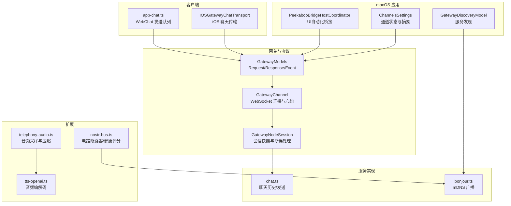
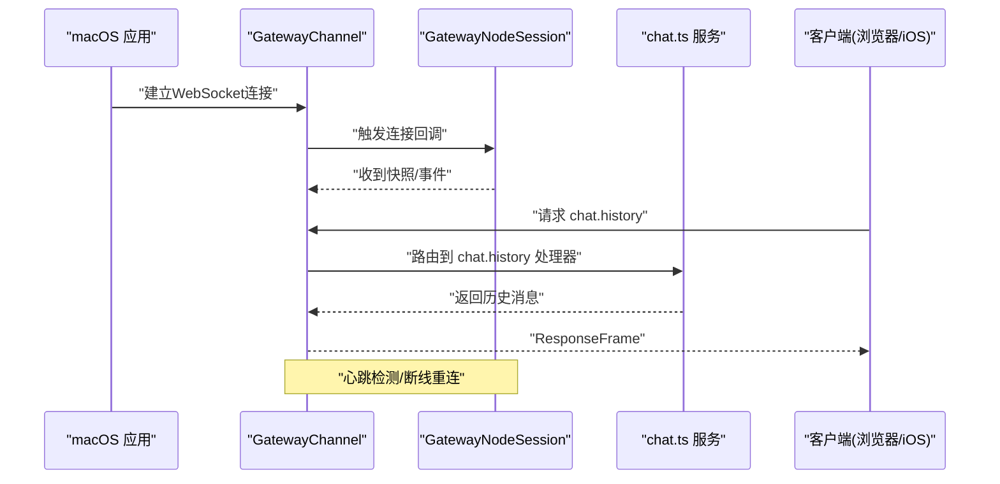
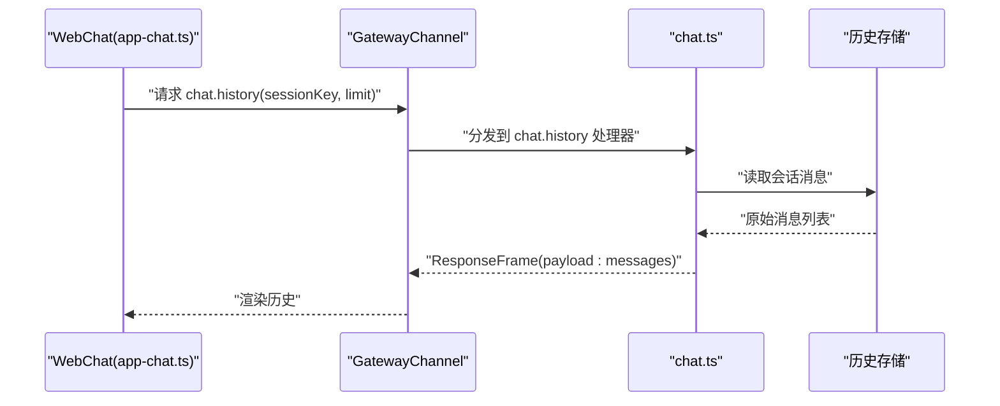
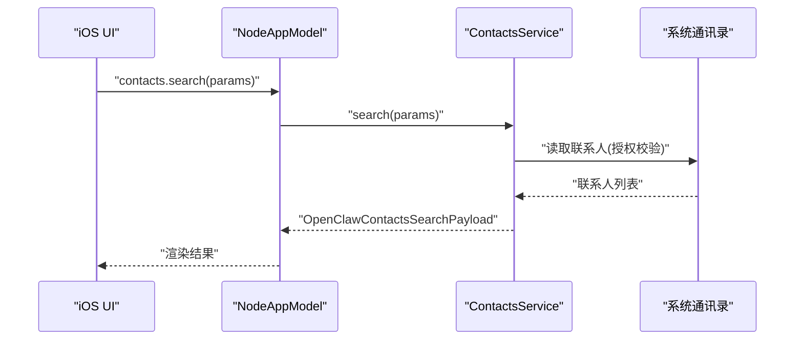
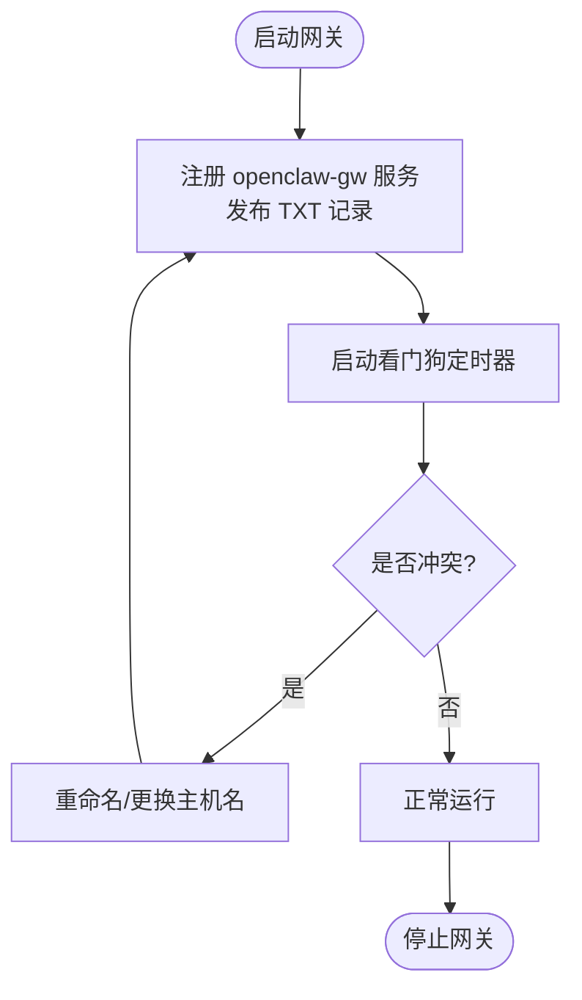
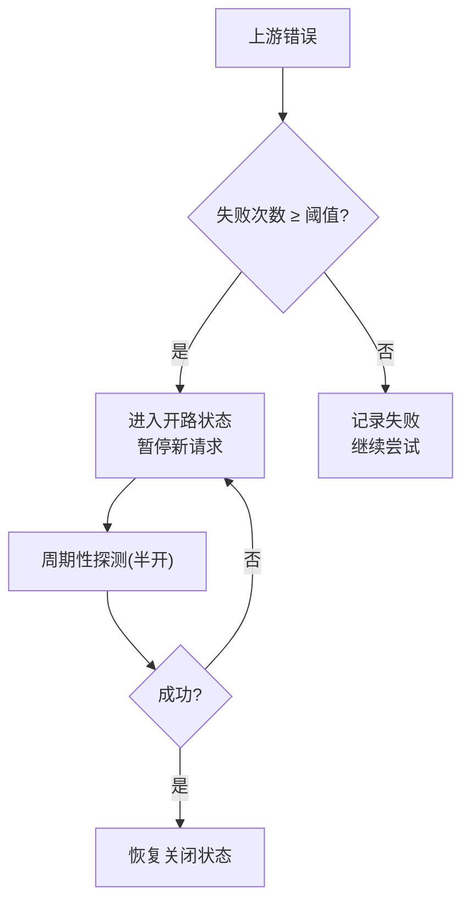
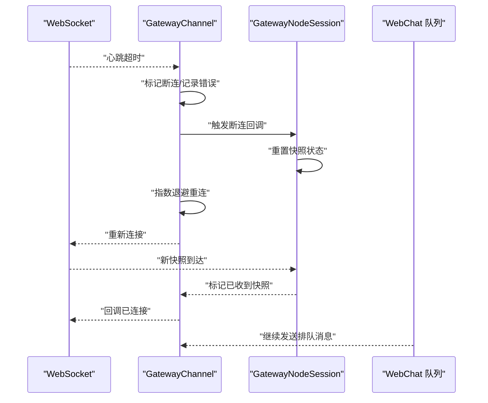
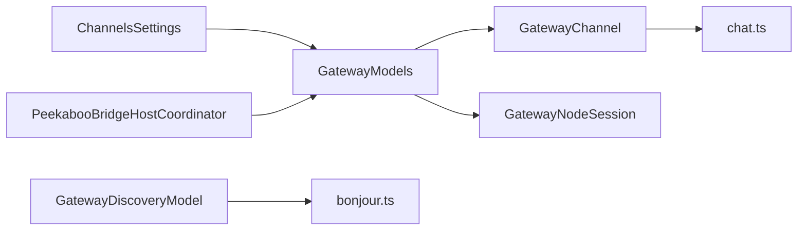

# 通信模块

<cite>
**本文引用的文件**
- [ChannelsSettings+ChannelState.swift](file://apps/macos/Sources/OpenClaw/ChannelsSettings+ChannelState.swift)
- [GatewayModels.swift（共享协议）](file://apps/shared/OpenClawKit/Sources/OpenClawProtocol/GatewayModels.swift)
- [GatewayModels.swift（macOS协议）](file://apps/macos/Sources/OpenClawProtocol/GatewayModels.swift)
- [GatewayChannel.swift](file://apps/shared/OpenClawKit/Sources/OpenClawKit/GatewayChannel.swift)
- [GatewayNodeSession.swift](file://apps/shared/OpenClawKit/Sources/OpenClawKit/GatewayNodeSession.swift)
- [chat.ts](file://src/gateway/server-methods/chat.ts)
- [chat.gateway-server-chat.e2e.test.ts](file://src/gateway/server.chat.gateway-server-chat.e2e.test.ts)
- [app-chat.ts](file://ui/src/ui/app-chat.ts)
- [IOSGatewayChatTransport.swift](file://apps/ios/Sources/Chat/IOSGatewayChatTransport.swift)
- [ContactsCommands.swift](file://apps/shared/OpenClawKit/Sources/OpenClawKit/ContactsCommands.swift)
- [ContactsService.swift](file://apps/ios/Sources/Contacts/ContactsService.swift)
- [NodeAppModel.swift（iOS）](file://apps/ios/Sources/Model/NodeAppModel.swift）
- [PeekabooBridgeHostCoordinator.swift](file://apps/macos/Sources/OpenClaw/PeekabooBridgeHostCoordinator.swift)
- [xpc.md](file://docs/platforms/mac/xpc.md)
- [bonjour.ts](file://src/infra/bonjour.ts)
- [GatewayDiscoveryModel.swift](file://apps/macos/Sources/OpenClawDiscovery/GatewayDiscoveryModel.swift)
- [session.md](file://docs/concepts/session.md)
- [sessions.md](file://docs/concepts/sessions.md)
- [telephony-audio.ts](file://extensions/voice-call/src/telephony-audio.ts)
- [tts-openai.ts](file://extensions/voice-call/src/providers/tts-openai.ts)
- [nostr-bus.ts](file://extensions/nostr/src/nostr-bus.ts)
- [nostr-bus.integration.test.ts](file://extensions/nostr/src/nostr-bus.integration.test.ts)
- [Config.swift（Swabble）](file://Swabble/Sources/SwabbleCore/Config/Config.swift)
- [main.swift（Swabble CLI）](file://Swabble/Sources/swabble/main.swift)
- [Package.swift（Swabble）](file://Swabble/Package.swift)
</cite>

## 目录

1. [简介](#简介)
2. [项目结构](#项目结构)
3. [核心组件](#核心组件)
4. [架构总览](#架构总览)
5. [详细组件分析](#详细组件分析)
6. [依赖关系分析](#依赖关系分析)
7. [性能考量](#性能考量)
8. [故障排查指南](#故障排查指南)
9. [结论](#结论)
10. [附录](#附录)

## 简介

本文件系统化梳理 OpenClaw 在 macOS 平台上的通信模块，覆盖消息传递、联系人管理、服务集成、实时通信、安全与会话管理、性能优化与离线同步、故障恢复与重连策略等主题。文档以“从代码到可视化”的方式呈现，帮助开发者与使用者快速理解并高效使用该模块。

## 项目结构

OpenClaw 的通信模块横跨多个子系统：

- macOS 应用层：负责通道状态展示、PeekabooBridge UI 自动化桥接、本地服务发现与连接。
- 网关与协议层：定义统一的网关协议帧类型、方法与参数，支撑跨端通信。
- 网关服务层：实现聊天历史、消息发送、会话管理等核心能力。
- iOS/Android 等客户端：通过网关协议进行消息收发与状态查询。
- 扩展与插件：如 Nostr、语音通话等，体现协议扩展与网络通信能力。

图表来源

- [ChannelsSettings+ChannelState.swift](file://apps/macos/Sources/OpenClaw/ChannelsSettings+ChannelState.swift#L1-L509)
- [PeekabooBridgeHostCoordinator.swift](file://apps/macos/Sources/OpenClaw/PeekabooBridgeHostCoordinator.swift#L1-L138)
- [GatewayModels.swift（共享协议）](file://apps/shared/OpenClawKit/Sources/OpenClawProtocol/GatewayModels.swift#L1-L800)
- [GatewayChannel.swift](file://apps/shared/OpenClawKit/Sources/OpenClawKit/GatewayChannel.swift#L558-L593)
- [GatewayNodeSession.swift](file://apps/shared/OpenClawKit/Sources/OpenClawKit/GatewayNodeSession.swift#L280-L308)
- [chat.ts](file://src/gateway/server-methods/chat.ts#L259-L292)
- [bonjour.ts](file://src/infra/bonjour.ts#L148-L281)
- [IOSGatewayChatTransport.swift](file://apps/ios/Sources/Chat/IOSGatewayChatTransport.swift#L35-L64)
- [app-chat.ts](file://ui/src/ui/app-chat.ts#L144-L195)
- [nostr-bus.ts](file://extensions/nostr/src/nostr-bus.ts#L163-L207)
- [telephony-audio.ts](file://extensions/voice-call/src/telephony-audio.ts#L1-L52)
- [tts-openai.ts](file://extensions/voice-call/src/providers/tts-openai.ts#L227-L259)

章节来源

- [ChannelsSettings+ChannelState.swift](file://apps/macos/Sources/OpenClaw/ChannelsSettings+ChannelState.swift#L1-L509)
- [GatewayModels.swift（共享协议）](file://apps/shared/OpenClawKit/Sources/OpenClawProtocol/GatewayModels.swift#L1-L800)
- [GatewayChannel.swift](file://apps/shared/OpenClawKit/Sources/OpenClawKit/GatewayChannel.swift#L558-L593)
- [GatewayNodeSession.swift](file://apps/shared/OpenClawKit/Sources/OpenClawKit/GatewayNodeSession.swift#L280-L308)
- [chat.ts](file://src/gateway/server-methods/chat.ts#L259-L292)
- [bonjour.ts](file://src/infra/bonjour.ts#L148-L281)
- [IOSGatewayChatTransport.swift](file://apps/ios/Sources/Chat/IOSGatewayChatTransport.swift#L35-L64)
- [app-chat.ts](file://ui/src/ui/app-chat.ts#L144-L195)
- [nostr-bus.ts](file://extensions/nostr/src/nostr-bus.ts#L163-L207)
- [telephony-audio.ts](file://extensions/voice-call/src/telephony-audio.ts#L1-L52)
- [tts-openai.ts](file://extensions/voice-call/src/providers/tts-openai.ts#L227-L259)

## 核心组件

- 协议与消息模型：统一的 RequestFrame/ResponseFrame/EventFrame、HelloOk、Snapshot 等，确保跨端一致的通信契约。
- 网关通道与会话：GatewayChannel 负责连接、心跳与断线重连；GatewayNodeSession 负责快照接收与断连回调。
- 聊天服务：chat.ts 实现 chat.history、消息发送与会话键解析；WebChat/iOS 通过 GatewayModels 参数调用。
- 通道状态与 UI：ChannelsSettings+ChannelState.swift 将各通道（如 WhatsApp、Telegram、Discord、Signal、iMessage）的状态映射为 UI 摘要与详情。
- 服务发现：bonjour.ts 广播 openclaw-gw 服务；GatewayDiscoveryModel 清洗与美化服务名称。
- UI 自动化桥接：PeekabooBridgeHostCoordinator 启动 UNIX Socket 桥接，限制 TeamID，保障本地安全。
- 联系人服务：iOS 通过 ContactsService 访问系统通讯录，macOS 通过 OpenClawKit 的命令集对接。
- 扩展与网络：Nostr 电路断路器与健康评分；语音通话音频重采样与编解码。

章节来源

- [GatewayModels.swift（共享协议）](file://apps/shared/OpenClawKit/Sources/OpenClawProtocol/GatewayModels.swift#L117-L198)
- [GatewayChannel.swift](file://apps/shared/OpenClawKit/Sources/OpenClawKit/GatewayChannel.swift#L558-L593)
- [GatewayNodeSession.swift](file://apps/shared/OpenClawKit/Sources/OpenClawKit/GatewayNodeSession.swift#L280-L308)
- [chat.ts](file://src/gateway/server-methods/chat.ts#L259-L292)
- [ChannelsSettings+ChannelState.swift](file://apps/macos/Sources/OpenClaw/ChannelsSettings+ChannelState.swift#L106-L120)
- [bonjour.ts](file://src/infra/bonjour.ts#L148-L281)
- [PeekabooBridgeHostCoordinator.swift](file://apps/macos/Sources/OpenClaw/PeekabooBridgeHostCoordinator.swift#L40-L83)
- [ContactsCommands.swift](file://apps/shared/OpenClawKit/Sources/OpenClawKit/ContactsCommands.swift#L1-L85)
- [ContactsService.swift](file://apps/ios/Sources/Contacts/ContactsService.swift#L1-L27)

## 架构总览

OpenClaw 的通信架构以“网关为中心”，macOS 应用既是客户端又是本地节点，通过 WebSocket 与网关交互；同时通过 UNIX Socket 与 PeekabooBridge 交互，完成 UI 自动化与权限管理。

图表来源

- [GatewayChannel.swift](file://apps/shared/OpenClawKit/Sources/OpenClawKit/GatewayChannel.swift#L558-L593)
- [GatewayNodeSession.swift](file://apps/shared/OpenClawKit/Sources/OpenClawKit/GatewayNodeSession.swift#L280-L308)
- [chat.ts](file://src/gateway/server-methods/chat.ts#L259-L292)
- [IOSGatewayChatTransport.swift](file://apps/ios/Sources/Chat/IOSGatewayChatTransport.swift#L35-L64)

章节来源

- [xpc.md](file://docs/platforms/mac/xpc.md#L1-L38)
- [GatewayChannel.swift](file://apps/shared/OpenClawKit/Sources/OpenClawKit/GatewayChannel.swift#L558-L593)
- [GatewayNodeSession.swift](file://apps/shared/OpenClawKit/Sources/OpenClawKit/GatewayNodeSession.swift#L280-L308)
- [chat.ts](file://src/gateway/server-methods/chat.ts#L259-L292)

## 详细组件分析

### Chat 模块：聊天界面、消息历史与实时通信

- 消息历史：chat.ts 的 chat.history 处理器根据 sessionKey 读取会话消息，限制默认与硬上限，裁剪 JSON 字节，支持思考级别控制。
- 发送队列与幂等：WebChat 的 app-chat.ts 使用队列串行发送，失败时回插队列；GatewayModels 中的 idempotencyKey 支持去重。
- iOS 传输：IOSGatewayChatTransport.swift 通过 Gateway 请求 chat.history 与发送消息，封装参数与超时。
- 会话键解析：resolveSessionKeyForRequest 等逻辑确保多账户/多通道下的会话隔离与复用。

图表来源

- [app-chat.ts](file://ui/src/ui/app-chat.ts#L144-L195)
- [chat.ts](file://src/gateway/server-methods/chat.ts#L259-L292)
- [IOSGatewayChatTransport.swift](file://apps/ios/Sources/Chat/IOSGatewayChatTransport.swift#L42-L48)

章节来源

- [chat.ts](file://src/gateway/server-methods/chat.ts#L259-L292)
- [chat.gateway-server-chat.e2e.test.ts](file://src/gateway/server.chat.gateway-server-chat.e2e.test.ts#L272-L303)
- [app-chat.ts](file://ui/src/ui/app-chat.ts#L144-L195)
- [IOSGatewayChatTransport.swift](file://apps/ios/Sources/Chat/IOSGatewayChatTransport.swift#L35-L64)
- [GatewayModels.swift（共享协议）](file://apps/shared/OpenClawKit/Sources/OpenClawProtocol/GatewayModels.swift#L385-L428)

### Contacts 模块：联系人管理、群组组织与社交网络集成

- iOS 通讯录访问：ContactsService.swift 通过 CNContactStore 查询联系人，按需授权，限制查询数量。
- 命令与载荷：OpenClawKit 的 ContactsCommands.swift 定义 contacts.search/add 命令与参数/载荷结构。
- macOS 集成：NodeAppModel.swift（iOS）中 handleContactsInvoke 分发 contacts.search/add 到服务层。

图表来源

- [ContactsService.swift](file://apps/ios/Sources/Contacts/ContactsService.swift#L17-L27)
- [ContactsCommands.swift](file://apps/shared/OpenClawKit/Sources/OpenClawKit/ContactsCommands.swift#L1-L85)
- [NodeAppModel.swift（iOS）](file://apps/ios/Sources/Model/NodeAppModel.swift#L1157-L1176)

章节来源

- [ContactsService.swift](file://apps/ios/Sources/Contacts/ContactsService.swift#L1-L27)
- [ContactsCommands.swift](file://apps/shared/OpenClawKit/Sources/OpenClawKit/ContactsCommands.swift#L1-L85)
- [NodeAppModel.swift（iOS）](file://apps/ios/Sources/Model/NodeAppModel.swift#L1157-L1176)

### Services 模块：服务发现、协议支持与网络通信

- mDNS 广播：bonjour.ts 启动 openclaw-gw 服务，发布 TXT 记录，处理冲突与看门狗重播。
- 服务发现 UI：GatewayDiscoveryModel.swift 清洗与美化服务名，便于用户选择。
- 协议版本：GatewayModels.swift 定义协议版本与帧结构，确保兼容性。

图表来源

- [bonjour.ts](file://src/infra/bonjour.ts#L148-L281)
- [GatewayDiscoveryModel.swift](file://apps/macos/Sources/OpenClawDiscovery/GatewayDiscoveryModel.swift#L453-L482)
- [GatewayModels.swift（共享协议）](file://apps/shared/OpenClawKit/Sources/OpenClawProtocol/GatewayModels.swift#L5-L13)

章节来源

- [bonjour.ts](file://src/infra/bonjour.ts#L148-L281)
- [GatewayDiscoveryModel.swift](file://apps/macos/Sources/OpenClawDiscovery/GatewayDiscoveryModel.swift#L453-L482)
- [GatewayModels.swift（共享协议）](file://apps/shared/OpenClawKit/Sources/OpenClawProtocol/GatewayModels.swift#L5-L13)

### 安全机制：消息加密、身份验证与会话管理

- 会话所有权：会话状态由网关持有，UI 客户端应从网关查询而非本地文件，避免状态漂移。
- IPC 安全：macOS IPC 文档强调本地 UNIX Socket、TeamID 白名单、令牌与 HMAC、短 TTL 等加固措施。
- UI 自动化：PeekabooBridge 仅允许受信 TeamID，DEBUG 下可启用同 UID 逃逸通道，且仅本地通信。

章节来源

- [session.md](file://docs/concepts/session.md#L42-L61)
- [xpc.md](file://docs/platforms/mac/xpc.md#L47-L69)
- [PeekabooBridgeHostCoordinator.swift](file://apps/macos/Sources/OpenClaw/PeekabooBridgeHostCoordinator.swift#L40-L83)

### 性能优化与带宽管理

- Nostr 电路断路器：nostr-bus.ts 提供失败计数与开/半开/闭状态切换，结合健康评分与抖动退避，降低对不可靠上游的冲击。
- 音频处理：telephony-audio.ts 对 16-bit PCM 进行线性插值重采样至 8kHz；tts-openai.ts 提供 mu-law 编解码与 20ms 帧切片，适配流式传输。
- 历史裁剪：chat.ts 对消息数组按 JSON 字节上限裁剪，避免单次响应过大。

图表来源

- [nostr-bus.ts](file://extensions/nostr/src/nostr-bus.ts#L163-L207)
- [nostr-bus.integration.test.ts](file://extensions/nostr/src/nostr-bus.integration.test.ts#L429-L448)
- [telephony-audio.ts](file://extensions/voice-call/src/telephony-audio.ts#L10-L37)
- [tts-openai.ts](file://extensions/voice-call/src/providers/tts-openai.ts#L227-L259)
- [chat.ts](file://src/gateway/server-methods/chat.ts#L280-L287)

章节来源

- [nostr-bus.ts](file://extensions/nostr/src/nostr-bus.ts#L163-L207)
- [nostr-bus.integration.test.ts](file://extensions/nostr/src/nostr-bus.integration.test.ts#L408-L448)
- [telephony-audio.ts](file://extensions/voice-call/src/telephony-audio.ts#L1-L52)
- [tts-openai.ts](file://extensions/voice-call/src/providers/tts-openai.ts#L227-L259)
- [chat.ts](file://src/gateway/server-methods/chat.ts#L280-L287)

### 故障恢复、重连策略与数据一致性

- 心跳与断连：GatewayChannel.swift 通过定时心跳检测断连，触发 reconnect 流程；指数退避上限 30 秒。
- 会话快照：GatewayNodeSession.swift 在断连后重置状态，等待新快照到达后再回调已连接，保证 UI 一致性。
- WebChat 队列：app-chat.ts 将发送排队，失败时回插队列，确保消息最终送达。
- 会话来源：会话状态由网关持有，UI 不应自行解析本地 JSONL 计算 token 数，避免不一致。

图表来源

- [GatewayChannel.swift](file://apps/shared/OpenClawKit/Sources/OpenClawKit/GatewayChannel.swift#L558-L593)
- [GatewayNodeSession.swift](file://apps/shared/OpenClawKit/Sources/OpenClawKit/GatewayNodeSession.swift#L280-L308)
- [app-chat.ts](file://ui/src/ui/app-chat.ts#L144-L195)

章节来源

- [GatewayChannel.swift](file://apps/shared/OpenClawKit/Sources/OpenClawKit/GatewayChannel.swift#L558-L593)
- [GatewayNodeSession.swift](file://apps/shared/OpenClawKit/Sources/OpenClawKit/GatewayNodeSession.swift#L280-L308)
- [session.md](file://docs/concepts/session.md#L42-L61)
- [app-chat.ts](file://ui/src/ui/app-chat.ts#L144-L195)

## 依赖关系分析

- 协议依赖：所有客户端/服务端均依赖 GatewayModels 的统一帧结构与方法签名。
- 通道状态依赖：ChannelsSettings+ChannelState.swift 依赖各通道状态快照类型，驱动 UI 展示。
- 服务发现依赖：GatewayDiscoveryModel 依赖 bonjour.ts 的服务注册与 TXT 解析。
- UI 自动化依赖：PeekabooBridgeHostCoordinator 依赖系统签名信息与 TeamID 白名单。

图表来源

- [GatewayModels.swift（共享协议）](file://apps/shared/OpenClawKit/Sources/OpenClawProtocol/GatewayModels.swift#L117-L198)
- [GatewayChannel.swift](file://apps/shared/OpenClawKit/Sources/OpenClawKit/GatewayChannel.swift#L558-L593)
- [GatewayNodeSession.swift](file://apps/shared/OpenClawKit/Sources/OpenClawKit/GatewayNodeSession.swift#L280-L308)
- [chat.ts](file://src/gateway/server-methods/chat.ts#L259-L292)
- [ChannelsSettings+ChannelState.swift](file://apps/macos/Sources/OpenClaw/ChannelsSettings+ChannelState.swift#L1-L509)
- [GatewayDiscoveryModel.swift](file://apps/macos/Sources/OpenClawDiscovery/GatewayDiscoveryModel.swift#L453-L482)
- [bonjour.ts](file://src/infra/bonjour.ts#L148-L281)
- [PeekabooBridgeHostCoordinator.swift](file://apps/macos/Sources/OpenClaw/PeekabooBridgeHostCoordinator.swift#L40-L83)

章节来源

- [GatewayModels.swift（共享协议）](file://apps/shared/OpenClawKit/Sources/OpenClawProtocol/GatewayModels.swift#L117-L198)
- [ChannelsSettings+ChannelState.swift](file://apps/macos/Sources/OpenClaw/ChannelsSettings+ChannelState.swift#L1-L509)
- [GatewayDiscoveryModel.swift](file://apps/macos/Sources/OpenClawDiscovery/GatewayDiscoveryModel.swift#L453-L482)
- [bonjour.ts](file://src/infra/bonjour.ts#L148-L281)
- [PeekabooBridgeHostCoordinator.swift](file://apps/macos/Sources/OpenClaw/PeekabooBridgeHostCoordinator.swift#L40-L83)

## 性能考量

- 历史裁剪：chat.ts 对消息数组按 JSON 字节上限裁剪，避免大响应导致内存与带宽压力。
- 退避与抖动：Nostr 断路器采用指数退避与抖动，配合健康评分，减少对不稳定上游的冲击。
- 音频帧大小：语音通话采用 20ms 帧（160 字节），适配流式传输与低延迟。
- 会话来源：UI 不应自行解析 JSONL 计算 token，避免重复计算与不一致。

章节来源

- [chat.ts](file://src/gateway/server-methods/chat.ts#L280-L287)
- [nostr-bus.ts](file://extensions/nostr/src/nostr-bus.ts#L163-L207)
- [nostr-bus.integration.test.ts](file://extensions/nostr/src/nostr-bus.integration.test.ts#L429-L448)
- [tts-openai.ts](file://extensions/voice-call/src/providers/tts-openai.ts#L253-L259)
- [session.md](file://docs/concepts/session.md#L42-L61)

## 故障排查指南

- 通道状态异常：通过 ChannelsSettings+ChannelState.swift 的摘要与详情字段定位问题（如未配置、未连接、探针失败、最后错误等）。
- 服务发现：确认 bonjour.ts 是否广播 openclaw-gw 服务，TXT 记录是否正确，看门狗是否定期重播。
- IPC 与权限：检查 PeekabooBridge 的 TeamID 白名单与 UNIX Socket 权限，确保仅本地通信。
- 重连与心跳：若出现心跳缺失，查看 GatewayChannel 的断连日志与退避策略；确认 GatewayNodeSession 的快照状态是否恢复。
- 联系人权限：iOS 通讯录访问需授权，无权限时抛出错误，需引导用户授予权限。

章节来源

- [ChannelsSettings+ChannelState.swift](file://apps/macos/Sources/OpenClaw/ChannelsSettings+ChannelState.swift#L106-L120)
- [ChannelsSettings+ChannelState.swift](file://apps/macos/Sources/OpenClaw/ChannelsSettings+ChannelState.swift#L272-L293)
- [bonjour.ts](file://src/infra/bonjour.ts#L148-L281)
- [PeekabooBridgeHostCoordinator.swift](file://apps/macos/Sources/OpenClaw/PeekabooBridgeHostCoordinator.swift#L40-L83)
- [GatewayChannel.swift](file://apps/shared/OpenClawKit/Sources/OpenClawKit/GatewayChannel.swift#L558-L593)
- [GatewayNodeSession.swift](file://apps/shared/OpenClawKit/Sources/OpenClawKit/GatewayNodeSession.swift#L280-L308)
- [ContactsService.swift](file://apps/ios/Sources/Contacts/ContactsService.swift#L17-L27)

## 结论

OpenClaw 的 macOS 通信模块以统一协议为核心，结合网关的心跳与断连重连、服务发现与本地 IPC 安全机制，实现了稳定的消息传递、联系人管理与扩展网络集成。通过历史裁剪、断路器与退避策略、音频帧优化等手段，兼顾性能与可靠性；通过会话来源与 UI 一致性约束，保障数据一致性与用户体验。

## 附录

- Swabble 语音模块：提供唤醒词、Hook、日志与转录配置，便于在 macOS 上进行语音交互与调试。

章节来源

- [Config.swift（Swabble）](file://Swabble/Sources/SwabbleCore/Config/Config.swift#L1-L78)
- [main.swift（Swabble CLI）](file://Swabble/Sources/swabble/main.swift#L1-L50)
- [Package.swift（Swabble）](file://Swabble/Package.swift#L1-L45)
