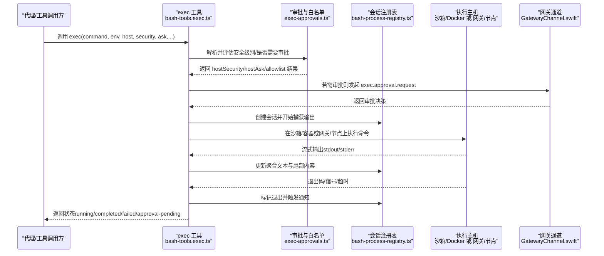
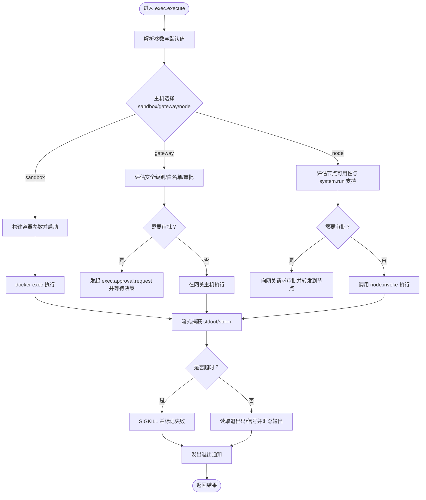
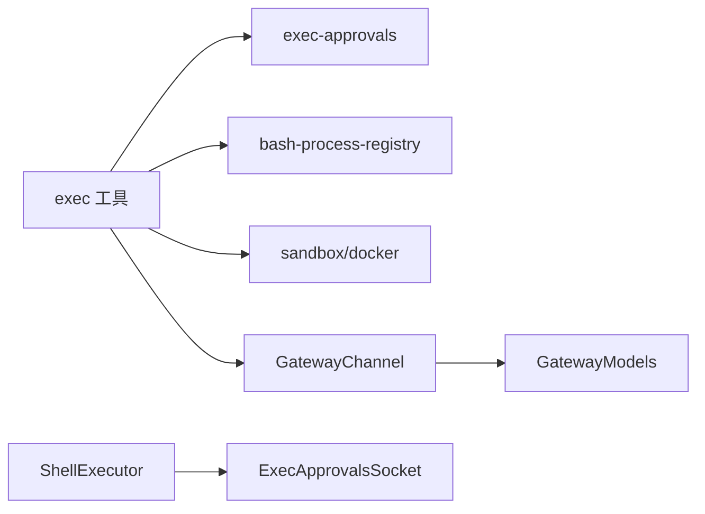

# 本地执行

<cite>
**本文引用的文件**
- [src/agents/bash-tools.exec.ts](file://src/agents/bash-tools.exec.ts)
- [src/infra/exec-approvals.ts](file://src/infra/exec-approvals.ts)
- [src/agents/bash-tools.shared.ts](file://src/agents/bash-tools.shared.ts)
- [src/agents/bash-process-registry.ts](file://src/agents/bash-process-registry.ts)
- [src/agents/bash-tools.process.ts](file://src/agents/bash-tools.process.ts)
- [src/agents/sandbox/docker.ts](file://src/agents/sandbox/docker.ts)
- [src/gateway/client.ts](file://src/gateway/client.ts)
- [apps/macos/Sources/OpenClaw/ShellExecutor.swift](file://apps/macos/Sources/OpenClaw/ShellExecutor.swift)
- [apps/macos/Sources/OpenClaw/ExecApprovalsSocket.swift](file://apps/macos/Sources/OpenClaw/ExecApprovalsSocket.swift)
- [apps/shared/OpenClawKit/Sources/OpenClawKit/GatewayChannel.swift](file://apps/shared/OpenClawKit/Sources/OpenClawKit/GatewayChannel.swift)
- [apps/shared/OpenClawKit/Sources/OpenClawProtocol/GatewayModels.swift](file://apps/shared/OpenClawKit/Sources/OpenClawProtocol/GatewayModels.swift)
- [apps/macos/Tests/OpenClawIPCTests/GatewayConnectionControlTests.swift](file://apps/macos/Tests/OpenClawIPCTests/GatewayConnectionControlTests.swift)
- [docs/tools/exec.md](file://docs/tools/exec.md)
- [docs/gateway/sandboxing.md](file://docs/gateway/sandboxing.md)
- [docs/gateway/logging.md](file://docs/gateway/logging.md)
</cite>

## 目录

1. [简介](#简介)
2. [项目结构](#项目结构)
3. [核心组件](#核心组件)
4. [架构总览](#架构总览)
5. [组件详解](#组件详解)
6. [依赖关系分析](#依赖关系分析)
7. [性能考量](#性能考量)
8. [故障排查指南](#故障排查指南)
9. [结论](#结论)
10. [附录](#附录)

## 简介

本文件系统性阐述 OpenClaw 的“本地执行”能力，覆盖命令执行、进程管理、安全沙箱、权限控制、执行上下文与环境变量、命令白名单与执行限制、输出捕获与错误处理、超时控制、调试与日志、性能监控，以及与网关服务的通信机制与数据传输。目标是帮助开发者与运维人员在理解整体设计的同时，快速定位实现细节并进行安全与性能优化。

## 项目结构

围绕本地执行的关键代码分布在以下模块：

- 执行入口与工具：exec 工具、process 工具、会话注册表
- 审批与白名单：执行审批、命令分析与白名单评估
- 沙箱与容器：Docker 容器生命周期与参数构建
- 网关通信：WebSocket 请求封装、事件编码、连接控制
- 平台适配：macOS Swift 执行器与审批套接字
- 文档与配置：工具使用说明、沙箱配置、日志规范

```mermaid
graph TB
subgraph "执行层"
Exec["exec 工具<br/>src/agents/bash-tools.exec.ts"]
Proc["process 工具<br/>src/agents/bash-tools.process.ts"]
Reg["进程会话注册表<br/>src/agents/bash-process-registry.ts"]
end
subgraph "审批与白名单"
Approve["执行审批与策略<br/>src/infra/exec-approvals.ts"]
end
subgraph "沙箱与容器"
Docker["Docker 容器管理<br/>src/agents/sandbox/docker.ts"]
Shared["沙箱环境构建<br/>src/agents/bash-tools.shared.ts"]
end
subgraph "网关通信"
GWClient["网关客户端选项<br/>src/gateway/client.ts"]
GWChannel["网关通道编码/发送<br/>apps/shared/OpenClawKit/Sources/OpenClawKit/GatewayChannel.swift"]
GWModels["网关帧模型<br/>apps/shared/OpenClawKit/Sources/OpenClawProtocol/GatewayModels.swift"]
end
subgraph "平台适配"
SwiftExec["Swift 执行器<br/>apps/macos/Sources/OpenClaw/ShellExecutor.swift"]
SwiftSock["审批套接字调用<br/>apps/macos/Sources/OpenClaw/ExecApprovalsSocket.swift"]
end
Exec --> Reg
Exec --> Approve
Exec --> Docker
Exec --> Shared
Proc --> Reg
GWChannel --> GWModels
GWClient --> GWChannel
SwiftExec --> SwiftSock
```

图表来源

- [src/agents/bash-tools.exec.ts](file://src/agents/bash-tools.exec.ts#L824-L1662)
- [src/agents/bash-tools.process.ts](file://src/agents/bash-tools.process.ts#L1-L26)
- [src/agents/bash-process-registry.ts](file://src/agents/bash-process-registry.ts#L1-L528)
- [src/infra/exec-approvals.ts](file://src/infra/exec-approvals.ts#L1-L800)
- [src/agents/sandbox/docker.ts](file://src/agents/sandbox/docker.ts#L1-L358)
- [src/agents/bash-tools.shared.ts](file://src/agents/bash-tools.shared.ts#L1-L49)
- [src/gateway/client.ts](file://src/gateway/client.ts#L35-L77)
- [apps/shared/OpenClawKit/Sources/OpenClawKit/GatewayChannel.swift](file://apps/shared/OpenClawKit/Sources/OpenClawKit/GatewayChannel.swift#L645-L736)
- [apps/shared/OpenClawKit/Sources/OpenClawProtocol/GatewayModels.swift](file://apps/shared/OpenClawKit/Sources/OpenClawProtocol/GatewayModels.swift#L2757-L2765)
- [apps/macos/Sources/OpenClaw/ShellExecutor.swift](file://apps/macos/Sources/OpenClaw/ShellExecutor.swift#L70-L102)
- [apps/macos/Sources/OpenClaw/ExecApprovalsSocket.swift](file://apps/macos/Sources/OpenClaw/ExecApprovalsSocket.swift#L530-L574)

章节来源

- [src/agents/bash-tools.exec.ts](file://src/agents/bash-tools.exec.ts#L824-L1662)
- [src/agents/bash-process-registry.ts](file://src/agents/bash-process-registry.ts#L1-L528)
- [src/infra/exec-approvals.ts](file://src/infra/exec-approvals.ts#L1-L800)
- [src/agents/sandbox/docker.ts](file://src/agents/sandbox/docker.ts#L1-L358)
- [src/agents/bash-tools.shared.ts](file://src/agents/bash-tools.shared.ts#L1-L49)
- [src/gateway/client.ts](file://src/gateway/client.ts#L35-L77)
- [apps/shared/OpenClawKit/Sources/OpenClawKit/GatewayChannel.swift](file://apps/shared/OpenClawKit/Sources/OpenClawKit/GatewayChannel.swift#L645-L736)
- [apps/shared/OpenClawKit/Sources/OpenClawProtocol/GatewayModels.swift](file://apps/shared/OpenClawKit/Sources/OpenClawProtocol/GatewayModels.swift#L2757-L2765)
- [apps/macos/Sources/OpenClaw/ShellExecutor.swift](file://apps/macos/Sources/OpenClaw/ShellExecutor.swift#L70-L102)
- [apps/macos/Sources/OpenClaw/ExecApprovalsSocket.swift](file://apps/macos/Sources/OpenClaw/ExecApprovalsSocket.swift#L530-L574)

## 核心组件

- 执行工具（exec）：负责解析参数、选择执行主机（沙箱/网关/节点）、执行前的审批与白名单检查、启动子进程或容器、输出捕获与更新、超时与退出通知。
- 进程工具（process）：用于后台会话的查询、轮询、写入输入、终止与清理。
- 会话注册表：统一管理运行中与已完成的会话，维护输出缓冲、行数截断、尾部内容、TTY 渲染等。
- 执行审批与白名单：解析命令、分析管道段、匹配允许列表、决定是否需要审批、计算最终安全级别与提示策略。
- 沙箱与容器：构建容器参数、挂载工作区、设置网络与安全选项、确保镜像存在、启动容器、执行命令。
- 网关通信：封装请求帧、编码参数、超时控制、重连与错误包装；移动端通过通道与模型进行消息编解码。
- 平台适配：macOS 上的 ShellExecutor 提供超时与结果封装；ExecApprovalsSocket 将审批决策映射为执行结果。

章节来源

- [src/agents/bash-tools.exec.ts](file://src/agents/bash-tools.exec.ts#L824-L1662)
- [src/agents/bash-tools.process.ts](file://src/agents/bash-tools.process.ts#L1-L26)
- [src/agents/bash-process-registry.ts](file://src/agents/bash-process-registry.ts#L1-L528)
- [src/infra/exec-approvals.ts](file://src/infra/exec-approvals.ts#L1494-L1603)
- [src/agents/sandbox/docker.ts](file://src/agents/sandbox/docker.ts#L125-L212)
- [apps/shared/OpenClawKit/Sources/OpenClawKit/GatewayChannel.swift](file://apps/shared/OpenClawKit/Sources/OpenClawKit/GatewayChannel.swift#L645-L736)
- [apps/macos/Sources/OpenClaw/ShellExecutor.swift](file://apps/macos/Sources/OpenClaw/ShellExecutor.swift#L70-L102)

## 架构总览

下图展示从工具调用到执行完成的端到端流程，包括审批、白名单、主机选择、容器/主机执行、输出渲染与通知。

图表来源

- [src/agents/bash-tools.exec.ts](file://src/agents/bash-tools.exec.ts#L1302-L1599)
- [src/infra/exec-approvals.ts](file://src/infra/exec-approvals.ts#L1494-L1603)
- [src/agents/bash-process-registry.ts](file://src/agents/bash-process-registry.ts#L152-L305)
- [apps/shared/OpenClawKit/Sources/OpenClawKit/GatewayChannel.swift](file://apps/shared/OpenClawKit/Sources/OpenClawKit/GatewayChannel.swift#L645-L736)

## 组件详解

### 执行工具（exec）与进程管理

- 参数与默认值：支持命令、工作目录、环境变量覆盖、超时、PTY、主机选择、安全模式、审批策略、节点绑定、路径前置、背景化与自动挂起等。
- 主机选择与权限：
  - host 默认 sandbox；当 sandbox 关闭时，host=sandbox 实际在网关主机直接执行（不走容器）。
  - elevated 模式强制在网关主机执行，且仅在允许时生效。
  - host=node 需要配对节点，节点需支持 system.run 命令。
- 审批与白名单：
  - 当 host=gateway 或 host=node 且 security=allowlist 时，会先进行命令分析与白名单匹配。
  - 若 allowlist 不满足或分析失败，则根据 ask 策略决定是否弹窗审批。
  - 审批通过后可记录白名单命中，便于后续放宽。
- 进程启动与输出：
  - 支持 PTY（TTY 交互型命令），否则使用管道。
  - 输出经 headless xterm.js 渲染，保证 ANSI 正确处理；支持字符数与行数截断。
  - 后台会话持久化，前台调用可轮询或继续挂起。
- 超时与退出：
  - 可配置超时，超时后强制 SIGKILL 并标记失败。
  - 退出时汇总输出、尾部内容、是否截断、是否由信号导致等信息。
- 通知与心跳：
  - 支持在运行超过阈值时发出“正在运行”通知；退出时发出“已完成/被拒绝”通知。

图表来源

- [src/agents/bash-tools.exec.ts](file://src/agents/bash-tools.exec.ts#L824-L1599)
- [src/agents/bash-process-registry.ts](file://src/agents/bash-process-registry.ts#L152-L305)
- [src/infra/exec-approvals.ts](file://src/infra/exec-approvals.ts#L1494-L1603)

章节来源

- [src/agents/bash-tools.exec.ts](file://src/agents/bash-tools.exec.ts#L824-L1662)
- [src/agents/bash-process-registry.ts](file://src/agents/bash-process-registry.ts#L1-L528)
- [docs/tools/exec.md](file://docs/tools/exec.md#L1-L180)

### 审批与命令白名单

- 安全级别与审批策略：
  - security: deny/allowlist/full；ask: off/on-miss/always。
  - 最终安全级别取配置与请求中的最小值；审批策略取最大值。
  - askFallback 控制审批超时或拒绝时的回退策略。
- 命令分析与白名单：
  - 将命令拆分为管道段，逐段分析可执行文件解析、通配符匹配、大小写归一化、Windows 规范化等。
  - 白名单仅匹配已解析的绝对路径，不接受基名匹配；链式操作（;、&&、||）与重定向在 allowlist 模式下被拒绝。
  - 允许安全二进制（safeBins）在未显式允许时直接运行。
- 审批请求与决策：
  - 通过网关工具链发起 exec.approval.request，携带命令、cwd、host、security、ask、agentId 等上下文。
  - 决策结果为 deny/allow-once/allow-always；若超时或请求失败则按策略判定。

章节来源

- [src/infra/exec-approvals.ts](file://src/infra/exec-approvals.ts#L1-L800)
- [src/infra/exec-approvals.ts](file://src/infra/exec-approvals.ts#L1494-L1603)

### 安全沙箱与容器

- 模式与作用域：
  - 模式：off/non-main/all；作用域：session/agent/shared。
  - 工作区访问：none/ro/rw；可挂载只读或读写到容器内。
- 容器参数构建：
  - 设置只读根文件系统、tmpfs、网络、用户、环境变量、能力降级、安全选项（no-new-privileges、seccomp/apparmor）、DNS、hosts、PID 限制、内存与 CPU 限额、ulimit 等。
  - 自动拉取/标签默认镜像，创建工作目录与挂载点，必要时执行一次性 setupCommand。
- 生命周期与热重建：
  - 通过标签与配置哈希判断容器是否需要重建；近期使用的热容器会在提示后建议重建以应用新配置。

章节来源

- [docs/gateway/sandboxing.md](file://docs/gateway/sandboxing.md#L1-L194)
- [src/agents/sandbox/docker.ts](file://src/agents/sandbox/docker.ts#L125-L212)
- [src/agents/sandbox/docker.ts](file://src/agents/sandbox/docker.ts#L282-L358)

### 网关通信与数据传输

- 请求封装与超时：
  - GatewayChannel 对请求进行编码，包含方法、参数与唯一 ID；发送失败时进行重连与错误包装。
  - 支持请求超时回调，避免阻塞。
- 帧模型与事件：
  - GatewayFrame 包含 req/res/event 三类帧，便于统一处理。
- 移动端集成：
  - iOS/macOS 侧通过 GatewayChannel 发送消息；测试覆盖了空消息与缺失进程场景。

章节来源

- [apps/shared/OpenClawKit/Sources/OpenClawKit/GatewayChannel.swift](file://apps/shared/OpenClawKit/Sources/OpenClawKit/GatewayChannel.swift#L645-L736)
- [apps/shared/OpenClawKit/Sources/OpenClawProtocol/GatewayModels.swift](file://apps/shared/OpenClawKit/Sources/OpenClawProtocol/GatewayModels.swift#L2757-L2765)
- [apps/macos/Tests/OpenClawIPCTests/GatewayConnectionControlTests.swift](file://apps/macos/Tests/OpenClawIPCTests/GatewayConnectionControlTests.swift#L41-L59)

### 平台适配与本地执行

- macOS ShellExecutor：
  - 提供带超时的命令执行，将 stdout/stderr/exitCode/timedOut 等封装为统一结果。
- ExecApprovalsSocket：
  - 将 Swift 执行器的结果映射为执行响应，包含成功标志、输出与错误信息。

章节来源

- [apps/macos/Sources/OpenClaw/ShellExecutor.swift](file://apps/macos/Sources/OpenClaw/ShellExecutor.swift#L70-L102)
- [apps/macos/Sources/OpenClaw/ExecApprovalsSocket.swift](file://apps/macos/Sources/OpenClaw/ExecApprovalsSocket.swift#L530-L574)

## 依赖关系分析

- 执行工具依赖审批模块进行策略评估，依赖会话注册表进行输出与状态管理，可选依赖沙箱模块进行容器执行。
- 网关通道作为跨语言/跨平台的通信桥梁，封装请求与事件。
- 平台适配模块（macOS）直接调用本地执行器，与审批套接字协作。

图表来源

- [src/agents/bash-tools.exec.ts](file://src/agents/bash-tools.exec.ts#L824-L1599)
- [src/infra/exec-approvals.ts](file://src/infra/exec-approvals.ts#L1-L800)
- [src/agents/bash-process-registry.ts](file://src/agents/bash-process-registry.ts#L1-L528)
- [src/agents/sandbox/docker.ts](file://src/agents/sandbox/docker.ts#L1-L358)
- [apps/shared/OpenClawKit/Sources/OpenClawKit/GatewayChannel.swift](file://apps/shared/OpenClawKit/Sources/OpenClawKit/GatewayChannel.swift#L645-L736)
- [apps/shared/OpenClawKit/Sources/OpenClawProtocol/GatewayModels.swift](file://apps/shared/OpenClawKit/Sources/OpenClawProtocol/GatewayModels.swift#L2757-L2765)
- [apps/macos/Sources/OpenClaw/ShellExecutor.swift](file://apps/macos/Sources/OpenClaw/ShellExecutor.swift#L70-L102)
- [apps/macos/Sources/OpenClaw/ExecApprovalsSocket.swift](file://apps/macos/Sources/OpenClaw/ExecApprovalsSocket.swift#L530-L574)

章节来源

- [src/agents/bash-tools.exec.ts](file://src/agents/bash-tools.exec.ts#L824-L1599)
- [src/agents/bash-process-registry.ts](file://src/agents/bash-process-registry.ts#L1-L528)
- [src/infra/exec-approvals.ts](file://src/infra/exec-approvals.ts#L1-L800)
- [src/agents/sandbox/docker.ts](file://src/agents/sandbox/docker.ts#L1-L358)
- [apps/shared/OpenClawKit/Sources/OpenClawKit/GatewayChannel.swift](file://apps/shared/OpenClawKit/Sources/OpenClawKit/GatewayChannel.swift#L645-L736)
- [apps/shared/OpenClawKit/Sources/OpenClawProtocol/GatewayModels.swift](file://apps/shared/OpenClawKit/Sources/OpenClawProtocol/GatewayModels.swift#L2757-L2765)
- [apps/macos/Sources/OpenClaw/ShellExecutor.swift](file://apps/macos/Sources/OpenClaw/ShellExecutor.swift#L70-L102)
- [apps/macos/Sources/OpenClaw/ExecApprovalsSocket.swift](file://apps/macos/Sources/OpenClaw/ExecApprovalsSocket.swift#L530-L574)

## 性能考量

- 输出缓冲与截断：
  - 使用 headless xterm.js 统一渲染，避免 ANSI 问题；支持字符数与行数双重截断，减少内存占用。
  - 待写回调计数防止退出时竞态，确保最终内容完整。
- 超时与资源回收：
  - 超时后立即 SIGKILL 并清理子进程与终端资源，避免句柄泄漏。
  - 完成会话定期清理，基于 TTL 回收已完成任务。
- PTY 与非 PTY：
  - PTY 使用固定视口与无滚动回溯，适合交互式命令；管道使用大视口与滚动回溯，适合批量输出。
- 日志与可观测性：
  - 文件日志与控制台日志分离，支持不同级别与样式；WS 日志可切换精简/完整模式。
  - 通过系统事件与心跳上报执行状态，便于前端与 CLI 跟踪。

章节来源

- [src/agents/bash-process-registry.ts](file://src/agents/bash-process-registry.ts#L152-L305)
- [src/agents/bash-tools.exec.ts](file://src/agents/bash-tools.exec.ts#L606-L822)
- [docs/gateway/logging.md](file://docs/gateway/logging.md#L1-L114)

## 故障排查指南

- 审批相关：
  - 审批请求失败或超时：检查网关通道连接、令牌与 socket 路径；确认 exec-approvals.json 存在且格式正确。
  - allowlist 不满足：查看白名单匹配项与已解析路径；必要时添加 allowlist 条目或调整 ask 策略。
- 执行主机：
  - host=node 无可用节点：确认配对节点存在且支持 system.run；多节点时指定 node。
  - elevated 模式不可用：检查 tools.elevated.enabled 与 allowFrom 配置。
- 环境变量与 PATH：
  - 网关/节点主机执行禁止自定义 PATH 与加载器注入变量（如 LD*\*/DYLD*\*），避免二进制劫持。
- 输出与截断：
  - 输出被截断：增大 maxOutputChars 或减少行数；检查是否为 PTY 行数限制。
- 超时与退出：
  - 超时后被 SIGKILL：适当提高 timeout；检查命令是否卡死或外部依赖阻塞。
- 网关连接：
  - 连接异常或空消息：参考 GatewayConnectionControlTests 中的断言，确保消息有效与进程存在。

章节来源

- [src/agents/bash-tools.exec.ts](file://src/agents/bash-tools.exec.ts#L950-L1021)
- [src/infra/exec-approvals.ts](file://src/infra/exec-approvals.ts#L221-L295)
- [apps/macos/Tests/OpenClawIPCTests/GatewayConnectionControlTests.swift](file://apps/macos/Tests/OpenClawIPCTests/GatewayConnectionControlTests.swift#L41-L59)
- [docs/tools/exec.md](file://docs/tools/exec.md#L39-L44)

## 结论

OpenClaw 的本地执行体系以“可审计、可控制、可扩展”为核心设计原则：通过审批与白名单实现最小授权，通过沙箱与容器提供强隔离，通过统一的网关通道与事件模型实现跨平台协同。配合完善的输出渲染、超时控制与日志体系，既满足日常自动化需求，又兼顾安全与可观测性。

## 附录

- 工具使用参考：见文档 [Exec Tool](file://docs/tools/exec.md#L1-L180)
- 沙箱配置参考：见文档 [Sandboxing](file://docs/gateway/sandboxing.md#L1-L194)
- 日志与 WS 日志参考：见文档 [Logging](file://docs/gateway/logging.md#L1-L114)
