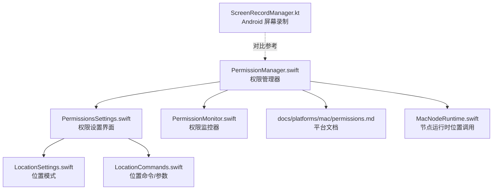
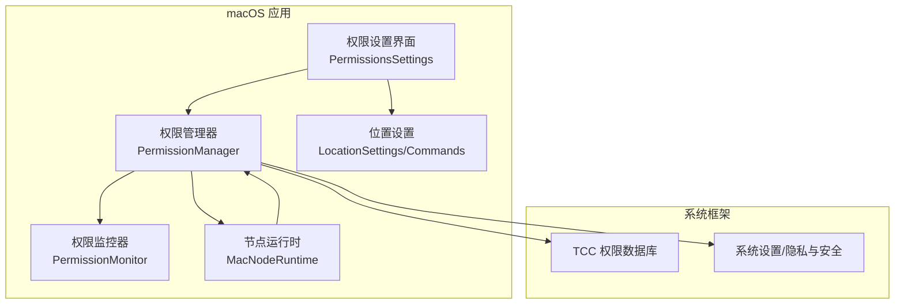
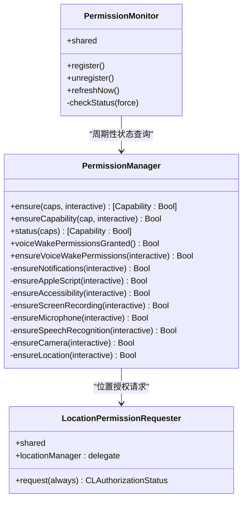
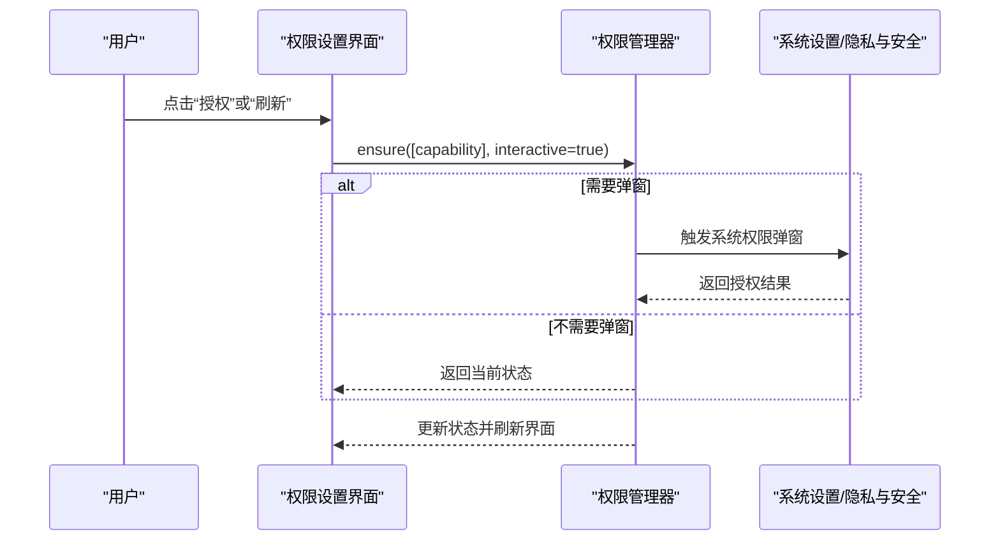
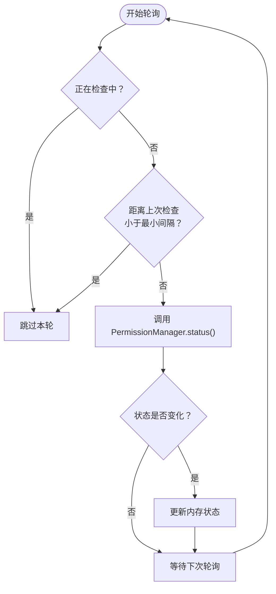
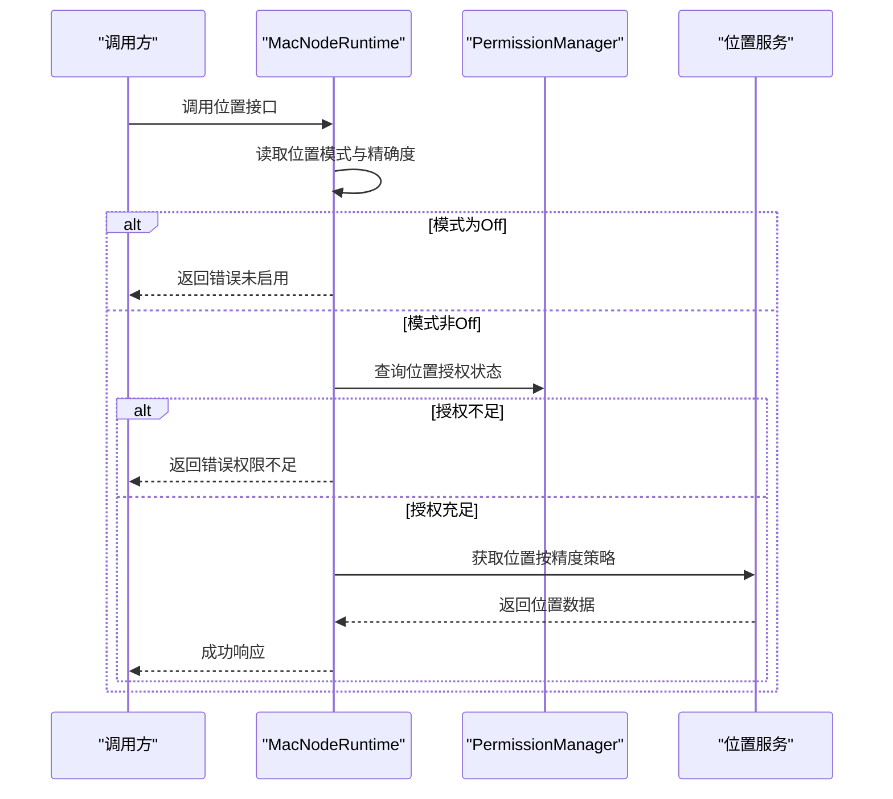
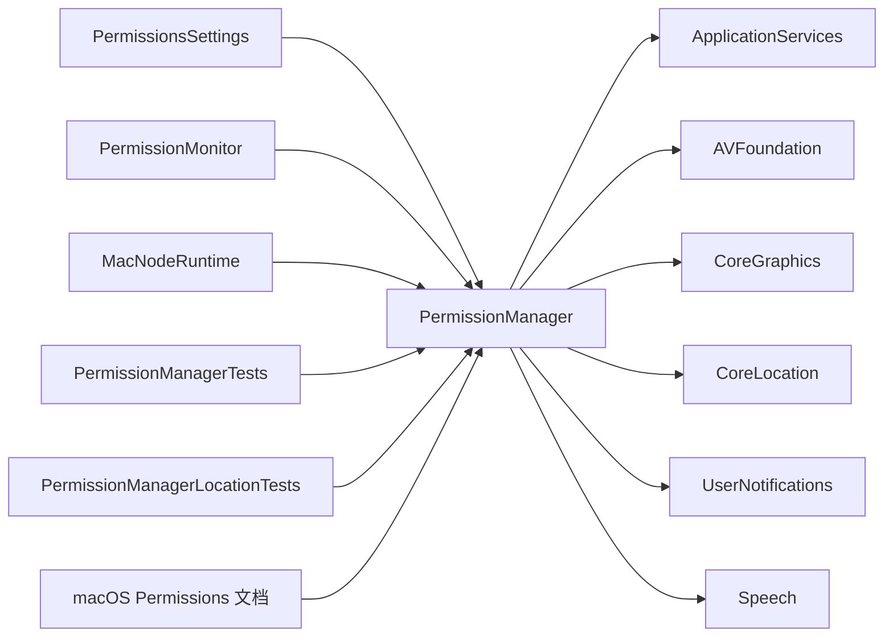

# 权限管理

<cite>
**本文引用的文件**
- [apps/macos/Sources/OpenClaw/PermissionManager.swift](file://apps/macos/Sources/OpenClaw/PermissionManager.swift)
- [apps/macos/Sources/OpenClaw/PermissionsSettings.swift](file://apps/macos/Sources/OpenClaw/PermissionsSettings.swift)
- [apps/macos/Tests/OpenClawIPCTests/PermissionManagerTests.swift](file://apps/macos/Tests/OpenClawIPCTests/PermissionManagerTests.swift)
- [apps/macos/Tests/OpenClawIPCTests/PermissionManagerLocationTests.swift](file://apps/macos/Tests/OpenClawIPCTests/PermissionManagerLocationTests.swift)
- [docs/platforms/mac/permissions.md](file://docs/platforms/mac/permissions.md)
- [apps/macos/Sources/OpenClaw/NodeMode/MacNodeRuntime.swift](file://apps/macos/Sources/OpenClaw/NodeMode/MacNodeRuntime.swift)
- [apps/shared/OpenClawKit/Sources/OpenClawKit/LocationSettings.swift](file://apps/shared/OpenClawKit/Sources/OpenClawKit/LocationSettings.swift)
- [apps/shared/OpenClawKit/Sources/OpenClawKit/LocationCommands.swift](file://apps/shared/OpenClawKit/Sources/OpenClawKit/LocationCommands.swift)
- [apps/android/app/src/main/java/ai/openclaw/android/node/ScreenRecordManager.kt](file://apps/android/app/src/main/java/ai/openclaw/android/node/ScreenRecordManager.kt)
- [apps/android/app/src/main/java/ai/openclaw/android/LocationMode.kt](file://apps/android/app/src/main/java/ai/openclaw/android/LocationMode.kt)
- [src/agents/tools/nodes-tool.ts](file://src/agents/tools/nodes-tool.ts)
</cite>

## 目录

1. [简介](#简介)
2. [项目结构](#项目结构)
3. [核心组件](#核心组件)
4. [架构总览](#架构总览)
5. [组件详解](#组件详解)
6. [依赖关系分析](#依赖关系分析)
7. [性能考量](#性能考量)
8. [故障排查指南](#故障排查指南)
9. [结论](#结论)
10. [附录](#附录)

## 简介

本文件面向OpenClaw在macOS平台上的权限管理子系统，系统性阐述如何集成macOS TCC（透明度、一致性与加密）权限框架，覆盖权限分类、状态检查、交互式与非交互式申请流程、权限持久化与变更监听、错误处理与用户引导，以及与跨平台（Android）能力的对比。文档同时给出安全与合规建议，帮助开发者正确实现与维护权限相关功能。

## 项目结构

OpenClaw的权限管理主要集中在macOS应用模块中，核心文件包括：

- 权限管理器：负责各类权限的状态查询、申请与错误处理
- 权限设置界面：提供可视化权限状态展示与一键申请入口
- 权限监控器：周期性轮询权限状态并触发UI更新
- 位置模式与命令：统一的位置权限策略与参数模型
- 测试用例：验证权限状态与申请行为的正确性
- 平台文档：macOS权限持久化与签名要求说明

图表来源

- [apps/macos/Sources/OpenClaw/PermissionManager.swift](file://apps/macos/Sources/OpenClaw/PermissionManager.swift#L1-L507)
- [apps/macos/Sources/OpenClaw/PermissionsSettings.swift](file://apps/macos/Sources/OpenClaw/PermissionsSettings.swift#L1-L228)
- [apps/macos/Sources/OpenClaw/NodeMode/MacNodeRuntime.swift](file://apps/macos/Sources/OpenClaw/NodeMode/MacNodeRuntime.swift#L232-L902)
- [apps/shared/OpenClawKit/Sources/OpenClawKit/LocationSettings.swift](file://apps/shared/OpenClawKit/Sources/OpenClawKit/LocationSettings.swift#L1-L7)
- [apps/shared/OpenClawKit/Sources/OpenClawKit/LocationCommands.swift](file://apps/shared/OpenClawKit/Sources/OpenClawKit/LocationCommands.swift#L1-L57)
- [docs/platforms/mac/permissions.md](file://docs/platforms/mac/permissions.md#L1-L51)
- [apps/android/app/src/main/java/ai/openclaw/android/node/ScreenRecordManager.kt](file://apps/android/app/src/main/java/ai/openclaw/android/node/ScreenRecordManager.kt#L1-L142)

章节来源

- [apps/macos/Sources/OpenClaw/PermissionManager.swift](file://apps/macos/Sources/OpenClaw/PermissionManager.swift#L1-L507)
- [apps/macos/Sources/OpenClaw/PermissionsSettings.swift](file://apps/macos/Sources/OpenClaw/PermissionsSettings.swift#L1-L228)
- [apps/macos/Sources/OpenClaw/NodeMode/MacNodeRuntime.swift](file://apps/macos/Sources/OpenClaw/NodeMode/MacNodeRuntime.swift#L232-L902)
- [apps/shared/OpenClawKit/Sources/OpenClawKit/LocationSettings.swift](file://apps/shared/OpenClawKit/Sources/OpenClawKit/LocationSettings.swift#L1-L7)
- [apps/shared/OpenClawKit/Sources/OpenClawKit/LocationCommands.swift](file://apps/shared/OpenClawKit/Sources/OpenClawKit/LocationCommands.swift#L1-L57)
- [docs/platforms/mac/permissions.md](file://docs/platforms/mac/permissions.md#L1-L51)
- [apps/android/app/src/main/java/ai/openclaw/android/node/ScreenRecordManager.kt](file://apps/android/app/src/main/java/ai/openclaw/android/node/ScreenRecordManager.kt#L1-L142)

## 核心组件

- 权限管理器（PermissionManager）：集中封装所有权限的检查与申请逻辑，支持交互式与非交互式两种模式；提供批量权限校验与单个权限处理；内置对通知、AppleScript自动化、辅助功能、屏幕录制、麦克风、语音识别、摄像头、位置等权限的处理。
- 权限设置界面（PermissionsSettings）：提供权限状态列表、刷新按钮、位置访问设置（含“关闭/使用时/始终”三种模式与精确度开关），并支持直接触发权限申请。
- 权限监控器（PermissionMonitor）：在主线程注册定时器，周期性拉取权限状态，避免频繁重复检查，并在状态变化时更新UI。
- 位置模式与命令（LocationSettings/LocationCommands）：统一位置权限策略（Off/WhileUsing/Always）与获取位置的参数模型。
- 平台文档（macOS Permissions）：说明TCC权限持久化与签名要求，以及权限提示消失时的恢复步骤。
- 节点运行时（MacNodeRuntime）：在执行位置相关调用前进行权限前置校验，若未满足策略则返回明确错误码与消息。
- Android对比（ScreenRecordManager）：展示跨平台在屏幕录制与麦克风权限申请上的差异与约束。

章节来源

- [apps/macos/Sources/OpenClaw/PermissionManager.swift](file://apps/macos/Sources/OpenClaw/PermissionManager.swift#L12-L228)
- [apps/macos/Sources/OpenClaw/PermissionsSettings.swift](file://apps/macos/Sources/OpenClaw/PermissionsSettings.swift#L6-L128)
- [apps/macos/Sources/OpenClaw/NodeMode/MacNodeRuntime.swift](file://apps/macos/Sources/OpenClaw/NodeMode/MacNodeRuntime.swift#L232-L264)
- [apps/shared/OpenClawKit/Sources/OpenClawKit/LocationSettings.swift](file://apps/shared/OpenClawKit/Sources/OpenClawKit/LocationSettings.swift#L3-L7)
- [apps/shared/OpenClawKit/Sources/OpenClawKit/LocationCommands.swift](file://apps/shared/OpenClawKit/Sources/OpenClawKit/LocationCommands.swift#L1-L57)
- [docs/platforms/mac/permissions.md](file://docs/platforms/mac/permissions.md#L10-L51)
- [apps/android/app/src/main/java/ai/openclaw/android/node/ScreenRecordManager.kt](file://apps/android/app/src/main/java/ai/openclaw/android/node/ScreenRecordManager.kt#L1-L142)

## 架构总览

下图展示了权限管理在macOS端的整体架构：权限管理器作为核心协调者，权限设置界面负责用户交互与触发申请，权限监控器负责状态轮询与UI更新，节点运行时在调用具体能力前进行策略校验。

图表来源

- [apps/macos/Sources/OpenClaw/PermissionManager.swift](file://apps/macos/Sources/OpenClaw/PermissionManager.swift#L12-L228)
- [apps/macos/Sources/OpenClaw/PermissionsSettings.swift](file://apps/macos/Sources/OpenClaw/PermissionsSettings.swift#L6-L128)
- [apps/macos/Sources/OpenClaw/NodeMode/MacNodeRuntime.swift](file://apps/macos/Sources/OpenClaw/NodeMode/MacNodeRuntime.swift#L232-L264)
- [apps/shared/OpenClawKit/Sources/OpenClawKit/LocationSettings.swift](file://apps/shared/OpenClawKit/Sources/OpenClawKit/LocationSettings.swift#L3-L7)
- [apps/shared/OpenClawKit/Sources/OpenClawKit/LocationCommands.swift](file://apps/shared/OpenClawKit/Sources/OpenClawKit/LocationCommands.swift#L1-L57)

## 组件详解

### 权限管理器（PermissionManager）

- 职责
  - 提供批量权限校验与逐项申请
  - 支持交互式（弹窗引导）与非交互式（仅查询不触发系统弹窗）两种模式
  - 针对不同权限类型分别实现状态判断与申请流程
- 关键能力
  - 通知权限：查询授权状态，必要时请求授权，失败时打开系统设置
  - AppleScript自动化：通过发送轻量AppleScript探测授权，必要时打开“自动化”设置页
  - 辅助功能（Accessibility）：通过AXIsProcessTrusted/AXIsProcessTrustedWithOptions检测与触发授权
  - 屏幕录制：CGPreflightScreenCaptureAccess/CGRequestScreenCaptureAccess
  - 麦克风：AVCaptureDevice.authorizationStatus/requestAccess
  - 语音识别：SFSpeechRecognizer.authorizationStatus/requestAuthorization
  - 摄像头：AVCaptureDevice.authorizationStatus/requestAccess
  - 位置：CLLocationManager位置服务开关、授权状态、委托回调与超时引导
- 语音唤醒组合权限：同时校验麦克风与语音识别是否已授权
- 状态查询：对各权限进行一次性状态快照，用于UI展示与策略判断

图表来源

- [apps/macos/Sources/OpenClaw/PermissionManager.swift](file://apps/macos/Sources/OpenClaw/PermissionManager.swift#L12-L228)
- [apps/macos/Sources/OpenClaw/PermissionManager.swift](file://apps/macos/Sources/OpenClaw/PermissionManager.swift#L291-L373)
- [apps/macos/Sources/OpenClaw/PermissionManager.swift](file://apps/macos/Sources/OpenClaw/PermissionManager.swift#L423-L490)

章节来源

- [apps/macos/Sources/OpenClaw/PermissionManager.swift](file://apps/macos/Sources/OpenClaw/PermissionManager.swift#L12-L228)
- [apps/macos/Sources/OpenClaw/PermissionManager.swift](file://apps/macos/Sources/OpenClaw/PermissionManager.swift#L291-L373)
- [apps/macos/Sources/OpenClaw/PermissionManager.swift](file://apps/macos/Sources/OpenClaw/PermissionManager.swift#L423-L490)

### 权限设置界面（PermissionsSettings）

- 功能
  - 展示当前各权限的授权状态
  - 提供“刷新”按钮手动触发状态同步
  - 位置访问设置：选择“关闭/使用时/始终”，并可切换“精确位置”
  - 一键触发对应权限的申请流程
- 用户体验
  - 授权成功/失败即时反馈
  - 失败时自动打开系统设置对应页面，减少用户操作成本

图表来源

- [apps/macos/Sources/OpenClaw/PermissionsSettings.swift](file://apps/macos/Sources/OpenClaw/PermissionsSettings.swift#L99-L128)
- [apps/macos/Sources/OpenClaw/PermissionManager.swift](file://apps/macos/Sources/OpenClaw/PermissionManager.swift#L25-L52)

章节来源

- [apps/macos/Sources/OpenClaw/PermissionsSettings.swift](file://apps/macos/Sources/OpenClaw/PermissionsSettings.swift#L6-L128)

### 权限监控器（PermissionMonitor）

- 功能
  - 注册/注销监听，避免重复创建定时器
  - 定时器每秒轮询一次权限状态，最小间隔去抖
  - 状态变化时更新共享状态，驱动UI刷新
- 行为
  - 在测试环境下跳过轮询，避免干扰
  - 使用主线程调度，保证UI一致性

图表来源

- [apps/macos/Sources/OpenClaw/PermissionManager.swift](file://apps/macos/Sources/OpenClaw/PermissionManager.swift#L473-L489)
- [apps/macos/Sources/OpenClaw/PermissionManager.swift](file://apps/macos/Sources/OpenClaw/PermissionManager.swift#L453-L471)

章节来源

- [apps/macos/Sources/OpenClaw/PermissionManager.swift](file://apps/macos/Sources/OpenClaw/PermissionManager.swift#L423-L490)

### 位置权限策略与调用

- 策略
  - 位置模式：Off/WhileUsing/Always
  - 精确位置：可按需启用/禁用
  - 节点运行时在调用位置能力前进行策略校验，若未开启或权限不足则返回明确错误
- 参数模型
  - 支持超时、最大年龄、期望精度等参数
- 跨平台对比
  - Android侧同样区分前台/后台与粗/精定位，且在后台Always时需要额外的后台定位权限

图表来源

- [apps/macos/Sources/OpenClaw/NodeMode/MacNodeRuntime.swift](file://apps/macos/Sources/OpenClaw/NodeMode/MacNodeRuntime.swift#L232-L264)
- [apps/shared/OpenClawKit/Sources/OpenClawKit/LocationSettings.swift](file://apps/shared/OpenClawKit/Sources/OpenClawKit/LocationSettings.swift#L3-L7)
- [apps/shared/OpenClawKit/Sources/OpenClawKit/LocationCommands.swift](file://apps/shared/OpenClawKit/Sources/OpenClawKit/LocationCommands.swift#L13-L23)

章节来源

- [apps/macos/Sources/OpenClaw/NodeMode/MacNodeRuntime.swift](file://apps/macos/Sources/OpenClaw/NodeMode/MacNodeRuntime.swift#L232-L264)
- [apps/shared/OpenClawKit/Sources/OpenClawKit/LocationSettings.swift](file://apps/shared/OpenClawKit/Sources/OpenClawKit/LocationSettings.swift#L3-L7)
- [apps/shared/OpenClawKit/Sources/OpenClawKit/LocationCommands.swift](file://apps/shared/OpenClawKit/Sources/OpenClawKit/LocationCommands.swift#L1-L57)

### 屏幕录制与麦克风权限（Android对比）

- Android侧在执行屏幕录制前，需要先获得“屏幕录制”授权；如需音频，还需麦克风权限
- 若缺少权限，抛出明确错误并中断录制流程
- 与macOS类似，Android也区分前台/后台策略与权限类型

章节来源

- [apps/android/app/src/main/java/ai/openclaw/android/node/ScreenRecordManager.kt](file://apps/android/app/src/main/java/ai/openclaw/android/node/ScreenRecordManager.kt#L30-L142)

## 依赖关系分析

- 内部依赖
  - 权限设置界面依赖权限管理器进行状态查询与申请
  - 权限监控器依赖权限管理器进行状态快照
  - 节点运行时依赖权限管理器进行授权状态查询
- 外部依赖
  - macOS系统框架：ApplicationServices（AXIsProcessTrusted）、AVFoundation（摄像头/麦克风）、CoreGraphics（屏幕录制）、CoreLocation（位置）、UserNotifications（通知）、Speech（语音识别）
- 平台文档与测试
  - 平台文档提供TCC权限持久化与签名要求
  - 单元测试验证权限状态与申请行为的正确性

图表来源

- [apps/macos/Sources/OpenClaw/PermissionManager.swift](file://apps/macos/Sources/OpenClaw/PermissionManager.swift#L1-L11)
- [apps/macos/Sources/OpenClaw/PermissionsSettings.swift](file://apps/macos/Sources/OpenClaw/PermissionsSettings.swift#L1-L5)
- [apps/macos/Tests/OpenClawIPCTests/PermissionManagerTests.swift](file://apps/macos/Tests/OpenClawIPCTests/PermissionManagerTests.swift#L1-L39)
- [apps/macos/Tests/OpenClawIPCTests/PermissionManagerLocationTests.swift](file://apps/macos/Tests/OpenClawIPCTests/PermissionManagerLocationTests.swift#L1-L21)
- [docs/platforms/mac/permissions.md](file://docs/platforms/mac/permissions.md#L10-L51)

章节来源

- [apps/macos/Sources/OpenClaw/PermissionManager.swift](file://apps/macos/Sources/OpenClaw/PermissionManager.swift#L1-L11)
- [apps/macos/Sources/OpenClaw/PermissionsSettings.swift](file://apps/macos/Sources/OpenClaw/PermissionsSettings.swift#L1-L5)
- [apps/macos/Tests/OpenClawIPCTests/PermissionManagerTests.swift](file://apps/macos/Tests/OpenClawIPCTests/PermissionManagerTests.swift#L1-L39)
- [apps/macos/Tests/OpenClawIPCTests/PermissionManagerLocationTests.swift](file://apps/macos/Tests/OpenClawIPCTests/PermissionManagerLocationTests.swift#L1-L21)
- [docs/platforms/mac/permissions.md](file://docs/platforms/mac/permissions.md#L10-L51)

## 性能考量

- 周期轮询去抖：权限监控器采用最小检查间隔，避免频繁调用系统API导致UI卡顿或电量消耗
- 主线程调度：所有UI更新与系统调用均在主线程完成，保证一致性
- 非交互式申请：在不需要弹窗时，仅进行状态查询，降低系统交互开销
- 位置服务优化：在调用前先读取策略与状态，避免无效请求

章节来源

- [apps/macos/Sources/OpenClaw/PermissionManager.swift](file://apps/macos/Sources/OpenClaw/PermissionManager.swift#L453-L471)
- [apps/macos/Sources/OpenClaw/PermissionManager.swift](file://apps/macos/Sources/OpenClaw/PermissionManager.swift#L473-L489)

## 故障排查指南

- 权限提示消失
  - 固定应用路径、保持Bundle ID不变、使用真实签名证书
  - 如提示仍不出现，使用tccutil重置相关权限类别
  - 某些权限需重启系统后才可见
- 文件与文件夹访问
  - 终端/后台进程访问桌面/文稿/下载可能被限制，需在对应进程上下文（如终端/iTerm、LaunchAgent启动的应用、SSH）授予权限
  - 可将文件移动到工作区目录以规避逐目录授权
- 位置权限
  - “始终”模式可能需要系统设置批准后台位置
  - 节点运行时在权限不足或策略未启用时返回明确错误码与消息
- 测试与开发
  - 使用真实证书签名，避免临时签名导致权限丢失
  - 在测试环境中，监控器会跳过轮询，避免影响测试稳定性

章节来源

- [docs/platforms/mac/permissions.md](file://docs/platforms/mac/permissions.md#L16-L51)
- [apps/macos/Sources/OpenClaw/NodeMode/MacNodeRuntime.swift](file://apps/macos/Sources/OpenClaw/NodeMode/MacNodeRuntime.swift#L232-L264)

## 结论

OpenClaw在macOS端的权限管理通过集中化的权限管理器、直观的设置界面与持续的监控机制，实现了对通知、AppleScript自动化、辅助功能、屏幕录制、麦克风、语音识别、摄像头与位置等权限的全链路管控。配合平台文档与测试用例，系统在用户体验、稳定性与可维护性方面达到了良好平衡。建议在生产发布中严格遵循签名与路径一致性要求，确保TCC权限的持久化与可靠性。

## 附录

- 位置命令与参数
  - 命令：location.get
  - 参数：timeoutMs、maxAgeMs、desiredAccuracy（coarse/balanced/precise）
  - 负载：经纬度、精度、海拔、速度、朝向、时间戳、是否精确、来源

章节来源

- [apps/shared/OpenClawKit/Sources/OpenClawKit/LocationCommands.swift](file://apps/shared/OpenClawKit/Sources/OpenClawKit/LocationCommands.swift#L1-L57)
