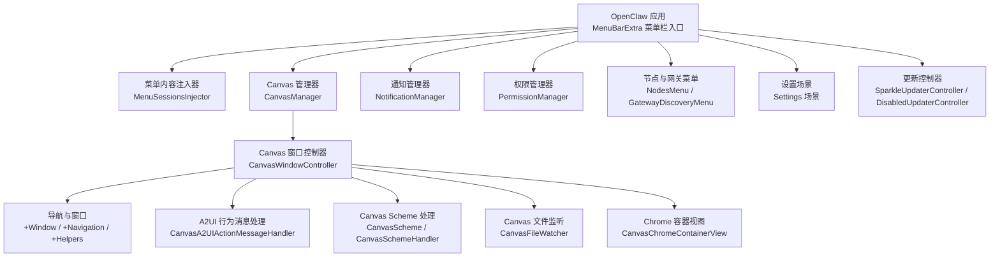
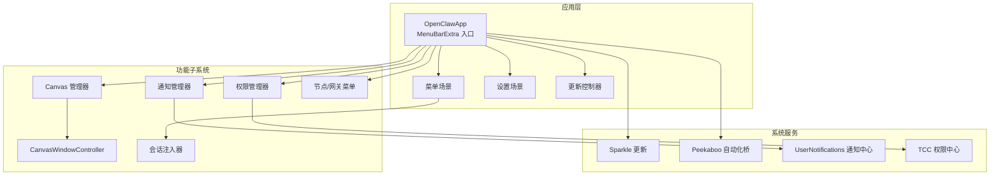
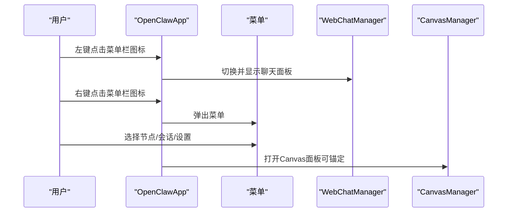
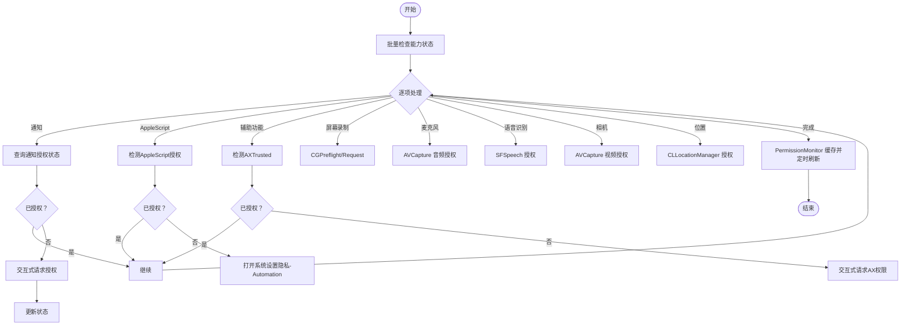
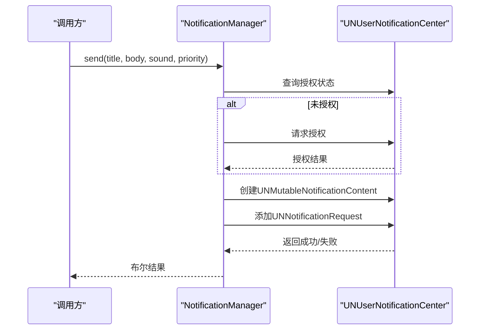
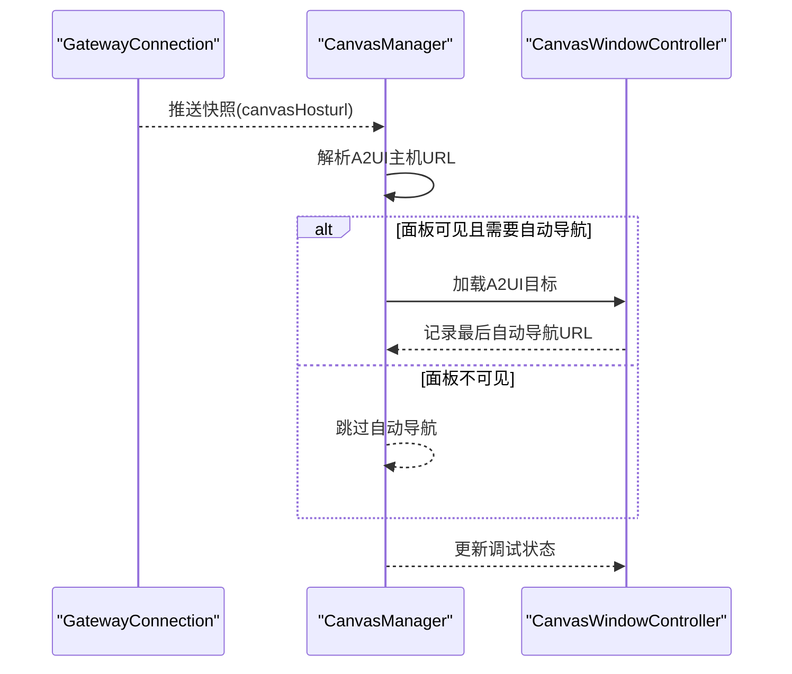
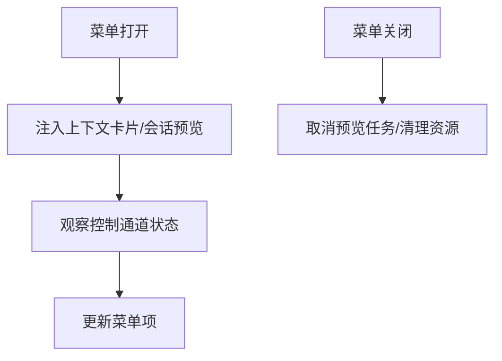
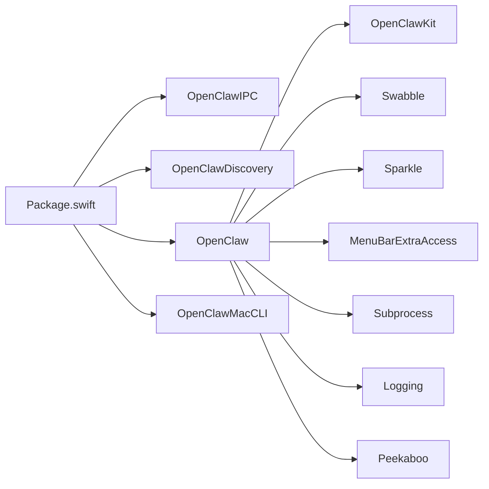

# 桌面应用

<cite>
**本文引用的文件**
- [apps/macos/README.md](file://apps/macos/README.md)
- [apps/macos/Package.swift](file://apps/macos/Package.swift)
- [apps/macos/Sources/OpenClaw/MenuBar.swift](file://apps/macos/Sources/OpenClaw/MenuBar.swift)
- [apps/macos/Sources/OpenClaw/PermissionManager.swift](file://apps/macos/Sources/OpenClaw/PermissionManager.swift)
- [apps/macos/Sources/OpenClaw/NotificationManager.swift](file://apps/macos/Sources/OpenClaw/NotificationManager.swift)
- [apps/macos/Sources/OpenClaw/CanvasManager.swift](file://apps/macos/Sources/OpenClaw/CanvasManager.swift)
- [apps/macos/Sources/OpenClaw/MenuSessionsInjector.swift](file://apps/macos/Sources/OpenClaw/MenuSessionsInjector.swift)
- [apps/macos/Sources/OpenClaw/MenuContextCardInjector.swift](file://apps/macos/Sources/OpenClaw/MenuContextCardInjector.swift)
- [apps/macos/Sources/OpenClaw/NodeMode/MacNodeRuntime.swift](file://apps/macos/Sources/OpenClaw/NodeMode/MacNodeRuntime.swift)
- [apps/macos/Sources/OpenClaw/CanvasWindowController.swift](file://apps/macos/Sources/OpenClaw/CanvasWindowController.swift)
- [apps/macos/Sources/OpenClaw/CanvasWindowController+Window.swift](file://apps/macos/Sources/OpenClaw/CanvasWindowController+Window.swift)
- [apps/macos/Sources/OpenClaw/CanvasWindowController+Navigation.swift](file://apps/macos/Sources/OpenClaw/CanvasWindowController+Navigation.swift)
- [apps/macos/Sources/OpenClaw/CanvasWindowController+Helpers.swift](file://apps/macos/Sources/OpenClaw/CanvasWindowController+Helpers.swift)
- [apps/macos/Sources/OpenClaw/CanvasWindowController+Testing.swift](file://apps/macos/Sources/OpenClaw/CanvasWindowController+Testing.swift)
- [apps/macos/Sources/OpenClaw/CanvasScheme.swift](file://apps/macos/Sources/OpenClaw/CanvasScheme.swift)
- [apps/macos/Sources/OpenClaw/CanvasSchemeHandler.swift](file://apps/macos/Sources/OpenClaw/CanvasSchemeHandler.swift)
- [apps/macos/Sources/OpenClaw/CanvasFileWatcher.swift](file://apps/macos/Sources/OpenClaw/CanvasFileWatcher.swift)
- [apps/macos/Sources/OpenClaw/CanvasChromeContainerView.swift](file://apps/macos/Sources/OpenClaw/CanvasChromeContainerView.swift)
- [apps/macos/Sources/OpenClaw/CanvasA2UIActionMessageHandler.swift](file://apps/macos/Sources/OpenClaw/CanvasA2UIActionMessageHandler.swift)
- [apps/macos/Sources/OpenClaw/NodesMenu.swift](file://apps/macos/Sources/OpenClaw/NodesMenu.swift)
- [apps/macos/Sources/OpenClaw/GatewayDiscoveryMenu.swift](file://apps/macos/Sources/OpenClaw/GatewayDiscoveryMenu.swift)
- [apps/macos/Sources/OpenClaw/MenuContentView.swift](file://apps/macos/Sources/OpenClaw/MenuContentView.swift)
- [apps/macos/Sources/OpenClaw/MenuHostedItem.swift](file://apps/macos/Sources/OpenClaw/MenuHostedItem.swift)
- [apps/macos/Sources/OpenClaw/MenuUsageHeaderView.swift](file://apps/macos/Sources/OpenClaw/MenuUsageHeaderView.swift)
- [apps/macos/Sources/OpenClaw/UsageMenuLabelView.swift](file://apps/macos/Sources/OpenClaw/UsageMenuLabelView.swift)
- [apps/macos/Sources/OpenClaw/CostUsageMenuView.swift](file://apps/macos/Sources/OpenClaw/CostUsageMenuView.swift)
- [apps/macos/Sources/OpenClaw/MenuSessionsInjector.swift](file://apps/macos/Sources/OpenClaw/MenuSessionsInjector.swift)
- [apps/macos/Sources/OpenClaw/MenuSessionsInjectorTests.swift](file://apps/macos/Sources/OpenClaw/MenuSessionsInjectorTests.swift)
- [apps/macos/Sources/OpenClaw/CanvasWindowSmokeTests.swift](file://apps/macos/Sources/OpenClaw/CanvasWindowSmokeTests.swift)
- [apps/macos/Sources/OpenClaw/CanvasFileWatcherTests.swift](file://apps/macos/Sources/OpenClaw/CanvasFileWatcherTests.swift)
- [apps/macos/Sources/OpenClaw/CanvasIPCTests.swift](file://apps/macos/Sources/OpenClaw/CanvasIPCTests.swift)
- [apps/macos/Sources/OpenClaw/MasterDiscoveryMenuSmokeTests.swift](file://apps/macos/Sources/OpenClaw/MasterDiscoveryMenuSmokeTests.swift)
- [apps/macos/Sources/OpenClaw/SessionMenuPreviewTests.swift](file://apps/macos/Sources/OpenClaw/SessionMenuPreviewTests.swift)
- [apps/macos/Sources/OpenClaw/CanvasWindowController+Testing.swift](file://apps/macos/Sources/OpenClaw/CanvasWindowController+Testing.swift)
- [apps/macos/Sources/OpenClaw/CanvasWindowController+Window.swift](file://apps/macos/Sources/OpenClaw/CanvasWindowController+Window.swift)
- [apps/macos/Sources/OpenClaw/CanvasWindowController+Navigation.swift](file://apps/macos/Sources/OpenClaw/CanvasWindowController+Navigation.swift)
- [apps/macos/Sources/OpenClaw/CanvasWindowController+Helpers.swift](file://apps/macos/Sources/OpenClaw/CanvasWindowController+Helpers.swift)
- [apps/macos/Sources/OpenClaw/CanvasWindowController+Testing.swift](file://apps/macos/Sources/OpenClaw/CanvasWindowController+Testing.swift)
- [apps/macos/Sources/OpenClaw/CanvasScheme.swift](file://apps/macos/Sources/OpenClaw/CanvasScheme.swift)
- [apps/macos/Sources/OpenClaw/CanvasSchemeHandler.swift](file://apps/macos/Sources/OpenClaw/CanvasSchemeHandler.swift)
- [apps/macos/Sources/OpenClaw/CanvasFileWatcher.swift](file://apps/macos/Sources/OpenClaw/CanvasFileWatcher.swift)
- [apps/macos/Sources/OpenClaw/CanvasChromeContainerView.swift](file://apps/macos/Sources/OpenClaw/CanvasChromeContainerView.swift)
- [apps/macos/Sources/OpenClaw/CanvasA2UIActionMessageHandler.swift](file://apps/macos/Sources/OpenClaw/CanvasA2UIActionMessageHandler.swift)
- [apps/macos/Sources/OpenClaw/NodesMenu.swift](file://apps/macos/Sources/OpenClaw/NodesMenu.swift)
- [apps/macos/Sources/OpenClaw/GatewayDiscoveryMenu.swift](file://apps/macos/Sources/OpenClaw/GatewayDiscoveryMenu.swift)
- [apps/macos/Sources/OpenClaw/MenuContentView.swift](file://apps/macos/Sources/OpenClaw/MenuContentView.swift)
- [apps/macos/Sources/OpenClaw/MenuHostedItem.swift](file://apps/macos/Sources/OpenClaw/MenuHostedItem.swift)
- [apps/macos/Sources/OpenClaw/MenuUsageHeaderView.swift](file://apps/macos/Sources/OpenClaw/MenuUsageHeaderView.swift)
- [apps/macos/Sources/OpenClaw/UsageMenuLabelView.swift](file://apps/macos/Sources/OpenClaw/UsageMenuLabelView.swift)
- [apps/macos/Sources/OpenClaw/CostUsageMenuView.swift](file://apps/macos/Sources/OpenClaw/CostUsageMenuView.swift)
- [apps/macos/Sources/OpenClaw/MenuSessionsInjector.swift](file://apps/macos/Sources/OpenClaw/MenuSessionsInjector.swift)
- [apps/macos/Sources/OpenClaw/MenuSessionsInjectorTests.swift](file://apps/macos/Sources/OpenClaw/MenuSessionsInjectorTests.swift)
- [apps/macos/Sources/OpenClaw/CanvasWindowSmokeTests.swift](file://apps/macos/Sources/OpenClaw/CanvasWindowSmokeTests.swift)
- [apps/macos/Sources/OpenClaw/CanvasFileWatcherTests.swift](file://apps/macos/Sources/OpenClaw/CanvasFileWatcherTests.swift)
- [apps/macos/Sources/OpenClaw/CanvasIPCTests.swift](file://apps/macos/Sources/OpenClaw/CanvasIPCTests.swift)
- [apps/macos/Sources/OpenClaw/MasterDiscoveryMenuSmokeTests.swift](file://apps/macos/Sources/OpenClaw/MasterDiscoveryMenuSmokeTests.swift)
- [apps/macos/Sources/OpenClaw/SessionMenuPreviewTests.swift](file://apps/macos/Sources/OpenClaw/SessionMenuPreviewTests.swift)
</cite>

## 目录

1. [简介](#简介)
2. [项目结构](#项目结构)
3. [核心组件](#核心组件)
4. [架构总览](#架构总览)
5. [组件详解](#组件详解)
6. [依赖关系分析](#依赖关系分析)
7. [性能考量](#性能考量)
8. [故障排查指南](#故障排查指南)
9. [结论](#结论)
10. [附录](#附录)

## 简介

本文件面向OpenClaw桌面应用（macOS），聚焦菜单栏控制、通知与提醒、权限系统与TCC管理、本地执行能力、Canvas控制与设备节点管理、配置与主题、用户体验优化、开发与调试、性能监控以及与系统服务的集成。文档以“渐进复杂度”方式组织，既适合非技术读者快速上手，也为开发者提供深入的实现细节与可操作指南。

## 项目结构

OpenClaw macOS应用位于apps/macos目录，采用Swift Package Manager组织多目标产物：菜单栏可执行程序、IPC库、发现库、CLI工具等，并通过SwiftUI构建菜单与设置界面，结合Sparkle进行更新，使用Peekaboo桥接自动化能力，集成OpenClawKit与Swabble等共享模块。

图表来源

- [apps/macos/Sources/OpenClaw/MenuBar.swift](file://apps/macos/Sources/OpenClaw/MenuBar.swift#L41-L92)
- [apps/macos/Sources/OpenClaw/CanvasManager.swift](file://apps/macos/Sources/OpenClaw/CanvasManager.swift#L1-L343)
- [apps/macos/Sources/OpenClaw/NotificationManager.swift](file://apps/macos/Sources/OpenClaw/NotificationManager.swift#L1-L67)
- [apps/macos/Sources/OpenClaw/PermissionManager.swift](file://apps/macos/Sources/OpenClaw/PermissionManager.swift#L1-L507)
- [apps/macos/Sources/OpenClaw/MenuSessionsInjector.swift](file://apps/macos/Sources/OpenClaw/MenuSessionsInjector.swift#L1-L119)
- [apps/macos/Sources/OpenClaw/CanvasWindowController.swift](file://apps/macos/Sources/OpenClaw/CanvasWindowController.swift)

章节来源

- [apps/macos/Package.swift](file://apps/macos/Package.swift#L1-L93)
- [apps/macos/README.md](file://apps/macos/README.md#L1-L65)

## 核心组件

- 菜单栏入口与场景：MenuBarExtra作为应用入口，绑定状态与外观；支持右键弹出菜单、悬停提示、面板切换等交互。
- 权限系统与TCC：统一管理通知、AppleScript、辅助功能、屏幕录制、麦克风、语音识别、相机、位置等权限，提供授权检查、请求与引导至系统设置。
- 通知与提醒：基于UNUserNotificationCenter发送横幅/提醒，支持优先级与时间敏感中断级别。
- Canvas 控制：在独立面板中承载Web内容或A2UI，支持锚定到菜单栏或鼠标、自动导航到网关提供的A2UI地址、快照与JS执行。
- 设备节点与网关：菜单中展示节点与网关发现结果，支持会话预览与上下文卡片注入。
- 设置与更新：设置场景窗口化，Sparkle按签名状态启用或禁用更新器。

章节来源

- [apps/macos/Sources/OpenClaw/MenuBar.swift](file://apps/macos/Sources/OpenClaw/MenuBar.swift#L1-L473)
- [apps/macos/Sources/OpenClaw/PermissionManager.swift](file://apps/macos/Sources/OpenClaw/PermissionManager.swift#L1-L507)
- [apps/macos/Sources/OpenClaw/NotificationManager.swift](file://apps/macos/Sources/OpenClaw/NotificationManager.swift#L1-L67)
- [apps/macos/Sources/OpenClaw/CanvasManager.swift](file://apps/macos/Sources/OpenClaw/CanvasManager.swift#L1-L343)
- [apps/macos/Sources/OpenClaw/MenuSessionsInjector.swift](file://apps/macos/Sources/OpenClaw/MenuSessionsInjector.swift#L1-L119)

## 架构总览

下图展示应用启动、菜单交互、权限与通知、Canvas渲染与A2UI联动、以及与系统服务（Sparkle、Peekaboo）的协作关系。

图表来源

- [apps/macos/Sources/OpenClaw/MenuBar.swift](file://apps/macos/Sources/OpenClaw/MenuBar.swift#L1-L473)
- [apps/macos/Sources/OpenClaw/PermissionManager.swift](file://apps/macos/Sources/OpenClaw/PermissionManager.swift#L1-L507)
- [apps/macos/Sources/OpenClaw/NotificationManager.swift](file://apps/macos/Sources/OpenClaw/NotificationManager.swift#L1-L67)
- [apps/macos/Sources/OpenClaw/CanvasManager.swift](file://apps/macos/Sources/OpenClaw/CanvasManager.swift#L1-L343)
- [apps/macos/Sources/OpenClaw/CanvasWindowController.swift](file://apps/macos/Sources/OpenClaw/CanvasWindowController.swift)

## 组件详解

### 菜单栏控制与交互

- 菜单栏图标状态与动画：根据运行状态、睡眠态、工作态、耳部增强等动态切换。
- 右键菜单：弹出完整菜单，左键点击打开聊天面板，悬停触发悬浮提示抑制策略。
- 连接模式与暂停：本地模式下暂停将激活/停止网关进程；远程模式下连接状态影响睡眠态判定。
- 设置场景：固定尺寸窗口，支持Tailscale服务环境注入。

图表来源

- [apps/macos/Sources/OpenClaw/MenuBar.swift](file://apps/macos/Sources/OpenClaw/MenuBar.swift#L134-L192)
- [apps/macos/Sources/OpenClaw/CanvasManager.swift](file://apps/macos/Sources/OpenClaw/CanvasManager.swift#L32-L114)

章节来源

- [apps/macos/Sources/OpenClaw/MenuBar.swift](file://apps/macos/Sources/OpenClaw/MenuBar.swift#L1-L473)

### 权限系统与TCC管理

- 支持能力：通知、AppleScript、辅助功能、屏幕录制、麦克风、语音识别、相机、位置。
- 授权流程：未授权时可交互请求；若被拒绝则引导至系统设置对应隐私页。
- 位置权限：支持“使用期间”和“始终”两种授权，必要时触发一次定位请求以提高提示可靠性。
- 监控：PermissionMonitor周期性轮询并缓存状态，避免频繁重复检查。

图表来源

- [apps/macos/Sources/OpenClaw/PermissionManager.swift](file://apps/macos/Sources/OpenClaw/PermissionManager.swift#L25-L227)
- [apps/macos/Sources/OpenClaw/PermissionManager.swift](file://apps/macos/Sources/OpenClaw/PermissionManager.swift#L421-L490)

章节来源

- [apps/macos/Sources/OpenClaw/PermissionManager.swift](file://apps/macos/Sources/OpenClaw/PermissionManager.swift#L1-L507)

### 通知与提醒机制

- 发送策略：若未授权先请求授权；根据优先级设置中断级别（被动/活动/时间敏感），时间敏感需具备相应entitlement。
- 错误处理：记录失败原因并返回布尔结果，便于调用方回退策略（如覆盖层提醒）。

图表来源

- [apps/macos/Sources/OpenClaw/NotificationManager.swift](file://apps/macos/Sources/OpenClaw/NotificationManager.swift#L17-L65)

章节来源

- [apps/macos/Sources/OpenClaw/NotificationManager.swift](file://apps/macos/Sources/OpenClaw/NotificationManager.swift#L1-L67)

### Canvas 控制与设备节点管理

- 会话与路径：支持按会话键打开Canvas，目标路径为空时默认进入欢迎页或根index；支持直接传入HTTP/HTTPS/FILE绝对路径。
- 锚定与放置：默认锚定鼠标，可替换为菜单栏按钮区域；支持首选放置策略。
- 自动导航A2UI：从网关快照中解析canvas host URL，拼接**openclaw**/a2ui/路径并自动跳转，避免重复导航。
- 调试状态：根据连接模式与控制通道状态更新调试面板标题/副标题。
- JS执行与截图：在可见面板内执行JavaScript与生成截图。
- 文件监听与A2UI动作：监听Canvas文件变化与接收A2UI动作消息，驱动UI行为。

图表来源

- [apps/macos/Sources/OpenClaw/CanvasManager.swift](file://apps/macos/Sources/OpenClaw/CanvasManager.swift#L142-L195)
- [apps/macos/Sources/OpenClaw/CanvasWindowController.swift](file://apps/macos/Sources/OpenClaw/CanvasWindowController.swift)

章节来源

- [apps/macos/Sources/OpenClaw/CanvasManager.swift](file://apps/macos/Sources/OpenClaw/CanvasManager.swift#L1-L343)
- [apps/macos/Sources/OpenClaw/CanvasWindowController.swift](file://apps/macos/Sources/OpenClaw/CanvasWindowController.swift)

### 节点与网关菜单、会话注入

- 会话注入器：在菜单打开时注入上下文卡片与会话预览，关闭时清理任务；观察控制通道状态变化以更新菜单。
- 上下文卡片：根据分隔符插入位置与菜单宽度，确保卡片与分隔符布局合理。
- 节点与网关：提供节点列表与网关发现菜单项，支持会话预览与头部信息展示。

图表来源

- [apps/macos/Sources/OpenClaw/MenuSessionsInjector.swift](file://apps/macos/Sources/OpenClaw/MenuSessionsInjector.swift#L94-L119)
- [apps/macos/Sources/OpenClaw/MenuContextCardInjector.swift](file://apps/macos/Sources/OpenClaw/MenuContextCardInjector.swift#L164-L192)

章节来源

- [apps/macos/Sources/OpenClaw/MenuSessionsInjector.swift](file://apps/macos/Sources/OpenClaw/MenuSessionsInjector.swift#L1-L119)
- [apps/macos/Sources/OpenClaw/MenuContextCardInjector.swift](file://apps/macos/Sources/OpenClaw/MenuContextCardInjector.swift#L1-L192)

### 高级设置与主题

- 主题同步：前端设置宿主将主题与系统偏好联动，支持监听媒体查询变化并应用解析后的主题值。
- 基础路径推断：根据全局变量或当前路径推断控制UI基础路径，保证跨平台一致性。

章节来源

- [ui/src/ui/app-settings.ts](file://ui/src/ui/app-settings.ts#L256-L317)

### 开发指南与打包

- 快速开发运行：提供重启脚本与签名开关，支持无签名开发与强制签名。
- 打包与签名：生成OpenClaw.app并签名，校验Team ID一致性，可选禁用库验证以缓解Sparkle加载问题。
- 环境变量：允许指定签名身份、是否允许ad-hoc签名、关闭签名时间戳、禁用库验证、跳过Team ID审计等。

章节来源

- [apps/macos/README.md](file://apps/macos/README.md#L1-L65)

## 依赖关系分析

- 包依赖：MenuBarExtraAccess、Subprocess、Logging、Sparkle、Peekaboo、OpenClawKit、Swabble。
- 目标产物：OpenClawIPC、OpenClawDiscovery、OpenClaw（菜单栏应用）、OpenClawMacCLI（命令行工具）。
- 测试目标：OpenClawIPCTests，覆盖菜单、Canvas、文件监听等关键路径。

图表来源

- [apps/macos/Package.swift](file://apps/macos/Package.swift#L17-L57)

章节来源

- [apps/macos/Package.swift](file://apps/macos/Package.swift#L1-L93)

## 性能考量

- 菜单与面板交互：通过最小检查间隔与观察者模式减少无效刷新；面板可见性变更回调仅在必要时触发。
- Canvas导航：自动导航仅在目标URL变化时执行，避免重复加载；文件监听与A2UI动作处理异步化。
- 权限监控：PermissionMonitor限制检查频率，避免频繁TCC查询。
- 更新器：仅在开发者ID签名的应用中启用Sparkle，避免未签名构建产生对话框干扰。

章节来源

- [apps/macos/Sources/OpenClaw/PermissionManager.swift](file://apps/macos/Sources/OpenClaw/PermissionManager.swift#L421-L490)
- [apps/macos/Sources/OpenClaw/CanvasManager.swift](file://apps/macos/Sources/OpenClaw/CanvasManager.swift#L142-L195)
- [apps/macos/Sources/OpenClaw/MenuBar.swift](file://apps/macos/Sources/OpenClaw/MenuBar.swift#L456-L466)

## 故障排查指南

- 通知不显示：检查通知授权状态；若被拒，调用方应回退到覆盖层提醒；确认时间敏感通知所需entitlement。
- 权限被拒：根据具体能力调用相应Helper打开系统设置隐私页；位置权限建议触发一次定位请求以提升提示成功率。
- Canvas无法打开：确认会话键有效、目标路径存在或为合法URL；检查调试状态与连接模式；尝试显式导航到根路径。
- 自动导航未生效：确认网关快照中的canvas host URL有效且可解析；检查面板可见性与上次自动导航URL。
- Sparkle加载失败：在开发阶段可启用禁用库验证；生产构建建议保持默认并确保Team ID一致。

章节来源

- [apps/macos/Sources/OpenClaw/NotificationManager.swift](file://apps/macos/Sources/OpenClaw/NotificationManager.swift#L17-L65)
- [apps/macos/Sources/OpenClaw/PermissionManager.swift](file://apps/macos/Sources/OpenClaw/PermissionManager.swift#L230-L288)
- [apps/macos/Sources/OpenClaw/CanvasManager.swift](file://apps/macos/Sources/OpenClaw/CanvasManager.swift#L142-L195)
- [apps/macos/README.md](file://apps/macos/README.md#L47-L56)

## 结论

OpenClaw macOS应用以菜单栏为核心入口，围绕权限、通知、Canvas与节点/网关管理构建了完整的本地与远程协同体验。通过严格的TCC管理、灵活的通知策略、可锚定的Canvas面板与自动化的A2UI导航，应用在安全性与可用性之间取得平衡。配合Sparkle与Peekaboo，系统服务集成完善，开发与发布流程清晰可控。

## 附录

- 开发与调试：利用菜单栏图标交互、设置场景、日志与调试面板快速定位问题；Canvas支持JS执行与截图便于前端调试。
- 性能监控：关注菜单与面板的可见性回调、权限轮询频率、Canvas导航与文件监听的异步化处理。
- 配置与主题：前端设置宿主与系统主题联动，基础路径推断保证跨平台一致性。
