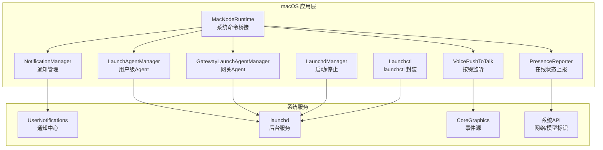
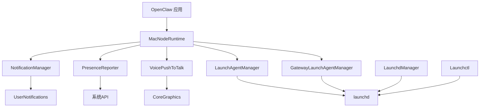
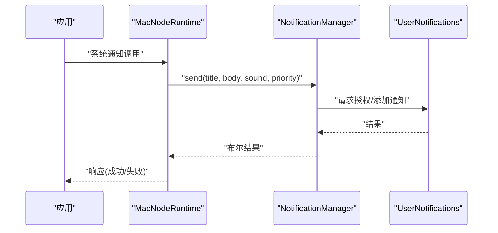
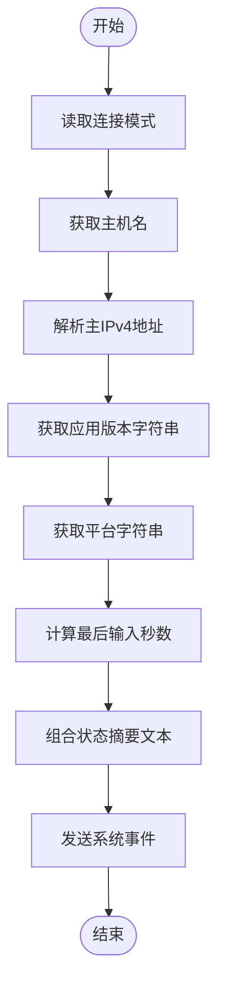
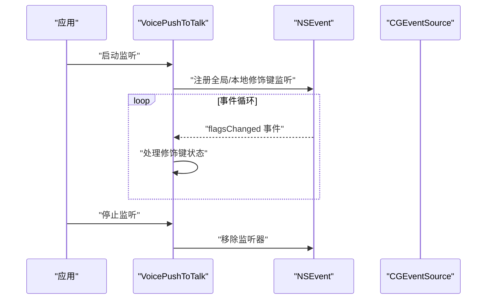
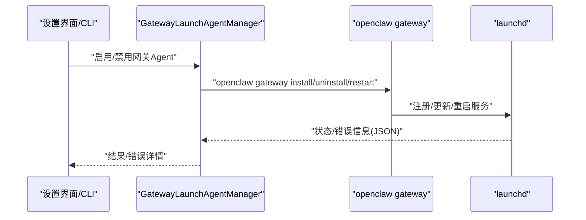
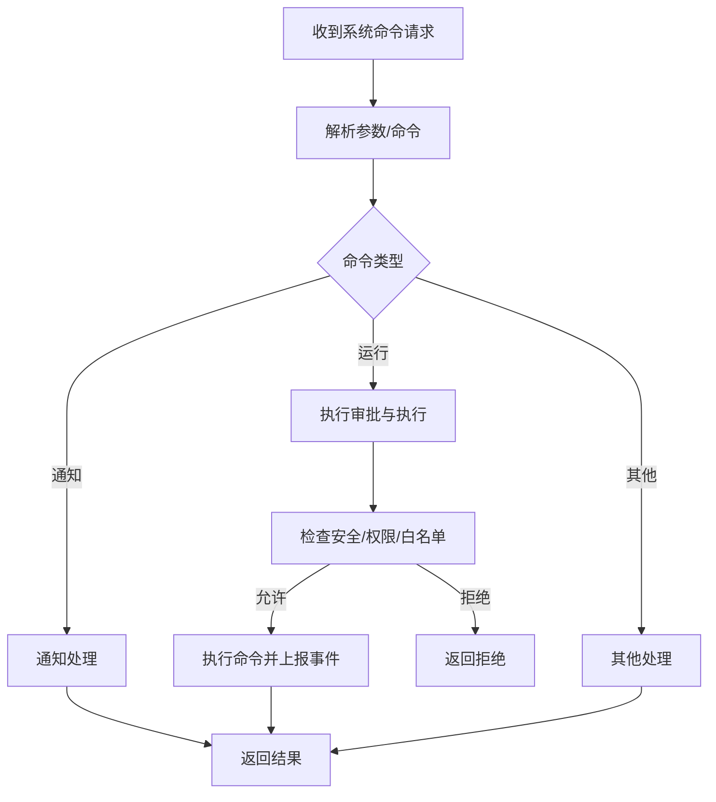
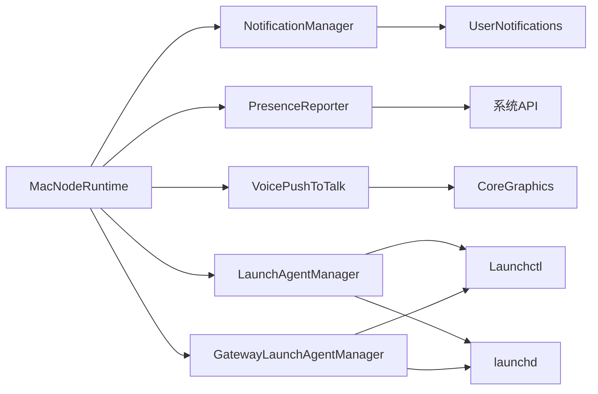

# 系统集成

<cite>
**本文引用的文件**
- [apps/macos/Sources/OpenClaw/NodeMode/MacNodeRuntime.swift](file://apps/macos/Sources/OpenClaw/NodeMode/MacNodeRuntime.swift)
- [apps/macos/Sources/OpenClaw/NotificationManager.swift](file://apps/macos/Sources/OpenClaw/NotificationManager.swift)
- [apps/macos/Sources/OpenClaw/PresenceReporter.swift](file://apps/macos/Sources/OpenClaw/PresenceReporter.swift)
- [apps/macos/Sources/OpenClaw/VoicePushToTalk.swift](file://apps/macos/Sources/OpenClaw/VoicePushToTalk.swift)
- [apps/macos/Sources/OpenClaw/LaunchAgentManager.swift](file://apps/macos/Sources/OpenClaw/LaunchAgentManager.swift)
- [apps/macos/Sources/OpenClaw/GatewayLaunchAgentManager.swift](file://apps/macos/Sources/OpenClaw/GatewayLaunchAgentManager.swift)
- [apps/macos/Sources/OpenClaw/Launchctl.swift](file://apps/macos/Sources/OpenClaw/Launchctl.swift)
- [apps/macos/Sources/OpenClaw/LaunchdManager.swift](file://apps/macos/Sources/OpenClaw/LaunchdManager.swift)
- [apps/macos/Tests/OpenClawIPCTests/MacNodeRuntimeTests.swift](file://apps/macos/Tests/OpenClawIPCTests/MacNodeRuntimeTests.swift)
- [src/daemon/launchd.ts](file://src/daemon/launchd.ts)
- [src/infra/system-presence.ts](file://src/infra/system-presence.ts)
- [apps/shared/OpenClawKit/Sources/OpenClawKit/InstanceIdentity.swift](file://apps/shared/OpenClawKit/Sources/OpenClawKit/InstanceIdentity.swift)
</cite>

## 目录

1. [简介](#简介)
2. [项目结构](#项目结构)
3. [核心组件](#核心组件)
4. [架构总览](#架构总览)
5. [详细组件分析](#详细组件分析)
6. [依赖关系分析](#依赖关系分析)
7. [性能考量](#性能考量)
8. [故障排查指南](#故障排查指南)
9. [结论](#结论)
10. [附录](#附录)

## 简介

本文件面向OpenClaw在macOS平台的系统集成功能，围绕应用与系统服务的集成、系统事件监听与系统API调用进行深入说明。内容覆盖系统托盘集成、通知中心支持、后台服务管理（launchd）、自动启动配置、系统偏好设置与系统级配置、系统兼容性与版本适配、系统更新处理、系统监控与性能指标、资源使用情况以及系统安全与权限验证等主题。文档以代码为依据，辅以可视化图示帮助读者理解整体架构与关键流程。

## 项目结构

OpenClaw的macOS系统集成主要分布在以下模块：

- 节点运行时与系统命令桥接：负责接收并执行系统相关命令（如通知、运行命令、执行审批等）
- 通知管理器：封装UNUserNotificationCenter的授权与发送逻辑
- 在线状态上报：周期性上报设备信息、网络状态、输入空闲时间等
- 语音按键（Push-to-Talk）：通过NSEvent监听修饰键变化实现全局/本地事件监听
- 后台服务管理：通过launchd管理应用自启动与守护进程（Gateway）
- 系统环境与版本：提供实例标识、模型标识、版本解析等能力

图表来源

- [apps/macos/Sources/OpenClaw/NodeMode/MacNodeRuntime.swift](file://apps/macos/Sources/OpenClaw/NodeMode/MacNodeRuntime.swift#L31-L77)
- [apps/macos/Sources/OpenClaw/NotificationManager.swift](file://apps/macos/Sources/OpenClaw/NotificationManager.swift#L17-L65)
- [apps/macos/Sources/OpenClaw/PresenceReporter.swift](file://apps/macos/Sources/OpenClaw/PresenceReporter.swift#L15-L58)
- [apps/macos/Sources/OpenClaw/VoicePushToTalk.swift](file://apps/macos/Sources/OpenClaw/VoicePushToTalk.swift#L39-L69)
- [apps/macos/Sources/OpenClaw/LaunchAgentManager.swift](file://apps/macos/Sources/OpenClaw/LaunchAgentManager.swift#L9-L26)
- [apps/macos/Sources/OpenClaw/GatewayLaunchAgentManager.swift](file://apps/macos/Sources/OpenClaw/GatewayLaunchAgentManager.swift#L53-L78)
- [apps/macos/Sources/OpenClaw/Launchctl.swift](file://apps/macos/Sources/OpenClaw/Launchctl.swift#L9-L26)
- [apps/macos/Sources/OpenClaw/LaunchdManager.swift](file://apps/macos/Sources/OpenClaw/LaunchdManager.swift#L11-L19)

章节来源

- [apps/macos/Sources/OpenClaw/NodeMode/MacNodeRuntime.swift](file://apps/macos/Sources/OpenClaw/NodeMode/MacNodeRuntime.swift#L31-L77)
- [apps/macos/Sources/OpenClaw/NotificationManager.swift](file://apps/macos/Sources/OpenClaw/NotificationManager.swift#L17-L65)
- [apps/macos/Sources/OpenClaw/PresenceReporter.swift](file://apps/macos/Sources/OpenClaw/PresenceReporter.swift#L15-L58)
- [apps/macos/Sources/OpenClaw/VoicePushToTalk.swift](file://apps/macos/Sources/OpenClaw/VoicePushToTalk.swift#L39-L69)
- [apps/macos/Sources/OpenClaw/LaunchAgentManager.swift](file://apps/macos/Sources/OpenClaw/LaunchAgentManager.swift#L9-L26)
- [apps/macos/Sources/OpenClaw/GatewayLaunchAgentManager.swift](file://apps/macos/Sources/OpenClaw/GatewayLaunchAgentManager.swift#L53-L78)
- [apps/macos/Sources/OpenClaw/Launchctl.swift](file://apps/macos/Sources/OpenClaw/Launchctl.swift#L9-L26)
- [apps/macos/Sources/OpenClaw/LaunchdManager.swift](file://apps/macos/Sources/OpenClaw/LaunchdManager.swift#L11-L19)

## 核心组件

- 系统命令桥接（MacNodeRuntime）：统一处理系统相关命令，包括通知、运行命令、执行审批、屏幕录制、摄像头、位置、A2UI等。
- 通知管理器（NotificationManager）：封装通知授权、优先级与中断级别、声音、时间敏感权限检查。
- 在线状态上报（PresenceReporter）：周期性上报主机名、IP、版本、平台、最后输入时间等。
- 语音按键监听（VoicePushToTalk）：监听全局与本地修饰键变化，实现按键触发。
- 后台服务管理（LaunchAgentManager/GatewayLaunchAgentManager/Launchctl/LaunchdManager）：管理用户级与网关级launchd任务，支持启用/禁用、重启、状态查询与日志路径解析。
- 实例标识（InstanceIdentity）：提供实例ID、显示名称、模型标识等，用于系统监控与上报。

章节来源

- [apps/macos/Sources/OpenClaw/NodeMode/MacNodeRuntime.swift](file://apps/macos/Sources/OpenClaw/NodeMode/MacNodeRuntime.swift#L31-L77)
- [apps/macos/Sources/OpenClaw/NotificationManager.swift](file://apps/macos/Sources/OpenClaw/NotificationManager.swift#L17-L65)
- [apps/macos/Sources/OpenClaw/PresenceReporter.swift](file://apps/macos/Sources/OpenClaw/PresenceReporter.swift#L15-L58)
- [apps/macos/Sources/OpenClaw/VoicePushToTalk.swift](file://apps/macos/Sources/OpenClaw/VoicePushToTalk.swift#L39-L69)
- [apps/macos/Sources/OpenClaw/LaunchAgentManager.swift](file://apps/macos/Sources/OpenClaw/LaunchAgentManager.swift#L9-L26)
- [apps/macos/Sources/OpenClaw/GatewayLaunchAgentManager.swift](file://apps/macos/Sources/OpenClaw/GatewayLaunchAgentManager.swift#L53-L78)
- [apps/macos/Sources/OpenClaw/Launchctl.swift](file://apps/macos/Sources/OpenClaw/Launchctl.swift#L9-L26)
- [apps/macos/Sources/OpenClaw/LaunchdManager.swift](file://apps/macos/Sources/OpenClaw/LaunchdManager.swift#L11-L19)
- [apps/shared/OpenClawKit/Sources/OpenClawKit/InstanceIdentity.swift](file://apps/shared/OpenClawKit/Sources/OpenClawKit/InstanceIdentity.swift#L35-L70)

## 架构总览

下图展示OpenClaw在macOS上的系统集成架构：应用通过节点运行时接收系统命令；通知由通知管理器处理；在线状态由状态上报器周期性推送；后台服务由launchd管理；语音按键监听来自系统事件源；实例标识与系统API提供设备与版本信息。

图表来源

- [apps/macos/Sources/OpenClaw/NodeMode/MacNodeRuntime.swift](file://apps/macos/Sources/OpenClaw/NodeMode/MacNodeRuntime.swift#L31-L77)
- [apps/macos/Sources/OpenClaw/NotificationManager.swift](file://apps/macos/Sources/OpenClaw/NotificationManager.swift#L17-L65)
- [apps/macos/Sources/OpenClaw/PresenceReporter.swift](file://apps/macos/Sources/OpenClaw/PresenceReporter.swift#L15-L58)
- [apps/macos/Sources/OpenClaw/VoicePushToTalk.swift](file://apps/macos/Sources/OpenClaw/VoicePushToTalk.swift#L39-L69)
- [apps/macos/Sources/OpenClaw/LaunchAgentManager.swift](file://apps/macos/Sources/OpenClaw/LaunchAgentManager.swift#L9-L26)
- [apps/macos/Sources/OpenClaw/GatewayLaunchAgentManager.swift](file://apps/macos/Sources/OpenClaw/GatewayLaunchAgentManager.swift#L53-L78)
- [apps/macos/Sources/OpenClaw/Launchctl.swift](file://apps/macos/Sources/OpenClaw/Launchctl.swift#L9-L26)
- [apps/macos/Sources/OpenClaw/LaunchdManager.swift](file://apps/macos/Sources/OpenClaw/LaunchdManager.swift#L11-L19)

## 详细组件分析

### 通知系统与系统API调用

- 授权与发送：通知管理器通过UNUserNotificationCenter请求授权，根据优先级设置中断级别，并在无时间敏感权限时回退到活跃级别。
- 交付策略：支持系统通知、覆盖层弹窗与自动回退策略。
- 错误处理：记录失败原因并返回相应错误码。

图表来源

- [apps/macos/Sources/OpenClaw/NodeMode/MacNodeRuntime.swift](file://apps/macos/Sources/OpenClaw/NodeMode/MacNodeRuntime.swift#L797-L834)
- [apps/macos/Sources/OpenClaw/NotificationManager.swift](file://apps/macos/Sources/OpenClaw/NotificationManager.swift#L17-L65)

章节来源

- [apps/macos/Sources/OpenClaw/NodeMode/MacNodeRuntime.swift](file://apps/macos/Sources/OpenClaw/NodeMode/MacNodeRuntime.swift#L797-L834)
- [apps/macos/Sources/OpenClaw/NotificationManager.swift](file://apps/macos/Sources/OpenClaw/NotificationManager.swift#L17-L65)

### 在线状态与系统监控

- 周期性上报：PresenceReporter以固定间隔推送设备信息、版本、平台、最后输入秒数等。
- 数据来源：从Bundle与系统API获取版本与平台信息；通过CGEventSource计算最近输入时间；通过网络接口枚举获取主IPv4地址。
- 异常处理：对不可用或异常值进行保护性返回。

图表来源

- [apps/macos/Sources/OpenClaw/PresenceReporter.swift](file://apps/macos/Sources/OpenClaw/PresenceReporter.swift#L32-L58)
- [apps/macos/Sources/OpenClaw/PresenceReporter.swift](file://apps/macos/Sources/OpenClaw/PresenceReporter.swift#L90-L133)

章节来源

- [apps/macos/Sources/OpenClaw/PresenceReporter.swift](file://apps/macos/Sources/OpenClaw/PresenceReporter.swift#L15-L58)
- [apps/macos/Sources/OpenClaw/PresenceReporter.swift](file://apps/macos/Sources/OpenClaw/PresenceReporter.swift#L90-L133)
- [apps/shared/OpenClawKit/Sources/OpenClawKit/InstanceIdentity.swift](file://apps/shared/OpenClawKit/Sources/OpenClawKit/InstanceIdentity.swift#L35-L70)

### 语音按键（Push-to-Talk）与系统事件监听

- 全局与本地监听：同时注册全局与本地事件监听，确保焦点切换时仍可捕获修饰键变化。
- 状态维护：记录Option键状态与激活状态，清理时移除监听器并复位状态。
- 权限依赖：依赖“输入监控”权限以接收事件。

图表来源

- [apps/macos/Sources/OpenClaw/VoicePushToTalk.swift](file://apps/macos/Sources/OpenClaw/VoicePushToTalk.swift#L39-L69)

章节来源

- [apps/macos/Sources/OpenClaw/VoicePushToTalk.swift](file://apps/macos/Sources/OpenClaw/VoicePushToTalk.swift#L39-L69)

### 后台服务管理与自动启动

- 用户级Agent：LaunchAgentManager负责写入/删除LaunchAgents目录下的plist，使用launchctl进行bootout/bootstrap/kickstart。
- 网关Agent：GatewayLaunchAgentManager通过openclaw gateway子命令安装/卸载/重启网关守护进程，支持远程模式跳过修改。
- launchctl封装：Launchctl提供异步执行launchctl并返回状态与输出。
- 启动/停止：LaunchdManager直接调用launchctl kickstart/stop。

图表来源

- [apps/macos/Sources/OpenClaw/GatewayLaunchAgentManager.swift](file://apps/macos/Sources/OpenClaw/GatewayLaunchAgentManager.swift#L53-L78)
- [apps/macos/Sources/OpenClaw/GatewayLaunchAgentManager.swift](file://apps/macos/Sources/OpenClaw/GatewayLaunchAgentManager.swift#L132-L175)
- [apps/macos/Sources/OpenClaw/LaunchAgentManager.swift](file://apps/macos/Sources/OpenClaw/LaunchAgentManager.swift#L15-L26)
- [apps/macos/Sources/OpenClaw/Launchctl.swift](file://apps/macos/Sources/OpenClaw/Launchctl.swift#L9-L26)
- [apps/macos/Sources/OpenClaw/LaunchdManager.swift](file://apps/macos/Sources/OpenClaw/LaunchdManager.swift#L11-L19)

章节来源

- [apps/macos/Sources/OpenClaw/LaunchAgentManager.swift](file://apps/macos/Sources/OpenClaw/LaunchAgentManager.swift#L9-L26)
- [apps/macos/Sources/OpenClaw/GatewayLaunchAgentManager.swift](file://apps/macos/Sources/OpenClaw/GatewayLaunchAgentManager.swift#L53-L78)
- [apps/macos/Sources/OpenClaw/Launchctl.swift](file://apps/macos/Sources/OpenClaw/Launchctl.swift#L9-L26)
- [apps/macos/Sources/OpenClaw/LaunchdManager.swift](file://apps/macos/Sources/OpenClaw/LaunchdManager.swift#L11-L19)
- [src/daemon/launchd.ts](file://src/daemon/launchd.ts#L234-L305)

### 系统命令桥接与执行审批

- 命令分发：MacNodeRuntime根据命令前缀分派至不同处理函数（Canvas/A2UI/Camera/Location/Screen/系统命令）。
- 执行审批：系统运行命令涉及安全策略（deny/allowlist）、用户询问、技能白名单、屏幕录制权限等，最终通过ShellExecutor执行并上报事件。
- 错误与回退：对空参数、权限不足、超时等情况返回明确错误码与消息。

图表来源

- [apps/macos/Sources/OpenClaw/NodeMode/MacNodeRuntime.swift](file://apps/macos/Sources/OpenClaw/NodeMode/MacNodeRuntime.swift#L31-L77)
- [apps/macos/Sources/OpenClaw/NodeMode/MacNodeRuntime.swift](file://apps/macos/Sources/OpenClaw/NodeMode/MacNodeRuntime.swift#L438-L598)
- [apps/macos/Sources/OpenClaw/NodeMode/MacNodeRuntime.swift](file://apps/macos/Sources/OpenClaw/NodeMode/MacNodeRuntime.swift#L645-L719)

章节来源

- [apps/macos/Sources/OpenClaw/NodeMode/MacNodeRuntime.swift](file://apps/macos/Sources/OpenClaw/NodeMode/MacNodeRuntime.swift#L31-L77)
- [apps/macos/Sources/OpenClaw/NodeMode/MacNodeRuntime.swift](file://apps/macos/Sources/OpenClaw/NodeMode/MacNodeRuntime.swift#L438-L598)
- [apps/macos/Sources/OpenClaw/NodeMode/MacNodeRuntime.swift](file://apps/macos/Sources/OpenClaw/NodeMode/MacNodeRuntime.swift#L645-L719)

### 系统兼容性、版本适配与系统更新处理

- 版本解析：轻量SemVer解析，支持去除前缀与预发布后缀，用于兼容性判断。
- 平台信息：从Bundle与系统API获取版本与平台信息，用于上报与诊断。
- 更新处理：通过CLI或守护进程命令进行安装/卸载/重启，避免直接修改plist导致的崩溃风险。

章节来源

- [apps/macos/Sources/OpenClaw/GatewayEnvironment.swift](file://apps/macos/Sources/OpenClaw/GatewayEnvironment.swift#L6-L36)
- [apps/macos/Sources/OpenClaw/PresenceReporter.swift](file://apps/macos/Sources/OpenClaw/PresenceReporter.swift#L74-L88)
- [apps/macos/Sources/OpenClaw/GatewayLaunchAgentManager.swift](file://apps/macos/Sources/OpenClaw/GatewayLaunchAgentManager.swift#L53-L78)

### 系统安全、权限验证与合规性

- 通知权限：首次请求授权，若未授权则返回不可用。
- 时间敏感通知：仅在具备entitlement时启用，否则回退到活跃级别。
- 输入监控：语音按键依赖该权限以接收全局/本地事件。
- 执行审批：deny/allowlist策略、用户询问、技能白名单、屏幕录制权限检查，所有决策均记录事件以便审计。
- 测试覆盖：单元测试验证空通知参数、相机功能开关等边界条件。

章节来源

- [apps/macos/Sources/OpenClaw/NotificationManager.swift](file://apps/macos/Sources/OpenClaw/NotificationManager.swift#L17-L65)
- [apps/macos/Sources/OpenClaw/VoicePushToTalk.swift](file://apps/macos/Sources/OpenClaw/VoicePushToTalk.swift#L39-L69)
- [apps/macos/Sources/OpenClaw/NodeMode/MacNodeRuntime.swift](file://apps/macos/Sources/OpenClaw/NodeMode/MacNodeRuntime.swift#L473-L550)
- [apps/macos/Tests/OpenClawIPCTests/MacNodeRuntimeTests.swift](file://apps/macos/Tests/OpenClawIPCTests/MacNodeRuntimeTests.swift#L33-L50)

## 依赖关系分析

- 组件耦合：MacNodeRuntime作为门面，依赖通知、状态上报、语音按键、后台服务管理等模块；后台服务管理模块依赖launchctl与系统launchd。
- 外部依赖：UserNotifications、CoreGraphics、系统网络接口、launchctl。
- 潜在环路：当前模块间为单向依赖，无明显循环。

图表来源

- [apps/macos/Sources/OpenClaw/NodeMode/MacNodeRuntime.swift](file://apps/macos/Sources/OpenClaw/NodeMode/MacNodeRuntime.swift#L31-L77)
- [apps/macos/Sources/OpenClaw/NotificationManager.swift](file://apps/macos/Sources/OpenClaw/NotificationManager.swift#L17-L65)
- [apps/macos/Sources/OpenClaw/PresenceReporter.swift](file://apps/macos/Sources/OpenClaw/PresenceReporter.swift#L15-L58)
- [apps/macos/Sources/OpenClaw/VoicePushToTalk.swift](file://apps/macos/Sources/OpenClaw/VoicePushToTalk.swift#L39-L69)
- [apps/macos/Sources/OpenClaw/LaunchAgentManager.swift](file://apps/macos/Sources/OpenClaw/LaunchAgentManager.swift#L9-L26)
- [apps/macos/Sources/OpenClaw/GatewayLaunchAgentManager.swift](file://apps/macos/Sources/OpenClaw/GatewayLaunchAgentManager.swift#L53-L78)
- [apps/macos/Sources/OpenClaw/Launchctl.swift](file://apps/macos/Sources/OpenClaw/Launchctl.swift#L9-L26)

章节来源

- [apps/macos/Sources/OpenClaw/NodeMode/MacNodeRuntime.swift](file://apps/macos/Sources/OpenClaw/NodeMode/MacNodeRuntime.swift#L31-L77)
- [apps/macos/Sources/OpenClaw/NotificationManager.swift](file://apps/macos/Sources/OpenClaw/NotificationManager.swift#L17-L65)
- [apps/macos/Sources/OpenClaw/PresenceReporter.swift](file://apps/macos/Sources/OpenClaw/PresenceReporter.swift#L15-L58)
- [apps/macos/Sources/OpenClaw/VoicePushToTalk.swift](file://apps/macos/Sources/OpenClaw/VoicePushToTalk.swift#L39-L69)
- [apps/macos/Sources/OpenClaw/LaunchAgentManager.swift](file://apps/macos/Sources/OpenClaw/LaunchAgentManager.swift#L9-L26)
- [apps/macos/Sources/OpenClaw/GatewayLaunchAgentManager.swift](file://apps/macos/Sources/OpenClaw/GatewayLaunchAgentManager.swift#L53-L78)
- [apps/macos/Sources/OpenClaw/Launchctl.swift](file://apps/macos/Sources/OpenClaw/Launchctl.swift#L9-L26)

## 性能考量

- 通知发送：异步授权与发送，避免阻塞主线程；失败时记录日志便于定位。
- 状态上报：固定间隔上报，避免过于频繁；对异常值进行保护性处理。
- 语音按键：事件监听在主线程中注册/移除，避免重复监听；按键状态变更时及时清理。
- 后台服务：通过launchctl异步执行，避免阻塞UI；对错误输出进行截断与汇总，减少日志噪音。
- 执行审批：对命令执行设置超时与输出截断，防止长时间阻塞与内存膨胀。

## 故障排查指南

- 通知未显示：检查通知权限是否已授权；确认时间敏感权限是否满足；查看日志中的错误信息。
- 无法运行命令：检查安全策略（deny/allowlist）、用户询问、技能白名单与屏幕录制权限；查看事件上报中的拒绝原因。
- 自启动问题：检查LaunchAgents目录下plist是否存在；使用launchctl打印状态；必要时重新bootstrap/kickstart。
- 网关服务异常：通过openclaw gateway命令查看状态与错误；检查守护进程日志路径；必要时重启服务。
- 在线状态不更新：确认网络接口枚举是否成功；检查Bundle版本信息；验证CGEventSource是否可用。

章节来源

- [apps/macos/Sources/OpenClaw/NotificationManager.swift](file://apps/macos/Sources/OpenClaw/NotificationManager.swift#L17-L65)
- [apps/macos/Sources/OpenClaw/NodeMode/MacNodeRuntime.swift](file://apps/macos/Sources/OpenClaw/NodeMode/MacNodeRuntime.swift#L473-L550)
- [apps/macos/Sources/OpenClaw/LaunchAgentManager.swift](file://apps/macos/Sources/OpenClaw/LaunchAgentManager.swift#L9-L26)
- [apps/macos/Sources/OpenClaw/GatewayLaunchAgentManager.swift](file://apps/macos/Sources/OpenClaw/GatewayLaunchAgentManager.swift#L132-L175)
- [apps/macos/Sources/OpenClaw/PresenceReporter.swift](file://apps/macos/Sources/OpenClaw/PresenceReporter.swift#L15-L58)

## 结论

OpenClaw在macOS上的系统集成功能覆盖通知、事件监听、后台服务管理、执行审批与系统监控等多个方面。通过清晰的模块划分与严格的权限控制，系统在保证安全性的同时提供了良好的用户体验。建议在生产环境中持续关注权限变化、launchd状态与通知授权状态，并结合事件上报与日志进行监控与排障。

## 附录

- 系统环境与版本：参考实例标识与平台字符串生成逻辑，确保上报数据准确。
- 远程模式：在远程模式下跳过某些launchd操作，避免冲突。
- 日志路径：通过LaunchAgentPlist快照解析stdout/stderr路径，便于定位问题。

章节来源

- [apps/shared/OpenClawKit/Sources/OpenClawKit/InstanceIdentity.swift](file://apps/shared/OpenClawKit/Sources/OpenClawKit/InstanceIdentity.swift#L35-L70)
- [apps/macos/Sources/OpenClaw/GatewayLaunchAgentManager.swift](file://apps/macos/Sources/OpenClaw/GatewayLaunchAgentManager.swift#L55-L58)
- [apps/macos/Sources/OpenClaw/Launchctl.swift](file://apps/macos/Sources/OpenClaw/Launchctl.swift#L41-L73)
- [src/infra/system-presence.ts](file://src/infra/system-presence.ts#L1-L65)
