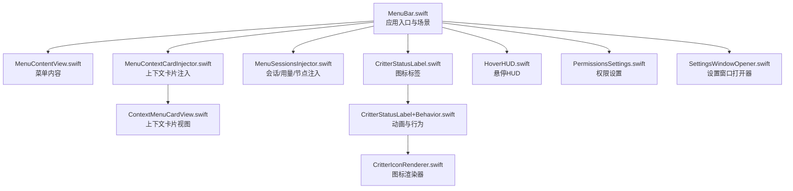
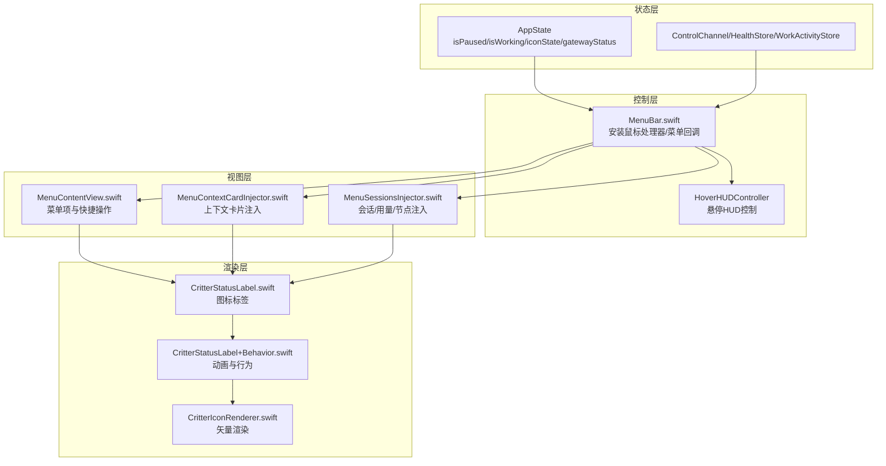
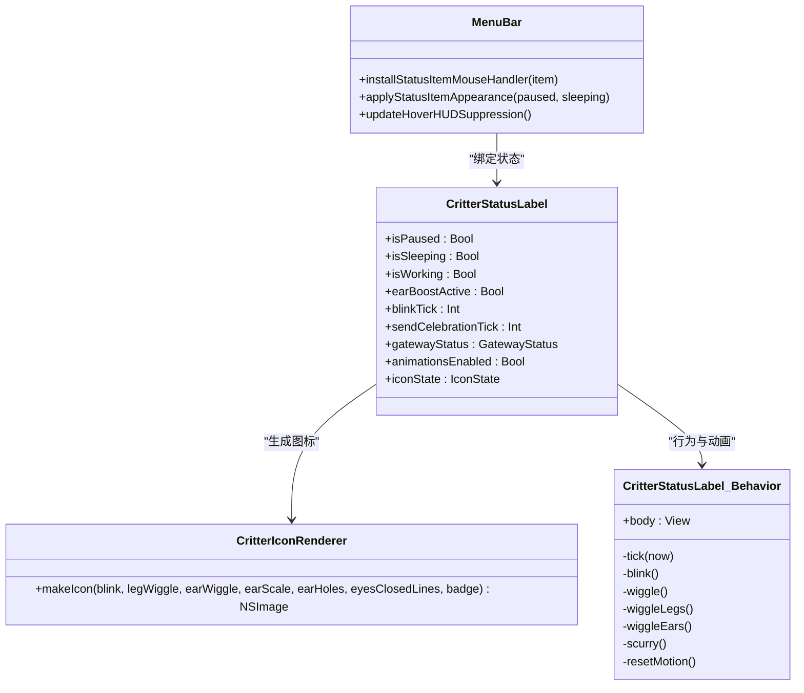
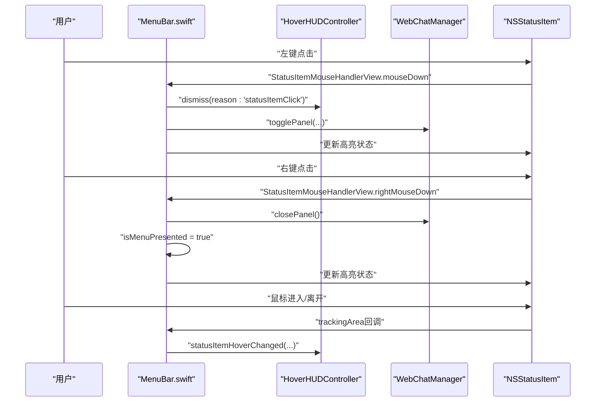
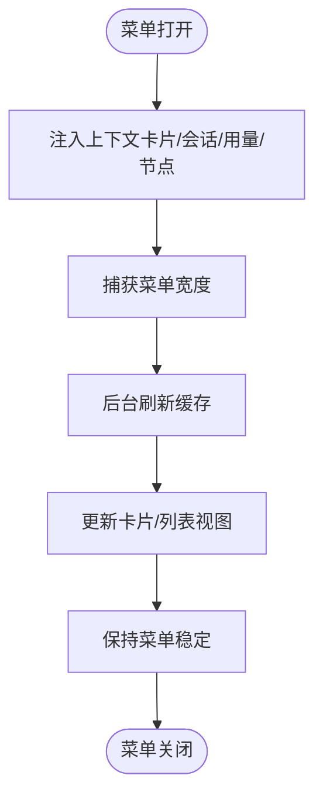
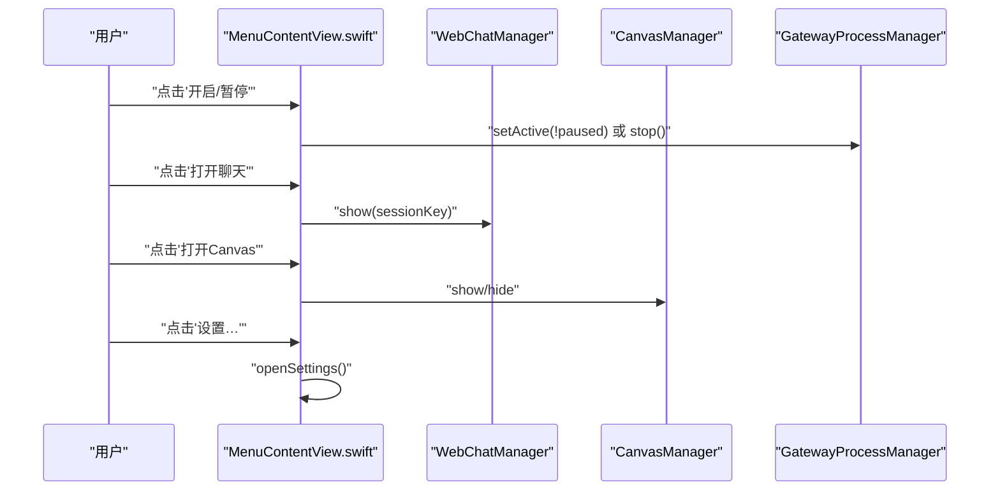
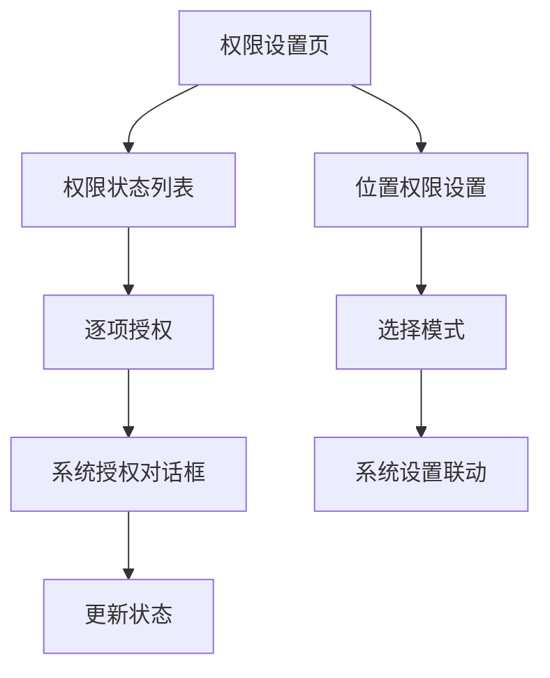
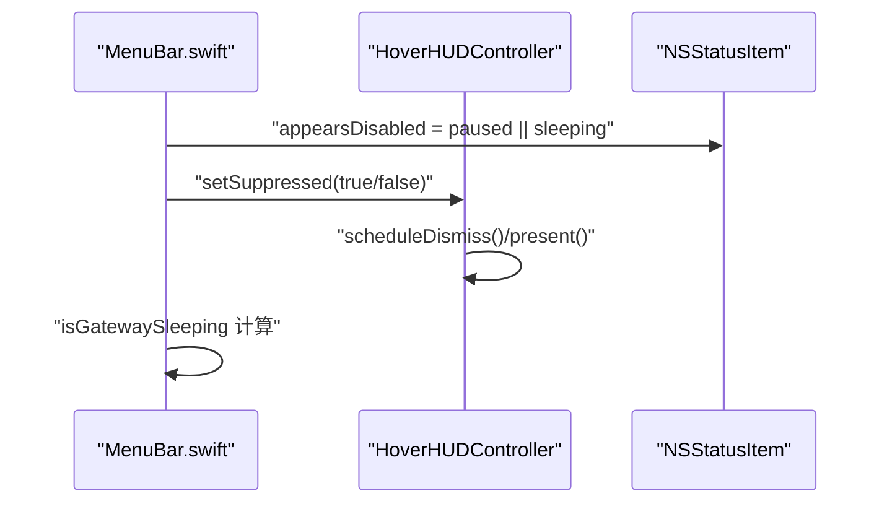
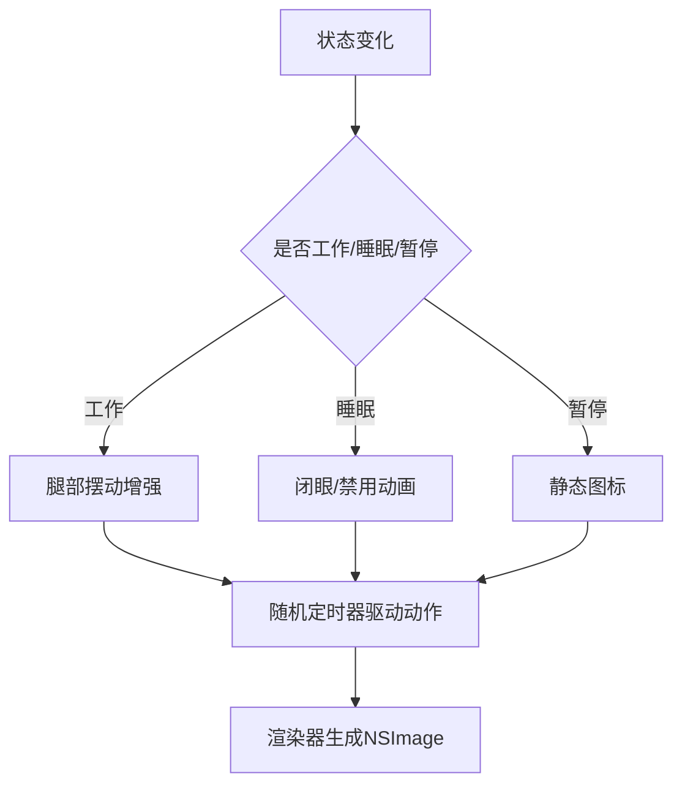
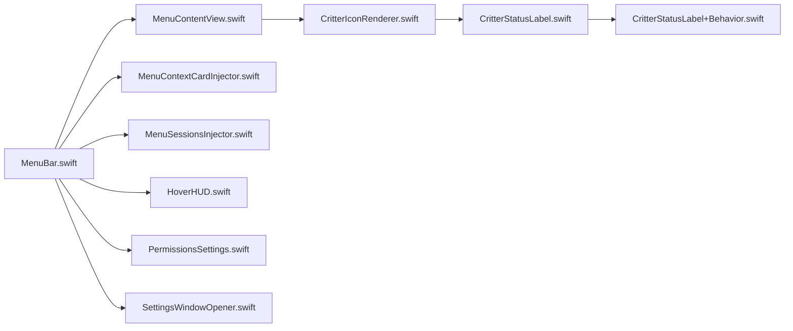

# 菜单栏控制

<cite>
**本文档引用的文件**
- [MenuBar.swift](file://apps/macos/Sources/OpenClaw/MenuBar.swift)
- [MenuContentView.swift](file://apps/macos/Sources/OpenClaw/MenuContentView.swift)
- [MenuContextCardInjector.swift](file://apps/macos/Sources/OpenClaw/MenuContextCardInjector.swift)
- [ContextMenuCardView.swift](file://apps/macos/Sources/OpenClaw/ContextMenuCardView.swift)
- [MenuSessionsInjector.swift](file://apps/macos/Sources/OpenClaw/MenuSessionsInjector.swift)
- [CritterStatusLabel.swift](file://apps/macos/Sources/OpenClaw/CritterStatusLabel.swift)
- [CritterStatusLabel+Behavior.swift](file://apps/macos/Sources/OpenClaw/CritterStatusLabel+Behavior.swift)
- [CritterIconRenderer.swift](file://apps/macos/Sources/OpenClaw/CritterIconRenderer.swift)
- [HoverHUD.swift](file://apps/macos/Sources/OpenClaw/HoverHUD.swift)
- [PermissionsSettings.swift](file://apps/macos/Sources/OpenClaw/PermissionsSettings.swift)
- [SettingsWindowOpener.swift](file://apps/macos/Sources/OpenClaw/SettingsWindowOpener.swift)
</cite>

## 目录

1. [简介](#简介)
2. [项目结构](#项目结构)
3. [核心组件](#核心组件)
4. [架构总览](#架构总览)
5. [详细组件分析](#详细组件分析)
6. [依赖关系分析](#依赖关系分析)
7. [性能考量](#性能考量)
8. [故障排查指南](#故障排查指南)
9. [结论](#结论)

## 简介

本文件面向OpenClaw在macOS平台的菜单栏控制功能，系统性阐述菜单栏图标的动态状态显示、点击与右键交互、上下文菜单注入、权限管理、系统托盘集成、状态同步机制、快捷操作与即时控制、视觉设计与动画实现、事件处理与用户响应机制，以及与系统组件的协同工作方式。目标是帮助开发者与使用者全面理解并高效使用菜单栏控制能力。

## 项目结构

OpenClaw的菜单栏控制主要由以下模块构成：

- 应用入口与场景：MenuBar.swift负责创建菜单栏图标、绑定状态、安装鼠标处理器与Hover HUD抑制逻辑。
- 菜单内容：MenuContentView.swift定义菜单项（开关、按钮、子菜单），提供快捷操作与即时控制。
- 上下文卡片：MenuContextCardInjector.swift与ContextMenuCardView.swift在菜单顶部注入“上下文使用卡”，展示会话摘要与令牌使用情况。
- 会话与节点注入：MenuSessionsInjector.swift在菜单中注入会话列表、用量统计、成本图表与设备节点列表。
- 图标与动画：CritterStatusLabel.swift、CritterStatusLabel+Behavior.swift与CritterIconRenderer.swift共同实现菜单栏图标的渲染与动画行为。
- 权限与设置：PermissionsSettings.swift提供权限状态与授权流程；SettingsWindowOpener.swift统一打开设置窗口。
- 悬停提示：HoverHUD.swift提供悬停时的轻量信息面板，避免遮挡菜单。

**图表来源**

- [MenuBar.swift](file://apps/macos/Sources/OpenClaw/MenuBar.swift#L41-L92)
- [MenuContentView.swift](file://apps/macos/Sources/OpenClaw/MenuContentView.swift#L8-L183)
- [MenuContextCardInjector.swift](file://apps/macos/Sources/OpenClaw/MenuContextCardInjector.swift#L21-L33)
- [ContextMenuCardView.swift](file://apps/macos/Sources/OpenClaw/ContextMenuCardView.swift#L5-L65)
- [MenuSessionsInjector.swift](file://apps/macos/Sources/OpenClaw/MenuSessionsInjector.swift#L42-L58)
- [CritterStatusLabel.swift](file://apps/macos/Sources/OpenClaw/CritterStatusLabel.swift#L3-L24)
- [CritterStatusLabel+Behavior.swift](file://apps/macos/Sources/OpenClaw/CritterStatusLabel+Behavior.swift#L13-L68)
- [CritterIconRenderer.swift](file://apps/macos/Sources/OpenClaw/CritterIconRenderer.swift#L106-L149)
- [HoverHUD.swift](file://apps/macos/Sources/OpenClaw/HoverHUD.swift#L9-L40)
- [PermissionsSettings.swift](file://apps/macos/Sources/OpenClaw/PermissionsSettings.swift#L6-L31)
- [SettingsWindowOpener.swift](file://apps/macos/Sources/OpenClaw/SettingsWindowOpener.swift#L14-L36)

**章节来源**

- [MenuBar.swift](file://apps/macos/Sources/OpenClaw/MenuBar.swift#L41-L92)
- [MenuContentView.swift](file://apps/macos/Sources/OpenClaw/MenuContentView.swift#L8-L183)

## 核心组件

- 菜单栏入口与状态绑定：MenuBar.swift通过MenuBarExtra创建菜单栏图标，绑定状态并在菜单呈现时安装鼠标处理器与注入器。
- 菜单内容与快捷操作：MenuContentView.swift提供“开启/暂停”、“发送心跳”、“浏览器控制”、“相机授权”、“执行审批模式”、“Canvas控制”、“语音唤醒”等快捷开关与按钮。
- 上下文卡片：MenuContextCardInjector与ContextMenuCardView在菜单顶部展示当前活跃会话摘要与令牌使用状态，支持加载中占位与错误提示。
- 会话/用量/节点注入：MenuSessionsInjector在菜单中注入会话列表、用量汇总、成本图表与设备节点，支持预览与子菜单。
- 图标与动画：CritterStatusLabel组合渲染器与行为类，根据状态生成不同动画与徽章；CritterIconRenderer负责矢量绘制与模板渲染。
- 权限管理：PermissionsSettings提供权限状态列表与逐项授权流程，支持位置权限与系统设置联动。
- 设置窗口：SettingsWindowOpener统一打开设置窗口，兼容系统偏好设置与自定义设置。
- 悬停HUD：HoverHUD在悬停时显示轻量信息，避免遮挡菜单，支持抑制策略。

**章节来源**

- [MenuBar.swift](file://apps/macos/Sources/OpenClaw/MenuBar.swift#L41-L92)
- [MenuContentView.swift](file://apps/macos/Sources/OpenClaw/MenuContentView.swift#L41-L183)
- [MenuContextCardInjector.swift](file://apps/macos/Sources/OpenClaw/MenuContextCardInjector.swift#L5-L33)
- [ContextMenuCardView.swift](file://apps/macos/Sources/OpenClaw/ContextMenuCardView.swift#L5-L65)
- [MenuSessionsInjector.swift](file://apps/macos/Sources/OpenClaw/MenuSessionsInjector.swift#L7-L58)
- [CritterStatusLabel.swift](file://apps/macos/Sources/OpenClaw/CritterStatusLabel.swift#L3-L24)
- [CritterStatusLabel+Behavior.swift](file://apps/macos/Sources/OpenClaw/CritterStatusLabel+Behavior.swift#L13-L68)
- [CritterIconRenderer.swift](file://apps/macos/Sources/OpenClaw/CritterIconRenderer.swift#L106-L149)
- [PermissionsSettings.swift](file://apps/macos/Sources/OpenClaw/PermissionsSettings.swift#L6-L31)
- [SettingsWindowOpener.swift](file://apps/macos/Sources/OpenClaw/SettingsWindowOpener.swift#L14-L36)
- [HoverHUD.swift](file://apps/macos/Sources/OpenClaw/HoverHUD.swift#L9-L40)

## 架构总览

菜单栏控制采用“状态驱动 + 视图注入 + 动画渲染”的分层架构：

- 状态层：应用状态（如暂停/睡眠、工作态、网关状态、动画开关）通过MenuBar.swift与各注入器共享。
- 控制层：MenuBar.swift安装鼠标处理器、菜单呈现回调、Hover HUD抑制策略。
- 视图层：MenuContentView.swift构建菜单项；MenuContextCardInjector/MenuSessionsInjector注入上下文卡片与会话/用量/节点。
- 渲染层：CritterStatusLabel组合行为与渲染器输出菜单栏图标；HoverHUD在悬停时显示信息面板。

**图表来源**

- [MenuBar.swift](file://apps/macos/Sources/OpenClaw/MenuBar.swift#L41-L92)
- [HoverHUD.swift](file://apps/macos/Sources/OpenClaw/HoverHUD.swift#L9-L40)
- [MenuContentView.swift](file://apps/macos/Sources/OpenClaw/MenuContentView.swift#L8-L183)
- [MenuContextCardInjector.swift](file://apps/macos/Sources/OpenClaw/MenuContextCardInjector.swift#L21-L33)
- [MenuSessionsInjector.swift](file://apps/macos/Sources/OpenClaw/MenuSessionsInjector.swift#L42-L58)
- [CritterStatusLabel.swift](file://apps/macos/Sources/OpenClaw/CritterStatusLabel.swift#L3-L24)
- [CritterStatusLabel+Behavior.swift](file://apps/macos/Sources/OpenClaw/CritterStatusLabel+Behavior.swift#L13-L68)
- [CritterIconRenderer.swift](file://apps/macos/Sources/OpenClaw/CritterIconRenderer.swift#L106-L149)

## 详细组件分析

### 菜单栏图标与状态显示

- 图标生成：CritterIconRenderer根据状态参数（眨眼、腿部摆动、耳朵摆动/放大、是否打洞、徽章符号与显著度）生成NSImage，作为菜单栏图标。
- 行为驱动：CritterStatusLabel+Behavior.swift基于状态变化（暂停、睡眠、工作、耳部增强、动画开关）调度定时任务与动画，实时更新图标。
- 状态同步：MenuBar.swift在菜单呈现、状态变更时调用applyStatusItemAppearance与updateHoverHUDSuppression，确保图标外观与系统交互一致。

**图表来源**

- [CritterIconRenderer.swift](file://apps/macos/Sources/OpenClaw/CritterIconRenderer.swift#L106-L149)
- [CritterStatusLabel.swift](file://apps/macos/Sources/OpenClaw/CritterStatusLabel.swift#L3-L24)
- [CritterStatusLabel+Behavior.swift](file://apps/macos/Sources/OpenClaw/CritterStatusLabel+Behavior.swift#L13-L68)
- [MenuBar.swift](file://apps/macos/Sources/OpenClaw/MenuBar.swift#L94-L173)

**章节来源**

- [CritterIconRenderer.swift](file://apps/macos/Sources/OpenClaw/CritterIconRenderer.swift#L106-L149)
- [CritterStatusLabel+Behavior.swift](file://apps/macos/Sources/OpenClaw/CritterStatusLabel+Behavior.swift#L75-L208)
- [MenuBar.swift](file://apps/macos/Sources/OpenClaw/MenuBar.swift#L94-L173)

### 点击与右键交互

- 左键点击：触发Web Chat面板切换，关闭悬停HUD，更新高亮状态与Hover HUD抑制。
- 右键点击：关闭Web Chat面板，置isMenuPresented为true以驱动菜单显示，更新高亮状态。
- 鼠标进入/离开：通过透明覆盖视图与NSTrackingArea监听悬停事件，通知HoverHUDController更新显示与定位。
- 面板可见性变化：WebChat/Canvas面板显示/隐藏时，MenuBar.swift同步更新状态高亮与Hover HUD抑制。

**图表来源**

- [MenuBar.swift](file://apps/macos/Sources/OpenClaw/MenuBar.swift#L134-L173)
- [HoverHUD.swift](file://apps/macos/Sources/OpenClaw/HoverHUD.swift#L42-L129)

**章节来源**

- [MenuBar.swift](file://apps/macos/Sources/OpenClaw/MenuBar.swift#L134-L173)
- [HoverHUD.swift](file://apps/macos/Sources/OpenClaw/HoverHUD.swift#L42-L129)

### 上下文菜单注入与卡片

- 注入时机：MenuSessionsInjector与MenuContextCardInjector在菜单打开前插入自定义NSMenuItem，避免破坏SwiftUI内部委托。
- 内容结构：上下文卡片展示会话数量与时间窗口、加载中占位、错误提示；会话列表支持预览与子菜单。
- 宽度与稳定性：注入器捕获菜单宽度，保证菜单打开期间尺寸稳定，避免抖动。
- 缓存与刷新：注入器按间隔缓存会话快照、用量与成本数据，菜单打开时异步刷新，保持流畅体验。

**图表来源**

- [MenuContextCardInjector.swift](file://apps/macos/Sources/OpenClaw/MenuContextCardInjector.swift#L35-L96)
- [MenuSessionsInjector.swift](file://apps/macos/Sources/OpenClaw/MenuSessionsInjector.swift#L60-L92)
- [ContextMenuCardView.swift](file://apps/macos/Sources/OpenClaw/ContextMenuCardView.swift#L25-L65)

**章节来源**

- [MenuContextCardInjector.swift](file://apps/macos/Sources/OpenClaw/MenuContextCardInjector.swift#L35-L96)
- [MenuSessionsInjector.swift](file://apps/macos/Sources/OpenClaw/MenuSessionsInjector.swift#L60-L92)
- [ContextMenuCardView.swift](file://apps/macos/Sources/OpenClaw/ContextMenuCardView.swift#L25-L65)

### 快捷操作与即时控制

- 开启/暂停：切换应用工作状态，本地模式下同时控制网关进程。
- 发送心跳：控制健康上报开关，显示最近心跳状态与时间。
- 浏览器控制：允许/拒绝浏览器自动化控制。
- 相机授权：允许/拒绝相机访问。
- 执行审批模式：快速选择执行审批模式。
- Canvas控制：允许/隐藏Canvas面板。
- 语音唤醒：启用/禁用语音唤醒，并可选择麦克风。
- 打开仪表盘/聊天/设置/关于/退出：提供常用入口与快捷键。

**图表来源**

- [MenuContentView.swift](file://apps/macos/Sources/OpenClaw/MenuContentView.swift#L109-L156)
- [MenuBar.swift](file://apps/macos/Sources/OpenClaw/MenuBar.swift#L62-L79)

**章节来源**

- [MenuContentView.swift](file://apps/macos/Sources/OpenClaw/MenuContentView.swift#L109-L156)
- [MenuBar.swift](file://apps/macos/Sources/OpenClaw/MenuBar.swift#L62-L79)

### 权限管理与系统设置集成

- 权限状态：PermissionsSettings展示各类能力授权状态与描述，支持一键授权。
- 授权流程：逐项调用PermissionManager.ensure，必要时弹出系统授权对话框。
- 位置权限：支持“关闭/使用时/始终”，与系统设置联动，必要时引导至系统设置。
- 刷新机制：提供“刷新”按钮，重新查询授权状态。

**图表来源**

- [PermissionsSettings.swift](file://apps/macos/Sources/OpenClaw/PermissionsSettings.swift#L99-L127)
- [PermissionsSettings.swift](file://apps/macos/Sources/OpenClaw/PermissionsSettings.swift#L33-L97)

**章节来源**

- [PermissionsSettings.swift](file://apps/macos/Sources/OpenClaw/PermissionsSettings.swift#L99-L127)
- [PermissionsSettings.swift](file://apps/macos/Sources/OpenClaw/PermissionsSettings.swift#L33-L97)

### 系统托盘集成与状态同步

- 托盘高亮：MenuBar.swift在菜单或面板可见时对状态按钮进行高亮，便于识别当前状态。
- Hover HUD抑制：菜单或面板可见时抑制Hover HUD，避免遮挡；鼠标移出后延迟消失。
- 睡眠状态：根据连接模式与网关状态计算“睡眠”，图标呈现闭眼状态，禁用动画。
- 控制通道观察：MenuSessionsInjector观察控制通道状态变化，及时刷新会话与用量。

**图表来源**

- [MenuBar.swift](file://apps/macos/Sources/OpenClaw/MenuBar.swift#L94-L131)
- [HoverHUD.swift](file://apps/macos/Sources/OpenClaw/HoverHUD.swift#L33-L129)
- [MenuSessionsInjector.swift](file://apps/macos/Sources/OpenClaw/MenuSessionsInjector.swift#L109-L144)

**章节来源**

- [MenuBar.swift](file://apps/macos/Sources/OpenClaw/MenuBar.swift#L94-L131)
- [HoverHUD.swift](file://apps/macos/Sources/OpenClaw/HoverHUD.swift#L33-L129)
- [MenuSessionsInjector.swift](file://apps/macos/Sources/OpenClaw/MenuSessionsInjector.swift#L109-L144)

### 视觉设计与动画效果

- 图标设计：CritterIconRenderer采用矢量绘制，支持圆角主体、耳朵、腿部与眼睛，模板渲染适配浅色/深色模式。
- 动画策略：基于随机定时器驱动眨眼、摆头、腿部摆动、耳朵摆动与“小跑”动作；工作态增强腿部摆动幅度；耳部增强时绘制耳洞并放大耳朵。
- 徽章系统：在右上角绘制带透明孔洞的圆形徽章，突出工具活动与状态显著度。
- 悬停提示：HoverHUD在悬停时以淡入淡出动画显示状态摘要，避免遮挡菜单。

**图表来源**

- [CritterStatusLabel+Behavior.swift](file://apps/macos/Sources/OpenClaw/CritterStatusLabel+Behavior.swift#L75-L208)
- [CritterIconRenderer.swift](file://apps/macos/Sources/OpenClaw/CritterIconRenderer.swift#L326-L386)
- [HoverHUD.swift](file://apps/macos/Sources/OpenClaw/HoverHUD.swift#L131-L155)

**章节来源**

- [CritterStatusLabel+Behavior.swift](file://apps/macos/Sources/OpenClaw/CritterStatusLabel+Behavior.swift#L75-L208)
- [CritterIconRenderer.swift](file://apps/macos/Sources/OpenClaw/CritterIconRenderer.swift#L326-L386)
- [HoverHUD.swift](file://apps/macos/Sources/OpenClaw/HoverHUD.swift#L131-L155)

## 依赖关系分析

- 组件耦合：MenuBar.swift是控制中枢，依赖状态存储与服务（网关、控制通道、健康、活动）；注入器依赖菜单委托与观察者；图标渲染器独立但被标签视图依赖。
- 外部集成：与NSMenu、NSStatusItem、NSHostingView、SwiftUI ObservedObject/Binding、系统权限框架、AVFoundation（麦克风）、Sparkle（更新）等集成。
- 潜在风险：菜单委托链需保留SwiftUI默认委托，避免菜单项不填充；Hover HUD与面板可见性需严格同步，防止冲突。

**图表来源**

- [MenuBar.swift](file://apps/macos/Sources/OpenClaw/MenuBar.swift#L41-L92)
- [MenuContentView.swift](file://apps/macos/Sources/OpenClaw/MenuContentView.swift#L8-L183)
- [MenuContextCardInjector.swift](file://apps/macos/Sources/OpenClaw/MenuContextCardInjector.swift#L5-L33)
- [MenuSessionsInjector.swift](file://apps/macos/Sources/OpenClaw/MenuSessionsInjector.swift#L7-L58)
- [HoverHUD.swift](file://apps/macos/Sources/OpenClaw/HoverHUD.swift#L9-L40)
- [CritterIconRenderer.swift](file://apps/macos/Sources/OpenClaw/CritterIconRenderer.swift#L106-L149)
- [CritterStatusLabel.swift](file://apps/macos/Sources/OpenClaw/CritterStatusLabel.swift#L3-L24)
- [CritterStatusLabel+Behavior.swift](file://apps/macos/Sources/OpenClaw/CritterStatusLabel+Behavior.swift#L13-L68)
- [PermissionsSettings.swift](file://apps/macos/Sources/OpenClaw/PermissionsSettings.swift#L6-L31)
- [SettingsWindowOpener.swift](file://apps/macos/Sources/OpenClaw/SettingsWindowOpener.swift#L14-L36)

**章节来源**

- [MenuBar.swift](file://apps/macos/Sources/OpenClaw/MenuBar.swift#L41-L92)
- [MenuSessionsInjector.swift](file://apps/macos/Sources/OpenClaw/MenuSessionsInjector.swift#L7-L58)

## 性能考量

- 异步缓存与预热：上下文卡片与会话注入器在菜单打开时异步加载与预热，避免阻塞菜单呈现。
- 定时任务替代Combine：动画使用Swift并发任务而非Combine的TimerPublisher，降低崩溃风险。
- 尺寸与布局：注入器捕获菜单宽度，减少布局抖动；卡片与列表使用fittingSize与固定最小宽度。
- 委托链保护：仅在需要时替换NSMenuDelegate，避免破坏SwiftUI内部委托导致菜单项不填充。

[本节为通用指导，无需特定文件分析]

## 故障排查指南

- 菜单不显示或空白：检查SwiftUI默认NSMenuDelegate是否被意外替换；确认MenuBar.swift中的install流程已执行。
- 图标无动画：确认animationsEnabled与isSleeping状态；检查状态变化是否触发重置或随机定时器调度。
- 权限未生效：通过PermissionsSettings的“刷新”按钮重新查询；必要时引导至系统设置。
- Hover HUD遮挡：确认isMenuPresented或panelVisible状态；检查setSuppressed调用路径。
- 会话/用量不更新：检查ControlChannel状态；确认MenuSessionsInjector的观察与缓存刷新逻辑。

**章节来源**

- [MenuBar.swift](file://apps/macos/Sources/OpenClaw/MenuBar.swift#L94-L131)
- [MenuSessionsInjector.swift](file://apps/macos/Sources/OpenClaw/MenuSessionsInjector.swift#L109-L144)
- [PermissionsSettings.swift](file://apps/macos/Sources/OpenClaw/PermissionsSettings.swift#L110-L127)
- [HoverHUD.swift](file://apps/macos/Sources/OpenClaw/HoverHUD.swift#L33-L129)

## 结论

OpenClaw的菜单栏控制通过清晰的分层架构实现了状态驱动的图标渲染、流畅的交互与上下文注入、完善的权限与系统设置集成，以及稳定的性能表现。开发者可基于现有注入器与状态绑定扩展新功能，同时遵循委托链保护与动画策略以确保用户体验与系统稳定性。
