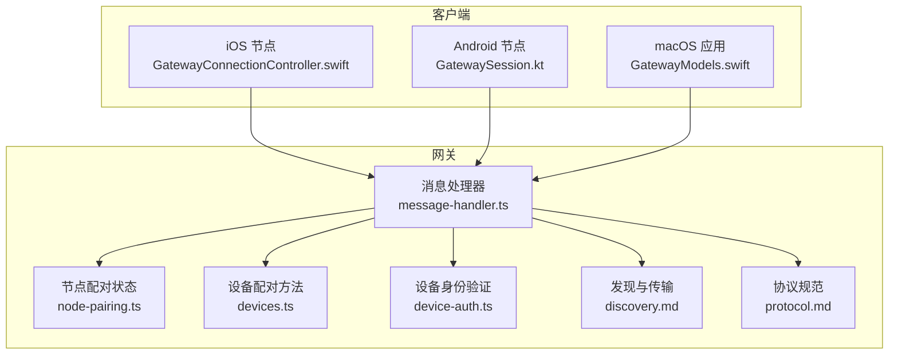
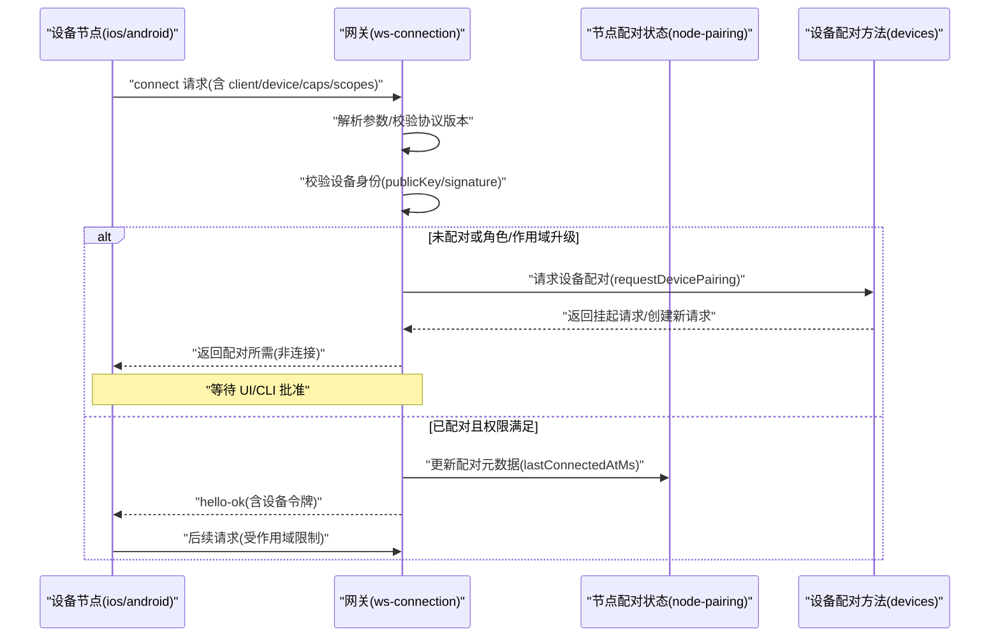
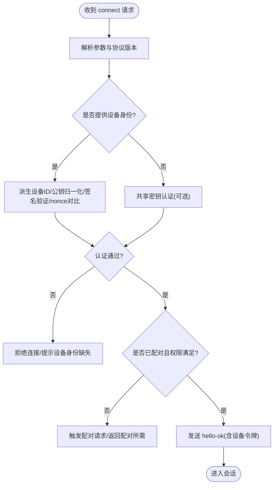
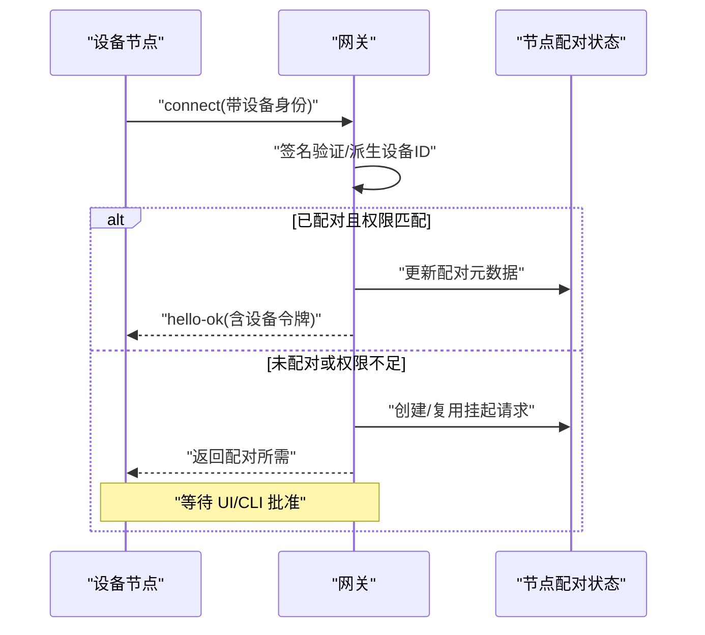
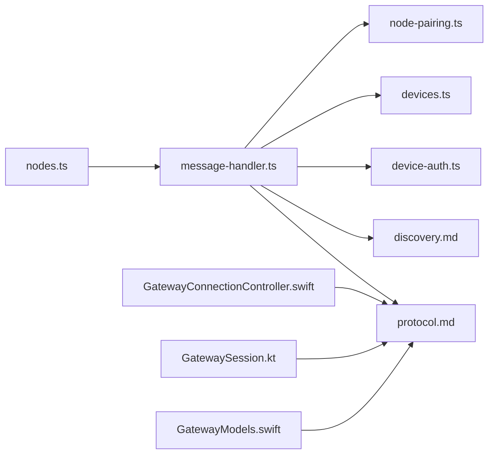

# 设备节点管理

<cite>
**本文引用的文件**
- [node-pairing.ts](file://src/infra/node-pairing.ts)
- [message-handler.ts](file://src/gateway/server/ws-connection/message-handler.ts)
- [protocol.md](file://docs/gateway/protocol.md)
- [discovery.md](file://docs/gateway/discovery.md)
- [pairing.md](file://docs/gateway/pairing.md)
- [GatewayModels.swift](file://apps/macos/Sources/OpenClawProtocol/GatewayModels.swift)
- [GatewayModels.swift](file://apps/shared/OpenClawKit/Sources/OpenClawProtocol/GatewayModels.swift)
- [NodePairingApprovalPrompter.swift](file://apps/macos/Sources/OpenClaw/NodePairingApprovalPrompter.swift)
- [GatewayConnectionController.swift](file://apps/ios/Sources/Gateway/GatewayConnectionController.swift)
- [GatewaySession.kt](file://apps/android/app/src/main/java/ai/openclaw/android/gateway/GatewaySession.kt)
- [device-auth.ts](file://src/gateway/device-auth.ts)
- [HealthStore.swift](file://apps/macos/Sources/OpenClaw/HealthStore.swift)
- [GatewayHealthMonitor.swift](file://apps/ios/Sources/Gateway/GatewayHealthMonitor.swift)
- [devices.ts](file://src/gateway/server-methods/devices.ts)
- [system-presence.ts](file://src/infra/system-presence.ts)
- [nodes.ts](file://ui/src/ui/views/nodes.ts)
</cite>

## 目录

1. [简介](#简介)
2. [项目结构](#项目结构)
3. [核心组件](#核心组件)
4. [架构总览](#架构总览)
5. [详细组件分析](#详细组件分析)
6. [依赖关系分析](#依赖关系分析)
7. [性能考量](#性能考量)
8. [故障排查指南](#故障排查指南)
9. [结论](#结论)
10. [附录](#附录)

## 简介

本文件系统化阐述 OpenClaw 的“设备节点管理”能力，覆盖设备节点的发现机制、连接建立、配对与认证、安全通信、会话与状态管理、事件同步、健康检查与故障恢复、重连策略、配置与参数调整以及与网关服务的通信协议与数据交换格式。目标是帮助开发者与运维人员快速理解并正确实现或集成设备节点。

## 项目结构

围绕设备节点管理的关键目录与文件：

- 网关侧握手与配对逻辑：src/gateway/server/ws-connection/message-handler.ts
- 设备节点配对状态持久化：src/infra/node-pairing.ts
- 协议规范与帧格式：docs/gateway/protocol.md
- 发现与传输策略：docs/gateway/discovery.md
- 网关主导的节点配对流程：docs/gateway/pairing.md
- 平台协议模型（macOS/iOS/Android）：apps/_/Sources/_/GatewayModels.swift、apps/android/app/src/main/java/.../GatewaySession.kt
- 节点侧连接控制器与能力声明：apps/ios/Sources/Gateway/GatewayConnectionController.swift
- 设备身份与签名验证：src/gateway/device-auth.ts
- 健康状态与监控：apps/macos/Sources/OpenClaw/HealthStore.swift、apps/ios/Sources/Gateway/GatewayHealthMonitor.swift
- 系统存在性与状态：src/infra/system-presence.ts
- UI 展示与审批：ui/src/ui/views/nodes.ts

**图表来源**

- [message-handler.ts](file://src/gateway/server/ws-connection/message-handler.ts#L133-L192)
- [node-pairing.ts](file://src/infra/node-pairing.ts#L1-L140)
- [devices.ts](file://src/gateway/server-methods/devices.ts#L1-L30)
- [device-auth.ts](file://src/gateway/device-auth.ts#L1-L31)
- [discovery.md](file://docs/gateway/discovery.md#L1-L117)
- [protocol.md](file://docs/gateway/protocol.md#L1-L200)

**章节来源**

- [message-handler.ts](file://src/gateway/server/ws-connection/message-handler.ts#L133-L192)
- [node-pairing.ts](file://src/infra/node-pairing.ts#L1-L140)
- [protocol.md](file://docs/gateway/protocol.md#L1-L200)
- [discovery.md](file://docs/gateway/discovery.md#L1-L117)

## 核心组件

- 设备节点配对状态管理：负责挂起请求与已配对节点的持久化、过期清理、令牌轮换与元数据更新。
- 网关握手与认证：在 WebSocket 握手阶段完成设备身份校验、角色与作用域校验、配对要求触发与令牌下发。
- 协议与模型：定义帧格式、连接参数、角色与作用域、设备身份与签名格式。
- 发现与传输：支持 Bonjour/LAN、Tailnet、SSH 等多种发现与连接路径。
- 健康检查与状态：提供节点健康度评估、故障检测与恢复建议。
- UI 与 CLI：展示待审批请求、执行批准/拒绝、查看状态与重命名节点。

**章节来源**

- [node-pairing.ts](file://src/infra/node-pairing.ts#L150-L210)
- [message-handler.ts](file://src/gateway/server/ws-connection/message-handler.ts#L484-L728)
- [protocol.md](file://docs/gateway/protocol.md#L127-L134)
- [discovery.md](file://docs/gateway/discovery.md#L43-L101)
- [HealthStore.swift](file://apps/macos/Sources/OpenClaw/HealthStore.swift#L197-L213)
- [nodes.ts](file://ui/src/ui/views/nodes.ts#L131-L158)

## 架构总览

设备节点从发现到连接、配对与会话建立的总体流程如下：

**图表来源**

- [message-handler.ts](file://src/gateway/server/ws-connection/message-handler.ts#L484-L728)
- [node-pairing.ts](file://src/infra/node-pairing.ts#L167-L210)
- [devices.ts](file://src/gateway/server-methods/devices.ts#L1-L30)

## 详细组件分析

### 设备节点发现与传输

- 发现方式
  - Bonjour/LAN：局域网内自动发现，TXT 字段包含端口、TLS 指纹、Tailnet 提示等。
  - Tailnet：跨网络通过 MagicDNS 或稳定 IP 直连。
  - SSH：作为通用回退方案，通过本地回环端口转发。
- 传输选择策略
  - 优先使用已配对直连；否则 Bonjour/LAN；再者 Tailnet；最后 SSH。
- 安全边界
  - 直连由网关控制准入；SSH 仅用于控制面回退。

**章节来源**

- [discovery.md](file://docs/gateway/discovery.md#L43-L101)
- [discovery.md](file://docs/gateway/discovery.md#L102-L117)

### 连接建立与握手

- 首帧必须为 connect 请求，包含：
  - 客户端标识(client.id/version/platform/mode)
  - 角色(role)与作用域(scopes)
  - 能力声明(caps/commands/permissions)
  - 可选设备身份(device.id/publicKey/signature/signedAt/nonce)
  - 可选认证(auth.token/password)
- 握手阶段关键步骤
  - 校验协议版本范围(min/maxProtocol)
  - 设备身份校验：派生设备 ID、公钥归一化、签名验证、nonce 对比
  - 权限校验：角色与作用域是否允许
  - 配对要求：若未配对或权限不足，触发 node.pair.request 或 device.pair.request
  - 令牌下发：首次配对成功后在 hello-ok 中返回设备令牌

**图表来源**

- [message-handler.ts](file://src/gateway/server/ws-connection/message-handler.ts#L396-L406)
- [message-handler.ts](file://src/gateway/server/ws-connection/message-handler.ts#L484-L671)
- [message-handler.ts](file://src/gateway/server/ws-connection/message-handler.ts#L788-L899)

**章节来源**

- [protocol.md](file://docs/gateway/protocol.md#L22-L90)
- [message-handler.ts](file://src/gateway/server/ws-connection/message-handler.ts#L396-L406)
- [message-handler.ts](file://src/gateway/server/ws-connection/message-handler.ts#L484-L671)
- [message-handler.ts](file://src/gateway/server/ws-connection/message-handler.ts#L788-L899)

### 设备节点配对流程与认证机制

- 网关主导的节点配对
  - 网关保存挂起请求与已配对节点，5 分钟过期清理
  - CLI/控制 UI 审批后生成新令牌，令牌轮换策略确保安全性
  - 支持静默审批（silent）与自动批准场景
- 设备身份与签名
  - 使用设备公钥指纹派生设备 ID
  - 签名载荷包含版本、设备 ID、客户端 ID、角色、作用域、时间戳、令牌、nonce
  - 支持 v1/v2 版本签名兼容
- 令牌与作用域
  - 首次配对成功后下发设备令牌，受角色与作用域约束
  - 后续连接可直接使用设备令牌进行认证

**图表来源**

- [node-pairing.ts](file://src/infra/node-pairing.ts#L167-L210)
- [message-handler.ts](file://src/gateway/server/ws-connection/message-handler.ts#L728-L781)
- [device-auth.ts](file://src/gateway/device-auth.ts#L13-L31)

**章节来源**

- [pairing.md](file://docs/gateway/pairing.md#L27-L71)
- [node-pairing.ts](file://src/infra/node-pairing.ts#L150-L210)
- [device-auth.ts](file://src/gateway/device-auth.ts#L1-L31)

### 会话管理、数据传输与事件同步

- 会话注册与状态
  - 连接成功后注册节点会话，记录远程 IP、连接时间等
  - 更新远程节点信息与技能二进制探测
- 数据传输
  - 帧格式：req/res/event
  - 有副作用方法需幂等键
- 事件同步
  - 系统存在性(system-presence)按设备维度聚合
  - 跨会话记忆同步与健康快照广播

**章节来源**

- [message-handler.ts](file://src/gateway/server/ws-connection/message-handler.ts#L886-L932)
- [protocol.md](file://docs/gateway/protocol.md#L127-L134)
- [system-presence.ts](file://src/infra/system-presence.ts#L175-L207)

### 健康检查、故障恢复与重连机制

- 健康评估
  - macOS：根据通道链接状态与探针结果判定 OK/Linking Needed/降级/未知
  - iOS：超时控制、定期健康检查任务
- 故障恢复
  - 通道不可用时选择备用通道
  - 令牌轮换与重新配对以应对异常
- 重连策略
  - 依据发现策略优先直连，失败则回退至 SSH
  - 本地节点可利用静默配对减少交互

**章节来源**

- [HealthStore.swift](file://apps/macos/Sources/OpenClaw/HealthStore.swift#L197-L213)
- [GatewayHealthMonitor.swift](file://apps/ios/Sources/Gateway/GatewayHealthMonitor.swift#L47-L85)
- [discovery.md](file://docs/gateway/discovery.md#L93-L101)

### 配置管理、参数调整与性能监控

- 配置项
  - 网关绑定(gateway.bind)、可信代理(trustedProxies)、控制 UI 安全策略
  - Bonjour/TLS/Tailnet 参数可通过环境变量覆盖
- 参数调整
  - 节点能力声明(caps/commands/permissions)在连接时声明，网关侧进行允许集过滤
  - 作用域与角色变更触发配对升级流程
- 性能监控
  - 会话增量同步阈值与批量处理
  - 诊断事件计数与直方图(排队深度、等待时间、会话状态)

**章节来源**

- [message-handler.ts](file://src/gateway/server/ws-connection/message-handler.ts#L788-L799)
- [protocol.md](file://docs/gateway/protocol.md#L178-L196)

### 与网关服务的通信协议与数据交换格式

- 帧格式
  - Request: {type:"req", id, method, params}
  - Response: {type:"res", id, ok, payload|error}
  - Event: {type:"event", event, payload, seq?, stateVersion?}
- 角色与作用域
  - operator: 控制面客户端
  - node: 能力宿主
  - 常用作用域: read/write/admin/approvals/pairing
- 设备身份与配对
  - 设备公钥指纹派生设备 ID
  - 签名载荷包含版本、设备 ID、客户端 ID、角色、作用域、时间戳、令牌、nonce

**章节来源**

- [protocol.md](file://docs/gateway/protocol.md#L127-L134)
- [protocol.md](file://docs/gateway/protocol.md#L135-L160)
- [protocol.md](file://docs/gateway/protocol.md#L178-L200)

## 依赖关系分析

**图表来源**

- [message-handler.ts](file://src/gateway/server/ws-connection/message-handler.ts#L1-L60)
- [node-pairing.ts](file://src/infra/node-pairing.ts#L1-L65)
- [devices.ts](file://src/gateway/server-methods/devices.ts#L1-L30)
- [device-auth.ts](file://src/gateway/device-auth.ts#L1-L31)
- [protocol.md](file://docs/gateway/protocol.md#L1-L200)
- [discovery.md](file://docs/gateway/discovery.md#L1-L117)
- [nodes.ts](file://ui/src/ui/views/nodes.ts#L131-L158)

**章节来源**

- [message-handler.ts](file://src/gateway/server/ws-connection/message-handler.ts#L1-L60)
- [protocol.md](file://docs/gateway/protocol.md#L1-L200)

## 性能考量

- 连接握手与鉴权
  - 严格校验设备签名与公钥，避免无效连接占用资源
  - 令牌轮换与配对升级应尽量异步化，降低握手延迟
- 会话与内存
  - 会话增量阈值与批量同步减少写放大
  - 跨会话记忆同步采用队列与去重策略
- 传输与发现
  - 优先直连与本地 Bonjour，减少 SSH 回退带来的额外开销
  - Tailnet 场景下合理设置 DNS 与端口映射

[本节为通用指导，无需特定文件引用]

## 故障排查指南

- 连接被拒
  - 检查设备身份字段是否完整、签名是否有效、nonce 是否匹配
  - 确认网关是否启用共享密钥认证且客户端提供了正确的 token/password
- 未配对或权限不足
  - 查看 UI/CLI 是否存在待审批请求
  - 确认节点声明的能力与作用域是否在网关允许范围内
- 健康状态异常
  - macOS：关注通道链接状态与探针失败原因
  - iOS：检查健康检查超时与任务调度
- 令牌问题
  - 令牌轮换后需重新配对
  - 确保客户端持久化并复用设备令牌

**章节来源**

- [message-handler.ts](file://src/gateway/server/ws-connection/message-handler.ts#L484-L671)
- [HealthStore.swift](file://apps/macos/Sources/OpenClaw/HealthStore.swift#L153-L213)
- [GatewayHealthMonitor.swift](file://apps/ios/Sources/Gateway/GatewayHealthMonitor.swift#L64-L85)
- [pairing.md](file://docs/gateway/pairing.md#L90-L100)

## 结论

OpenClaw 的设备节点管理以“网关为主导”的配对与认证为核心，结合多通道发现与传输策略，提供安全、可观测、可扩展的节点接入能力。通过清晰的协议帧格式、严格的设备身份验证与令牌轮换机制，以及完善的健康检查与重连策略，能够满足从本地到跨网络的多样化部署需求。

[本节为总结性内容，无需特定文件引用]

## 附录

- 平台协议模型参考
  - macOS/macOS SharedKit: GatewayModels.swift
  - iOS: GatewayConnectionController.swift
  - Android: GatewaySession.kt
- UI 审批与状态展示
  - nodes.ts 展示待审批列表与操作入口

**章节来源**

- [GatewayModels.swift](file://apps/macos/Sources/OpenClawProtocol/GatewayModels.swift#L666-L713)
- [GatewayModels.swift](file://apps/shared/OpenClawKit/Sources/OpenClawProtocol/GatewayModels.swift#L666-L713)
- [GatewayConnectionController.swift](file://apps/ios/Sources/Gateway/GatewayConnectionController.swift#L609-L666)
- [GatewaySession.kt](file://apps/android/app/src/main/java/ai/openclaw/android/gateway/GatewaySession.kt#L362-L389)
- [nodes.ts](file://ui/src/ui/views/nodes.ts#L131-L158)
