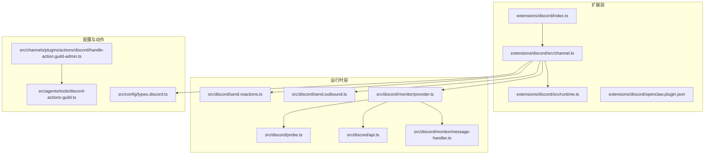
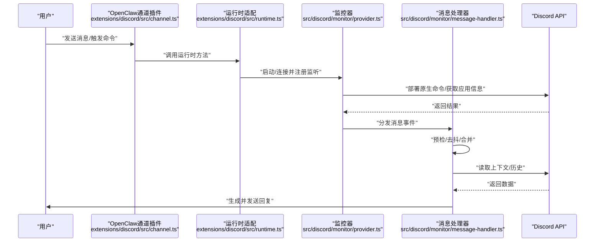
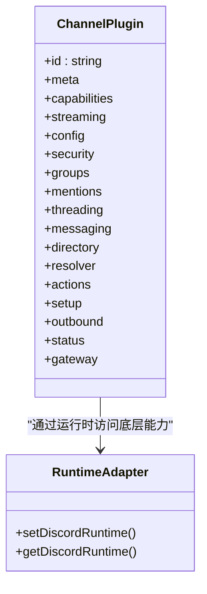
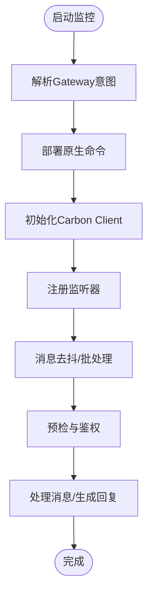
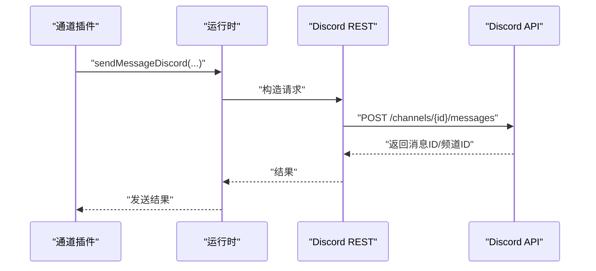
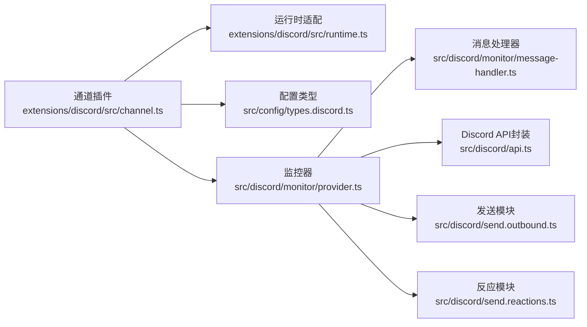

# Discord渠道集成

<cite>
**本文引用的文件**
- [extensions/discord/openclaw.plugin.json](file://extensions/discord/openclaw.plugin.json)
- [extensions/discord/index.ts](file://extensions/discord/index.ts)
- [extensions/discord/src/channel.ts](file://extensions/discord/src/channel.ts)
- [extensions/discord/src/runtime.ts](file://extensions/discord/src/runtime.ts)
- [docs/channels/discord.md](file://docs/channels/discord.md)
- [src/config/types.discord.ts](file://src/config/types.discord.ts)
- [src/discord/monitor/provider.ts](file://src/discord/monitor/provider.ts)
- [src/discord/monitor/message-handler.ts](file://src/discord/monitor/message-handler.ts)
- [src/discord/send.outbound.ts](file://src/discord/send.outbound.ts)
- [src/discord/send.reactions.ts](file://src/discord/send.reactions.ts)
- [src/discord/api.ts](file://src/discord/api.ts)
- [src/discord/probe.ts](file://src/discord/probe.ts)
- [src/channels/plugins/actions/discord/handle-action.guild-admin.ts](file://src/channels/plugins/actions/discord/handle-action.guild-admin.ts)
- [src/agents/tools/discord-actions-guild.ts](file://src/agents/tools/discord-actions-guild.ts)
- [src/channels/plugins/status-issues/discord.ts](file://src/channels/plugins/status-issues/discord.ts)
</cite>

## 目录

1. [简介](#简介)
2. [项目结构](#项目结构)
3. [核心组件](#核心组件)
4. [架构总览](#架构总览)
5. [详细组件分析](#详细组件分析)
6. [依赖关系分析](#依赖关系分析)
7. [性能与限流](#性能与限流)
8. [故障排除指南](#故障排除指南)
9. [结论](#结论)
10. [附录：配置参考](#附录配置参考)

## 简介

本文件面向OpenClaw的Discord渠道集成，系统性阐述Bot创建、服务器权限、消息处理、嵌入消息、角色管理、文本转语音（TTS）能力、活动集成、配置项与权限管理、限流机制、事件订阅与最佳实践，并提供大规模服务器的性能优化建议与故障排除清单。

## 项目结构

OpenClaw将Discord作为可插拔通道，核心位于扩展目录与运行时适配层：

- 扩展层：负责注册通道、桥接运行时、暴露配置模式与能力
- 运行时层：封装Discord客户端、监听器、命令部署、消息处理与动作执行
- 文档层：提供快速设置、策略与配置参考

**图表来源**

- [extensions/discord/index.ts](file://extensions/discord/index.ts#L1-L18)
- [extensions/discord/src/channel.ts](file://extensions/discord/src/channel.ts#L1-L430)
- [extensions/discord/src/runtime.ts](file://extensions/discord/src/runtime.ts#L1-L15)
- [src/discord/monitor/provider.ts](file://src/discord/monitor/provider.ts#L1-L200)
- [src/discord/monitor/message-handler.ts](file://src/discord/monitor/message-handler.ts#L44-L146)
- [src/discord/api.ts](file://src/discord/api.ts#L1-L136)
- [src/discord/send.outbound.ts](file://src/discord/send.outbound.ts#L254-L279)
- [src/discord/send.reactions.ts](file://src/discord/send.reactions.ts#L1-L38)
- [src/discord/probe.ts](file://src/discord/probe.ts#L37-L60)
- [src/config/types.discord.ts](file://src/config/types.discord.ts#L1-L182)
- [src/channels/plugins/actions/discord/handle-action.guild-admin.ts](file://src/channels/plugins/actions/discord/handle-action.guild-admin.ts#L1-L446)
- [src/agents/tools/discord-actions-guild.ts](file://src/agents/tools/discord-actions-guild.ts#L189-L436)

**章节来源**

- [extensions/discord/openclaw.plugin.json](file://extensions/discord/openclaw.plugin.json#L1-L10)
- [extensions/discord/index.ts](file://extensions/discord/index.ts#L1-L18)
- [extensions/discord/src/channel.ts](file://extensions/discord/src/channel.ts#L1-L430)
- [extensions/discord/src/runtime.ts](file://extensions/discord/src/runtime.ts#L1-L15)
- [docs/channels/discord.md](file://docs/channels/discord.md#L1-L485)

## 核心组件

- 插件注册与运行时注入
  - 扩展入口注册通道与运行时，使底层Discord能力在OpenClaw中可用
- 通道插件定义
  - 暴露聊天类型、能力开关、会话路由、目标解析、目录查询、动作适配等
- 运行时监控与事件处理
  - 启动Discord客户端、部署原生命令、注册监听器、处理消息与反应事件
- 发送与动作
  - 文本/媒体发送、投票、反应、频道/角色/成员信息、线程、搜索、活动等

**章节来源**

- [extensions/discord/index.ts](file://extensions/discord/index.ts#L6-L15)
- [extensions/discord/src/channel.ts](file://extensions/discord/src/channel.ts#L47-L430)
- [src/discord/monitor/provider.ts](file://src/discord/monitor/provider.ts#L144-L599)
- [src/discord/monitor/message-handler.ts](file://src/discord/monitor/message-handler.ts#L44-L146)
- [src/discord/send.outbound.ts](file://src/discord/send.outbound.ts#L254-L279)
- [src/discord/send.reactions.ts](file://src/discord/send.reactions.ts#L1-L38)

## 架构总览

下图展示从用户输入到响应输出的端到端流程，以及与Discord API交互的关键节点。

**图表来源**

- [extensions/discord/src/channel.ts](file://extensions/discord/src/channel.ts#L288-L311)
- [extensions/discord/src/runtime.ts](file://extensions/discord/src/runtime.ts#L5-L14)
- [src/discord/monitor/provider.ts](file://src/discord/monitor/provider.ts#L515-L599)
- [src/discord/monitor/message-handler.ts](file://src/discord/monitor/message-handler.ts#L44-L146)

## 详细组件分析

### 通道插件与能力模型

- 能力与聊天类型
  - 支持direct/channel/thread；支持polls、reactions、threads、media、nativeCommands
- 会话与路由
  - DM默认使用主会话；群组频道隔离会话键；支持按角色绑定路由
- 配置模式
  - 构建配置Schema，支持账户级配置、默认账户迁移、环境变量回退
- 安全与策略
  - DM策略（pairing/allowlist/open/disabled）、群组策略（open/allowlist/disabled）
  - 允许列表支持用户ID/名称、角色ID；提及门控与线程继承父配置
- 动作与消息适配
  - 消息动作列表、提取与处理；支持工具化发送与分块

**图表来源**

- [extensions/discord/src/channel.ts](file://extensions/discord/src/channel.ts#L47-L430)
- [extensions/discord/src/runtime.ts](file://extensions/discord/src/runtime.ts#L1-L15)

**章节来源**

- [extensions/discord/src/channel.ts](file://extensions/discord/src/channel.ts#L63-L176)
- [extensions/discord/src/channel.ts](file://extensions/discord/src/channel.ts#L113-L150)
- [extensions/discord/src/channel.ts](file://extensions/discord/src/channel.ts#L217-L282)
- [extensions/discord/src/channel.ts](file://extensions/discord/src/channel.ts#L283-L383)

### 运行时监控与事件订阅

- 客户端初始化
  - 基于GatewayPlugin创建Carbon Client，启用自动交互与重连
  - 解析意图（消息内容、成员、存在等），部署原生命令
- 监听器注册
  - 消息监听、反应监听、反应移除监听
- 去抖与批处理
  - 对同频道/作者的消息进行去抖与合并，减少重复处理
- 历史与上下文
  - 维护群组历史缓存，控制历史长度与回复模式

**图表来源**

- [src/discord/monitor/provider.ts](file://src/discord/monitor/provider.ts#L515-L599)
- [src/discord/monitor/message-handler.ts](file://src/discord/monitor/message-handler.ts#L44-L146)

**章节来源**

- [src/discord/monitor/provider.ts](file://src/discord/monitor/provider.ts#L125-L142)
- [src/discord/monitor/provider.ts](file://src/discord/monitor/provider.ts#L515-L599)
- [src/discord/monitor/message-handler.ts](file://src/discord/monitor/message-handler.ts#L44-L146)

### 发送与动作：消息、投票、反应

- 文本/媒体发送
  - 支持回复引用、媒体URL、分块限制与轮询投票
- 投票发送
  - 将投票结构标准化后通过REST发送
- 反应操作
  - 添加/移除自身反应，支持表情编码与规范化
- 频道/角色/成员动作
  - 通过工具接口实现频道创建/编辑/删除、分类管理、线程操作、搜索、事件管理、成员/角色信息、上传表情/贴图、禁言/踢/封等

**图表来源**

- [extensions/discord/src/channel.ts](file://extensions/discord/src/channel.ts#L288-L311)
- [src/discord/send.outbound.ts](file://src/discord/send.outbound.ts#L254-L279)
- [src/discord/send.reactions.ts](file://src/discord/send.reactions.ts#L12-L38)

**章节来源**

- [src/discord/send.outbound.ts](file://src/discord/send.outbound.ts#L254-L279)
- [src/discord/send.reactions.ts](file://src/discord/send.reactions.ts#L1-L38)
- [src/channels/plugins/actions/discord/handle-action.guild-admin.ts](file://src/channels/plugins/actions/discord/handle-action.guild-admin.ts#L124-L170)
- [src/agents/tools/discord-actions-guild.ts](file://src/agents/tools/discord-actions-guild.ts#L189-L436)

### 配置与权限管理

- 账户与令牌
  - 默认账户支持环境变量回退；多账户独立配置
- DM策略与群组策略
  - DM策略：pairing/allowlist/open/disabled；群组策略：open/allowlist/disabled
  - 允许列表支持用户ID/名称、角色ID；提及门控与线程继承
- 工具与动作门禁
  - 分组工具策略、动作开关（消息、反应、线程、权限、成员/角色/频道信息、语音状态、事件、贴图/表情上传、权限等）
- 历史与回复
  - 历史长度、DM历史、回复模式（off/first/all）

**章节来源**

- [src/config/types.discord.ts](file://src/config/types.discord.ts#L14-L182)
- [docs/channels/discord.md](file://docs/channels/discord.md#L90-L172)
- [extensions/discord/src/channel.ts](file://extensions/discord/src/channel.ts#L113-L150)

### 文本转语音（TTS）与活动集成

- 文本转语音（TTS）
  - 在相关技能或工具中提供TTS能力，结合语音状态与活动集成
- 活动与事件
  - 支持列出与创建计划活动，结合语音状态与频道元数据

**章节来源**

- [src/agents/tools/discord-actions-guild.ts](file://src/agents/tools/discord-actions-guild.ts#L231-L242)
- [src/agents/tools/discord-actions-guild.ts](file://src/agents/tools/discord-actions-guild.ts#L315-L343)

## 依赖关系分析

- 插件与运行时
  - 通道插件通过运行时适配器访问底层能力，避免直接耦合具体实现
- 监控器与监听器
  - 监控器统一初始化客户端、意图、命令部署与监听器注册
- 配置与类型
  - 类型定义集中于配置模块，通道插件与运行时均依赖这些类型

**图表来源**

- [extensions/discord/src/channel.ts](file://extensions/discord/src/channel.ts#L1-L430)
- [extensions/discord/src/runtime.ts](file://extensions/discord/src/runtime.ts#L1-L15)
- [src/config/types.discord.ts](file://src/config/types.discord.ts#L1-L182)
- [src/discord/monitor/provider.ts](file://src/discord/monitor/provider.ts#L1-L200)
- [src/discord/monitor/message-handler.ts](file://src/discord/monitor/message-handler.ts#L44-L146)
- [src/discord/api.ts](file://src/discord/api.ts#L1-L136)
- [src/discord/send.outbound.ts](file://src/discord/send.outbound.ts#L254-L279)
- [src/discord/send.reactions.ts](file://src/discord/send.reactions.ts#L1-L38)

**章节来源**

- [extensions/discord/src/channel.ts](file://extensions/discord/src/channel.ts#L1-L430)
- [extensions/discord/src/runtime.ts](file://extensions/discord/src/runtime.ts#L1-L15)
- [src/config/types.discord.ts](file://src/config/types.discord.ts#L1-L182)
- [src/discord/monitor/provider.ts](file://src/discord/monitor/provider.ts#L1-L200)

## 性能与限流

- 速率限制与重试
  - Discord API封装统一处理429与Retry-After，支持指数退避与抖动
  - 发送与命令部署均采用可配置重试策略
- 去抖与批处理
  - 同一作者/频道消息去抖，减少重复处理与API调用
- 历史与分块
  - 控制历史长度与文本分块大小，避免超长消息与频繁请求
- 大规模服务器优化建议
  - 合理设置历史长度与分块参数
  - 使用允许列表与提及门控降低无关消息处理
  - 优先启用“允许列表”策略，减少广播风暴
  - 为高并发场景配置更严格的重试与退避参数

**章节来源**

- [src/discord/api.ts](file://src/discord/api.ts#L96-L136)
- [src/discord/monitor/message-handler.ts](file://src/discord/monitor/message-handler.ts#L44-L146)
- [src/discord/monitor/provider.ts](file://src/discord/monitor/provider.ts#L187-L191)

## 故障排除指南

- 意图未启用或看不到消息
  - 确认已启用“消息内容意图”和“服务器成员意图”，重启网关
- 群组消息被意外拦截
  - 检查群组策略、允许列表、提及门控与通道配置
- 权限审计不匹配
  - 使用数值ID进行权限检查；slug键在运行时可匹配但探针无法完全验证
- DM与配对问题
  - 检查DM是否启用、策略是否为disabled、是否等待配对批准
- Bot到Bot循环
  - 默认忽略Bot消息；若开启允许Bot，请严格配置允许列表与提及门控

**章节来源**

- [docs/channels/discord.md](file://docs/channels/discord.md#L396-L454)
- [src/channels/plugins/status-issues/discord.ts](file://src/channels/plugins/status-issues/discord.ts#L105-L131)

## 结论

OpenClaw的Discord集成以插件化架构为核心，通过运行时适配器与监控器实现对Discord Bot的完整生命周期管理。其具备完善的策略体系（DM/群组/提及/允许列表）、丰富的动作能力（消息/反应/频道/角色/成员/线程/搜索/活动）与稳健的限流与重试机制。配合配置参考与故障排除指南，可在中小到大规模服务器上稳定运行。

## 附录：配置参考

- 启动与认证
  - enabled、token、accounts.\*、allowBots
- 策略
  - groupPolicy、dm._、guilds._、guilds._.channels._
- 命令
  - commands.native、commands.useAccessGroups、configWrites
- 回复与历史
  - replyToMode、historyLimit、dmHistoryLimit、dms.\*.historyLimit
- 传输与媒体
  - textChunkLimit、chunkMode、maxLinesPerMessage、mediaMaxMb、retry
- 动作
  - actions.\*
- 特性
  - pluralkit、execApprovals、intents、agentComponents、heartbeat、responsePrefix

**章节来源**

- [docs/channels/discord.md](file://docs/channels/discord.md#L456-L485)
- [src/config/types.discord.ts](file://src/config/types.discord.ts#L112-L182)
