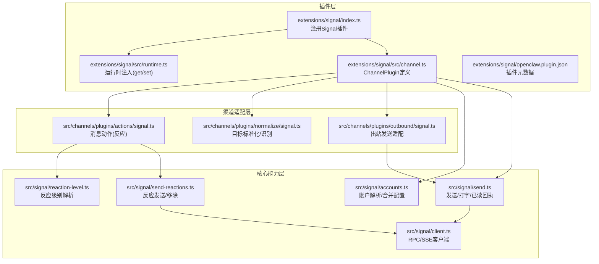
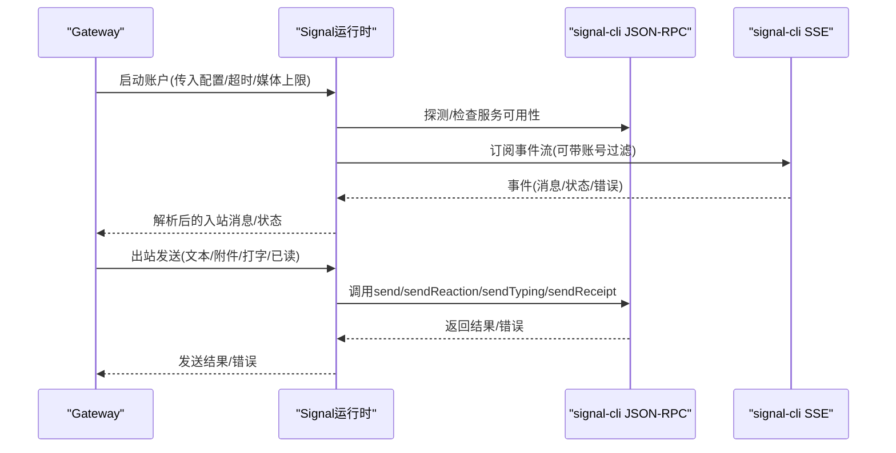
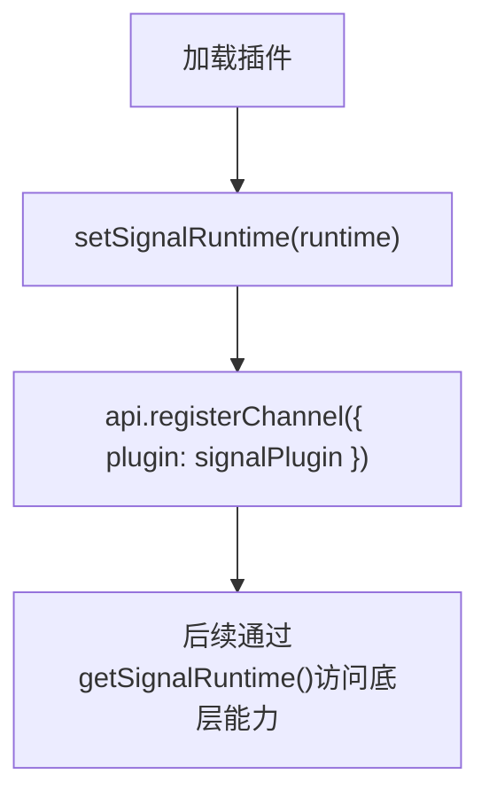
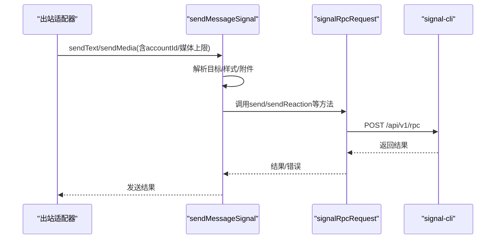
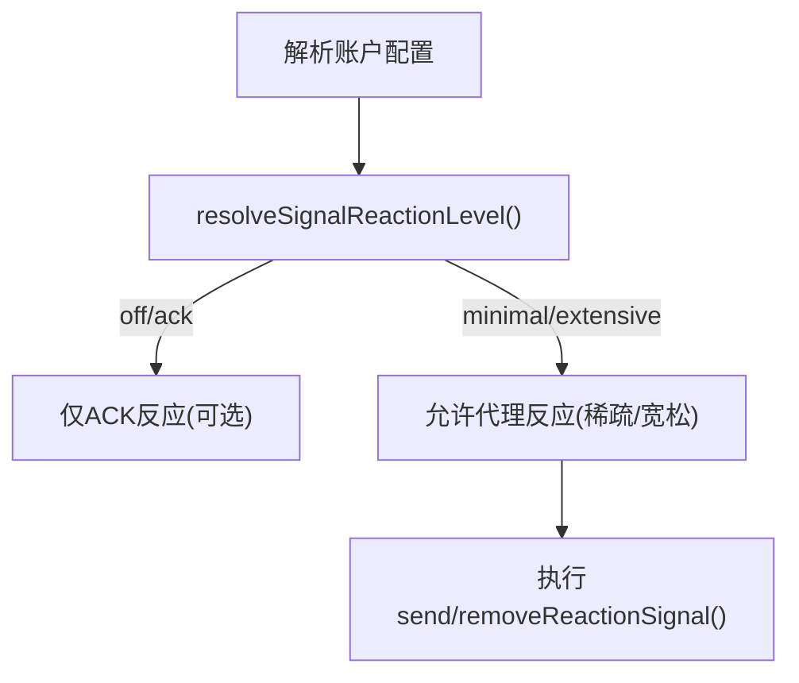
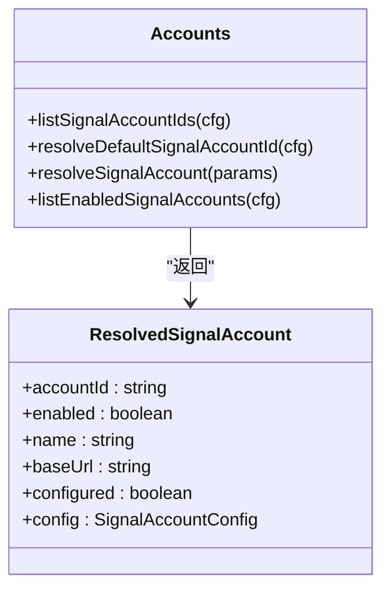
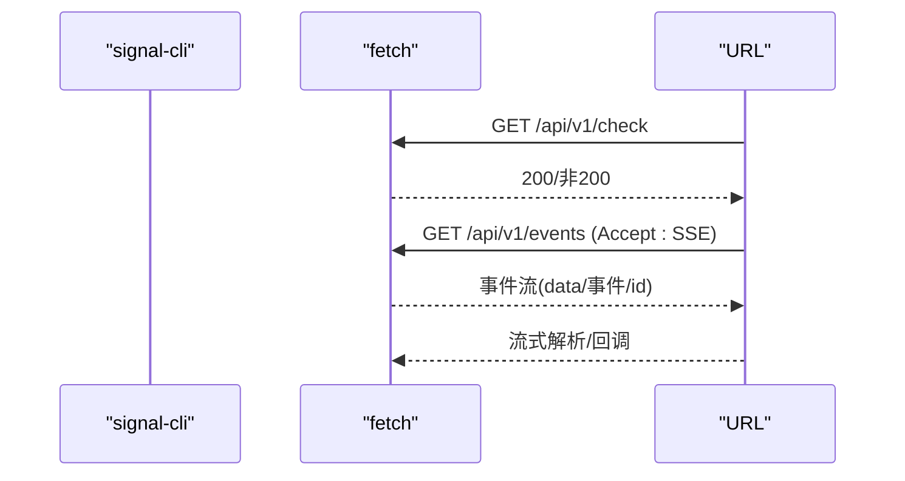
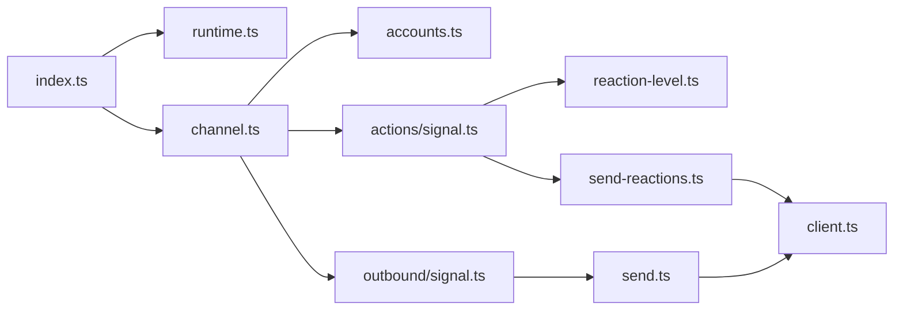

# Signal渠道集成

<cite>
**本文引用的文件**
- [extensions/signal/index.ts](file://extensions/signal/index.ts)
- [extensions/signal/src/channel.ts](file://extensions/signal/src/channel.ts)
- [extensions/signal/src/runtime.ts](file://extensions/signal/src/runtime.ts)
- [extensions/signal/openclaw.plugin.json](file://extensions/signal/openclaw.plugin.json)
- [docs/channels/signal.md](file://docs/channels/signal.md)
- [src/channels/plugins/actions/signal.ts](file://src/channels/plugins/actions/signal.ts)
- [src/channels/plugins/normalize/signal.ts](file://src/channels/plugins/normalize/signal.ts)
- [src/channels/plugins/outbound/signal.ts](file://src/channels/plugins/outbound/signal.ts)
- [src/signal/accounts.ts](file://src/signal/accounts.ts)
- [src/signal/reaction-level.ts](file://src/signal/reaction-level.ts)
- [src/signal/send-reactions.ts](file://src/signal/send-reactions.ts)
- [src/signal/client.ts](file://src/signal/client.ts)
- [src/signal/send.ts](file://src/signal/send.ts)
</cite>

## 目录

1. [简介](#简介)
2. [项目结构](#项目结构)
3. [核心组件](#核心组件)
4. [架构总览](#架构总览)
5. [详细组件分析](#详细组件分析)
6. [依赖关系分析](#依赖关系分析)
7. [性能与网络要求](#性能与网络要求)
8. [故障排除指南](#故障排除指南)
9. [结论](#结论)
10. [附录：配置参考](#附录配置参考)

## 简介

本文件面向OpenClaw的Signal渠道集成，系统性阐述Signal Desktop API（通过signal-cli）的对接方式，覆盖设备连接、消息同步、端到端加密处理、消息反应、联系人与群组管理等特性，并给出配置项、认证与配对流程、隐私保护策略、API限制与网络要求、以及故障排除与隐私最佳实践。

## 项目结构

Signal渠道由“插件入口 + 渠道适配器 + 运行时注入 + 核心发送/接收能力 + 配置解析”构成，采用分层设计：

- 插件入口负责注册渠道并注入运行时
- 渠道适配器定义消息动作、配对、能力、安全策略、消息目标解析、出站发送等
- 运行时通过全局单例持有底层Signal能力（RPC/SSE）
- 核心能力包括：RPC请求、SSE事件流、消息发送、媒体处理、反应发送、打字态与已读回执



图表来源

- [extensions/signal/index.ts](file://extensions/signal/index.ts#L1-L18)
- [extensions/signal/src/channel.ts](file://extensions/signal/src/channel.ts#L1-L322)
- [extensions/signal/src/runtime.ts](file://extensions/signal/src/runtime.ts#L1-L15)
- [src/channels/plugins/actions/signal.ts](file://src/channels/plugins/actions/signal.ts#L1-L147)
- [src/channels/plugins/normalize/signal.ts](file://src/channels/plugins/normalize/signal.ts#L1-L61)
- [src/channels/plugins/outbound/signal.ts](file://src/channels/plugins/outbound/signal.ts#L1-L41)
- [src/signal/accounts.ts](file://src/signal/accounts.ts#L1-L92)
- [src/signal/reaction-level.ts](file://src/signal/reaction-level.ts#L1-L72)
- [src/signal/client.ts](file://src/signal/client.ts#L1-L196)
- [src/signal/send.ts](file://src/signal/send.ts#L1-L282)
- [src/signal/send-reactions.ts](file://src/signal/send-reactions.ts#L1-L216)

章节来源

- [extensions/signal/index.ts](file://extensions/signal/index.ts#L1-L18)
- [extensions/signal/src/channel.ts](file://extensions/signal/src/channel.ts#L1-L322)
- [extensions/signal/src/runtime.ts](file://extensions/signal/src/runtime.ts#L1-L15)
- [extensions/signal/openclaw.plugin.json](file://extensions/signal/openclaw.plugin.json#L1-L10)

## 核心组件

- 插件注册与运行时注入：插件在注册时设置运行时实例，并向框架注册Signal渠道
- 渠道适配器：定义消息动作、配对、能力、安全策略、消息目标解析、出站发送、状态与网关启动
- 账户解析：合并全局与账户级配置，计算基础URL、是否已配置、启用状态等
- RPC/SSE客户端：封装signal-cli JSON-RPC与SSE事件流
- 发送能力：文本/富文本、附件、打字态、已读回执
- 反应能力：按级别控制是否允许代理自动反应，支持添加/移除反应
- 目标标准化：统一解析signal:+E.164、uuid、group、username等格式

章节来源

- [extensions/signal/src/channel.ts](file://extensions/signal/src/channel.ts#L42-L322)
- [src/signal/accounts.ts](file://src/signal/accounts.ts#L1-L92)
- [src/signal/client.ts](file://src/signal/client.ts#L50-L196)
- [src/signal/send.ts](file://src/signal/send.ts#L133-L282)
- [src/signal/send-reactions.ts](file://src/signal/send-reactions.ts#L91-L216)
- [src/channels/plugins/actions/signal.ts](file://src/channels/plugins/actions/signal.ts#L41-L147)
- [src/channels/plugins/normalize/signal.ts](file://src/channels/plugins/normalize/signal.ts#L1-L61)

## 架构总览

Signal渠道通过signal-cli提供JSON-RPC接口与SSE事件流，OpenClaw以“外部CLI模式”接入，不直接嵌入libsignal，而是通过HTTP调用与事件订阅完成消息收发与状态管理。



图表来源

- [extensions/signal/src/channel.ts](file://extensions/signal/src/channel.ts#L304-L321)
- [src/signal/client.ts](file://src/signal/client.ts#L114-L196)
- [src/signal/send.ts](file://src/signal/send.ts#L133-L282)
- [src/signal/send-reactions.ts](file://src/signal/send-reactions.ts#L91-L216)

## 详细组件分析

### 插件注册与运行时注入

- 注册阶段：设置运行时实例，注册ChannelPlugin
- 运行时：通过全局单例保存/获取底层能力（消息动作、发送、探测、监控）



图表来源

- [extensions/signal/index.ts](file://extensions/signal/index.ts#L6-L15)
- [extensions/signal/src/runtime.ts](file://extensions/signal/src/runtime.ts#L5-L14)

章节来源

- [extensions/signal/index.ts](file://extensions/signal/index.ts#L1-L18)
- [extensions/signal/src/runtime.ts](file://extensions/signal/src/runtime.ts#L1-L15)

### 渠道适配器：能力、配对、安全与消息目标

- 能力：支持直聊与群聊、媒体、反应
- 配对：支持配对批准提示、配对码展示与审批
- 安全：DM策略（默认配对）、允许来源白名单、群组策略与告警
- 目标解析：支持signal:+E.164、uuid、group、username等格式

```mermaid
flowchart TD
S["入站消息"] --> N["normalizeSignalMessagingTarget()"]
N --> T{"类型判定"}
T --> |直聊(E.164/uuid)| D["直聊会话路由"]
T --> |群组(group/username)| G["群组会话路由"]
D --> R["反应/发送/状态处理"]
G --> R
```

图表来源

- [src/channels/plugins/normalize/signal.ts](file://src/channels/plugins/normalize/signal.ts#L1-L61)
- [extensions/signal/src/channel.ts](file://extensions/signal/src/channel.ts#L131-L137)

章节来源

- [extensions/signal/src/channel.ts](file://extensions/signal/src/channel.ts#L42-L137)
- [src/channels/plugins/normalize/signal.ts](file://src/channels/plugins/normalize/signal.ts#L1-L61)

### 出站发送与媒体处理

- 文本分片：默认4000字符，支持按空行切分后再长度切分
- 媒体：下载并本地保存，限制最大字节，避免空正文发送
- 发送：统一封装为signal-cli JSON-RPC调用



图表来源

- [src/channels/plugins/outbound/signal.ts](file://src/channels/plugins/outbound/signal.ts#L6-L41)
- [src/signal/send.ts](file://src/signal/send.ts#L133-L225)
- [src/signal/client.ts](file://src/signal/client.ts#L50-L87)

章节来源

- [src/channels/plugins/outbound/signal.ts](file://src/channels/plugins/outbound/signal.ts#L1-L41)
- [src/signal/send.ts](file://src/signal/send.ts#L1-L282)
- [src/signal/client.ts](file://src/signal/client.ts#L1-L196)

### 反应与级别控制

- 动作列表：根据账户启用与动作开关决定是否暴露“react”
- 级别解析：off/ack/minimal/extensive，决定ACK反应与代理反应行为
- 发送/移除：支持直聊与群组反应，群组需提供作者信息



图表来源

- [src/channels/plugins/actions/signal.ts](file://src/channels/plugins/actions/signal.ts#L41-L147)
- [src/signal/reaction-level.ts](file://src/signal/reaction-level.ts#L25-L71)
- [src/signal/send-reactions.ts](file://src/signal/send-reactions.ts#L91-L216)

章节来源

- [src/channels/plugins/actions/signal.ts](file://src/channels/plugins/actions/signal.ts#L1-L147)
- [src/signal/reaction-level.ts](file://src/signal/reaction-level.ts#L1-L72)
- [src/signal/send-reactions.ts](file://src/signal/send-reactions.ts#L1-L216)

### 账户解析与多账户支持

- 支持默认账户与多账户；合并全局与账户级配置
- 计算基础URL（httpHost/httpPort或httpUrl），判断是否已配置/启用



图表来源

- [src/signal/accounts.ts](file://src/signal/accounts.ts#L5-L92)

章节来源

- [src/signal/accounts.ts](file://src/signal/accounts.ts#L1-L92)

### RPC与SSE：连接、探测与事件流

- RPC：封装JSON-RPC 2.0，支持超时与错误解析
- 检查：/api/v1/check健康检查
- SSE：/api/v1/events事件流，支持账号过滤与中断信号



图表来源

- [src/signal/client.ts](file://src/signal/client.ts#L89-L196)

章节来源

- [src/signal/client.ts](file://src/signal/client.ts#L1-L196)

## 依赖关系分析

- 插件入口依赖运行时注入与ChannelPlugin注册
- 渠道适配器依赖账户解析、消息动作、出站适配、运行时能力
- 核心能力之间存在清晰边界：RPC/SSE独立于发送/反应逻辑
- 多账户与配置合并遵循“账户优先”的策略



图表来源

- [extensions/signal/index.ts](file://extensions/signal/index.ts#L1-L18)
- [extensions/signal/src/channel.ts](file://extensions/signal/src/channel.ts#L1-L322)
- [src/signal/accounts.ts](file://src/signal/accounts.ts#L1-L92)
- [src/channels/plugins/actions/signal.ts](file://src/channels/plugins/actions/signal.ts#L1-L147)
- [src/channels/plugins/outbound/signal.ts](file://src/channels/plugins/outbound/signal.ts#L1-L41)
- [src/signal/reaction-level.ts](file://src/signal/reaction-level.ts#L1-L72)
- [src/signal/send-reactions.ts](file://src/signal/send-reactions.ts#L1-L216)
- [src/signal/send.ts](file://src/signal/send.ts#L1-L282)
- [src/signal/client.ts](file://src/signal/client.ts#L1-L196)

章节来源

- [extensions/signal/src/channel.ts](file://extensions/signal/src/channel.ts#L1-L322)
- [src/signal/accounts.ts](file://src/signal/accounts.ts#L1-L92)

## 性能与网络要求

- 启动等待：支持startupTimeoutMs，避免过长等待
- 文本分片：默认4000字符，可开启按空行切分以提升可读性
- 媒体上限：默认8MB，可通过账户或全局配置调整
- 网络要求：HTTP JSON-RPC与SSE，建议内网或本地绑定，减少延迟
- 打字态与已读回执：按需启用，减少不必要的RPC调用

章节来源

- [docs/channels/signal.md](file://docs/channels/signal.md#L101-L140)
- [src/signal/send.ts](file://src/signal/send.ts#L149-L160)
- [src/channels/plugins/outbound/signal.ts](file://src/channels/plugins/outbound/signal.ts#L8-L10)

## 故障排除指南

- 基础排查：使用status/gateway status/logs doctor/channels status --probe
- 配对状态：查询/批准配对码，确认dmPolicy与allowFrom
- 常见问题：
  - 守护进程可达但无回复：核对account/httpUrl与receiveMode
  - DM被忽略：发送方待配对批准
  - 群消息被忽略：群策略/允许来源限制
- 外部守护进程：通过httpUrl指向已有signal-cli实例，关闭autoStart

章节来源

- [docs/channels/signal.md](file://docs/channels/signal.md#L171-L196)

## 结论

Signal渠道通过external CLI模式与signal-cli交互，具备完善的入站/出站、反应、媒体与安全策略能力。其多账户、分片与限流设计兼顾易用性与稳定性，配合严格的配对与白名单策略，满足私域机器人在Signal上的安全运行需求。

## 附录：配置参考

- 启用与账户：enabled、account、cliPath、httpUrl、httpHost、httpPort、autoStart、startupTimeoutMs
- 安全策略：dmPolicy、allowFrom、groupPolicy、groupAllowFrom
- 行为与媒体：receiveMode、ignoreAttachments、ignoreStories、sendReadReceipts、textChunkLimit、chunkMode、mediaMaxMb
- 历史上下文：historyLimit、dmHistoryLimit、dms["<id>"].historyLimit
- 反应：actions.reactions、reactionLevel
- 其他：configWrites、markdown表格模式

章节来源

- [docs/channels/signal.md](file://docs/channels/signal.md#L197-L229)
- [extensions/signal/openclaw.plugin.json](file://extensions/signal/openclaw.plugin.json#L1-L10)
