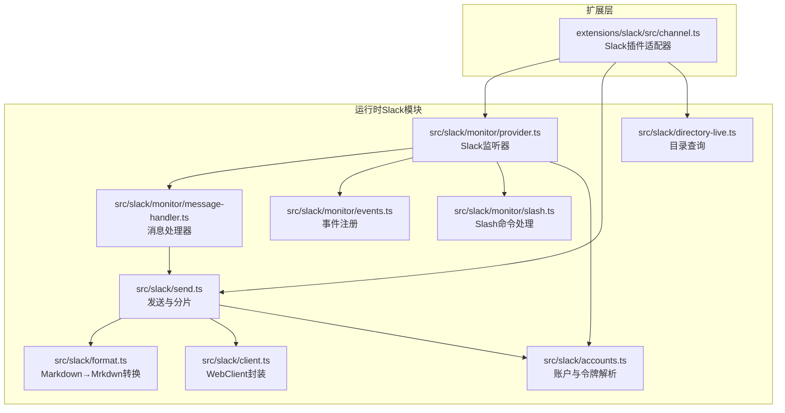
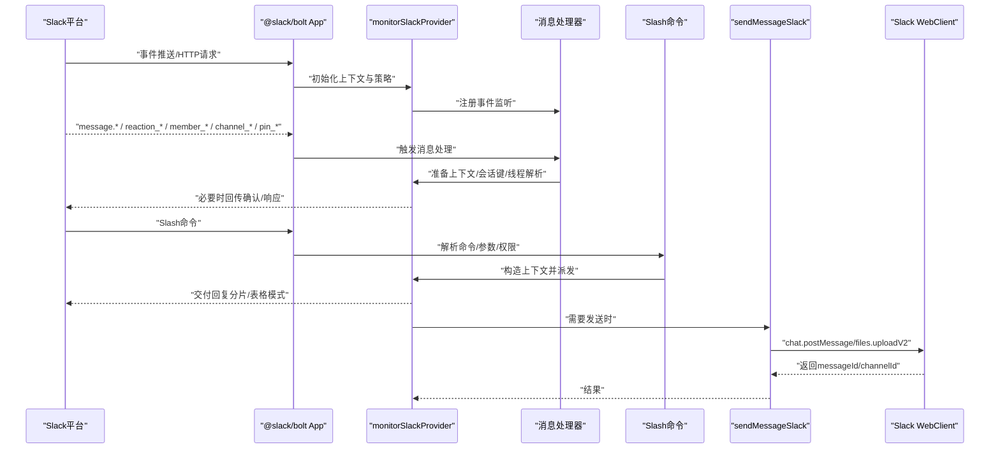
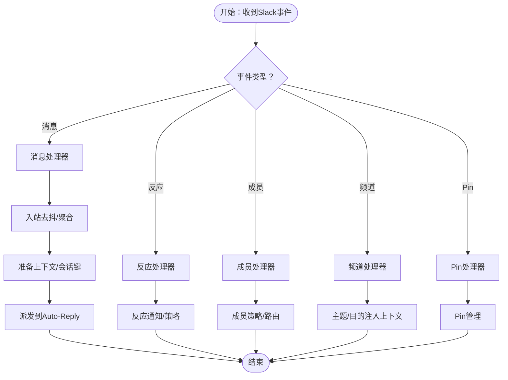
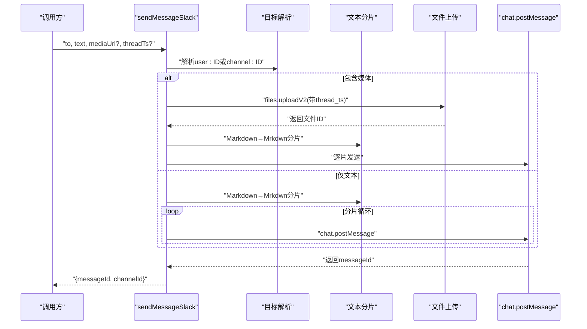
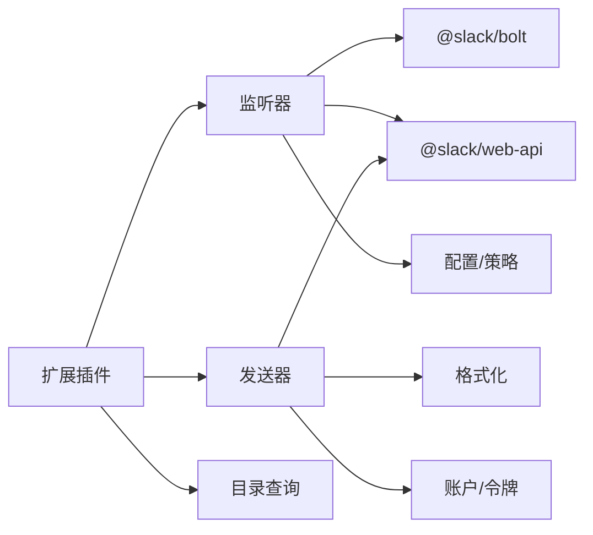

# Slack渠道集成

<cite>
**本文引用的文件**
- [docs/channels/slack.md](file://docs/channels/slack.md)
- [src/slack/index.ts](file://src/slack/index.ts)
- [src/slack/monitor.ts](file://src/slack/monitor.ts)
- [src/slack/client.ts](file://src/slack/client.ts)
- [src/slack/accounts.ts](file://src/slack/accounts.ts)
- [src/slack/format.ts](file://src/slack/format.ts)
- [src/slack/send.ts](file://src/slack/send.ts)
- [src/slack/monitor/provider.ts](file://src/slack/monitor/provider.ts)
- [src/slack/monitor/events.ts](file://src/slack/monitor/events.ts)
- [src/slack/monitor/message-handler.ts](file://src/slack/monitor/message-handler.ts)
- [src/slack/monitor/slash.ts](file://src/slack/monitor/slash.ts)
- [extensions/slack/src/channel.ts](file://extensions/slack/src/channel.ts)
- [src/config/types.slack.ts](file://src/config/types.slack.ts)
- [src/config/zod-schema.providers-core.ts](file://src/config/zod-schema.providers-core.ts)
- [src/slack/directory-live.ts](file://src/slack/directory-live.ts)
</cite>

## 目录

1. [简介](#简介)
2. [项目结构](#项目结构)
3. [核心组件](#核心组件)
4. [架构总览](#架构总览)
5. [详细组件分析](#详细组件分析)
6. [依赖关系分析](#依赖关系分析)
7. [性能考量](#性能考量)
8. [故障排除指南](#故障排除指南)
9. [结论](#结论)
10. [附录](#附录)

## 简介

本技术文档面向OpenClaw的Slack渠道集成，系统性阐述Slack API的接入与运行机制，涵盖应用创建、OAuth与令牌模型、Socket Mode与HTTP Events API两种模式、事件订阅与实时消息处理、块元素渲染与Markdown适配、用户与群组解析、文件上传与媒体分片、线程与会话路由、权限与访问控制、通道与DM策略、命令与Slash交互、以及多账户配置与运行时监控等。文档同时给出事件流、类图与流程图，帮助开发者快速理解并部署。

## 项目结构

OpenClaw的Slack集成由“运行时Slack模块”和“扩展插件”两部分组成：

- 运行时Slack模块（src/slack/\*）：负责连接Slack、事件监听、消息处理、发送、格式化、目录查询、令牌解析、线程与回复策略等。
- 扩展Slack插件（extensions/slack/src/channel.ts）：作为OpenClaw插件SDK的Slack适配器，暴露能力、安全策略、目标解析、动作门控、多账户配置与状态上报等。

图表来源

- [extensions/slack/src/channel.ts](file://extensions/slack/src/channel.ts#L54-L99)
- [src/slack/monitor/provider.ts](file://src/slack/monitor/provider.ts#L42-L218)
- [src/slack/monitor/message-handler.ts](file://src/slack/monitor/message-handler.ts#L19-L118)
- [src/slack/monitor/events.ts](file://src/slack/monitor/events.ts#L10-L23)
- [src/slack/monitor/slash.ts](file://src/slack/monitor/slash.ts#L142-L553)
- [src/slack/send.ts](file://src/slack/send.ts#L127-L207)
- [src/slack/format.ts](file://src/slack/format.ts#L97-L147)
- [src/slack/accounts.ts](file://src/slack/accounts.ts#L74-L114)
- [src/slack/client.ts](file://src/slack/client.ts#L11-L20)
- [src/slack/directory-live.ts](file://src/slack/directory-live.ts#L1-L56)

章节来源

- [extensions/slack/src/channel.ts](file://extensions/slack/src/channel.ts#L54-L99)
- [src/slack/monitor/provider.ts](file://src/slack/monitor/provider.ts#L42-L218)

## 核心组件

- 插件适配器（SlackPlugin）
  - 能力声明：支持direct/channel/thread、反应、线程、媒体、原生命令。
  - 配置与重载：基于通道配置模式构建，支持按前缀热重载。
  - 安全与策略：DM策略、通道策略、访问白名单、配对提示。
  - 动作门控：根据actions.\*开关暴露react/read/edit/delete/pin/unpin/list-pins/member-info/emoji-list等。
  - 多账户：列出账户、默认账户解析、启用/删除账户、描述账户。
  - 发送与媒体：直发文本或带媒体；自动选择写入令牌（优先机器人令牌，必要时可回退到用户令牌）。
- 监听器（monitorSlackProvider）
  - 模式选择：Socket Mode或HTTP Events API。
  - 认证与校验：解析bot/app token，auth.test获取botUserId/teamId/api_app_id，token一致性检查。
  - 上下文与策略：DM/通道策略、提及要求、回复模式、线程历史范围、文本分片限制、媒体大小限制、反应通知模式。
  - 事件注册：消息、反应、成员、频道、Pin事件。
  - Slash命令：原生命令或单命令模式，交互式参数菜单。
  - 允许列表解析：启动时尝试解析通道与用户允许列表，保留未解析项。
- 发送器（sendMessageSlack）
  - 目标解析：user:ID或channel:ID，私聊通过conversations.open获取channelId。
  - 文本分片：Markdown→Slack Mrkdwn，按长度或段落切分，限制最大4000字符。
  - 媒体上传：files.uploadV2，支持thread_ts，受mediaMaxMb限制。
  - 令牌选择：优先机器人令牌，必要时回退到用户令牌（需非只读且可用）。
- 格式化（markdownToSlackMrkdwn）
  - 保留Slack允许的尖括号标记（@用户/#频道/!emoji/mailto/tel/http/https/slack://），其余转义。
  - 渲染粗体/斜体/删除线/代码/代码块/链接等。
- 账户与令牌（accounts.ts/token.ts）
  - 支持多账户合并配置，环境变量仅默认账户可用。
  - 解析botToken/appToken，区分来源（config/env/none）。
  - 写操作优先机器人令牌；当用户令牌非只读且不可用时才回退。
- 目录查询（directory-live.ts）
  - 使用用户令牌或机器人令牌读取用户/频道列表，排序与归一化。
- 客户端封装（client.ts）
  - 默认重试策略，统一WebClient选项。

章节来源

- [extensions/slack/src/channel.ts](file://extensions/slack/src/channel.ts#L54-L99)
- [src/slack/monitor/provider.ts](file://src/slack/monitor/provider.ts#L42-L218)
- [src/slack/send.ts](file://src/slack/send.ts#L127-L207)
- [src/slack/format.ts](file://src/slack/format.ts#L97-L147)
- [src/slack/accounts.ts](file://src/slack/accounts.ts#L74-L114)
- [src/slack/directory-live.ts](file://src/slack/directory-live.ts#L1-L56)
- [src/slack/client.ts](file://src/slack/client.ts#L11-L20)

## 架构总览

下图展示从Slack事件到OpenClaw内部处理的总体流程，包括Socket Mode与HTTP Events API两种路径。

图表来源

- [src/slack/monitor/provider.ts](file://src/slack/monitor/provider.ts#L124-L218)
- [src/slack/monitor/events.ts](file://src/slack/monitor/events.ts#L10-L23)
- [src/slack/monitor/message-handler.ts](file://src/slack/monitor/message-handler.ts#L19-L118)
- [src/slack/monitor/slash.ts](file://src/slack/monitor/slash.ts#L142-L553)
- [src/slack/send.ts](file://src/slack/send.ts#L127-L207)

## 详细组件分析

### 组件A：Slack监听器与事件系统

- 模式与认证
  - Socket Mode：需要botToken与appToken；启动后进入长连接。
  - HTTP Events API：需要botToken与signingSecret；注册webhook路径，验证签名。
  - 认证测试：auth.test获取botUserId/teamId/api_app_id，进行token一致性校验。
- 事件注册
  - 消息事件：message.channels/groups/im/mpim/app_mention等。
  - 反应事件：reaction_added/reaction_removed。
  - 成员事件：member_joined_channel/member_left_channel。
  - 频道事件：channel_rename。
  - Pin事件：pin_added/pin_removed。
- 允许列表解析
  - 启动时尝试解析通道与用户允许列表，保留未解析条目并汇总映射。
- Slash命令
  - 原生命令：根据配置注册匹配的"/命令"。
  - 单命令模式：通过channels.slack.slashCommand启用。
  - 参数菜单：支持交互式按钮菜单，增强命令体验。
- 回复与线程
  - 入站去抖：同线程/同发送者聚合，避免风暴。
  - 线程TS解析：修复缺失thread_ts的场景。
  - 回复模式：支持off/first/all，按聊天类型覆盖。

图表来源

- [src/slack/monitor/events.ts](file://src/slack/monitor/events.ts#L10-L23)
- [src/slack/monitor/message-handler.ts](file://src/slack/monitor/message-handler.ts#L27-L99)
- [src/slack/monitor/slash.ts](file://src/slack/monitor/slash.ts#L142-L553)

章节来源

- [src/slack/monitor/provider.ts](file://src/slack/monitor/provider.ts#L42-L218)
- [src/slack/monitor/events.ts](file://src/slack/monitor/events.ts#L10-L23)
- [src/slack/monitor/message-handler.ts](file://src/slack/monitor/message-handler.ts#L19-L118)
- [src/slack/monitor/slash.ts](file://src/slack/monitor/slash.ts#L142-L553)

### 组件B：发送与块元素渲染

- 发送流程
  - 目标解析：user:ID或channel:ID，私聊通过conversations.open。
  - 文本分片：Markdown→Slack Mrkdwn，按长度或段落切分，上限4000字符。
  - 媒体上传：files.uploadV2，支持thread_ts，受mediaMaxMb限制。
  - 令牌选择：优先机器人令牌，必要时回退到用户令牌（需非只读且可用）。
- 块元素与Markdown适配
  - 保留Slack允许的尖括号标记（@用户/#频道/!emoji/mailto/tel/http/https/slack://）。
  - 渲染粗体/斜体/删除线/代码/代码块/链接等。
  - 表格模式：根据配置决定表格渲染策略。

图表来源

- [src/slack/send.ts](file://src/slack/send.ts#L127-L207)
- [src/slack/format.ts](file://src/slack/format.ts#L97-L147)

章节来源

- [src/slack/send.ts](file://src/slack/send.ts#L127-L207)
- [src/slack/format.ts](file://src/slack/format.ts#L97-L147)

### 组件C：权限模型与工作区管理

- 令牌模型
  - Socket Mode：botToken + appToken（必填）。
  - HTTP Mode：botToken + signingSecret（必填）。
  - 用户令牌：可选（userTokenReadOnly默认true），用于读操作；写操作优先机器人令牌。
  - 环境变量：仅默认账户可用（SLACK_BOT_TOKEN/SLACK_APP_TOKEN）。
- 访问控制
  - DM策略：pairing/allowlist/open/disabled，默认pairing。
  - 通道策略：open/allowlist/disabled，默认open（若未配置）。
  - 提及要求：requireMention默认开启，支持per-channel覆盖。
  - 用户白名单：channels.<id>.users允许特定用户在频道内触发。
  - 技能过滤：channels.<id>.skills限制可用技能。
- 配置写入
  - configWrites：允许通道发起的配置变更（如channel_id_changed迁移）。
- 多账户
  - 支持channels.slack.accounts.<id>独立配置，统一管理启停与状态。

章节来源

- [docs/channels/slack.md](file://docs/channels/slack.md#L123-L194)
- [src/config/types.slack.ts](file://src/config/types.slack.ts#L80-L149)
- [src/config/zod-schema.providers-core.ts](file://src/config/zod-schema.providers-core.ts#L462-L490)
- [src/slack/accounts.ts](file://src/slack/accounts.ts#L74-L114)

### 组件D：目录与用户/群组解析

- 目录查询
  - 使用用户令牌或机器人令牌读取用户/频道列表。
  - 排序规则：优先非bot、非app_user、非deleted用户。
- 允许列表解析
  - 启动时尝试解析通道与用户允许列表，保留未解析项并输出映射摘要。
- Live目录
  - 支持动态查询用户与群组，结合配置进行补充。

章节来源

- [src/slack/directory-live.ts](file://src/slack/directory-live.ts#L1-L56)
- [src/slack/monitor/provider.ts](file://src/slack/monitor/provider.ts#L219-L351)

### 组件E：Slack特有的功能实现

- 块元素与Markdown
  - Slack使用Mrkdwn，保留允许的尖括号标记，其余字符转义。
  - 支持粗体/斜体/删除线/代码/代码块/链接渲染。
- 文件共享
  - files.uploadV2上传，支持thread_ts；受mediaMaxMb限制。
- 会议集成
  - 通过Slack会议应用与Webex/Microsoft Teams等集成，OpenClaw侧不直接实现会议功能，但可配合Slack会议邀请与日历事件进行工作流编排。
- 用户群组
  - 支持MPIM（多用户私聊）与普通群组频道；DM策略与通道策略分别控制。

章节来源

- [src/slack/format.ts](file://src/slack/format.ts#L97-L147)
- [src/slack/send.ts](file://src/slack/send.ts#L90-L125)
- [docs/channels/slack.md](file://docs/channels/slack.md#L236-L262)

## 依赖关系分析

- 组件耦合
  - 插件适配器依赖运行时Slack模块的发送、目录、探测等能力。
  - 监听器依赖Bolt框架、WebClient、配置与策略模块。
  - 发送器依赖格式化模块与WebClient。
- 外部依赖
  - @slack/bolt：Socket Mode与HTTP Events API。
  - @slack/web-api：WebClient与files.uploadV2。
- 循环依赖
  - 未见直接循环依赖；事件注册与消息处理通过回调解耦。

图表来源

- [extensions/slack/src/channel.ts](file://extensions/slack/src/channel.ts#L54-L99)
- [src/slack/monitor/provider.ts](file://src/slack/monitor/provider.ts#L124-L145)
- [src/slack/send.ts](file://src/slack/send.ts#L127-L147)

章节来源

- [src/slack/index.ts](file://src/slack/index.ts#L1-L26)
- [src/slack/monitor.ts](file://src/slack/monitor.ts#L1-L6)

## 性能考量

- 重试策略
  - 默认重试2次，指数退避，最小/最大超时随机化，降低瞬时失败影响。
- 入站去抖
  - 同线程/同发送者聚合，减少风暴与重复处理。
- 文本分片
  - 默认4000字符上限，支持段落优先切分，避免截断句子。
- 媒体限制
  - 默认20MB，可通过mediaMaxMb调整，避免大文件阻塞。
- 并发与资源释放
  - HTTP模式注册webhook后及时注销；Socket模式在停止时关闭连接。
- 最佳实践
  - 尽量使用机器人令牌执行写操作；仅在必要时回退到用户令牌。
  - 合理设置groupPolicy与通道allowlist，降低无效负载。
  - 启用configWrites以支持动态配置迁移（谨慎使用）。

章节来源

- [src/slack/client.ts](file://src/slack/client.ts#L3-L16)
- [src/slack/monitor/message-handler.ts](file://src/slack/monitor/message-handler.ts#L27-L99)
- [src/slack/send.ts](file://src/slack/send.ts#L149-L167)
- [src/slack/monitor/provider.ts](file://src/slack/monitor/provider.ts#L353-L379)

## 故障排除指南

- 无回复（频道）
  - 检查groupPolicy、通道allowlist、requireMention、per-channel users allowlist。
  - 使用诊断命令与日志跟踪。
- DM被忽略
  - 检查dm.enabled与dm.policy，确认配对/白名单。
- Socket模式无法连接
  - 校验botToken/appToken与Slack应用设置中Socket Mode是否启用。
- HTTP模式未接收事件
  - 校验signingSecret、webhookPath、Request URL三处一致，确保每账户webhookPath唯一。
- 原生/单命令未触发
  - 确认native命令已注册且名称匹配；或启用单命令模式并正确配置slashCommand。
- 令牌不一致
  - 若api_app_id与appToken解析出的api_app_id不一致，需检查令牌来源。

章节来源

- [docs/channels/slack.md](file://docs/channels/slack.md#L374-L431)
- [src/slack/monitor/provider.ts](file://src/slack/monitor/provider.ts#L167-L171)

## 结论

OpenClaw的Slack集成以模块化设计实现了高可用的双向通信：通过@slack/bolt与WebClient完成事件订阅与消息发送；通过严格的令牌模型与策略体系保障安全；通过入站去抖、文本分片与媒体限制提升稳定性与性能。插件适配器进一步将这些能力暴露为OpenClaw通用通道接口，便于统一管理与扩展。

## 附录

- 配置参考要点
  - 模式与认证：mode、botToken、appToken、signingSecret、webhookPath、accounts.\*
  - DM访问：dm.enabled、dm.policy、dm.allowFrom、dm.groupEnabled、dm.groupChannels
  - 通道访问：groupPolicy、channels._、channels._.users、channels.\*.requireMention
  - 线程与历史：replyToMode、replyToModeByChatType、thread._、historyLimit、dmHistoryLimit、dms._.historyLimit
  - 投递与媒体：textChunkLimit、chunkMode、mediaMaxMb
  - 运维与特性：configWrites、commands.native、slashCommand._、actions._、userToken、userTokenReadOnly
- 企业版建议
  - 使用多账户隔离不同团队/租户，独立配置webhookPath。
  - 启用allowlist策略并定期审计通道与用户白名单。
  - 对写操作强制使用机器人令牌，用户令牌仅限只读场景。
  - 合理设置线程历史范围与初始历史限制，平衡上下文与性能。

章节来源

- [docs/channels/slack.md](file://docs/channels/slack.md#L433-L455)
- [src/config/types.slack.ts](file://src/config/types.slack.ts#L80-L149)
- [src/config/zod-schema.providers-core.ts](file://src/config/zod-schema.providers-core.ts#L462-L490)
