# Telegram渠道集成

<cite>
**本文档引用的文件**
- [src/telegram/index.ts](file://src/telegram/index.ts)
- [src/telegram/bot.ts](file://src/telegram/bot.ts)
- [src/telegram/webhook.ts](file://src/telegram/webhook.ts)
- [src/telegram/send.ts](file://src/telegram/send.ts)
- [src/telegram/bot-handlers.ts](file://src/telegram/bot-handlers.ts)
- [src/telegram/bot-message.ts](file://src/telegram/bot-message.ts)
- [src/telegram/bot-native-commands.ts](file://src/telegram/bot-native-commands.ts)
- [src/telegram/inline-buttons.ts](file://src/telegram/inline-buttons.ts)
- [src/telegram/format.ts](file://src/telegram/format.ts)
- [src/telegram/bot/delivery.ts](file://src/telegram/bot/delivery.ts)
- [src/telegram/bot-message-context.ts](file://src/telegram/bot-message-context.ts)
- [src/telegram/accounts.ts](file://src/telegram/accounts.ts)
- [src/telegram/bot-access.ts](file://src/telegram/bot-access.ts)
- [extensions/telegram/src/channel.ts](file://extensions/telegram/src/channel.ts)
- [docs/channels/telegram.md](file://docs/channels/telegram.md)
</cite>

## 目录

1. [简介](#简介)
2. [项目结构](#项目结构)
3. [核心组件](#核心组件)
4. [架构概览](#架构概览)
5. [详细组件分析](#详细组件分析)
6. [依赖关系分析](#依赖关系分析)
7. [性能考虑](#性能考虑)
8. [故障排除指南](#故障排除指南)
9. [结论](#结论)

## 简介

OpenClaw的Telegram渠道集成为用户提供了完整的Telegram Bot API集成解决方案。该集成支持多种通信模式，包括长轮询和Webhook模式，具备强大的消息处理能力，涵盖Inline键盘、媒体文件处理、群组管理、权限控制等Telegram特有功能。

本技术文档深入解析了Telegram渠道的完整实现，包括机器人创建、Webhook配置、消息处理机制、权限控制策略以及性能优化方案。

## 项目结构

OpenClaw的Telegram集成采用模块化设计，主要分为以下几个核心部分：

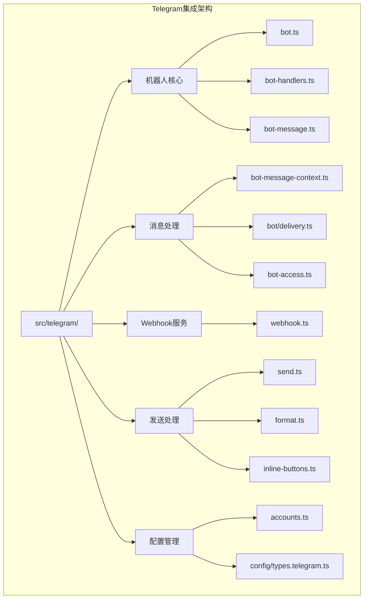

**图表来源**

- [src/telegram/index.ts](file://src/telegram/index.ts#L1-L5)
- [src/telegram/bot.ts](file://src/telegram/bot.ts#L1-L50)
- [src/telegram/webhook.ts](file://src/telegram/webhook.ts#L1-L30)

**章节来源**

- [src/telegram/index.ts](file://src/telegram/index.ts#L1-L5)
- [src/telegram/bot.ts](file://src/telegram/bot.ts#L1-L50)

## 核心组件

### 机器人核心组件

Telegram机器人的核心由以下关键组件构成：

1. **Bot实例管理**：负责创建和配置Telegram Bot实例
2. **更新处理器**：处理各种类型的Telegram更新事件
3. **消息路由系统**：根据会话类型和权限进行消息路由
4. **并发控制**：通过序列化确保消息处理的顺序性

### 消息处理组件

消息处理系统包含多个专门的处理器：

1. **上下文构建器**：将Telegram消息转换为内部统一格式
2. **权限验证器**：检查发送者权限和访问控制
3. **内容分发器**：将消息分发给相应的处理管道
4. **回复生成器**：创建和发送回复消息

### Webhook服务组件

Webhook服务提供了灵活的部署选项：

1. **HTTP服务器**：监听Webhook请求
2. **安全验证**：验证Webhook请求的真实性
3. **负载均衡**：支持多实例部署
4. **健康检查**：提供服务状态监控

**章节来源**

- [src/telegram/bot.ts](file://src/telegram/bot.ts#L112-L150)
- [src/telegram/bot-handlers.ts](file://src/telegram/bot-handlers.ts#L45-L90)
- [src/telegram/webhook.ts](file://src/telegram/webhook.ts#L19-L50)

## 架构概览

OpenClaw的Telegram集成采用分层架构设计，确保了高可扩展性和维护性：

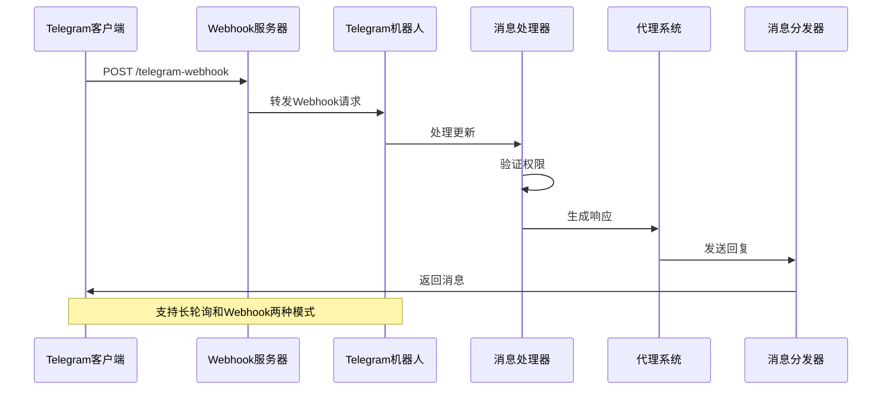

**图表来源**

- [src/telegram/webhook.ts](file://src/telegram/webhook.ts#L54-L97)
- [src/telegram/bot.ts](file://src/telegram/bot.ts#L477-L491)

### 数据流架构

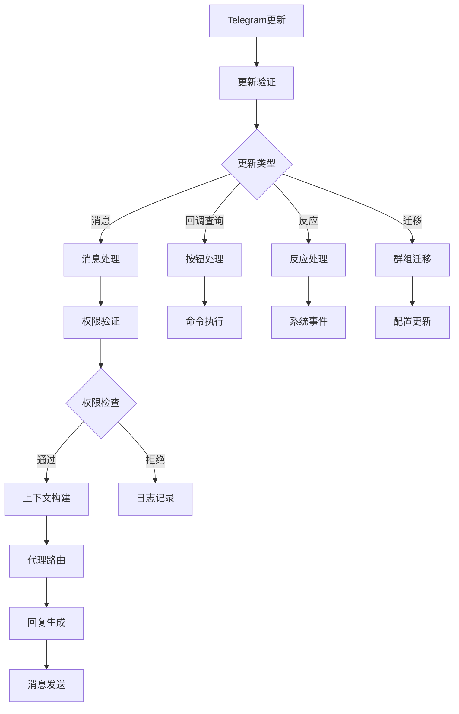

**图表来源**

- [src/telegram/bot-handlers.ts](file://src/telegram/bot-handlers.ts#L279-L400)
- [src/telegram/bot-message-context.ts](file://src/telegram/bot-message-context.ts#L129-L200)

## 详细组件分析

### 机器人创建与配置

机器人创建过程涉及多个配置层面：

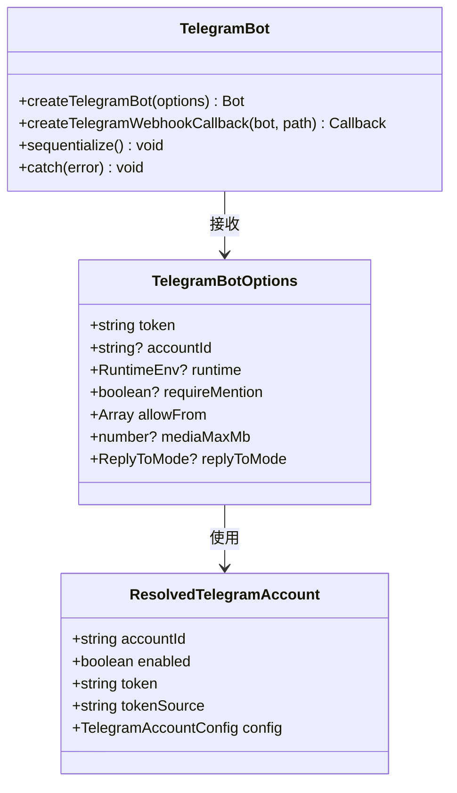

**图表来源**

- [src/telegram/bot.ts](file://src/telegram/bot.ts#L50-L65)
- [src/telegram/accounts.ts](file://src/telegram/accounts.ts#L14-L21)

#### 并发控制机制

机器人使用grammy的sequentialize功能确保消息处理的顺序性：

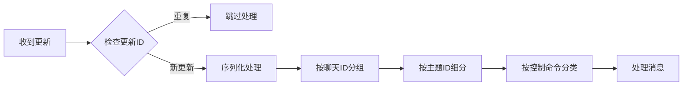

**图表来源**

- [src/telegram/bot.ts](file://src/telegram/bot.ts#L67-L110)

**章节来源**

- [src/telegram/bot.ts](file://src/telegram/bot.ts#L112-L150)
- [src/telegram/accounts.ts](file://src/telegram/accounts.ts#L85-L133)

### Webhook配置与处理

Webhook模式提供了更高效的实时通信方式：

#### Webhook启动流程

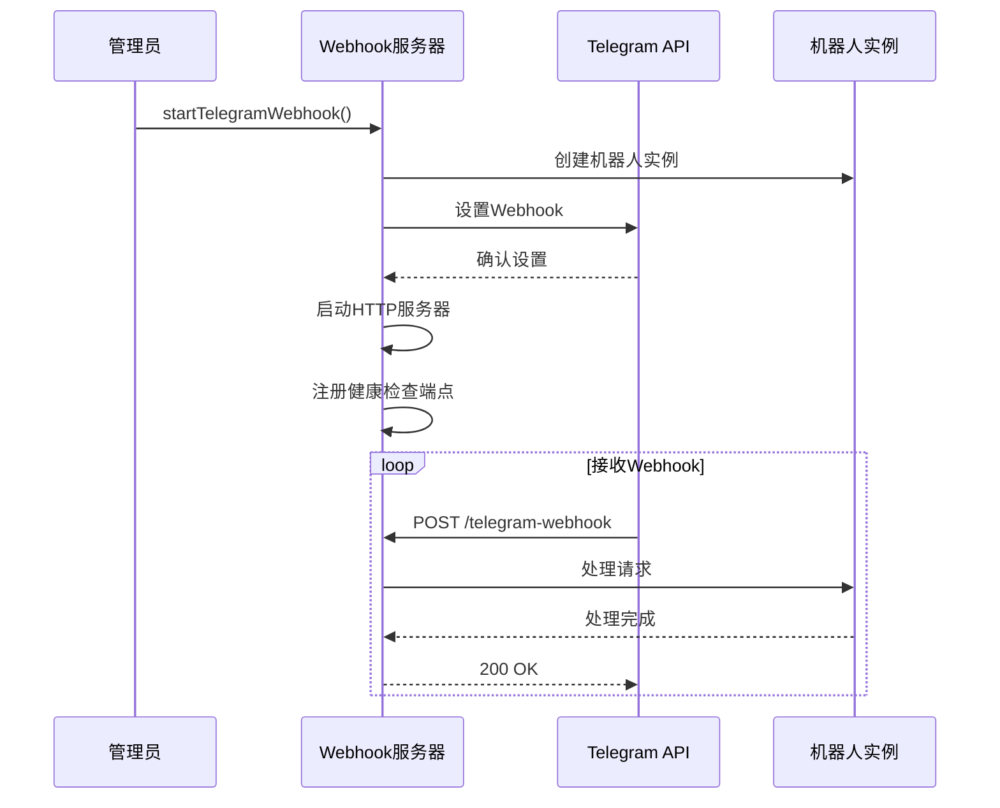

**图表来源**

- [src/telegram/webhook.ts](file://src/telegram/webhook.ts#L19-L50)

#### 安全验证机制

Webhook请求包含安全验证：

| 验证类型   | 描述             | 实现方式            |
| ---------- | ---------------- | ------------------- |
| 秘密令牌   | 防止恶意请求     | HMAC-SHA256签名验证 |
| 请求来源   | 确保来自Telegram | IP白名单检查        |
| 内容完整性 | 验证请求数据     | SHA256哈希校验      |

**章节来源**

- [src/telegram/webhook.ts](file://src/telegram/webhook.ts#L19-L128)

### 消息处理系统

消息处理系统是Telegram集成的核心，负责将Telegram消息转换为OpenClaw内部格式：

#### 上下文构建流程

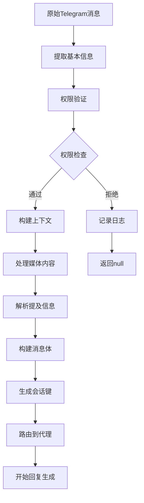

**图表来源**

- [src/telegram/bot-message-context.ts](file://src/telegram/bot-message-context.ts#L129-L200)

#### 权限控制系统

权限控制采用多层验证机制：

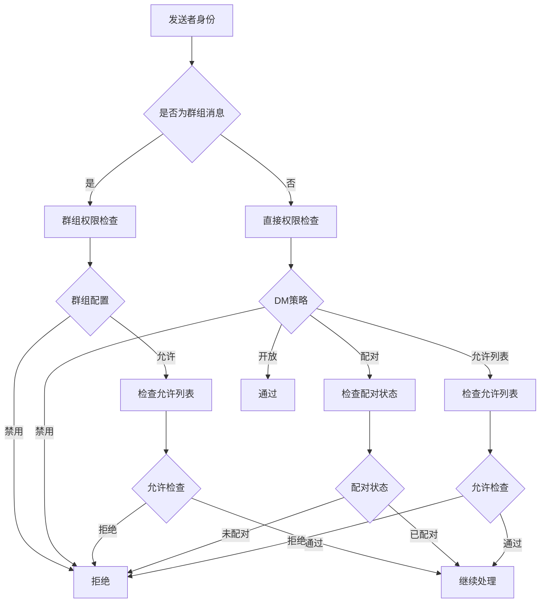

**图表来源**

- [src/telegram/bot-access.ts](file://src/telegram/bot-access.ts#L46-L95)

**章节来源**

- [src/telegram/bot-message-context.ts](file://src/telegram/bot-message-context.ts#L129-L745)
- [src/telegram/bot-access.ts](file://src/telegram/bot-access.ts#L1-L95)

### Inline键盘实现

Inline键盘是Telegram特有的交互功能：

#### 键盘作用域控制

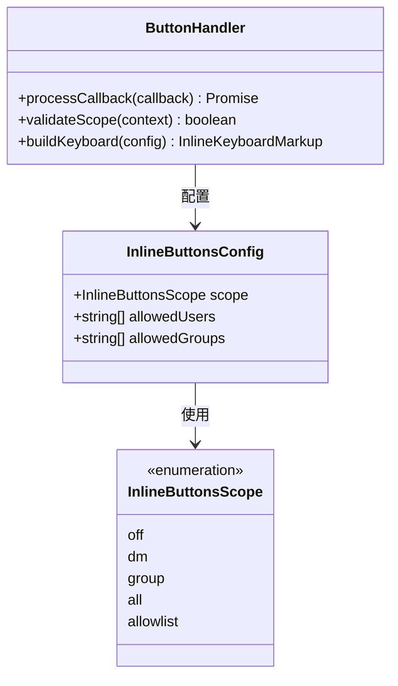

**图表来源**

- [src/telegram/inline-buttons.ts](file://src/telegram/inline-buttons.ts#L8-L23)

#### 按钮处理流程

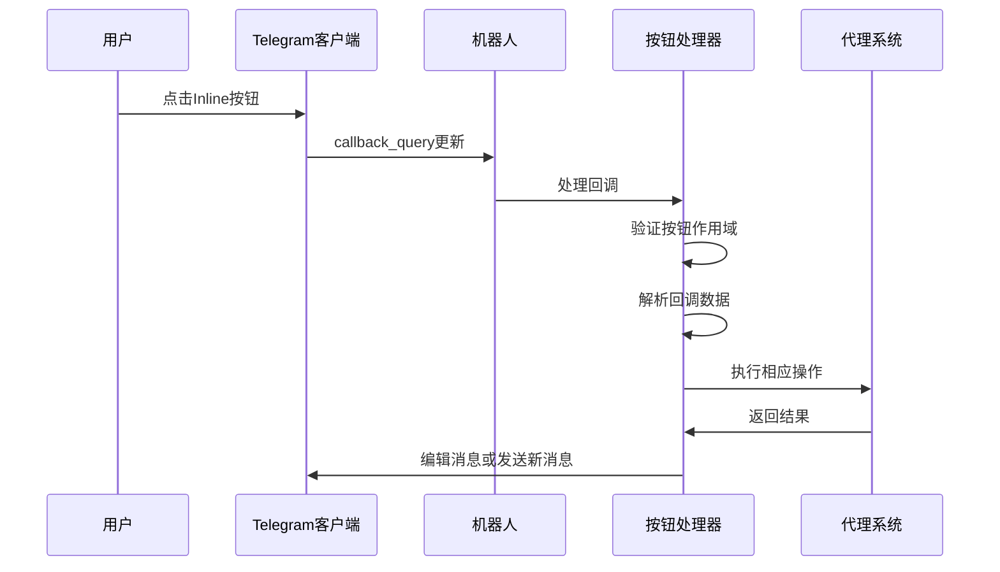

**图表来源**

- [src/telegram/bot-handlers.ts](file://src/telegram/bot-handlers.ts#L279-L350)

**章节来源**

- [src/telegram/inline-buttons.ts](file://src/telegram/inline-buttons.ts#L1-L82)
- [src/telegram/bot-handlers.ts](file://src/telegram/bot-handlers.ts#L279-L623)

### 媒体文件处理

Telegram媒体处理支持多种文件类型和格式：

#### 媒体类型支持

| 媒体类型 | 支持格式       | 特殊处理         |
| -------- | -------------- | ---------------- |
| 图片     | JPEG, PNG, GIF | 自动缩略图生成   |
| 视频     | MP4, GIF视频   | 视频备注特殊处理 |
| 音频     | MP3, M4A, OGG  | 语音消息支持     |
| 文档     | PDF, DOC, ZIP  | 大文件下载限制   |

#### 媒体处理流程

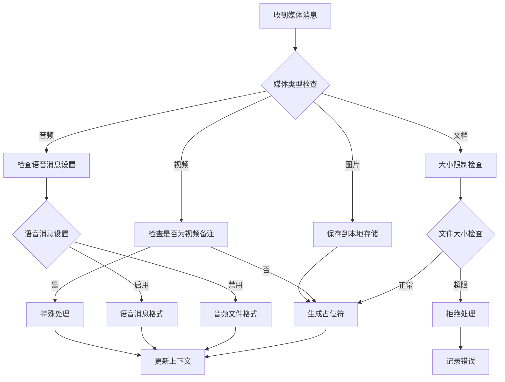

**图表来源**

- [src/telegram/bot/delivery.ts](file://src/telegram/bot/delivery.ts#L293-L435)

**章节来源**

- [src/telegram/bot/delivery.ts](file://src/telegram/bot/delivery.ts#L1-L552)

### 反应通知系统

Telegram反应通知提供了用户互动反馈机制：

#### 反应处理流程

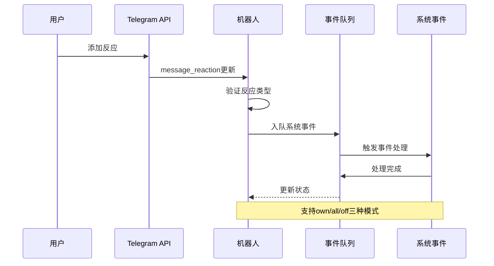

**图表来源**

- [src/telegram/bot.ts](file://src/telegram/bot.ts#L386-L475)

### 配置管理系统

配置系统支持灵活的账户管理和动态配置更新：

#### 账户配置层次

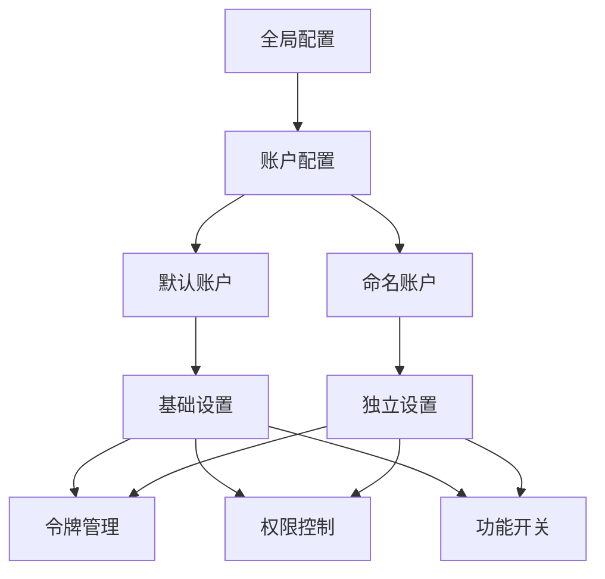

**图表来源**

- [src/telegram/accounts.ts](file://src/telegram/accounts.ts#L78-L83)

**章节来源**

- [src/telegram/accounts.ts](file://src/telegram/accounts.ts#L1-L140)

## 依赖关系分析

### 外部依赖

OpenClaw Telegram集成依赖以下关键外部库：

| 依赖库                          | 版本     | 用途                   |
| ------------------------------- | -------- | ---------------------- |
| grammY                          | 最新版本 | Telegram Bot API客户端 |
| @grammyjs/runner                | 最新版本 | 并发控制和序列化       |
| @grammyjs/transformer-throttler | 最新版本 | API调用节流            |
| @grammyjs/types                 | 最新版本 | TypeScript类型定义     |

### 内部模块依赖

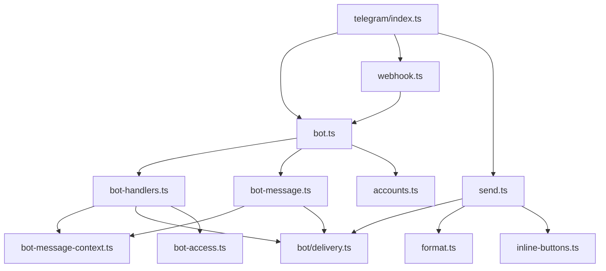

**图表来源**

- [src/telegram/index.ts](file://src/telegram/index.ts#L1-L5)

**章节来源**

- [src/telegram/index.ts](file://src/telegram/index.ts#L1-L5)

## 性能考虑

### 并发控制策略

系统采用多层并发控制确保性能和稳定性：

1. **更新去重**：防止重复处理相同的Telegram更新
2. **序列化处理**：按聊天ID和主题ID序列化消息处理
3. **API调用节流**：使用grammy的throttler限制API调用频率
4. **内存管理**：及时清理临时文件和缓存

### 优化建议

1. **批量处理**：对于大量相似更新，考虑批量处理以减少API调用
2. **缓存策略**：合理使用缓存减少重复计算
3. **连接池**：复用网络连接减少建立连接的开销
4. **异步处理**：将耗时操作异步化避免阻塞主线程

## 故障排除指南

### 常见问题诊断

#### Webhook配置问题

| 问题症状        | 可能原因       | 解决方案              |
| --------------- | -------------- | --------------------- |
| Webhook无法接收 | 秘密令牌不匹配 | 检查webhookSecret配置 |
| 请求超时        | 网络连接问题   | 验证防火墙和网络设置  |
| 404错误         | 路径配置错误   | 确认webhookPath设置   |
| 验证失败        | 证书问题       | 检查SSL证书有效性     |

#### 权限控制问题

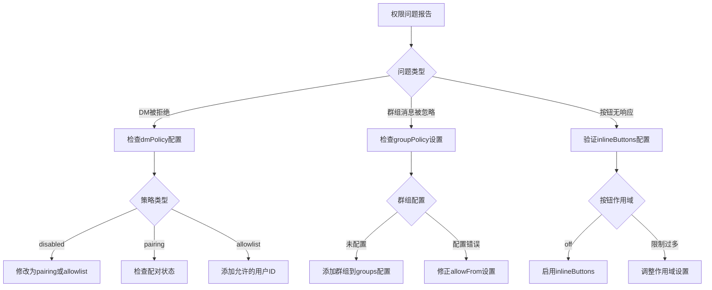

**图表来源**

- [src/telegram/bot-access.ts](file://src/telegram/bot-access.ts#L12-L25)

#### 媒体处理问题

| 问题类型     | 症状                     | 解决方案                   |
| ------------ | ------------------------ | -------------------------- |
| 媒体下载失败 | 文件过大或网络问题       | 增加mediaMaxMb或检查网络   |
| 格式不支持   | Telegram不支持的文件类型 | 转换为支持的格式           |
| 处理超时     | 大文件或复杂媒体         | 优化媒体文件或增加超时时间 |

**章节来源**

- [docs/channels/telegram.md](file://docs/channels/telegram.md#L626-L670)

### 调试工具

系统提供了丰富的调试工具：

1. **详细日志记录**：记录所有关键操作和错误信息
2. **状态监控**：实时监控机器人运行状态
3. **性能分析**：分析消息处理时间和资源使用
4. **配置验证**：验证配置文件的有效性

## 结论

OpenClaw的Telegram渠道集成为用户提供了企业级的Telegram集成解决方案。通过模块化的架构设计、完善的权限控制系统、灵活的消息处理机制以及全面的故障排除工具，该集成能够满足各种复杂的通信需求。

关键优势包括：

1. **高可靠性**：多层错误处理和恢复机制
2. **高性能**：智能并发控制和资源管理
3. **易扩展**：模块化设计支持功能扩展
4. **易维护**：清晰的代码结构和完整的文档

未来发展方向包括进一步优化性能、增强安全性以及提供更多定制化功能。通过持续改进，OpenClaw的Telegram集成将继续为用户提供卓越的服务体验。
