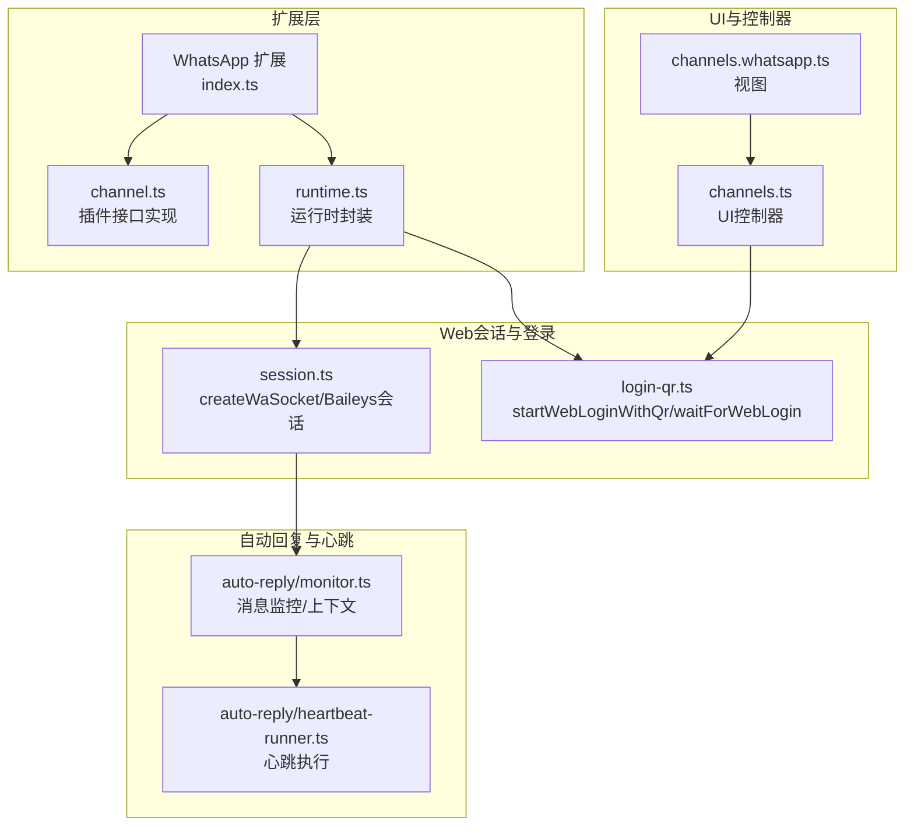
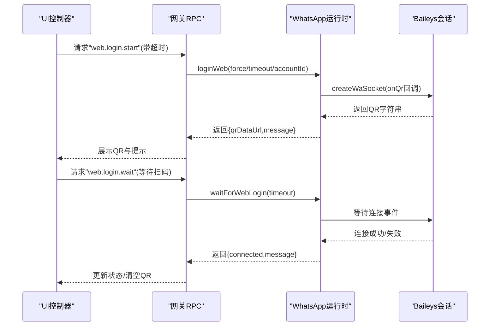
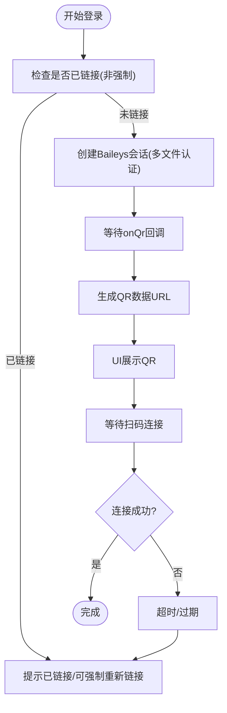
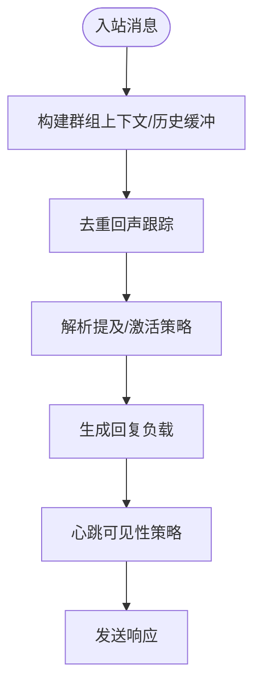
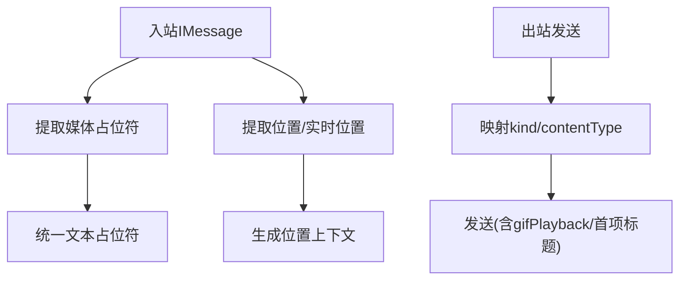

# WhatsApp渠道集成

<cite>
**本文引用的文件**
- [docs/channels/whatsapp.md](file://docs/channels/whatsapp.md)
- [extensions/whatsapp/index.ts](file://extensions/whatsapp/index.ts)
- [extensions/whatsapp/src/channel.ts](file://extensions/whatsapp/src/channel.ts)
- [extensions/whatsapp/src/runtime.ts](file://extensions/whatsapp/src/runtime.ts)
- [src/web/session.ts](file://src/web/session.ts)
- [src/web/login-qr.ts](file://src/web/login-qr.ts)
- [src/web/inbound.test.ts](file://src/web/inbound.test.ts)
- [src/web/outbound.test.ts](file://src/web/outbound.test.ts)
- [src/whatsapp/normalize.ts](file://src/whatsapp/normalize.ts)
- [src/channels/plugins/agent-tools/whatsapp-login.ts](file://src/channels/plugins/agent-tools/whatsapp-login.ts)
- [src/channels/plugins/onboarding/whatsapp.ts](file://src/channels/plugins/onboarding/whatsapp.ts)
- [ui/src/ui/controllers/channels.ts](file://ui/src/ui/controllers/channels.ts)
- [ui/src/ui/views/channels.whatsapp.ts](file://ui/src/ui/views/channels.whatsapp.ts)
- [src/web/auto-reply/monitor.ts](file://src/web/auto-reply/monitor.ts)
- [src/web/auto-reply/heartbeat-runner.ts](file://src/web/auto-reply/heartbeat-runner.ts)
- [src/infra/heartbeat-runner.respects-ackmaxchars-heartbeat-acks.test.ts](file://src/infra/heartbeat-runner.respects-ackmaxchars-heartbeat-acks.test.ts)
</cite>

## 目录

1. [简介](#简介)
2. [项目结构](#项目结构)
3. [核心组件](#核心组件)
4. [架构总览](#架构总览)
5. [详细组件分析](#详细组件分析)
6. [依赖关系分析](#依赖关系分析)
7. [性能考量](#性能考量)
8. [故障排除指南](#故障排除指南)
9. [结论](#结论)
10. [附录](#附录)

## 简介

本技术文档面向OpenClaw的WhatsApp渠道集成，聚焦于基于WhatsApp Web（Baileys）的业务实现，涵盖设备连接、消息同步、状态管理、多媒体消息、位置共享、语音消息以及视频通话相关能力与限制。文档同时记录配置选项、认证流程与设备配对机制，并提供网络与稳定性建议、故障排除与安全最佳实践。

## 项目结构

OpenClaw通过“插件 + 运行时 + 网关/Web会话”的方式实现WhatsApp渠道：

- 插件注册与导出：扩展层负责注册WhatsApp插件并注入运行时。
- 运行时封装：运行时封装了Baileys会话、登录、心跳、状态收集等能力。
- Web会话与登录：通过createWaSocket建立Baileys会话，startWebLoginWithQr/ waitForWebLogin完成QR登录与等待。
- UI控制器：前端控制器暴露“开始登录”“等待扫码”“登出”等操作。
- 自动回复与心跳：监控入站消息、构建上下文、按策略发送响应与心跳。
- 规范化与测试：针对目标地址规范化、入站媒体占位符、位置消息提取、出站媒体映射等进行测试覆盖。

图表来源

- [extensions/whatsapp/index.ts](file://extensions/whatsapp/index.ts#L1-L18)
- [extensions/whatsapp/src/channel.ts](file://extensions/whatsapp/src/channel.ts#L338-L410)
- [extensions/whatsapp/src/runtime.ts](file://extensions/whatsapp/src/runtime.ts#L1-L200)
- [src/web/session.ts](file://src/web/session.ts#L94-L165)
- [src/web/login-qr.ts](file://src/web/login-qr.ts#L108-L259)
- [ui/src/ui/controllers/channels.ts](file://ui/src/ui/controllers/channels.ts#L1-L94)
- [ui/src/ui/views/channels.whatsapp.ts](file://ui/src/ui/views/channels.whatsapp.ts#L65-L118)
- [src/web/auto-reply/monitor.ts](file://src/web/auto-reply/monitor.ts#L90-L126)
- [src/web/auto-reply/heartbeat-runner.ts](file://src/web/auto-reply/heartbeat-runner.ts#L29-L74)

章节来源

- [extensions/whatsapp/index.ts](file://extensions/whatsapp/index.ts#L1-L18)
- [src/web/session.ts](file://src/web/session.ts#L94-L165)
- [src/web/login-qr.ts](file://src/web/login-qr.ts#L108-L259)
- [ui/src/ui/controllers/channels.ts](file://ui/src/ui/controllers/channels.ts#L1-L94)
- [ui/src/ui/views/channels.whatsapp.ts](file://ui/src/ui/views/channels.whatsapp.ts#L65-L118)
- [src/web/auto-reply/monitor.ts](file://src/web/auto-reply/monitor.ts#L90-L126)
- [src/web/auto-reply/heartbeat-runner.ts](file://src/web/auto-reply/heartbeat-runner.ts#L29-L74)

## 核心组件

- 插件注册与通道实现
  - 扩展入口注册WhatsApp插件，注入运行时并注册通道。
  - 通道实现提供消息发送、投票发送、登录、心跳检查、状态汇总等能力。
- 运行时封装
  - 运行时封装createWaSocket、webAuthExists、loginWeb、send...等方法，供插件调用。
- Baileys会话与登录
  - createWaSocket基于多文件认证存储创建会话，处理连接更新、错误事件。
  - startWebLoginWithQr生成QR，waitForWebLogin等待扫码成功。
- UI控制器与视图
  - 控制器暴露“开始登录/等待扫码/登出”，视图渲染QR与按钮。
- 自动回复与心跳
  - 监控器收集群组历史、构建上下文、去重回声、解析提及配置。
  - 心跳执行器按可见性策略发送心跳消息。

章节来源

- [extensions/whatsapp/index.ts](file://extensions/whatsapp/index.ts#L1-L18)
- [extensions/whatsapp/src/channel.ts](file://extensions/whatsapp/src/channel.ts#L338-L410)
- [extensions/whatsapp/src/runtime.ts](file://extensions/whatsapp/src/runtime.ts#L1-L200)
- [src/web/session.ts](file://src/web/session.ts#L94-L165)
- [src/web/login-qr.ts](file://src/web/login-qr.ts#L108-L259)
- [ui/src/ui/controllers/channels.ts](file://ui/src/ui/controllers/channels.ts#L1-L94)
- [ui/src/ui/views/channels.whatsapp.ts](file://ui/src/ui/views/channels.whatsapp.ts#L65-L118)
- [src/web/auto-reply/monitor.ts](file://src/web/auto-reply/monitor.ts#L90-L126)
- [src/web/auto-reply/heartbeat-runner.ts](file://src/web/auto-reply/heartbeat-runner.ts#L29-L74)

## 架构总览

WhatsApp渠道采用“网关持有会话”的架构模式，确保连接稳定与重连可控。登录阶段通过QR完成设备配对，运行期通过Web监听器接收消息并进行自动回复与心跳维护。

图表来源

- [ui/src/ui/controllers/channels.ts](file://ui/src/ui/controllers/channels.ts#L29-L77)
- [src/web/login-qr.ts](file://src/web/login-qr.ts#L108-L259)
- [src/web/session.ts](file://src/web/session.ts#L94-L165)
- [extensions/whatsapp/src/runtime.ts](file://extensions/whatsapp/src/runtime.ts#L1-L200)

章节来源

- [ui/src/ui/controllers/channels.ts](file://ui/src/ui/controllers/channels.ts#L29-L77)
- [src/web/login-qr.ts](file://src/web/login-qr.ts#L108-L259)
- [src/web/session.ts](file://src/web/session.ts#L94-L165)
- [extensions/whatsapp/src/runtime.ts](file://extensions/whatsapp/src/runtime.ts#L1-L200)

## 详细组件分析

### 设备连接与登录流程

- QR生成与展示
  - startWebLoginWithQr根据账户解析认证目录，若已有Web认证且非强制，则提示已链接；否则创建Baileys会话并等待onQr回调，生成base64 PNG数据用于UI展示。
- 等待扫码与连接
  - waitForWebLogin轮询等待登录完成，结合超时控制与过期处理。
- 登出与清理
  - UI控制器提供logoutWhatsApp，调用channels.logout清除认证状态。

图表来源

- [src/web/login-qr.ts](file://src/web/login-qr.ts#L108-L259)
- [src/web/session.ts](file://src/web/session.ts#L94-L165)
- [ui/src/ui/controllers/channels.ts](file://ui/src/ui/controllers/channels.ts#L79-L94)

章节来源

- [src/web/login-qr.ts](file://src/web/login-qr.ts#L108-L259)
- [src/web/session.ts](file://src/web/session.ts#L94-L165)
- [ui/src/ui/controllers/channels.ts](file://ui/src/ui/controllers/channels.ts#L29-L94)

### 消息同步与状态管理

- 入站消息处理
  - 监控器收集群组消息历史，构建上下文注入标记；支持去重回声跟踪与提及配置解析。
- 心跳与可见性
  - 心跳执行器按可见性策略选择回复负载，确保在不同可见性下发送心跳。
- 状态汇总
  - 通道状态包含连接状态、重连次数、最后连接/断开时间、最后消息时间等，便于诊断。

图表来源

- [src/web/auto-reply/monitor.ts](file://src/web/auto-reply/monitor.ts#L90-L126)
- [src/web/auto-reply/heartbeat-runner.ts](file://src/web/auto-reply/heartbeat-runner.ts#L29-L74)

章节来源

- [src/web/auto-reply/monitor.ts](file://src/web/auto-reply/monitor.ts#L90-L126)
- [src/web/auto-reply/heartbeat-runner.ts](file://src/web/auto-reply/heartbeat-runner.ts#L29-L74)

### 多媒体消息、位置共享与语音消息

- 多媒体发送
  - 支持图片、视频、音频（PTT）、文档；音频发送前重写为opus编码；动画GIF通过gifPlayback参数启用循环播放；多媒体回复时仅对首项添加标题。
- 入站占位符与位置
  - 媒体仅消息转为占位符；位置消息与实时位置消息抽取为经纬度、精度、名称/地址、标题与是否实时。
- 测试验证
  - 单元测试覆盖媒体占位符、位置消息与实时位置消息提取、GIF播放标记与图片/文档映射。

图表来源

- [src/web/inbound.test.ts](file://src/web/inbound.test.ts#L183-L237)
- [src/web/outbound.test.ts](file://src/web/outbound.test.ts#L90-L134)

章节来源

- [src/web/inbound.test.ts](file://src/web/inbound.test.ts#L183-L237)
- [src/web/outbound.test.ts](file://src/web/outbound.test.ts#L90-L134)

### 配置选项与认证流程

- 认证与凭据
  - 当前认证路径为用户目录下的多文件Baileys认证存储；支持备份文件；兼容旧版默认目录迁移。
- 登录与登出
  - CLI命令支持登录与登出；UI提供一键操作。
- 多账户与覆盖
  - 账户ID来自配置，优先使用默认或首个配置项；支持账户级覆盖（如认证目录、读回执开关等）。
- 自动回复与心跳
  - 心跳可见性策略、心跳间隔、重连策略、历史缓冲上限等均可配置。

章节来源

- [docs/channels/whatsapp.md](file://docs/channels/whatsapp.md#L334-L355)
- [src/channels/plugins/agent-tools/whatsapp-login.ts](file://src/channels/plugins/agent-tools/whatsapp-login.ts#L35-L71)
- [src/channels/plugins/onboarding/whatsapp.ts](file://src/channels/plugins/onboarding/whatsapp.ts#L30-L48)
- [src/web/auto-reply/monitor.ts](file://src/web/auto-reply/monitor.ts#L90-L126)

### 设备配对机制与访问控制

- 设备配对
  - 通过QR在“WhatsApp → 已链接设备”中完成配对；UI提供显示QR、重新链接、等待扫码、登出等操作。
- 访问控制
  - DM策略（配对/白名单/开放/禁用）、群组策略（允许列表/发送者白名单/禁用）、提及触发、会话级激活命令等。
- 自聊天保护
  - 当自聊号码在允许列表中时，跳过自聊已读回执、避免自触发提及、自聊天默认回复前缀等。

章节来源

- [docs/channels/whatsapp.md](file://docs/channels/whatsapp.md#L126-L201)
- [ui/src/ui/views/channels.whatsapp.ts](file://ui/src/ui/views/channels.whatsapp.ts#L65-L118)
- [ui/src/ui/controllers/channels.ts](file://ui/src/ui/controllers/channels.ts#L29-L94)

### 目标地址规范化

- JID与LID识别
  - 支持用户JID（含资源后缀）与LID格式；群JID以@<EMAIL>结尾。
- 归一化规则
  - 移除前缀、标准化群JID、从用户JID提取手机号并归一化为E.164格式；未知JID格式返回空。

章节来源

- [src/whatsapp/normalize.ts](file://src/whatsapp/normalize.ts#L1-L81)

## 依赖关系分析

- 组件耦合
  - 扩展层通过运行时封装与Web会话解耦；UI控制器通过RPC与运行时交互；自动回复模块依赖监控器与心跳执行器。
- 外部依赖
  - Baileys版本动态获取与缓存信号密钥存储；WebSocket错误事件处理防止崩溃。
- 循环依赖
  - 未见直接循环依赖；各模块职责清晰，通过运行时与RPC进行交互。

图表来源

- [extensions/whatsapp/src/runtime.ts](file://extensions/whatsapp/src/runtime.ts#L1-L200)
- [src/web/session.ts](file://src/web/session.ts#L94-L165)
- [src/web/auto-reply/monitor.ts](file://src/web/auto-reply/monitor.ts#L90-L126)
- [src/web/auto-reply/heartbeat-runner.ts](file://src/web/auto-reply/heartbeat-runner.ts#L29-L74)

章节来源

- [extensions/whatsapp/src/runtime.ts](file://extensions/whatsapp/src/runtime.ts#L1-L200)
- [src/web/session.ts](file://src/web/session.ts#L94-L165)
- [src/web/auto-reply/monitor.ts](file://src/web/auto-reply/monitor.ts#L90-L126)
- [src/web/auto-reply/heartbeat-runner.ts](file://src/web/auto-reply/heartbeat-runner.ts#L29-L74)

## 性能考量

- 文本分块与换行策略
  - 默认按字符数分块，支持按空行（段落）优先的换行分块策略，减少消息截断。
- 媒体尺寸与优化
  - 入/出站媒体大小限制、图片自动压缩优化、发送失败时首项降级为文本警告，避免静默失败。
- 心跳与可见性
  - 心跳可见性策略与心跳间隔可配置，降低无效流量与服务器压力。
- 稳定性
  - Baileys会话错误事件捕获、WebSocket错误日志、重连策略与超时控制，提升整体稳定性。

章节来源

- [docs/channels/whatsapp.md](file://docs/channels/whatsapp.md#L284-L307)
- [src/web/auto-reply/monitor.ts](file://src/web/auto-reply/monitor.ts#L90-L126)
- [src/web/session.ts](file://src/web/session.ts#L157-L163)

## 故障排除指南

- 未链接（需QR）
  - 症状：通道状态显示未链接；修复：执行登录命令并确认状态。
- 已链接但断线/重连循环
  - 症状：反复断开/重连；修复：运行健康检查与日志追踪，必要时重新登录。
- 发送时无活动监听器
  - 症状：出站发送失败；修复：确保网关运行且账户已链接。
- 群消息被忽略
  - 检查顺序：群策略、发送者白名单、群允许列表、提及触发。
- Bun运行时警告
  - WhatsApp网关建议使用Node；Bun可能不稳定。

章节来源

- [docs/channels/whatsapp.md](file://docs/channels/whatsapp.md#L365-L414)

## 结论

OpenClaw的WhatsApp渠道以Baileys为基础，通过插件化与运行时封装实现了稳定的Web会话、完善的QR登录流程、灵活的访问控制与消息上下文管理。配合心跳与自动回复机制，满足日常消息同步与自动化需求。遵循配置与安全最佳实践，可进一步提升稳定性与安全性。

## 附录

- 关键实现路径参考
  - 登录流程：[startWebLoginWithQr](file://src/web/login-qr.ts#L108-L214)、[waitForWebLogin](file://src/web/login-qr.ts#L216-L259)
  - 会话创建：[createWaSocket](file://src/web/session.ts#L94-L165)
  - 通道实现：[channel.ts](file://extensions/whatsapp/src/channel.ts#L338-L410)
  - 运行时封装：[runtime.ts](file://extensions/whatsapp/src/runtime.ts#L1-L200)
  - UI控制器：[channels.ts](file://ui/src/ui/controllers/channels.ts#L29-L94)
  - 自动回复监控：[monitor.ts](file://src/web/auto-reply/monitor.ts#L90-L126)
  - 心跳执行：[heartbeat-runner.ts](file://src/web/auto-reply/heartbeat-runner.ts#L29-L74)
  - 媒体与位置测试：[inbound.test.ts](file://src/web/inbound.test.ts#L183-L237)、[outbound.test.ts](file://src/web/outbound.test.ts#L90-L134)
  - 目标地址规范化：[normalize.ts](file://src/whatsapp/normalize.ts#L1-L81)
  - 配置与文档：[whatsapp.md](file://docs/channels/whatsapp.md#L1-L435)
