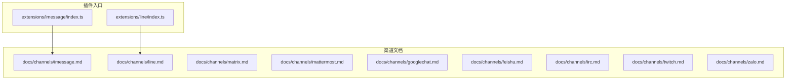
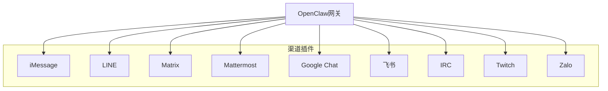
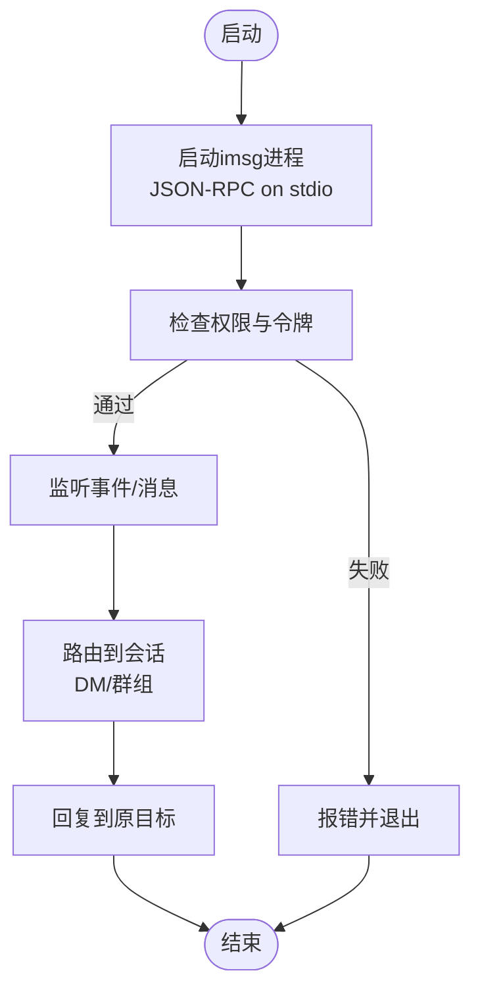
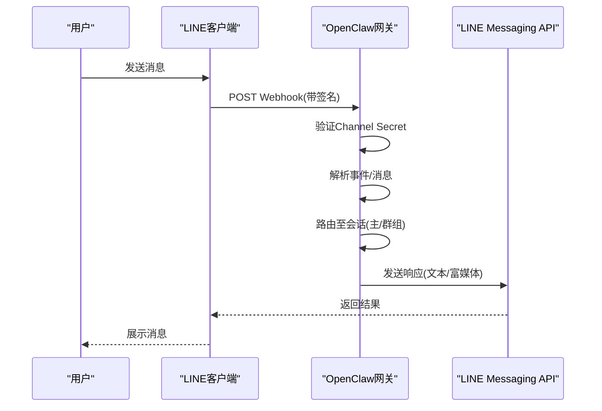
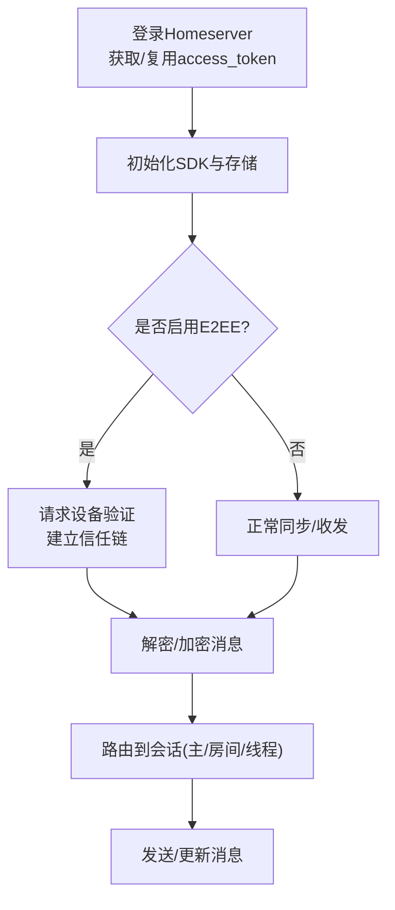
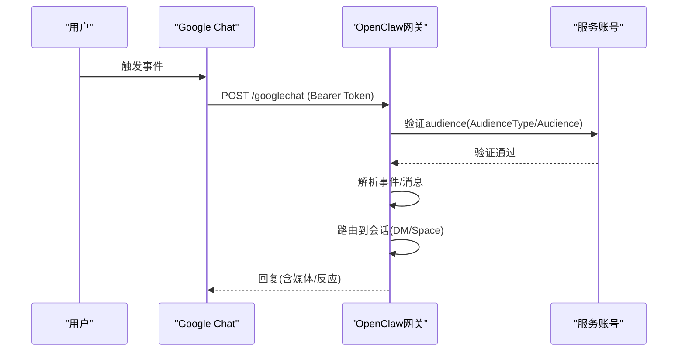
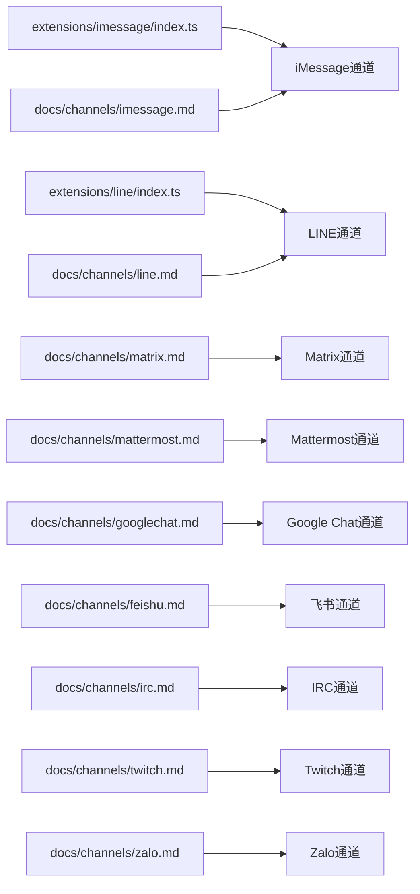

# 其他渠道集成

<cite>
**本文引用的文件**
- [docs/channels/imessage.md](file://docs/channels/imessage.md)
- [docs/channels/line.md](file://docs/channels/line.md)
- [docs/channels/matrix.md](file://docs/channels/matrix.md)
- [docs/channels/mattermost.md](file://docs/channels/mattermost.md)
- [docs/channels/googlechat.md](file://docs/channels/googlechat.md)
- [docs/channels/feishu.md](file://docs/channels/feishu.md)
- [docs/channels/irc.md](file://docs/channels/irc.md)
- [docs/channels/twitch.md](file://docs/channels/twitch.md)
- [docs/channels/zalo.md](file://docs/channels/zalo.md)
- [extensions/imessage/index.ts](file://extensions/imessage/index.ts)
- [extensions/line/index.ts](file://extensions/line/index.ts)
</cite>

## 目录

1. [简介](#简介)
2. [项目结构](#项目结构)
3. [核心组件](#核心组件)
4. [架构总览](#架构总览)
5. [详细组件分析](#详细组件分析)
6. [依赖关系分析](#依赖关系分析)
7. [性能考量](#性能考量)
8. [故障排除指南](#故障排除指南)
9. [结论](#结论)
10. [附录](#附录)

## 简介

本文件面向OpenClaw的“其他消息渠道集成”，系统梳理并对比iMessage、LINE、Matrix、Mattermost、Google Chat、飞书（Feishu）、IRC、Twitch与Zalo等渠道的接入方式、认证模型、消息处理机制、配置项、功能限制与最佳实践。文档同时总结渠道间共性设计与差异化处理策略，并给出多渠道部署的性能建议与故障排除清单。

## 项目结构

OpenClaw通过插件化扩展支持多消息渠道。每个渠道通常由一个独立的扩展包提供，入口文件负责注册通道与运行时能力；官方文档在docs/channels目录中提供了各渠道的安装、配置、路由与排障说明。

**图表来源**

- [extensions/imessage/index.ts](file://extensions/imessage/index.ts#L1-L18)
- [extensions/line/index.ts](file://extensions/line/index.ts#L1-L20)
- [docs/channels/imessage.md](file://docs/channels/imessage.md#L1-L352)
- [docs/channels/line.md](file://docs/channels/line.md#L1-L187)
- [docs/channels/matrix.md](file://docs/channels/matrix.md#L1-L260)
- [docs/channels/mattermost.md](file://docs/channels/mattermost.md#L1-L139)
- [docs/channels/googlechat.md](file://docs/channels/googlechat.md#L1-L253)
- [docs/channels/feishu.md](file://docs/channels/feishu.md#L1-L580)
- [docs/channels/irc.md](file://docs/channels/irc.md#L1-L235)
- [docs/channels/twitch.md](file://docs/channels/twitch.md#L1-L380)
- [docs/channels/zalo.md](file://docs/channels/zalo.md#L1-L190)

**章节来源**

- [extensions/imessage/index.ts](file://extensions/imessage/index.ts#L1-L18)
- [extensions/line/index.ts](file://extensions/line/index.ts#L1-L20)
- [docs/channels/imessage.md](file://docs/channels/imessage.md#L1-L352)
- [docs/channels/line.md](file://docs/channels/line.md#L1-L187)
- [docs/channels/matrix.md](file://docs/channels/matrix.md#L1-L260)
- [docs/channels/mattermost.md](file://docs/channels/mattermost.md#L1-L139)
- [docs/channels/googlechat.md](file://docs/channels/googlechat.md#L1-L253)
- [docs/channels/feishu.md](file://docs/channels/feishu.md#L1-L580)
- [docs/channels/irc.md](file://docs/channels/irc.md#L1-L235)
- [docs/channels/twitch.md](file://docs/channels/twitch.md#L1-L380)
- [docs/channels/zalo.md](file://docs/channels/zalo.md#L1-L190)

## 核心组件

- 插件入口：各渠道插件在index.ts中注册通道与运行时，统一暴露给OpenClaw核心。
- 渠道文档：官方文档详述认证、路由、访问控制、媒体与限流、排障等要点。
- 配置体系：各渠道在channels.<channel>下提供丰富的配置项，支持环境变量、文件与多账户。

关键共性：

- 认证：多数渠道采用令牌或密钥（如access token、channel secret、bot token、服务账号）进行鉴权。
- 路由：默认DM使用主会话，群组使用隔离会话；部分渠道支持提及触发或角色/白名单控制。
- 媒体与限流：文本分片、媒体大小限制、长轮询/Webhook模式、E2EE支持等差异明显。
- 安全：默认开启配对（pairing）或白名单，避免未授权访问；建议最小权限与定期轮换凭据。

**章节来源**

- [extensions/imessage/index.ts](file://extensions/imessage/index.ts#L1-L18)
- [extensions/line/index.ts](file://extensions/line/index.ts#L1-L20)
- [docs/channels/imessage.md](file://docs/channels/imessage.md#L1-L352)
- [docs/channels/line.md](file://docs/channels/line.md#L1-L187)
- [docs/channels/matrix.md](file://docs/channels/matrix.md#L1-L260)
- [docs/channels/mattermost.md](file://docs/channels/mattermost.md#L1-L139)
- [docs/channels/googlechat.md](file://docs/channels/googlechat.md#L1-L253)
- [docs/channels/feishu.md](file://docs/channels/feishu.md#L1-L580)
- [docs/channels/irc.md](file://docs/channels/irc.md#L1-L235)
- [docs/channels/twitch.md](file://docs/channels/twitch.md#L1-L380)
- [docs/channels/zalo.md](file://docs/channels/zalo.md#L1-L190)

## 架构总览

下图展示OpenClaw与多渠道的交互关系：核心网关通过插件加载各渠道，渠道根据自身协议（HTTP/Webhook、WebSocket、IRC等）接收/发送消息，并遵循统一的路由与会话模型。

**图表来源**

- [extensions/imessage/index.ts](file://extensions/imessage/index.ts#L1-L18)
- [extensions/line/index.ts](file://extensions/line/index.ts#L1-L20)
- [docs/channels/matrix.md](file://docs/channels/matrix.md#L1-L260)
- [docs/channels/mattermost.md](file://docs/channels/mattermost.md#L1-L139)
- [docs/channels/googlechat.md](file://docs/channels/googlechat.md#L1-L253)
- [docs/channels/feishu.md](file://docs/channels/feishu.md#L1-L580)
- [docs/channels/irc.md](file://docs/channels/irc.md#L1-L235)
- [docs/channels/twitch.md](file://docs/channels/twitch.md#L1-L380)
- [docs/channels/zalo.md](file://docs/channels/zalo.md#L1-L190)

## 详细组件分析

### iMessage（遗留：imsg）

- 接入方式：通过外部CLI工具imsg经JSON-RPC通过stdio通信，非守护进程/端口模式。
- 认证与权限：需要在运行上下文中授予Full Disk Access与Automation权限；消息数据库访问需授权。
- 路由与会话：DM默认主会话；群组使用隔离会话；支持按配置将特定chat_id视为群组。
- 媒体与分片：可选下载附件（远程可通过SCP），出站媒体受大小限制；文本分片支持长度与段落两种模式。
- 配置写入：默认允许通道发起配置写入（当命令启用时）。
- 差异化：新部署推荐使用BlueBubbles替代；支持多账户与远程SSH执行。

**图表来源**

- [docs/channels/imessage.md](file://docs/channels/imessage.md#L1-L352)

**章节来源**

- [docs/channels/imessage.md](file://docs/channels/imessage.md#L1-L352)

### LINE

- 接入方式：通过LINE Messaging API的Webhook接收事件，使用Channel Access Token与Channel Secret鉴权。
- 认证：支持多账户；Webhook路径可自定义；支持令牌/密钥文件。
- 路由与会话：DM默认配对；群组默认白名单+提及触发；支持按群覆盖。
- 消息行为：文本5000字符分片；Markdown转Flex卡片；媒体默认上限10MB；支持快速回复、位置、Flex卡片、模板消息。
- 差异化：不支持反应与线程；提供/Flex卡片命令。

**图表来源**

- [docs/channels/line.md](file://docs/channels/line.md#L1-L187)

**章节来源**

- [docs/channels/line.md](file://docs/channels/line.md#L1-L187)

### Matrix

- 接入方式：作为Matrix用户登录任意Homeserver，支持WebSocket事件订阅与E2EE。
- 认证：支持访问令牌或用户名+密码登录；令牌存储于本地；支持设备验证与加密存储。
- 路由与会话：DM共享主会话；房间映射为群组会话；支持线程与回复元数据。
- 功能：支持DM/房间/线程/媒体/E2EE/反应/投票/位置/原生命令。
- 差异化：E2EE需加载加密SDK；首次连接请求设备验证；支持自动加入房间与邀请白名单。

**图表来源**

- [docs/channels/matrix.md](file://docs/channels/matrix.md#L1-L260)

**章节来源**

- [docs/channels/matrix.md](file://docs/channels/matrix.md#L1-L260)

### Mattermost

- 接入方式：Bot Token + WebSocket事件；支持频道、群组与DM。
- 认证：Bot Token与Base URL；支持多账户。
- 路由与会话：DM默认配对；频道响应模式可配置（oncall/onmessage/onchar）；支持前缀触发。
- 差异化：更偏向团队协作场景；mention策略与聊天模式优先级高于requireMention。

**章节来源**

- [docs/channels/mattermost.md](file://docs/channels/mattermost.md#L1-L139)

### Google Chat（Chat API）

- 接入方式：HTTP Webhook；使用服务账号鉴权；支持公有URL（Tailscale Funnel/反向代理/Cloudflare Tunnel）。
- 认证：Audience类型支持“应用URL”或“项目号”；支持botUser辅助提及检测。
- 路由与会话：DM与Space分别使用不同会话键；默认DM配对；群组默认提及触发。
- 功能：DM/Space支持；媒体下载；反应工具；输入指示器；支持动作开关。
- 差异化：仅Webhook；需严格暴露路径；支持多账户与空间级配置。

**图表来源**

- [docs/channels/googlechat.md](file://docs/channels/googlechat.md#L1-L253)

**章节来源**

- [docs/channels/googlechat.md](file://docs/channels/googlechat.md#L1-L253)

### 飞书（Feishu）

- 接入方式：WebSocket事件订阅（无需公网URL）；Bot能力+事件订阅。
- 认证：App ID/Secret；支持Lark（国际版）域名；发布后方可接收事件。
- 路由与会话：DM共享主会话；群组隔离；默认群组开放但要求提及；支持按群覆盖。
- 功能：文本/富文本/图片/文件/音频/视频/贴纸；支持流式卡片输出（可配置）。
- 差异化：无需公网URL；支持多账户；流式输出；多Agent绑定。

**章节来源**

- [docs/channels/feishu.md](file://docs/channels/feishu.md#L1-L580)

### IRC

- 接入方式：IRC连接（TLS可选）；支持NickServ认证与一次性注册。
- 认证：昵称与密码；支持NickServ服务；通道与发送者双层门禁。
- 路由与会话：DM默认配对；群组默认白名单+提及触发；支持按通道覆盖。
- 差异化：提及触发默认开启；支持按发送者粒度的工具策略；适合公开频道时收紧工具集。

**章节来源**

- [docs/channels/irc.md](file://docs/channels/irc.md#L1-L235)

### Twitch

- 接入方式：IRC连接（Twitch Chat）；Bot Token与Client ID；支持刷新令牌。
- 认证：OAuth Bot Token；可配置clientSecret/refreshToken自动刷新。
- 路由与会话：每个账户独立会话键；默认requireMention；支持角色/用户ID白名单。
- 差异化：消息长度限制；默认提及触发；支持多账户；支持工具动作发送消息。

**章节来源**

- [docs/channels/twitch.md](file://docs/channels/twitch.md#L1-L380)

### Zalo

- 接入方式：Bot API；支持长轮询与Webhook（互斥）。
- 认证：Bot Token；支持环境变量/文件；支持多账户。
- 路由与会话：DM默认配对；群组暂不支持（未来计划）。
- 差异化：文本2000字符分片；媒体默认上限5MB；默认不支持流式（受限于长度）。

**章节来源**

- [docs/channels/zalo.md](file://docs/channels/zalo.md#L1-L190)

## 依赖关系分析

- 插件注册：各渠道在index.ts中注册通道与运行时，统一由OpenClaw加载。
- 文档驱动：各渠道文档提供配置参考、认证流程、路由模型与排障步骤，便于运维与开发对照实施。
- 外部依赖：各渠道依赖平台API/SDK（如Matrix加密SDK、LINE Webhook、Google Chat服务账号、Twitch Token等）。

**图表来源**

- [extensions/imessage/index.ts](file://extensions/imessage/index.ts#L1-L18)
- [extensions/line/index.ts](file://extensions/line/index.ts#L1-L20)
- [docs/channels/imessage.md](file://docs/channels/imessage.md#L1-L352)
- [docs/channels/line.md](file://docs/channels/line.md#L1-L187)
- [docs/channels/matrix.md](file://docs/channels/matrix.md#L1-L260)
- [docs/channels/mattermost.md](file://docs/channels/mattermost.md#L1-L139)
- [docs/channels/googlechat.md](file://docs/channels/googlechat.md#L1-L253)
- [docs/channels/feishu.md](file://docs/channels/feishu.md#L1-L580)
- [docs/channels/irc.md](file://docs/channels/irc.md#L1-L235)
- [docs/channels/twitch.md](file://docs/channels/twitch.md#L1-L380)
- [docs/channels/zalo.md](file://docs/channels/zalo.md#L1-L190)

## 性能考量

- 连接与协议
  - WebSocket类（Matrix、飞书）：事件驱动，低延迟；注意E2EE与设备验证开销。
  - Webhook类（LINE、Google Chat、Zalo）：HTTP长轮询/Webhook，需合理设置超时与并发；确保仅暴露必要路径。
  - IRC/Twitch：基于TCP/IRC，注意TLS握手与消息速率限制。
- 媒体与分片
  - 合理设置mediaMaxMb与textChunkLimit，避免超限导致重试与失败。
  - 对大文件传输建议使用平台直传或预签名URL。
- 会话与路由
  - 群组隔离可降低冲突，但增加内存与并发管理成本；评估会话数量与清理策略。
- 并发与限流
  - 平台侧限流（如Twitch 500字符/条）需在网关侧做缓冲与合并策略。
  - 对Webhook通道建议队列化处理，避免阻塞HTTP主线程。

[本节为通用指导，不直接分析具体文件]

## 故障排除指南

- 通用诊断
  - 使用状态与探测命令确认通道可用性与鉴权状态。
  - 查看日志以定位鉴权失败、路径错误、媒体下载失败等问题。
- 常见问题
  - Webhook校验失败：核对签名/密钥、HTTPS与路径一致性。
  - 无入站事件：确认通道已启用、路径匹配、可达性与订阅事件。
  - 媒体超限：提高mediaMaxMb或优化内容体积。
  - 提及/白名单拦截：检查dmPolicy/groupPolicy/allowFrom/mention策略。
  - 权限缺失（macOS/iMessage）：在相同上下文重新触发GUI提示以授予Full Disk Access与Automation。
  - E2EE失败（Matrix）：检查加密模块加载、设备验证与存储路径。
  - Twitch令牌过期：使用clientSecret/refreshToken自动刷新或重新生成。
  - Google Chat 405：确认通道配置、插件启用与网关重启。

**章节来源**

- [docs/channels/imessage.md](file://docs/channels/imessage.md#L290-L352)
- [docs/channels/line.md](file://docs/channels/line.md#L179-L187)
- [docs/channels/matrix.md](file://docs/channels/matrix.md#L205-L230)
- [docs/channels/mattermost.md](file://docs/channels/mattermost.md#L134-L139)
- [docs/channels/googlechat.md](file://docs/channels/googlechat.md#L200-L247)
- [docs/channels/feishu.md](file://docs/channels/feishu.md#L387-L417)
- [docs/channels/irc.md](file://docs/channels/irc.md#L230-L235)
- [docs/channels/twitch.md](file://docs/channels/twitch.md#L249-L286)
- [docs/channels/zalo.md](file://docs/channels/zalo.md#L146-L160)

## 结论

OpenClaw通过插件化架构实现了对多消息渠道的一致接入与治理。尽管各渠道在认证方式、协议形态与功能特性上存在显著差异，但均遵循统一的路由、会话与安全策略。建议在多渠道部署中：

- 明确各渠道的职责边界与SLA；
- 统一凭据管理与最小权限原则；
- 依据平台限流与协议特性优化消息分片与媒体处理；
- 建立标准化的排障流程与监控告警。

[本节为总结性内容，不直接分析具体文件]

## 附录

- 配置参考与最佳实践请参阅各渠道文档中的“配置参考”与“疑难解答”小节。
- 多账户与跨Agent路由：参考飞书与Twitch文档中的多账户与绑定示例。

[本节为补充说明，不直接分析具体文件]
