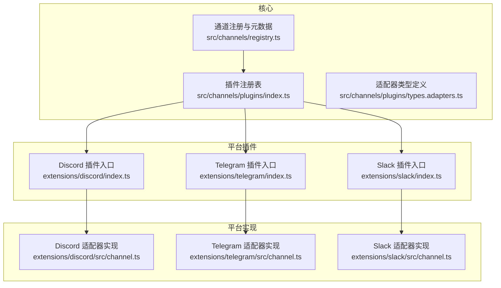
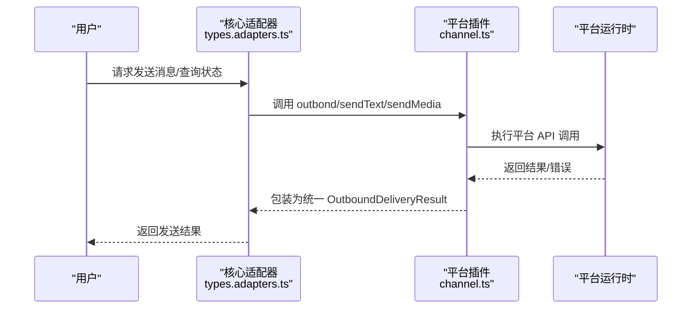
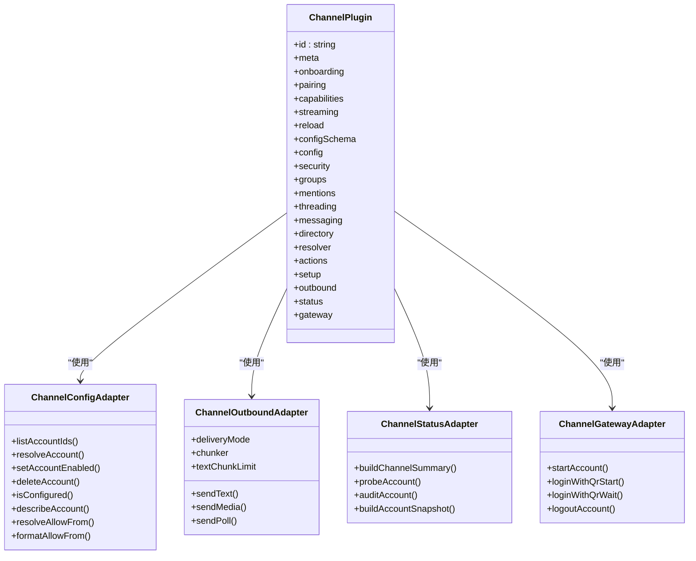
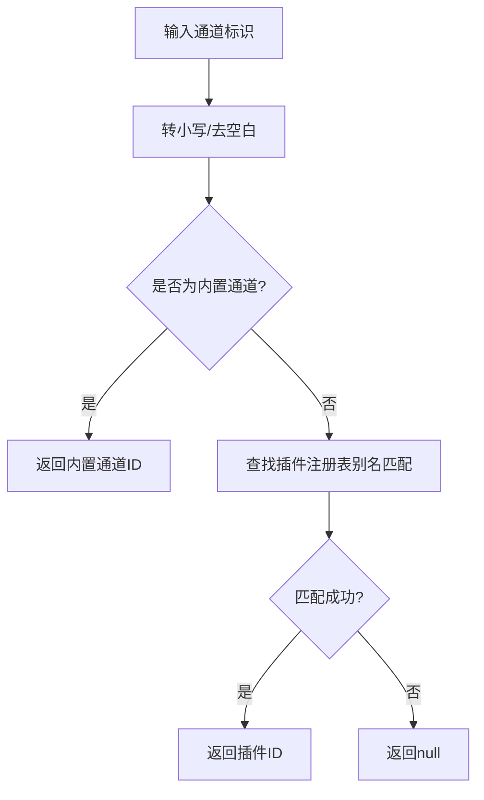
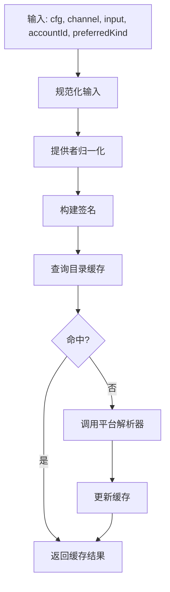
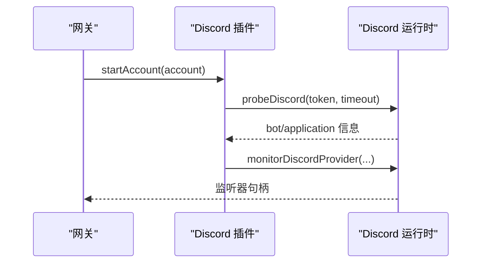
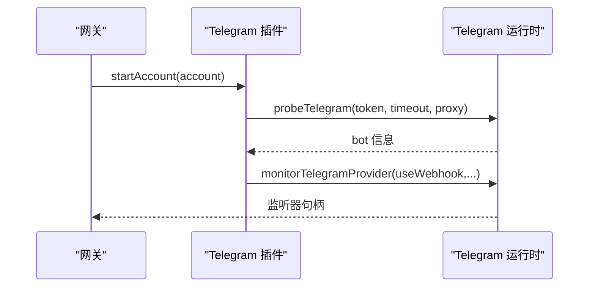
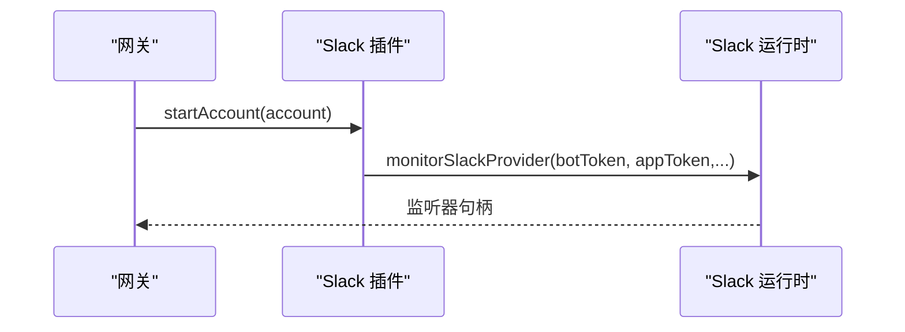
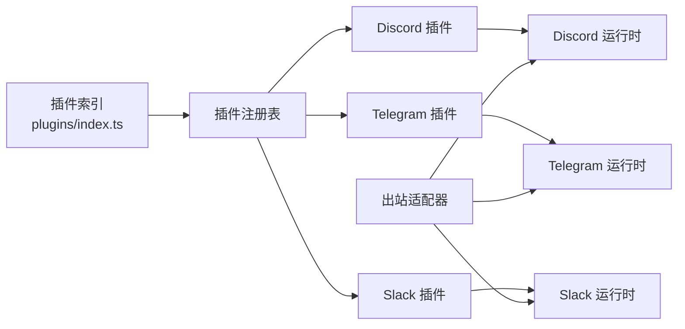

# 消息渠道集成

<cite>
**本文引用的文件**
- [src/channels/plugins/index.ts](file://src/channels/plugins/index.ts)
- [src/channels/plugins/types.ts](file://src/channels/plugins/types.ts)
- [src/channels/plugins/types.adapters.ts](file://src/channels/plugins/types.adapters.ts)
- [src/channels/registry.ts](file://src/channels/registry.ts)
- [src/infra/outbound/target-resolver.ts](file://src/infra/outbound/target-resolver.ts)
- [extensions/discord/index.ts](file://extensions/discord/index.ts)
- [extensions/discord/src/channel.ts](file://extensions/discord/src/channel.ts)
- [extensions/telegram/index.ts](file://extensions/telegram/index.ts)
- [extensions/telegram/src/channel.ts](file://extensions/telegram/src/channel.ts)
- [extensions/slack/index.ts](file://extensions/slack/index.ts)
- [extensions/slack/src/channel.ts](file://extensions/slack/src/channel.ts)
</cite>

## 目录

1. [简介](#简介)
2. [项目结构](#项目结构)
3. [核心组件](#核心组件)
4. [架构总览](#架构总览)
5. [详细组件分析](#详细组件分析)
6. [依赖关系分析](#依赖关系分析)
7. [性能考量](#性能考量)
8. [故障排查指南](#故障排查指南)
9. [结论](#结论)
10. [附录](#附录)

## 简介

本技术文档面向 OpenClaw 消息渠道集成系统，系统性阐述渠道适配器架构设计、渠道配置与认证机制、消息路由规则与媒体处理流程，并覆盖对 20+ 消息平台的集成实现（如 WhatsApp、Telegram、Discord、Slack 等）。文档同时提供登录流程、消息收发机制、群组管理与权限控制、渠道特定配置项、错误处理策略与性能优化建议，并给出渠道扩展开发指南与最佳实践。

## 项目结构

OpenClaw 的渠道集成采用“插件化 + 核心协议”的架构：核心层定义统一的适配器接口与运行时契约；各消息平台以扩展插件形式注册，遵循统一的生命周期与能力模型。关键目录与模块如下：

- 核心适配器与类型：src/channels/plugins
- 渠道注册与排序：src/channels/registry.ts
- 出站目标解析与目录缓存：src/infra/outbound
- 平台插件示例：extensions/{discord,telegram,slack,...}

**图表来源**

- [src/channels/registry.ts](file://src/channels/registry.ts#L1-L192)
- [src/channels/plugins/index.ts](file://src/channels/plugins/index.ts#L1-L85)
- [src/channels/plugins/types.adapters.ts](file://src/channels/plugins/types.adapters.ts#L1-L313)
- [extensions/discord/index.ts](file://extensions/discord/index.ts#L1-L18)
- [extensions/telegram/index.ts](file://extensions/telegram/index.ts#L1-L18)
- [extensions/slack/index.ts](file://extensions/slack/index.ts#L1-L18)

**章节来源**

- [src/channels/registry.ts](file://src/channels/registry.ts#L1-L192)
- [src/channels/plugins/index.ts](file://src/channels/plugins/index.ts#L1-L85)
- [src/channels/plugins/types.adapters.ts](file://src/channels/plugins/types.adapters.ts#L1-L313)

## 核心组件

- 通道插件接口与类型
  - 适配器集合：配置、安全、目录、解析、出站、状态、网关、命令、消息动作、线程、流式传输等。
  - 通道插件：每个平台以 ChannelPlugin 形式暴露能力与生命周期钩子。
- 通道注册与排序
  - 统一的通道顺序与别名映射，确保 UI 选择与默认通道一致。
- 出站目标解析
  - 将用户输入的目标规范化并解析为具体平台 ID，支持目录缓存与歧义处理。

**章节来源**

- [src/channels/plugins/types.ts](file://src/channels/plugins/types.ts#L1-L64)
- [src/channels/plugins/types.adapters.ts](file://src/channels/plugins/types.adapters.ts#L1-L313)
- [src/channels/registry.ts](file://src/channels/registry.ts#L1-L192)
- [src/infra/outbound/target-resolver.ts](file://src/infra/outbound/target-resolver.ts#L1-L44)

## 架构总览

OpenClaw 的渠道适配器遵循“插件注册 + 生命周期管理 + 能力适配”的模式：

- 插件注册：平台入口通过 registerChannel 注册 ChannelPlugin。
- 生命周期：网关启动/停止账户、登录（含二维码）、登出；状态探测与审计。
- 能力适配：每种平台在 config/security/groups/messaging/outbound/status/gateway 等适配器中定义行为。
- 目标解析：统一的 normalize + resolver 支持用户输入到平台 ID 的转换。

**图表来源**

- [src/channels/plugins/types.adapters.ts](file://src/channels/plugins/types.adapters.ts#L89-L106)
- [extensions/discord/src/channel.ts](file://extensions/discord/src/channel.ts#L283-L311)
- [extensions/telegram/src/channel.ts](file://extensions/telegram/src/channel.ts#L271-L301)
- [extensions/slack/src/channel.ts](file://extensions/slack/src/channel.ts#L509-L540)

## 详细组件分析

### 通道插件与适配器体系

- 类型与职责
  - 配置适配器：账户列表、默认账户、启用/删除账户、是否已配置、允许来源解析与格式化。
  - 安全适配器：私聊策略（DM Policy）、警告收集、条目标准化。
  - 目录适配器：自、好友、群组、成员列表（可选实时）。
  - 解析适配器：批量解析用户/群组目标。
  - 出站适配器：文本/媒体/投票发送、分块策略、目标解析。
  - 状态适配器：默认运行态、探测、审计、快照构建、问题收集。
  - 网关适配器：启动/停止账户、二维码登录、登出。
  - 命令/消息动作/线程/流式传输等适配器按需启用。
- 设计要点
  - 统一的 ChannelPlugin 结构，使不同平台共享同一调用路径。
  - 适配器可选实现，仅在平台支持时生效。
  - 运行时注入（如 getDiscordRuntime/getTelegramRuntime/getSlackRuntime），解耦平台实现细节。

**图表来源**

- [src/channels/plugins/types.adapters.ts](file://src/channels/plugins/types.adapters.ts#L22-L313)
- [src/channels/plugins/types.ts](file://src/channels/plugins/types.ts#L7-L63)

**章节来源**

- [src/channels/plugins/types.adapters.ts](file://src/channels/plugins/types.adapters.ts#L1-L313)
- [src/channels/plugins/types.ts](file://src/channels/plugins/types.ts#L1-L64)

### 渠道注册与排序

- 通道顺序与默认通道：统一维护 CHAT_CHANNEL_ORDER，确保 UI 选择与默认通道一致。
- 别名映射：支持 imsg -> imessage、internet-relay-chat -> irc 等别名。
- 规范化：normalizeAnyChannelId 可在不加载插件的情况下进行轻量级规范化。

**图表来源**

- [src/channels/registry.ts](file://src/channels/registry.ts#L147-L174)

**章节来源**

- [src/channels/registry.ts](file://src/channels/registry.ts#L1-L192)

### 出站目标解析与目录缓存

- 目标解析流程
  - 输入规范化：normalizeChannelTargetInput
  - 提供者归一化：normalizeTargetForProvider
  - 签名构建：buildTargetResolverSignature
  - 目录缓存：DirectoryCache（带 TTL）
  - 模糊目标处理：error/first/best 策略
- 目录缓存
  - 缓存键：buildDirectoryCacheKey
  - TTL：30 分钟

**图表来源**

- [src/infra/outbound/target-resolver.ts](file://src/infra/outbound/target-resolver.ts#L1-L44)

**章节来源**

- [src/infra/outbound/target-resolver.ts](file://src/infra/outbound/target-resolver.ts#L1-L44)

### Discord 渠道适配器

- 能力与特性
  - 支持 direct/channel/thread、投票、反应、线程、媒体、原生命令。
  - 流式输出合并策略：最小字符数与空闲时间阈值。
  - 配置：令牌、账户启用/删除、默认账户解析、允许来源。
  - 安全：DM 策略、警告收集（群组策略与频道白名单）。
  - 群组：是否需要提及、工具策略。
  - 消息：目标规范化、解析器提示。
  - 目录：静态配置与实时列表。
  - 解析：用户/群组允许列表解析。
  - 出站：文本/媒体发送、投票发送。
  - 状态：默认运行态、探测、审计、快照。
  - 网关：启动账户、探测意图状态。
- 登录与二维码
  - 通过 runtime 探测并记录 bot 信息，启动监控。

**图表来源**

- [extensions/discord/src/channel.ts](file://extensions/discord/src/channel.ts#L384-L427)

**章节来源**

- [extensions/discord/index.ts](file://extensions/discord/index.ts#L1-L18)
- [extensions/discord/src/channel.ts](file://extensions/discord/src/channel.ts#L1-L430)

### Telegram 渠道适配器

- 能力与特性
  - 支持 direct/group/channel/thread、反应、线程、媒体、原生命令、阻断流式。
  - 配置：令牌来源（环境变量/文件/参数）、账户管理、允许来源。
  - 安全：DM 策略、警告收集（群组策略与群组白名单）。
  - 线程：回复模式解析。
  - 消息：目标规范化、解析器提示。
  - 目录：静态配置列表。
  - 出站：文本/媒体发送（支持回复与线程）。
  - 状态：默认运行态、探测（含代理）、审计（群组未提及策略）、快照。
  - 网关：启动账户（轮询/webhook）、登出清理。
- 登录与二维码
  - 通过 runtime 探测并记录 bot 信息，启动监控（支持 webhook）。

**图表来源**

- [extensions/telegram/src/channel.ts](file://extensions/telegram/src/channel.ts#L386-L418)

**章节来源**

- [extensions/telegram/index.ts](file://extensions/telegram/index.ts#L1-L18)
- [extensions/telegram/src/channel.ts](file://extensions/telegram/src/channel.ts#L1-L489)

### Slack 渠道适配器

- 能力与特性
  - 支持 direct/channel/thread、反应、线程、媒体、原生命令。
  - 读写令牌分离：根据 userTokenReadOnly 决定写操作使用 botToken 或 userToken。
  - 配置：botToken/appToken、账户管理、允许来源。
  - 安全：DM 策略、警告收集（群组策略与频道白名单）。
  - 线程：回复模式解析、工具上下文构建。
  - 消息：目标规范化、解析器提示。
  - 目录：静态配置与实时列表。
  - 解析：用户/群组允许列表解析。
  - 动作：支持 reactions/messages/pins/memberInfo/emojiList 等动作门控。
  - 出站：文本/媒体发送（支持线程 ts）。
  - 状态：默认运行态、探测、快照。
  - 网关：启动账户（Socket Mode）。
- 登录与二维码
  - 通过 runtime 启动 Socket Mode 监听。

**图表来源**

- [extensions/slack/src/channel.ts](file://extensions/slack/src/channel.ts#L586-L602)

**章节来源**

- [extensions/slack/index.ts](file://extensions/slack/index.ts#L1-L18)
- [extensions/slack/src/channel.ts](file://extensions/slack/src/channel.ts#L1-L605)

### 其他平台（概览）

- WhatsApp、IRC、Google Chat、Signal、iMessage 等平台均以类似模式实现：入口注册、适配器实现、生命周期管理、能力开关与配置项。
- 通道注册顺序与别名映射确保跨平台一致性与易用性。

**章节来源**

- [src/channels/registry.ts](file://src/channels/registry.ts#L1-L192)

## 依赖关系分析

- 插件注册表
  - 通过 requireActivePluginRegistry 获取已加载插件，去重并按顺序排序。
- 适配器依赖
  - 各平台插件依赖运行时（runtime）执行实际 API 调用。
  - 出站适配器依赖统一的 Outbound 发送结果结构。
- 目标解析依赖
  - 目录缓存减少重复请求，提升解析性能。

**图表来源**

- [src/channels/plugins/index.ts](file://src/channels/plugins/index.ts#L12-L51)
- [src/channels/plugins/types.adapters.ts](file://src/channels/plugins/types.adapters.ts#L89-L106)

**章节来源**

- [src/channels/plugins/index.ts](file://src/channels/plugins/index.ts#L1-L85)
- [src/channels/plugins/types.adapters.ts](file://src/channels/plugins/types.adapters.ts#L1-L313)

## 性能考量

- 目标解析缓存
  - 使用 DirectoryCache（TTL=30 分钟）降低重复解析成本。
- 文本分块
  - Telegram 使用 Markdown 分块器，限制文本长度；Discord/Slack 设置合理分块上限。
- 流式输出
  - Discord/Slack 提供流式合并策略（最小字符数与空闲时间），平衡延迟与吞吐。
- 状态探测与审计
  - 限定超时时间，避免阻塞；审计仅在必要时触发。
- 并发与资源
  - 平台运行时内部应避免阻塞调用；对外暴露异步接口。

[本节为通用指导，无需列出具体文件来源]

## 故障排查指南

- 配置检查
  - 确认令牌来源（环境变量/文件/参数）与账户启用状态。
  - 核对允许来源与群组策略，避免因策略过于宽松或严格导致无法触发。
- 状态与审计
  - 使用状态适配器的探测与审计接口，定位权限缺失、未提及群组等问题。
  - Slack 可检查 Socket Mode 连接状态；Telegram 可检查 webhook/polling 模式。
- 日志与调试
  - 在 verbose 模式下查看运行时日志，定位异常。
- 常见问题
  - Discord：消息内容意图未开启可能导致无法响应；检查应用权限与机器人权限。
  - Telegram：未提及群组策略可能影响消息触发；检查 groupPolicy 与 allowFrom。
  - Slack：用户令牌只读导致写操作失败；调整 userTokenReadOnly 或切换至 botToken。

**章节来源**

- [extensions/discord/src/channel.ts](file://extensions/discord/src/channel.ts#L402-L411)
- [extensions/telegram/src/channel.ts](file://extensions/telegram/src/channel.ts#L328-L355)
- [extensions/slack/src/channel.ts](file://extensions/slack/src/channel.ts#L560-L566)

## 结论

OpenClaw 的渠道集成通过统一的适配器接口与插件化架构，实现了对多平台的一致接入与扩展。核心层提供稳定的能力抽象，平台层聚焦于各自 API 的适配与优化。借助目标解析缓存、分块策略与流式合并等机制，系统在可用性与性能之间取得良好平衡。按本文档的扩展指南与最佳实践，可快速为新平台添加适配器并保持与现有生态的兼容。

[本节为总结性内容，无需列出具体文件来源]

## 附录

### 渠道特定配置选项（示例）

- Discord
  - 令牌来源、账户启用/删除、默认账户、允许来源、群组策略、回复模式、媒体大小限制。
- Telegram
  - 令牌来源（环境变量/文件/参数）、账户启用/删除、允许来源、群组策略、回复模式、媒体大小限制、webhook 配置。
- Slack
  - botToken/appToken 来源、账户启用/删除、允许来源、用户令牌只读、群组策略、回复模式、Slash 命令支持。

**章节来源**

- [extensions/discord/src/channel.ts](file://extensions/discord/src/channel.ts#L76-L112)
- [extensions/telegram/src/channel.ts](file://extensions/telegram/src/channel.ts#L103-L141)
- [extensions/slack/src/channel.ts](file://extensions/slack/src/channel.ts#L99-L135)

### 错误处理策略

- 目标解析失败：返回候选列表或错误信息，支持模糊处理策略。
- 平台调用失败：包装为统一 OutboundDeliveryResult，保留平台错误信息。
- 权限不足：通过状态审计与警告收集反馈，指导用户修正配置。

**章节来源**

- [src/infra/outbound/target-resolver.ts](file://src/infra/outbound/target-resolver.ts#L28-L30)
- [src/channels/plugins/types.adapters.ts](file://src/channels/plugins/types.adapters.ts#L89-L106)

### 性能优化建议

- 合理设置分块大小与流式合并阈值，避免过小分块导致网络开销过大。
- 使用目录缓存与目标解析缓存，减少重复请求。
- 控制状态探测与审计频率，避免对平台造成压力。
- 对长文本与大媒体采用分块与分片策略，结合平台限制进行优化。

[本节为通用指导，无需列出具体文件来源]

### 渠道扩展开发指南与最佳实践

- 插件入口
  - 在扩展目录创建 index.ts，注册 ChannelPlugin。
- 适配器实现
  - 至少实现 config/outbound/status/gateway 适配器；其他按需实现。
  - 明确能力开关（capabilities）与默认行为。
- 配置与安全
  - 提供清晰的配置项与校验逻辑；实现安全适配器以支持 DM 策略与警告收集。
- 目标解析与目录
  - 实现 normalizeTarget 与 resolver；提供目录适配器以支持静态与实时列表。
- 登录与生命周期
  - 实现二维码登录（如适用）、启动/停止账户、登出清理。
- 测试与文档
  - 提供最小可运行示例与配置说明；补充平台文档链接。

**章节来源**

- [extensions/discord/index.ts](file://extensions/discord/index.ts#L1-L18)
- [extensions/telegram/index.ts](file://extensions/telegram/index.ts#L1-L18)
- [extensions/slack/index.ts](file://extensions/slack/index.ts#L1-L18)
