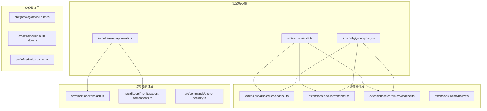
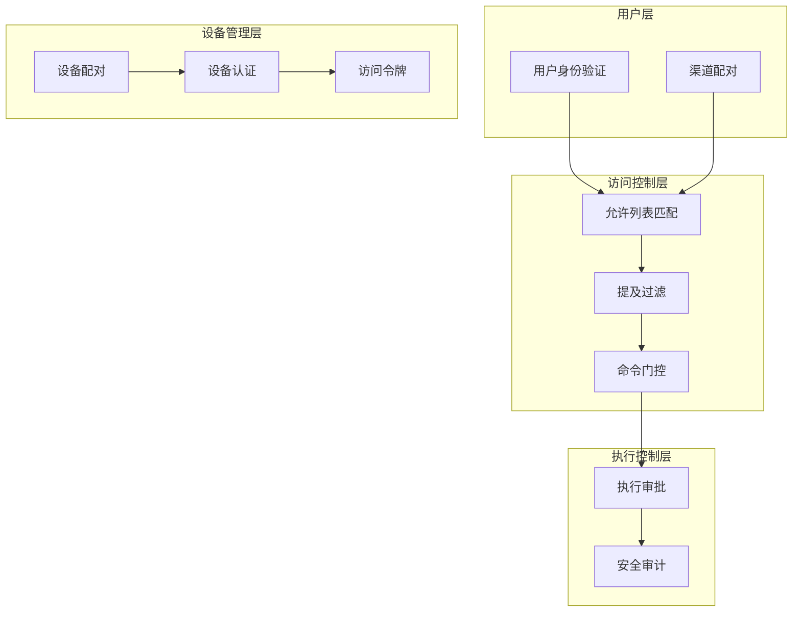
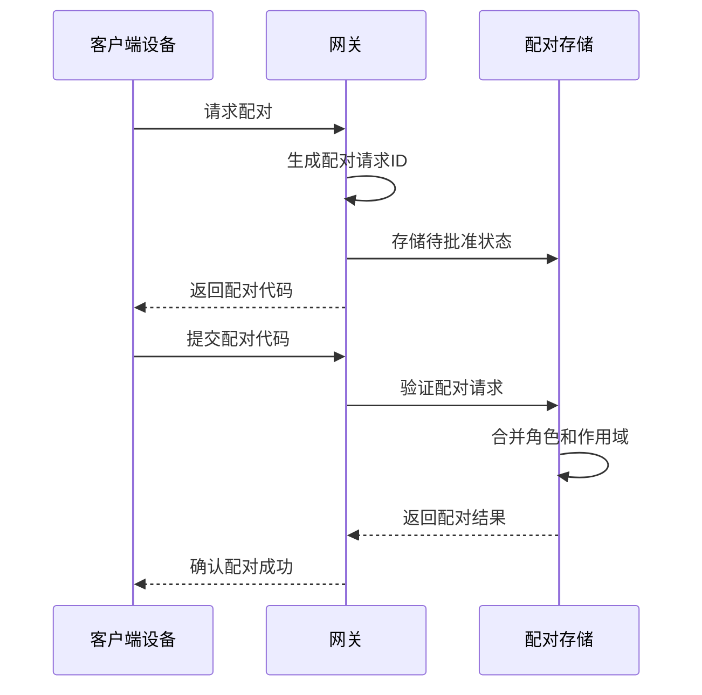
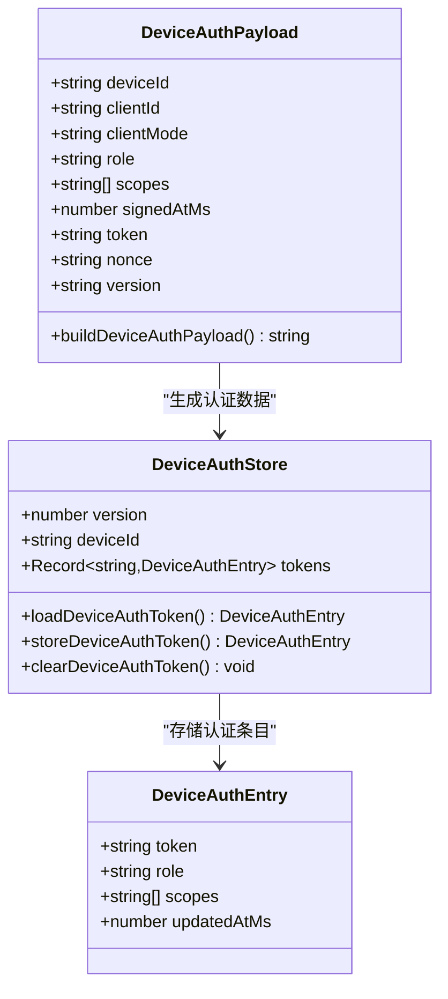
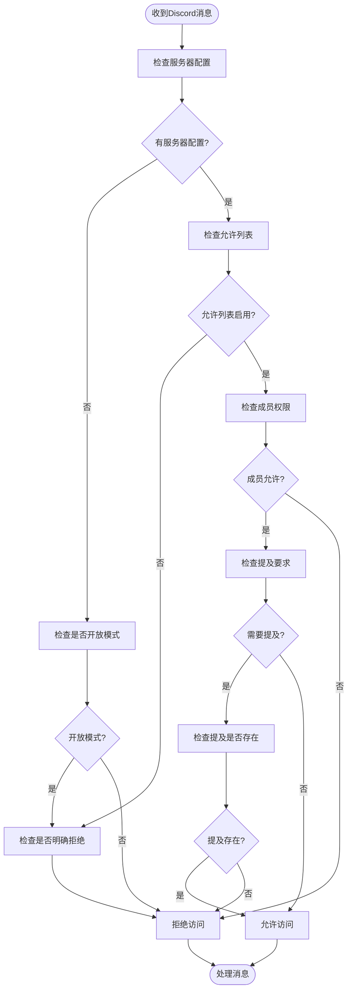
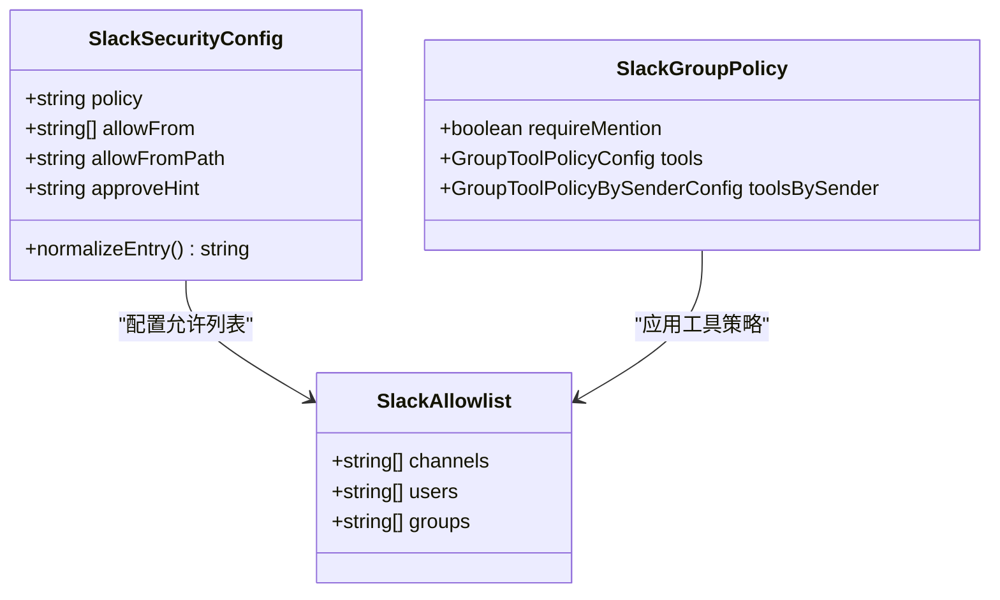
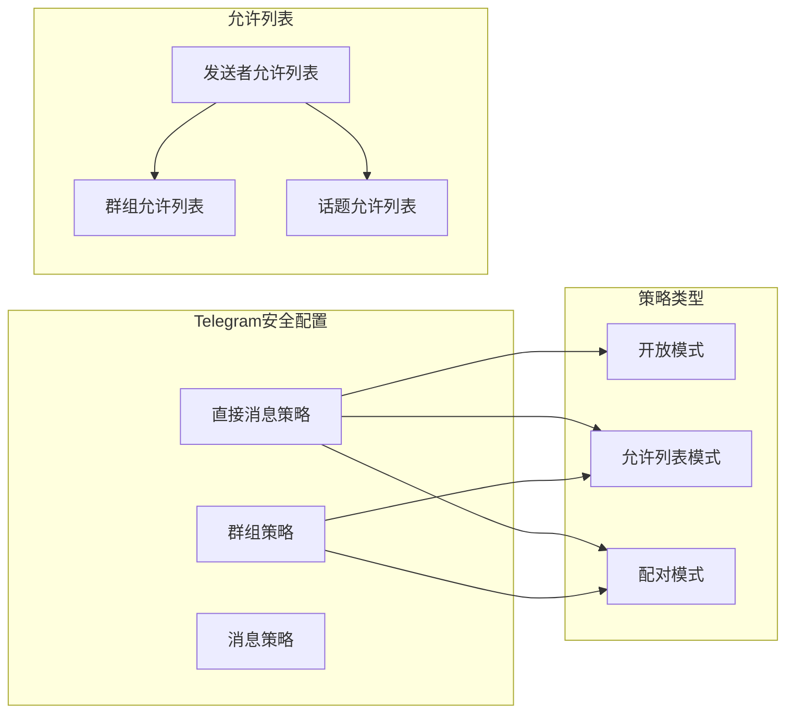
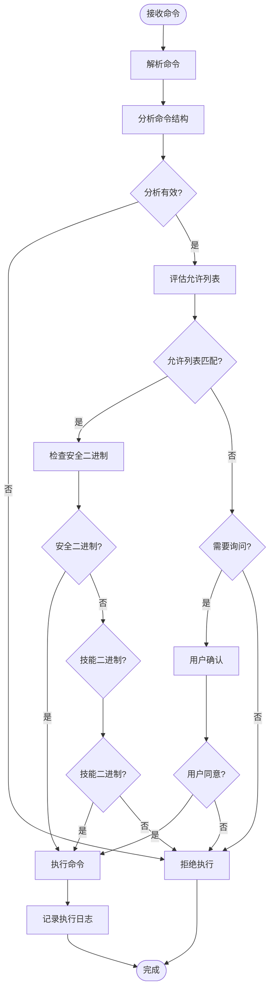
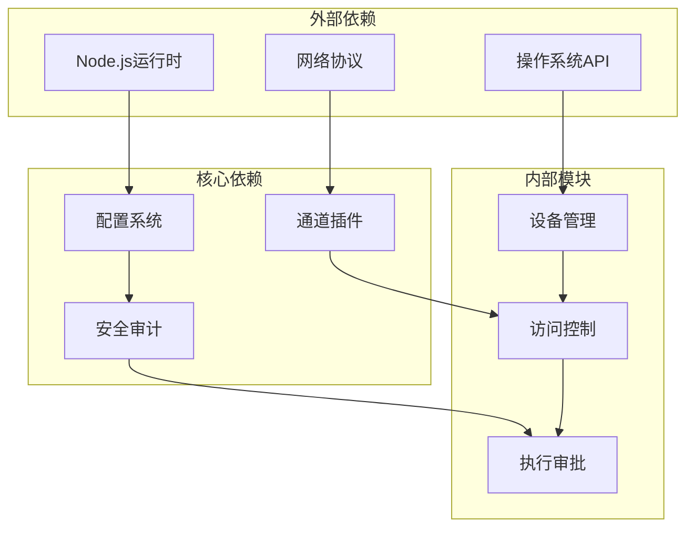

# 渠道安全与权限

<cite>
**本文档引用的文件**
- [src/security/audit.ts](file://src/security/audit.ts)
- [src/infra/exec-approvals.ts](file://src/infra/exec-approvals.ts)
- [src/config/group-policy.ts](file://src/config/group-policy.ts)
- [src/gateway/device-auth.ts](file://src/gateway/device-auth.ts)
- [src/infra/device-auth-store.ts](file://src/infra/device-auth-store.ts)
- [src/infra/device-pairing.ts](file://src/infra/device-pairing.ts)
- [extensions/discord/src/channel.ts](file://extensions/discord/src/channel.ts)
- [extensions/slack/src/channel.ts](file://extensions/slack/src/channel.ts)
- [extensions/telegram/src/channel.ts](file://extensions/telegram/src/channel.ts)
- [src/slack/monitor/slash.ts](file://src/slack/monitor/slash.ts)
- [src/discord/monitor/agent-components.ts](file://src/discord/monitor/agent-components.ts)
- [extensions/irc/src/policy.ts](file://extensions/irc/src/policy.ts)
- [src/commands/doctor-security.ts](file://src/commands/doctor-security.ts)
- [docs/security/THREAT-MODEL-ATLAS.md](file://docs/security/THREAT-MODEL-ATLAS.md)
- [docs/gateway/security/index.md](file://docs/gateway/security/index.md)
</cite>

## 目录

1. [简介](#简介)
2. [项目结构](#项目结构)
3. [核心组件](#核心组件)
4. [架构概览](#架构概览)
5. [详细组件分析](#详细组件分析)
6. [依赖关系分析](#依赖关系分析)
7. [性能考虑](#性能考虑)
8. [故障排除指南](#故障排除指南)
9. [结论](#结论)
10. [附录](#附录)

## 简介

OpenClaw渠道安全与权限控制系统是一个多层次的安全框架，旨在保护AI助手免受未经授权的访问和恶意操作。该系统通过允许列表匹配、提及过滤和命令门控策略来实现细粒度的访问控制。

本系统的核心设计理念是"身份优先、范围次之、模型最后"，确保即使模型被操纵，其影响范围也受到严格限制。系统支持多种渠道（Discord、Slack、Telegram等）的安全配置，并提供了完整的设备配对和身份验证机制。

## 项目结构

OpenClaw安全系统的组织结构采用模块化设计，主要分为以下几个层次：

**图表来源**

- [src/security/audit.ts](file://src/security/audit.ts#L1-L1032)
- [src/infra/exec-approvals.ts](file://src/infra/exec-approvals.ts#L1-L1633)
- [src/config/group-policy.ts](file://src/config/group-policy.ts#L1-L239)

**章节来源**

- [src/security/audit.ts](file://src/security/audit.ts#L1-L1032)
- [src/infra/exec-approvals.ts](file://src/infra/exec-approvals.ts#L1-L1633)
- [src/config/group-policy.ts](file://src/config/group-policy.ts#L1-L239)

## 核心组件

### 安全审计引擎

安全审计引擎是整个系统的核心，负责扫描配置中的安全问题并提供修复建议。它能够检查文件系统权限、网关配置、浏览器控制、日志设置等多个方面。

关键特性：

- **多维度检查**：文件系统权限、网关暴露、浏览器控制、日志配置
- **严重性分级**：信息、警告、严重级别别的分类
- **自动修复建议**：针对发现的问题提供具体的修复方案

### 执行审批系统

执行审批系统实现了对命令执行的精细控制，支持三种安全模式：

- **拒绝模式**：默认拒绝所有命令
- **允许列表模式**：仅允许预定义的命令
- **完全模式**：允许所有命令（高风险）

该系统还支持通配符模式匹配和路径解析功能。

### 组策略管理

组策略管理系统负责渠道内的访问控制，支持：

- **允许列表配置**：精确控制哪些用户或群组可以访问
- **提及要求**：强制要求消息中包含特定提及
- **工具策略**：针对不同工具设置不同的访问规则

**章节来源**

- [src/security/audit.ts](file://src/security/audit.ts#L259-L387)
- [src/infra/exec-approvals.ts](file://src/infra/exec-approvals.ts#L8-L65)
- [src/config/group-policy.ts](file://src/config/group-policy.ts#L146-L169)

## 架构概览

OpenClaw的安全架构采用分层设计，每层都有明确的安全职责：

**图表来源**

- [src/commands/doctor-security.ts](file://src/commands/doctor-security.ts#L132-L185)
- [src/security/audit.ts](file://src/security/audit.ts#L503-L892)

## 详细组件分析

### 设备配对与认证系统

设备配对系统提供了安全的设备连接机制，确保只有经过授权的设备可以访问系统。

#### 设备配对流程

**图表来源**

- [src/infra/device-pairing.ts](file://src/infra/device-pairing.ts#L297-L332)
- [src/gateway/server/ws-connection/message-handler.ts](file://src/gateway/server/ws-connection/message-handler.ts#L753-L786)

#### 设备认证机制

设备认证使用基于时间戳的签名机制，确保通信的安全性：

**图表来源**

- [src/gateway/device-auth.ts](file://src/gateway/device-auth.ts#L1-L32)
- [src/infra/device-auth-store.ts](file://src/infra/device-auth-store.ts#L5-L143)

**章节来源**

- [src/infra/device-pairing.ts](file://src/infra/device-pairing.ts#L411-L449)
- [src/gateway/device-auth.ts](file://src/gateway/device-auth.ts#L1-L32)
- [src/infra/device-auth-store.ts](file://src/infra/device-auth-store.ts#L1-L143)

### 渠道安全策略

不同渠道有不同的安全需求和实现方式，但都遵循统一的安全原则。

#### Discord渠道安全

Discord渠道实现了复杂的权限管理机制：

**图表来源**

- [extensions/discord/src/channel.ts](file://extensions/discord/src/channel.ts#L121-L146)
- [src/discord/monitor/agent-components.ts](file://src/discord/monitor/agent-components.ts#L260-L284)

#### Slack渠道安全

Slack渠道的安全实现更加灵活，支持多种配置选项：

**图表来源**

- [extensions/slack/src/channel.ts](file://extensions/slack/src/channel.ts#L137-L150)
- [src/slack/monitor/slash.ts](file://src/slack/monitor/slash.ts#L189-L205)

#### Telegram渠道安全

Telegram渠道提供了最灵活的安全配置选项：

**图表来源**

- [extensions/telegram/src/channel.ts](file://extensions/telegram/src/channel.ts#L143-L157)
- [src/security/audit.ts](file://src/security/audit.ts#L800-L889)

**章节来源**

- [extensions/discord/src/channel.ts](file://extensions/discord/src/channel.ts#L1-L430)
- [extensions/slack/src/channel.ts](file://extensions/slack/src/channel.ts#L1-L605)
- [extensions/telegram/src/channel.ts](file://extensions/telegram/src/channel.ts#L1-L489)

### 命令执行安全

命令执行安全系统实现了多层次的防护机制：

#### 命令分析与验证

**图表来源**

- [src/infra/exec-approvals.ts](file://src/infra/exec-approvals.ts#L1248-L1288)
- [src/infra/exec-approvals.ts](file://src/infra/exec-approvals.ts#L1405-L1492)

**章节来源**

- [src/infra/exec-approvals.ts](file://src/infra/exec-approvals.ts#L582-L604)
- [src/infra/exec-approvals.ts](file://src/infra/exec-approvals.ts#L1204-L1288)

## 依赖关系分析

OpenClaw安全系统的依赖关系呈现清晰的层次结构：

**图表来源**

- [src/security/audit.ts](file://src/security/audit.ts#L1-L1032)
- [src/infra/exec-approvals.ts](file://src/infra/exec-approvals.ts#L1-L1633)

**章节来源**

- [src/security/audit.ts](file://src/security/audit.ts#L1-L1032)
- [src/infra/exec-approvals.ts](file://src/infra/exec-approvals.ts#L1-L1633)

## 性能考虑

### 安全审计性能优化

安全审计系统采用了多项性能优化措施：

- **异步检查**：文件系统检查采用异步方式，避免阻塞主进程
- **缓存机制**：频繁访问的配置信息进行缓存
- **增量更新**：只检查发生变化的部分

### 执行审批性能优化

执行审批系统优化了命令分析的性能：

- **延迟解析**：只在必要时解析命令路径
- **智能匹配**：使用高效的模式匹配算法
- **批量处理**：支持批量命令的快速处理

## 故障排除指南

### 常见安全问题诊断

#### 设备配对失败

当设备配对失败时，检查以下要点：

1. 配对请求ID是否正确
2. 设备是否在允许的作用域内
3. 时间戳是否过期

#### 允许列表不生效

如果允许列表配置不生效，检查：

1. 配置格式是否正确
2. 用户ID格式是否匹配
3. 通配符使用是否正确

#### 命令执行被拒绝

命令执行被拒绝的可能原因：

1. 命令不在允许列表中
2. 安全策略过于严格
3. 用户权限不足

**章节来源**

- [src/commands/doctor-security.ts](file://src/commands/doctor-security.ts#L132-L185)
- [src/security/audit.ts](file://src/security/audit.ts#L503-L892)

## 结论

OpenClaw渠道安全与权限控制系统提供了一个全面、灵活且高性能的安全框架。通过分层设计和多维度的安全控制，系统能够在保证安全性的同时提供良好的用户体验。

系统的主要优势包括：

- **模块化设计**：各组件职责明确，易于维护和扩展
- **灵活配置**：支持多种安全策略和配置选项
- **完整审计**：提供全面的安全审计和监控能力
- **性能优化**：在保证安全的前提下优化执行效率

未来的发展方向包括增强威胁检测能力、改进用户体验和扩展更多渠道的支持。

## 附录

### 安全威胁模型

系统基于MITRE ATLAS框架构建威胁模型，重点关注以下攻击场景：

- **初始访问**：配对代码拦截、社会工程学攻击
- **执行**：命令注入、工具滥用
- **影响**：资源耗尽、声誉损害

### 最佳实践建议

1. **最小权限原则**：只授予必要的访问权限
2. **定期审计**：定期运行安全审计检查
3. **监控告警**：建立完善的监控和告警机制
4. **应急响应**：制定详细的应急响应计划
