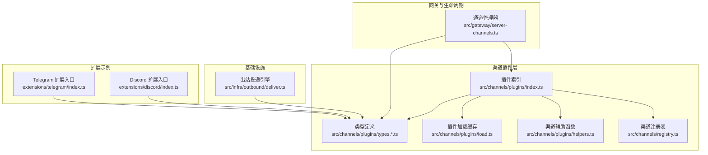
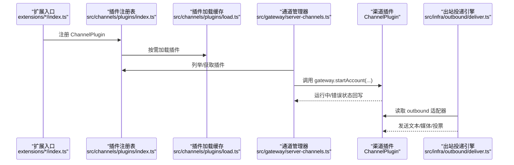
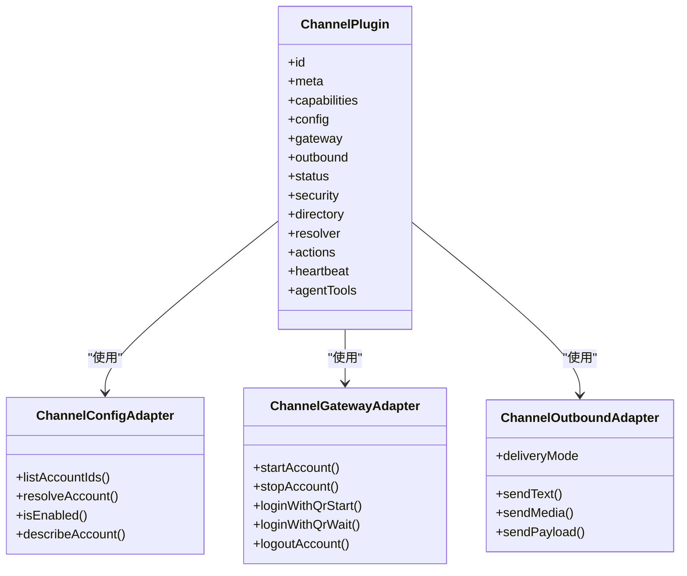
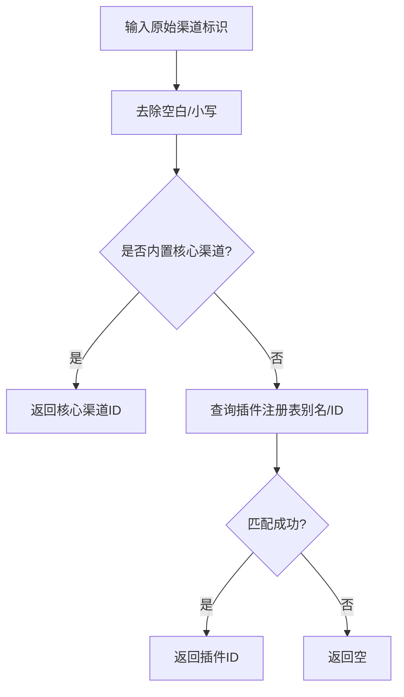
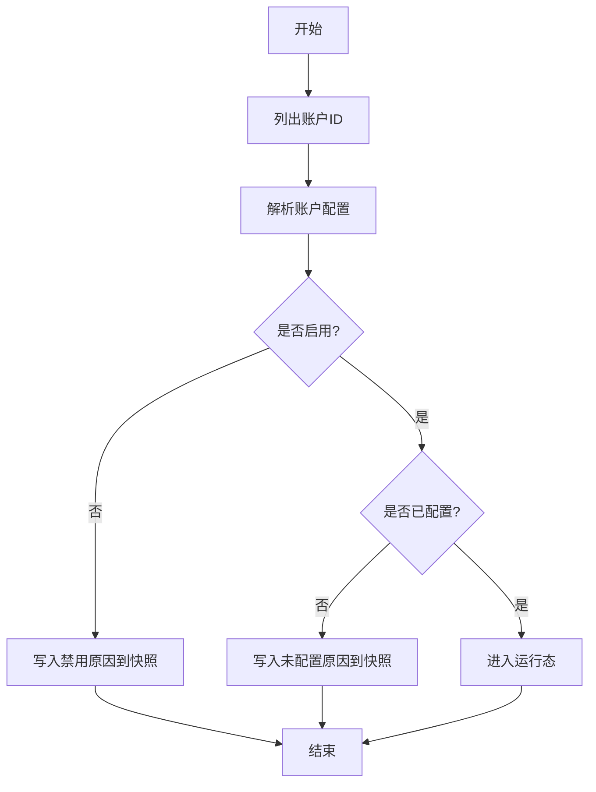
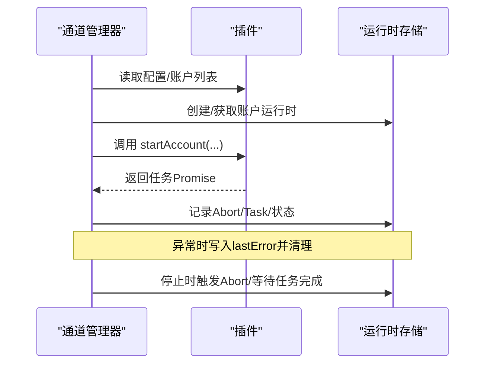
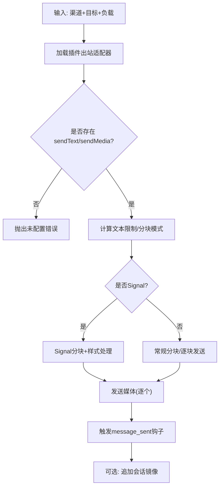
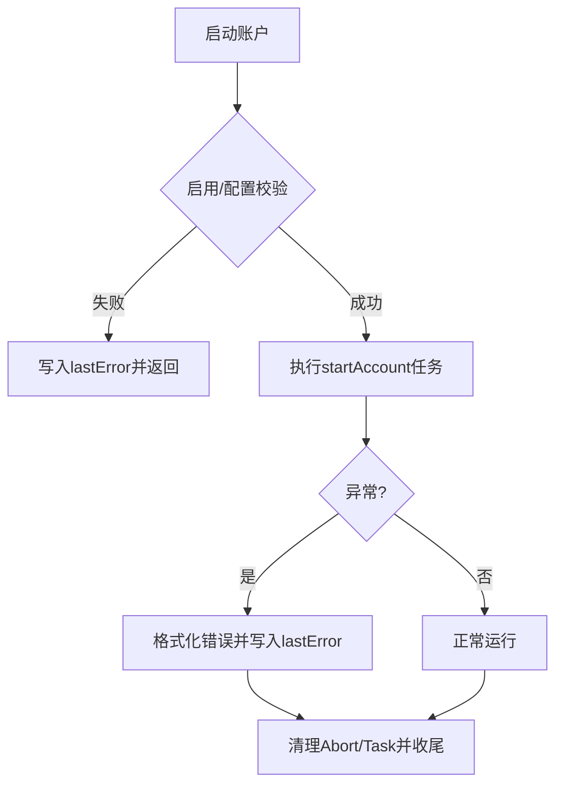
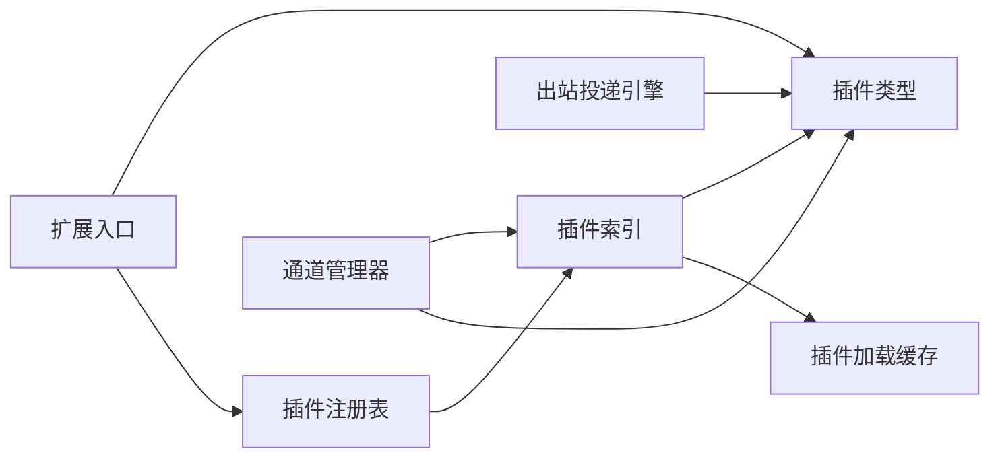

# 渠道架构设计

<cite>
**本文引用的文件**
- [src/gateway/server-channels.ts](file://src/gateway/server-channels.ts)
- [src/channels/plugins/index.ts](file://src/channels/plugins/index.ts)
- [src/channels/plugins/types.ts](file://src/channels/plugins/types.ts)
- [src/channels/plugins/types.adapters.ts](file://src/channels/plugins/types.adapters.ts)
- [src/channels/plugins/types.core.ts](file://src/channels/plugins/types.core.ts)
- [src/channels/plugins/types.plugin.ts](file://src/channels/plugins/types.plugin.ts)
- [src/channels/plugins/load.ts](file://src/channels/plugins/load.ts)
- [src/channels/plugins/helpers.ts](file://src/channels/plugins/helpers.ts)
- [src/channels/registry.ts](file://src/channels/registry.ts)
- [src/infra/outbound/deliver.ts](file://src/infra/outbound/deliver.ts)
- [extensions/discord/index.ts](file://extensions/discord/index.ts)
- [extensions/telegram/index.ts](file://extensions/telegram/index.ts)
</cite>

## 目录

1. [引言](#引言)
2. [项目结构](#项目结构)
3. [核心组件](#核心组件)
4. [架构总览](#架构总览)
5. [组件详解](#组件详解)
6. [依赖关系分析](#依赖关系分析)
7. [性能考量](#性能考量)
8. [故障排查指南](#故障排查指南)
9. [结论](#结论)
10. [附录](#附录)

## 引言

本文件系统性阐述 OpenClaw 的“渠道架构”设计与实现，聚焦于渠道适配器的统一架构、渠道注册机制、配置管理系统、通用接口规范、生命周期管理、消息路由与投递算法、错误处理策略、配置数据结构与验证规则、动态更新机制、扩展点与插件化优势，以及开发最佳实践与性能优化建议。目标是帮助开发者在不深入源码细节的前提下，快速理解并高效扩展新的渠道适配器。

## 项目结构

OpenClaw 将“渠道”抽象为可插拔的插件，通过统一的插件注册表与运行时加载机制接入系统；网关层负责渠道生命周期管理与运行时快照；基础设施层提供消息投递与分块策略；扩展目录提供具体渠道的实现入口。

**图示来源**

- [src/channels/plugins/index.ts](file://src/channels/plugins/index.ts#L1-L85)
- [src/channels/plugins/types.ts](file://src/channels/plugins/types.ts#L1-L64)
- [src/channels/plugins/load.ts](file://src/channels/plugins/load.ts#L1-L29)
- [src/channels/plugins/helpers.ts](file://src/channels/plugins/helpers.ts#L1-L21)
- [src/channels/registry.ts](file://src/channels/registry.ts#L1-L192)
- [src/gateway/server-channels.ts](file://src/gateway/server-channels.ts#L1-L309)
- [src/infra/outbound/deliver.ts](file://src/infra/outbound/deliver.ts#L1-L448)
- [extensions/discord/index.ts](file://extensions/discord/index.ts#L1-L18)
- [extensions/telegram/index.ts](file://extensions/telegram/index.ts#L1-L18)

**章节来源**

- [src/channels/plugins/index.ts](file://src/channels/plugins/index.ts#L1-L85)
- [src/channels/plugins/types.ts](file://src/channels/plugins/types.ts#L1-L64)
- [src/channels/plugins/load.ts](file://src/channels/plugins/load.ts#L1-L29)
- [src/channels/plugins/helpers.ts](file://src/channels/plugins/helpers.ts#L1-L21)
- [src/channels/registry.ts](file://src/channels/registry.ts#L1-L192)
- [src/gateway/server-channels.ts](file://src/gateway/server-channels.ts#L1-L309)
- [src/infra/outbound/deliver.ts](file://src/infra/outbound/deliver.ts#L1-L448)
- [extensions/discord/index.ts](file://extensions/discord/index.ts#L1-L18)
- [extensions/telegram/index.ts](file://extensions/telegram/index.ts#L1-L18)

## 核心组件

- 插件注册与发现：通过插件注册表集中维护渠道插件元信息与别名，支持按 ID 或别名标准化。
- 类型契约：以 ChannelPlugin 为核心契约，定义配置、网关、安全、目录、消息动作等适配器接口。
- 生命周期管理：由通道管理器统一调度启动/停止账户实例，维护运行时快照与错误状态。
- 出站投递：基于插件适配器的出站适配器进行文本/媒体/投票等消息发送，并支持分块与并发策略。
- 配置系统：账户级配置解析、启用/禁用、是否已配置、描述快照等能力由插件配置适配器提供。

**章节来源**

- [src/channels/plugins/types.plugin.ts](file://src/channels/plugins/types.plugin.ts#L48-L84)
- [src/channels/plugins/types.adapters.ts](file://src/channels/plugins/types.adapters.ts#L41-L147)
- [src/gateway/server-channels.ts](file://src/gateway/server-channels.ts#L49-L307)
- [src/infra/outbound/deliver.ts](file://src/infra/outbound/deliver.ts#L79-L173)

## 架构总览

下图展示从扩展入口到插件注册、再到网关生命周期管理与出站投递的整体流程。

**图示来源**

- [extensions/discord/index.ts](file://extensions/discord/index.ts#L11-L14)
- [extensions/telegram/index.ts](file://extensions/telegram/index.ts#L11-L14)
- [src/channels/plugins/index.ts](file://src/channels/plugins/index.ts#L31-L51)
- [src/channels/plugins/load.ts](file://src/channels/plugins/load.ts#L16-L29)
- [src/gateway/server-channels.ts](file://src/gateway/server-channels.ts#L96-L179)
- [src/infra/outbound/deliver.ts](file://src/infra/outbound/deliver.ts#L80-L109)

## 组件详解

### 统一架构与通用接口规范

- ChannelPlugin 是所有渠道适配器的统一契约，涵盖配置、网关、安全、目录、消息动作、线程、流式传输、提及处理、命令、心跳、代理提示、代理工具等能力域。
- 适配器接口通过 ChannelConfigAdapter、ChannelGatewayAdapter、ChannelOutboundAdapter 等定义，确保不同渠道在相同接口下实现差异化行为。
- 类型系统将“核心类型”（如 ChannelAccountSnapshot、ChannelMeta）与“适配器类型”解耦，便于扩展与演进。

**图示来源**

- [src/channels/plugins/types.plugin.ts](file://src/channels/plugins/types.plugin.ts#L48-L84)
- [src/channels/plugins/types.adapters.ts](file://src/channels/plugins/types.adapters.ts#L41-L106)
- [src/channels/plugins/types.adapters.ts](file://src/channels/plugins/types.adapters.ts#L194-L208)

**章节来源**

- [src/channels/plugins/types.plugin.ts](file://src/channels/plugins/types.plugin.ts#L48-L84)
- [src/channels/plugins/types.adapters.ts](file://src/channels/plugins/types.adapters.ts#L41-L106)
- [src/channels/plugins/types.adapters.ts](file://src/channels/plugins/types.adapters.ts#L194-L208)

### 渠道注册机制与标准化

- 内置核心渠道 ID 与别名映射，提供标准化 ID 解析与别名转换。
- 任意渠道插件均可通过扩展入口注册，插件注册表会去重并按顺序排序返回。
- 任何共享代码应优先使用标准化 ID 工具，避免直接导入重型渠道实现。

**图示来源**

- [src/channels/registry.ts](file://src/channels/registry.ts#L147-L174)

**章节来源**

- [src/channels/registry.ts](file://src/channels/registry.ts#L1-L192)
- [src/channels/plugins/index.ts](file://src/channels/plugins/index.ts#L53-L57)

### 配置管理系统与数据结构

- 账户级配置解析：插件通过 ChannelConfigAdapter 提供 listAccountIds、resolveAccount、isEnabled、describeAccount 等能力。
- 默认账户选择：当未指定账户时，依据插件默认或列表首项决定。
- 配置快照：ChannelAccountSnapshot 记录账户状态、连接、错误、时间戳等字段，用于 UI 展示与健康检查。
- 插件加载缓存：对当前活跃插件注册表进行缓存，避免重复查找。

**图示来源**

- [src/gateway/server-channels.ts](file://src/gateway/server-channels.ts#L105-L139)
- [src/channels/plugins/helpers.ts](file://src/channels/plugins/helpers.ts#L7-L14)
- [src/channels/plugins/load.ts](file://src/channels/plugins/load.ts#L8-L14)

**章节来源**

- [src/channels/plugins/types.core.ts](file://src/channels/plugins/types.core.ts#L95-L147)
- [src/channels/plugins/types.adapters.ts](file://src/channels/plugins/types.adapters.ts#L41-L65)
- [src/channels/plugins/helpers.ts](file://src/channels/plugins/helpers.ts#L7-L14)
- [src/channels/plugins/load.ts](file://src/channels/plugins/load.ts#L1-L29)

### 生命周期管理与运行时快照

- 通道管理器负责：
  - 启动/停止指定渠道或全部渠道；
  - 为每个账户维护 AbortController、任务 Promise、运行时快照；
  - 在启动前重置目录缓存，确保路由一致性；
  - 捕获异常并写入 lastError，最终清理任务与中断信号。
- 运行时快照聚合各渠道与账户的状态，用于诊断与 UI 展示。

**图示来源**

- [src/gateway/server-channels.ts](file://src/gateway/server-channels.ts#L96-L179)
- [src/gateway/server-channels.ts](file://src/gateway/server-channels.ts#L181-L230)
- [src/gateway/server-channels.ts](file://src/gateway/server-channels.ts#L262-L299)

**章节来源**

- [src/gateway/server-channels.ts](file://src/gateway/server-channels.ts#L49-L307)

### 消息路由与投递算法

- 出站投递引擎根据目标渠道加载对应 ChannelOutboundAdapter，委托其 sendText/sendMedia/sendPayload 实现。
- 文本分块策略：支持按段落或换行模式分块，结合渠道文本限制与 Markdown 表格渲染模式。
- Signal 特殊处理：针对 Signal 的文本样式与媒体大小限制进行专门适配。
- 钩子集成：支持全局钩子 message_sending/message_sent 对消息内容进行修改或审计。
- 并发与镜像：支持并发发送多个媒体，支持会话镜像写入。

**图示来源**

- [src/infra/outbound/deliver.ts](file://src/infra/outbound/deliver.ts#L80-L109)
- [src/infra/outbound/deliver.ts](file://src/infra/outbound/deliver.ts#L212-L265)
- [src/infra/outbound/deliver.ts](file://src/infra/outbound/deliver.ts#L280-L295)
- [src/infra/outbound/deliver.ts](file://src/infra/outbound/deliver.ts#L341-L432)

**章节来源**

- [src/infra/outbound/deliver.ts](file://src/infra/outbound/deliver.ts#L1-L448)

### 错误处理策略

- 启动阶段：若账户未启用或未配置，写入 lastError 并保持非运行态。
- 运行阶段：捕获任务 Promise 的异常，格式化错误消息并写入 lastError，同时记录日志。
- 停止阶段：触发 AbortController，调用插件 stopAccount，等待任务完成并清理状态。
- 登出标记：支持将账户标记为登出状态，保留原有错误信息或补充。

**图示来源**

- [src/gateway/server-channels.ts](file://src/gateway/server-channels.ts#L110-L179)
- [src/gateway/server-channels.ts](file://src/gateway/server-channels.ts#L162-L176)

**章节来源**

- [src/gateway/server-channels.ts](file://src/gateway/server-channels.ts#L110-L179)

### 动态更新机制与验证规则

- 插件加载缓存：基于当前活跃插件注册表进行缓存，切换注册表时自动清空。
- 配置变更：插件可通过配置适配器暴露 setAccountEnabled/deleteAccount 等方法，配合 UI 或 CLI 动态调整。
- 校验与描述：插件可提供 validateInput/isConfigured/disabledReason/unconfiguredReason 等，驱动前端与 CLI 的即时反馈。
- 默认账户与别名：通过 helpers 与 registry 提供默认账户解析与标准化 ID，保证跨模块一致性。

**章节来源**

- [src/channels/plugins/load.ts](file://src/channels/plugins/load.ts#L8-L14)
- [src/channels/plugins/types.adapters.ts](file://src/channels/plugins/types.adapters.ts#L45-L65)
- [src/channels/plugins/helpers.ts](file://src/channels/plugins/helpers.ts#L7-L14)
- [src/channels/registry.ts](file://src/channels/registry.ts#L147-L174)

### 扩展点与插件化架构

- 扩展入口：每个渠道通过扩展入口注册插件，设置运行时环境后调用 api.registerChannel。
- 插件能力域：通过 ChannelPlugin 的多适配器组合，覆盖登录、配对、心跳、目录、消息动作、线程、流式传输等。
- 可插拔性：共享代码仅依赖插件索引与标准化 ID，避免直接导入重型实现，降低耦合度。

**章节来源**

- [extensions/discord/index.ts](file://extensions/discord/index.ts#L11-L14)
- [extensions/telegram/index.ts](file://extensions/telegram/index.ts#L11-L14)
- [src/channels/plugins/index.ts](file://src/channels/plugins/index.ts#L1-L11)

## 依赖关系分析

- 插件索引依赖插件注册表与运行时，提供去重与排序后的插件列表。
- 通道管理器依赖插件索引与配置系统，负责账户生命周期与运行时快照。
- 出站投递引擎依赖插件适配器与配置系统，负责消息分块与发送。
- 扩展入口依赖插件类型与运行时设置，完成插件注册。

**图示来源**

- [extensions/discord/index.ts](file://extensions/discord/index.ts#L11-L14)
- [extensions/telegram/index.ts](file://extensions/telegram/index.ts#L11-L14)
- [src/channels/plugins/index.ts](file://src/channels/plugins/index.ts#L12-L15)
- [src/channels/plugins/load.ts](file://src/channels/plugins/load.ts#L16-L29)
- [src/gateway/server-channels.ts](file://src/gateway/server-channels.ts#L64-L77)
- [src/infra/outbound/deliver.ts](file://src/infra/outbound/deliver.ts#L80-L109)

**章节来源**

- [src/channels/plugins/index.ts](file://src/channels/plugins/index.ts#L1-L85)
- [src/channels/plugins/load.ts](file://src/channels/plugins/load.ts#L1-L29)
- [src/gateway/server-channels.ts](file://src/gateway/server-channels.ts#L64-L77)
- [src/infra/outbound/deliver.ts](file://src/infra/outbound/deliver.ts#L80-L109)

## 性能考量

- 并发启动：批量账户启动采用 Promise.all 并行，缩短冷启动时间。
- 分块策略：按段落/换行模式分块，减少单次发送失败影响范围；合理设置文本上限与 Markdown 表格模式。
- 缓存与去重：插件加载缓存与插件列表去重，避免重复解析与初始化开销。
- 中断与清理：AbortController 与任务清理确保资源及时回收，防止僵尸进程。
- 钩子容错：消息发送钩子失败不应阻塞主流程，采用 try/catch 保护。

[本节为通用指导，无需列出章节来源]

## 故障排查指南

- 启动失败：检查账户启用状态与配置完整性，关注 lastError 字段与日志输出。
- 登出处理：使用 markChannelLoggedOut 标记登出状态，必要时保留原错误信息。
- 停止异常：确认插件 stopAccount 是否正确处理 AbortSignal，避免悬挂任务。
- 投递失败：核对出站适配器是否实现 sendText/sendMedia，检查分块与媒体大小限制。
- 钩子问题：确保 message_sending 返回 cancel/content，避免阻塞后续发送。

**章节来源**

- [src/gateway/server-channels.ts](file://src/gateway/server-channels.ts#L162-L176)
- [src/gateway/server-channels.ts](file://src/gateway/server-channels.ts#L238-L260)
- [src/infra/outbound/deliver.ts](file://src/infra/outbound/deliver.ts#L370-L395)

## 结论

OpenClaw 的渠道架构通过“统一插件契约 + 注册表 + 生命周期管理 + 出站投递引擎”的分层设计，实现了高内聚、低耦合的可插拔体系。借助标准化 ID、配置适配器、运行时快照与错误处理策略，开发者可以快速、安全地扩展新渠道，同时保持系统的稳定性与可观测性。

[本节为总结性内容，无需列出章节来源]

## 附录

### 开发最佳实践

- 使用 ChannelPlugin 的多适配器组合，将渠道差异收敛在适配器内部。
- 在插件中提供完善的配置校验与描述方法，提升用户体验。
- 合理设置分块参数与并发策略，兼顾吞吐与可靠性。
- 正确处理 AbortSignal，确保优雅停机与资源回收。
- 通过钩子扩展非侵入式功能，避免核心逻辑膨胀。

[本节为通用指导，无需列出章节来源]
