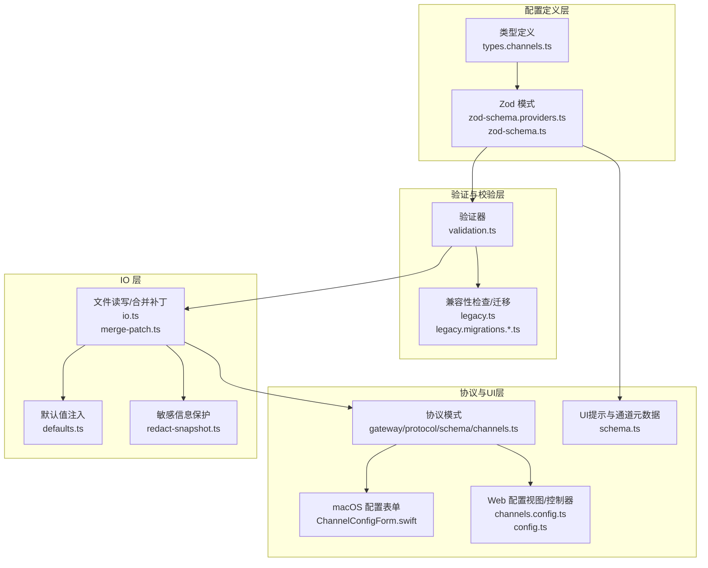
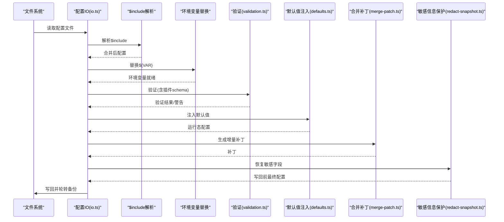
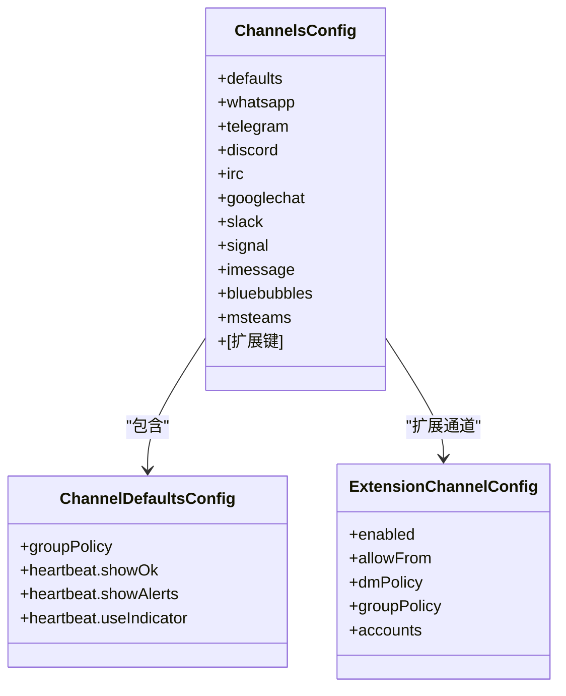
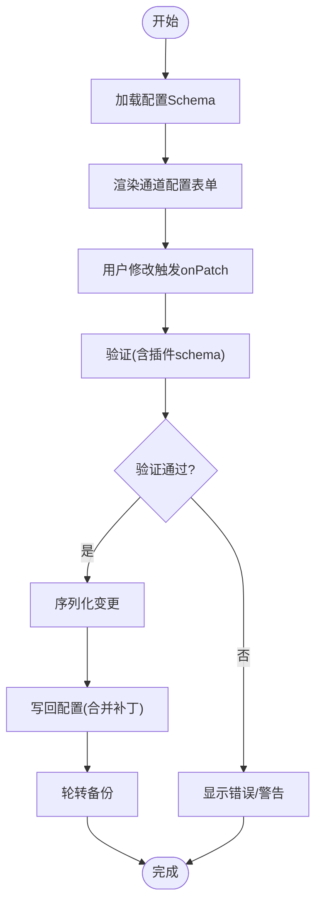
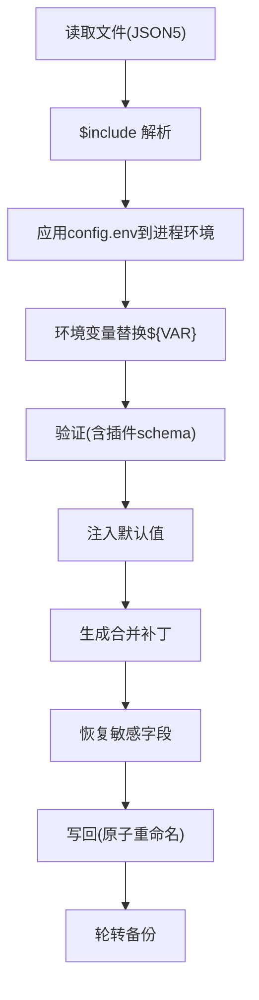
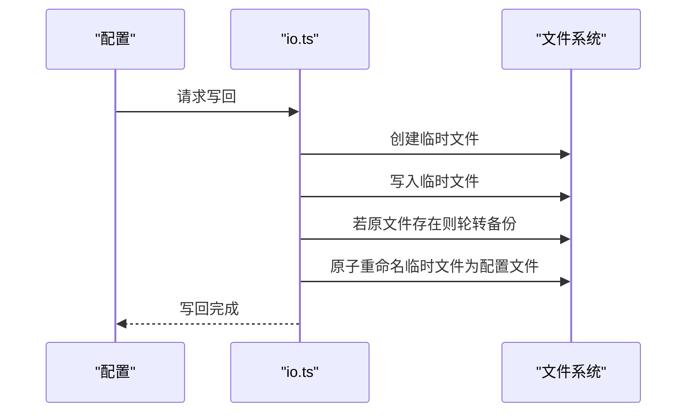
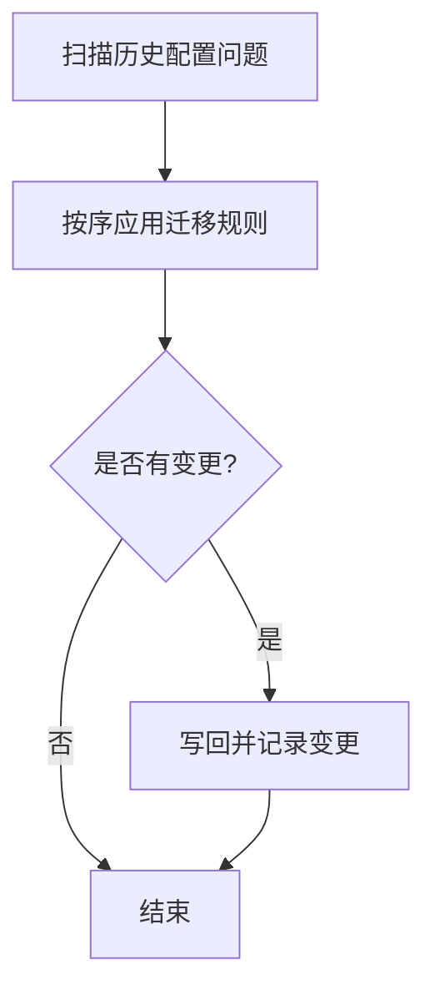
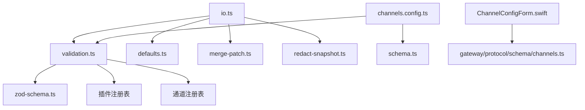

# 渠道配置管理

<cite>
**本文档引用的文件**
- [src/config/types.channels.ts](file://src/config/types.channels.ts)
- [src/config/zod-schema.providers.ts](file://src/config/zod-schema.providers.ts)
- [src/config/zod-schema.ts](file://src/config/zod-schema.ts)
- [src/config/validation.ts](file://src/config/validation.ts)
- [src/config/io.ts](file://src/config/io.ts)
- [src/config/defaults.ts](file://src/config/defaults.ts)
- [src/config/merge-patch.ts](file://src/config/merge-patch.ts)
- [src/config/redact-snapshot.ts](file://src/config/redact-snapshot.ts)
- [src/config/legacy.migrations.ts](file://src/config/legacy.migrations.ts)
- [src/config/legacy.migrations.part-1.ts](file://src/config/legacy.migrations.part-1.ts)
- [src/config/legacy.migrations.part-2.ts](file://src/config/legacy.migrations.part-2.ts)
- [src/config/legacy.ts](file://src/config/legacy.ts)
- [src/config/version.ts](file://src/config/version.ts)
- [src/gateway/protocol/schema/channels.ts](file://src/gateway/protocol/schema/channels.ts)
- [apps/macos/Sources/OpenClaw/ChannelConfigForm.swift](file://apps/macos/Sources/OpenClaw/ChannelConfigForm.swift)
- [ui/src/ui/views/channels.config.ts](file://ui/src/ui/views/channels.config.ts)
- [ui/src/ui/controllers/config.ts](file://ui/src/ui/controllers/config.ts)
- [src/config/schema.ts](file://src/config/schema.ts)
</cite>

## 目录

1. [简介](#简介)
2. [项目结构](#项目结构)
3. [核心组件](#核心组件)
4. [架构总览](#架构总览)
5. [详细组件分析](#详细组件分析)
6. [依赖关系分析](#依赖关系分析)
7. [性能考虑](#性能考虑)
8. [故障排除指南](#故障排除指南)
9. [结论](#结论)
10. [附录](#附录)

## 简介

本文件系统化阐述 OpenClaw 渠道配置管理的技术方案，覆盖数据结构设计、验证规则、动态更新机制、配置文件格式与字段定义、默认值处理、存储策略、备份恢复与版本管理、配置迁移与兼容性处理、错误修复机制，以及配置优化建议与批量配置管理工具使用指南。目标是帮助开发者与运维人员在理解代码实现的基础上，安全、高效地维护与扩展渠道配置。

## 项目结构

OpenClaw 的渠道配置管理由“类型定义 + 校验 + 解析/写入 + 默认值 + 迁移 + UI/协议适配”等模块协同完成。关键路径如下：

- 类型与模式：`src/config/types.channels.ts`、`src/config/zod-schema.providers.ts`、`src/config/zod-schema.ts`
- 验证与校验：`src/config/validation.ts`
- 文件读写与合并补丁：`src/config/io.ts`、`src/config/merge-patch.ts`
- 默认值注入：`src/config/defaults.ts`
- 敏感信息保护：`src/config/redact-snapshot.ts`
- 兼容性迁移：`src/config/legacy.migrations.ts` 及其分片
- 协议与 UI 适配：`src/gateway/protocol/schema/channels.ts`、`apps/macos/Sources/OpenClaw/ChannelConfigForm.swift`、`ui/src/ui/views/channels.config.ts`、`ui/src/ui/controllers/config.ts`
- 版本解析与比较：`src/config/version.ts`

**图表来源**

- [src/config/types.channels.ts](file://src/config/types.channels.ts#L1-L55)
- [src/config/zod-schema.providers.ts](file://src/config/zod-schema.providers.ts#L1-L43)
- [src/config/zod-schema.ts](file://src/config/zod-schema.ts#L1-L639)
- [src/config/validation.ts](file://src/config/validation.ts#L1-L405)
- [src/config/io.ts](file://src/config/io.ts#L1-L695)
- [src/config/defaults.ts](file://src/config/defaults.ts#L1-L471)
- [src/config/redact-snapshot.ts](file://src/config/redact-snapshot.ts#L152-L190)
- [src/config/legacy.migrations.ts](file://src/config/legacy.migrations.ts#L1-L9)
- [src/config/legacy.migrations.part-1.ts](file://src/config/legacy.migrations.part-1.ts#L1-L380)
- [src/config/legacy.migrations.part-2.ts](file://src/config/legacy.migrations.part-2.ts#L1-L415)
- [src/config/legacy.ts](file://src/config/legacy.ts#L1-L43)
- [src/gateway/protocol/schema/channels.ts](file://src/gateway/protocol/schema/channels.ts#L1-L18)
- [apps/macos/Sources/OpenClaw/ChannelConfigForm.swift](file://apps/macos/Sources/OpenClaw/ChannelConfigForm.swift#L348-L363)
- [ui/src/ui/views/channels.config.ts](file://ui/src/ui/views/channels.config.ts#L106-L137)
- [ui/src/ui/controllers/config.ts](file://ui/src/ui/controllers/config.ts#L79-L109)
- [src/config/schema.ts](file://src/config/schema.ts#L134-L187)

**章节来源**

- [src/config/types.channels.ts](file://src/config/types.channels.ts#L1-L55)
- [src/config/zod-schema.providers.ts](file://src/config/zod-schema.providers.ts#L1-L43)
- [src/config/zod-schema.ts](file://src/config/zod-schema.ts#L1-L639)
- [src/config/validation.ts](file://src/config/validation.ts#L1-L405)
- [src/config/io.ts](file://src/config/io.ts#L1-L695)
- [src/config/defaults.ts](file://src/config/defaults.ts#L1-L471)
- [src/config/merge-patch.ts](file://src/config/merge-patch.ts#L1-L27)
- [src/config/redact-snapshot.ts](file://src/config/redact-snapshot.ts#L152-L190)
- [src/config/legacy.migrations.ts](file://src/config/legacy.migrations.ts#L1-L9)
- [src/config/legacy.migrations.part-1.ts](file://src/config/legacy.migrations.part-1.ts#L1-L380)
- [src/config/legacy.migrations.part-2.ts](file://src/config/legacy.migrations.part-2.ts#L1-L415)
- [src/config/legacy.ts](file://src/config/legacy.ts#L1-L43)
- [src/gateway/protocol/schema/channels.ts](file://src/gateway/protocol/schema/channels.ts#L1-L18)
- [apps/macos/Sources/OpenClaw/ChannelConfigForm.swift](file://apps/macos/Sources/OpenClaw/ChannelConfigForm.swift#L348-L363)
- [ui/src/ui/views/channels.config.ts](file://ui/src/ui/views/channels.config.ts#L106-L137)
- [ui/src/ui/controllers/config.ts](file://ui/src/ui/controllers/config.ts#L79-L109)
- [src/config/schema.ts](file://src/config/schema.ts#L134-L187)

## 核心组件

- 渠道类型与默认值
  - 渠道配置类型定义位于 `types.channels.ts`，涵盖默认组策略、心跳可见性、扩展通道配置等。
  - 渠道模式由 `zod-schema.providers.ts` 定义，并通过 `zod-schema.ts` 组合到全局模式中，支持 passthrough 以允许扩展通道键。
- 验证与兼容性
  - `validation.ts` 提供严格验证，包括未知键拒绝、插件 schema 校验、通道 ID 合法性、心跳目标合法性等。
  - `legacy.ts` 与 `legacy.migrations.*.ts` 负责历史配置问题识别与迁移。
- 文件读写与默认值注入
  - `io.ts` 负责配置文件读取、$include 解析、环境变量替换、验证、默认值注入、合并补丁生成与写回。
  - `merge-patch.ts` 提供增量补丁应用逻辑，保证只写入变更。
  - `defaults.ts` 提供模型、会话、代理、日志、上下文修剪、压缩等默认值注入。
- 敏感信息保护
  - `redact-snapshot.ts` 在写回前恢复敏感字段，防止凭据丢失。
- 协议与 UI 适配
  - `gateway/protocol/schema/channels.ts` 定义通道状态相关协议参数。
  - macOS 与 Web UI 通过各自的表单/视图渲染渠道配置，结合 `schema.ts` 的 UI 提示与通道元数据进行动态展示。

**章节来源**

- [src/config/types.channels.ts](file://src/config/types.channels.ts#L1-L55)
- [src/config/zod-schema.providers.ts](file://src/config/zod-schema.providers.ts#L1-L43)
- [src/config/zod-schema.ts](file://src/config/zod-schema.ts#L1-L639)
- [src/config/validation.ts](file://src/config/validation.ts#L1-L405)
- [src/config/io.ts](file://src/config/io.ts#L1-L695)
- [src/config/merge-patch.ts](file://src/config/merge-patch.ts#L1-L27)
- [src/config/defaults.ts](file://src/config/defaults.ts#L1-L471)
- [src/config/redact-snapshot.ts](file://src/config/redact-snapshot.ts#L152-L190)
- [src/gateway/protocol/schema/channels.ts](file://src/gateway/protocol/schema/channels.ts#L1-L18)
- [apps/macos/Sources/OpenClaw/ChannelConfigForm.swift](file://apps/macos/Sources/OpenClaw/ChannelConfigForm.swift#L348-L363)
- [ui/src/ui/views/channels.config.ts](file://ui/src/ui/views/channels.config.ts#L106-L137)
- [ui/src/ui/controllers/config.ts](file://ui/src/ui/controllers/config.ts#L79-L109)
- [src/config/schema.ts](file://src/config/schema.ts#L134-L187)

## 架构总览

下图展示了从配置文件到运行态配置的关键流程：读取 -> 包含解析 -> 环境变量替换 -> 验证 -> 默认值注入 -> 写回（含合并补丁与备份）。

**图表来源**

- [src/config/io.ts](file://src/config/io.ts#L400-L599)
- [src/config/merge-patch.ts](file://src/config/merge-patch.ts#L1-L27)
- [src/config/defaults.ts](file://src/config/defaults.ts#L1-L471)
- [src/config/redact-snapshot.ts](file://src/config/redact-snapshot.ts#L152-L190)
- [src/config/validation.ts](file://src/config/validation.ts#L1-L405)

## 详细组件分析

### 数据结构设计与字段定义

- 渠道配置根结构
  - channels.defaults：包含组策略与心跳可见性等默认项。
  - channels.<channelId>：内置渠道（如 whatsapp、telegram、discord 等）与扩展渠道键均在此处声明。
  - 扩展通道采用动态键，便于第三方插件注册自定义渠道配置。
- Zod 模式约束
  - ChannelsSchema 使用 strict() 限制未知键，passthrough() 放宽扩展键，确保兼容性与安全性平衡。
  - 每个内置渠道均有独立的配置模式，统一收敛到 ChannelsSchema 下。
- 类型别名与默认值
  - ChannelDefaultsConfig、ExtensionChannelConfig 等类型为扩展通道提供一致的基线字段。

**图表来源**

- [src/config/types.channels.ts](file://src/config/types.channels.ts#L12-L55)
- [src/config/zod-schema.providers.ts](file://src/config/zod-schema.providers.ts#L21-L43)

**章节来源**

- [src/config/types.channels.ts](file://src/config/types.channels.ts#L1-L55)
- [src/config/zod-schema.providers.ts](file://src/config/zod-schema.providers.ts#L1-L43)
- [src/config/zod-schema.ts](file://src/config/zod-schema.ts#L1-L639)

### 验证规则与动态更新机制

- 严格验证
  - 未知键拒绝：OpenClawSchema 使用 strict() 与 superRefine 自定义校验，确保未知键直接报错。
  - 插件 schema 校验：对已启用或存在配置的插件执行 JSON Schema 校验，缺失 schema 将触发错误。
  - 通道 ID 合法性：校验 channels 下的键是否属于已知通道集合（含内置与插件声明）。
  - 心跳目标合法性：校验 agents.defaults.heartbeat.target 与 agents.list[].heartbeat.target 是否为合法通道或保留关键字。
- 动态更新
  - Web UI 通过 ConfigSchemaForm 渲染 schema，支持按路径 onPatch 更新。
  - macOS UI 依据 store.channelConfigSchema 动态渲染对应通道表单。
  - UI 提示与通道元数据通过 applyChannelHints 合并，支持 label/help/group/order 等 UI hint。

**图表来源**

- [ui/src/ui/views/channels.config.ts](file://ui/src/ui/views/channels.config.ts#L106-L137)
- [ui/src/ui/controllers/config.ts](file://ui/src/ui/controllers/config.ts#L79-L109)
- [src/config/schema.ts](file://src/config/schema.ts#L134-L187)
- [src/config/validation.ts](file://src/config/validation.ts#L148-L404)

**章节来源**

- [src/config/validation.ts](file://src/config/validation.ts#L1-L405)
- [ui/src/ui/views/channels.config.ts](file://ui/src/ui/views/channels.config.ts#L106-L137)
- [ui/src/ui/controllers/config.ts](file://ui/src/ui/controllers/config.ts#L79-L109)
- [src/config/schema.ts](file://src/config/schema.ts#L134-L187)

### 配置文件格式、字段定义与默认值处理

- 文件格式与解析
  - 使用 JSON5 解析，支持注释与尾随逗号；$include 指令用于拆分配置。
  - 环境变量替换：先应用 config.env 到 process.env，再进行 ${VAR} 替换。
- 字段定义与默认值
  - 模型默认值：成本、输入类型、上下文窗口、最大输出令牌等自动补齐。
  - 代理默认并发、子代理并发、日志敏感信息脱敏策略等。
  - 上下文修剪与心跳周期根据认证模式自动调整。
- 写回策略
  - 仅写入显式设置的值，避免运行时默认污染用户配置。
  - 使用合并补丁生成最小变更集，减少磁盘写入与冲突。

**图表来源**

- [src/config/io.ts](file://src/config/io.ts#L400-L599)
- [src/config/merge-patch.ts](file://src/config/merge-patch.ts#L1-L27)
- [src/config/defaults.ts](file://src/config/defaults.ts#L1-L471)
- [src/config/redact-snapshot.ts](file://src/config/redact-snapshot.ts#L152-L190)

**章节来源**

- [src/config/io.ts](file://src/config/io.ts#L1-L695)
- [src/config/merge-patch.ts](file://src/config/merge-patch.ts#L1-L27)
- [src/config/defaults.ts](file://src/config/defaults.ts#L1-L471)
- [src/config/redact-snapshot.ts](file://src/config/redact-snapshot.ts#L152-L190)

### 存储策略、备份恢复与版本管理

- 存储策略
  - 写回时仅持久化显式设置的值，运行时默认值在加载时注入，避免污染用户配置。
  - 使用临时文件 + 原子重命名，确保写入一致性。
- 备份恢复
  - 写回前轮转现有备份（默认保留 N 份），并生成新备份文件。
  - 备份文件命名遵循约定，便于人工恢复。
- 版本管理
  - 写回时自动打上版本戳（lastTouchedVersion、lastTouchedAt）。
  - 版本解析与比较函数支持跨版本兼容性判断。

**图表来源**

- [src/config/io.ts](file://src/config/io.ts#L551-L599)
- [src/config/io.ts](file://src/config/io.ts#L143-L160)
- [src/config/version.ts](file://src/config/version.ts#L1-L50)

**章节来源**

- [src/config/io.ts](file://src/config/io.ts#L143-L160)
- [src/config/io.ts](file://src/config/io.ts#L551-L599)
- [src/config/version.ts](file://src/config/version.ts#L1-L50)

### 配置迁移、兼容性处理与错误修复

- 兼容性规则
  - legacy.ts 提供规则扫描，发现历史配置问题（如过时键、非法值）。
- 迁移策略
  - legacy.migrations.ts 聚合三部分迁移规则，按顺序应用。
  - part-1/part-2 覆盖 bindings、routing、agents、tools、audio 等多维度迁移。
  - 迁移过程中记录变更详情，避免重复迁移与覆盖。
- 错误修复
  - 严格验证失败时返回具体路径与消息，便于定位修复。
  - 写回前进行敏感字段恢复，防止凭据丢失。

**图表来源**

- [src/config/legacy.ts](file://src/config/legacy.ts#L1-L43)
- [src/config/legacy.migrations.ts](file://src/config/legacy.migrations.ts#L1-L9)
- [src/config/legacy.migrations.part-1.ts](file://src/config/legacy.migrations.part-1.ts#L1-L380)
- [src/config/legacy.migrations.part-2.ts](file://src/config/legacy.migrations.part-2.ts#L1-L415)

**章节来源**

- [src/config/legacy.ts](file://src/config/legacy.ts#L1-L43)
- [src/config/legacy.migrations.ts](file://src/config/legacy.migrations.ts#L1-L9)
- [src/config/legacy.migrations.part-1.ts](file://src/config/legacy.migrations.part-1.ts#L1-L380)
- [src/config/legacy.migrations.part-2.ts](file://src/config/legacy.migrations.part-2.ts#L1-L415)

### 批量配置管理工具使用指南

- Web UI
  - renderChannelConfigForm 根据 schema 与 UI Hints 渲染通道配置表单，支持禁用、禁用脏标记、原始模式切换等。
  - applyConfigSnapshot 将快照应用到状态，自动同步 raw/form/valid/issues。
- macOS UI
  - ChannelConfigForm 动态选择 schema 并渲染对应通道配置。
- 使用建议
  - 优先使用表单模式，利用 schema 与 UI Hints 提升正确性。
  - 对于复杂批量场景，建议通过脚本生成/合并 JSON5 并配合 doctor dry-run 预检。

**章节来源**

- [ui/src/ui/views/channels.config.ts](file://ui/src/ui/views/channels.config.ts#L106-L137)
- [ui/src/ui/controllers/config.ts](file://ui/src/ui/controllers/config.ts#L79-L109)
- [apps/macos/Sources/OpenClaw/ChannelConfigForm.swift](file://apps/macos/Sources/OpenClaw/ChannelConfigForm.swift#L348-L363)

## 依赖关系分析

- 组件耦合
  - 验证层依赖类型与模式定义，同时依赖插件注册表与通道注册表。
  - IO 层依赖验证与默认值注入，向上游提供稳定接口。
  - UI 层依赖协议与 schema，向下依赖控制器与表单渲染。
- 外部依赖
  - JSON5 解析、文件系统、进程环境变量、版本比较等基础能力。

**图表来源**

- [src/config/validation.ts](file://src/config/validation.ts#L1-L405)
- [src/config/zod-schema.ts](file://src/config/zod-schema.ts#L1-L639)
- [src/config/io.ts](file://src/config/io.ts#L1-L695)
- [src/config/defaults.ts](file://src/config/defaults.ts#L1-L471)
- [src/config/merge-patch.ts](file://src/config/merge-patch.ts#L1-L27)
- [src/config/redact-snapshot.ts](file://src/config/redact-snapshot.ts#L152-L190)
- [ui/src/ui/views/channels.config.ts](file://ui/src/ui/views/channels.config.ts#L106-L137)
- [src/config/schema.ts](file://src/config/schema.ts#L134-L187)
- [apps/macos/Sources/OpenClaw/ChannelConfigForm.swift](file://apps/macos/Sources/OpenClaw/ChannelConfigForm.swift#L348-L363)
- [src/gateway/protocol/schema/channels.ts](file://src/gateway/protocol/schema/channels.ts#L1-L18)

**章节来源**

- [src/config/validation.ts](file://src/config/validation.ts#L1-L405)
- [src/config/io.ts](file://src/config/io.ts#L1-L695)
- [ui/src/ui/views/channels.config.ts](file://ui/src/ui/views/channels.config.ts#L106-L137)
- [apps/macos/Sources/OpenClaw/ChannelConfigForm.swift](file://apps/macos/Sources/OpenClaw/ChannelConfigForm.swift#L348-L363)

## 性能考虑

- 验证与默认值注入
  - 仅在读取与写回阶段执行，避免运行时开销。
  - 合并补丁减少磁盘写入与序列化成本。
- IO 与备份
  - 原子重命名避免部分写入风险；备份轮转控制占用空间。
- UI 渲染
  - 按需渲染与禁用脏标记可降低频繁重绘成本。

## 故障排除指南

- 常见问题与定位
  - JSON5 解析失败：检查文件语法与注释使用。
  - 环境变量缺失：确认 config.env 与进程环境变量设置。
  - 未知键/插件 schema 缺失：根据 issues 输出逐项修复。
  - 心跳目标非法：核对通道 ID 或保留关键字。
- 修复步骤
  - 使用 doctor dry-run 预检配置。
  - 应用迁移规则后重试。
  - 通过备份文件回滚到上一个稳定版本。

**章节来源**

- [src/config/io.ts](file://src/config/io.ts#L414-L548)
- [src/config/validation.ts](file://src/config/validation.ts#L90-L146)
- [src/config/legacy.ts](file://src/config/legacy.ts#L1-L43)

## 结论

OpenClaw 的渠道配置管理通过严格的类型与模式定义、完备的验证与兼容性迁移、稳健的文件读写与备份机制，以及灵活的 UI 适配，实现了高可靠性与可维护性的配置体系。遵循本文档的规范与最佳实践，可在保障安全性的前提下高效管理大规模渠道配置。

## 附录

- 关键流程图与类图已在前述章节中给出，读者可据此快速定位实现细节与调用关系。
- 如需进一步了解特定渠道的配置字段，请参考对应的类型与模式文件。
