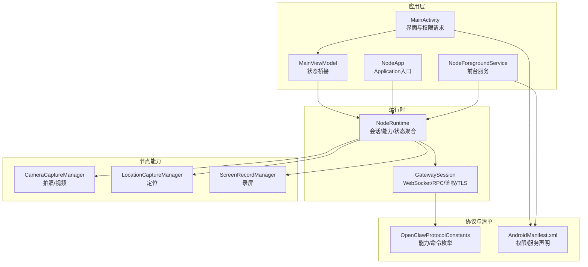
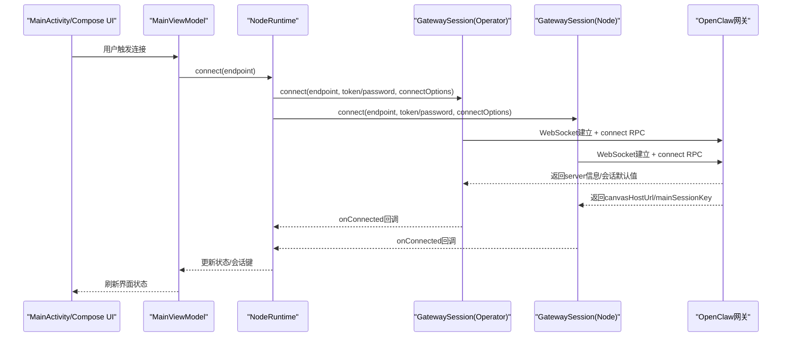
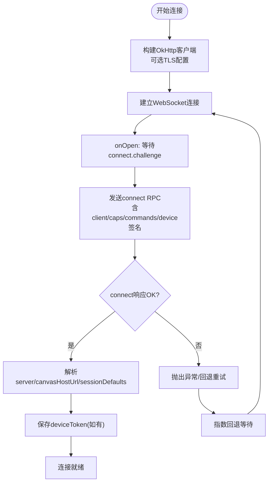
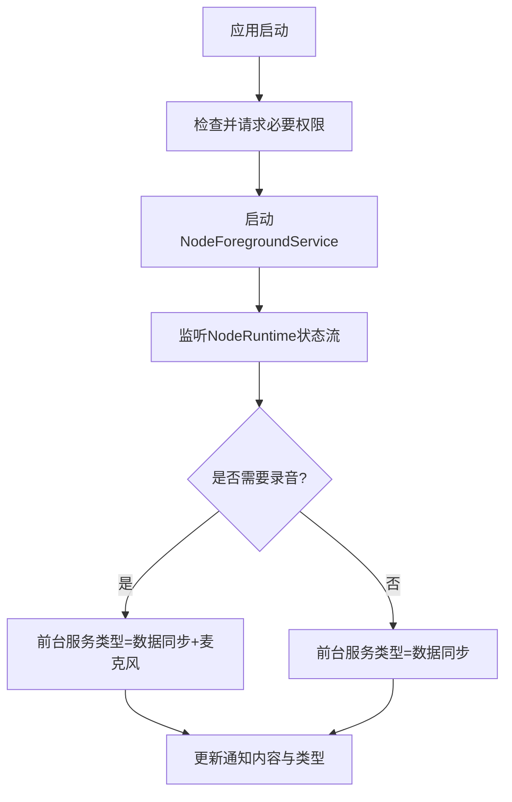
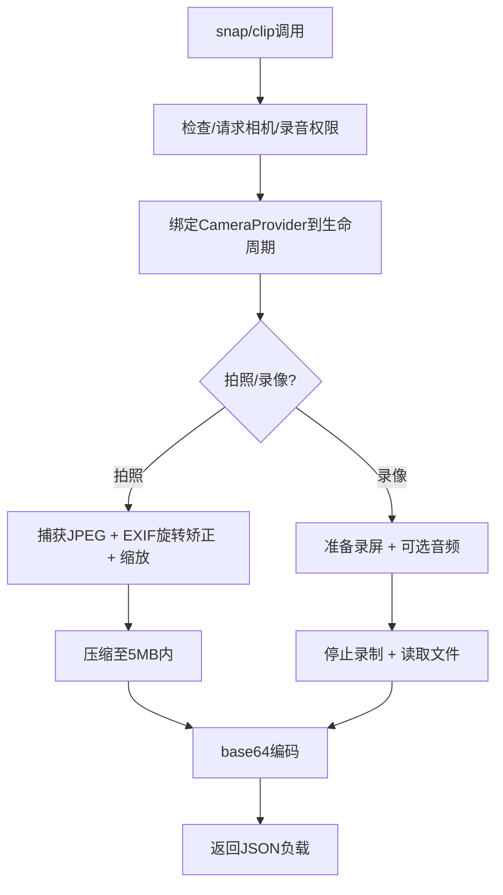
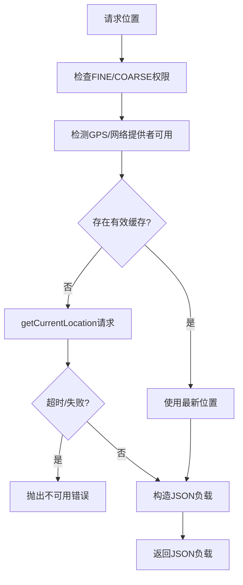
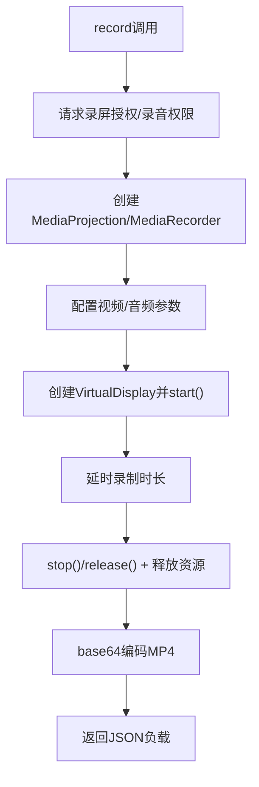
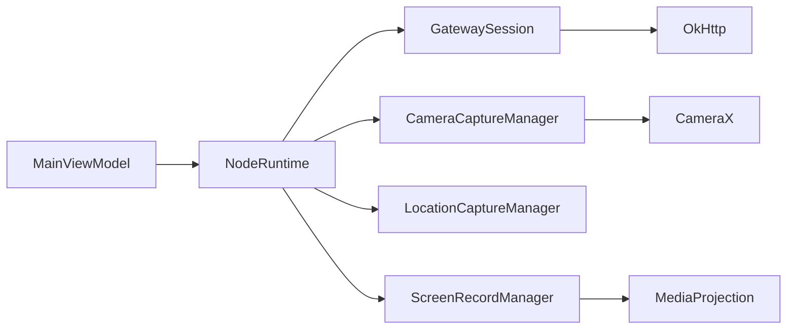

# Android应用

<cite>
**本文引用的文件**
- [apps/android/app/src/main/java/ai/openclaw/android/MainActivity.kt](file://apps/android/app/src/main/java/ai/openclaw/android/MainActivity.kt)
- [apps/android/app/src/main/java/ai/openclaw/android/MainViewModel.kt](file://apps/android/app/src/main/java/ai/openclaw/android/MainViewModel.kt)
- [apps/android/app/src/main/java/ai/openclaw/android/NodeRuntime.kt](file://apps/android/app/src/main/java/ai/openclaw/android/NodeRuntime.kt)
- [apps/android/app/src/main/java/ai/openclaw/android/NodeApp.kt](file://apps/android/app/src/main/java/ai/openclaw/android/NodeApp.kt)
- [apps/android/app/src/main/java/ai/openclaw/android/NodeForegroundService.kt](file://apps/android/app/src/main/java/ai/openclaw/android/NodeForegroundService.kt)
- [apps/android/app/src/main/java/ai/openclaw/android/gateway/GatewaySession.kt](file://apps/android/app/src/main/java/ai/openclaw/android/gateway/GatewaySession.kt)
- [apps/android/app/src/main/java/ai/openclaw/android/node/CameraCaptureManager.kt](file://apps/android/app/src/main/java/ai/openclaw/android/node/CameraCaptureManager.kt)
- [apps/android/app/src/main/java/ai/openclaw/android/node/LocationCaptureManager.kt](file://apps/android/app/src/main/java/ai/openclaw/android/node/LocationCaptureManager.kt)
- [apps/android/app/src/main/java/ai/openclaw/android/node/ScreenRecordManager.kt](file://apps/android/app/src/main/java/ai/openclaw/android/node/ScreenRecordManager.kt)
- [apps/android/app/src/main/java/ai/openclaw/android/protocol/OpenClawProtocolConstants.kt](file://apps/android/app/src/main/java/ai/openclaw/android/protocol/OpenClawProtocolConstants.kt)
- [apps/android/app/src/main/AndroidManifest.xml](file://apps/android/app/src/main/AndroidManifest.xml)
- [apps/android/app/build.gradle.kts](file://apps/android/app/build.gradle.kts)
- [apps/android/build.gradle.kts](file://apps/android/build.gradle.kts)
</cite>

## 目录

1. [简介](#简介)
2. [项目结构](#项目结构)
3. [核心组件](#核心组件)
4. [架构总览](#架构总览)
5. [详细组件分析](#详细组件分析)
6. [依赖关系分析](#依赖关系分析)
7. [性能考虑](#性能考虑)
8. [故障排查指南](#故障排查指南)
9. [结论](#结论)
10. [附录](#附录)

## 简介

本文件面向OpenClaw Android应用，系统性阐述Android节点如何连接到OpenClaw网关，包括WebSocket通信协议、设备配对与鉴权、权限体系、前台服务与后台运行、构建配置与依赖管理，以及Android特有能力（相机、位置、屏幕录制）的实现要点。同时提供安装部署、调试方法与性能优化建议，并对比Android与iOS在功能与平台差异上的实现策略。

## 项目结构

Android应用位于apps/android目录，采用Kotlin与Jetpack Compose UI，核心模块包括：

- 应用入口与生命周期：MainActivity、NodeApp、NodeForegroundService
- 运行时与状态：MainViewModel、NodeRuntime
- 网关通信：GatewaySession（WebSocket、RPC、鉴权、TLS）
- 节点能力：CameraCaptureManager、LocationCaptureManager、ScreenRecordManager
- 协议常量：OpenClawProtocolConstants（能力与命令枚举）
- 构建与依赖：app/build.gradle.kts、根级build.gradle.kts

图表来源

- [apps/android/app/src/main/java/ai/openclaw/android/MainActivity.kt](file://apps/android/app/src/main/java/ai/openclaw/android/MainActivity.kt#L25-L131)
- [apps/android/app/src/main/java/ai/openclaw/android/MainViewModel.kt](file://apps/android/app/src/main/java/ai/openclaw/android/MainViewModel.kt#L13-L175)
- [apps/android/app/src/main/java/ai/openclaw/android/NodeApp.kt](file://apps/android/app/src/main/java/ai/openclaw/android/NodeApp.kt#L6-L27)
- [apps/android/app/src/main/java/ai/openclaw/android/NodeForegroundService.kt](file://apps/android/app/src/main/java/ai/openclaw/android/NodeForegroundService.kt#L23-L181)
- [apps/android/app/src/main/java/ai/openclaw/android/NodeRuntime.kt](file://apps/android/app/src/main/java/ai/openclaw/android/NodeRuntime.kt#L61-L800)
- [apps/android/app/src/main/java/ai/openclaw/android/gateway/GatewaySession.kt](file://apps/android/app/src/main/java/ai/openclaw/android/gateway/GatewaySession.kt#L55-L684)
- [apps/android/app/src/main/java/ai/openclaw/android/node/CameraCaptureManager.kt](file://apps/android/app/src/main/java/ai/openclaw/android/node/CameraCaptureManager.kt#L37-L317)
- [apps/android/app/src/main/java/ai/openclaw/android/node/LocationCaptureManager.kt](file://apps/android/app/src/main/java/ai/openclaw/android/node/LocationCaptureManager.kt#L19-L118)
- [apps/android/app/src/main/java/ai/openclaw/android/node/ScreenRecordManager.kt](file://apps/android/app/src/main/java/ai/openclaw/android/node/ScreenRecordManager.kt#L16-L200)
- [apps/android/app/src/main/java/ai/openclaw/android/protocol/OpenClawProtocolConstants.kt](file://apps/android/app/src/main/java/ai/openclaw/android/protocol/OpenClawProtocolConstants.kt#L1-L72)
- [apps/android/app/src/main/AndroidManifest.xml](file://apps/android/app/src/main/AndroidManifest.xml#L1-L50)

章节来源

- [apps/android/app/src/main/java/ai/openclaw/android/MainActivity.kt](file://apps/android/app/src/main/java/ai/openclaw/android/MainActivity.kt#L25-L131)
- [apps/android/app/src/main/java/ai/openclaw/android/NodeApp.kt](file://apps/android/app/src/main/java/ai/openclaw/android/NodeApp.kt#L6-L27)
- [apps/android/app/src/main/AndroidManifest.xml](file://apps/android/app/src/main/AndroidManifest.xml#L1-L50)

## 核心组件

- MainActivity：负责沉浸式窗口、权限请求、通知权限、启动前台服务、Compose界面初始化与生命周期联动。
- MainViewModel：将NodeRuntime的状态与UI绑定，暴露连接、聊天、节点能力等操作接口。
- NodeRuntime：应用运行时核心，管理网关会话（operator/node）、能力与命令集合、用户代理、自动重连、Canvas调试状态、A2UI动作转发等。
- NodeForegroundService：前台服务，持续显示连接状态通知，按需动态更新前台服务类型（数据同步/麦克风/录屏）。
- GatewaySession：基于OkHttp WebSocket的会话层，封装connect RPC、事件分发、invoke请求/响应、TLS指纹校验与持久化。
- 节点能力管理器：CameraCaptureManager（拍照/视频）、LocationCaptureManager（定位）、ScreenRecordManager（录屏）。
- 协议常量：OpenClawProtocolConstants（能力与命令命名空间）。

章节来源

- [apps/android/app/src/main/java/ai/openclaw/android/MainViewModel.kt](file://apps/android/app/src/main/java/ai/openclaw/android/MainViewModel.kt#L13-L175)
- [apps/android/app/src/main/java/ai/openclaw/android/NodeRuntime.kt](file://apps/android/app/src/main/java/ai/openclaw/android/NodeRuntime.kt#L61-L800)
- [apps/android/app/src/main/java/ai/openclaw/android/NodeForegroundService.kt](file://apps/android/app/src/main/java/ai/openclaw/android/NodeForegroundService.kt#L23-L181)
- [apps/android/app/src/main/java/ai/openclaw/android/gateway/GatewaySession.kt](file://apps/android/app/src/main/java/ai/openclaw/android/gateway/GatewaySession.kt#L55-L684)
- [apps/android/app/src/main/java/ai/openclaw/android/node/CameraCaptureManager.kt](file://apps/android/app/src/main/java/ai/openclaw/android/node/CameraCaptureManager.kt#L37-L317)
- [apps/android/app/src/main/java/ai/openclaw/android/node/LocationCaptureManager.kt](file://apps/android/app/src/main/java/ai/openclaw/android/node/LocationCaptureManager.kt#L19-L118)
- [apps/android/app/src/main/java/ai/openclaw/android/node/ScreenRecordManager.kt](file://apps/android/app/src/main/java/ai/openclaw/android/node/ScreenRecordManager.kt#L16-L200)
- [apps/android/app/src/main/java/ai/openclaw/android/protocol/OpenClawProtocolConstants.kt](file://apps/android/app/src/main/java/ai/openclaw/android/protocol/OpenClawProtocolConstants.kt#L1-L72)

## 架构总览

Android节点通过两个角色连接同一网关：

- Operator会话：用于控制UI交互与聊天（connect携带client信息、capabilities、commands等）。
- Node会话：用于节点能力调用（invoke），承载camera/screen/location/sms等命令。

图表来源

- [apps/android/app/src/main/java/ai/openclaw/android/NodeRuntime.kt](file://apps/android/app/src/main/java/ai/openclaw/android/NodeRuntime.kt#L560-L570)
- [apps/android/app/src/main/java/ai/openclaw/android/gateway/GatewaySession.kt](file://apps/android/app/src/main/java/ai/openclaw/android/gateway/GatewaySession.kt#L102-L133)
- [apps/android/app/src/main/java/ai/openclaw/android/gateway/GatewaySession.kt](file://apps/android/app/src/main/java/ai/openclaw/android/gateway/GatewaySession.kt#L294-L326)

## 详细组件分析

### WebSocket通信与设备配对流程

- 连接建立：GatewaySession基于OkHttp创建WebSocket，发送connect RPC并解析返回的server信息、canvasHostUrl与mainSessionKey。
- 鉴权与签名：支持token/password两种认证；connect参数中包含设备公钥签名与可选nonce，满足网关端设备身份验证要求。
- TLS指纹：支持WSS，可从网关事件中提取TLS指纹并持久化，后续连接时进行指纹校验或首次信任（TOFU）。
- 自动重连：runLoop循环尝试连接，指数回退延迟，断线时清理状态并触发UI提示。
- 设备配对：首次成功connect后，网关下发deviceToken，NodeRuntime写入DeviceAuthStore，后续连接可自动复用。

图表来源

- [apps/android/app/src/main/java/ai/openclaw/android/gateway/GatewaySession.kt](file://apps/android/app/src/main/java/ai/openclaw/android/gateway/GatewaySession.kt#L193-L203)
- [apps/android/app/src/main/java/ai/openclaw/android/gateway/GatewaySession.kt](file://apps/android/app/src/main/java/ai/openclaw/android/gateway/GatewaySession.kt#L294-L326)
- [apps/android/app/src/main/java/ai/openclaw/android/gateway/GatewaySession.kt](file://apps/android/app/src/main/java/ai/openclaw/android/gateway/GatewaySession.kt#L548-L583)

章节来源

- [apps/android/app/src/main/java/ai/openclaw/android/gateway/GatewaySession.kt](file://apps/android/app/src/main/java/ai/openclaw/android/gateway/GatewaySession.kt#L55-L684)
- [apps/android/app/src/main/java/ai/openclaw/android/NodeRuntime.kt](file://apps/android/app/src/main/java/ai/openclaw/android/NodeRuntime.kt#L616-L650)

### 权限系统与前台服务

- 权限声明：网络、位置（粗/细/后台）、相机、录音、短信、近场WiFi发现、通知等。
- 权限请求：MainActivity在必要时请求NEARBY_WIFI_DEVICES（Android 13+）与POST_NOTIFICATIONS；相机/录音/位置在具体能力使用前由各管理器触发。
- 前台服务：NodeForegroundService启动后持续显示通知，根据语音唤醒模式与录音权限动态调整前台服务类型（数据同步/麦克风/录屏），支持一键断开。

图表来源

- [apps/android/app/src/main/java/ai/openclaw/android/MainActivity.kt](file://apps/android/app/src/main/java/ai/openclaw/android/MainActivity.kt#L97-L129)
- [apps/android/app/src/main/java/ai/openclaw/android/NodeForegroundService.kt](file://apps/android/app/src/main/java/ai/openclaw/android/NodeForegroundService.kt#L36-L63)
- [apps/android/app/src/main/java/ai/openclaw/android/NodeForegroundService.kt](file://apps/android/app/src/main/java/ai/openclaw/android/NodeForegroundService.kt#L138-L153)
- [apps/android/app/src/main/AndroidManifest.xml](file://apps/android/app/src/main/AndroidManifest.xml#L1-L50)

章节来源

- [apps/android/app/src/main/java/ai/openclaw/android/MainActivity.kt](file://apps/android/app/src/main/java/ai/openclaw/android/MainActivity.kt#L97-L129)
- [apps/android/app/src/main/java/ai/openclaw/android/NodeForegroundService.kt](file://apps/android/app/src/main/java/ai/openclaw/android/NodeForegroundService.kt#L23-L181)
- [apps/android/app/src/main/AndroidManifest.xml](file://apps/android/app/src/main/AndroidManifest.xml#L1-L50)

### 相机访问与媒体处理

- 拍照：选择前置/后置摄像头，捕获JPEG，读取EXIF旋转角度并矫正，按最大宽度缩放，压缩至5MB以内，输出base64 JSON负载。
- 录像：支持开启音频，限定时长与帧率，生成MP4，输出base64 JSON负载。
- 参数解析：从JSON参数中解析镜头方向、质量、最大宽度、时长、帧率、是否包含音频等。

图表来源

- [apps/android/app/src/main/java/ai/openclaw/android/node/CameraCaptureManager.kt](file://apps/android/app/src/main/java/ai/openclaw/android/node/CameraCaptureManager.kt#L75-L137)
- [apps/android/app/src/main/java/ai/openclaw/android/node/CameraCaptureManager.kt](file://apps/android/app/src/main/java/ai/openclaw/android/node/CameraCaptureManager.kt#L140-L198)

章节来源

- [apps/android/app/src/main/java/ai/openclaw/android/node/CameraCaptureManager.kt](file://apps/android/app/src/main/java/ai/openclaw/android/node/CameraCaptureManager.kt#L37-L317)

### 位置服务

- 最新位置：优先使用最后一次已知位置（受权限与时效约束），否则通过getCurrentLocation请求实时位置。
- 输出格式：包含经纬度、精度、海拔、速度、航向、时间戳、来源、精确度标记等字段。

图表来源

- [apps/android/app/src/main/java/ai/openclaw/android/node/LocationCaptureManager.kt](file://apps/android/app/src/main/java/ai/openclaw/android/node/LocationCaptureManager.kt#L22-L62)
- [apps/android/app/src/main/java/ai/openclaw/android/node/LocationCaptureManager.kt](file://apps/android/app/src/main/java/ai/openclaw/android/node/LocationCaptureManager.kt#L86-L116)

章节来源

- [apps/android/app/src/main/java/ai/openclaw/android/node/LocationCaptureManager.kt](file://apps/android/app/src/main/java/ai/openclaw/android/node/LocationCaptureManager.kt#L19-L118)

### 屏幕录制

- 录制流程：通过MediaProjectionManager获取录屏授权，创建MediaRecorder并配置视频编码、帧率、比特率，创建VirtualDisplay镜像输出，录制指定时长后停止并编码为MP4。
- 参数校验：格式必须为mp4，screenIndex必须为0，帧率与时长有范围限制；可选包含音频。

图表来源

- [apps/android/app/src/main/java/ai/openclaw/android/node/ScreenRecordManager.kt](file://apps/android/app/src/main/java/ai/openclaw/android/node/ScreenRecordManager.kt#L30-L123)

章节来源

- [apps/android/app/src/main/java/ai/openclaw/android/node/ScreenRecordManager.kt](file://apps/android/app/src/main/java/ai/openclaw/android/node/ScreenRecordManager.kt#L16-L200)

### 构建配置与依赖管理

- Gradle插件：Android Application/Kotlin Android/Compose/Serialization。
- SDK版本：compileSdk 36，minSdk 31，targetSdk 36。
- Compose BOM统一版本，启用Compose与BuildConfig。
- 关键依赖：OkHttp（WebSocket）、CameraX（相机）、Material（UI主题）、Kotlinx Serialization（JSON）、Kotlinx Coroutines（协程）。
- 打包排除：META-INF许可证冲突排除；输出文件名包含版本号与构建类型。

章节来源

- [apps/android/app/build.gradle.kts](file://apps/android/app/build.gradle.kts#L10-L129)
- [apps/android/build.gradle.kts](file://apps/android/build.gradle.kts#L1-L7)

### 协议与命令

- 能力枚举：Canvas、Screen、Camera、Sms、VoiceWake、Location。
- 命令命名空间：canvas._、canvas.a2ui._、camera._、screen._、sms._、location._。
- NodeRuntime在连接时动态构建capabilities/commands，依据用户开关与权限决定是否上报。

章节来源

- [apps/android/app/src/main/java/ai/openclaw/android/protocol/OpenClawProtocolConstants.kt](file://apps/android/app/src/main/java/ai/openclaw/android/protocol/OpenClawProtocolConstants.kt#L1-L72)
- [apps/android/app/src/main/java/ai/openclaw/android/NodeRuntime.kt](file://apps/android/app/src/main/java/ai/openclaw/android/NodeRuntime.kt#L475-L487)

## 依赖关系分析

- 组件耦合：NodeRuntime聚合GatewaySession、CanvasController、Camera/Location/Screen/Sms管理器，MainViewModel仅作为UI桥接。
- 外部依赖：OkHttp提供WebSocket；CameraX提供相机能力；Android系统权限与服务（通知、前台服务、录屏）。
- 潜在风险：权限缺失导致能力不可用；录屏/录音权限未授予时调用会抛错；TLS指纹不匹配导致连接失败。

图表来源

- [apps/android/app/src/main/java/ai/openclaw/android/MainViewModel.kt](file://apps/android/app/src/main/java/ai/openclaw/android/MainViewModel.kt#L13-L175)
- [apps/android/app/src/main/java/ai/openclaw/android/NodeRuntime.kt](file://apps/android/app/src/main/java/ai/openclaw/android/NodeRuntime.kt#L61-L800)
- [apps/android/app/src/main/java/ai/openclaw/android/gateway/GatewaySession.kt](file://apps/android/app/src/main/java/ai/openclaw/android/gateway/GatewaySession.kt#L242-L252)
- [apps/android/app/src/main/java/ai/openclaw/android/node/CameraCaptureManager.kt](file://apps/android/app/src/main/java/ai/openclaw/android/node/CameraCaptureManager.kt#L13-L35)
- [apps/android/app/src/main/java/ai/openclaw/android/node/ScreenRecordManager.kt](file://apps/android/app/src/main/java/ai/openclaw/android/node/ScreenRecordManager.kt#L3-L15)

## 性能考虑

- 连接重试：指数回退上限约8秒，避免频繁重试造成电量与网络压力。
- 图像处理：拍照阶段先缩放再压缩，限制base64编码后的负载不超过5MB，降低传输与网关处理成本。
- 录屏参数：估算比特率在1M~12M之间，结合分辨率与帧率，平衡画质与带宽占用。
- 前台服务：仅在需要时启用麦克风类型，减少不必要的系统开销。
- UI与协程：使用Dispatchers.Main/IO分离UI与I/O密集任务，避免阻塞主线程。

## 故障排查指南

- 连接失败
  - 检查网络与DNS可达性；确认端口与协议（ws/wss）正确。
  - 若TLS指纹不匹配，清除旧指纹或在手动模式下允许TOFU。
  - 查看日志中的“Gateway error”与“connect failed”提示。
- 权限问题
  - 相机/录音/位置/录屏权限未授予会导致对应能力调用失败。
  - 建议在使用前主动请求权限或在错误中引导用户授权。
- 语音唤醒
  - 确认VoiceWakeMode与前台状态组合满足监听条件；无录音权限时会暂停监听。
- 通知与前台服务
  - 若通知未显示或类型不正确，检查前台服务类型与权限；确保服务正常启动。

章节来源

- [apps/android/app/src/main/java/ai/openclaw/android/gateway/GatewaySession.kt](file://apps/android/app/src/main/java/ai/openclaw/android/gateway/GatewaySession.kt#L271-L291)
- [apps/android/app/src/main/java/ai/openclaw/android/NodeForegroundService.kt](file://apps/android/app/src/main/java/ai/openclaw/android/NodeForegroundService.kt#L138-L153)
- [apps/android/app/src/main/java/ai/openclaw/android/node/CameraCaptureManager.kt](file://apps/android/app/src/main/java/ai/openclaw/android/node/CameraCaptureManager.kt#L51-L73)
- [apps/android/app/src/main/java/ai/openclaw/android/node/LocationCaptureManager.kt](file://apps/android/app/src/main/java/ai/openclaw/android/node/LocationCaptureManager.kt#L64-L84)
- [apps/android/app/src/main/java/ai/openclaw/android/node/ScreenRecordManager.kt](file://apps/android/app/src/main/java/ai/openclaw/android/node/ScreenRecordManager.kt#L30-L54)

## 结论

该Android应用以NodeRuntime为核心，通过GatewaySession实现与OpenClaw网关的双向WebSocket通信，支持设备配对、TLS指纹校验与自动重连。应用采用前台服务保障长期运行，配合权限请求与UI状态流实现良好的用户体验。相机、位置、录屏等能力均遵循Android权限模型与最佳实践，兼顾性能与稳定性。与iOS相比，Android侧在权限申请时机、前台服务类型动态切换等方面有更灵活的适配策略。

## 附录

- 安装与调试
  - 使用Android Studio或命令行构建APK；发布版禁用混淆以利于排障。
  - Debug构建启用StrictMode日志策略，便于发现潜在问题。
- 部署建议
  - 在目标设备上授予所有必要权限；首次连接建议使用自动发现或手动输入主机端口。
  - 对于WSS环境，确保TLS指纹正确或允许首次信任（TOFU）。

章节来源

- [apps/android/app/build.gradle.kts](file://apps/android/app/build.gradle.kts#L28-L32)
- [apps/android/app/src/main/java/ai/openclaw/android/NodeApp.kt](file://apps/android/app/src/main/java/ai/openclaw/android/NodeApp.kt#L11-L24)
