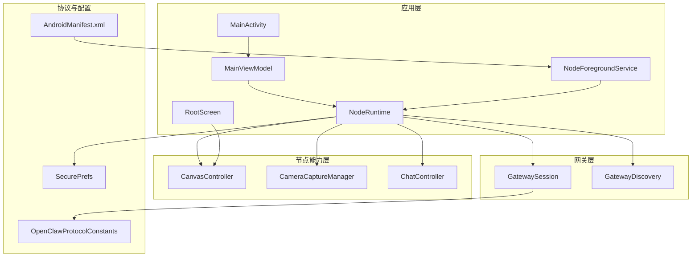
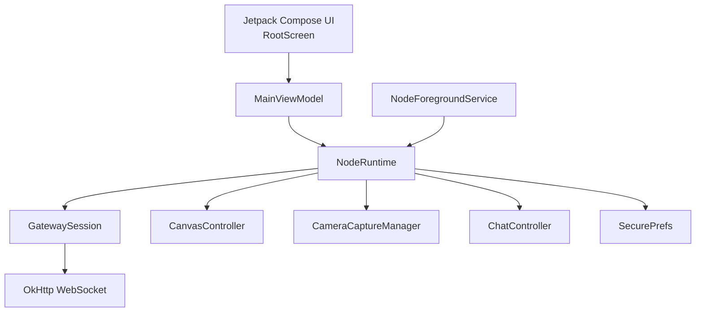
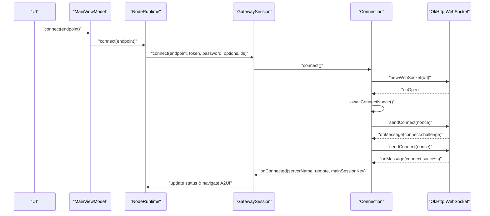
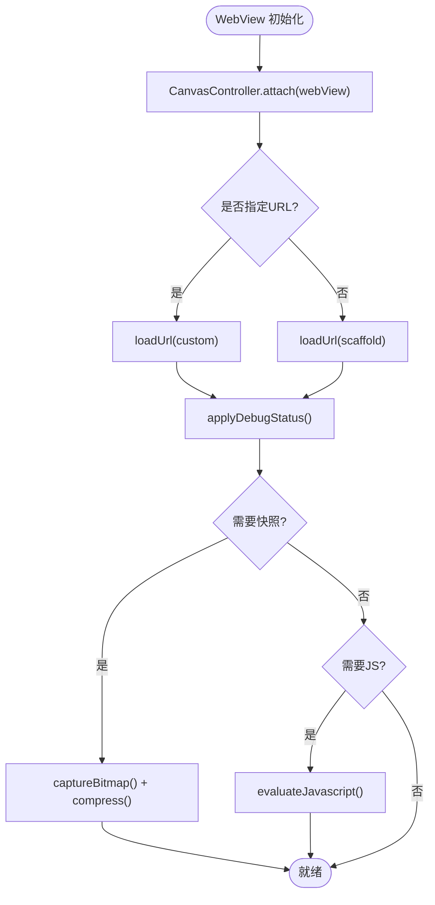
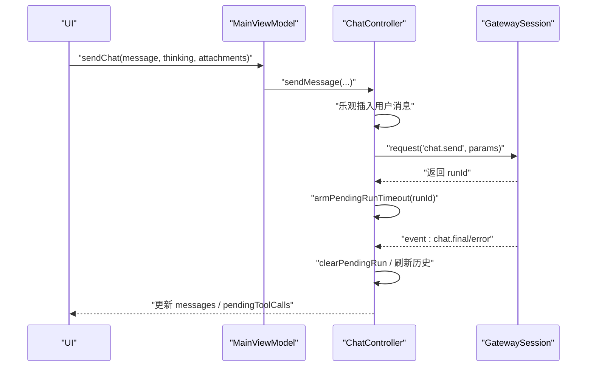
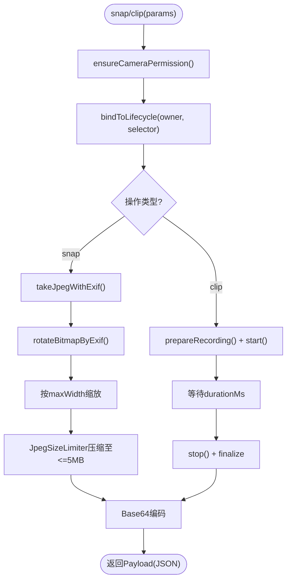
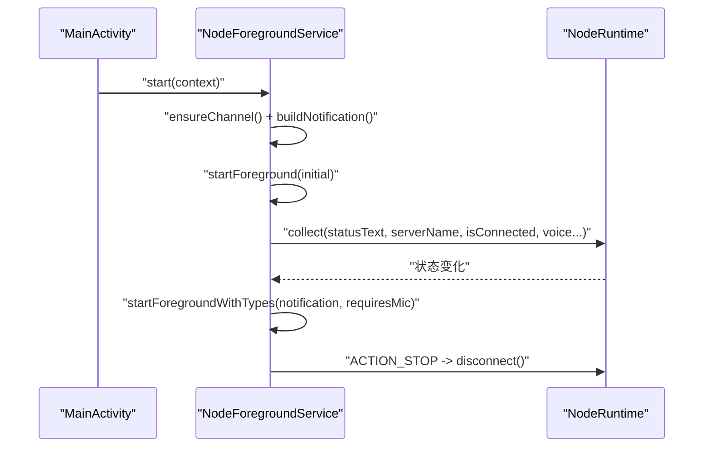
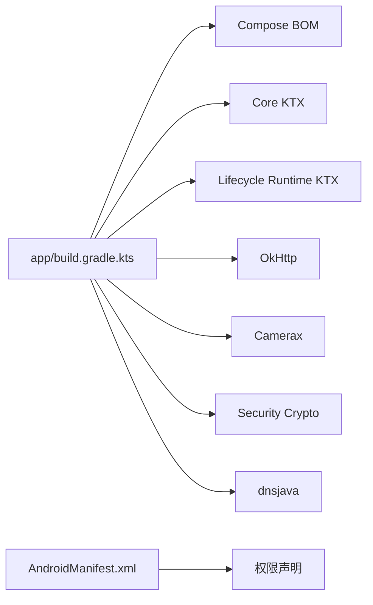

# 应用概述

<cite>
**本文档引用的文件**
- [apps/android/app/src/main/java/ai/openclaw/android/MainActivity.kt](file://apps/android/app/src/main/java/ai/openclaw/android/MainActivity.kt)
- [apps/android/app/src/main/java/ai/openclaw/android/NodeApp.kt](file://apps/android/app/src/main/java/ai/openclaw/android/NodeApp.kt)
- [apps/android/app/src/main/java/ai/openclaw/android/MainViewModel.kt](file://apps/android/app/src/main/java/ai/openclaw/android/MainViewModel.kt)
- [apps/android/app/src/main/java/ai/openclaw/android/NodeRuntime.kt](file://apps/android/app/src/main/java/ai/openclaw/android/NodeRuntime.kt)
- [apps/android/app/src/main/java/ai/openclaw/android/NodeForegroundService.kt](file://apps/android/app/src/main/java/ai/openclaw/android/NodeForegroundService.kt)
- [apps/android/app/src/main/java/ai/openclaw/android/gateway/GatewaySession.kt](file://apps/android/app/src/main/java/ai/openclaw/android/gateway/GatewaySession.kt)
- [apps/android/app/src/main/java/ai/openclaw/android/node/CanvasController.kt](file://apps/android/app/src/main/java/ai/openclaw/android/node/CanvasController.kt)
- [apps/android/app/src/main/java/ai/openclaw/android/chat/ChatController.kt](file://apps/android/app/src/main/java/ai/openclaw/android/chat/ChatController.kt)
- [apps/android/app/src/main/java/ai/openclaw/android/node/CameraCaptureManager.kt](file://apps/android/app/src/main/java/ai/openclaw/android/node/CameraCaptureManager.kt)
- [apps/android/app/src/main/java/ai/openclaw/android/protocol/OpenClawProtocolConstants.kt](file://apps/android/app/src/main/java/ai/openclaw/android/protocol/OpenClawProtocolConstants.kt)
- [apps/android/app/src/main/java/ai/openclaw/android/ui/RootScreen.kt](file://apps/android/app/src/main/java/ai/openclaw/android/ui/RootScreen.kt)
- [apps/android/app/src/main/java/ai/openclaw/android/SecurePrefs.kt](file://apps/android/app/src/main/java/ai/openclaw/android/SecurePrefs.kt)
- [apps/android/app/src/main/AndroidManifest.xml](file://apps/android/app/src/main/AndroidManifest.xml)
- [apps/android/app/build.gradle.kts](file://apps/android/app/build.gradle.kts)
- [apps/android/build.gradle.kts](file://apps/android/build.gradle.kts)
</cite>

## 目录

1. [简介](#简介)
2. [项目结构](#项目结构)
3. [核心组件](#核心组件)
4. [架构总览](#架构总览)
5. [详细组件分析](#详细组件分析)
6. [依赖关系分析](#依赖关系分析)
7. [性能考虑](#性能考虑)
8. [故障排除指南](#故障排除指南)
9. [结论](#结论)
10. [附录](#附录)

## 简介

OpenClaw Android 应用是一个作为“节点”连接到 OpenClaw 网关的移动客户端，提供以下核心能力：

- 通过 WebSocket 协议与网关建立持久连接，支持自动重连与 TLS 校验
- 基于 WebView 的 Canvas 可视化渲染与交互，支持快照、导航与脚本执行
- 聊天功能：消息发送、会话管理、工具调用状态跟踪与健康检查
- 相机访问：拍照与短视频录制，并对图片质量与尺寸进行优化压缩
- 前台服务通知：持续运行并显示连接状态、语音唤醒监听状态等

应用采用现代 Android 技术栈：

- 最低支持版本：minSdk 31
- 语言：Kotlin
- UI 框架：Jetpack Compose
- 网络：OkHttp WebSocket
- 其他：CameraX、安全存储、协程流等

## 项目结构

Android 应用位于 apps/android 目录，核心模块为 app 子模块。主要目录与职责如下：

- app/src/main/java/ai/openclaw/android：应用源码
  - gateway：网关连接与协议处理
  - node：节点侧能力封装（Canvas、相机、屏幕录制、位置、短信）
  - chat：聊天控制器
  - protocol：协议常量定义
  - ui：Jetpack Compose UI 层
  - voice：语音相关（未在本文档深入展开）
  - 其他：应用入口、前台服务、权限请求器、安全偏好等
- app/src/main/AndroidManifest.xml：权限声明与组件注册
- app/build.gradle.kts：构建配置（minSdk、编译目标、Compose、CameraX、OkHttp 等依赖）

**图表来源**

- [apps/android/app/src/main/java/ai/openclaw/android/MainActivity.kt](file://apps/android/app/src/main/java/ai/openclaw/android/MainActivity.kt#L25-L65)
- [apps/android/app/src/main/java/ai/openclaw/android/MainViewModel.kt](file://apps/android/app/src/main/java/ai/openclaw/android/MainViewModel.kt#L13-L69)
- [apps/android/app/src/main/java/ai/openclaw/android/NodeRuntime.kt](file://apps/android/app/src/main/java/ai/openclaw/android/NodeRuntime.kt#L61-L120)
- [apps/android/app/src/main/java/ai/openclaw/android/NodeForegroundService.kt](file://apps/android/app/src/main/java/ai/openclaw/android/NodeForegroundService.kt#L23-L64)
- [apps/android/app/src/main/java/ai/openclaw/android/gateway/GatewaySession.kt](file://apps/android/app/src/main/java/ai/openclaw/android/gateway/GatewaySession.kt#L55-L125)
- [apps/android/app/src/main/java/ai/openclaw/android/node/CanvasController.kt](file://apps/android/app/src/main/java/ai/openclaw/android/node/CanvasController.kt#L23-L70)
- [apps/android/app/src/main/java/ai/openclaw/android/node/CameraCaptureManager.kt](file://apps/android/app/src/main/java/ai/openclaw/android/node/CameraCaptureManager.kt#L37-L75)
- [apps/android/app/src/main/java/ai/openclaw/android/chat/ChatController.kt](file://apps/android/app/src/main/java/ai/openclaw/android/chat/ChatController.kt#L21-L60)
- [apps/android/app/src/main/java/ai/openclaw/android/protocol/OpenClawProtocolConstants.kt](file://apps/android/app/src/main/java/ai/openclaw/android/protocol/OpenClawProtocolConstants.kt#L1-L72)
- [apps/android/app/src/main/java/ai/openclaw/android/SecurePrefs.kt](file://apps/android/app/src/main/java/ai/openclaw/android/SecurePrefs.kt#L18-L90)
- [apps/android/app/src/main/AndroidManifest.xml](file://apps/android/app/src/main/AndroidManifest.xml#L1-L50)

**章节来源**

- [apps/android/app/build.gradle.kts](file://apps/android/app/build.gradle.kts#L10-L26)
- [apps/android/app/src/main/AndroidManifest.xml](file://apps/android/app/src/main/AndroidManifest.xml#L1-L50)

## 核心组件

- MainActivity：应用入口，负责沉浸式窗口、权限申请、启动前台服务、绑定 ViewModel 与生命周期
- MainViewModel：聚合 NodeRuntime 的状态与操作，向 UI 提供状态流与控制方法
- NodeRuntime：应用运行时核心，管理网关连接（操作者与节点双会话）、Canvas、相机、屏幕录制、短信、聊天、语音唤醒与通话模式
- NodeForegroundService：前台服务，持续显示连接状态通知，支持麦克风类型以满足语音唤醒
- GatewaySession：基于 OkHttp 的 WebSocket 客户端，实现 connect、请求/响应、事件分发、自动重连与 TLS 校验
- CanvasController：WebView 包装，提供导航、快照、JS 执行、调试状态显示
- ChatController：聊天会话管理，历史加载、消息发送、工具调用状态、健康检查与超时处理
- CameraCaptureManager：相机拍照与视频录制，EXIF 方向旋转、尺寸缩放、质量压缩与 5MB 上限保护
- OpenClawProtocolConstants：协议命令与能力枚举
- SecurePrefs：加密偏好存储，保存实例 ID、显示名、网关凭据、TLS 指纹、语音唤醒词等

**章节来源**

- [apps/android/app/src/main/java/ai/openclaw/android/MainActivity.kt](file://apps/android/app/src/main/java/ai/openclaw/android/MainActivity.kt#L25-L95)
- [apps/android/app/src/main/java/ai/openclaw/android/MainViewModel.kt](file://apps/android/app/src/main/java/ai/openclaw/android/MainViewModel.kt#L13-L175)
- [apps/android/app/src/main/java/ai/openclaw/android/NodeRuntime.kt](file://apps/android/app/src/main/java/ai/openclaw/android/NodeRuntime.kt#L61-L390)
- [apps/android/app/src/main/java/ai/openclaw/android/NodeForegroundService.kt](file://apps/android/app/src/main/java/ai/openclaw/android/NodeForegroundService.kt#L23-L153)
- [apps/android/app/src/main/java/ai/openclaw/android/gateway/GatewaySession.kt](file://apps/android/app/src/main/java/ai/openclaw/android/gateway/GatewaySession.kt#L55-L125)
- [apps/android/app/src/main/java/ai/openclaw/android/node/CanvasController.kt](file://apps/android/app/src/main/java/ai/openclaw/android/node/CanvasController.kt#L23-L133)
- [apps/android/app/src/main/java/ai/openclaw/android/chat/ChatController.kt](file://apps/android/app/src/main/java/ai/openclaw/android/chat/ChatController.kt#L21-L120)
- [apps/android/app/src/main/java/ai/openclaw/android/node/CameraCaptureManager.kt](file://apps/android/app/src/main/java/ai/openclaw/android/node/CameraCaptureManager.kt#L37-L137)
- [apps/android/app/src/main/java/ai/openclaw/android/protocol/OpenClawProtocolConstants.kt](file://apps/android/app/src/main/java/ai/openclaw/android/protocol/OpenClawProtocolConstants.kt#L1-L72)
- [apps/android/app/src/main/java/ai/openclaw/android/SecurePrefs.kt](file://apps/android/app/src/main/java/ai/openclaw/android/SecurePrefs.kt#L18-L90)

## 架构总览

应用采用分层架构：

- 表现层：Jetpack Compose UI（RootScreen）通过 ViewModel 订阅 NodeRuntime 的状态流，触发操作
- 控制层：MainViewModel 将 UI 操作委派给 NodeRuntime
- 运行时层：NodeRuntime 组合多个子系统（网关、Canvas、相机、聊天、语音等），统一状态管理
- 协议与网络层：GatewaySession 使用 OkHttp WebSocket 实现 RPC 与事件分发
- 设备能力层：CanvasController、CameraCaptureManager、ChatController 封装具体设备能力

**图表来源**

- [apps/android/app/src/main/java/ai/openclaw/android/ui/RootScreen.kt](file://apps/android/app/src/main/java/ai/openclaw/android/ui/RootScreen.kt#L72-L290)
- [apps/android/app/src/main/java/ai/openclaw/android/MainViewModel.kt](file://apps/android/app/src/main/java/ai/openclaw/android/MainViewModel.kt#L13-L175)
- [apps/android/app/src/main/java/ai/openclaw/android/NodeRuntime.kt](file://apps/android/app/src/main/java/ai/openclaw/android/NodeRuntime.kt#L61-L214)
- [apps/android/app/src/main/java/ai/openclaw/android/gateway/GatewaySession.kt](file://apps/android/app/src/main/java/ai/openclaw/android/gateway/GatewaySession.kt#L171-L252)
- [apps/android/app/src/main/java/ai/openclaw/android/NodeForegroundService.kt](file://apps/android/app/src/main/java/ai/openclaw/android/NodeForegroundService.kt#L23-L64)
- [apps/android/app/src/main/java/ai/openclaw/android/SecurePrefs.kt](file://apps/android/app/src/main/java/ai/openclaw/android/SecurePrefs.kt#L18-L90)

## 详细组件分析

### WebSocket 通信协议实现

- 连接建立：GatewaySession 在 Connection 内部通过 OkHttpClient 创建 WebSocket，按需启用 TLS 并设置 HostnameVerifier 与 SSLSocketFactory
- 认证与握手：发送 connect 请求，携带客户端信息、角色、权限、能力与设备签名；支持设备令牌与一次性口令回退
- 请求/响应：请求方法与参数以 JSON 形式发送，使用互斥锁保证写入顺序，Pending 映射等待响应
- 事件分发：根据帧类型分发到响应或事件处理器，支持 node.invoke.request 的远程调用
- 自动重连：runLoop 循环尝试连接，指数退避策略，断开时清理状态并回调 UI

**图表来源**

- [apps/android/app/src/main/java/ai/openclaw/android/gateway/GatewaySession.kt](file://apps/android/app/src/main/java/ai/openclaw/android/gateway/GatewaySession.kt#L193-L326)
- [apps/android/app/src/main/java/ai/openclaw/android/NodeRuntime.kt](file://apps/android/app/src/main/java/ai/openclaw/android/NodeRuntime.kt#L560-L570)

**章节来源**

- [apps/android/app/src/main/java/ai/openclaw/android/gateway/GatewaySession.kt](file://apps/android/app/src/main/java/ai/openclaw/android/gateway/GatewaySession.kt#L55-L125)
- [apps/android/app/src/main/java/ai/openclaw/android/gateway/GatewaySession.kt](file://apps/android/app/src/main/java/ai/openclaw/android/gateway/GatewaySession.kt#L171-L292)
- [apps/android/app/src/main/java/ai/openclaw/android/gateway/GatewaySession.kt](file://apps/android/app/src/main/java/ai/openclaw/android/gateway/GatewaySession.kt#L548-L583)

### Canvas 可视化

- WebView 集成：CanvasController 通过 AndroidView 注入 WebView，启用 JavaScript 与 DOM Storage
- 导航与调试：支持默认 scaffold 或自定义 URL 导航；可显示调试状态（标题/副标题）
- 快照与 JS：支持 PNG/JPEG 快照、JS 评估；对大图进行缩放与质量控制
- A2UI 动作桥接：通过 addJavascriptInterface 暴露接口，接收来自 WebView 的用户动作并转发到网关

**图表来源**

- [apps/android/app/src/main/java/ai/openclaw/android/node/CanvasController.kt](file://apps/android/app/src/main/java/ai/openclaw/android/node/CanvasController.kt#L42-L133)
- [apps/android/app/src/main/java/ai/openclaw/android/ui/RootScreen.kt](file://apps/android/app/src/main/java/ai/openclaw/android/ui/RootScreen.kt#L318-L410)

**章节来源**

- [apps/android/app/src/main/java/ai/openclaw/android/node/CanvasController.kt](file://apps/android/app/src/main/java/ai/openclaw/android/node/CanvasController.kt#L23-L172)
- [apps/android/app/src/main/java/ai/openclaw/android/ui/RootScreen.kt](file://apps/android/app/src/main/java/ai/openclaw/android/ui/RootScreen.kt#L318-L410)

### 聊天功能

- 会话管理：加载历史、切换会话、刷新会话列表；支持思考级别（thinking level）
- 发送消息：乐观更新 UI，发起 chat.send 请求，带幂等键；超时与中断处理
- 工具调用：订阅 agent.stream.tool，维护待处理工具调用集合
- 健康检查：周期性请求 health，错误时置位错误状态

**图表来源**

- [apps/android/app/src/main/java/ai/openclaw/android/chat/ChatController.kt](file://apps/android/app/src/main/java/ai/openclaw/android/chat/ChatController.kt#L112-L204)
- [apps/android/app/src/main/java/ai/openclaw/android/chat/ChatController.kt](file://apps/android/app/src/main/java/ai/openclaw/android/chat/ChatController.kt#L312-L350)
- [apps/android/app/src/main/java/ai/openclaw/android/chat/ChatController.kt](file://apps/android/app/src/main/java/ai/openclaw/android/chat/ChatController.kt#L352-L399)

**章节来源**

- [apps/android/app/src/main/java/ai/openclaw/android/chat/ChatController.kt](file://apps/android/app/src/main/java/ai/openclaw/android/chat/ChatController.kt#L21-L120)
- [apps/android/app/src/main/java/ai/openclaw/android/chat/ChatController.kt](file://apps/android/app/src/main/java/ai/openclaw/android/chat/ChatController.kt#L252-L310)

### 相机访问

- 权限与生命周期：确保 CAMERA 与 RECORD_AUDIO 权限，绑定 LifecycleOwner
- 拍照：选择前后摄像头，读取 EXIF 方向旋转，按最大宽度缩放，使用 JpegSizeLimiter 控制大小不超过 5MB
- 录像：可选音频，录制完成后转为 Base64 返回

**图表来源**

- [apps/android/app/src/main/java/ai/openclaw/android/node/CameraCaptureManager.kt](file://apps/android/app/src/main/java/ai/openclaw/android/node/CameraCaptureManager.kt#L75-L137)
- [apps/android/app/src/main/java/ai/openclaw/android/node/CameraCaptureManager.kt](file://apps/android/app/src/main/java/ai/openclaw/android/node/CameraCaptureManager.kt#L140-L198)

**章节来源**

- [apps/android/app/src/main/java/ai/openclaw/android/node/CameraCaptureManager.kt](file://apps/android/app/src/main/java/ai/openclaw/android/node/CameraCaptureManager.kt#L37-L137)
- [apps/android/app/src/main/java/ai/openclaw/android/node/CameraCaptureManager.kt](file://apps/android/app/src/main/java/ai/openclaw/android/node/CameraCaptureManager.kt#L139-L198)

### 前台服务通知与持久连接

- 启动与状态：NodeForegroundService 在 onCreate 中初始化通知通道与初始通知，订阅 NodeRuntime 的状态流动态更新
- 类型切换：根据是否需要麦克风权限，动态设置 FOREGROUND_SERVICE_TYPE（数据同步/麦克风/媒体投影）
- 生命周期：onStartCommand 处理停止动作；onDestroy 取消订阅与协程作业

**图表来源**

- [apps/android/app/src/main/java/ai/openclaw/android/NodeForegroundService.kt](file://apps/android/app/src/main/java/ai/openclaw/android/NodeForegroundService.kt#L29-L63)
- [apps/android/app/src/main/java/ai/openclaw/android/NodeForegroundService.kt](file://apps/android/app/src/main/java/ai/openclaw/android/NodeForegroundService.kt#L138-L153)

**章节来源**

- [apps/android/app/src/main/java/ai/openclaw/android/NodeForegroundService.kt](file://apps/android/app/src/main/java/ai/openclaw/android/NodeForegroundService.kt#L23-L153)

### 协议与能力

- 能力与命令：OpenClawProtocolConstants 定义了 Canvas、Camera、Screen、Sms、VoiceWake、Location 等能力与命令命名空间
- NodeRuntime 根据开关与权限动态构建 connect 参数中的 caps 与 commands

**章节来源**

- [apps/android/app/src/main/java/ai/openclaw/android/protocol/OpenClawProtocolConstants.kt](file://apps/android/app/src/main/java/ai/openclaw/android/protocol/OpenClawProtocolConstants.kt#L1-L72)
- [apps/android/app/src/main/java/ai/openclaw/android/NodeRuntime.kt](file://apps/android/app/src/main/java/ai/openclaw/android/NodeRuntime.kt#L452-L487)

## 依赖关系分析

- 构建与插件：Android Gradle 插件、Kotlin Android 插件、Compose 插件、Serialization 插件
- 运行时依赖：Compose BOM、Core KTX、Lifecycle Runtime KTX、OkHttp、CameraX、安全加密、DNS-SD(dnsjava)
- 清单权限：网络、前台服务、通知、位置、相机、录音、短信等

**图表来源**

- [apps/android/app/build.gradle.kts](file://apps/android/app/build.gradle.kts#L80-L124)
- [apps/android/app/src/main/AndroidManifest.xml](file://apps/android/app/src/main/AndroidManifest.xml#L1-L50)

**章节来源**

- [apps/android/build.gradle.kts](file://apps/android/build.gradle.kts#L1-L7)
- [apps/android/app/build.gradle.kts](file://apps/android/app/build.gradle.kts#L80-L124)
- [apps/android/app/src/main/AndroidManifest.xml](file://apps/android/app/src/main/AndroidManifest.xml#L1-L50)

## 性能考虑

- WebSocket 连接：使用互斥锁串行写入，避免竞争；Pending 映射管理请求生命周期，超时取消
- Canvas 快照：按需缩放与质量压缩，限制 Base64 编码上限，避免超过 5MB
- 相机拍摄：先解码再旋转，必要时回收中间 Bitmap，避免内存抖动
- 前台服务：仅在状态变化时更新通知，避免频繁更新导致系统开销
- UI 流：使用 StateFlow 与 distinctUntilChanged 减少重组

[本节为通用指导，不直接分析具体文件]

## 故障排除指南

- 网关连接失败
  - 检查 TLS 指纹与指纹存储；确认 onTlsFingerprint 回调已保存指纹
  - 查看 runLoop 指数退避日志与 onFailure/onClosed 回调
- WebSocket 请求超时
  - 检查 Pending 映射与超时取消逻辑；确认请求方法与参数格式
- Canvas 无法加载或崩溃
  - 关注 WebViewClient 的 onRenderProcessGone 日志；确认 JS/DOM Storage 已启用
- 相机无权限或拍摄失败
  - 确认 CAMERA 与 RECORD_AUDIO 权限；检查 EXIF 读取与旋转逻辑
- 前台服务通知未更新
  - 检查 requiresMic 切换与 startForegroundWithTypes 调用

**章节来源**

- [apps/android/app/src/main/java/ai/openclaw/android/gateway/GatewaySession.kt](file://apps/android/app/src/main/java/ai/openclaw/android/gateway/GatewaySession.kt#L271-L292)
- [apps/android/app/src/main/java/ai/openclaw/android/gateway/GatewaySession.kt](file://apps/android/app/src/main/java/ai/openclaw/android/gateway/GatewaySession.kt#L217-L223)
- [apps/android/app/src/main/java/ai/openclaw/android/ui/RootScreen.kt](file://apps/android/app/src/main/java/ai/openclaw/android/ui/RootScreen.kt#L374-L385)
- [apps/android/app/src/main/java/ai/openclaw/android/node/CameraCaptureManager.kt](file://apps/android/app/src/main/java/ai/openclaw/android/node/CameraCaptureManager.kt#L51-L73)
- [apps/android/app/src/main/java/ai/openclaw/android/NodeForegroundService.kt](file://apps/android/app/src/main/java/ai/openclaw/android/NodeForegroundService.kt#L138-L153)

## 结论

该 Android 应用以 NodeRuntime 为核心，将网关连接、Canvas 可视化、聊天、相机与前台服务整合为一体，配合 Jetpack Compose 提供现代化 UI。通过 OkHttp WebSocket 实现稳定持久连接，结合加密偏好存储与权限管理，满足移动端复杂场景下的可靠性与安全性需求。

[本节为总结性内容，不直接分析具体文件]

## 附录

### 基本使用流程

- 启动应用 → 申请必要权限 → 启动前台服务 → 自动发现/手动连接网关 → 连接成功后导航到 Canvas → 通过 UI 操作相机、聊天、语音唤醒等

**章节来源**

- [apps/android/app/src/main/java/ai/openclaw/android/MainActivity.kt](file://apps/android/app/src/main/java/ai/openclaw/android/MainActivity.kt#L30-L87)
- [apps/android/app/src/main/java/ai/openclaw/android/NodeRuntime.kt](file://apps/android/app/src/main/java/ai/openclaw/android/NodeRuntime.kt#L346-L372)
- [apps/android/app/src/main/java/ai/openclaw/android/NodeRuntime.kt](file://apps/android/app/src/main/java/ai/openclaw/android/NodeRuntime.kt#L260-L272)

### 主要特性定位

- 持久连接保持：自动重连、指数退避、TLS 校验、断线恢复
- 共享会话机制：mainSessionKey 与 Canvas A2UI 动作桥接
- 前台服务通知：持续运行、状态展示、可一键断开

**章节来源**

- [apps/android/app/src/main/java/ai/openclaw/android/gateway/GatewaySession.kt](file://apps/android/app/src/main/java/ai/openclaw/android/gateway/GatewaySession.kt#L548-L570)
- [apps/android/app/src/main/java/ai/openclaw/android/NodeRuntime.kt](file://apps/android/app/src/main/java/ai/openclaw/android/NodeRuntime.kt#L233-L241)
- [apps/android/app/src/main/java/ai/openclaw/android/NodeRuntime.kt](file://apps/android/app/src/main/java/ai/openclaw/android/NodeRuntime.kt#L652-L722)
- [apps/android/app/src/main/java/ai/openclaw/android/NodeForegroundService.kt](file://apps/android/app/src/main/java/ai/openclaw/android/NodeForegroundService.kt#L162-L177)
