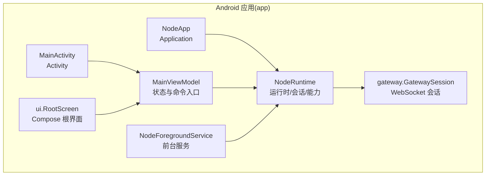
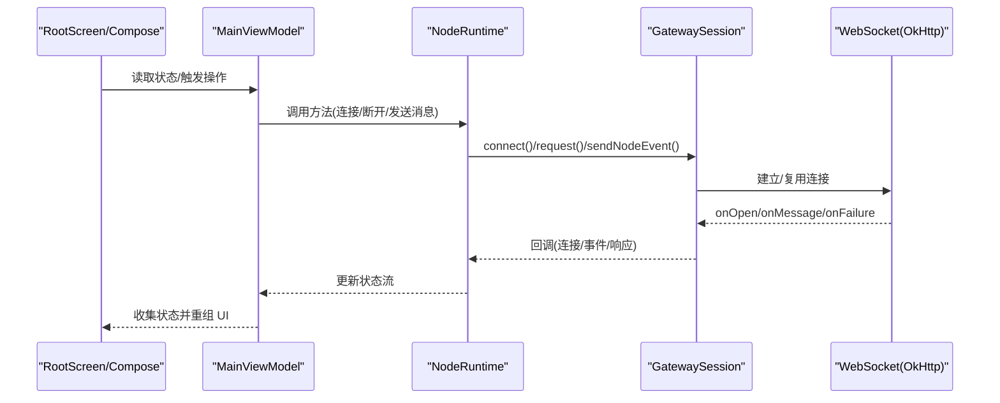
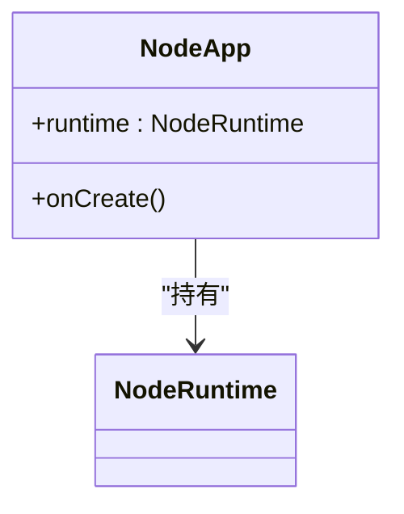
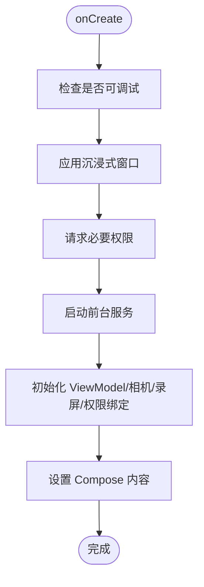
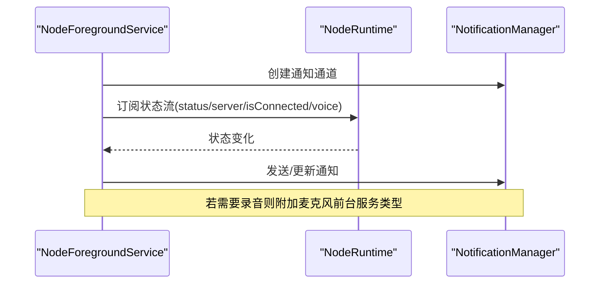
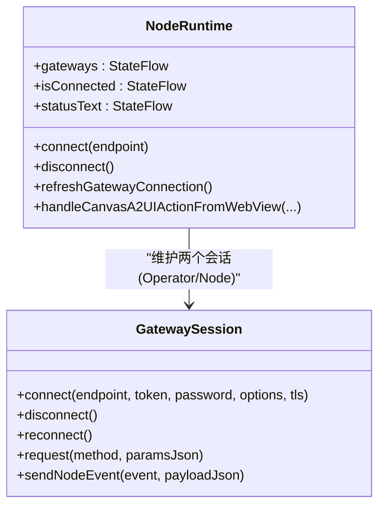
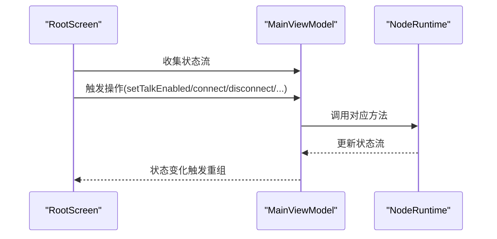
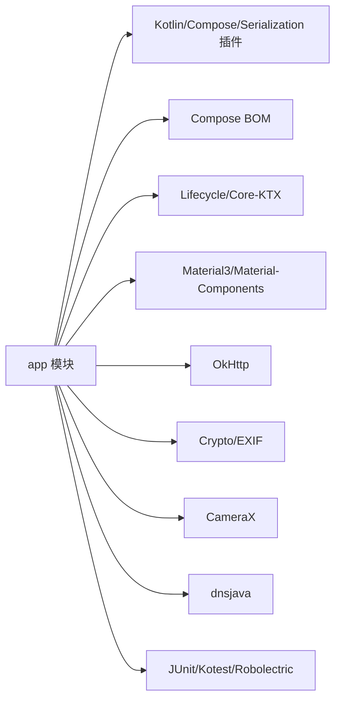

# 开发指南

<cite>
**本文引用的文件**
- [apps/android/app/build.gradle.kts](file://apps/android/app/build.gradle.kts)
- [apps/android/gradle.properties](file://apps/android/gradle.properties)
- [apps/android/settings.gradle.kts](file://apps/android/settings.gradle.kts)
- [apps/android/build.gradle.kts](file://apps/android/build.gradle.kts)
- [apps/android/app/src/main/AndroidManifest.xml](file://apps/android/app/src/main/AndroidManifest.xml)
- [apps/android/app/src/main/java/ai/openclaw/android/NodeApp.kt](file://apps/android/app/src/main/java/ai/openclaw/android/NodeApp.kt)
- [apps/android/app/src/main/java/ai/openclaw/android/MainActivity.kt](file://apps/android/app/src/main/java/ai/openclaw/android/MainActivity.kt)
- [apps/android/app/src/main/java/ai/openclaw/android/NodeForegroundService.kt](file://apps/android/app/src/main/java/ai/openclaw/android/NodeForegroundService.kt)
- [apps/android/app/src/main/java/ai/openclaw/android/NodeRuntime.kt](file://apps/android/app/src/main/java/ai/openclaw/android/NodeRuntime.kt)
- [apps/android/app/src/main/java/ai/openclaw/android/MainViewModel.kt](file://apps/android/app/src/main/java/ai/openclaw/android/MainViewModel.kt)
- [apps/android/app/src/main/java/ai/openclaw/android/ui/RootScreen.kt](file://apps/android/app/src/main/java/ai/openclaw/android/ui/RootScreen.kt)
- [apps/android/app/src/main/java/ai/openclaw/android/gateway/GatewaySession.kt](file://apps/android/app/src/main/java/ai/openclaw/android/gateway/GatewaySession.kt)
- [apps/android/app/src/main/res/values/strings.xml](file://apps/android/app/src/main/res/values/strings.xml)
- [apps/android/app/src/main/res/values/themes.xml](file://apps/android/app/src/main/res/values/themes.xml)
</cite>

## 目录

1. [简介](#简介)
2. [项目结构](#项目结构)
3. [核心组件](#核心组件)
4. [架构总览](#架构总览)
5. [详细组件分析](#详细组件分析)
6. [依赖关系分析](#依赖关系分析)
7. [性能考虑](#性能考虑)
8. [故障排查指南](#故障排查指南)
9. [结论](#结论)
10. [附录](#附录)

## 简介

本指南面向在 Android 平台上进行 OpenClaw 应用开发的工程师，覆盖开发环境搭建、项目导入与调试配置、代码结构与命名规范、开发流程、单元测试与 UI 测试、调试技巧与日志记录、性能分析、常见问题与重构建议，以及版本管理与发布流程。目标是帮助新成员快速上手并高质量交付功能。

## 项目结构

Android 应用位于 apps/android 目录，采用 Gradle Kotlin DSL 构建，主模块为 app。核心目录与职责概览：

- app 模块：应用实现、界面、服务、运行时与网关交互逻辑
- gradle 配置：插件版本、仓库与全局属性
- 资源：字符串与主题
- 测试：单元测试与 UI 测试（见“测试”章节）

图表来源

- [apps/android/app/src/main/java/ai/openclaw/android/NodeApp.kt](file://apps/android/app/src/main/java/ai/openclaw/android/NodeApp.kt#L1-L27)
- [apps/android/app/src/main/java/ai/openclaw/android/MainActivity.kt](file://apps/android/app/src/main/java/ai/openclaw/android/MainActivity.kt#L1-L131)
- [apps/android/app/src/main/java/ai/openclaw/android/NodeForegroundService.kt](file://apps/android/app/src/main/java/ai/openclaw/android/NodeForegroundService.kt#L1-L181)
- [apps/android/app/src/main/java/ai/openclaw/android/MainViewModel.kt](file://apps/android/app/src/main/java/ai/openclaw/android/MainViewModel.kt#L1-L175)
- [apps/android/app/src/main/java/ai/openclaw/android/NodeRuntime.kt](file://apps/android/app/src/main/java/ai/openclaw/android/NodeRuntime.kt#L1-L800)
- [apps/android/app/src/main/java/ai/openclaw/android/ui/RootScreen.kt](file://apps/android/app/src/main/java/ai/openclaw/android/ui/RootScreen.kt#L1-L430)
- [apps/android/app/src/main/java/ai/openclaw/android/gateway/GatewaySession.kt](file://apps/android/app/src/main/java/ai/openclaw/android/gateway/GatewaySession.kt#L1-L684)

章节来源

- [apps/android/app/build.gradle.kts](file://apps/android/app/build.gradle.kts#L1-L129)
- [apps/android/gradle.properties](file://apps/android/gradle.properties#L1-L5)
- [apps/android/settings.gradle.kts](file://apps/android/settings.gradle.kts#L1-L19)
- [apps/android/build.gradle.kts](file://apps/android/build.gradle.kts#L1-L7)

## 核心组件

- Application 层：NodeApp 在 Debug 构建下启用 StrictMode，便于早期发现线程与 VM 风险。
- Activity 层：MainActivity 负责沉浸式窗口、权限请求、通知权限、前台服务启动、生命周期与 UI 初始化。
- 前台服务层：NodeForegroundService 将连接状态、语音唤醒状态以通知形式呈现，并根据麦克风需求动态更新前台服务类型。
- 运行时层：NodeRuntime 统一管理网关发现、连接、事件处理、Canvas/A2UI 行为、设备能力与命令集、偏好存储与状态流。
- 视图模型层：MainViewModel 暴露状态流与操作接口，作为 UI 与 NodeRuntime 的桥梁。
- UI 层：RootScreen 使用 Jetpack Compose，承载 WebView 画布、状态指示器、悬浮按钮与底部表单。
- 网关会话层：GatewaySession 封装 WebSocket 连接、鉴权挑战、请求/响应、事件分发与自动重连。

章节来源

- [apps/android/app/src/main/java/ai/openclaw/android/NodeApp.kt](file://apps/android/app/src/main/java/ai/openclaw/android/NodeApp.kt#L1-L27)
- [apps/android/app/src/main/java/ai/openclaw/android/MainActivity.kt](file://apps/android/app/src/main/java/ai/openclaw/android/MainActivity.kt#L1-L131)
- [apps/android/app/src/main/java/ai/openclaw/android/NodeForegroundService.kt](file://apps/android/app/src/main/java/ai/openclaw/android/NodeForegroundService.kt#L1-L181)
- [apps/android/app/src/main/java/ai/openclaw/android/NodeRuntime.kt](file://apps/android/app/src/main/java/ai/openclaw/android/NodeRuntime.kt#L1-L800)
- [apps/android/app/src/main/java/ai/openclaw/android/MainViewModel.kt](file://apps/android/app/src/main/java/ai/openclaw/android/MainViewModel.kt#L1-L175)
- [apps/android/app/src/main/java/ai/openclaw/android/ui/RootScreen.kt](file://apps/android/app/src/main/java/ai/openclaw/android/ui/RootScreen.kt#L1-L430)
- [apps/android/app/src/main/java/ai/openclaw/android/gateway/GatewaySession.kt](file://apps/android/app/src/main/java/ai/openclaw/android/gateway/GatewaySession.kt#L1-L684)

## 架构总览

应用采用 MVVM + 状态流（Kotlin Flow）+ 前台服务 + WebView 画布的组合架构。NodeRuntime 作为中枢协调各子系统，MainViewModel 提供 UI 友好的状态与命令，GatewaySession 负责与网关通信，NodeForegroundService 提升用户体验与系统可见性。

图表来源

- [apps/android/app/src/main/java/ai/openclaw/android/ui/RootScreen.kt](file://apps/android/app/src/main/java/ai/openclaw/android/ui/RootScreen.kt#L1-L430)
- [apps/android/app/src/main/java/ai/openclaw/android/MainViewModel.kt](file://apps/android/app/src/main/java/ai/openclaw/android/MainViewModel.kt#L1-L175)
- [apps/android/app/src/main/java/ai/openclaw/android/NodeRuntime.kt](file://apps/android/app/src/main/java/ai/openclaw/android/NodeRuntime.kt#L1-L800)
- [apps/android/app/src/main/java/ai/openclaw/android/gateway/GatewaySession.kt](file://apps/android/app/src/main/java/ai/openclaw/android/gateway/GatewaySession.kt#L1-L684)

## 详细组件分析

### NodeApp 与 Application 生命周期

- 在 Debug 构建下启用 StrictMode，检测主线程违规与潜在泄漏。
- 持有 NodeRuntime 单例，供全局使用。

图表来源

- [apps/android/app/src/main/java/ai/openclaw/android/NodeApp.kt](file://apps/android/app/src/main/java/ai/openclaw/android/NodeApp.kt#L1-L27)
- [apps/android/app/src/main/java/ai/openclaw/android/NodeRuntime.kt](file://apps/android/app/src/main/java/ai/openclaw/android/NodeRuntime.kt#L1-L800)

章节来源

- [apps/android/app/src/main/java/ai/openclaw/android/NodeApp.kt](file://apps/android/app/src/main/java/ai/openclaw/android/NodeApp.kt#L1-L27)

### MainActivity 与权限、沉浸式窗口

- 启用 WebView 调试（仅 Debug）。
- 请求附近 WiFi 与位置权限（按 Android 版本差异处理）。
- 启动前台服务，保持节点常驻。
- 设置沉浸式窗口，隐藏系统栏。

图表来源

- [apps/android/app/src/main/java/ai/openclaw/android/MainActivity.kt](file://apps/android/app/src/main/java/ai/openclaw/android/MainActivity.kt#L1-L131)

章节来源

- [apps/android/app/src/main/java/ai/openclaw/android/MainActivity.kt](file://apps/android/app/src/main/java/ai/openclaw/android/MainActivity.kt#L1-L131)

### NodeForegroundService 与通知

- 创建低重要性通知通道，显示连接状态与语音唤醒状态。
- 根据是否需要录音动态设置前台服务类型，避免权限不足导致崩溃。
- 提供停止动作，触发断开连接并停止服务。

图表来源

- [apps/android/app/src/main/java/ai/openclaw/android/NodeForegroundService.kt](file://apps/android/app/src/main/java/ai/openclaw/android/NodeForegroundService.kt#L1-L181)
- [apps/android/app/src/main/java/ai/openclaw/android/NodeRuntime.kt](file://apps/android/app/src/main/java/ai/openclaw/android/NodeRuntime.kt#L1-L800)

章节来源

- [apps/android/app/src/main/java/ai/openclaw/android/NodeForegroundService.kt](file://apps/android/app/src/main/java/ai/openclaw/android/NodeForegroundService.kt#L1-L181)

### NodeRuntime 与 GatewaySession

- NodeRuntime 统一管理网关发现、连接、事件处理、Canvas/A2UI 行为、设备能力与命令集、偏好存储与状态流。
- GatewaySession 封装 WebSocket 连接、鉴权挑战、请求/响应、事件分发与自动重连；支持 TLS 参数与指纹校验。

图表来源

- [apps/android/app/src/main/java/ai/openclaw/android/NodeRuntime.kt](file://apps/android/app/src/main/java/ai/openclaw/android/NodeRuntime.kt#L1-L800)
- [apps/android/app/src/main/java/ai/openclaw/android/gateway/GatewaySession.kt](file://apps/android/app/src/main/java/ai/openclaw/android/gateway/GatewaySession.kt#L1-L684)

章节来源

- [apps/android/app/src/main/java/ai/openclaw/android/NodeRuntime.kt](file://apps/android/app/src/main/java/ai/openclaw/android/NodeRuntime.kt#L1-L800)
- [apps/android/app/src/main/java/ai/openclaw/android/gateway/GatewaySession.kt](file://apps/android/app/src/main/java/ai/openclaw/android/gateway/GatewaySession.kt#L1-L684)

### MainViewModel 与 UI

- MainViewModel 暴露所有状态流与操作方法，UI 通过收集状态流驱动渲染。
- RootScreen 使用 Compose 承载 WebView 画布、状态指示器、悬浮按钮与底部表单。

图表来源

- [apps/android/app/src/main/java/ai/openclaw/android/MainViewModel.kt](file://apps/android/app/src/main/java/ai/openclaw/android/MainViewModel.kt#L1-L175)
- [apps/android/app/src/main/java/ai/openclaw/android/ui/RootScreen.kt](file://apps/android/app/src/main/java/ai/openclaw/android/ui/RootScreen.kt#L1-L430)

章节来源

- [apps/android/app/src/main/java/ai/openclaw/android/MainViewModel.kt](file://apps/android/app/src/main/java/ai/openclaw/android/MainViewModel.kt#L1-L175)
- [apps/android/app/src/main/java/ai/openclaw/android/ui/RootScreen.kt](file://apps/android/app/src/main/java/ai/openclaw/android/ui/RootScreen.kt#L1-L430)

## 依赖关系分析

- 构建与插件：应用模块启用 Kotlin Android、Compose 编译与序列化插件；Kotlin JVM 目标为 17；启用 allWarningsAsErrors。
- 依赖：Compose BOM、Core/KTX、Lifecycle、Navigation、Material3、OkHttp、安全加密、CameraX、dnsjava 等。
- 打包：排除 META-INF/LGPL2.1 等条目；禁用部分 Lint 警告；测试包含 Android 资源。
- 清单：声明网络、定位、相机、录音、通知、Nearby WiFi 等权限；定义前台服务类型；主题与图标。

图表来源

- [apps/android/app/build.gradle.kts](file://apps/android/app/build.gradle.kts#L1-L129)

章节来源

- [apps/android/app/build.gradle.kts](file://apps/android/app/build.gradle.kts#L1-L129)
- [apps/android/app/src/main/AndroidManifest.xml](file://apps/android/app/src/main/AndroidManifest.xml#L1-L50)

## 性能考虑

- 线程与协程：NodeRuntime 使用 SupervisorJob + IO 线程池处理网络与任务；避免阻塞主线程。
- 状态流：通过 Flow 的 distinctUntilChanged 与合并流减少重复重组。
- WebView：启用 DOM Storage 与兼容混合内容模式；在 Debug 下输出页面加载与错误日志，便于诊断。
- 前台服务：仅在需要录音时附加麦克风前台服务类型，降低权限门槛。
- 打包与 Lint：排除不必要资源，严格警告级别，提升构建稳定性。

章节来源

- [apps/android/app/src/main/java/ai/openclaw/android/NodeRuntime.kt](file://apps/android/app/src/main/java/ai/openclaw/android/NodeRuntime.kt#L1-L800)
- [apps/android/app/src/main/java/ai/openclaw/android/ui/RootScreen.kt](file://apps/android/app/src/main/java/ai/openclaw/android/ui/RootScreen.kt#L1-L430)
- [apps/android/app/src/main/java/ai/openclaw/android/NodeForegroundService.kt](file://apps/android/app/src/main/java/ai/openclaw/android/NodeForegroundService.kt#L1-L181)
- [apps/android/app/build.gradle.kts](file://apps/android/app/build.gradle.kts#L1-L129)

## 故障排查指南

- WebView 错误与控制台日志
  - 在 Debug 构建下，WebViewClient 与 WebChromeClient 会输出错误码、HTTP 错误与控制台信息，便于定位页面问题。
- 权限相关
  - 附近 WiFi 设备权限与通知权限需在 Android 9+ 与 13+ 分别处理；录音权限缺失会导致语音唤醒暂停或失败。
- 网络与 TLS
  - GatewaySession 支持 TLS 参数与指纹校验；若连接失败，检查端点、证书指纹与网络策略。
- 前台服务类型
  - 当语音唤醒开启且具备录音权限时，前台服务类型需包含麦克风；否则系统可能拒绝启动。
- 严格模式
  - Debug 下启用 StrictMode，可提前暴露主线程耗时与资源泄漏问题。

章节来源

- [apps/android/app/src/main/java/ai/openclaw/android/ui/RootScreen.kt](file://apps/android/app/src/main/java/ai/openclaw/android/ui/RootScreen.kt#L317-L410)
- [apps/android/app/src/main/java/ai/openclaw/android/MainActivity.kt](file://apps/android/app/src/main/java/ai/openclaw/android/MainActivity.kt#L97-L129)
- [apps/android/app/src/main/java/ai/openclaw/android/NodeForegroundService.kt](file://apps/android/app/src/main/java/ai/openclaw/android/NodeForegroundService.kt#L138-L153)
- [apps/android/app/src/main/java/ai/openclaw/android/gateway/GatewaySession.kt](file://apps/android/app/src/main/java/ai/openclaw/android/gateway/GatewaySession.kt#L242-L252)
- [apps/android/app/src/main/java/ai/openclaw/android/NodeApp.kt](file://apps/android/app/src/main/java/ai/openclaw/android/NodeApp.kt#L11-L24)

## 结论

本指南从环境、结构、核心组件、依赖与性能等方面梳理了 Android 应用的开发要点。遵循本文档的流程与最佳实践，可显著提升开发效率与质量，确保在复杂场景（如网关通信、语音唤醒、屏幕录制、相机采集）下的稳定性与可维护性。

## 附录

### 开发环境与导入

- Android Studio：推荐使用最新稳定版，启用 Gradle Kotlin DSL 支持。
- 克隆仓库后，直接在 AS 中打开根目录，Gradle 自动解析多模块与插件。
- 关键 Gradle 配置：
  - 项目级 build.gradle.kts：统一插件版本
  - settings.gradle.kts：仓库与模块包含
  - app/build.gradle.kts：编译与依赖、打包、Lint、测试选项
  - gradle.properties：JVM 参数与 AndroidX 开关

章节来源

- [apps/android/build.gradle.kts](file://apps/android/build.gradle.kts#L1-L7)
- [apps/android/settings.gradle.kts](file://apps/android/settings.gradle.kts#L1-L19)
- [apps/android/app/build.gradle.kts](file://apps/android/app/build.gradle.kts#L1-L129)
- [apps/android/gradle.properties](file://apps/android/gradle.properties#L1-L5)

### 命名规范与代码组织

- 包名：ai.openclaw.android
- 类型命名：采用 PascalCase；状态流以 StateFlow/行为以动词短语命名（如 voiceWakeStatusText）
- 文件组织：按功能域划分（ui、gateway、node、voice、protocol），便于检索与复用
- 资源：strings.xml、themes.xml 等集中管理

章节来源

- [apps/android/app/src/main/res/values/strings.xml](file://apps/android/app/src/main/res/values/strings.xml#L1-L4)
- [apps/android/app/src/main/res/values/themes.xml](file://apps/android/app/src/main/res/values/themes.xml#L1-L8)

### 开发流程

- 新功能开发：先在 NodeRuntime/ViewModel 中定义状态与方法，再在 UI 中消费状态与触发操作
- 网关交互：通过 GatewaySession 的 request/sendNodeEvent 完成 RPC 与事件传递
- 前台服务：在需要长连接与后台能力时，确保通知通道与前台服务类型正确配置
- WebView：通过 CanvasController 与 RootScreen 的 WebView 桥接处理 A2UI 动作

章节来源

- [apps/android/app/src/main/java/ai/openclaw/android/NodeRuntime.kt](file://apps/android/app/src/main/java/ai/openclaw/android/NodeRuntime.kt#L1-L800)
- [apps/android/app/src/main/java/ai/openclaw/android/MainViewModel.kt](file://apps/android/app/src/main/java/ai/openclaw/android/MainViewModel.kt#L1-L175)
- [apps/android/app/src/main/java/ai/openclaw/android/ui/RootScreen.kt](file://apps/android/app/src/main/java/ai/openclaw/android/ui/RootScreen.kt#L1-L430)
- [apps/android/app/src/main/java/ai/openclaw/android/gateway/GatewaySession.kt](file://apps/android/app/src/main/java/ai/openclaw/android/gateway/GatewaySession.kt#L1-L684)

### 单元测试与 UI 测试

- 单元测试：使用 JUnit 4、Kotest 断言与 Robolectric；示例测试覆盖 GatewaySession、Canvas 控制器、SMS 管理器、协议常量等
- UI 测试：基于 Compose 测试框架与 Robolectric，验证状态流与交互行为
- 测试配置：启用 includeAndroidResources，使用 JUnit Platform

章节来源

- [apps/android/app/build.gradle.kts](file://apps/android/app/build.gradle.kts#L118-L128)

### 调试技巧与日志记录

- WebView：Debug 下输出错误码、HTTP 错误与控制台日志，便于前端问题定位
- 网络：GatewaySession 输出连接与事件日志，便于排查握手与鉴权问题
- 权限：在 UI 中显式提示权限缺失，避免静默失败
- 严格模式：Debug 下启用 StrictMode，尽早暴露主线程与资源问题

章节来源

- [apps/android/app/src/main/java/ai/openclaw/android/ui/RootScreen.kt](file://apps/android/app/src/main/java/ai/openclaw/android/ui/RootScreen.kt#L342-L398)
- [apps/android/app/src/main/java/ai/openclaw/android/gateway/GatewaySession.kt](file://apps/android/app/src/main/java/ai/openclaw/android/gateway/GatewaySession.kt#L254-L292)
- [apps/android/app/src/main/java/ai/openclaw/android/NodeApp.kt](file://apps/android/app/src/main/java/ai/openclaw/android/NodeApp.kt#L11-L24)

### 版本管理与发布

- 版本号：app/build.gradle.kts 中 versionCode 与 versionName 用于标识构建版本
- 输出命名：通过 androidComponents 钩子生成包含版本名与构建类型的 APK 文件名
- 发布准备：确保清单权限齐全、资源与主题符合要求；在 Release 构建中关闭调试特性

章节来源

- [apps/android/app/build.gradle.kts](file://apps/android/app/build.gradle.kts#L20-L72)
- [apps/android/app/src/main/AndroidManifest.xml](file://apps/android/app/src/main/AndroidManifest.xml#L1-L50)
